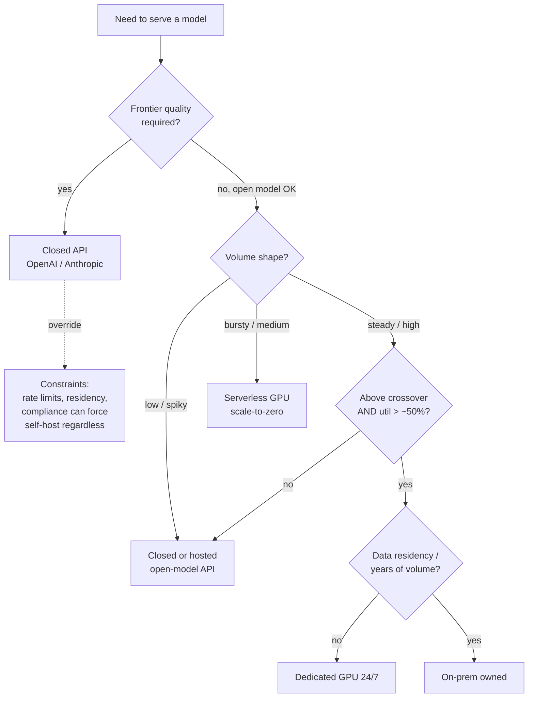

# Lecture 9: Buy vs rent vs call — the deploy decision and break-even math

> "Should we self-host?" is the most expensive question an AI team argues about with zero numbers on the table. Someone read that GPT-4-class tokens are "pricey at scale," someone else heard a vLLM box does a million tokens for pennies, and the meeting ends in a vibe. This lecture kills the vibe. You'll learn the four ways to run a model in production and the exact cost structure of each, you'll derive `cost_per_1M_tokens` for a self-hosted box straight out of a load test, and you'll build the one chart that ends the argument: monthly cost versus monthly token volume, with the crossover point marked where renting a GPU 24/7 finally beats calling the API. After this you can walk into that meeting, put a chart on the screen, and say "below 90M tokens a month we call the API; above it we self-host" — and defend every number.

**Prerequisites:** you can load-test a vLLM endpoint and read sustained tokens/sec (Lecture 8); rough VRAM/GPU literacy (Lectures 6–7); you know prompt vs completion tokens are billed separately. · **Reading time:** ~28 min · **Part of:** Phase 10 (LLMOps) Week 2

---

## The core idea (plain language)

There are exactly four places a token can be generated for you, and they differ in *who owns the idle time*.

1. **Closed API** (OpenAI, Anthropic, Google) — you rent the model by the token. Zero ops, frontier quality, and you pay *nothing* when no one is calling. The provider owns all the idle time. You pay a premium per token for that convenience, and you get their frontier model as a bonus.
2. **Serverless GPU** (Modal, RunPod Serverless, Baseten, Replicate) — you rent a GPU by the *second*, and it scales to zero between requests. You own a little idle time (warm pools) and eat a **cold start** when a request arrives on a cold container. Covered in depth next lecture; here it's the middle curve on the chart.
3. **Dedicated GPU 24/7** — you rent a box by the hour and it's *yours* whether it's busy or not. Fixed `$/hr`, forever. You own *all* the idle time. Cheap per token only if you keep it busy.
4. **On-prem owned hardware** — you buy the GPU (capex), rack it, power it, and amortize it over years. Lowest marginal cost at massive sustained volume, plus data-residency and no dependency on a vendor's rate limits — but the longest commitment and the biggest ops burden.

The single mental model that ties them together: **hosted APIs charge you per token (a line that rises with volume); a dedicated box charges you per hour (a flat line regardless of volume).** A flat line and a rising line cross exactly once. Below the crossover, the API is cheaper because you're not paying for an idle GPU. Above it, the box is cheaper because you've spread its fixed cost over so many tokens that the per-token cost falls below the API's price. The entire "buy vs rent vs call" decision is *finding that crossover volume and asking which side of it you live on.*

The chart is the deliverable, but the discipline is honesty: price *both* token directions, re-check that a quantized self-host is still the same product, and pad the raw `$/hr` with the ops tax nobody puts on the slide. Skip any of those and the chart lies confidently.

## How it actually works (mechanism, from first principles)

### The cost structure of each option, as a formula

Write monthly cost as a function of `V` = tokens generated per month.

- **Closed API / hosted open-model API:** `cost = V_in × price_in + V_out × price_out`. A straight line through the origin. No fixed cost, no floor. There are *two* prices — prompt (input) and completion (output) — and you must price both (more below).
- **Dedicated GPU 24/7:** `cost = hours_in_month × gpu_hourly_rate`. A **flat horizontal line** — ~730 hours/month × `$/hr`, independent of `V`, right up until you saturate the box and need a second one (then it steps up).
- **Serverless GPU:** `cost ≈ (active_seconds × per_second_rate) + cold_start_overhead + warm_pool_idle`. Near-zero at low volume (you pay only while actually computing), rising roughly linearly with volume but with a *lower slope* than the API (you pay GPU-seconds, not a token markup) — offset up by whatever warm capacity you keep to hide cold starts.
- **On-prem:** `cost = amortized_capex_per_month + power + cooling + ops`. Flat like dedicated, but the flat level is lower per token at very high volume (no cloud margin) and there's a large up-front commitment.

Plot all four with cost on the y-axis and `V` on the x-axis and the shape of the decision falls out: the API line starts at zero and climbs; the dedicated line sits flat; they cross.

```
monthly $
  ^
  |                                  ___ hosted API (slope = $/token)
  |                               _-'
  |                            _-'
  |  dedicated 24/7  _________X__________________  (flat = 730h × $/hr)
  |              ___/       _-' crossover
  |  serverless_/       _-'
  |          _/     _-'
  |________/____-'________________________________> tokens / month
           low    ^crossover volume    high
```

### Deriving cost_per_1M_tokens for self-host from a load test

This is the number that matters, and it comes straight out of the load test you ran in Lecture 8. You measured **sustained tokens per second** at your best concurrency tier — call it `T` tok/s. The GPU costs `R` dollars per hour. Then:

```
cost_per_1M_tokens = (1e6 / T / 3600) × R
```

Read it left to right. `1e6 / T` = seconds to produce a million tokens at your sustained rate. Divide by 3600 to convert seconds to hours. Multiply by `R` ($/hr) to get dollars. That's it — the cost to produce 1M tokens *if the box runs flat out at your measured throughput*.

Worked: an A10 rents for about **$0.75/hr** (approximate, varies by provider/region), and your load test sustained **1,500 tok/s** at concurrency 64.

```
seconds per 1M tokens = 1,000,000 / 1,500          = 666.7 s
hours per 1M tokens    = 666.7 / 3600              = 0.185 hr
cost per 1M tokens     = 0.185 × $0.75             ≈ $0.139
```

So ~**$0.14 per 1M tokens** — *at full utilization*. Hold that number; it is the theoretical floor and it is a lie until you multiply it by two correction factors (utilization and ops tax) below.

The load-bearing subtlety: that $0.14 assumes the GPU is **always busy**. Real traffic is spiky. If your box is only busy 30% of the time (nights, weekends, off-peak), you still pay for 100% of the hours, so your *effective* cost per token is `0.14 / 0.30 ≈ $0.47/1M`. **Utilization is the hidden multiplier that turns a cheap-looking self-host into an expensive one.**

One more subtlety that trips people up: your load test measured *output* tokens/sec (decode throughput), but the box also spent real GPU-time on *prefill* reading the prompt. When your workload is input-heavy (RAG, long system prompts), a chunk of the box's time goes to prefill that your decode-tokens/sec number never counted. If you price only against output tokens you'll *understate* self-host cost per useful token. Cleanest fix: measure total tokens processed (input + output) per second under a realistic prompt/completion mix, and price against total tokens.

### The crossover: where dedicated beats the API

Set the two monthly costs equal and solve for volume. For a clean first cut, blend input and output into one `$_per_1M` at your real ratio:

```
dedicated flat cost  =  API linear cost
730 × R              =  V × blended_price_per_token

crossover_V = (730 × R) / blended_price_per_1M   (answer in millions of tokens/month)
```

Below `crossover_V`, the API's linear cost is under the box's flat cost — call the API. Above it, the box wins. This is the same statement as "dedicated wins once `hours_used × $/hr` beats `tokens × $/token`," just rearranged to give you a single number you can compare your forecast against.

### The decision, as a tree



The cost chart decides the `D → G → H` path. The dashed override matters: constraints (rate limits, data can't leave the VPC, compliance) can force self-host even when the chart says "call the API." Note those explicitly so nobody re-litigates them mid-meeting.

## Worked example

You serve **Qwen2.5-7B**. Decision: keep calling a hosted open-model API, or rent a dedicated A10 24/7? You forecast **150M tokens/month** and expect steady daytime traffic.

**Step 1 — establish the hosted price, both directions.** A hosted open-model API (Together/Fireworks-class, approximate) prices a 7B-ish model around **$0.20 per 1M tokens** for *both* input and output. Your average request is a 1,000-token prompt (fat system prompt + RAG context) producing a 200-token answer — an **input:output ratio of 5:1**. Of your 150M tokens/month, that split is ~125M input + 25M output.

```
API monthly = (125M × $0.20/1M) + (25M × $0.20/1M)
            = $25.00 + $5.00
            = $30.00 / month
```

(For a frontier closed model at, say, $3/1M input and $15/1M output — approximate — the *same* traffic would be `125 × $3 + 25 × $15 = $375 + $375 = $750/month`. The provider choice moves the line's slope by 25×. Always price the model you'd actually use.)

**Step 2 — establish the self-host cost.** From your load test: sustained 1,500 tok/s, A10 at $0.75/hr, 24/7 = 730 hr/month.

```
dedicated monthly = 730 × $0.75 = $547.50 / month (flat)
```

**Step 3 — the naive crossover.** Using the hosted open-model price:

```
crossover_V = (730 × $0.75) / $0.20 per 1M
            = $547.50 / $0.20
            = 2,737 (millions of tokens)
            ≈ 2.7 billion tokens / month
```

At your forecast of 150M tokens/month you are **nowhere near** the crossover. The hosted open-model API costs you $30/month; the dedicated box costs $547/month whether you use it or not. **Call the API** — it's ~18× cheaper at your volume, and you'd need to grow ~18× before the box even breaks even.

This is the result that surprises engineers: hosted open-model APIs are *so cheap* that self-hosting a small model rarely pays on cost alone until you're at billions of tokens/month. Self-hosting a 7B usually wins for reasons *other* than raw price: data residency, latency control, no rate limits, custom LoRAs (Lecture 5), or avoiding a frontier model's per-token markup.

**Step 4 — now make it honest.** The $547 flat cost assumed 100% utilization. Your traffic is daytime-only — realistically ~40% duty cycle. And self-hosting isn't free ops. Apply corrections:

- **Utilization:** you pay 730 hrs but only use ~292. Effective cost/token roughly 2.5×; the *flat* monthly bill stays $547 — utilization doesn't lower your bill, it raises your effective per-token cost. To match 150M useful tokens you're still paying $547.
- **Ops tax (see below):** add ~30–50% for on-call, upgrades, monitoring, the intern who OOMs the box on a Friday. Call the *true* dedicated cost `$547 × 1.4 ≈ $766/month`.

The honest crossover using the frontier API price (the realistic alternative if you needed frontier quality) is `766 / (blended $6/1M) ≈ 128M tokens/month` — suddenly you're *near* your forecast, and the self-host conversation becomes real. **The alternative you're comparing against changes the answer completely.** Against a cheap open-model API: never self-host at this scale. Against a frontier API: self-hosting a good-enough open model starts paying around your current volume.

**Step 5 — where does serverless land?** Say a serverless GPU bills $0.0006/sec of active compute, and at 1,500 tok/s your average 1,200-token request (1,000 in + 200 out) occupies the GPU ~0.8s → ~$0.00048/request. At 150M tokens ≈ 125K requests/month that's ~$60/month of *active* compute — plus cold-start amortization. If a cold start costs ~20s of load time and you eat one per, say, 500 requests (the rest hit a warm container), that's `125K/500 × 20s × $0.0006 ≈ $3/month` of cold-start overhead, plus whatever a `min_replicas=1` warm pool costs if you can't tolerate cold latency. So serverless sits around **$60–120/month here** — above the $30 cheap-API line but with far more headroom before it crosses the $547 dedicated line, and it self-scales with bursts. That's the "middle curve" the chart shows; next lecture quantifies it properly.

## Building the break-even chart

`breakeven.py` is just these curves evaluated over a volume axis. Skeleton:

```python
import numpy as np, matplotlib.pyplot as plt

V = np.linspace(0, 3e9, 500)              # tokens/month, 0 .. 3B
in_frac, out_frac = 5/6, 1/6              # your measured 5:1 input:output

# hosted open-model API: price both directions
p_in, p_out = 0.20e-6, 0.20e-6            # $/token
api = V*in_frac*p_in + V*out_frac*p_out

# dedicated 24/7 with ops tax; steps when it saturates one box
box_tokens_mo = 1500 * 3600 * 730         # ~3.94B tok/mo at 100% util
n_boxes = np.ceil(np.maximum(V,1)/box_tokens_mo)
dedicated = n_boxes * 730 * 0.75 * 1.4    # 1.4 = ops-tax fudge

# serverless: low slope + small cold-start term
serverless = V * 0.0006/1500 + 5          # ~$/token active + tiny warm floor

plt.plot(V, api, label="hosted API")
plt.plot(V, dedicated, label="dedicated 24/7 (+ops tax)")
plt.plot(V, serverless, label="serverless")
cross = (730*0.75*1.4) / ((in_frac*p_in+out_frac*p_out)*1e6)  # in M tokens
plt.axvline(cross*1e6, ls="--"); plt.legend()
```

Three details that make it honest rather than decorative: (1) the API line uses **both** token prices at your real ratio; (2) the dedicated line uses `ceil()` so it **steps** when you outgrow one GPU rather than pretending one box scales forever; (3) it carries the **ops-tax fudge** and you'd overlay the utilization-corrected effective cost, not just the 100%-util fantasy. Mark the crossover with a vertical line and put your forecast volume on the chart so the reader sees which side you're on.

## How it shows up in production

- **The prompt-token bill dwarfs the completion bill and nobody modeled it.** A RAG app with a 3,000-token retrieved context and a 150-token answer is *20:1* input:output. If you priced only output tokens (the number people fixate on), your forecast is off by an order of magnitude. Price both, using your *actual* measured input:output ratio from traces — not a guess. Prompt caching (Anthropic) or automatic prefix caching (vLLM, Lecture 3) can slash the input side, so model your *cached* input price if you'll use it.
- **The idle GPU is a silent budget fire.** A dedicated box at 20% utilization is billing you 24/7 to do nothing 80% of the time. This is the most common self-hosting regret: the crossover math said "self-host!" assuming full utilization, reality delivered spiky traffic, and effective cost/token came in 4× the estimate. Serverless exists precisely to kill this failure mode.
- **Quantization quietly changed the product you're pricing.** Someone benchmarks an int4 (AWQ) 7B at $0.14/1M and compares it to fp16-quality on the hosted API "for the same model." It is *not* the same model — quantization can shift eval scores. If you didn't re-run your evals post-quant, your cheap cost/1M is comparing a worse product to a better one. Re-evaluate quality *first*, then compare cost only if quality holds.
- **The crossover moves under you.** GPU spot prices drop, a provider cuts token prices (they do, often), your traffic doubles, you switch to a bigger model. The chart is a snapshot; re-run `breakeven.py` quarterly. A self-host decision that was right in Q1 can be wrong by Q3 after a provider price cut.
- **Rate limits and data residency override the math.** Sometimes the API is cheaper and you *still* self-host — because the closed provider won't give you the QPS you need, or your data can't legally leave your VPC. These are constraints, not cost curves; note them explicitly so the chart doesn't get overruled by surprise in the meeting.
- **Reserved/committed-use discounts flatten the API slope.** Frontier providers offer volume commits and Batch API (~50% off async). A committed-use discount lowers the API line's slope and pushes the crossover *out* — self-hosting has to clear a higher bar. Model the discounted price if you'd actually commit.

## Common misconceptions & failure modes

- **"Self-hosting is obviously cheaper at scale."** Only above the crossover, only at high utilization, and only after the ops tax. For a small open model versus a cheap hosted open-model API, the crossover can be *billions* of tokens/month. Do the arithmetic before you believe the slogan.
- **"cost_per_1M from the load test is my real cost."** It's the *floor* at 100% utilization with zero ops. Divide by your real duty cycle and multiply by the ops-tax factor to get reality. The gap between floor and real is routinely 2–4×.
- **"I only need to price output tokens."** Prompt tokens are billed too, cost VRAM (KV cache) on self-host, and often *outnumber* output tokens 5:1 to 20:1 in RAG/agent workloads. Ignoring them is the most common costing error in this whole phase.
- **"Quantized self-host is the same model, just cheaper."** Quantization is a quality knob. Compare cost only after confirming eval parity; otherwise you're pricing a downgrade.
- **"The dedicated line is truly flat."** It's flat until you saturate the box, then it *steps* — a second GPU is another full flat cost. If your volume needs 1.3 GPUs' worth of throughput, you pay for 2. Model the steps at high volume, not one smooth flat line.
- **"Serverless is basically free because it scales to zero."** Idle is cheap, but cold starts add latency and you'll pay for a warm pool to hide them. Its curve is low-slope, not zero. (Next lecture quantifies the cold-start amortization.)
- **"On-prem capex is a one-time cost."** Amortize it (2–3 year life), then add power, cooling, rack space, and the fact that the hardware depreciates as newer GPUs ship. Per-month amortized capex is the number that goes on the chart, not the sticker price.

## Rules of thumb / cheat sheet

- **`cost_per_1M = (1e6 / sustained_tok_per_sec / 3600) × gpu_$/hr`.** Memorize this; it's the whole self-host cost floor in one line.
- **`crossover_V = (730 × $/hr) / $_per_1M`.** Below it, call the API; above it, rent the box.
- **Always price input AND output** at your *measured* input:output ratio (pull it from traces, don't guess). RAG/agents skew heavily toward input.
- **Multiply the load-test cost/1M by `1 / utilization`** to get effective cost. A box at 30% duty cycle costs ~3.3× its flat-out number per token.
- **Add a 30–50% ops-tax fudge factor** to any self-host flat cost (on-call, upgrades, monitoring, idle firefighting). Break-even is never raw `$/hr`.
- **Re-run evals before comparing quantized self-host to fp16 API** — cost parity is meaningless without quality parity.
- **Pick the alternative you'd actually use.** Cheap open-model API and frontier API differ ~25× in slope; the crossover answer flips depending on which one you're escaping.
- **Volume, spiky → API or serverless. Volume, steady & high → dedicated. Volume, massive & sustained + residency → on-prem.** Match the option to the shape of your traffic, not to which sounds cool.
- **Re-run the chart quarterly.** Prices and traffic move; the crossover moves with them.
- **Constraints trump curves.** Rate limits, data residency, and compliance can force a decision the cost chart argues against — note them on the chart.

## Connect to the lab

Week 2, Step 4 is this lecture as code: `results/breakeven.py` takes your Lecture-8 sustained tokens/sec, computes `cost_per_1M` with the formula above, and plots monthly cost vs monthly token volume for dedicated-24/7 (flat, stepping at saturation), hosted-API (linear, priced on *both* input and output at your real ratio), and serverless-bursty (low-slope with cold-start amortization), then marks the crossover volume — saving `breakeven.png`. Step 5 turns that chart into a one-paragraph recommendation for *your* measured numbers, including the utilization and ops-tax corrections so the crossover you report is honest, not the 100%-utilization fantasy.

## Going deeper (optional)

- **Provider pricing pages (the ground truth, always drifting):** OpenAI (`openai.com/api/pricing`), Anthropic (`anthropic.com/pricing`), and hosted open-model APIs Together (`together.ai`) and Fireworks (`fireworks.ai`). Read the *per-1M input vs output* columns — the split is the whole point of this lecture.
- **Serverless GPU docs (cold starts, per-second billing, autoscaling):** Modal (`modal.com/docs`), Baseten (`docs.baseten.co`), RunPod (`docs.runpod.io`), Replicate (`replicate.com/docs`). Next lecture leans on these.
- **Batch API discounts:** search "OpenAI Batch API pricing" and "Anthropic Message Batches" — ~50% off for async, non-urgent jobs; a real lever on the API slope.
- **Prompt / prefix caching to cut the input bill:** search "Anthropic prompt caching" and "vLLM automatic prefix caching" — both attack the prompt-token side that dominates RAG cost.
- **FinOps framing:** the FinOps Foundation (`finops.org`) for the general "unit economics of cloud" mindset; search "LLM cost per token unit economics" for LLM-specific writeups.
- **GPU spot/market pricing:** Vast.ai and RunPod community pricing, and search "cloud GPU price comparison A10 L4 A100 H100" to sanity-check the `$/hr` you plug into the formula. Prices in this lecture are approximate and date fast.

## Check yourself

1. Write the formula for `cost_per_1M_tokens` of a self-hosted box from a load test, and explain each factor.
2. Your load test sustains 1,000 tok/s on a GPU that rents for $1.20/hr. What's the cost per 1M tokens at full utilization? What is it if the box is only busy 25% of the time?
3. Why must you price prompt (input) tokens and not just completion (output) tokens? Give a workload where ignoring input tokens is a 10×+ error.
4. Derive the crossover volume where a dedicated GPU beats a hosted API. A box is $0.75/hr and the API is $0.50 per 1M tokens — what monthly volume is the crossover?
5. What two correction factors turn the load-test `cost_per_1M` "floor" into a realistic number, and roughly how big is each?
6. You benchmark an int4 self-host at $0.14/1M vs an fp16 API at $0.20/1M and declare self-host the winner. What did you forget to check, and why does it invalidate the comparison?

### Answer key

1. `cost_per_1M = (1e6 / T / 3600) × R`, where `T` = sustained tokens/sec from the load test and `R` = GPU $/hr. `1e6 / T` is seconds to make 1M tokens; `/3600` converts to hours; `×R` converts hours to dollars. It's the dollar cost of a million tokens *if the box runs flat out at `T`*.
2. `1e6 / 1000 = 1000 s = 0.2778 hr; × $1.20 = $0.333 per 1M` at full utilization. At 25% busy, effective cost = `0.333 / 0.25 = $1.33 per 1M` (you pay for 4× the hours you actually use). The flat monthly bill is unchanged; the *per-token* cost quadruples.
3. Because both are billed (by the provider) and both consume VRAM/KV-cache (on self-host), and in many workloads input tokens vastly outnumber output. A RAG app with a 3,000-token retrieved context and a 150-token answer is 20:1 input:output — pricing only output undercounts total tokens by ~20×, an order-of-magnitude error.
4. `crossover_V = (730 × $/hr) / $_per_1M = (730 × 0.75) / 0.50 = 547.5 / 0.50 = 1,095` million tokens ≈ **1.1 billion tokens/month**. Below that the API is cheaper; above it the dedicated box wins.
5. **Utilization** (divide the floor by your real duty cycle — a spiky box at 25–40% busy makes effective cost/token ~2.5–4× the floor) and the **ops tax** (multiply the flat cost by ~1.3–1.5× for on-call, upgrades, monitoring, and idle firefighting). Together they routinely make the honest cost 2–4× the load-test floor.
6. You forgot to re-run your **evals after quantizing**. Int4 (AWQ/GPTQ) can shift quality versus the fp16 model the API serves, so you're comparing a possibly-worse product against a better one — the cheaper cost/1M is meaningless unless quality parity holds. Re-evaluate quality first; compare cost only if it does.
