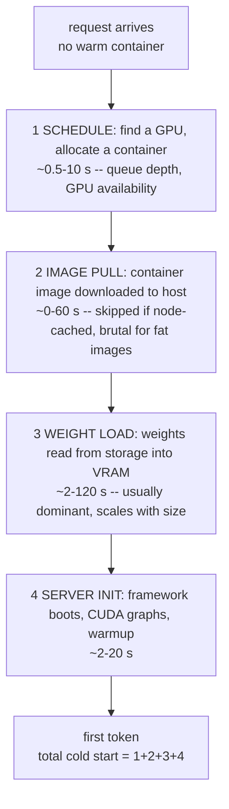
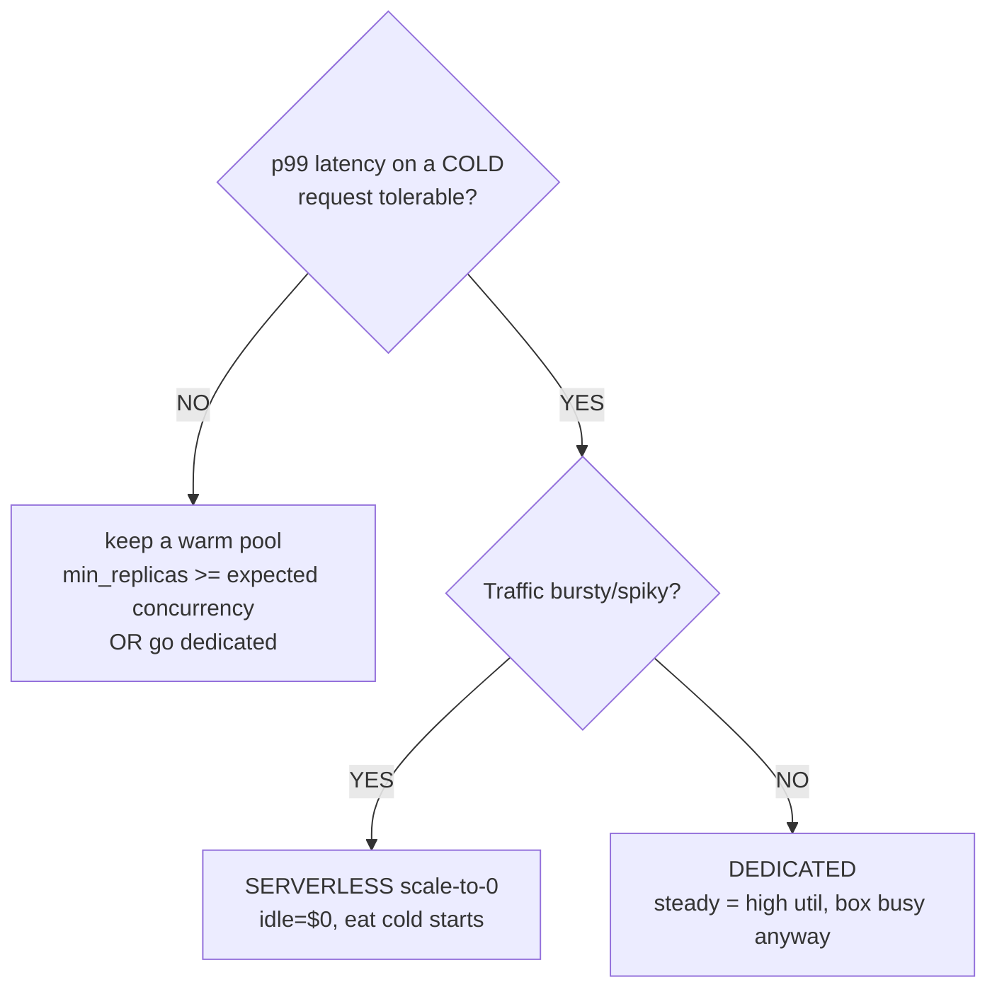

# Lecture 10: Serverless economics and LLM FinOps — cold starts, cascades, attribution, budgets

> Lecture 9 gave you the flat line (dedicated box) and the rising line (hosted API) and the crossover between them. But it hid a third curve — serverless scale-to-zero — behind the phrase "cold-start amortization," and it never told you what to *do* once the bill is real and growing. This lecture opens both. First half: the anatomy of a cold start (why a container that costs nothing at idle makes your first user wait 8–120 seconds), the mitigations that trade idle dollars for latency, and the one decision rule that tells you serverless-vs-dedicated from the *shape* of your traffic. Second half: the four FinOps levers that shave a live LLM bill without touching model quality — Batch API discounts, model cascades, per-tenant token attribution, and budget alerts with kill-switches — each with a "how much does it save and when does it apply." After this you can look at a traffic graph and a cost dashboard and say "serverless here, cascade there, batch those jobs, and wire a kill-switch at $5k/day" — with the arithmetic behind every claim.

**Prerequisites:** the four deploy options and the break-even chart (Lecture 9); you know cost = flat + linear and that idle GPUs bill you for nothing; you've touched a LiteLLM/Helicone gateway (Phase 9) and multi-LoRA serving (Lecture 5). · **Reading time:** ~30 min · **Part of:** Phase 10 (LLMOps) Week 2

## The core idea (plain language)

There are two remaining cost levers Lecture 9 pointed at but didn't open.

**Lever one — serverless scale-to-zero — is about the *idle*.** A dedicated box bills you 24/7 whether busy or not; you eat all the idle time. Serverless flips that: the platform (Modal, RunPod Serverless, Baseten, Replicate) spins your model *down to nothing* between requests, so idle costs ~$0. The price is the **cold start** — when a request arrives and no container is warm, the platform must find a GPU, pull your image, load the weights into VRAM, and start the server before it can answer. That's seconds to minutes of latency on the unlucky requests. Serverless is "pay nothing at idle, but the first user through the door waits."

**Lever two — LLM FinOps — is about the *live* bill**, the tokens you're already paying for. Four levers, none of which require re-architecting your model:

1. **Batch API** — hand async, non-urgent jobs to the provider's batch endpoint and pay ~50% less. Applies whenever latency genuinely doesn't matter.
2. **Model cascades** — try a cheap small model first, escalate to the expensive one *only* when the cheap one isn't confident. Applies whenever most requests are easy.
3. **Per-tenant token attribution** — tag every request with `tenant_id` at the gateway so you can say *who* spent the money. Applies the moment you have more than one customer or feature sharing a bill.
4. **Budget alerts and kill-switches** — a spend threshold that fires an alert or hard-stops traffic. Applies the moment a runaway loop or a scraper can bankrupt you overnight.

The unifying idea: **Lecture 9 chose where tokens are generated; this lecture makes each token cheaper and each dollar accountable, without changing the model.** Serverless attacks idle waste at the infrastructure layer; the FinOps levers attack the token bill at the gateway layer — the same LiteLLM/Helicone gateway from Phase 9.

## How it actually works (mechanism, from first principles)

### Cold-start anatomy: what actually happens between "request arrives" and "first token"

When a request lands on a serverless platform and no warm container is available, a *cold start* runs through these stages in sequence. The bar you care about is the sum:



The numbers are approximate and platform/model-dependent, but the *ranking* is stable and worth memorizing: **weight load usually dominates, image pull is the sneaky second, scheduling and init are the tail.**

Why weight load dominates: a 7B model in fp16 is ~14GB; a 70B is ~140GB. Those bytes travel from object storage (S3/GCS/registry) into GPU VRAM. At a realistic sustained ~1–2 GB/s from cloud object storage, 14GB is ~7–14 seconds *just moving bytes* before CUDA even initializes; a 70B is 10× that. This is arithmetic, not magic: **cold start scales roughly linearly with model size**, because loading weights is fundamentally a copy of `params × bytes/param` bytes.

Why image pull is sneaky: if your Docker image bundles CUDA, PyTorch, vLLM, and (mistake) the weights baked in, it can be 10–20GB. The *first* request to a fresh node pays to pull all of it; later requests on that node don't. So cold-start latency is *bimodal* — fast when the image is node-cached, slow when not — which makes p50 look fine and p99 terrifying.

### The mitigations, and exactly what each one trades

Every cold-start mitigation spends money or engineering to buy latency. Know the trade for each:

| Mitigation | What it does | You trade | Rough effect |
|---|---|---|---|
| **Warm pool / min-replicas** | Keep N containers always alive | Idle $ (you're back to paying for idle) | Eliminates cold start for the first N concurrent requests |
| **Snapshotting / memory restore** | Snapshot the loaded-model process, restore it instead of re-loading | A little storage + platform support | Cuts weight-load + init from ~30s to ~1–4s |
| **Model caching on the node** | Keep weights on a fast local/network volume, not re-pulled | Storage cost | Removes the storage→node transfer, not the →VRAM copy |
| **Smaller image** | Strip the image; don't bake weights in; slim base | Engineering time | Cuts image-pull term, sometimes to ~0 |
| **Smaller / quantized model** | int4 7B is ~3.5GB vs 14GB fp16 | Possible quality loss (re-eval!) | Weight-load term drops ~4× |

The **min-replicas** knob is the most important and most misunderstood. `min_replicas = 1` means "always keep one container warm" — that container bills you 24/7 (you've partially rebuilt a dedicated box), but the *first* concurrent request never cold-starts; only the N+1th (when you scale beyond your warm pool) eats one. So min-replicas is a dial from "pure scale-to-zero, cheapest, worst tail latency" (0) to "always warm, most expensive, best tail latency" (high). **You are literally buying down your p99 cold-start latency with idle dollars.**

**Snapshotting** (Modal calls it memory snapshots; the general technique is CRIU-style process checkpoint-restore or CUDA memory restore) is the highest-leverage mitigation because it attacks the dominant term: instead of re-loading 14GB and re-running CUDA init on every cold start, the platform snapshots the ready-to-serve process once and restores it — turning a 30-second cold start into a few seconds. Use it if your platform offers it; it's close to free latency.

### The decision rule: serverless vs dedicated from traffic shape

Lecture 9 gave you crossover volume. Here's the orthogonal axis — traffic *shape* — that decides serverless vs dedicated *at the same volume*:



Stated in one rule: **bursty/spiky traffic with tolerable p99 on cold requests → serverless; steady traffic → dedicated.** The logic: serverless only wins on the idle you avoid. If traffic is steady, there's no idle to avoid — the box would be busy anyway — so you pay serverless's per-second premium and cold-start risk for nothing; a dedicated box at high utilization is cheaper with no cold starts. If traffic is spiky (a demo hit twice a day, an internal tool used 9–5, a batch that runs at 2am), the idle you avoid is enormous and serverless wins *even though* some requests cold-start.

## Worked example

You run an internal document-summarization tool. Traffic: ~2,000 requests/day, all during business hours (9am–6pm, weekdays), essentially zero overnight and on weekends. Model: Qwen2.5-7B on an L4. GPU rents at ~$0.75/hr dedicated; serverless bills ~$0.0004/GPU-second (approximate).

**Step 1 — is this bursty or steady?** Business-hours-only, weekdays: ~9 hours × 5 days = 45 active hours out of 168 in a week — a ~27% duty cycle, and *zero* for 123 hours. Textbook bursty. Idle avoidance is the whole game.

**Step 2 — dedicated cost.** Flat: `730 hr × $0.75 = $547.50/month`, of which you use ~27% and pay for 100%. Effective cost per useful hour: `$547.50 / (0.27 × 730) ≈ $2.78/useful-hour`.

**Step 3 — serverless cost.** Say each request takes ~3 seconds of GPU time (prefill + decode for a summary). 2,000 req/day × ~22 weekdays = 44,000 req/month. Active GPU-seconds: `44,000 × 3 = 132,000 s`. Compute cost: `132,000 × $0.0004 = $52.80/month`. Cold starts: with `min_replicas = 0`, suppose the platform keeps a container ~60s after a request, so within a busy hour most requests are warm and you eat ~50 cold starts/day (morning ramp, gaps) at ~15s each — latency the *user* eats, plus a small extra billed for load seconds (`50 × 22 × 15s × $0.0004 ≈ $6.60/month`). Total serverless ≈ **$60/month**.

**Step 4 — verdict.** Serverless ~$60/month vs dedicated ~$547/month — **~9× cheaper**, purely because you stopped paying for 123 idle hours a week. The cost: the first request each morning (and after any lull) waits ~15 seconds. For an internal tool, that p99 is tolerable → **serverless wins decisively.**

**Step 5 — the flip.** Now the tool becomes customer-facing with a strict "p99 < 2s" SLO. A 15-second cold start blows it. Mitigate: set `min_replicas = 1` (one always-warm container ≈ `730 × $0.75 ≈ $547/month` — you've rebuilt the dedicated cost for the warm floor) *or* turn on snapshotting to cut cold start to ~2–3s (maybe still over SLO). With a hard latency SLO plus steady daytime traffic to keep one replica busy, **dedicated (or serverless with min_replicas=1) becomes the honest answer.** The traffic shape didn't change; the *latency tolerance* did, and that moved the decision.

## How it shows up in production

- **The demo that "worked yesterday" times out for the investor.** Scale-to-zero scaled your rarely-hit demo down overnight; the first click after 12 idle hours eats a 40-second cold start and the load balancer times out at 30s. Fix: `min_replicas = 1` for anything with an audience, or a keep-warm ping (cron hitting the endpoint every few minutes — cheaper than a full warm pool for low-traffic services).
- **p50 latency is beautiful, p99 is a cliff.** Cold starts are bimodal: warm requests fast, cold requests 10–100× slower. If you only watch averages (Lecture 8's warning), cold starts hide until a user complains. Always chart p99 and separately count cold-start events.
- **The Batch API job you forgot was async.** You moved nightly summarization to the Batch API for the 50% discount, then someone built a UI feature on top of it and users stare at a spinner for 6 hours. Batch endpoints have *hours*-scale turnaround by design; never put them behind a synchronous request.
- **"Why is our OpenAI bill $40k and who spent it?"** Without per-tenant attribution, a spiking bill is an unsolvable murder mystery. With `tenant_id` on every request in your gateway traces, it's a one-line `GROUP BY tenant_id` — and you discover one customer's runaway agent loop is 80% of the spend.
- **The runaway loop that ran all weekend.** An agent with a retry bug called the API in a tight loop from Friday night; no budget alert fired; Monday's bill is $22k. A kill-switch at a daily threshold would have capped it. Retry storms and prompt-injection loops are a top cause of surprise bills.

### Model cascades: the arithmetic of "cheap first, escalate on doubt"

A cascade routes each request to a cheap/small model first. If the cheap answer passes a **confidence or validation check** (self-reported confidence, a logprob threshold, schema/JSON validation, a cheap verifier), you return it. If not, you **escalate** to the big model and pay for both calls.

Let `p` = fraction of requests the cheap model handles acceptably (the *containment rate*). Let `C_cheap` and `C_big` be the per-request costs. Expected cost per request:

```
E[cost] = C_cheap + (1 - p) × C_big
          \______/   \_______________/
          always      only escalations pay the big model
          pay cheap
```

You always pay the cheap model (it runs on every request); you pay the big model only on the `(1 - p)` that escalate. Compare to big-only cost `C_big`: `savings fraction = 1 - E[cost]/C_big`.

**Worked:** cheap model $0.20/1M, big model $10/1M, average request 1k tokens so `C_cheap = $0.0002`, `C_big = $0.010`. If the cheap model contains `p = 0.7`:

```
E[cost] = 0.0002 + (1 - 0.7) × 0.010 = 0.0002 + 0.003 = 0.0032 per request
big-only = 0.010 per request
savings  = 1 - 0.0032/0.010 = 68% cheaper
```

Now the failure case — `p = 0.1` (cheap model only handles 10%):

```
E[cost] = 0.0002 + 0.9 × 0.010 = 0.0092  -> only 8% cheaper, AND every request now waits for two model calls on 90% of traffic.
```

**The lesson in one line: a cascade's savings are dominated by the containment rate `p`; below ~50% containment it's often not worth the added latency and complexity.** Measure `p` on real traffic before you celebrate. The break-even is `p > C_cheap/C_big` — with a 50× price gap you break even on *cost* at ~2% containment, but you need much higher `p` to justify the *latency* of the extra hop.

### Batch API: half price when the clock doesn't matter

OpenAI and Anthropic both offer a **Batch API**: submit a file of requests, get results back within a turnaround window (up to ~24h), pay **~50% of the synchronous per-token price** (approximate; check current pricing). The mechanism: the provider fills idle capacity troughs with your non-urgent work, so they can discount it.

When it applies: evals over a dataset, offline document processing, synthetic-data generation, nightly summarization/classification, back-filling embeddings — anything where "done by tomorrow" is fine. When it does *not*: anything a user is waiting on. The saving is exactly ~50% of the token cost of whatever you move to it, for zero quality change. **If you have a large offline job, moving it to Batch is the single cheapest 50% you'll ever save.**

### Per-tenant attribution and budgets: the gateway's job

Attribution is a *tagging discipline*, not a model change. At the gateway (LiteLLM, Helicone), every request carries a `tenant_id` (ideally also `feature`, `environment`, `request_id`) into the trace/metrics store. Then cost is a `GROUP BY`. This is the same tagging that lets multi-LoRA (Lecture 5) bill per-tenant fine-tunes and that Week 3's shadow routing uses to compare versions per tenant.

```python
# At the LiteLLM gateway — metadata rides with the request into traces/cost logs
response = client.chat.completions.create(
    model="gpt-4o-mini",
    messages=messages,
    extra_body={"metadata": {"tenant_id": "acme-corp",
                             "feature": "summarizer",
                             "environment": "prod"}},
)
# Helicone: pass the same via headers, e.g. Helicone-Property-tenant_id: acme-corp
```

Budgets and kill-switches build directly on that tagged spend. LiteLLM supports per-key/per-tenant `max_budget` and rate limits; Helicone supports spend alerts. Two escalation levels: a **soft** budget (spend > threshold → alert Slack/PagerDuty, keep serving) and a **hard** budget (spend > threshold → reject with 429, or fail over to a cheaper model). The hard stop is your insurance against the weekend runaway loop.

## Common misconceptions & failure modes

- **"Scale-to-zero is free."** Idle is ~free; the *first* request pays the full cold start, and any warm pool to hide that is back to paying for idle. Serverless is low-slope-plus-cold-start, not free.
- **"Cold start is one number."** It's a *sum* of four stages and *bimodal* (node-cached image vs not). Report p99 and count cold events; a good p50 tells you nothing about the tail.
- **"Bake the model into the image so it's ready."** That bloats the image to 15–20GB and makes the *image-pull* term brutal on every fresh node. Keep weights in a mounted volume / cache, not the image layer.
- **"A cascade always saves money."** Only if the cheap model contains a high fraction `p`. Low containment adds a wasted hop and latency while saving almost nothing. Measure `p`.
- **"Batch API is just a faster bulk endpoint."** It's a *slower*, cheaper, asynchronous one — hours of turnaround. Never put a user's spinner on it.
- **"We'll add cost attribution later."** Later means reconstructing spend from invoices with no `tenant_id` — impossible per-tenant. Tag from day one; it's one metadata field.
- **"A budget alert is enough."** An alert that fires at 3am Saturday stops nothing. For catastrophic-loss protection you need a *hard* kill-switch (429 or cheap-model fallback), not just a notification.
- **"Min-replicas fixes cold starts cheaply."** It fixes them for the first N concurrent requests only; the N+1th during a spike still cold-starts, and each warm replica is a full 24/7 GPU bill. It buys down the tail; it doesn't erase it.

## Rules of thumb / cheat sheet

- **Cold start ≈ schedule + image-pull + weight-load + init**, and **weight-load usually dominates** (~`model_GB / transfer_GB_per_s` seconds). Smaller/quantized model = proportionally shorter cold start.
- **Decision rule:** bursty/spiky + tolerable cold p99 → **serverless**; steady/high-util → **dedicated**; strict SLO on bursty traffic → serverless with `min_replicas ≥ expected concurrency` (or dedicated).
- **`min_replicas` is a latency-vs-idle-cost dial.** 0 = cheapest, worst tail. Higher = buying down p99 cold-start with idle dollars.
- **Turn on snapshotting/memory-restore if your platform has it** — it attacks the dominant weight-load term, often 30s → ~2–3s, near-free.
- **Keep-warm ping** (cron every few minutes) is a cheap alternative to a full warm pool for low-traffic services.
- **Batch API = ~50% off** for anything async/non-urgent (evals, offline processing, synthetic data, back-fills). Never user-facing.
- **Cascade E[cost] = `C_cheap + (1-p)·C_big`.** Savings live in containment rate `p`; want `p ≳ 0.5` before the added latency is worth it. Measure the real escalation rate.
- **Tag every request with `tenant_id`** (plus `feature`, `env`) at the gateway from day one. Cost attribution is then a `GROUP BY`.
- **Two budget tiers:** soft (alert, keep serving) + hard (kill-switch: 429 or cheap-model fallback). The hard stop is your runaway-loop insurance.
- **All prices/latencies here are approximate and drift fast** — plug in your platform's current numbers.

## Connect to the lab

Week 2 Step 4's `results/breakeven.py` plots the serverless curve as "low-slope with cold-start amortization" — this lecture is the model behind that curve: idle ≈ $0, per-second compute as the slope, and the cold-start/warm-pool term as the offset you choose via `min_replicas`. In Week 3 you extend the Phase 9 gateway (`gateway/router.py`) to tag every request with `tenant_id` — that's the attribution lever made concrete, and the same tag shadow routing uses. Wiring a spend threshold that alerts (soft) and a kill-switch (hard) is the natural add-on to the SLO alert in Week 3 Step 5.

## Going deeper (optional)

- **Serverless cold-start docs (primary sources):** Modal (`modal.com/docs` — "cold start", "memory snapshot"), Baseten (`docs.baseten.co` — "cold start", "autoscaling"), RunPod (`docs.runpod.io` — "serverless", "flashboot"), Replicate (`replicate.com/docs`). Read how each defines min-replicas / warm pools and whether they offer snapshotting.
- **Batch APIs:** search "OpenAI Batch API" and "Anthropic Message Batches" — confirm the current discount (~50%) and turnaround window, since both drift.
- **Gateway/FinOps tooling:** LiteLLM docs (`docs.litellm.ai` — "budgets", "virtual keys", "spend tracking") and Helicone (`docs.helicone.ai` — "cost", "custom properties", "alerts"). Where attribution, budgets, and kill-switches actually get configured.
- **Model cascades / routing:** search "LLM model cascade cost" and "FrugalGPT" (the canonical cascade/cost-reduction paper) — read it for the containment-rate intuition. Also "RouteLLM" for learned routing between cheap and expensive models.
- **FinOps framing:** the FinOps Foundation (`finops.org`); search "LLM unit economics cost per token" for LLM-specific writeups.

## Check yourself

1. List the four stages of a cold start in order, and say which one usually dominates and why.
2. What exactly does `min_replicas = 1` trade, and in what sense is it "buying down p99 with idle dollars"?
3. State the serverless-vs-dedicated decision rule in terms of traffic shape and latency tolerance. Why does steady traffic argue *against* serverless?
4. A cascade uses a $0.20/1M cheap model and a $12/1M big model, both ~1k-token requests. If the cheap model contains 60% of traffic, what's the expected cost per request and the savings vs big-only?
5. You move your nightly eval-over-a-dataset job to the Batch API. Roughly how much do you save, and what's the one thing you must never do with a batch endpoint?
6. Your monthly LLM bill just tripled and you don't know why. What one piece of gateway hygiene would have made this a one-query investigation, and what two-tier control would have *prevented* a runaway-loop version of it?

### Answer key

1. **(1) Schedule** (find a GPU, allocate a container), **(2) image pull** (download the container image, skipped if node-cached), **(3) weight load** (copy `params × bytes/param` bytes from storage into VRAM), **(4) server init** (framework boot, CUDA graph compile, warmup). **Weight load usually dominates** because it's a straight copy of the model's bytes (~14GB for a 7B fp16) at storage bandwidth, so it scales linearly with model size.
2. It keeps one container always warm, **trading idle GPU dollars** (that replica bills 24/7 like a dedicated box) for the elimination of cold starts on the first concurrent request. It "buys down p99" because the warm floor removes the worst-case cold-start latency from the tail for up to N concurrent requests. It does *not* help the N+1th request during a bigger spike.
3. **Bursty/spiky traffic with tolerable p99 on cold requests → serverless; steady traffic → dedicated;** strict SLO on bursty traffic → serverless with a warm pool (or dedicated). Steady traffic argues against serverless because serverless only wins by avoiding *idle* — with steady traffic there's little idle to avoid, so you'd pay the per-second premium and cold-start risk for no benefit.
4. `C_cheap = $0.0002`, `C_big = $0.012`. `E[cost] = 0.0002 + (1 − 0.6) × 0.012 = $0.0050` per request. Savings = `1 − 0.0050/0.012 ≈ 58%` vs big-only.
5. You save **~50%** of that job's token cost, for no quality change. Never put a user-facing/synchronous request on it — batch turnaround is hours-scale by design.
6. **Tagging every request with `tenant_id`** (plus `feature`/`env`) at the gateway makes it a one-line `GROUP BY tenant_id`. To *prevent* the runaway-loop version, wire a **two-tier budget**: a **soft** alert (threshold → notify, keep serving) and a **hard** kill-switch (threshold → 429 or fail over to a cheap model) so a tight retry loop is capped instead of running all weekend.
