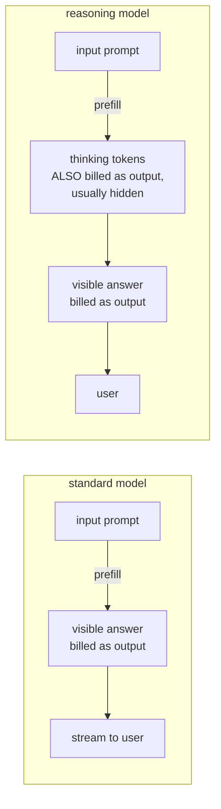

# Lecture 11: Test-time compute and reasoning budgets as a cost/latency decision

> A "reasoning model" feels like a free upgrade — flip it on and answers get smarter. It is not free. Before it writes a single visible word, a reasoning model emits a stream of hidden "thinking" tokens, and you are billed for every one of them at output-token rates while your user watches a spinner. Turned on globally, thinking is the fastest way to triple your bill and blow your latency SLO with nothing to show for it on the routes that never needed it. This lecture reframes "thinking" as what it actually is: a **spend knob** with a dial, not a feature with a switch. You will learn exactly what test-time compute buys you and what it costs, the concrete control surface across OpenAI, Anthropic, and open reasoning models, and the one engineering decision that matters — **gate reasoning per-route, not globally** — so math and planning routes get the thinking they need and extraction, classification, formatting, and routing routes stay cheap and fast. After this you can look at any route in your app and say "reasoning: off, capped at 512 output tokens" or "reasoning: high, thinking budget 8k, monitored" and defend the choice with a number.

**Prerequisites:** you can read a `/v1/chat/completions` request and know input vs output tokens are billed separately (Lecture 3, Lecture 9); you understand TTFT vs TPOT (Lecture 8); you have an eval harness that can score a route (Phase 5/9). · **Reading time:** ~28 min · **Part of:** Phase 10 (LLMOps) Week 3

## The core idea (plain language)

A normal LLM reads your prompt (prefill) and immediately starts emitting the answer (decode). A **reasoning model** inserts a third phase in the middle: it generates a long internal monologue — "let me work through this step by step… the constraint is… so the answer must be…" — *before* it produces the answer you actually see. Those intermediate tokens are called **thinking tokens** (OpenAI: "reasoning tokens"; Anthropic: "thinking"; DeepSeek/Qwen: the `<think>…</think>` block). "Test-time compute" is the umbrella term: you are spending more compute **at inference time** (as opposed to at training time) to get a better answer, and the currency of that spend is *tokens*.

Three facts turn this from a research curiosity into an ops problem:

1. **You pay for thinking tokens.** They are billed at **output-token rates** — the expensive rate. On most providers you never even see them (they are summarized or hidden), but they are on the invoice.
2. **Thinking tokens add latency.** Every thinking token is a decode step. A reasoning model that emits 3,000 thinking tokens before its answer has added 3,000 decode steps of wall-clock time — and because the *visible* answer only starts streaming after the thinking finishes, thinking directly inflates your **TTFT** (time to first visible token) or stretches total latency regardless.
3. **The payoff is wildly uneven across tasks.** For a genuinely multi-step problem — a math word problem, a multi-constraint plan, a hard refactor across five files, an agent deciding which of ten tools to call — the extra thinking meaningfully lifts accuracy. For extraction ("pull the invoice number"), classification ("is this spam?"), formatting ("convert to JSON"), and routing ("which department?"), it lifts accuracy by ~nothing and just burns tokens and time.

So the whole discipline is: **treat thinking as a dial you turn per-route, defaulting to OFF, and turn it up only where an eval proves it moves the metric.** That is the lecture. Everything else is the mechanism and the arithmetic that let you defend the dial position.

## How it actually works (mechanism, from first principles)

### Where the tokens go, and why the bill surprises you

A standard completion has two token buckets you are billed for: **input** (your prompt) and **output** (the answer). A reasoning completion wedges a third bucket into output: **reasoning/thinking tokens**. The bite-you-in-production detail is that on OpenAI's API the reasoning tokens are **counted as output tokens for billing** but are **not returned to you** — you get a short summary or nothing, yet `usage.completion_tokens_details.reasoning_tokens` shows the real count you paid for.

Picture the token flow:



Concretely: you send a 500-token prompt and get back a 200-token answer. On a standard model you paid for 500 input + 200 output = done. On a reasoning model at high effort, the model may have emitted **4,000 thinking tokens** you never saw, so you paid 500 input + 4,200 output. If output tokens cost you, say, $10/1M, that hidden thinking added `4000 × $10/1e6 = $0.04` **per request** on top of the answer — and at a million requests/month that is **$40,000** of pure thinking you cannot see in the response body.

### The control surface, provider by provider

There are three families of controls. Learn all three because a real gateway routes across providers.

**OpenAI — `reasoning_effort` (a coarse dial).** On reasoning models (o-series and GPT-5-class reasoning modes) you pass `reasoning: { effort: "low" | "medium" | "high" }` (older Chat Completions style: `reasoning_effort`; newer models also expose a `minimal`). It is a *qualitative* knob — "how hard should you think" — that maps internally to roughly how many reasoning tokens the model is willing to spend. `minimal`/`low` keeps thinking short (near-instant, cheap); `high` lets it think a lot (slow, expensive). You do not set an exact token count; you set intensity and read the actual `reasoning_tokens` back from `usage`. There is no "off" on a model that is intrinsically a reasoning model — "off" means **route to a non-reasoning model instead** (that is the real switch).

```python
# OpenAI-style: intensity dial, not an exact budget
resp = client.responses.create(
    model="o4-mini",
    reasoning={"effort": "low"},          # minimal | low | medium | high
    input="Classify this ticket: ...",
)
print(resp.usage.output_tokens_details.reasoning_tokens)  # <-- what you actually paid
```

**Anthropic — extended thinking with an explicit token budget (a precise dial).** Claude's extended thinking takes a hard cap: `thinking: { type: "enabled", budget_tokens: N }`. This is a *ceiling* on thinking tokens (must be ≥ a floor like 1,024 and strictly less than `max_tokens`), and unlike OpenAI you can *see* the thinking content in the response (as `thinking` blocks) unless you strip it. To turn thinking **off**, set `thinking: { type: "disabled" }` (or just do not enable it). The budget is the knob that directly bounds worst-case latency and cost.

```python
# Anthropic-style: explicit token ceiling on thinking
msg = client.messages.create(
    model="claude-sonnet-4-5",
    max_tokens=2048,
    thinking={"type": "enabled", "budget_tokens": 4000},  # hard cap on thinking
    messages=[{"role": "user", "content": "Plan the migration steps ..."}],
)
# thinking blocks are visible; usage reports the tokens
```

**Open reasoning models — DeepSeek-R1, Qwen "thinking" variants (you cap or disable at the serving layer).** These emit an explicit `<think> … </think>` block in the raw output. Because *you* run the server (vLLM/SGLang from Weeks 1–2), you control it directly:

- **Cap** thinking by limiting total generation (`max_tokens`) — but a naive cap can truncate mid-thought and leave you with a thinking block and *no answer* (the worst outcome: you paid for thinking and got nothing usable). Better: use the engine's reasoning-parser support to bound the think block, or a stop condition.
- **Disable** thinking on hybrid models. Qwen3, for example, is a hybrid: pass `enable_thinking=false` (or the `/no_think` prompt convention) and it skips the `<think>` block entirely, behaving like a normal fast model. Qwen also exposes a `thinking_budget` on some serving paths.
- vLLM/SGLang expose a **reasoning parser** (`--reasoning-parser deepseek_r1`, etc.) so the `<think>` content is separated into a `reasoning_content` field instead of contaminating your parsed answer.

The through-line: **OpenAI gives you intensity, Anthropic gives you a token ceiling, open models give you the raw block plus an on/off — and "fully off" always means "use a model that does not think."**

### Why it helps (the minimum theory)

You do not need the research. The one-sentence intuition: a transformer does a fixed amount of computation per token, so a hard problem that needs more "compute steps" than one forward pass can supply gets them by **spilling intermediate work into generated tokens** — the model literally uses its own output as a scratchpad, and each scratchpad token is another forward pass of compute conditioned on all the prior work. More thinking tokens = more serial compute = more chances to catch an error, try a sub-goal, or decompose. This is why it helps *multi-step* problems (they need the serial depth) and does nothing for *single-step* problems (one forward pass already had enough compute). That is the whole reason the payoff is task-shaped — hold onto it, it is what justifies per-route gating.

## Worked example

You run a support-automation app with four routes behind one gateway. Monthly volume: **2,000,000 requests**, split evenly (500k each). Someone "upgraded everything to a reasoning model at medium effort" last quarter. Let's price what that did and fix it.

Assume the reasoning model bills output at **$8/1M** and input at **$2/1M**, and a comparable non-reasoning model bills output at **$2/1M**, input at **$0.50/1M** (numbers approximate, for arithmetic). Average input is 600 tokens; average *visible* answer is 150 tokens.

**Step 1 — measure the hidden thinking per route.** From `usage.reasoning_tokens` in traces:

| Route | Task type | Avg thinking tokens (medium) | Does eval improve with thinking? |
|---|---|---|---|
| `classify` | Is this billing/tech/sales? | 900 | No (94.1% → 94.3%, within noise) |
| `extract` | Pull order # + date | 700 | No (99.2% → 99.2%) |
| `format` | Rewrite as JSON | 500 | No, and JSON-valid rate *dropped* (see failure modes) |
| `plan` | Multi-step resolution plan | 2,200 | **Yes** (71% → 86% rubric score) |

**Step 2 — price the current all-reasoning setup.** Per-request cost = input + (thinking + visible) × output-rate.

```
classify: 600×$2/1e6 + (900+150)×$8/1e6  = $0.0012 + $0.0084 = $0.0096
extract:  600×$2/1e6 + (700+150)×$8/1e6  = $0.0012 + $0.0068 = $0.0080
format:   600×$2/1e6 + (500+150)×$8/1e6  = $0.0012 + $0.0052 = $0.0064
plan:     600×$2/1e6 + (2200+150)×$8/1e6 = $0.0012 + $0.0188 = $0.0200

monthly = 500k × (0.0096 + 0.0080 + 0.0064 + 0.0200)
        = 500k × 0.0440 = $22,000 / month
```

**Step 3 — gate per-route.** Send the three flat routes to the non-reasoning model (thinking off); keep `plan` on the reasoning model.

```
classify: 600×$0.5/1e6 + 150×$2/1e6 = $0.0003 + $0.0003 = $0.0006
extract:  same shape                = $0.0006
format:   same shape                = $0.0006
plan:     unchanged                 = $0.0200

monthly = 500k × (0.0006 + 0.0006 + 0.0006 + 0.0200)
        = 500k × 0.0218 = $10,900 / month
```

**Result: $22,000 → $10,900, a ~50% cut, with zero quality loss** (the three flat routes were within eval noise; `plan` is untouched). And you did not just save money — `classify`/`extract`/`format` latency collapsed because you deleted 500–900 decode steps per request from each. The thinking those routes did was pure waste: billed, slow, and metric-neutral.

**Step 4 — bound the worst case on the one route that thinks.** `plan` averages 2,200 thinking tokens, but averages hide the p99. A pathological input can send a reasoning model into a 20,000-token spiral, and you pay `20000 × $8/1e6 = $0.16` on one request and blow your latency SLO. Set an explicit cap: `budget_tokens: 6000` (Anthropic) or bound total output on the open model. Now worst-case `plan` cost is bounded (`~6150 × $8/1e6 ≈ $0.049`) and worst-case latency is ~6k decode steps, not unbounded. **The cap is what makes the route's tail predictable.**

## How it shows up in production

- **The invoice grows but the response bodies did not.** You look at logged completions, see 150-token answers, and cannot reconcile them with an output-token bill 10× that. The missing tokens are reasoning tokens — invisible in the body, present in `usage`. If you are not logging `reasoning_tokens` per request, you are flying blind on half your output spend.
- **A "fast" route quietly misses its SLO after a model swap.** You migrate a classification route from a plain model to a reasoning model (or a hybrid model defaults thinking-on) and p95 TTFT jumps from 300ms to 3s because the model now thinks for 2,000 tokens before answering. Nothing in your code changed except the model id. **Reasoning is the single most common cause of a latency regression with no code diff.**
- **Truncation gives you thinking and no answer.** You cap `max_tokens` to control cost on an open reasoning model, the model spends the whole budget thinking, hits the cap mid-`<think>`, and returns an empty or truncated answer. You paid full price for a response you cannot use. Budget thinking *separately* from the answer (Anthropic's `budget_tokens < max_tokens`) or use the reasoning parser + a generous answer allowance.
- **Reasoning tokens break your prompt-cache assumptions.** Prefix/prompt caching (Lecture 3, and Anthropic/OpenAI prompt caching) caches *input*. Thinking tokens are freshly generated output every time — they do not cache and do not benefit from your fat cached system prompt. A route you thought was cheap because of prompt caching is expensive again once it thinks.
- **Streaming UX changes shape.** With visible thinking (Anthropic) you can stream the thinking to show "working…", which feels responsive. With hidden thinking (OpenAI), the user sees *nothing* until thinking completes — a long dead spinner. If perceived latency matters, either show a thinking indicator or do not use a thinking model on that route.
- **Cost/1M and break-even math shift.** Everything in Lecture 9's break-even chart assumed a token is a token. Reasoning tokens mean a "150-token answer" route can bill like a "2,000-token answer" route. Your `cost_per_1M` and your API-vs-self-host crossover must use *effective* output tokens (visible + thinking), or the chart lies. On self-host, thinking tokens are decode steps that consume your GPU's throughput budget — a reasoning workload serves *far fewer requests/sec* on the same box.
- **Agents multiply everything.** An agent loop that makes 8 tool-calling steps, each on a reasoning model at high effort, pays thinking tokens *8 times per user task*. Reasoning cost compounds with loop depth. Gate reasoning to the *decomposition/planning* step and run the routine tool-call steps on a cheap non-reasoning model.

## Common misconceptions & failure modes

- **"Reasoning makes every answer better."** It makes *multi-step* answers better. On extraction/classification/formatting it is metric-neutral at best and can be *worse* — a reasoning model can "overthink" a trivial classification and talk itself out of the obvious label, or over-elaborate a format task and break strict JSON. Always eval; do not assume monotonic improvement.
- **"`reasoning_effort: low` means no reasoning tokens."** No — `low`/`minimal` still emits reasoning tokens, just fewer. "Zero thinking" requires a non-reasoning model or an explicit disable (`thinking: disabled`, `enable_thinking=false`). Effort is a volume dial, not an off switch.
- **"I capped `max_tokens`, so I capped cost."** You capped *total* output. If thinking eats the cap, you get no answer and still pay. Cap thinking and answer *separately*.
- **"Thinking tokens are cheap because they are internal."** They bill at output rates — the most expensive tokens you buy — and they are often the *majority* of output on hard routes. There is nothing cheap about them.
- **"I cannot see the tokens so I cannot be charged for them."** Invisible ≠ free. Read `usage.completion_tokens_details.reasoning_tokens` (OpenAI) / the usage block (Anthropic) — that is the meter.
- **"Set it globally to high for best quality."** Global high is the worst default: max cost, max latency, and most routes get zero benefit. The correct global default is **off/non-reasoning**, escalating only where evals earn it.
- **"Turning thinking off on a hybrid model needs a different model."** For hybrids (Qwen3-class) it is a *flag* (`enable_thinking=false`), not a redeploy. Know which of your models are hybrids.
- **Unbounded thinking on adversarial input.** Without a budget cap, a confusing prompt can trigger a multi-thousand-token thinking spiral — a latency and cost tail risk. Always cap thinking on any route that thinks.

## Rules of thumb / cheat sheet

- **Default every route to non-reasoning.** Reasoning is opt-in, earned by an eval delta, never the global default.
- **Escalate to reasoning ONLY where an eval moves the metric** beyond noise. If `score_with_thinking − score_without ≤ ~1–2%`, keep thinking off.
- **Thinking pays for:** math, multi-constraint planning, hard multi-file code, agentic decomposition, anything needing serial multi-step logic.
- **Thinking is waste for:** extraction, classification, formatting/JSON, routing, short rewrites, lookups — single-step tasks.
- **Always cap thinking on routes that think** (`budget_tokens` / bounded output). Bounds worst-case latency *and* cost tail.
- **Budget thinking and answer separately.** Ensure `thinking_budget < max_tokens` with real room for the answer, or you pay for thinking and get truncation.
- **Log `reasoning_tokens` per request** and alert on it like any latency/cost metric. Unmonitored thinking is a silent bill and a silent SLO breach.
- **Effort dial mapping (approximate):** `low/minimal` for near-flat tasks that *just* benefit; `medium` as the workhorse for real reasoning; `high` only when evals show the extra tokens buy accuracy you can price.
- **"Off" = a non-reasoning model** (or `thinking: disabled` / `enable_thinking=false` on hybrids). Effort levels never reach zero.
- **Price effective output = visible + thinking** in every cost/1M and break-even calculation. A 150-token answer can bill like 2,300.
- **Agents: gate reasoning to the planning step**, run routine tool-call turns cheap. Reasoning cost compounds with loop depth.

## Connect to the lab

Week 3, Step 3 builds the flag-based version router — extend it into the reasoning gate: read a per-route policy (`reasoning: off | {effort} | {budget_tokens}`) and apply it so `classify`/`extract`/`format` routes hit a non-reasoning model while a `plan`/`code` route escalates. Log `reasoning_tokens` (from `usage`) alongside `latency` into `shadow_log.jsonl`, and in the Step 5 SLO check add an alert that fires when p95 thinking-token count on any route crosses a threshold — the silent-billing failure mode from this lecture, caught before it hits the invoice. Prove the routing decision with your Phase 5/9 eval suite: show the metric is flat with thinking off on the flat routes (so gating them off is free) and lifts on the reasoning route (so escalation is earned).

## Going deeper (optional)

- **OpenAI reasoning docs:** the "Reasoning" guide in the OpenAI docs (`platform.openai.com/docs`) — covers `reasoning_effort`, reasoning tokens in `usage`, and why they are billed as output. Search "OpenAI reasoning models reasoning_effort tokens."
- **Anthropic extended thinking:** the "Extended thinking" and "Building with extended thinking" pages in the Anthropic docs (`docs.anthropic.com`) — `budget_tokens`, visible thinking blocks, interaction with tool use and prompt caching.
- **DeepSeek-R1:** the DeepSeek-R1 model card and repo on Hugging Face / GitHub (`github.com/deepseek-ai/DeepSeek-R1`) — the `<think>` format and recommended usage. Search "DeepSeek-R1 thinking usage recommendations."
- **Qwen3 thinking control:** the Qwen docs and model cards (`qwenlm.github.io`, Hugging Face) for `enable_thinking` / `/no_think` and `thinking_budget`. Search "Qwen3 enable_thinking switch."
- **vLLM / SGLang reasoning parsers:** vLLM docs (`docs.vllm.ai`) "reasoning outputs" and the `--reasoning-parser` flag; SGLang (`sgl-project/sglang`) equivalents — how to split `<think>` into `reasoning_content` when self-serving.
- **The concept:** search "test-time compute scaling" and "inference-time compute" for the framing; and "chain-of-thought let's think step by step" for the original prompting intuition (read *about* it — you need the mental model, not a reimplementation).

## Check yourself

1. On the OpenAI API, why can your output-token bill be 10× the visible answer length, and which `usage` field tells you the real number?
2. Name the control each family exposes and what "off" means for each: OpenAI, Anthropic, and an open hybrid model like Qwen3.
3. You capped `max_tokens` on a self-hosted DeepSeek-R1 route to control cost, and now some responses come back empty. What happened, and what is the fix?
4. Give two task types where reasoning clearly pays and two where it is pure waste, and state the one-sentence reason for the split.
5. A route serves a 150-token visible answer but averages 2,000 hidden thinking tokens at $8/1M output. What does it cost per 1M *requests* in thinking alone, and why does this break your Lecture-9 break-even chart if unmodeled?
6. Why is "set reasoning to high globally for best quality" the wrong default, and what is the right default?

### Answer key

1. Because reasoning models emit hidden **reasoning tokens** before the visible answer, billed at output rates but not returned in the response body. `usage.completion_tokens_details.reasoning_tokens` (Responses API: `output_tokens_details.reasoning_tokens`) reports the count you actually paid for. A 150-token answer with 1,350 reasoning tokens bills as 1,500 output.
2. **OpenAI:** `reasoning_effort` (minimal/low/medium/high) — an intensity dial; "off" is not a level, it means route to a non-reasoning model. **Anthropic:** `thinking: {enabled, budget_tokens: N}` — an explicit token ceiling; "off" is `thinking: {type: "disabled"}`. **Qwen3 (hybrid):** `enable_thinking=false` / `/no_think` — a flag that skips the `<think>` block, no model swap needed.
3. `max_tokens` caps *total* output; the model spent the whole budget inside `<think>…` and hit the cap before emitting an answer, returning empty/truncated output you still paid for. Fix: budget thinking separately from the answer (bound thinking via the reasoning parser / a smaller think limit and keep `max_tokens` well above it), so thinking cannot starve the answer.
4. **Pays:** multi-step math, multi-constraint planning, hard multi-file code, agentic decomposition (any pick two). **Waste:** extraction, classification, formatting/JSON, routing (any two). Reason: reasoning tokens add serial compute steps, which help problems that genuinely need multi-step logic and do nothing for single-forward-pass tasks.
5. `2000 tokens × $8/1e6 = $0.016` thinking per request → `× 1,000,000 requests = $16,000` per 1M requests in thinking alone, on top of the visible answer. It breaks the break-even chart because that chart prices a "150-token answer" route as ~150 output tokens; the *effective* output is 2,150, so cost/1M and the API-vs-self-host crossover are both computed on a number ~14× too low.
6. Global high maximizes cost and latency on *every* route while most routes (extraction/classification/formatting/routing) get zero quality benefit — you pay the most for improvement you cannot measure and blow latency SLOs on flat routes. The right default is **non-reasoning / thinking off**, escalating to reasoning only per-route where an eval shows it moves the metric beyond noise, with a thinking-token cap to bound the tail.
