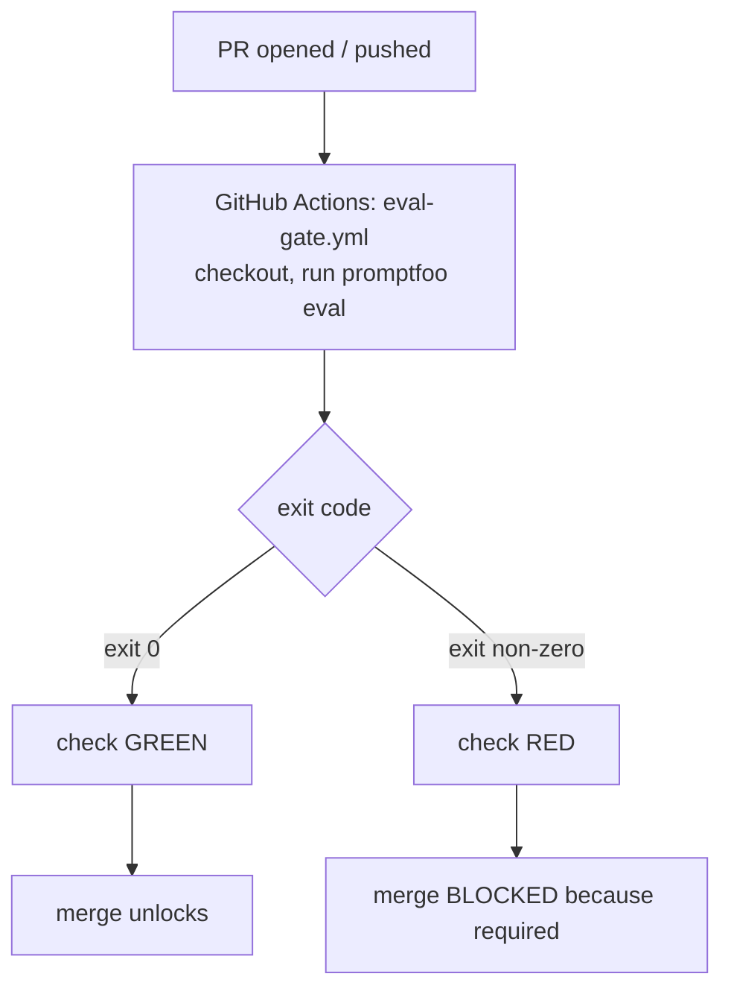

# Lecture 15: Prompts and models as code — eval gates and gating under non-determinism

> You would never let a colleague push a code change straight to production without a diff, a review, and a CI check that has to pass. Yet the single most impactful "variable" in an LLM app — the prompt string, the model id, the temperature — routinely gets edited in a web console, in a Notion doc, or inline in a Python file that nobody reviews, and shipped on a vibe. This lecture fixes that. You'll learn to treat a prompt-template + model-id pair as a **versioned artifact in git**, so every change is a reviewable diff with blame and history; to wire an **eval suite as a required CI status check** that blocks merge on regression; and — the twist that makes LLM CI different from every other CI you've built — to gate on **structure and metric thresholds with tolerance** instead of exact-match diffs, because LLM outputs vary run to run and a byte-for-byte assertion would flap red on every PR. After this you can specify and defend the `promptfoo.yaml` + `eval-gate.yml` that turn "we changed the prompt and hoped" into "the change passed the gate."

**Prerequisites:** you've written a prompt and called a chat API (Phases 1–5); you've seen promptfoo or a home-grown eval harness (Phase 5/9); you know what a GitHub Actions workflow and a PR status check are; basic probability (a rate is a fraction of trials); temperature/decoding params from any earlier LLM work. · **Reading time:** ~30 min · **Part of:** Phase 10 (LLMOps) Week 3

---

## The core idea (plain language)

Three moves, in order.

**1. Prompts and configs are code.** A "version" of your LLM feature is not a vibe in someone's head — it's a concrete set of files: the prompt template, the model id, the decoding params (temperature, top_p, max_tokens), and any tool/format config. You store those files in git. The instant you do that, you inherit for free everything git gives normal code: a **diff** on every change, **blame** to see who changed the system prompt and when, **history** to bisect "when did quality drop," **review** via pull request, and **revert** as a one-line operation. The alternative — editing prompts in a console — has none of these; a quality regression is an unsolvable mystery because there's no record of what changed.

**2. The eval gate blocks merge.** Opening a PR triggers a CI job that runs your eval suite against the changed prompt/config. If the suite fails, the PR **cannot be merged** — the same mechanism that blocks a merge when unit tests fail. You make this real with two pieces: a GitHub Actions workflow (`eval-gate.yml`) that checks out the code, runs the evals, and exits non-zero on failure; and a **branch protection rule** that marks that check **required**. No required check, no gate — the workflow running but not blocking merge is the most common way this is done wrong.

**3. Gate on tolerance, not exact match — because outputs are non-deterministic.** This is the whole reason LLM CI is its own discipline. A normal test asserts `output == "expected"`. Do that with an LLM and you lose: run the same prompt twice and you get two different strings (different word choices, phrasing, ordering). Even at temperature 0, hardware/batching/floating-point and provider-side changes mean you are **not** guaranteed byte-identical output. So every PR would go red for reasons that have nothing to do with quality. Instead you assert on things that are **stable under paraphrase**: *is the output valid JSON?* (yes/no, deterministic), *does it contain the required fact?*, *is its rubric score from an LLM judge within 2% of the baseline?*, *is p95 latency under budget?*. You gate on **structure and thresholds with tolerance**, and you set those tolerances defensibly.

That's the lecture. The rest is mechanism, numbers, and how each of these bites you if you get it wrong.

## How it actually works (mechanism, from first principles)

### A "version" is a pair of files

The atomic unit is a **prompt-template + model-id pair**, plus its decoding config. Concretely, in the repo:

```
prompts/
  extract_invoice/
    v3.txt            # the prompt template (with {{placeholders}})
    config.yaml       # model id, temperature, top_p, max_tokens, response_format
evals/
  promptfoo.yaml      # test cases + assertions that grade v3
```

A `config.yaml` might be:

```yaml
model: openai:gpt-4o-mini      # or your self-hosted vLLM endpoint id
temperature: 0                 # pin low for determinism where you can
top_p: 1
max_tokens: 512
response_format: json_object
```

Now "change the model from `gpt-4o-mini` to `gpt-4o`" is a **one-line diff** a reviewer sees. "Loosen the JSON instruction in the prompt" is a diff. "Bump temperature to 0.7" is a diff. `git blame prompts/extract_invoice/config.yaml` tells you exactly who set temperature and in which PR. This is the entire payoff of move 1: the highest-leverage knobs in your system become reviewable, attributable, revertible artifacts.

### The gate: what "required status check" actually means

GitHub (and GitLab, etc.) attach **status checks** to a commit. A CI job reports pass/fail back to the PR. **Branch protection** lets you declare that specific checks *must* be green before the merge button unlocks. The eval gate is just: "the `eval-gate` check must pass to merge into `main`."



The load-bearing detail: promptfoo (and any decent harness) **exits non-zero when an assertion or threshold fails**. GitHub Actions marks the step failed on non-zero exit. Branch protection sees a failed required check and disables merge. Three independent mechanisms chained by exit codes — nothing magic.

### Why exact-match is a trap: put numbers on the flakiness

Suppose your eval has 20 test cases and you assert exact string equality. Imagine (optimistically) each case reproduces byte-for-byte 95% of the time. The probability *all 20* reproduce is `0.95^20 ≈ 0.36`. So **~64% of your PRs go red for no real reason** — pure non-determinism, not a regression. Developers learn within a week that red means nothing, disable the gate or click through, and you've built theater. Exact-match doesn't just occasionally misfire; it *structurally* guarantees a false-failure storm.

Now assert instead: "JSON-valid rate = 100% across the 20 cases." JSON validity is a **deterministic function of the output** — a string either parses or it doesn't. A well-behaved prompt produces valid JSON on 20/20 runs regardless of word choice, so this assertion is green every time until you *actually* break the JSON instruction. That's the difference between an assertion that measures wording (flaky) and one that measures a property (stable).

### The three families of assertion

**1. Deterministic structural checks.** Cheap, fast, zero-flake, no extra LLM call. These are your first line.
- `is-json` / schema validation (does it parse; does it match the JSON schema?)
- `contains` / `contains-all` / `regex` (does the output include the required ticket id, disclaimer, field?)
- `not-contains` (did it leak a banned phrase / the system prompt?)
- `javascript`/`python` custom asserts (any predicate you can code: "exactly 3 bullet points," "no line over 80 chars")
- `latency` / `cost` budgets (is this call under 800ms / under $0.002?)

**2. Embedding / similarity.** For "is the answer semantically close to a reference" when wording is free but meaning is fixed. Assert cosine similarity between the output embedding and a gold answer's embedding `≥ 0.80` (threshold, not equality). Robust to paraphrase, catches "went off-topic." Costs an embedding call per case (cheap).

**3. LLM-as-judge (rubric).** A second model grades the output against a rubric ("Score 1–5: is the summary faithful, concise, and free of invented facts?"). This is how you grade open-ended quality no regex can capture. It costs an extra LLM call per case and is itself slightly non-deterministic — so you **judge at temperature 0**, use a **coarse scale** (1–5, not 1–100 — judges can't reliably resolve fine gradations), and gate on `score ≥ baseline − tolerance`, never `score == baseline`.

### Setting a baseline and a defensible tolerance

You cannot say "score ≥ baseline − 2%" until you *have* a baseline. The recipe:

1. Run the current (production) version through the eval suite **N times** (e.g., N=5) to see the natural spread. Say the rubric score comes back 4.10, 4.05, 4.15, 4.00, 4.12 — mean ≈ **4.08**, and the run-to-run wobble is ~±0.1.
2. **Baseline = the mean of the current version.** Store it in the config (a number in a file — itself a reviewable diff when you re-baseline).
3. **Tolerance ≥ the observed noise band.** If noise is ±0.1 on a mean of 4.08 (~2.5%), a 2% tolerance is *too tight* — it'll flap. Set the tolerance to cover the noise plus a hair: here, "score ≥ 4.08 − 0.12" (≈ 3%). The rule: **tolerance must exceed your measured run-to-run variance**, or the gate flakes on noise instead of catching regressions.

The tension is real: too tight → false reds (flaky, ignored gate); too loose → real regressions sneak through. You buy your way out by **reducing the noise** (temperature 0, more samples per case, caching) so you can afford a tight, meaningful tolerance.

## Worked example

You own an invoice-extraction endpoint. The prompt says "Return a JSON object with keys `vendor`, `total`, `date`." A teammate opens a PR that rewrites the prompt for "clarity" and, in doing so, changes the final instruction from *"Respond with ONLY valid JSON, no prose."* to *"Respond with the extracted fields."* — dropping the JSON constraint.

Here's `evals/promptfoo.yaml` (abbreviated):

```yaml
prompts:
  - file://prompts/extract_invoice/v3.txt
providers:
  - id: openai:gpt-4o-mini
    config: { temperature: 0, max_tokens: 512 }
defaultTest:
  assert:
    - type: is-json                    # deterministic: must parse
    - type: latency
      threshold: 3000                  # ms budget
tests:
  - vars: { invoice_text: "Acme Corp ... Total $432.10 ... 2026-03-01" }
    assert:
      - type: contains
        value: "432.10"                # deterministic: the number must survive
      - type: llm-rubric
        value: "Correctly extracts vendor, total, and date; no invented fields"
        threshold: 0.8                 # judge score 0–1, tolerance built in
  # ... 19 more cases
```

**What happens on the bad PR.** Without the JSON constraint, the model starts returning prose like *"The vendor is Acme Corp, the total is $432.10..."*. Run the gate:

- `is-json` → **fails** on most cases (prose doesn't parse). The `is-json` pass rate crashes from 100% toward ~0%.
- promptfoo tallies failures and **exits non-zero**.
- GitHub Actions marks `eval-gate` red; branch protection **blocks the merge**.

The author sees exactly which assertion failed on which cases — "18/20 failed `is-json`" — and knows precisely what they broke. That's the "prove-it" moment: an intentionally JSON-breaking change turns CI red.

**What happens on a good PR.** Say instead they rewrite the prompt for clarity but *keep* the JSON constraint, and it actually improves date parsing. Now `is-json` stays 100%, `contains` stays green, the rubric score comes in at 4.12 vs a 4.08 baseline (within tolerance, in fact above it), latency is unchanged. All checks green → **merge unlocks**. Same gate, opposite outcome, and the difference is a real quality property — not word choice.

**The cost of running it.** 20 cases × (1 generation + 1 judge call) = 40 LLM calls per CI run. On `gpt-4o-mini` at roughly `$0.15/1M` input + `$0.60/1M` output (approximate — check current pricing), with ~800 tokens/call, that's on the order of **a cent or two per full eval run**. Cheap — until you have 500 cases and 30 PRs a day. Then you cache (next section).

## How it shows up in production

- **The console-edit mystery regression.** Quality drops Tuesday. Nobody changed "the code." Someone edited the system prompt in the vendor's web playground Monday night. With prompts-as-code this is a `git log` away; without it, it's an afternoon of confused Slack threads. This is the number-one argument for move 1, and it lands the first time it happens to you.
- **The flaky-gate death spiral.** Team gates on exact match (or a too-tight tolerance). PRs go red randomly. Within days people treat red as noise, add `continue-on-error: true`, or make the check non-required. The gate is now decorative and a real regression ships. **A flaky gate is worse than no gate** — it trains people to ignore signal. The fix is always: assert on structure/thresholds, widen tolerance past the noise band, pin temperature 0.
- **CI bill from evals.** Every PR push re-runs the full suite. A 300-case suite with LLM-judge on every case, pushed 40 times a day, is thousands of judge calls daily — real money and real minutes of CI wall-clock. Levers: **cache** identical (prompt, input, params) → output pairs so unchanged cases don't re-call the model (promptfoo caches by default); run the **full** suite only on PR/merge and a **fast smoke subset** on every push; **sample** (run 50 representative cases in CI, the full 300 nightly).
- **The "temperature 0 will save me" half-truth.** Temperature 0 sharply *reduces* variance but does **not** guarantee determinism: batching, GPU nondeterminism, tokenizer/version drift, and silent provider model updates all move outputs. Some providers also expose a **`seed`** parameter (OpenAI's `seed` + `system_fingerprint`, vLLM's `--seed`) that pins the RNG so *identical* (prompt, params, fingerprint) inputs reproduce far more tightly — set it in CI where available, but treat it as noise-reduction, not a determinism guarantee: when `system_fingerprint` changes (a backend update), reproducibility is off again. Design the gate to tolerate residual variance even at temp 0 with a fixed seed — don't assume a frozen string.
- **Silent model drift under a pinned id.** You pinned `gpt-4o`, but the provider ships an updated snapshot behind that alias. Your baseline was measured on the old weights; scores shift. Pin the **dated snapshot** id where the provider offers one, and re-baseline deliberately (a reviewed diff) rather than letting the ground move under you.
- **Judge non-determinism and judge bias.** LLM-as-judge is itself an LLM — it wobbles, and it has known biases (favoring longer answers, its own family's style, position in pairwise comparisons). Pin the judge at temp 0, keep the rubric coarse and explicit, and periodically sanity-check the judge against a few human labels so you're not gating on a miscalibrated grader.

## Common misconceptions & failure modes

- **"Just assert the output equals the golden answer."** The single most common mistake. LLM outputs vary; equality flaps red constantly. Assert **properties** (valid JSON, contains the fact, similar embedding, rubric ≥ baseline−tol), never the exact string.
- **"Temperature 0 makes it deterministic, so exact-match is fine now."** No — temp 0 reduces but doesn't eliminate variance (hardware, batching, provider updates). Still gate on tolerance.
- **"The workflow runs on PRs, so we're gated."** A running workflow that isn't marked **required** in branch protection does *not* block merge. Un-required check = no gate. Verify the merge button actually locks on red.
- **"Tighter tolerance = safer."** Only up to your noise floor. Below the run-to-run variance, tightening just adds false failures and gets the gate ignored. Measure the noise first; set tolerance above it.
- **"One run is enough to set a baseline."** A single run is one sample of a noisy distribution. Baseline from the mean of several runs, and know the spread so your tolerance covers it.
- **"LLM-judge scores are objective numbers."** They're a second model's opinion, biased and slightly random. Use coarse scales, temp-0 judging, and gate on a margin — treat the score as a noisy signal, not a measurement.
- **"Caching evals will hide regressions."** Caching keys on (prompt, input, params) — change any of them (which a real PR does) and the cache correctly misses and re-runs. It only skips work for cases you *didn't* change. Safe and essential for cost.
- **"Evals in CI need production data."** Prefer a curated, versioned, PII-safe fixture set checked into the repo. Live prod data in CI is a privacy and reproducibility hazard; your eval set should be stable so score changes mean *prompt* changes.

## Rules of thumb / cheat sheet

- **Version = prompt-template + model-id + decoding config, as files in git.** Every change is a diff; every regression is a `git bisect` away.
- **Never gate on exact-match / byte diffs.** Gate on structure and thresholds with tolerance. This is the one rule that defines LLM CI.
- **Assertion ladder, cheapest first:** deterministic structural (is-json, contains, regex, custom, latency/cost budgets) → embedding similarity ≥ threshold → LLM-rubric ≥ baseline − tolerance. Lead with the deterministic ones; they're free and flake-proof.
- **Pin `temperature: 0`** (and top_p 1, plus a fixed `seed` where the provider supports it) in CI wherever the task allows, to shrink variance — but still tolerate residual noise.
- **Tolerance > measured run-to-run variance.** Sample the current version N≈5 times, take the mean as baseline, set tolerance above the observed spread (often ~2–5%, but *measure* — this is approximate).
- **Judge at temp 0, on a coarse (1–5) scale**, with an explicit rubric; sanity-check it against a few human labels.
- **Make the check required** in branch protection, or it's not a gate.
- **Cache eval results** (default in promptfoo); run full suite on PR/merge, a smoke subset per push, the exhaustive set nightly.
- **Pin dated model snapshots**, not floating aliases; re-baseline as a deliberate, reviewed change.
- **Curated, versioned, PII-safe eval fixtures** in the repo — not live prod data.
- **All numbers here are approximate** — measure your own noise band, costs, and thresholds.

## Connect to the lab

This lecture specs two Week 3 deliverables directly. In `evals/promptfoo.yaml` you'll encode the assertion ladder above — `is-json` and `contains-expected` deterministic checks plus at least one `llm-rubric` with a `threshold` — against your prompt+model version files. In `.github/workflows/eval-gate.yml` you'll wire `checkout → npx promptfoo eval → non-zero exit blocks merge` and mark it **required** via branch protection. The prove-it exercise is the payoff: open a PR that deliberately breaks the JSON instruction and watch CI go red, then open a good PR and watch it stay green — exactly the bad-prompt/good-prompt pair in the Definition of Done. Your `gateway/router.py` "versions" are the same prompt+model file pairs this gate protects.

## Going deeper (optional)

- **promptfoo docs** (`promptfoo.dev`): the assertion reference (`is-json`, `contains`, `similar`, `llm-rubric`, `latency`), config format, caching, and CI integration pages — the ground truth for the `promptfoo.yaml` deliverable.
- **GitHub Actions docs** (`docs.github.com`): "Workflow syntax for GitHub Actions" and "About status checks" / "About protected branches" — how a non-zero step fails a job and how to make a check *required*.
- **OpenAI Evals** (`github.com/openai/evals`) and **Anthropic's docs on evaluations** (`docs.anthropic.com`): alternative/canonical harness patterns and guidance on building test sets.
- **LLM-as-judge:** search "MT-Bench LLM as a judge paper" (Zheng et al., 2023) and "G-Eval" for how judges are built and their known biases; read *about* the bias findings before you trust a judge score.
- **Ragas** (`docs.ragas.io`): if your version includes a RAG step, its faithfulness/answer-relevancy metrics slot in as additional threshold assertions.
- Search queries: "promptfoo github actions required check", "LLM eval non-determinism CI flaky", "prompt versioning git best practices 2025", "LLM as judge calibration bias".

## Check yourself

1. What exactly constitutes a "version" in prompts-as-code, and name three things git gives you for free once it's stored as files.
2. Why does gating on exact string match structurally guarantee flaky CI? Use the "each case reproduces 95% of the time, 20 cases" example.
3. List the three families of assertions from cheapest/most-deterministic to most expensive, with one example of each.
4. You measure the current version's rubric score over 5 runs as 4.0–4.2 (mean ≈ 4.1, spread ≈ ±0.1). Is a 1% tolerance appropriate? What should you set and why?
5. A teammate says "the eval workflow runs on every PR, so we're protected." What single thing might still be missing, and how would you verify the gate actually blocks merge?
6. Name two levers to cut the cost/time of running LLM evals in CI without hiding regressions.

### Answer key

1. A **prompt template + model id + decoding config** (temperature, top_p, max_tokens, response_format), stored as files in git. Git then gives you: a **diff** on every change, **blame/attribution** (who changed the system prompt, in which PR), **history** (bisect when quality dropped), plus **review** (PR) and **one-line revert**. (Any three.)
2. If each of 20 cases reproduces byte-for-byte only 95% of the time, all 20 reproducing is `0.95^20 ≈ 0.36` — so ~64% of PRs go red purely from non-determinism, not regressions. The false-failure rate compounds with case count, so exact-match doesn't occasionally misfire, it *structurally* floods you with false reds until people ignore the gate.
3. **Deterministic structural** (cheapest, no extra LLM call): `is-json`, `contains`, regex, latency/cost budget. **Embedding similarity**: cosine similarity to a gold answer ≥ threshold (one cheap embedding call). **LLM-as-judge rubric** (most expensive, itself noisy): a second model scores against a rubric, gated at score ≥ baseline − tolerance.
4. **No — 1% is too tight.** The observed run-to-run spread is ±0.1 on a mean of 4.1, which is ~2.4%; a 1% tolerance sits *inside* the noise band and will flap red on noise alone. Set the tolerance to **exceed the measured variance** — e.g., "score ≥ 4.1 − 0.12" (~3%) — and/or reduce the noise (temp 0, more samples) so you can afford a tighter, meaningful bound.
5. The **branch protection "required status check"** may not be configured — a workflow can run and report red without blocking merge if the check isn't marked required. Verify by opening a PR whose eval fails and confirming the **merge button is actually disabled** (not just a red X you can click past); check the branch protection settings list `eval-gate` as required.
6. Any two of: **cache** results keyed on (prompt, input, params) so unchanged cases don't re-call the model (a changed prompt correctly misses the cache, so regressions aren't hidden); run the **full suite on PR/merge and a fast smoke subset per push**; **sample** a representative subset in CI and run the exhaustive set nightly; pin **temperature 0** to reduce the need for repeated sampling.
