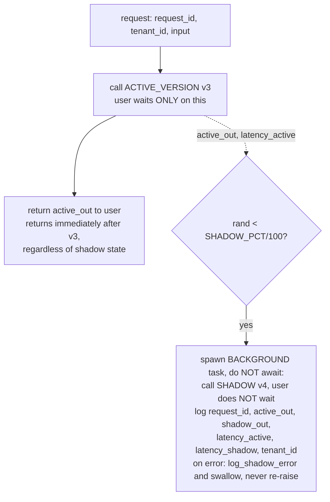

# Lecture 16: Progressive Delivery for LLMs — Feature Flags, Shadow, Canary, and Instant Rollback

> You now have an eval gate that can block a bad prompt or model change at PR time (Lecture 15). But a green eval is a lab result, not a production verdict — evals run on a fixed dataset, and real traffic always contains inputs your test set never imagined. This lecture is the runtime half of the release pipeline: how you get a change that *passed the gate and merged* into production **safely**, in stages, with real traffic proving it out at each step, and with a revert that takes seconds rather than a rebuild. You will learn to decouple "the code is deployed" from "users see it" using a feature flag; to run the new version in **shadow** — mirroring live traffic to it while serving the old one, at zero user risk — and read the paired outputs; to promote to a **canary** that exposes a small slice of real users while you watch SLOs; and to make **rollback** a flag flip confirmed by a health check in seconds. After this you can draw and defend the full flow — PR → eval gate → merge → shadow 10% → canary → full → rollback — and, crucially, know the three safety rules that stop shadow traffic from charging a customer twice or 500-ing a healthy request.

**Prerequisites:** Lecture 15 (eval gate / CI for prompts), Lecture 3 (OpenAI-compatible serving), Lecture 8 (TTFT/TPOT, percentiles), Week 2 FinOps / tenant attribution · **Reading time:** ~30 min · **Part of:** Phase 10 (LLMOps) Week 3

---

## The core idea (plain language)

Shipping is not a moment. It is a sequence of increasingly risky exposures, and progressive delivery is the discipline of taking them one at a time so that a mistake is caught while it is cheap.

Here is the mental shift that unlocks everything: **deploying code and exposing behavior are two separate acts.** A traditional deploy fuses them — you push the new binary and, the instant it is live, every user is on it. If the new prompt hallucinates on a class of inputs your eval set missed, 100% of traffic is now hitting the bug, and your only fix is another deploy. Progressive delivery pries those two acts apart with a **feature flag**: you deploy the new version *dark* — it is running, loaded, ready — but a config value (`ACTIVE_VERSION`) decides who actually sees it. Shipping the code is a git thing; exposing it is a config thing. Now you can turn exposure up and down like a dimmer, independently of deploys.

Once exposure is a dimmer, you use it in three stages, each strictly less risky than the intuition suggests:

- **Feature flag (dark deploy):** the new version is live but nobody is routed to it. Zero user impact. This is the staging ground.
- **Shadow (mirror):** for some fraction of requests, you *also* fire the request at the new version, throw its answer away, and log both answers side by side. Users still get the old version's answer, every time. You are comparing the two versions on **real production traffic** while risking **nothing** — the user never sees, waits for, or is affected by the shadow.
- **Canary:** now you actually serve the new version to a small slice of real users — 1%, then 5%, then 25% — watching your SLOs and error rates at each step. This is the first stage where a real user sees the new behavior, so it comes *after* shadow has already vindicated the outputs.

And underneath all three sits the property that makes the whole thing safe to attempt: **instant rollback.** If canary metrics go bad, reverting is `ACTIVE_VERSION=previous` — a config change confirmed by one health request in seconds. A "rollback" that needs a 10-minute container rebuild is not a rollback; it is a second outage.

The order is not arbitrary. **Shadow before canary** because shadow compares outputs at *zero* user risk and canary exposes *real* users — you spend the free, safe comparison first and only take on user risk once the free evidence looks good.

---

## How it actually works (mechanism, from first principles)

### The unit of change: a "version" is a prompt + model pair in git

Before any of this works you need something concrete to flip between. In LLMOps a **version** is not a container tag — it is the pair `(prompt_template, model_id, decoding_params)`, stored as files in git. A change to the system prompt, a swap from `qwen2.5-7b` to `qwen2.5-14b`, a bump of `temperature` — each is a diff, each gets a version id. That is what lets a "rollback" be a config flip: both versions already exist as files; you are only changing which one the router points at.

```
versions/
  v3/  prompt.jinja   model.yaml    <- ACTIVE_VERSION=v3   (current prod)
  v4/  prompt.jinja   model.yaml    <- SHADOW_VERSION=v4   (candidate, dark)
```

### Feature flag: the router reads config, not code

The gateway (extend your Phase 9 LiteLLM/FastAPI gateway) reads three values at request time — from env, a config file, or a flag service like LaunchDarkly:

```
ACTIVE_VERSION = v3      # what real users get
SHADOW_VERSION = v4      # candidate mirrored in the background
SHADOW_PCT     = 10      # % of traffic also sent to shadow
```

The key word is *at request time*. If these are read on every request (or on a short-TTL cache), changing `ACTIVE_VERSION` takes effect for the next request — no restart, no rebuild. That is the mechanical root of instant rollback. If instead you bake the version into an env var read only at process start, you have quietly re-fused deploy and exposure, and your rollback is a restart.

### Shadow: fire-and-forget the mirror, serve the original

Here is the request lifecycle with shadow enabled. Read the control flow carefully — every arrow placement encodes a safety rule.



Three safety rules are baked into that diagram, and every one of them is a production incident if you skip it:

1. **Fire-and-forget in the background — the user never waits on the shadow.** The response returns the moment `ACTIVE_VERSION` finishes. If you `await` the shadow call, you have just made every shadowed request as slow as the *slower* of the two versions. In FastAPI this is `BackgroundTasks` or an `asyncio.create_task` you deliberately do not await; the point is the response path does not depend on the shadow completing.
2. **A shadow error must never touch the real response.** The shadow call runs inside its own `try/except` that logs and swallows. If `SHADOW_VERSION` OOMs, times out, or 500s, the user's request — already answered by `ACTIVE_VERSION` — is unaffected. The classic disaster is a shared exception path where a shadow timeout bubbles up and 500s a request the user had already, invisibly, been served correctly for.
3. **Never shadow side-effecting / tool-writing paths.** This is the one that bites hardest. If the request triggers a tool that *writes* — charges a card, sends an email, inserts a row, calls a payment API — then mirroring the request runs that side effect **twice**. The user gets billed twice, gets two emails, gets a duplicate order. Shadow is only safe on **read-only** paths. For agent/tool workloads you must **stub the tools** in the shadow path (the shadow model "calls" a fake `send_email` that records the intent but does nothing) or exclude tool-invoking requests from shadowing entirely.

What you log per shadowed request is the raw material for the offline comparison:

```json
{"request_id":"r-8f21","active_out":"...","shadow_out":"...",
 "latency_active":412,"latency_shadow":still_907,"tenant_id":"acme-co"}
```

Paired by `request_id`, this lets you answer offline: does v4 agree with v3 on the same real inputs? Where they differ, is v4 better or worse (LLM-judge or human review)? Is v4 slower (`latency_shadow` vs `latency_active`)? And because every row carries `tenant_id`, you can attribute both cost and quality-regression per tenant — the same tag your Week 2 FinOps attribution uses, so shadow cost lands in the same per-tenant ledger.

### Canary: exposure with a numeric ramp and a watch

Shadow proved the outputs *look* right. Canary is the first time a real user *gets* the new version, so you ramp exposure and watch SLOs at each step, ready to abort.

```
 canary schedule (illustrative — tune to your traffic volume)
 ┌────────┬──────────────┬───────────────────────────────┐
 │ step   │ % on v4      │ hold + watch                  │
 ├────────┼──────────────┼───────────────────────────────┤
 │  1     │  1%          │ 15 min: p95 TTFT, error rate  │
 │  2     │  5%          │ 30 min                        │
 │  3     │ 25%          │ 1 h                           │
 │  4     │ 50%          │ 1 h                           │
 │  5     │ 100% (full)  │ bake, then retire v3          │
 └────────┴──────────────┴───────────────────────────────┘
   abort at any step → ACTIVE_VERSION=v3  (instant rollback)
```

Routing 5% is just a coin weighted 5/100 on `ACTIVE_VERSION` — but **route by a stable hash of a user/tenant id, not per-request random**, or the same user flips versions mid-conversation. `bucket = hash(tenant_id) % 100; version = v4 if bucket < canary_pct else v3` gives a user a consistent experience and makes the canary cohort reproducible.

The "watch" is the whole point. You need enough traffic at each step for the percentile to mean something — 1% of 100 req/min is 1 req/min, and a p95 over a handful of samples is noise. Rule of thumb: hold each step until the canary cohort has served enough requests that its p95 is stable (hundreds of requests, not tens), or you are just rolling dice.

### Why shadow *before* canary — the risk/evidence ledger

Put the two side by side:

| | Shadow | Canary |
|---|---|---|
| Who sees new output | nobody | real users (small %) |
| User risk if v4 is bad | **zero** | real (bad answers, errors) |
| Evidence you get | paired outputs on real inputs | real UX, real SLOs, real errors |
| Reversible by | stop logging | flag flip |

Shadow gives you evidence about **output quality** at zero cost. Canary gives you evidence about **live behavior** (latency under real load, error rates, downstream effects) but charges real users for any mistake. You always spend the free evidence first. Skipping shadow and going straight to canary means the first person to discover v4's regression is a paying customer, not your log file.

---

## Worked example

You run a support-summarization endpoint at **200 req/min** (≈288k req/day). Your eval gate (Lecture 15) just passed v4 (a rewritten system prompt) with score ≥ baseline − 2% and 100% JSON-valid. Now you deliver it.

**Step 0 — dark deploy.** Merge to main deploys v4's files. `ACTIVE_VERSION=v3`, `SHADOW_VERSION=v4`, `SHADOW_PCT=0`. Nothing routed anywhere new. Health check green.

**Step 1 — shadow 10% for 24h.** Set `SHADOW_PCT=10`. Now ~20 req/min are mirrored to v4 in the background. Over 24h you collect ≈ 0.10 × 288k = **28,800 paired rows**. You run an offline LLM-judge over the pairs:

- Agreement (judge says "equivalent or v4 better"): 27,650 / 28,800 = **96.0%**.
- v4 worse: 1,150 rows (**4.0%**) — you read a sample. They cluster on inputs containing non-English text; v4's new prompt dropped a "respond in the user's language" line. **Caught at zero user risk.** You fix, re-run the eval gate, ship v5 into the shadow slot. This is the entire value of shadow: a 4% regression on a real-traffic slice you would otherwise have shipped to everyone.
- Latency: `latency_shadow` p95 = 910 ms vs `latency_active` p95 = 430 ms. v4 is 2× slower — the new prompt is longer, so prefill grew. Worth knowing *before* canary.

**Step 2 — canary ramp (after the fix, on v5).** `SHADOW_PCT` back to 10 to sanity-check v5 briefly, then start canary. At **1%**, 2 req/min hit v5 — too thin for a stable p95, so you hold 30 min to accumulate ~60 requests and eyeball error rate (0 errors). At **5%** (10 req/min) you watch p95 TTFT: 480 ms, within your 800 ms SLO. Ramp 25% → 50% → 100% over the afternoon, watching at each hold.

**Step 3 — a breach, and rollback.** At 50%, p95 TTFT jumps to **1,240 ms** — the longer prompt plus real concurrency blew past the SLO. Your SLO alert fires. You run:

```bash
./rollback.sh v3          # sets ACTIVE_VERSION=v3
curl -s localhost:8000/health | grep '"active":"v3"'   # confirms in ~2s
```

Elapsed from alert to all-users-on-v3: **under 10 seconds**, no rebuild. You now have a *known* problem (v5 needs the prompt shortened or a bigger card) and *zero* users still on it. Compare the counterfactual: a fused deploy would have had 100% of 200 req/min on the slow version until a 10-minute rebuild finished — ~2,000 requests over SLO instead of the few hundred the canary exposed.

The numbers above (96% agreement, the specific latencies) are illustrative of the *method*, not a benchmark — your real ratios depend on your prompts and hardware.

---

## How it shows up in production

- **Cost: shadow doubles inference cost on the shadowed slice.** Mirroring 10% of traffic means 10% more forward passes, billed to *nobody's* request. On self-hosted vLLM this is spare-capacity load; on a metered API it is real money. Keep `SHADOW_PCT` modest (5–10%) and remember the shadow cost lands in your per-tenant FinOps ledger via `tenant_id` — you can literally see "we spent $X shadow-testing v4 against acme-co's traffic."
- **Latency: the shadow can steal from the active path if you share a pool.** On one vLLM server, shadow requests enter the same continuous batch as real ones. At high utilization the mirror inflates real-traffic TTFT even though it is "fire-and-forget," because they contend for KV-cache blocks and batch slots. If your server is near saturation, shadow on a *separate* replica or throttle `SHADOW_PCT`.
- **Quality: shadow is your only pre-exposure look at real-input behavior.** Eval sets are curated; production traffic is feral. The regressions that survive the eval gate — weird languages, adversarial prompts, edge-case formats — surface in the shadow diff before a user ever sees them. Teams that skip shadow discover these via support tickets.
- **Debugging: paired logs are the artifact you reach for.** When someone claims "v4 is worse," you do not argue from vibes — you pull the `request_id`, read `active_out` vs `shadow_out`, and settle it. The paired log *is* the regression report.
- **The rollback drill must be practiced.** An unexercised rollback path is one that does not work. Run `rollback.sh` in a game-day *before* you need it, and assert the health check actually confirms the version change. The number one rollback failure is "the flag flipped but the router cached the old value for 5 minutes."

---

## Common misconceptions & failure modes

- **"Shadow is just canary with less traffic."** No. Canary *serves* new output to users; shadow *never* does. Different risk class entirely. Confusing them leads people to skip shadow ("we'll just canary at 1%") and thereby expose real users to regressions shadow would have caught for free.
- **Awaiting the shadow call.** The single most common bug: `shadow_out = await call_shadow(...)` in the request path makes every shadowed request wait on the slower version. Fire-and-forget or it is not shadow, it is a latency tax.
- **Letting a shadow exception escape.** If the shadow's `try/except` is missing or too narrow, a shadow timeout 500s a request the user was already served correctly for. The real path and the shadow path must be exception-isolated.
- **Shadowing a side-effecting path.** Mirroring a request that charges a card charges it twice. This is the incident that gets written up. Shadow read-only paths; stub every write tool in the shadow path.
- **Gating canary promotion on exact output match.** LLMs are non-deterministic (Lecture 15). If your canary "healthy?" check demands v4 == v3 byte-for-byte, it flaps red forever. Gate on metric thresholds with tolerance (agreement rate, JSON-valid rate, p95 SLO), never string equality.
- **Per-request random routing in canary.** Randomizing per request means a user's multi-turn conversation flips between v3 and v4 mid-thread. Route by a stable hash of user/tenant id.
- **"Rollback" that needs a rebuild.** If reverting means rebuilding a container or re-running a deploy pipeline (minutes), it is disqualified. Rollback must be a config/flag change effective on the next request and confirmed by a health check in seconds. Both versions must already be deployed.
- **Reading the flag once at startup.** Baking `ACTIVE_VERSION` into a start-time env var re-fuses deploy and exposure. Read it per-request (short-TTL cache is fine).
- **Canary steps too short to be significant.** Holding 1% for 2 minutes gives you a p95 over a handful of samples — pure noise. Hold until the cohort's percentile is stable.

---

## Rules of thumb / cheat sheet

- **Deploy dark, expose by flag.** Shipping code ≠ exposing behavior. `ACTIVE_VERSION` is the dimmer.
- **A "version" = prompt + model + params in git.** That is what makes flip and rollback file-level, not rebuild-level.
- **Order is fixed: eval gate → merge → shadow → canary → full.** Shadow (zero risk, output evidence) before canary (real users, live evidence).
- **Shadow safety triad:** (1) fire-and-forget, never await; (2) `try/except` swallow — a shadow error never touches the real response; (3) never shadow writes — read-only paths only, or stub the tools.
- **`SHADOW_PCT` default 5–10%.** Enough for a meaningful diff; bounded extra cost/load.
- **Tag every request with `tenant_id`** — ties shadow/canary cost and quality back to Week 2 FinOps attribution.
- **Canary ramp (approx):** 1% → 5% → 25% → 50% → 100%, holding each until the cohort p95 is stable. Route by stable id hash, not per-request random.
- **Watch p95 SLOs (TTFT/TPOT) + error rate at each canary step**, not averages (Lecture 13). Abort on breach.
- **Rollback = flag flip + health-check confirm in seconds.** If it needs a rebuild, it is not a rollback. Practice it before you need it.
- **Gate promotion on thresholds with tolerance,** never exact-match diffs.

---

## Connect to the lab

This lecture is the spec for **Week 3, Steps 3 and 5**. In `gateway/router.py` you build exactly the router in the mechanism diagram: it reads `ACTIVE_VERSION`/`SHADOW_VERSION`/`SHADOW_PCT`, serves the active version, fire-and-forgets the shadow for `SHADOW_PCT` of requests, and appends the paired `{request_id, active_out, shadow_out, latency_active, latency_shadow, tenant_id}` rows to `shadow_log.jsonl` — with the safety triad enforced. In `scripts/rollback.sh` you make rollback a one-command flag flip confirmed by a health request. Your README must diagram the full flow: **PR → eval gate → merge → shadow 10% → canary → full → rollback** — the same flow the phase milestone (Part B) grades.

---

## Going deeper (optional)

- **LaunchDarkly docs** (launchdarkly.com/docs) — the canonical feature-flag / progressive-rollout platform; read their "targeting" and "percentage rollout" concepts even if you use a plain config flag.
- **promptfoo docs** (promptfoo.dev) — the eval gate that guards the front of this pipeline (Lecture 15).
- **"Feature Toggles (aka Feature Flags)"** — Martin Fowler / Pete Hodgson, martinfowler.com. The definitive taxonomy of flag types (release, ops, experiment); read the release-toggle section.
- **Google SRE Book** (sre.google/books) — chapters on canarying, release engineering, and error budgets; the SLO-driven "abort the rollout" discipline comes from here.
- **"Dark launching" / "shadow deployment"** — search these terms plus your framework, e.g. `FastAPI BackgroundTasks fire and forget` and `traffic mirroring shadow deployment` for infra-level mirroring (Istio/Envoy `mirror` / `mirrorPercentage` do this at the service-mesh layer if you want it below the app).
- Search queries: `progressive delivery canary vs shadow`, `LaunchDarkly percentage rollout consistent bucketing`, `LLM shadow testing prompt regression`, `Envoy request mirroring`.

---

## Check yourself

1. What is the concrete difference between shadow and canary, and why do you always run shadow first?
2. Name the three shadow safety rules. For each, describe the production incident that occurs if you violate it.
3. Your gateway reads `ACTIVE_VERSION` from an env var set at process startup. Why does this break "instant rollback," and what's the fix?
4. In a canary you route 5% of traffic to v4 using `random() < 0.05` per request. A user complains their chatbot "keeps changing personality mid-conversation." What went wrong and how do you fix it?
5. Why can't you gate canary promotion on `v4_output == v3_output`, and what do you gate on instead?
6. You shadow 10% of a 200 req/min endpoint for 24 hours. Roughly how many paired rows do you collect, and what's the one thing that would make shadowing this endpoint *unsafe* regardless of that volume?

### Answer key

1. **Shadow** mirrors real traffic to the new version but throws its output away — the user always gets the old version, so user risk is **zero** and the evidence is paired outputs on real inputs. **Canary** actually *serves* the new version to a small % of real users — the first time a real user sees new behavior, so it carries real risk (bad answers, errors, latency). You run shadow first because it gives you free, zero-risk evidence about output quality; you only take on the user risk of canary once that free evidence looks good.

2. (a) **Fire-and-forget, never await** — if violated, every shadowed request waits on the (often slower) shadow version, so you tax real user latency. (b) **Swallow shadow errors in a `try/except`** — if violated, a shadow timeout/500 bubbles up and 500s a request the user was already served correctly for. (c) **Never shadow side-effecting/write paths** — if violated, mirroring a request that charges/emails/writes runs that side effect twice: double charge, duplicate email, duplicate row.

3. Because the value is read only once at startup, changing `ACTIVE_VERSION` has no effect until the process restarts — so "rollback" becomes "restart the service," which is slow and re-fuses deploy with exposure. Fix: read the flag **per request** (or via a short-TTL cache / flag service), so a config change takes effect on the next request and rollback is a flag flip confirmed by a health check in seconds.

4. Per-request random routing puts the *same* user on v4 for one turn and v3 for the next, so their conversation flips versions mid-thread. Fix: route by a **stable hash of the user/tenant id** — `hash(tenant_id) % 100 < canary_pct` — so a given user gets a consistent version for the whole session and the canary cohort is reproducible.

5. LLM outputs are non-deterministic (and v4 is *supposed* to differ from v3), so an exact-match gate flaps red on every request and blocks all promotion. Gate instead on **metric thresholds with tolerance**: agreement/quality score (e.g., LLM-judge "equivalent or better" ≥ threshold), 100% JSON-valid rate, and p95 SLO within budget.

6. ≈ 0.10 × 200 req/min × 60 × 24 = **~28,800 paired rows**. It would be unsafe regardless of volume if the endpoint **triggers write/side-effecting tools** (charges, emails, DB writes) — shadowing runs those twice. You'd have to restrict shadowing to read-only paths or stub the write tools in the shadow path.
