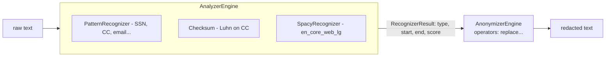
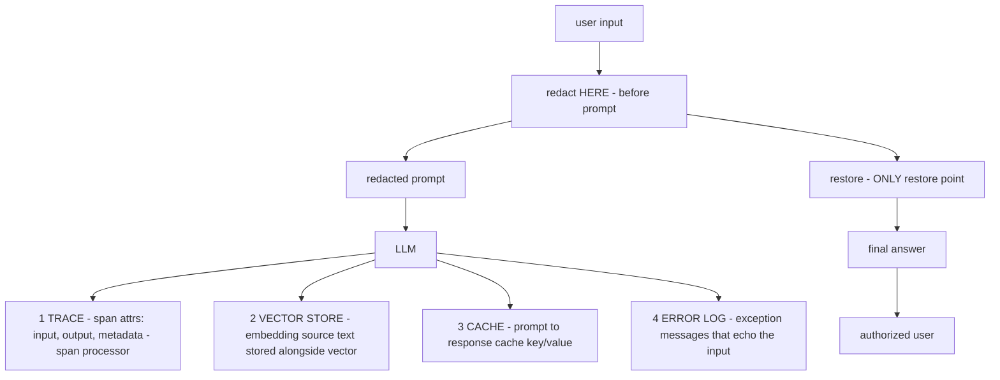

# Lecture 8: PII Redaction & Data Minimization with Presidio

> Redacting the prompt feels like the win — you swap out the SSN, the model never sees it, you sleep well. Then a week later someone greps your Langfuse traces and finds 4,000 real Social Security numbers sitting in cleartext, because the trace was written from the *original* string, not the redacted one. The prompt was the one place you remembered; the trace, the vector store, the cache, and the error log were the four places you forgot. This lecture teaches the redact-then-restore pattern with Microsoft Presidio — swap detected PII for stable tokens before the prompt and restore real values in the final answer, so the *user* sees their data but the *model and every store* never do — and then it teaches the harder discipline: redact at **every write**, not just the prompt. After this you will be able to wire Presidio's analyzer + anonymizer with `en_core_web_lg`, tune confidence thresholds, add a custom recognizer, build the reversible-mapping store that makes restoration possible, install a span processor and log filter so traces and files store only redacted text, and *prove* it by grepping every store for a seeded SSN and finding zero hits.

**Prerequisites:** Lecture 1 (trust boundaries, data flow), Lecture 4 (exfiltration channels — traces and stores as leak paths), Phase 10 (OpenTelemetry/Langfuse tracing), Phase 4 (embeddings + vector store) · **Reading time:** ~30 min · **Part of:** Phase 11 (AI Safety, Security, Guardrails & Governance), Week 2

---

## The core idea (plain language)

PII redaction is a **data-minimization control**: the fewer places a person's real identifiers exist, the smaller your blast radius when something leaks, and the more feasible it is to actually *delete* that person later (Week 3's GDPR erasure). The goal is not "the model can't read names" — the model often needs the *structure* of a name to reason ("draft a reply to this customer"). The goal is that the real value lives in exactly one place you control, for exactly as long as you need it, and nowhere else.

The pattern that gets you there is **redact-then-restore**:

1. **Detect** PII in the text (Presidio *analyzer*).
2. **Replace** each detected span with a stable placeholder token, recording the original in a reversible map (Presidio *anonymizer*).
3. **Send the redacted text** to the model, the logs, the trace, the vector store — everywhere.
4. **Restore** the real values into the *final answer* just before it reaches the authenticated user, by reversing the map.

The user sees `Hi John Smith, your refund of $240 is processed`. The model saw `Hi <PERSON_1>, your refund of $240 is processed`. The trace stored the redacted version. The one sentence to keep:

> **Redact at every write, restore only at the last read by the authorized human. The real PII should touch exactly one in-memory map and never be written to any durable store the model, the logs, or a future engineer can reach.**

The trap — and it is *the* classic silent leak of this entire phase — is redacting the prompt and forgetting everything else. Your tracing SDK, your embedding pipeline, your response cache, and your exception handler all write text to disk or to a backend. If any of them reads from the *original* string instead of the redacted one, you have a clean prompt and a filthy trace. Nobody notices, because the leak is invisible from the product surface. You find it when a customer files a data-subject request, or when an auditor greps your Langfuse.

---

## How it actually works (mechanism, from first principles)

### Presidio is two independent pieces

Presidio deliberately splits **finding** PII from **doing something about it**:

- **`presidio-analyzer`** — takes text, returns a list of `RecognizerResult` objects: `entity_type`, `start`, `end`, `score`. It does *not* modify the text. It's a detector.
- **`presidio-anonymizer`** — takes text + those results + a set of *operators* (replace, hash, mask, encrypt) and produces the transformed text. It's the actuator.

You can run the analyzer alone (to *measure* how much PII flows through a path) and the anonymizer alone (if you already have spans). In production you chain them.

### How the analyzer actually detects — three recognizer types

The analyzer runs a set of **recognizers** over the text and unions their results. There are three mechanistic flavors, and knowing which fired tells you how much to trust it:

1. **Pattern recognizers (regex + context).** Structured PII with a shape: SSN (`\d{3}-\d{2}-\d{4}`), credit cards, emails, phone numbers, IBANs. Fast, deterministic, high precision when the shape is distinctive.
2. **Checksum-validated recognizers.** Some pattern recognizers add validation: the credit-card recognizer runs the **Luhn checksum**, so `4111 1111 1111 1111` scores high but a random 16-digit string scores low. US SSN has weak validation (ranges), so it leans on context words.
3. **NER (Named Entity Recognition) via spaCy.** For unstructured PII with *no fixed shape* — `PERSON`, `LOCATION`, `NRP` (nationality/religion/political), `DATE_TIME` — Presidio calls a spaCy model. This is why you install **`en_core_web_lg`**: it's the large English model whose word vectors give materially better name/location recall than the `sm`/`md` models. On CPU, `lg` costs roughly tens of milliseconds per short text — real, but usually dwarfed by the LLM call.



### Confidence scores and thresholds — the precision/recall dial

Every `RecognizerResult` carries a `score` in `[0.0, 1.0]`. A distinctive regex match (validated credit card) might score `0.95`; a spaCy `PERSON` guess on an ambiguous token ("April" — a name or a month?) might score `0.60`; a context-boosted SSN might jump from `0.5` to `0.85` because the word "SSN:" sits right before it.

You set a `score_threshold` (default effectively `0`, meaning "return everything"). This is the classic precision/recall dial, and it maps directly onto the guardrail confusion matrix from Lecture 7:

- **Threshold too high (e.g., 0.85):** you miss real PII. A person's name scored `0.6` sails through into the trace. **Under-redaction = the leak you're trying to prevent.**
- **Threshold too low (e.g., 0.1):** you redact everything that looks vaguely name-shaped. "Apple", "March", "Will" get replaced with `<PERSON_1>`, the model loses meaning, and answer quality drops. **Over-redaction = broken product.**

Concrete intuition with numbers: suppose over 1,000 real-name occurrences your detector at threshold `0.4` catches 970 (recall 0.97) but also flags 120 non-names as `PERSON` (those are false positives). Raise the threshold to `0.7` and you might catch 910 (recall 0.91) with only 15 false positives. The 60 names you now miss are 60 potential leaks. For PII **you bias toward recall** — a false positive costs a slightly garbled prompt; a false negative costs a compliance incident. A common production posture: threshold `~0.35–0.5` for high-severity entities (SSN, credit card, MRN) where a false positive is cheap, and a higher bar only for noisy NER types where garbling hurts.

### The reversible-mapping store — why restoration needs state

Naive anonymization is lossy: `John Smith` → `<PERSON>` throws away "John Smith" forever, so you can never restore it. Two things make restoration work:

1. **Stable, consistent tokens.** The *same* entity value must map to the *same* token within a request (and often across the conversation). `John` appearing three times becomes `<PERSON_1>` all three times, not `<PERSON_1>`, `<PERSON_2>`, `<PERSON_3>`. Presidio's `AnonymizerEngine` doesn't do this consistency for you out of the box; the reliable modern approach is Presidio's **`instance_counter`-style anonymizer** or its `deanonymize`/`OperatorConfig` with an *entity mapping* you maintain. In practice teams keep a small dict:

```python
# per-request reversible map — lives in memory, dies with the request
mapping = {}          # "<PERSON_1>" -> "John Smith"
```

2. **A deanonymizer that reverses it.** Presidio ships `DeanonymizeEngine`; or, since your tokens are unique strings, a plain `str.replace` loop over the mapping restores the final answer. The critical property: **the mapping never gets written to a durable store.** It lives in the request scope, is used to restore the answer, then is discarded. If you persist it, you've just built a PII database keyed by token — the exact thing you were avoiding.

### Where the writes happen — the four forgotten paths

A single agent turn writes text to disk or a backend in more places than the prompt. Enumerate them, because each is a redaction site:



- **(1) Traces (Langfuse / OpenTelemetry).** Every span records `input`, `output`, and metadata. If you set span attributes from the raw string, the PII is now in your observability backend — which is *specifically designed to be searchable*, and often has broader read access than your prod DB. This is the most-forgotten path.
- **(2) Vector store.** You embed *text*, and you store that text as payload/metadata next to the vector so you can show it on retrieval. Embed and store the **redacted** text. (Bonus: a vector is itself a lossy but non-trivial encoding of the source; embedding raw PII means the *vector* leaks too. Redacting the source text before embedding fixes both.)
- **(3) Cache.** A prompt→response cache stores request text as a key and response as a value. Redact before it becomes a cache entry.
- **(4) Error logs.** The nastiest one: an exception handler that logs `f"failed on input: {raw_text}"` bypasses every redaction you added on the happy path. Stack traces and validation errors love to echo the offending value.

### The span processor / log filter — redaction at the write boundary

You *could* try to redact at every call site, but you'll miss one. The robust pattern is to redact at the **write boundary** — the single choke point every write funnels through — so it's impossible to forget:

- **OpenTelemetry:** implement a custom **`SpanProcessor`** whose `on_end(span)` (or an exporter wrapper) runs Presidio over the span's name, attributes, and events before export. Now *any* span, from any instrumented library, is scrubbed on the way out. Langfuse builds on OTEL, so the same processor covers it; Langfuse also supports client-side masking hooks you can point at your redactor.
- **Python logging:** add a `logging.Filter` (or formatter) whose `filter(record)` rewrites `record.msg` and `record.args` through Presidio before the handler writes. Now every `logger.info/error` is scrubbed, including the exception handler you forgot.

```python
class RedactingLogFilter(logging.Filter):
    def __init__(self, analyzer, anonymizer):
        super().__init__(); self.a, self.an = analyzer, anonymizer
    def filter(self, record):
        msg = record.getMessage()
        res = self.a.analyze(text=msg, language="en", score_threshold=0.4)
        record.msg = self.an.anonymize(text=msg, analyzer_results=res).text
        record.args = ()          # args already folded into msg
        return True
```

The write-boundary approach trades a little CPU on every log line for the guarantee that a *new* call site added by a teammate next quarter is redacted automatically. That's the trade you want.

---

## Worked example

A support agent handles: *"Hi, I'm John Smith, SSN 219-09-9999, my email is john@acme.com — where's my refund?"* We seed the SSN `219-09-9999` (a known invalid/test SSN) so we can grep for it later.

**Step 1 — analyze.**

```python
from presidio_analyzer import AnalyzerEngine
from presidio_anonymizer import AnonymizerEngine

analyzer = AnalyzerEngine()          # loads en_core_web_lg via its NLP engine
text = "Hi, I'm John Smith, SSN 219-09-9999, my email is john@acme.com — where's my refund?"
results = analyzer.analyze(text=text, language="en", score_threshold=0.4)
# → PERSON "John Smith" 0.85 | US_SSN "219-09-9999" 0.85 (context "SSN") | EMAIL_ADDRESS 0.99
```

The SSN scores `~0.5` on pattern alone but the context word "SSN" boosts it to `~0.85`. The email hits a validated pattern at `0.99`. `John Smith` is spaCy NER at `~0.85`.

**Step 2 — anonymize with stable tokens, keep the map.**

```python
anon = anonymizer.anonymize(text=text, analyzer_results=results)
# redacted: "Hi, I'm <PERSON>, SSN <US_SSN>, my email is <EMAIL_ADDRESS> — where's my refund?"
```

With a consistent-tokenizing operator the placeholders become `<PERSON_1>`, `<US_SSN_1>`, `<EMAIL_ADDRESS_1>`, and we record `mapping = {"<PERSON_1>": "John Smith", "<US_SSN_1>": "219-09-9999", "<EMAIL_ADDRESS_1>": "john@acme.com"}`.

**Step 3 — the redacted string goes everywhere.** Prompt to the LLM, span input attribute, vector-store payload, cache key, and any log line all receive the `<...>`-tokenized version. `219-09-9999` never leaves the `mapping` dict.

**Step 4 — model answers, restore at the last hop.** Model returns `"Hi <PERSON_1>, your refund of $240 was issued to <EMAIL_ADDRESS_1> on 2026-07-02."` We reverse the map only on this final string:

```python
final = model_output
for token, real in mapping.items():
    final = final.replace(token, real)
# "Hi John Smith, your refund of $240 was issued to john@acme.com on 2026-07-02."
```

The user sees their real name and email. The model, the trace, the vector store, and the logs saw only tokens.

**Step 5 — prove it (the Definition-of-Done check).**

```bash
grep -R "219-09-9999" ./traces ./vectorstore ./cache ./logs ./langfuse_export
# expected output: (nothing)   ← zero hits = redaction-at-write works
echo "hits: $?"   # grep exit 1 = no match found = PASS
```

If that grep returns *any* line, you found your leak path — almost always the trace exporter or an error log reading the raw input. That grep is the whole point of the exercise; it converts "I think redaction works" into evidence.

**Adding a custom recognizer.** Say your app has internal customer IDs like `CUST-8837421`. Presidio doesn't know them, so they'd flow to traces in cleartext. Add a pattern recognizer:

```python
from presidio_analyzer import Pattern, PatternRecognizer
cust = PatternRecognizer(
    supported_entity="CUSTOMER_ID",
    patterns=[Pattern(name="cust_id", regex=r"CUST-\d{7}", score=0.9)],
    context=["customer", "account", "id"],
)
analyzer.registry.add_recognizer(cust)
```

Now `CUST-8837421` becomes `<CUSTOMER_ID_1>` everywhere. Custom recognizers are how you handle domain PII the built-ins miss (MRNs, policy numbers, tenant IDs).

---

## How it shows up in production

- **Latency.** The spaCy `lg` pass is the cost: order tens of ms per short text on CPU, and it scales with text length. Running it on *every* log line via a filter can add up if you log verbosely — batch or sample low-severity logs, but never skip redaction on inputs/outputs. Compared to a multi-hundred-ms LLM call, prompt-side redaction is usually noise; the surprise is the *aggregate* cost of scrubbing high-volume trace/log writes.
- **The silent-leak bug report.** The way this bites: everything works, ships, and months later a data-subject-access request or a security audit greps the observability backend and finds cleartext PII. Now it's an incident with a disclosure clock, not a code review comment. The cost asymmetry is enormous — a few ms of redaction vs. a reportable breach.
- **Quality regressions from over-redaction.** Set the threshold too aggressively and the model starts answering `<PERSON_1>` questions with confusion, or you redact a product name ("Apple") the model needed. Watch for a quality dip after tightening thresholds; it's the over-refusal analog for PII.
- **Restoration bugs leak too.** If your token scheme isn't unique (e.g., `<PERSON>` without a counter and two different people in one text), restoration maps both to the same value or fails — and a failed restore means the *user* sees `<PERSON_1>`, which looks broken. Worse, a buggy restore that runs *before* the trace write re-introduces PII into the trace. Restore must be the **last** operation, on a copy, at the user boundary only.
- **Access asymmetry makes traces the worst offender.** Your prod DB is locked down; your Langfuse/Grafana/observability stack is often open to the whole eng org and sometimes to vendors. PII in a trace is frequently *more* exposed than PII in the database it came from.
- **Data minimization pays off at erasure time (Week 3).** If you minimized — kept PII in one store, redacted everywhere else, and preferred **retrieval over training** on personal data — then "delete this person" is a bounded, provable operation. If you trained a model on raw PII or scattered it across five stores and three backups, erasure is somewhere between very expensive and impossible (you can't un-train a model).

---

## Common misconceptions & failure modes

- **"I redacted the prompt, so I'm safe."** The headline failure of this lecture. The prompt is one write of five. Traces, vector store, cache, and error logs are the other four, and they're the ones nobody audits. Redact at every write.
- **"Presidio catches all PII."** It's a detector with precision/recall, not an oracle. NER misses unusual names, misspellings, and out-of-locale formats; it over-fires on ambiguous tokens. Tune thresholds, add custom recognizers, and treat "zero grep hits for the seeded value" as your evidence — not "Presidio ran."
- **"A higher threshold is safer."** Backwards for PII. Higher threshold = more misses = more leaks. For high-severity structured entities, bias toward recall (lower threshold); the cost of a false positive is a slightly garbled prompt, the cost of a false negative is a breach.
- **"Hashing/encryption is redaction."** Hashing the SSN and storing the hash still lets you *join* on it and, for low-entropy values, *reverse* it via rainbow tables. It's pseudonymization, useful in its place, but for "the model and logs must not contain PII," a placeholder token with an in-memory reverse map is cleaner.
- **"Store the reversible map so we can restore later."** No — that's a PII database keyed by token. Keep the map in request scope and discard it. If you need durable restore, that's a deliberate, access-controlled design decision, not a default.
- **"Embedding is safe, it's just numbers."** The vector is a lossy encoding of the source, and the source *text* is usually stored as payload right next to it. Redact before you embed and before you store the payload.
- **"The error log doesn't count."** It's the sneakiest write. Exception handlers echo the input that broke them, bypassing your happy-path redaction. A logging filter at the write boundary is the only reliable fix.

---

## Rules of thumb / cheat sheet

- **Redact at every write, restore only at the last read** by the authorized human. Five write sites: prompt, trace, vector store, cache, error log.
- **Install `en_core_web_lg`**, not `sm`/`md` — the recall difference on names/locations is worth the RAM.
- **Bias threshold toward recall** for high-severity entities: `~0.35–0.5` for SSN/credit-card/MRN. A false positive is a garbled word; a false negative is a breach.
- **Keep the reverse map in request scope**; never persist it. Restore is the *last* op, on a copy, at the user boundary.
- **Use stable, counter-suffixed tokens** (`<PERSON_1>`) so repeated values map consistently and restoration is unambiguous.
- **Redact at the write boundary, not the call site**: an OTEL `SpanProcessor.on_end` for traces, a `logging.Filter` for logs. This survives teammates adding new call sites.
- **Add custom recognizers** for domain PII (customer IDs, MRNs, policy numbers) the built-ins miss.
- **Prefer retrieval over training** on personal data, and keep PII in one store — so Week 3 erasure is feasible and provable.
- **The proof is the grep**: seed a known test value, grep every store, expect zero hits. "Presidio ran" is not evidence; "zero hits" is.
- **Restore before trace write = re-leak.** Order matters: write redacted, restore last.

---

## Connect to the lab

Week 2, **Step 4** ("PII redaction in prompts AND traces") is this lecture made concrete: build `guardrails/pii.py` with Presidio redact-then-restore, then add the span processor / log filter so Langfuse/OpenTelemetry traces and file logs store only redacted text. The Definition of Done is the grep from the worked example — a seeded SSN across all trace/log/vector stores must return **zero** hits. Keep the reverse map in request scope; the restore step feeds the final answer back to the user with real values while every store holds tokens. This same redaction module gets reused in Week 3's tamper-evident audit logging (Step 3) and underpins the GDPR erasure cascade (Step 5), so build it clean.

---

## Going deeper (optional)

- **Microsoft Presidio docs** — `microsoft.github.io/presidio` (analyzer, anonymizer, custom recognizers, the deanonymizer, and supported entities). The canonical reference; read the "Creating recognizers" and "Anonymizers" pages.
- **Presidio GitHub** — `github.com/microsoft/presidio` — sample notebooks including consistent/reversible anonymization (`instance_counter` operator) and the `DeanonymizeEngine`.
- **spaCy models** — `spacy.io/models/en` for `en_core_web_lg` specifics (size, entity labels, tradeoffs vs. transformer models).
- **OpenTelemetry Python — SpanProcessor** — `opentelemetry.io/docs/languages/python/` for implementing a custom processor/exporter wrapper. Search query: "opentelemetry python custom span processor on_end".
- **Langfuse masking / data-scrubbing** — search "Langfuse masking sensitive data" for the client-side mask hook you can point at your redactor.
- **OWASP LLM02: Sensitive Information Disclosure** — `genai.owasp.org` — the threat this control mitigates; read for the taxonomy and reviewer vocabulary.
- **Search queries** (avoid fabricated deep links): "Presidio reversible anonymization instance counter", "Presidio custom PatternRecognizer context words", "GDPR data minimisation Article 5", "right to erasure vector store".

---

## Check yourself

1. You redacted the prompt and the SSN never reached the model, yet an auditor found it in cleartext. Name the four most likely write paths you forgot, and which one is hardest to catch on the happy path.
2. Why do you bias the Presidio confidence threshold *toward recall* (lower) for SSNs, when for a spam classifier you'd often do the opposite?
3. What property must the placeholder tokens have for restoration to work correctly when the same person's name appears three times in one message, and where must the reverse map live?
4. Why is implementing redaction as an OpenTelemetry `SpanProcessor` and a `logging.Filter` more robust than calling `redact()` at each log/trace site?
5. Your teammate proposes storing the token→value map in Redis so any service can restore later. What's wrong with that, and what does it turn your map into?
6. How does choosing "retrieval over training on personal data" in Week 2 make the Week 3 GDPR erasure feasible?

### Answer key

1. **Traces (Langfuse/OTEL spans), the vector-store payload/embedding source, the prompt→response cache, and error/exception logs.** The **error log** is hardest to catch: exception handlers echo the raw input that broke them, bypassing the happy-path redaction entirely — which is exactly why you redact at the write boundary with a logging filter.
2. Because the cost asymmetry is inverted. For PII a **false negative is a leak/compliance incident** while a false positive is just a slightly garbled prompt, so you accept more false positives to miss fewer real values (higher recall = lower threshold). A spam classifier that over-blocks legitimate mail hurts users, so it often tolerates more misses to preserve precision.
3. Tokens must be **stable and unique per distinct value** (counter-suffixed, e.g., `<PERSON_1>`), so all three occurrences of the same name map to the same token and restoration is unambiguous. The reverse map must live in **request scope (in memory)** and be discarded after restoring the final answer — never persisted.
4. A write-boundary interceptor scrubs **every** span/log line automatically, including call sites a teammate adds later or ones inside third-party libraries you don't control. Per-call-site `redact()` relies on every author remembering every time — and the one they forget is the leak.
5. Persisting the map makes it a **durable PII database keyed by token** — the exact centralized store of real identifiers you were trying to eliminate, now shared across services and outliving the request. It also becomes something you must include in GDPR erasure. Keep the map in request scope; if durable restore is truly required, that's a deliberate, access-controlled design, not a convenience.
6. If personal data lives only in a **retrievable store** (DB, vector index) and was never baked into model weights via training, then "delete this person" is a bounded delete-across-stores operation you can execute and *prove* with a follow-up query. Training on raw PII embeds it irreversibly in the weights — you cannot un-train it — making true erasure effectively impossible.
