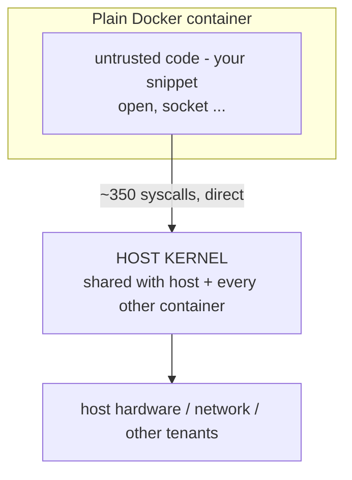
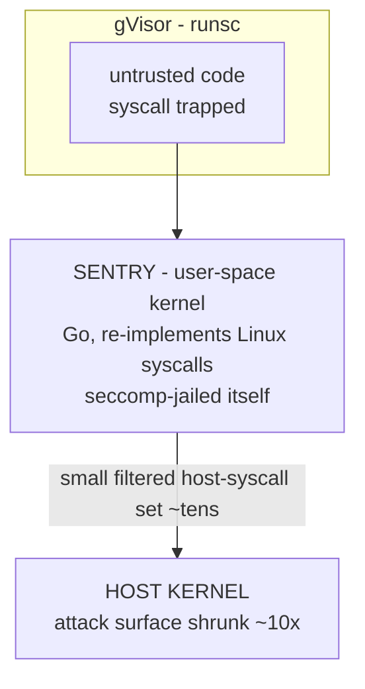
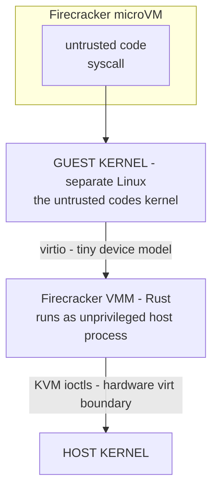

# Lecture 10: Sandboxing Untrusted Code Execution

> Sooner or later your agent will write Python and you will want to *run* it — for a data-analysis tool, a code interpreter, a "fix this failing test" loop. The instant you do that, you are executing attacker-authored code on your infrastructure, because the code came out of a model that reads untrusted content (Lecture 2). The naive move is `docker run` and a shrug: "it's containerized, it's isolated." It is not. A container is a resource *limiter* wearing an isolation costume; it shares your host's kernel, and one kernel bug or misconfig turns "sandboxed snippet" into "root on the box." This lecture takes you from that false comfort to a real boundary: why the shared kernel is the whole problem, what gVisor / Firecracker / E2B actually do differently, the four non-negotiable controls every code runner needs, and — most important — a *proving methodology* that makes you demonstrate egress and metadata theft are blocked with captured evidence, not vibes.

**Prerequisites:** Lecture 4 (exfiltration channels, the metadata endpoint as SSRF crown jewel), Lecture 6 (least-privilege tool use), working Docker/Podman, basic Linux syscall/namespace mental model · **Reading time:** ~30 min · **Part of:** Phase 11 (AI Safety, Security, Guardrails & Governance), Week 2

---

## The core idea (plain language)

When you run code you didn't write, you are trusting it not to do anything you didn't authorize. Untrusted code — the output of an LLM that ingested a poisoned document, a user-supplied snippet, a package from PyPI — earns *zero* trust. So the question is not "how do I run this code?" but "how do I run this code such that the worst it can do is bounded to something I've decided is acceptable?" That bound is the **sandbox**, and the quality of a sandbox is measured by one thing: **what an escape costs you.**

Here is the sentence to keep:

> **A security boundary is defined by what an attacker who fully controls the code inside it can still not reach. If a single kernel bug lets the code inside reach the host, the boundary is the kernel — and you're sharing that kernel with everything else on the machine.**

A plain Docker container is a superb *resource* and *namespace* organizer: its own filesystem view, PID table, network interface, CPU and memory caps. Those conveniences stop *accidents*. They do not stop an *adversary*, because every containerized process calls into **the same host kernel** through the same ~350 syscalls. The kernel is tens of millions of lines of C with a steady stream of privilege-escalation CVEs. Your isolation is exactly as strong as "no exploitable bug in the host kernel's syscall surface right now" — a bet you re-lose every time a new CVE drops.

The fix is not "harden the container more." It is to **stop sharing the kernel**: put a second kernel (or a syscall-intercepting user-space kernel) between the untrusted code and your host. That's what gVisor, Firecracker, and managed services like E2B do, three different ways. Everything else in this lecture is mechanism and proof.

---

## How it actually works (mechanism, from first principles)

### What a container actually is

A Linux container is not a thing; it's a *process* with three kernel features layered on it:

- **Namespaces** — its own view of PIDs, mounts, network interfaces, users, hostnames, IPC. `pid namespace` makes it think it's PID 1; `net namespace` gives it its own interfaces. This is the *isolation* illusion.
- **cgroups** — caps on CPU, memory, PIDs, I/O. This is the *resource limiter*.
- **Capabilities / seccomp / LSM (AppArmor, SELinux)** — drop root powers, filter syscalls, apply mandatory access control. This is *attack-surface reduction*.

Notice what is *not* in that list: a separate kernel. The containerized process makes syscalls straight into the host kernel:



The **entire host kernel syscall interface is reachable** from inside the container. seccomp can whittle ~350 syscalls down to ~40–60 (Docker's default profile blocks ~44), but that still leaves a very large, very complex C attack surface. Container escapes are a recurring genre — representative real CVEs (look them up):

- **CVE-2019-5736** — overwriting the `runc` binary from inside a container to get host root.
- **CVE-2022-0847 ("Dirty Pipe")** — a Linux page-cache bug lets an unprivileged process overwrite read-only files; trivially weaponized to escape containers.
- **CVE-2024-21626** — a `runc` file-descriptor leak allowing container escape.

Each means: code that was "just in a container" got host root. If that host also runs *other* customers' sandboxes or holds your cloud credentials, the blast radius is the whole machine.

### The three isolation strategies

**1. gVisor (`runsc`) — a user-space kernel that intercepts syscalls.** gVisor inserts a process called the **Sentry**, written in Go (memory-safe), that *implements the Linux syscall interface itself*. The untrusted process's syscalls are trapped (via `ptrace` or a KVM platform) and redirected to the Sentry instead of the host kernel. The Sentry re-implements ~200+ syscalls in user space and only makes a small, carefully filtered set of *its own* calls to the host. So the untrusted code never talks to the host kernel directly:



The win: an attacker who finds a bug in "Linux" now hits the *Sentry's* Go re-implementation, not the host C kernel, and even a Sentry compromise is boxed by a tight seccomp filter on what the Sentry may ask the host to do. Cost: syscall-heavy workloads run slower (interception overhead — often single-digit to ~2x on syscall-bound code; near-native on compute-bound), and some rare syscalls are unimplemented. It's a Docker *runtime* (`docker run --runtime=runsc`), so it drops into existing tooling.

**2. Firecracker — microVMs with a separate guest kernel.** Firecracker is a Virtual Machine Monitor (VMM) written in Rust that boots a real, separate **guest Linux kernel** inside a hardware-virtualized VM (KVM), but with a *minimal device model*: no BIOS, no PCI, a handful of paravirtualized devices (virtio-net, virtio-block), ~125 ms boot, a few MB of VMM overhead. This is the isolation model behind AWS Lambda and Fargate.



Now the untrusted code has its *own kernel to attack*. To reach the host it must (a) compromise the guest kernel, then (b) break through the KVM hardware-virtualization boundary via one of Firecracker's ~5 emulated devices — a far smaller, better-defended surface than "the whole host kernel syscall table." Most VM escapes historically go through fat device emulation (QEMU has hundreds of devices); Firecracker deliberately has almost none. Cost: it's a VM, so you manage kernel images and rootfs, and startup is ~100 ms. It isn't a drop-in Docker runtime (though Kata Containers / `firecracker-containerd` bridge that).

**3. Hosted E2B — someone else runs the microVMs.** E2B is a managed "code interpreter as a service": you call an API/SDK, it spins up a Firecracker-backed sandbox, runs your code, streams back stdout/stderr/files, and tears it down. You get the microVM isolation model without operating any of it, plus per-sandbox network policy, timeouts, and filesystem controls as config, and free credits for learning. The trade: your untrusted code (and whatever data you feed it) runs on E2B's infrastructure — a data-residency and vendor-trust decision. Great for a code interpreter over public data, a careful call for regulated data.

### The four non-negotiable controls (independent of which sandbox)

Isolation of the *kernel* is necessary but not sufficient. Even a perfect VM boundary does nothing if you hand the code a network route to your secrets. These four controls are orthogonal to the sandbox choice and every one is mandatory:

1. **No network egress — `--network none`.** The single highest-value control. Most damage from untrusted code is *data exfiltration* or *pulling a second-stage payload*; both need the network. Give the sandbox no interface and both die. In Docker: `--network none`. In Firecracker: don't attach virtio-net. In E2B: restrict network in the sandbox config.

2. **Block the cloud metadata endpoint `169.254.169.254`.** The SSRF-to-credentials crown jewel from Lecture 4. On a cloud VM, `GET http://169.254.169.254/latest/meta-data/iam/security-credentials/<role>` (IMDSv1) returns temporary IAM credentials. If your sandbox has *any* network reaching that link-local address, untrusted code steals the host's cloud identity and pivots to your whole account. `--network none` kills it for free; if you must allow egress, you **must** explicitly block `169.254.169.254` (ideally all of `169.254.0.0/16`) and require IMDSv2.

3. **Read-only filesystem + no writable host mounts.** `--read-only` makes the rootfs immutable; give a small `tmpfs` for scratch. This stops persistence, stops overwriting binaries (the `runc` escape class), and stops planting things that outlive the run. Never bind-mount the Docker socket (`/var/run/docker.sock`) or host paths into an untrusted sandbox — the socket is instant host root.

4. **CPU / memory / time limits.** `--cpus`, `--memory`, `--pids-limit`, and a hard wall-clock `timeout`. This is denial-of-wallet and fork-bomb defense (OWASP LLM10): an infinite loop, a `while True: fork()`, or a 40 GB allocation should hit a cap and die, not take the host down.

Mnemonic: **NRMT — No-network, Read-only, Metadata-blocked, Time/resource-capped.** A code runner missing any one of these is not done.

---

## Worked example

You're building a code-interpreter tool: the agent writes Python, you run it, return the output. Here is the Docker baseline, hardened with all four controls, then the same run under gVisor.

**Baseline runner (Docker + all four controls):**

```bash
docker run --rm \
  --runtime=runc \               # default: SHARED host kernel
  --network none \               # (1) no egress
  --read-only \                  # (3) immutable rootfs
  --tmpfs /tmp:size=64m \        #     small writable scratch
  --cpus 1 --memory 256m \       # (4) resource caps
  --pids-limit 128 \             #     fork-bomb cap
  --cap-drop ALL \               #     drop all Linux capabilities
  --security-opt no-new-privileges \
  python:3.12-slim \
  timeout 5 python /work/snippet.py   # (4) 5s wall-clock kill
```

Note: `--network none` means control (2), metadata blocking, is *free* — there is no route to `169.254.169.254` at all. That's why "no egress" is the top control: it subsumes the metadata problem.

**The hostile snippet (`snippet.py`) — your proving harness:**

```python
import socket, urllib.request, sys

# TEST A: steal cloud credentials via the metadata endpoint (must FAIL)
try:
    r = urllib.request.urlopen(
        "http://169.254.169.254/latest/meta-data/iam/security-credentials/",
        timeout=3)
    print("METADATA REACHABLE — LEAK:", r.read()[:200]); sys.exit(1)
except Exception as e:
    print("metadata blocked OK:", type(e).__name__, e)

# TEST B: raw socket to the internet (must FAIL)
try:
    s = socket.create_connection(("1.1.1.1", 53), timeout=3)
    print("INTERNET REACHABLE — LEAK: connected to", s.getpeername()); sys.exit(1)
except Exception as e:
    print("egress blocked OK:", type(e).__name__, e)

print("SANDBOX CONTAINED: no metadata, no egress")
```

**Expected evidence (captured to a file — this is the deliverable, not a claim):**

```
$ docker run ... python:3.12-slim timeout 5 python /work/snippet.py | tee evidence/docker.txt
metadata blocked OK: URLError <urlopen error [Errno 101] Network is unreachable>
egress blocked OK: OSError [Errno 101] Network is unreachable
SANDBOX CONTAINED: no metadata, no egress
```

Both attacks fail with `Network is unreachable` — the interface simply doesn't exist. That is your proof for the *egress* dimension. But watch the trap in the next section: this same green output under plain `runc` says **nothing** about kernel-escape resistance.

**Same snippet under gVisor** — one flag changes:

```bash
docker run --rm --runtime=runsc \    # user-space kernel instead of host kernel
  --network none --read-only --tmpfs /tmp:size=64m \
  --cpus 1 --memory 256m --pids-limit 128 --cap-drop ALL \
  --security-opt no-new-privileges \
  python:3.12-slim timeout 5 python /work/snippet.py | tee evidence/gvisor.txt
```

The network output is identical (the four controls are orthogonal to the runtime). What changed is invisible in this test but decisive: a syscall the snippet makes to trigger, say, a Dirty-Pipe-style kernel bug now hits the **Sentry's Go re-implementation**, not the host C kernel. You can *demonstrate the runtime is actually gVisor* — which IS observable — with:

```python
# runtime fingerprint: gVisor advertises itself
print(open("/proc/version").read())
# host kernel:   "Linux version 6.x ... (gcc ...)"
# under gVisor:  "Linux version 4.4.0 ... syscall emulation ...  gVisor"
```

Under `runsc`, `/proc/version` reports gVisor's emulated kernel string, not your host's. Capture that alongside the network evidence: together they prove *both* "no egress" (the four controls) *and* "not sharing the host kernel" (the runtime).

**The comparison table you should produce in `report.md`:**

| Property | Plain Docker (`runc`) | gVisor (`runsc`) | Firecracker microVM | E2B (hosted) |
|---|---|---|---|---|
| **Host kernel** | **SHARED** (direct syscalls) | Isolated (Sentry re-implements) | Isolated (separate guest kernel) | Isolated (Firecracker under the hood) |
| **Syscall attack surface** | full ~350, host C kernel | ~filtered, hits Go Sentry | guest kernel + ~5 virtio devices | same as Firecracker, you don't see it |
| **Devices** | host devices via cgroup | virtualized by Sentry | minimal virtio device model | managed |
| **Network namespace** | own ns (but can route to host/metadata unless `--network none`) | own ns (same caveat) | own guest netdev (omit it → none) | managed policy per sandbox |
| **Escape cost** | one host-kernel CVE | Sentry bug **+** its seccomp jail | guest-kernel bug **+** KVM/virtio break | E2B's problem (their microVM) |
| **Startup / overhead** | ~ms, ~native | ~ms, syscall-bound slower | ~125 ms, VM overhead | network round-trip (API) |
| **You operate** | yes | yes (runtime install) | yes (kernel + rootfs) | no (managed) |

The load-bearing row is the first one. Everything else follows from "do you share the host kernel."

---

## How it shows up in production

- **The "it's in a container" false sense of security.** The most common production failure: a team runs LLM-generated code in a plain Docker container reachable from the host network, calls that a sandbox, and ships. It resource-limits accidents and does nothing against an adversary. The bite is silent until someone (or an automated PyPI-supply-chain payload the model `pip install`ed) uses a kernel CVE to escape — and now you're doing incident response on a host that also held your prod credentials.

- **Egress you forgot you had, and the metadata endpoint is the whole account.** `docker run` with the *default* bridge network gives the container a route out — including to `169.254.169.254`. Build your runner without `--network none` because "the code needs to pip install" and you've left the metadata endpoint reachable — on any cloud host a direct path to IAM credential theft. SSRF-to-metadata from a browser render is bad; from *code you're executing* it's trivial (`urlopen`), and it steals the whole account, not one secret. IMDSv2 raises the bar but its hop-limit default of 1 is easy to misconfigure. Block the address regardless; if the code genuinely needs packages, pre-bake them or use a pull-through allowlisted proxy, never raw egress.

- **Latency and cost are real and choosable.** Plain Docker: ~ms, near-native CPU. gVisor: ~ms startup but syscall-heavy code (small file I/O, `fork`, network) can run noticeably slower — measure *your* workload. Firecracker: ~125 ms cold start plus you manage kernel/rootfs. E2B: an API round-trip per run (tens to hundreds of ms) but zero ops. For an interactive interpreter, gVisor or E2B usually win; for a high-throughput batch executor you control, Firecracker amortizes its startup.

- **Fork bombs and OOM are a when, not an if.** LLM-generated code with a bug (or a hostile prompt) *will* eventually allocate 40 GB or `fork()` forever. Without `--memory`, `--pids-limit`, and a `timeout`, one bad run takes down the host and every other tenant's sandbox with it.

- **Data residency of hosted sandboxes.** E2B (or any hosted runner) means executed code and its inputs touch a third party — fine for a public-data interpreter, a Week-3 governance decision (DPAs, zero-retention, region) for regulated/PII workloads. Don't let "it was easy" make the call.

---

## Common misconceptions & failure modes

- **"A Docker container is a security sandbox."** No. It's namespaces + cgroups + seccomp over the *shared host kernel*. It stops accidents and limits resources; it is not an isolation boundary against an adversary with a kernel exploit. Say "resource limiter," not "sandbox," when you mean plain Docker.

- **"seccomp/AppArmor makes the container safe."** They shrink the syscall attack surface (helpful, do it) but the remaining surface is still the host C kernel, and escapes have repeatedly come through *allowed* syscalls. Defense-in-depth, not a boundary.

- **"gVisor is just a stricter container."** It's a *user-space kernel*: the untrusted code's syscalls hit the Sentry (Go), not your host kernel. A categorically different escape path, not a stricter profile.

- **"Firecracker is heavyweight like a normal VM."** Its whole design is the *minimal device model* and ~125 ms boot — it exists so VM-grade isolation is cheap enough for per-request sandboxes (it runs AWS Lambda). "VM" here doesn't mean "slow."

- **"I blocked egress, so I don't need kernel isolation."** Orthogonal axes. No egress stops *exfiltration*; kernel isolation stops *escape/host-takeover*. A container with `--network none` on the shared kernel can still be escaped to host root by a kernel bug — and then the attacker adds their own network. You need both.

- **"The test passed, so it's sandboxed."** A green egress test under plain `runc` proves *no network*, not *kernel isolation*. Prove the runtime separately (`/proc/version`, `runsc` in the process tree). Don't let one green output cover a claim it doesn't support.

- **"Read-only filesystem breaks everything."** Give a small `tmpfs` for scratch. Most code runs fine read-only + `/tmp` tmpfs, and you gain immutability. Mounting the Docker socket into the sandbox is the opposite mistake — instant host root; never do it.

---

## Rules of thumb / cheat sheet

- **Plain Docker is a resource limiter, not a security boundary.** Shared kernel → one kernel CVE = host takeover. Fine for trusted code, never for untrusted.
- **The deciding question is "does it share the host kernel?"** Yes → not a real sandbox for untrusted code. gVisor (user-space kernel), Firecracker (separate guest kernel), and E2B (managed Firecracker) all answer no.
- **Always apply NRMT, regardless of runtime:** **N**o network (`--network none`), **R**ead-only fs (+ small tmpfs), **M**etadata blocked (`169.254.169.254`, subsumed by no-network), **T**ime/resource caps (`--cpus`, `--memory`, `--pids-limit`, `timeout`).
- **`--network none` is the single highest-value control** — it kills exfiltration *and* metadata theft in one flag. Add egress back only via an allowlisted proxy, never raw.
- **Never bind-mount the Docker socket or host paths** into an untrusted sandbox. `--cap-drop ALL` and `--security-opt no-new-privileges` by default.
- **Choose the runtime by ops budget:** E2B for zero ops with public data; gVisor for a Docker drop-in (`--runtime=runsc`) with strong kernel isolation; Firecracker for high-throughput sandboxes you run yourself.
- **Prove it, don't claim it.** Run the hostile snippet (metadata `urlopen` + raw socket connect), capture the failures, and separately fingerprint the runtime (`/proc/version`). Both artifacts, or it's not done.
- **All performance numbers here are approximate** — measure your own workload before committing.

---

## Connect to the lab

This lecture is the theory behind **Week 2, Lab Step 5** ("Sandbox code execution"). You'll build `sandbox/run_code.sh` to run a model-generated snippet in an isolated runner, with the **plain `docker run --network none --read-only --cpus 1 --memory 256m` as the baseline you must beat** — preferring gVisor (`--runtime=runsc`) or E2B (free credits, one API call). The Definition-of-Done is captured evidence: the hostile snippet's `curl`/`urlopen` to `169.254.169.254` and its raw socket connect to the internet **both fail**, and `report.md` explains *why Docker alone isn't a full boundary* (shared kernel) with your comparison table. Reuse the worked-example snippet as your proving harness and save both the network-failure output and the `/proc/version` runtime fingerprint as artifacts.

---

## Going deeper (optional)

Real, named resources — verify current URLs yourself; docs move.

- **gVisor documentation** (gvisor.dev) — "What is gVisor," the architecture guide on the Sentry and platforms (ptrace vs KVM), the Docker runtime setup. Search: "gVisor architecture Sentry syscall".
- **Firecracker** (firecracker-microvm.github.io, repo github.com/firecracker-microvm/firecracker) — the design doc, "minimal device model" rationale, and the NSDI paper "Firecracker: Lightweight Virtualization for Serverless Applications." Search: "Firecracker microVM design NSDI paper".
- **E2B docs** (e2b.dev) — the Code Interpreter SDK quickstart, sandbox lifecycle, network/timeout config. Search: "E2B code interpreter sandbox SDK".
- **Kata Containers** (katacontainers.io) — VM isolation as a Docker/K8s runtime (can use Firecracker as hypervisor). Search: "Kata Containers Firecracker runtime".
- **OWASP SSRF Prevention Cheat Sheet** (cheatsheetseries.owasp.org) and **AWS IMDSv2** (docs.aws.amazon.com) — the metadata control from the other side. Search: "AWS EC2 IMDSv2 hop limit", "OWASP SSRF prevention cheat sheet".
- **Docker security docs** (docs.docker.com) — seccomp default profile, capabilities, `--read-only`, `no-new-privileges`.
- **Named CVEs as case studies:** CVE-2019-5736 (runc), CVE-2022-0847 (Dirty Pipe), CVE-2024-21626 (runc fd leak).

---

## Check yourself

1. Explain, from first principles, why a plain `docker run` (even with seccomp and dropped capabilities) is not a security boundary for untrusted code, but is still useful. What single shared component defines its blast radius?
2. A colleague says "we're safe — the sandbox has `--network none`, so even if someone escapes the container they can't do anything." What's wrong with this reasoning? Name the two orthogonal axes involved.
3. Contrast how gVisor and Firecracker each avoid exposing the host kernel to untrusted code. Where does an attacker's syscall land in each, and what is the *additional* step needed to reach the host in the Firecracker case?
4. Your egress test prints `Network is unreachable` for both the metadata `urlopen` and the raw socket connect, under plain `runc`. State precisely what this proves and what it does *not* prove, and name the extra artifact you'd capture to cover the gap.
5. Why is `--network none` described as the single highest-value control, and how does it relate to blocking `169.254.169.254`? If you *must* allow some egress, what's the correct pattern?
6. You need a code interpreter over customers' regulated PII, at moderate throughput, and you have a small ops team. Walk through the runtime choice (Docker/gVisor/Firecracker/E2B) and the four non-negotiable controls, justifying each decision.

### Answer key

1. A container is a host *process* wrapped in namespaces (isolation illusion), cgroups (resource caps), and seccomp/capabilities (attack-surface reduction) — but it makes syscalls **directly into the shared host kernel**. seccomp/cap-drop shrink but don't remove that surface, and escapes have come through allowed syscalls and kernel CVEs (runc, Dirty Pipe). Its isolation is only as strong as "no exploitable host-kernel bug right now." Still useful: it stops *accidents*, limits resources, organizes deployment — a resource limiter, not an adversarial boundary. The shared component defining blast radius is the **host kernel**.
2. It conflates two independent axes. `--network none` addresses **egress/exfiltration**; it does nothing for **escape/host-takeover** via a kernel bug. On the shared kernel, a no-network container can still be escaped — and once on the host, the attacker adds their own network. You need kernel isolation (gVisor/Firecracker/E2B) *and* the egress controls; neither substitutes for the other.
3. **gVisor:** the untrusted code's syscalls are trapped and redirected to the **Sentry**, a user-space kernel in Go that re-implements Linux syscalls; the code never touches the host kernel, and the Sentry makes only a tightly seccomp-filtered set of host calls. The syscall lands in the Go Sentry. **Firecracker:** the code runs in a microVM with its own **separate guest Linux kernel**, so the syscall lands there. To reach the host the attacker must *additionally* compromise the guest kernel **and then** break out through the KVM boundary via one of the ~5 minimal virtio devices — a second, much smaller step.
4. It proves the sandbox has **no network egress** — neither the metadata endpoint nor the open internet is reachable. It does **not** prove kernel isolation: under `runc` the code still shares the host kernel and could be escaped by a kernel CVE regardless of network. The gap-covering artifact is a **runtime fingerprint** — `/proc/version` showing the gVisor kernel string (or `runsc`/Firecracker in the process tree). Capture both.
5. Most damage from untrusted code needs the network — exfiltrating data out or pulling a second-stage payload in — so removing the interface kills a whole class of attacks with one flag, and it *subsumes* metadata blocking because with no interface there's no route to `169.254.169.254`. If you must allow egress, use an **allowlisted forward proxy**, explicitly block `169.254.0.0/16` and require IMDSv2, and never open raw default-bridge egress.
6. **Regulated PII rules out E2B** (or any hosted runner) unless cleared via DPA/zero-retention/region — the data would touch a third party. Small ops team + moderate throughput + need for kernel isolation → **gVisor** is the sweet spot: a Docker drop-in (`--runtime=runsc`), real host-kernel isolation, runs on your infra keeping PII in-house. (Firecracker is stronger but more ops — probably overkill; plain Docker is disqualified.) Then apply all four: `--network none`, `--read-only` + small tmpfs, `--cpus`/`--memory`/`--pids-limit` + `timeout`, and drop capabilities + `no-new-privileges` + never mount the Docker socket.
