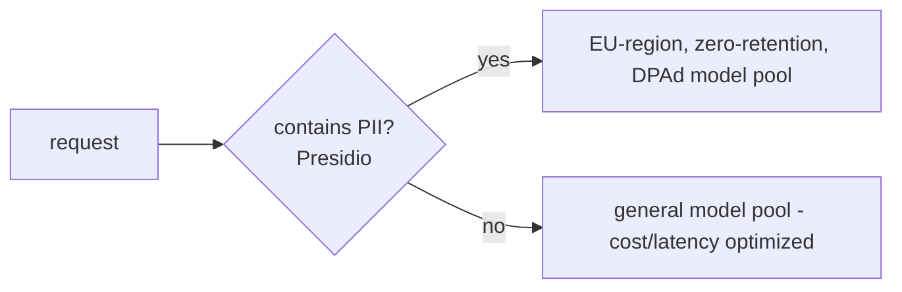

# Lecture 14: Compliance You Can Act On — GDPR, Data Residency & the EU AI Act

> Most engineers meet "compliance" as a Confluence page written by someone who has never seen your schema, and they respond by nodding in the meeting and changing nothing in the code. That is exactly how you end up unable to delete a person who asks to be deleted — because their name is still sitting in a Qdrant payload and a Langfuse trace nobody wired into the delete path. This lecture translates three bodies of law — the GDPR right to erasure, EU data residency, and the EU AI Act risk tiers — into things you build, query, and grep for. After it you will be able to write an `eu-ai-act-tier.md` that states your app's tier *and defends why*, wire a `gdpr-erasure` routine that deletes a user across the primary DB, the vector index, the trace backend, and caches, and then *prove* the deletion by re-querying every store and getting nothing back. You will also understand the architectural decision that makes all of this possible: **retrieve over personal data, don't train on it**, because you can delete a row but you cannot delete a person out of a frozen weight matrix.

**Prerequisites:** Lecture 8 (PII redaction & data minimization), Lecture 9 (secure tool use), a working RAG/agent stack with a primary DB + vector index + OpenTelemetry/Langfuse traces (Phases 4, 6, 10) · **Reading time:** ~30 min · **Part of:** Phase 11 (AI Safety, Security, Guardrails & Governance), Week 3

---

## The core idea (plain language)

Compliance for an AI engineer is not a philosophy of law. It reduces to three concrete, testable questions about your system:

1. **Can you make a person disappear?** (GDPR Article 17, the right to erasure.) When someone exercises their right to be forgotten, every store that can produce their data in an answer must stop producing it. Not "we deleted the main row." *Every* store.
2. **Do you know where their bytes physically live, and who else touches them?** (Data residency + processor obligations.) EU personal data belongs in EU regions, and every third party you pipe it through — every LLM API, every managed vector DB — is a data processor whose retention terms you are responsible for.
3. **How risky is what your app *does*, and what does that risk oblige you to do?** (EU AI Act risk tiers.) The law scales obligations to the stakes. A chatbot that summarizes documents and a system that screens job applicants live in different worlds, and the law says so explicitly.

The engineering insight that ties all three together, and the one this lecture keeps returning to:

> **The unit of compliance is the person, and personal data is a liability that spreads.** Every place a name, email, or user-linked embedding lands is a place you now have to be able to find it, delete it, locate it geographically, and reason about its risk. So the cheapest compliance strategy is *not collecting it, not copying it, and not baking it into anything you can't edit.*

That last clause — "anything you can't edit" — is why the single most important architectural decision for GDPR compliance is made long before the erasure routine exists: **you favor retrieval over training on personal data.** A fine-tuned or pre-trained weight is a lossy, irreversible compression of its training set. You cannot `DELETE` from it. If a user's data is in your vector index, erasure is a `delete_by_filter`. If it's in your model's weights, erasure is "retrain the model without them," which nobody does on request. Retrieval keeps personal data in stores you can mutate; training welds it into stores you can't.

---

## How it actually works (mechanism, from first principles)

### GDPR in one screen (the parts that touch code)

GDPR is large; the slice that changes your architecture is small. **Lawful basis** (Article 6) is the "why are you allowed to hold this at all" question — for most product features it's *contract* (you need the data to provide the service the user signed up for) or *consent* (they opted in), and you record which one per data category. That's a data-model and a config decision, not a runtime hot path, so we spend one paragraph on it: tag each personal-data field with its lawful basis and retention period in a data map, and if you can't name a basis for a field, stop collecting the field.

The part that dominates engineering effort is **erasure (Article 17)**, and its close cousins **access (Article 15)** and **portability (Article 20)** — all three require you to *enumerate everywhere a given person's data lives.* Build the erasure path and access/portability come nearly free, because they walk the same store list.

**The store inventory is the whole game.** A typical RAG/agent app spreads one user's personal data across at least these stores:

```
                       ┌─────────────────────────────────────────────┐
   user_id = 8842  ──► │  1. Primary DB      users, messages, orders  │  ← everyone remembers this
                       │  2. Vector index    embeddings + payload      │  ← FORGOTTEN #1
                       │  3. Trace backend   Langfuse/OTel spans       │  ← FORGOTTEN #2
                       │  4. Caches          Redis, prompt cache, CDN  │  ← forgotten
                       │  5. Object storage  uploaded files, exports   │
                       │  6. Search index    Elastic/OpenSearch        │
                       │  7. Analytics/DWH   BigQuery, Snowflake        │
                       │  8. Backups         snapshots, WAL archives    │  ← special rules (below)
                       │  9. 3rd-party APIs  LLM provider logs          │  ← you don't control; contract instead
                       └─────────────────────────────────────────────┘
```

The two stores teams most reliably forget are **#2 the vector index** and **#3 the trace store** — precisely because they were added by the AI feature and never made it onto the "personal data" list the privacy team maintains. The vector index holds the user's text as a payload *and* as an embedding (an embedding of a sentence containing an SSN is still that SSN's data). The trace store holds the *raw prompt and completion* of every request the user ever made — which is why Lecture 8 hammered redaction-at-write: a trace store you redact at write is a trace store you barely have to erase, because there's nothing personal in it.

**Backups (#8) get a carve-out you must understand.** You cannot surgically delete one user from an immutable nightly snapshot without corrupting it, and regulators know this. The accepted engineering pattern is: (a) delete from all *live* stores immediately, (b) let backups age out on their normal retention schedule (e.g., 35 days), and (c) if a backup is *restored* before it ages out, replay the erasure log against the restored data so the deleted users don't silently come back. Document this in your erasure runbook; "backups age out in ≤N days and restores replay the tombstone log" is a defensible answer. "We rewrite every backup on every deletion" is not — it's infeasible and nobody expects it.

### The erasure routine, mechanically

An erasure routine is a **fan-out delete plus a verification query**, and the verification is not optional — an erasure you don't assert against is an erasure you'll discover was broken during an audit. Structure:

```python
def erase_user(user_id: str) -> ErasureReport:
    report = ErasureReport(user_id=user_id, started=now())

    # 1. Primary DB — cascade or explicit per-table deletes
    report.db = db.execute("DELETE FROM messages WHERE user_id = %s", user_id).rowcount
    db.execute("DELETE FROM orders   WHERE user_id = %s", user_id)
    db.execute("DELETE FROM users    WHERE id = %s",      user_id)

    # 2. Vector index — delete by metadata filter, NOT by vector id you have to look up
    report.vectors = qdrant.delete(
        collection="kb",
        points_selector=Filter(must=[FieldCondition(key="user_id", match=MatchValue(value=user_id))]),
    )

    # 3. Trace backend — delete spans/sessions for this user
    report.traces = langfuse.delete_traces(filter={"user_id": user_id})   # or OTel backend API

    # 4. Caches — targeted keys + any key that could embed the user
    report.cache = redis.delete(*redis.keys(f"user:{user_id}:*"))

    # 5. VERIFY — the assertion that makes this real
    assert db.query("SELECT 1 FROM users WHERE id=%s", user_id) is None
    assert qdrant.count("kb", filter=user_filter(user_id)) == 0
    assert langfuse.count_traces(user_id=user_id) == 0
    assert not redis.keys(f"user:{user_id}:*")

    report.finished = now()
    return report   # persist this as tamper-evident proof you did it
```

Three mechanical points that bite people:

- **Delete by *filter/metadata*, not by primary key you have to join to.** Your vector index stores `user_id` in the payload precisely so you can `delete_by_filter`. If it doesn't, you cannot erase without reconstructing the mapping — so **store the user_id in the payload at ingest time** as a design requirement, not an afterthought. This is a decision you make in Phase 4/6, and it's why this lecture matters before you have a compliance problem.
- **The verification query must hit the store's *read path*, not just trust the delete's return code.** A `delete` that returns "0 rows" might mean "already gone" or might mean "your filter was wrong and matched nothing." Re-query and assert emptiness.
- **Idempotency.** Erasure gets retried (queues, partial failures). Running it twice on an already-erased user must succeed, not throw. Every step above is naturally idempotent (delete-if-exists); keep it that way.

### Data residency, mechanically

Residency is two separate obligations that get conflated:

1. **Where the bytes sit at rest.** Pick the EU region of every managed store: `eu-central-1`, `europe-west4`, the EU cluster of your vector DB, the EU ingestion endpoint of your trace vendor. This is config, and it's easy to get *90%* right and 100% wrong — the leak is usually a single US-default service (an analytics SDK, a US log aggregator, a `us-east-1` fallback in a Terraform module).
2. **Where the bytes *transit and get processed*.** Every LLM API call ships the prompt — which may contain personal data — to the provider's servers. Residency isn't satisfied by your DB being in Frankfurt if your prompt with a customer's medical history goes to a US inference endpoint that logs it for 30 days.

So before routing *personal* data through any external API, you check two contractual facts, and they are engineering-checkable:

- **Region pinning:** does the provider offer an EU processing region, and are you actually calling it? (Check the endpoint host/region param, not the marketing page.)
- **Zero-retention / DPA terms:** does your **Data Processing Agreement** with the vendor specify zero-retention (they don't store your inputs) or a short bounded retention, and no training on your data? Major LLM providers offer zero-retention modes and enterprise DPAs, but they are often **opt-in** and **not the default** — the default free/consumer tier frequently *does* retain and may train. Verify the tier you're actually billed on.

The clean pattern is a **routing gate**: classify whether a request payload contains personal data (reuse the Presidio detector from Lecture 8), and if it does, route only to endpoints on an allowlist of EU-region, zero-retention, DPA-covered providers. Non-personal traffic can use the cheaper/faster pool.



### EU AI Act risk tiers, mechanically

The Act sorts AI *systems* (by use, not by model size) into four tiers, and each tier is a different obligation set:

```
UNACCEPTABLE  ── banned outright. Social scoring, manipulative subliminal
                 techniques, most real-time public biometric ID, emotion
                 inference in workplace/school. You do not build these.

HIGH-RISK     ── allowed but heavily regulated. Triggers: biometric ID,
                 critical infrastructure, education access, EMPLOYMENT
                 (CV screening, hiring), essential services incl. CREDIT
                 scoring, law enforcement, migration, justice, safety
                 components of regulated products.
                 Obligations: risk mgmt system, data governance, technical
                 docs, logging, human oversight, accuracy/robustness,
                 conformity assessment, registration.

LIMITED       ── transparency duties only. Chatbots, general-purpose
                 assistants, content generators. You must: DISCLOSE that
                 the user is interacting with AI, and LABEL AI-generated
                 or manipulated content (incl. deepfakes) as artificial.
                 ← MOST LLM APPS LIVE HERE.

MINIMAL       ── no specific obligations. Spam filters, AI in games,
                 inventory optimization. Voluntary codes of conduct.
```

The tiering decision is a **classification you can write down and defend**, and the defense is what goes in `eu-ai-act-tier.md`. The reasoning is: *start at limited-risk (the default for a generative/assistant app), then check each high-risk trigger against what your app actually does.* If none fire, you're limited-risk and your obligations are transparency. If one fires, you're high-risk and the obligation set explodes.

The high-risk **signals** to test against — memorize these, because they're the ones that quietly reclassify a "just a chatbot" into a regulated system:

- **Biometric** identification or categorization of people.
- **Employment**: screening/ranking candidates, task allocation, monitoring, or evaluation decisions.
- **Credit / essential services**: creditworthiness scoring, access to essential private/public services and benefits.
- **Education**: determining access, scoring exams.
- **Safety-critical**: a component that could endanger health/safety (medical devices, vehicles, critical infrastructure).
- **Law enforcement, migration, justice.**

Note the trap: **the same underlying LLM is limited-risk or high-risk depending on the use.** GPT-class model summarizing meeting notes = limited. The *same* model ranking job applicants = high-risk. The tier attaches to *what the deployed system decides*, not the model card.

Separately, if you *build or fine-tune a general-purpose model* above a compute threshold, GPAI provider obligations apply (transparency, training-data summaries, and for the largest models, systemic-risk duties). Most app teams are *deployers* of someone else's GPAI, not providers, so this usually isn't your row — but note it in the doc so a reviewer sees you considered it.

---

## Worked example

**App: "DeskMate," an internal RAG assistant** that answers employee questions over company docs and can draft replies. Employees ask it things; it retrieves from a vector index; it logs traces to Langfuse (EU); primary data in Postgres (`eu-central-1`); it calls an LLM API for generation.

**Step 1 — EU AI Act tier.** Start at limited. Check triggers: biometric? No. Employment *decisions*? It drafts replies and answers questions — it does **not** screen candidates or evaluate employees, so no. Credit? No. Safety-critical? No. → **Limited-risk.** Obligations: disclose "You're chatting with an AI assistant" in the UI, and label AI-drafted replies as AI-generated. That's the whole `eu-ai-act-tier.md` conclusion, *with the trigger-by-trigger reasoning written out so an auditor sees the work.*

Now change one thing: DeskMate gains a feature that **ranks internal job applicants** by fit. Re-run the check: the *employment* trigger fires → **high-risk.** Same model, same stack, but now you owe a risk-management system, data-governance docs, human oversight on every ranking, logging, and a conformity assessment. This is the single most important lesson of the tier exercise: one product decision moved you across a regulatory chasm, and the only way you caught it was by testing the triggers.

**Step 2 — Residency check.** Postgres: `eu-central-1` ✓. Vector DB: EU cluster ✓. Langfuse: EU ingestion ✓. LLM API: the default endpoint is US and the billed tier *retains inputs for 30 days and may use them to improve services*. ✗. Fix: switch to the provider's EU region endpoint on the enterprise tier with a signed DPA and zero-retention mode enabled, and add the routing gate so any prompt Presidio flags as containing personal data only goes there.

**Step 3 — Erasure.** Employee 8842 leaves and requests erasure. Run `erase_user("8842")`:

```
DB:      DELETE messages(41) orders(3) users(1)      → 45 rows
Vectors: delete_by_filter user_id=8842               → 128 points
Traces:  delete_traces user_id=8842                  → 372 spans
Cache:   del user:8842:*                              → 6 keys
VERIFY:  users=0  vectors=0  traces=0  cache=0        → PASS
```

The numbers matter: **128 vector points and 372 trace spans** would have survived a naive "delete the user row" and kept answering questions with 8842's data. That gap is the finding an auditor writes up. The verification line turning all-zero is the evidence you did it right — persist that `ErasureReport`, hash-chained into the audit log from Lecture 13's sibling, as proof.

---

## How it shows up in production

- **The erasure that "worked" and didn't.** The DAG deletes the DB row, the API returns 200, the user is told they're forgotten — and six months later a support query still surfaces their document because the vector payload was never touched. This is the single most common real GDPR failure in AI apps, and it's a *config/wiring* bug, not a legal one: the vector index and trace store weren't on the delete fan-out list. Cost: a reportable breach and a regulator asking why your "deletion" doesn't delete.
- **Residency leak via a US default.** Everything's in Frankfurt except one telemetry SDK that phones home to `us-east-1`, or a prompt-cache layer hosted in the US, or a fallback route that kicks in under load. Residency is only as good as your *least* compliant hop, and the leak is usually a dependency you didn't audit.
- **The training shortcut that can't be undone.** A team fine-tunes on real support transcripts (full of names, emails, order details) because it's the easiest data to hand. Now every erasure request is unanswerable for that data — you'd have to retrain. This is why "retrieve, don't train, on personal data" is an architecture rule with teeth: it's the difference between erasure being a query and being impossible.
- **Latency/cost of the residency gate.** Pinning to an EU zero-retention enterprise endpoint can be pricier and occasionally slower than the general pool, and you can't fail over to the cheap US pool under load without breaking residency. Budget for the EU pool's capacity; don't let an autoscaler "helpfully" spill personal-data traffic to a non-compliant region.
- **Tier misclassification discovered late.** A "chatbot" ships as limited-risk, then a PM adds a feature that scores or ranks people, and nobody re-runs the tier check. You're now operating a high-risk system without the required documentation, oversight, or conformity assessment. The mitigation is process: any feature touching employment/credit/biometrics/safety re-triggers the tier review *before* it ships.
- **Access/portability requests reuse the erasure map — or don't.** Teams build erasure and forget that Article 15 (access) and Article 20 (portability) walk the *same* store list to *export* instead of delete. If your erasure enumerates stores in one place, access/portability are a small variation; if it's scattered, you rebuild the enumeration three times and they drift.

---

## Common misconceptions & failure modes

- **"We deleted the user, so we're GDPR-compliant."** You deleted *a* row. Erasure is compliant only when *every* store stops producing the person, verified by re-query. The vector index and trace store are the usual survivors.
- **"Redaction and erasure are the same thing."** No. Redaction (Lecture 8) removes PII *at write* so it never lands — it shrinks what you must erase. Erasure removes a *known person* on request from what did land. You need both: redaction so traces are near-empty of PII, erasure for the DB/vector data you legitimately keep.
- **"Our DB is in the EU, so we have residency."** Residency includes every *transit and processing* hop, especially LLM APIs. An EU database with a US inference endpoint that logs prompts is not compliant.
- **"Zero-retention is the default."** It is usually **opt-in** on an enterprise tier with a DPA. Consumer/free tiers commonly retain and may train on your inputs. Verify the tier you're billed on, per provider.
- **"We use an LLM, so the EU AI Act makes us high-risk."** The tier attaches to the *use*, not the model. Most LLM apps are **limited-risk** (transparency duties). You only go high-risk when a specific trigger — biometric, employment, credit, education access, safety-critical, law enforcement — fires.
- **"Anonymized data isn't personal data, so we're exempt."** True *only* if it's truly anonymous (irreversible). Pseudonymization (a user_id you can re-link) is still personal data. And embeddings of personal text are personal data — you can often recover attributes from them.
- **"We'll rewrite all backups on each deletion."** Infeasible and not expected. Live-delete immediately; let backups age out on schedule; replay the tombstone log on any restore. Document it.
- **"Training on personal data is fine if we got consent."** Consent may make collection lawful, but it doesn't make the data *deletable from weights*. You've still architected yourself into an unanswerable erasure request. Prefer retrieval.

---

## Rules of thumb / cheat sheet

- **Erasure fan-out list (memorize):** primary DB → vector index → trace backend → caches → object storage → search index → analytics/DWH → backups (age-out + replay) → 3rd-party (contract, not delete). *Verify each with a re-query that returns empty.*
- **The two forgotten stores:** vector index and trace store. Put them on the list first.
- **Store `user_id` in the vector payload at ingest** so erasure is a `delete_by_filter`, not an archaeology project. Decide this in Phase 4/6.
- **Redact at write (Lecture 8) → erase what remains.** Redaction shrinks the trace-store erasure problem to near-zero.
- **Retrieve, don't train, on personal data.** A weight is not a store you can `DELETE` from.
- **Residency = at-rest region + every transit/processing hop.** Audit the *least* compliant dependency, not the marketing page.
- **Before routing personal data to any API:** confirm (1) EU region endpoint, (2) zero-retention / DPA, (3) no-training. All three, on the tier you're billed on.
- **EU AI Act default = limited-risk** (disclose AI use + label AI content). Test the high-risk triggers; if none fire, stay limited and write down why.
- **High-risk triggers:** biometric · employment · credit/essential services · education access · safety-critical · law enforcement. Any one → high-risk obligations.
- **Re-run the tier check on any feature** that touches those triggers, *before* ship.
- **`eu-ai-act-tier.md` must state the tier AND the trigger-by-trigger reasoning.** A bare "limited-risk" with no work shown is not defensible.
- **Persist the `ErasureReport`** (counts + verified-empty) as tamper-evident proof you honored the request.

*(All specific retention windows, region names, and provider tier behaviors above are illustrative and change frequently — verify against the current DPA and provider docs before relying on them.)*

---

## Connect to the lab

This lecture is the theory behind **Week 3, Steps 5 and 6**. In Step 5 you write `governance/gdpr-erasure.py`: given a user id, delete their rows in the DB, vectors in the index, traces, and cache entries — then **assert a follow-up query returns nothing from any store** (that's the verification line above, and it's the Definition-of-Done gate). In Step 6 you write `governance/eu-ai-act-tier.md` stating your app's tier *and why* — run the trigger checklist against your actual agent, and if you added the applicant-ranking-style feature, watch it flip to high-risk. The residency reasoning feeds the `deploy-gate.py` check that refuses to ship without data-residency evidence present.

---

## Going deeper (optional)

Real, named resources (search where no stable deep link is given — don't trust invented URLs):

- **Official GDPR text** — `gdpr-info.org` (unofficial but faithful, article-by-article). Focus on Articles 6 (lawful basis), 15 (access), 17 (erasure), 20 (portability), 25 (data protection by design), 32 (security).
- **EU AI Act** — the official portal `artificial-intelligence-act.eu` and the European Commission's AI Act pages. Search "EU AI Act risk tiers official summary" and "EU AI Act high-risk Annex III" for the enumerated high-risk use cases.
- **Microsoft Presidio** — `microsoft.github.io/presidio` for the PII detection you reuse in the residency routing gate and write-time redaction.
- **Your vector DB's delete-by-filter docs** — search "Qdrant delete points by filter" / "pgvector delete" / "Pinecone delete by metadata" for the exact API used in erasure.
- **Your trace vendor's deletion API** — search "Langfuse delete traces GDPR" / "OpenTelemetry collector data deletion" for the trace-store leg.
- **Provider data-usage / retention terms** — search "<provider> zero data retention enterprise" and "<provider> data processing addendum (DPA)"; read the *current* terms for the tier you're billed on, not a blog summary.
- **NIST AI RMF & ISO/IEC 42001** — for how erasure/residency/tiering slot into a broader AI management system (search "NIST AI RMF 1.0", "ISO/IEC 42001").
- **Concept to search:** "machine unlearning" — the research area on removing data from trained models, and why it's hard enough that "retrieve, don't train" remains the practical answer.

---

## Check yourself

1. A colleague says "I ran `DELETE FROM users WHERE id=8842` and the API returned 200, so 8842 is erased." Name the two stores most likely still holding 8842's data, and how you'd prove it in ten seconds.
2. Why does favoring retrieval over training on personal data change erasure from *hard* to *easy*? What becomes impossible if you fine-tune on that data instead?
3. Your Postgres, vector DB, and trace store are all in `eu-central-1`. Give two ways personal data could still leave the EU.
4. Your app is a document-summarizing chatbot. What EU AI Act tier is it, what are your obligations, and what single product change would flip it to high-risk?
5. What are the three contractual/technical facts you verify about an LLM provider *before* routing personal data to it, and why is "we use their API" not enough?
6. How do you handle GDPR erasure for immutable nightly backups without corrupting them, and what must you do if you restore one?

### Answer key

1. **The vector index and the trace backend.** The `DELETE` hit only the primary DB. Prove it in seconds: `qdrant.count("kb", filter=user_id=8842)` and `langfuse.count_traces(user_id=8842)` — non-zero means 8842 still lives there and can surface in answers. (The verification query is the whole point.)
2. Retrieval keeps personal data in **mutable stores** (rows/points/spans) you can `DELETE`/`delete_by_filter` — erasure is a query. Training **welds the data into frozen weights**, a lossy irreversible compression you cannot selectively delete from; honoring erasure would require retraining without the person, which is infeasible on request. So training makes erasure effectively impossible.
3. (a) **LLM API calls** — the prompt (possibly containing personal data) is processed on the provider's servers, which may be a US region and/or retain/train on inputs. (b) A **US-default dependency** — an analytics/telemetry SDK, a US log aggregator, a prompt-cache/CDN layer, or a `us-east-1` autoscaling fallback. Residency is only as strong as the least-compliant hop.
4. **Limited-risk.** Obligations: **disclose** that the user is interacting with AI and **label** AI-generated content. The flip: adding a feature that makes **decisions about people** in a listed domain — e.g., screening/ranking job applicants (employment) or scoring creditworthiness — fires a high-risk trigger and pulls in risk-management, data-governance, human-oversight, logging, and conformity-assessment obligations. Same model, different use.
5. (1) **EU region endpoint** actually being called (check the host/region, not the marketing page); (2) **zero-retention / bounded-retention DPA** signed; (3) **no training** on your inputs. "We use their API" is insufficient because these are typically **opt-in on an enterprise tier** — the default/consumer tier often retains and may train, so the tier you're billed on decides your compliance.
6. Delete from all **live** stores immediately; let backups **age out** on their normal retention schedule (you can't surgically edit an immutable snapshot). If you **restore** a backup before it ages out, **replay the erasure/tombstone log** against the restored data so deleted users don't silently reappear. Document this pattern in the erasure runbook — it's the accepted, defensible answer.
