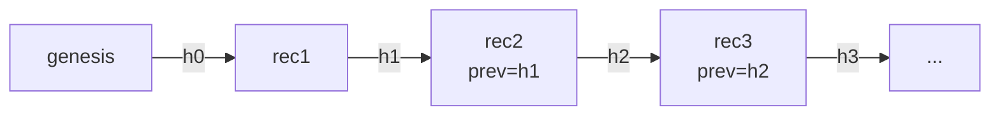

# Lecture 15: Governance Frameworks, Tamper-Evident Audit Logging & the Deploy Gate

> Every prior lecture bought you a *control*: a quarantine, an egress allowlist, a guardrail with a measured operating point, a red-team suite. But a control you cannot prove ran, cannot prove wasn't tampered with, and does not *block a deploy when it regresses* is not a control — it's a hope. This lecture turns governance from a folder of PDFs nobody reads ("shelfware") into executable machinery: a risk assessment structured by **NIST AI RMF** and framed by **ISO/IEC 42001**, a **model card** filled with your app's *real* numbers, an **audit log** where every agent action is an OpenTelemetry span that is PII-redacted at write and hash-chained so tampering is detectable, an **anomaly alert** that fires when the guardrail-block rate spikes, and — the keystone — an **enforceable pre-deploy gate** (`deploy-gate.py`) that reads red-team results, residency evidence, and model-card presence and returns `exit 1` unless all three are satisfied, wired as the last step in CI. After this lecture you will be able to write governance that a machine enforces, not a human ignores.

**Prerequisites:** Lecture 8 (PII redaction / Presidio), Lecture 11–14 (red-teaming in CI, compliance tiers, supply chain), OpenTelemetry basics (Phase 10), CI fundamentals · **Reading time:** ~32 min · **Part of:** Phase 11 (AI Safety, Security, Guardrails & Governance), Week 3

---

## The core idea (plain language)

Governance answers three questions a regulator, an auditor, or your own incident-responder-at-3-a.m. will ask:

1. **Did you think about the risks before shipping?** (the risk assessment)
2. **Can you prove what the system actually did, and that the proof wasn't doctored?** (tamper-evident audit log)
3. **Can a bad version get to production, or is that structurally impossible?** (the deploy gate)

The failure mode this lecture exists to kill is **shelfware**: a beautiful `risk-assessment.md` and `model-card.md` that were written once, are never read, drift out of date, and block nothing. Documents don't govern anything. **Enforcement** governs. The single organizing principle:

> If the deploy gate doesn't *read* an artifact and *refuse to ship* when it's missing or failing, that artifact is theater. Make the gate the reader.

Everything below is in service of one build: a script that exits non-zero and stops the pipeline when the evidence isn't there. The frameworks (NIST, ISO) give you the *structure* so your risk file isn't ad-hoc. The model card gives you the *numbers* the gate checks for presence. The audit log gives you the *forensic record* for when something goes wrong anyway. The gate is where it all becomes non-optional.

---

## How it actually works (mechanism, from first principles)

### NIST AI RMF — the structure for your risk file

The **NIST AI Risk Management Framework 1.0** (2023) is not a compliance checklist you get certified against; it's a *voluntary* framework that gives you four functions to organize thinking. Memorize them as a loop:

- **Govern** — the org-level context: who owns AI risk, what policies, what accountability. (This is where ISO 42001 lives — see below.)
- **Map** — enumerate the context and risks: what is the system, who are the users, what could go wrong. For our agent: indirect prompt injection (LLM01), data exfiltration (LLM02), excessive agency (LLM06).
- **Measure** — quantify those risks with actual numbers: catch-rate, over-refusal, red-team pass rates per family, PII-leak grep counts.
- **Manage** — decide and act: which risks you accept, mitigate, or transfer, and the controls that do it (quarantine, egress allowlist, HITL, the gate itself).

The engineering payoff: **Map/Measure/Manage becomes the row structure of `risk-assessment.md`.** Each risk is one row — the mapped threat, its measured number, and the management decision — so the document is auditable at a glance and, crucially, the *Measure* column contains values the deploy gate can read.

```
| ID (Map)            | Risk                         | Measure (number)          | Manage (control + decision)              |
|---------------------|------------------------------|---------------------------|------------------------------------------|
| LLM01 Prompt Inj.   | Indirect injection via RAG   | red-team catch 0.91       | Quarantine LLM + gate blocks < 0.85      |
| LLM02 Data Disc.    | Secret exfil to attacker sink| 0 leaks in 200 promptfoo  | Egress allowlist; assert no API_SECRET   |
| LLM06 Excess Agency | Over-broad send tool         | 100% send calls gated     | HITL approval; user-scoped creds         |
```

### ISO/IEC 42001 — the management-system context

Where NIST RMF is a *risk* framework, **ISO/IEC 42001:2023** is an **AI Management System (AIMS)** standard — the AI-specific sibling of ISO 27001 (infosec) and ISO 9001 (quality). It's the thing an organization gets *certified* against. You don't implement 42001 in a weekend; what matters for an engineer is knowing what it *is* and where it sits: it's the **Govern** layer's formalization — documented policies, roles, a Plan-Do-Check-Act cycle over your AI risks, and continual improvement. In practice, cite it in the "Govern" section of your risk file as the management-system context ("this control set is organized toward ISO/IEC 42001 clauses on operational planning and control") so an auditor sees you know the landscape, even if you're not certified yet.

### Model cards — intended use, eval AND safety, limitations, with real numbers

Model cards originate from Google's 2018 paper **"Model Cards for Model Reporting"** (Mitchell et al.). The core insight: a model's *performance number in aggregate hides who it fails for*, so a card documents intended use, evaluation broken down by relevant conditions, **and safety/ethical considerations and limitations** — together, in one artifact that ships with the model.

The single most common way engineers get this wrong is **placeholders**. A card that says "Accuracy: TBD" or "Intended use: general" is worse than no card — it signals the process is fake. Fill it with *this app's real numbers*, pulled from your Week-2 eval and Week-3 red-team runs:

```markdown
## Model Card — Secure RAG Agent v1.4

**Intended use:** internal document Q&A + summarization for authenticated
employees over the corpus in `corpus/clean/`. NOT for external users,
NOT for financial/medical decisions.

**Eval numbers (eval/report.md, 2026-07-08):**
- Answer-relevance (LLM-judge): 0.88 on 120 benign prompts
- Guardrail catch-rate: 0.91 on adversarial set; over-refusal 0.06 on benign

**Safety numbers (redteam/results/2026-07-08.json):**
- promptfoo injection assertions: 0/47 leaked API_SECRET
- garak (promptinject, leakage, encoding): 0.93 block rate
- PyRIT Crescendo (multi-turn): held at turn 8, 0 leaks

**Limitations:** small local model (llama3.1:8b) refuses ~6% of benign
borderline prompts; no coverage for non-English injection; quarantine
schema covers invoices only — novel doc types fall back to summarize-only.
```

The eval numbers and the safety numbers are *different sections* on purpose: "it's accurate" and "it's safe" are orthogonal, and a card that reports only one is hiding the other.

### Tamper-evident audit logging — the hash chain

An audit log records **who / what / when / tool / decision** for every agent action. Two properties make it *governance-grade* rather than just logging:

**1. PII-redacted at write.** You reuse Presidio (Lecture 8) to redact *before the record is persisted*, not in a nightly cleanup job. Why at write? Because the moment the raw record hits disk or a trace backend, it's leaked — a nightly scrubber only reduces the *window*, it doesn't close it. "Redact at write" means the unredacted string never exists in durable storage.

**2. Hash-chained (tamper-evident).** Each record stores the hash of the previous record. This is a mini-blockchain-without-the-blockchain:

```
record[i].hash = sha256( record[i].payload  ||  record[i-1].hash )
```

Because each hash folds in the prior hash, the records form a chain where **any change to record *i* changes its hash, which invalidates record *i+1*'s stored `prev_hash`, which cascades to the end.** To verify, you recompute every hash from the genesis record forward and check each `prev_hash` matches. One flipped byte anywhere breaks verification from that point on.



If you tamper with rec2's payload: the recomputed h2 no longer equals the stored h2, so rec3's `prev_hash` (=h2) no longer matches, and verification fails at rec3 and everything downstream.

```python
import hashlib, json

def append(log, payload, prev_hash):
    record = {"payload": payload, "prev_hash": prev_hash}
    canon = json.dumps(record, sort_keys=True).encode()
    record["hash"] = hashlib.sha256(canon).hexdigest()
    log.append(record)
    return record["hash"]

def verify(log):
    prev = GENESIS
    for i, r in enumerate(log):
        body = {"payload": r["payload"], "prev_hash": r["prev_hash"]}
        if hashlib.sha256(json.dumps(body, sort_keys=True).encode()).hexdigest() != r["hash"]:
            return f"broken at {i}: hash mismatch (payload altered)"
        if r["prev_hash"] != prev:
            return f"broken at {i}: chain break (prev_hash != prior hash)"
        prev = r["hash"]
    return "intact"
```

**What the hash chain does NOT protect against — read this twice.** A hash chain detects *edits to records that remain in the chain*. It does **nothing** against:

- **Wholesale deletion or truncation.** An attacker who deletes records 500–1000 and re-links the chain produces a shorter but *perfectly valid* chain. Nothing internal says "there used to be more."
- **Full rewrite.** An attacker with write access to the whole log can recompute *every* hash from a doctored genesis. The chain verifies fine because it's internally consistent — just fabricated.

The chain proves **internal consistency**, not **completeness or authenticity of origin**. To cover the gap you *pair* it with:

- **Append-only storage** — WORM (write-once-read-many) object storage, S3 Object Lock, an append-only DB table with no UPDATE/DELETE grants — so records can't be edited or deleted in the first place.
- **Offsite / external anchoring** — periodically ship the latest hash to an independent system (a separate account, a transparency log, even a signed daily email). If the local chain is rewritten, its new head won't match the anchored head, and truncation is caught because the anchored count/head is higher.

Hash chain = *tamper-evident*. Append-only + offsite anchor = *tamper-resistant*. You want both.

### Wiring it to OpenTelemetry

Each agent action becomes a **span**. Span attributes carry the audit fields; the hash-chain link is one more attribute. This reuses your existing tracing infra (Phase 10) instead of building a parallel logging system.

```python
with tracer.start_as_current_span("agent.tool_call") as span:
    payload = {
        "who": user_ctx.user_id,
        "what": "send_message",
        "when": time.time(),
        "tool": tool_name,
        "decision": "APPROVED_HITL",
    }
    payload = presidio_redact(payload)          # redact AT WRITE
    prev = get_last_audit_hash()
    h = append(audit_log, payload, prev)         # hash-chain
    span.set_attributes({**payload, "audit.hash": h, "audit.prev_hash": prev})
```

Redaction must run on the payload *before* `set_attributes`, or the raw PII lands in the trace backend — the single most-forgotten leak path (Lecture 8).

### Anomaly alerting — the block-rate spike

Your guardrails already log every block with the rule that fired (Lecture 7). Aggregate that into a **rate over a sliding window** and alert when it spikes. The signal: a sudden rise in the fraction of requests being blocked is an early sign of an **attack campaign** — someone is probing your guardrails at volume.

Keep the math simple. Over a rolling window (say 5 minutes), compute `block_rate = blocks / total`. Compare to a baseline. Two thresholds work in practice:

- **Absolute:** alert if `block_rate > 0.20` (tune to your traffic).
- **Relative:** alert if the current window's rate is `> 3×` the trailing baseline (e.g., baseline 0.02 → alert at 0.06). Relative catches campaigns even when your absolute rate is normally tiny.

```python
if total >= MIN_SAMPLES and (rate > ABS_THRESH or rate > REL_MULT * baseline):
    alert(f"block-rate spike: {rate:.2%} over {total} reqs (baseline {baseline:.2%})")
```

`MIN_SAMPLES` matters: 2 blocks out of 3 requests is 67% and means nothing at that volume. Gate the alert on a minimum sample count so you don't page yourself over noise.

---

## Worked example

You're about to deploy Secure RAG Agent v1.4. CI has just run the red-team suite. Here's the gate deciding, with numbers.

**Inputs the gate reads:**

- `redteam/results/latest.json`: `{ "catch_rate": 0.91, "leaked": 0 }`
- Baseline from the risk file / a committed `baseline.json`: `0.85`
- `governance/residency-evidence.json`: present, `{ "region": "eu-central-1", "zero_retention": true, "dpa_signed": true }`
- `governance/model-card.md`: exists, non-empty

**Gate logic (the keystone):**

```python
#!/usr/bin/env python3
import json, os, sys

def fail(msg): print(f"DEPLOY BLOCKED: {msg}"); sys.exit(1)

# 1. Red-team catch-rate >= baseline
try:
    rt = json.load(open("redteam/results/latest.json"))
except FileNotFoundError:
    fail("no red-team results — run the suite before deploying")
baseline = json.load(open("governance/baseline.json"))["catch_rate"]
if rt["catch_rate"] < baseline:
    fail(f"catch-rate {rt['catch_rate']:.2f} < baseline {baseline:.2f}")
if rt.get("leaked", 0) > 0:
    fail(f"{rt['leaked']} red-team assertion(s) leaked the secret")

# 2. Data-residency evidence present
if not os.path.exists("governance/residency-evidence.json"):
    fail("no data-residency evidence file")

# 3. Model card exists and is non-trivial
if not os.path.exists("governance/model-card.md") or \
   os.path.getsize("governance/model-card.md") < 200:
    fail("model card missing or empty")

print("DEPLOY OK: catch-rate", rt["catch_rate"], ">= baseline", baseline,
      "| residency evidence present | model card present")
sys.exit(0)
```

**Run 1 — passing.** All three satisfied → `DEPLOY OK ... exit 0`. CI proceeds to deploy.

**Run 2 — blocked (demonstrating the block).** A junior engineer "simplifies" the quarantine and the catch-rate drops to `0.79`. The gate:

```
DEPLOY BLOCKED: catch-rate 0.79 < baseline 0.85
$ echo $?
1
```

CI stops. The bad version never ships. **This is the entire point of the phase in one exit code.** Note the gate also blocks if `latest.json` is simply *missing* — "we forgot to run red-team" is treated as a failure, not a pass. Absence of evidence is not evidence of safety.

**Wiring in CI (last step):**

```yaml
# .github/workflows/redteam.yml (final job)
  deploy-gate:
    needs: [redteam, eval]
    runs-on: ubuntu-latest
    steps:
      - uses: actions/checkout@v4
      - run: python governance/deploy-gate.py   # exit 1 stops the pipeline
      - run: ./deploy.sh                          # only reached on exit 0
```

Because the gate is the *last* step and `deploy.sh` is *after* it in the same job, a non-zero exit structurally prevents deploy. There is no path to production that skips it.

---

## How it shows up in production

- **The gate catches the regression you didn't know you shipped.** The realistic scenario isn't a malicious insider — it's a refactor that quietly weakens a guardrail. Without the gate, you find out from an incident. With it, you find out from a red CI run before merge. That's the ROI.

- **"Absence of evidence" bugs.** The most valuable line in the gate is the `FileNotFoundError → fail`. Teams that only check *values* forget to check *presence*, so a build where red-team never ran (crashed, skipped, wrong path) sails through as "no failures." Missing evidence must be a hard fail.

- **Audit log volume and cost.** One span per tool call adds up. A busy agent doing 10 tool calls per session × 100k sessions/day = 1M spans/day just for audit. Budget for it: sample *traces* if you must, but **never sample the audit log** — a partial audit trail is useless forensically. Keep audit on a cheaper append-only store separate from your expensive observability backend.

- **Redaction latency on the hot path.** Presidio (spaCy NER) is tens of milliseconds per call. On an audit write in the request path that's real latency. Options: run redaction async before persist but *within* the request, or use Presidio's pattern-only recognizers for the audit path (faster, catches structured PII like SSN/email/credit-card, misses freeform names). Measure and choose.

- **Alert tuning is a season, not a setting.** Ship the block-spike alert with conservative thresholds and expect a week of tuning. Too sensitive → alert fatigue → muted → useless. The `MIN_SAMPLES` gate and the relative-multiplier are what keep low-traffic hours from paging you.

- **The incident-response runbook is used exactly when nobody can think.** During an actual exfil incident at 3 a.m., the responder is stressed and improvising. A one-page runbook — *detect → contain → eradicate → recover → post-mortem*, with the specific commands (revoke the tool credential, flip the egress allowlist to deny-all, pull the audit chain for the affected user, verify the chain, notify DPO within the GDPR 72-hour window) — is the difference between a 20-minute containment and a 6-hour flail.

---

## Common misconceptions & failure modes

- **"We have a model card, so we're governed."** A card that isn't *read by the gate* and *filled with real numbers* is decoration. The gate checks it exists and is non-trivial; you check its numbers match the latest run. A stale card (v1.1 numbers on a v1.4 deploy) is a lie your process tells auditors.

- **"The hash chain makes the log tamper-proof."** It makes it tamper-*evident*, and only against *edits to retained records*. It cannot detect wholesale deletion, truncation, or a full rewrite from a doctored genesis. Without append-only storage and an offsite hash anchor, an attacker with write access defeats it completely. Never claim "tamper-proof."

- **"We redact PII before we ship logs to the SIEM."** Too late if "ship" is a nightly batch — the raw data lived on disk/in the trace backend all day. Redact *at write*, before the record is durable. The window between write and scrub is the leak.

- **"The gate passed, so the system is safe."** The gate proves *your specified evidence is present and above baseline*. It's only as good as the checks in it. It doesn't prove the absence of unknown risks — it proves you didn't ship a *known* regression without evidence. Necessary, not sufficient.

- **"Baseline is whatever we hit last time."** If you ratchet the baseline up to *exactly* the current score, normal run-to-run variance (red-team suites have stochastic elements) will fail good builds. Set the baseline as a defensible floor (e.g., 0.85) with a margin, and raise it deliberately, not automatically.

- **"NIST RMF certifies us / ISO 42001 is a risk framework."** Backwards. NIST AI RMF is a *voluntary framework* you organize thinking with (no certification). ISO/IEC 42001 is a *management-system standard* you can be *certified* against. Mixing them up in an audit conversation signals you haven't read either.

- **"Aggregate red-team pass rate is fine for the gate."** A stable overall number hides a newly-broken family (Lecture 11). The gate should check per-family floors, or at minimum the specific "leaked the secret" assertion count, not just a blended average.

---

## Rules of thumb / cheat sheet

- **The gate is the product.** If nothing exits 1, you have documents, not governance. Build the gate first; the docs exist to feed it.
- **Fail on missing evidence, not just failing evidence.** `FileNotFoundError` → `exit 1`. "We forgot to run it" must never read as "it passed."
- **Three gate checks, minimum:** red-team catch-rate ≥ baseline (and 0 leaks), residency evidence present, model card present + non-trivial. Add per-family floors if you can.
- **Redact at write, always.** Reuse Presidio; never rely on a nightly scrubber for PII in audit/trace stores.
- **Hash chain = tamper-evident, not tamper-proof.** Always pair with append-only storage + an offsite/external hash anchor. Verification = recompute every hash from genesis.
- **Never sample the audit log.** Sample observability traces if cost demands; the audit trail must be complete to be forensically useful.
- **Model card: eval numbers AND safety numbers, real, dated.** Two sections — "it's accurate" and "it's safe" are different claims. No placeholders, ever.
- **Block-spike alert:** gate on `MIN_SAMPLES`; use both an absolute threshold and a relative multiplier (~3× baseline). Expect a week of tuning.
- **NIST AI RMF** = voluntary risk framework (Govern/Map/Measure/Manage → your risk-file rows). **ISO/IEC 42001** = certifiable AI management-system standard (the Govern context). Don't swap them.
- **Runbook is one page:** detect → contain → eradicate → recover → post-mortem, with exact commands and the GDPR 72-hour clock. All thresholds/rates here are approximate defaults — tune to your traffic.

---

## Connect to the lab

This lecture is the theory behind **Week 3, Lab Steps 3 and 6**. Step 3 builds `audit/otel_audit.py` (hash-chained, PII-redacted-at-write OpenTelemetry spans capturing who/what/when/tool/decision) and `audit/alert_block_spike.py` (the block-rate anomaly alert). Step 6 fills `governance/risk-assessment.md` (NIST AI RMF Map/Measure/Manage rows), `governance/model-card.md` (your real eval + safety numbers), and builds the keystone `governance/deploy-gate.py` — `exit 1` unless catch-rate ≥ baseline AND residency evidence present AND model card exists — wired as the **last CI step**. The Definition-of-Done demands you demonstrate it *both ways*: blocking (seed a regression, watch `exit 1` stop the pipeline) and passing (`exit 0` with full evidence), plus prove the audit chain breaks when you tamper with one record and grep it for zero unredacted PII.

---

## Going deeper (optional)

Real, named resources — verify current URLs yourself; docs move.

- **NIST AI Risk Management Framework 1.0** (nist.gov) — read the four functions and the companion Playbook. Search: "NIST AI RMF 1.0 Govern Map Measure Manage".
- **ISO/IEC 42001:2023** (iso.org) — the AI management-system standard; read the scope and structure (it's paywalled, but summaries abound). Search: "ISO/IEC 42001 AI management system overview".
- **"Model Cards for Model Reporting"** — Mitchell et al., 2018 (the origin paper). Search: "Model Cards for Model Reporting Mitchell arXiv". Also see Hugging Face model-card docs (huggingface.co) and Google's Model Card Toolkit.
- **Microsoft Presidio** (microsoft.github.io/presidio) — the redaction engine you reuse; read the recognizers and anonymizers docs. Search: "Presidio analyzer recognizers".
- **OpenTelemetry** (opentelemetry.io) — spans, attributes, span processors. Search: "OpenTelemetry span attributes semantic conventions".
- **Certificate Transparency / transparency logs** (certificate.transparency.dev) — the canonical real-world example of append-only + external anchoring that a private hash chain lacks. Search: "certificate transparency Merkle log tamper-evident".
- **AWS S3 Object Lock** (docs.aws.amazon.com) — WORM append-only storage for the audit log. Search: "S3 Object Lock compliance mode WORM".
- **NIST SP 800-61 (Computer Security Incident Handling Guide)** (nist.gov) — the canonical detect/contain/eradicate/recover/post-mortem structure your runbook follows. Search: "NIST SP 800-61 incident handling lifecycle".
- **EU AI Act** transparency obligations and **GDPR Art. 33** (72-hour breach notification) — for the residency-evidence and runbook context (Lecture 12/13). Search: "GDPR 72 hour breach notification Article 33".

---

## Check yourself

1. Your teammate says the audit log is "tamper-proof because it's hash-chained." Precisely what does the chain detect, what does it *not* detect, and name the two mechanisms you'd add to close the gap.
2. Why must the deploy gate treat a *missing* red-team results file as a failure rather than a pass? Give the concrete scenario this defends against.
3. A model card reports a single number: "accuracy 0.88." What is structurally wrong with that as a *safety* artifact, and what two distinct sections should a proper card contain?
4. Distinguish NIST AI RMF from ISO/IEC 42001: which is a voluntary framework vs a certifiable standard, and how does each map onto your governance artifacts?
5. Your block-spike alert pages you when 2 of 3 requests in a window were blocked (67%). What's the design flaw, and what two knobs fix it?
6. Explain why "redact PII in a nightly job" is insufficient for the audit log, and where exactly in the OpenTelemetry span-writing code the redaction must run.

### Answer key

1. The chain detects **edits to records that remain in the chain**: any byte change to record *i* changes its hash, which breaks record *i+1*'s stored `prev_hash`, cascading to the end (verification recomputes from genesis). It does **not** detect **wholesale deletion/truncation** (a shorter re-linked chain is internally valid) or a **full rewrite from a doctored genesis** (recompute every hash → verifies fine, but fabricated). Close the gap with **append-only/WORM storage** (records can't be edited or deleted) and an **offsite/external hash anchor** (periodically publish the head hash to an independent system, so rewrites and truncation are caught by head/count mismatch). Tamper-*evident*, not tamper-*proof*.

2. If the gate only checks *values* and the results file is absent, a build where red-team crashed, was skipped, or wrote to the wrong path produces "no failing assertions" — which reads as a pass. Absence of evidence must be a hard `exit 1`. Concrete scenario: someone breaks the red-team CI step (bad path, missing dependency); without the missing-file check, every subsequent deploy ships *ungoverned* while appearing green.

3. A single aggregate accuracy number hides *who the model fails for* and says nothing about safety — a model can be 0.88 accurate and freely leak secrets. A proper card has (a) an **eval/performance** section (accuracy, relevance, ideally broken down by condition) and (b) a distinct **safety** section (red-team catch-rate, leak counts, jailbreak resistance) plus **intended use** and **limitations**. "Accurate" and "safe" are orthogonal claims; reporting one implies nothing about the other.

4. **NIST AI RMF** is a *voluntary framework* (no certification) organized as Govern/Map/Measure/Manage — it structures your `risk-assessment.md` rows (mapped threat → measured number → management decision). **ISO/IEC 42001** is a *certifiable management-system standard* (an org can be audited and certified against it) — it's the formalization of the **Govern** layer (policies, roles, PDCA), which you cite as management-system context. One shapes the risk file's content; the other frames the org-level system around it.

5. At 3 total requests the rate is statistically meaningless — you're paging on noise, which leads to alert fatigue and a muted alert (worse than none). Two fixes: (a) a **`MIN_SAMPLES` floor** so the alert only evaluates once the window has enough requests (e.g., ≥ 50), and (b) use a **relative multiplier vs a trailing baseline** (~3× baseline) in addition to an absolute threshold, so the trigger is grounded in your system's normal block rate rather than a raw fraction.

6. A nightly job means the **raw, unredacted PII lived in durable storage** (disk, trace backend) for up to a day — that *is* the leak; anyone with read access during the window, or a backup taken mid-day, has it. Redaction must run **at write**: in the span-writing code, redact the `payload` dict with Presidio **before** `span.set_attributes(payload)` and before appending to the hash-chained log — so the unredacted string never becomes durable in the trace store or the audit record.
