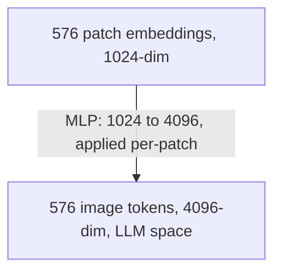
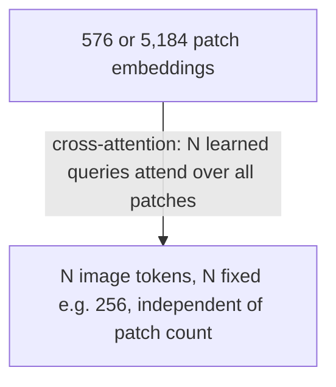

# Lecture 1: How VLMs Actually Work — Encoder, Projector, LLM

> Every time you drop an image into a chat with GPT-4o, Claude, or Gemini, something surprisingly mechanical happens: the image is chopped into a grid of little squares, each square becomes a vector, those vectors get re-shaped to look exactly like word embeddings, and then the same language model you already know attends over them as if they were text. This lecture traces that full path as an engineer would trace a request through a service — not to publish a paper, but so that when your bill triples or your model misreads a table, you know *exactly* which stage did it. After this lecture you will be able to draw the encoder→projector→LLM pipeline from memory, estimate how many tokens an image will cost *before* you send it, explain why a 4K screenshot can silently cost thousands of tokens, and reason about why the same model that reads a receipt perfectly can't count the coins in a photo.

**Prerequisites:** transformer/attention basics, what a token and an embedding are (Phase 1), tokenization and context windows · **Reading time:** ~22 min · **Part of:** Multimodal & Specialized Modalities, Week 1

---

## The core idea (plain language)

A Vision-Language Model (VLM) is **not** a new kind of neural network that "sees." It is a regular decoder-only LLM — the exact same architecture that predicts the next token in text — with a bolt-on front end that converts an image into a sequence of vectors that *look like token embeddings*. Once the image has been turned into those vectors, the LLM genuinely cannot tell the difference between "tokens that came from an image" and "tokens that came from text." They sit in the same context window, side by side, and self-attention runs over all of them jointly.

That is the whole trick, and it has one consequence you must internalize before anything else:

> **An image is just more tokens.** It occupies context-window space, it costs money per token, it adds latency, and *the number of tokens is chosen for you by the provider's tiling policy* — not by you.

There are three components, always in this order:

1. **Vision encoder** (a Vision Transformer, ViT — usually SigLIP or CLIP-style). Turns pixels into a grid of *patch embeddings*.
2. **Projector / connector** (a small MLP, or a cross-attention resampler). Reshapes those patch embeddings into the LLM's token-embedding space.
3. **Decoder LLM** (Llama, Qwen, GPT, Claude — whatever). Attends jointly over the projected image tokens and the text tokens and generates the answer.

The rest of this lecture is just those three boxes in detail, with numbers.

---

## How it actually works (mechanism, from first principles)

### Stage 1 — The vision encoder splits the image into patches

A ViT does not look at the image as a whole. It slices the image into a **fixed grid of square patches**, typically 14×14 or 16×16 pixels each. Each patch is flattened, run through a linear layer, and becomes **one embedding vector**. So a patch is to a ViT what a token is to an LLM: the atomic unit.

The critical arithmetic — memorize this:

```
patches_per_side = image_side_pixels / patch_size_pixels
total_patches    = patches_per_side_x  ×  patches_per_side_y
```

Worked example. Take a SigLIP-style encoder with a **14px patch size** and a fixed input resolution of **336×336** (a very common CLIP/LLaVA config):

```
336 / 14 = 24 patches per side
24 × 24  = 576 patches  →  576 patch embeddings
```

So this encoder emits **576 vectors** for *any* image, because it first resizes every input to 336×336. Every photo, every screenshot, every scan — 576 patches. That fixed-resolution behavior is why older LLaVA-style models have a constant image-token cost.

Now the part that bites you: **more resolution means more patches, quadratically.** Double the side length and you quadruple the patch count:

```
336×336   → 24×24  =   576 patches
672×672   → 48×48  = 2,304 patches   (4× the pixels, 4× the patches)
1008×1008 → 72×72  = 5,184 patches   (9× the patches)
```

The encoder is doing standard self-attention over these patches, so it also learns *relationships between patches* — which is how a ViT understands layout, that this row of text sits above that total, that this box contains a logo. That spatial understanding is a strength you inherit. It is also where the blind spots come from (more on that below).

**Why SigLIP over CLIP in 2025?** CLIP trained the image and text encoders with a contrastive softmax loss; SigLIP swapped it for a sigmoid loss that scales better and tends to give stronger encoders at the same size. As an engineer you rarely pick this — the VLM you use already baked it in — but when a model card says "SigLIP-So400m vision tower," this is what it means: a strong, modern patch encoder.

### Stage 2 — The projector maps patches into the LLM's token space

Here's the problem the projector solves. The vision encoder emits vectors in *its own* embedding space — say 1024-dimensional SigLIP vectors. The LLM expects token embeddings in *its own* space — say 4096-dimensional Llama vectors. These spaces are unrelated. The projector's whole job is translation: take a patch embedding, output a vector that lives in the LLM's embedding space and "means something" to it.

There are **two families** of connector, and the difference between them is one of the most important architectural facts in this whole phase because it directly controls your token count.

**Family A — the MLP projector (LLaVA-style).** The simplest possible thing: a 2-layer MLP applied to *each* patch embedding independently.



Note the count is **preserved**: 576 patches in, 576 image tokens out. The MLP does not compress. This is cheap to train, cheap to run, and it *keeps all the visual detail*, but it means **image token count = patch count**, and patch count scales with resolution. LLaVA popularized this; it's the mental default.

**Family B — cross-attention / resampler (Flamingo, Qwen2.5-VL-style).** Instead of passing every patch through as a token, you introduce a small fixed set of *learned query vectors* (say 64 or 256 of them) and let them **cross-attend** to the patch embeddings, pulling the salient information into a fixed-size summary. This is the Perceiver Resampler idea from Flamingo.



The payoff: you can feed a huge image (or many video frames) into the encoder and still emit a **bounded** number of tokens. The cost: the resampler is a lossy bottleneck — fine detail (small text, dense tables) can get squeezed out, and it's harder to train well. Qwen2.5-VL uses a resampler-style merger combined with **dynamic resolution**, so its token count varies with the input but is compressed relative to raw patch count.

> **The one-line contrast to remember:** MLP connectors preserve patch count (detail-faithful, token-expensive at high res); resampler connectors compress to a fixed/bounded count (token-efficient, detail-lossy). When you're extracting tiny numbers off a receipt, the MLP-style faithfulness matters; when you're captioning video, the resampler's compression is what makes it affordable at all.

### Stage 3 — The LLM attends jointly over image + text tokens

After projection, you have a block of image tokens. The runtime literally splices them into the token sequence where the image appeared in the prompt:

```
[<bos>] [You] [are] [helpful] ...        ← system/text tokens
[IMG_0][IMG_1][IMG_2] ... [IMG_575]      ← projected image tokens (one block)
[What] [is] [the] [total] [?]            ← user text tokens
```

Self-attention now runs over the *entire* sequence. When the model generates "the total is $42.10," the attention heads over the answer tokens are attending back into that `[IMG_*]` block — reading the number the way they'd attend back to a fact stated earlier in text. Interleaving is allowed: text, image, more text, another image. Each image is just another contiguous block of tokens.

Here is the consequence that governs your entire engineering life with VLMs:

> **The LLM never sees pixels. It only ever sees the projected embeddings the encoder chose to produce.** Everything the model "knows" about your image is filtered through the encoder + projector. If the encoder resized your 4000px-wide invoice down to 336px and the 8pt footnote turned into mush, the LLM has *no way* to recover it — the pixels are gone before the LLM's first layer. This is why "the model is bad at reading small text" is usually really "the encoder threw the small text away."

You inherit the encoder's strengths (reading printed text, understanding layout and reading order, recognizing common objects) *and* its blind spots (precise counting, exact pixel coordinates, fine spatial reasoning), because the LLM is downstream of a fixed, lossy visual summary.

---

## Worked example — a 3000×2000 phone photo, end to end

You snap a receipt: **3000×2000 px**, ~12 MP. You send it to a provider with `detail: high`. Walk the path:

1. **Preprocess / tiling.** The provider will not feed 3000×2000 to a 336px ViT. It tiles. OpenAI's high-detail scheme (as documented in its vision guide) resizes to fit, then splits into **512×512 tiles**, plus one downscaled global thumbnail. A 3000×2000 image scaled to fit ~2048 on the long edge and gridded into 512px tiles yields on the order of **a dozen-ish tiles**, and each tile bills a fixed number of tokens (roughly ~170 tokens/tile in OpenAI's published scheme, plus an ~85-token base) — so you land in the **~1,000–1,500+ token** range for *one photo*. (Exact numbers depend on the provider and change; treat these as order-of-magnitude, and always confirm against the current vision docs.)

2. **Encoding.** Each tile goes through the ViT and becomes patch embeddings.

3. **Projection.** Those become image tokens in the LLM's space.

4. **Generation.** The LLM answers, and every one of those ~1,000+ image tokens counted against your input token bill *and* sat in the context window competing with your instructions and the rest of the conversation.

Now the fix, and why it's free money. Downscale that same receipt to **1024px on the long edge** before sending, or use `detail: low`:

```
detail:high, 3000×2000  →  ~1,000–1,500+ tokens   (cost X)
detail:low  (or ~768px) →  ~85–500 tokens          (cost ~1/3 to 1/5 X)
```

For a receipt, the extracted field accuracy is usually *identical* — a total and a date are perfectly legible at 1024px. You just cut cost and latency by 3–5× for zero quality loss. This single move is the backbone of the Week 3 "60% cost cut" milestone.

**Dynamic-resolution twist (Qwen2.5-VL).** A dynamic-resolution model doesn't force a fixed grid; it processes the image near its native aspect ratio and emits a **variable** token count that scales with area. Practically: a wide banner and a tall document that have the *same pixel area* produce roughly the same token count, and you can trade resolution for tokens continuously. Great for varied documents — but it means you **cannot assume a constant per-image cost**; you must measure per image.

---

## How it shows up in production

- **Cost scales with pixels, not with "number of images."** A prompt with one 4K screenshot can cost more than a prompt with five thumbnails. Engineers who budget "one image ≈ one unit" get surprised by the bill. Budget in *tokens*, and estimate tokens from resolution and the provider's tiling rule.

- **Context pressure is real.** Those image tokens eat your context window. Put three high-detail pages in a prompt and you can burn 3,000–5,000+ tokens before the user even asks a question — crowding out chat history, retrieved documents, or system instructions. In multi-image or agentic flows this is often the actual cause of "the model forgot the earlier turn."

- **Latency tracks token count too.** More image tokens = more to attend over = higher time-to-first-token. Downscaling improves latency, not just cost.

- **The "small text" failure is an encoder-resolution failure.** When extraction misses a footnote, line-item, or fine-print number, the reflex should be "did the encoder have enough resolution on that region?" — not "the model is dumb." Fix it by *cropping to the region of interest* (which raises effective resolution on what matters) rather than by sending the whole page bigger.

- **Bounding boxes are approximate.** The model can *describe* where something is, but coordinates are inferred from a coarse patch grid, not measured. Great for highlighting a region in a review UI; wrong for pixel-perfect auto-cropping. When you need real geometry, use dedicated OCR/layout models (covered in the OCR lecture).

- **Provider tiling policies differ and change.** OpenAI, Anthropic, and Gemini each have their own scheme and their own token-counting math, and they revise them. Never hardcode a token estimate; read the current vision docs and, where available, use the provider's token-counting endpoint.

- **Connector family sets your ceiling.** If you're stuck with a heavily-compressing resampler model, no amount of prompting recovers detail the resampler dropped — you switch models or crop. If you're on an MLP-projector model at high resolution, your problem is cost, not fidelity.

---

## Common misconceptions & failure modes

- **"The model sees my image like I do."** No. It sees ~a few hundred to a few thousand vectors summarizing a downscaled, tiled version. Fine detail below the encoder's effective resolution simply does not exist for the model.

- **"Higher resolution always helps accuracy."** Only up to the point where the text is legible to the encoder. Beyond that you pay more tokens for nothing. The right lever is *crop to what matters*, not *send everything bigger*.

- **"An image costs one token / a flat fee."** Fixed-resolution MLP models have a constant cost; dynamic-resolution and tiled models do not. Always compute from the provider's rule.

- **"VLMs can count and give exact coordinates."** They are unreliable at counting many objects and at precise pixel positions — a direct consequence of the coarse patch grid and lossy projection. Verify counts with code or a specialized model.

- **"detail: low ruins quality."** For most document/read tasks it's indistinguishable and 3–5× cheaper. Start low, escalate only a specific unreadable field.

- **Silent context blowout.** Stuffing several high-detail images can push out your system prompt or history without any error — you just get worse answers. Watch the token accounting, not just the HTTP 200.

---

## Rules of thumb / cheat sheet

- **Mantra:** *an image is just more tokens, chosen for you by the provider's tiling policy.*
- **Patch math:** `tokens ≈ (side/patch)²` for MLP models; for tiled providers, `tokens ≈ base + tiles × per_tile`. Confirm constants in current docs (approximate; providers change these).
- **Default:** downscale long edge to **~1024–1600px** and use **`detail: low`** first. Escalate resolution only for a specific unreadable field.
- **Read small text → crop, don't upsize.** Cropping raises effective resolution on the region that matters without paying for the whole page.
- **Connector families:** MLP = detail-faithful, token-expensive at high res (LLaVA). Resampler/cross-attention = token-bounded, detail-lossy (Qwen2.5-VL, Flamingo).
- **Multi-image / agent loops:** count image tokens against your context budget *before* you build the prompt.
- **Never** trust VLM bounding boxes for pixel-perfect crops or VLM counts for exact totals — verify with code or dedicated OCR.
- **Never** hardcode a per-image token cost — measure per image on dynamic-resolution models.

---

## Connect to the lab

This lecture is the "why" behind steps 3–4 and pitfall #1 of the Week 1 `docextract` lab. When you downscale phone photos to ≤1600px before the VLM call and record token count before/after (Definition of Done), you're exploiting exactly the encoder-resolution → token-count relationship traced here. When your extraction misses a tiny line-item, come back to Stage 3: the pixels were gone before the LLM saw them — crop the region instead of blaming the model.

---

## Going deeper (optional)

- **LLaVA project README + repo** — the canonical, minimal encoder→MLP-projector→LLM picture. Search: `LLaVA GitHub`.
- **Qwen2.5-VL model card (Hugging Face)** — a 2025 production-grade example with dynamic resolution and a resampler-style connector. Search: `Qwen2.5-VL Hugging Face model card`.
- **Flamingo paper (DeepMind)** — origin of the Perceiver Resampler / cross-attention connector. Search: `Flamingo visual language model paper`.
- **SigLIP** — the modern sigmoid-loss vision encoder used as the tower in many current VLMs. Search: `SigLIP Hugging Face`.
- **OpenAI vision guide** and **Anthropic vision docs** — the exact tiling and image-token-counting rules (root docs: `platform.openai.com/docs`, `docs.anthropic.com`). Read these for the real, current per-provider numbers — do not trust the approximate figures in this lecture over the live docs.
- **"An Image is Worth 16x16 Words" (ViT paper)** — the patch-embedding idea from first principles. Search: `Vision Transformer 16x16 words paper`.

---

## Check yourself

1. A vision encoder uses a 16px patch size and resizes every input to 512×512. How many patch embeddings does it emit, and does that number change if you send a 4000×3000 photo?
2. Your teammate says "we send one image, so it's basically one extra token of cost." What's wrong with that, and how would you correct their mental model?
3. Contrast an MLP projector (LLaVA) with a cross-attention resampler (Flamingo/Qwen2.5-VL) specifically in terms of *output token count*. When does each hurt you?
4. Extraction keeps missing an 8pt footnote on a full-page scan. Explain the root cause in terms of the pipeline, and give the fix that does *not* just mean "send a bigger image."
5. Why are VLM bounding boxes fine for a review-UI highlight but wrong for pixel-perfect auto-cropping?
6. What does "dynamic resolution" (Qwen2.5-VL) change about how you budget cost, compared to a fixed-336px LLaVA model?

### Answer key

1. `512/16 = 32` per side, `32×32 = 1,024` patch embeddings. For a fixed-resolution encoder the count does **not** change — the 4000×3000 photo is resized to 512×512 first, so it's still 1,024 patches (and detail is lost in that downscale).
2. Cost scales with the *number of image tokens*, which scales with pixels/tiling — one high-detail image can be hundreds to thousands of tokens. Correct model: "an image is a *block* of tokens whose size the provider's tiling policy decides; estimate it from resolution and the provider's rule."
3. MLP: output token count = patch count, so it's detail-faithful but grows quadratically with resolution → expensive and context-heavy at high res. Resampler: output count is fixed/bounded regardless of patches → cheap and video-friendly but lossy, so it can drop fine detail (small text, dense tables). MLP hurts on cost at high res; resampler hurts on fidelity for detail-critical tasks.
4. The encoder resized/tiled the page so the footnote fell below its effective resolution; those pixels are discarded before the LLM's first layer, so the LLM literally never received that information. Fix: **crop to the region of interest** before sending — this raises effective resolution on the footnote without paying to upsize the whole page.
5. Boxes are inferred from a coarse patch grid and a lossy projection, so they're approximate and drift — good enough to highlight a region for a human, but not accurate enough to feed a downstream crop that assumes pixel precision. Use dedicated OCR/layout models when you need real geometry.
6. A fixed-336px model has a *constant* per-image token cost you can hardcode. Dynamic resolution makes token count *vary with image area/aspect*, so you must **measure per image** and can trade resolution for tokens continuously — no single constant applies.
