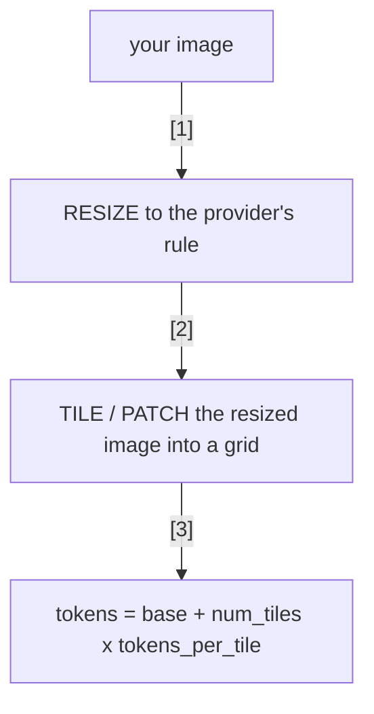

# Lecture 2: Image Tokens, Tiling, and Estimating Cost Before You Send

> An image is not a file to a VLM — it is a pile of tokens, and you pay per token exactly like you pay for the text prompt. The trap is that the number of tokens has almost nothing to do with the file size on disk and everything to do with the *pixel dimensions* and the *detail knob*, both of which are trivially easy to get catastrophically wrong. A 200 KB JPEG can cost more than your entire system prompt. This lecture makes you the person on the team who can look at `3000×2000` and say "that's about 1,100 tokens on GPT-4o high-detail, ~37,000 on GPT-4o-mini, and I can get identical receipt extraction for 85" — *before* the API call, from arithmetic alone. After this you will be able to compute the token cost of any image for OpenAI, Gemini, and Anthropic from its dimensions, explain why downscaling usually doesn't hurt extraction quality, and instrument a pipeline to log tokens-per-image so nothing blows up silently.

**Prerequisites:** You can call a vision model with an image (base64 or URL) and read the `usage` field of a response; you understand that LLM cost is per-token (Phases 1–2). · **Reading time:** ~26 min · **Part of:** Phase 12 — Multimodal & Specialized Modalities, Week 1

---

## The core idea (plain language)

When you send text, you have an intuitive feel for cost: more words ≈ more tokens ≈ more money. Images break that intuition in a way that bites hard in production, because **the model never sees your pixels directly.** The vision encoder chops the (resized) image into a grid of fixed-size patches, turns each patch into an embedding, and the projector maps those into the LLM's token space (this was the previous lecture's encoder → projector → LLM picture). The LLM then attends over those *image tokens* jointly with your text tokens. So the bill is: (image tokens + text tokens) × price-per-token.

Two facts fall out, and they are the whole lecture:

1. **Token count tracks pixel dimensions, not file size.** A heavily-compressed 150 KB phone photo at `3000×2000` costs the same as a 4 MB one at the same dimensions — the encoder decompresses to pixels first. "But it's a small file" is the single most common cost-estimation mistake.
2. **Every provider silently resizes and tiles.** You send `3000×2000`; the provider scales it to fit its own grid and counts *tiles* (or patches). You can't see this happen, it's not in your code, and if you don't know the formula you will be off by 10–40×.

The good news is that the formulas are simple arithmetic, they're documented, and the same knob that controls cost — **resolution** — barely affects quality on the documents you actually care about (receipts, invoices, forms), because the *text you need to read is large relative to the frame*. That mismatch is the arbitrage this whole phase exploits, and the Week 3 milestone turns it into a **≥60% cost cut** (forward reference — hold that thought; this lecture is where you earn the right to make that cut).

---

## How it actually works (mechanism, from first principles)

The universal shape is the same across providers, only the constants differ:



Learn the shape once, then plug in three sets of constants. Let's do each provider concretely.

### OpenAI: `detail:low` vs `detail:high`

OpenAI exposes the knob directly as `"detail": "low" | "high" | "auto"` on the image content block. This is the cleanest mental model, so start here.

**`detail:low` — a flat fee.** The image is squashed to a tiny fixed thumbnail (roughly 512×512) and costs a **fixed** number of tokens regardless of input size. For GPT-4o / GPT-4.1 that's **85 tokens**. For GPT-5 it's ~70. No tiling, no arithmetic — it's a constant. This is your default and your friend.

**`detail:high` — a tile grid.** Three deterministic steps ([OpenAI vision guide](https://developers.openai.com/api/docs/guides/images-vision)):

1. **Scale to fit inside a 2048×2048 square**, preserving aspect ratio.
2. **Scale again so the *shortest* side is 768px.**
3. **Count how many 512×512 tiles** cover the result: `ceil(w/512) × ceil(h/512)`.
4. **Total = base + tiles × per_tile.** GPT-4o / 4.1: **85 + 170×tiles**. GPT-4o-**mini**: **2,833 + 5,667×tiles** (mini uses a huge multiplier so its image tokens are priced comparably to 4o's — same *dollars*, wildly different *token count*).

Worked micro-example, a `1024×1024` image at high detail: step 1 leaves it (fits in 2048²); step 2 scales shortest side to 768 → `768×768`; step 3 → `ceil(768/512)=2` each way → `2×2 = 4` tiles; total on GPT-4o = `85 + 4×170 = 765` tokens. So one square image at high detail ≈ **9× a low-detail call**. Note the subtle cap in step 2: because the shortest side is forced to 768, most ordinary photos land at **4–8 tiles** no matter how huge the original — OpenAI protects you somewhat. The blowup is worst on **very wide/tall** images (many tiles along the long axis) and, brutally, on **GPT-4o-mini** where each tile is 5,667 tokens.

### Gemini: per-tile 258

Gemini ([per its token docs](https://ai.google.dev/gemini-api/docs/tokens)) has no `detail` flag; it decides by size:

- **Image ≤ 384px on both dimensions:** a flat **258 tokens**.
- **Larger:** tiled into **768×768** tiles, **258 tokens each**.

So a `1536×1536` image → `2×2 = 4` tiles → **1,032 tokens**. The lever here is entirely *what dimensions you send* — get both sides under 384 and you pay the 258 floor; otherwise you pay per 768-tile.

### Anthropic (Claude): patches ≈ `(w×h)/750`

Anthropic ([vision docs](https://platform.claude.com/docs/en/docs/build-with-claude/vision)) counts in **patches**: each patch is a **28×28** pixel block = one visual token, so:

```
visual_tokens = ceil(w/28) × ceil(h/28)
```

The famous field heuristic is **`tokens ≈ (w × h) / 750`** — and now you can see *why* it works: 28 × 28 = 784 ≈ 750, so dividing the pixel area by ~750 is just the patch count with the ceilings smoothed out. Use `/750` for napkin math, the exact `ceil` formula when you need to be precise.

Crucially, **Claude auto-downscales** anything past its per-model limit before counting. Standard-tier models cap at a **1568px long edge and 1568 visual tokens** (~1.15 megapixels); the high-resolution tier (Opus 4.x, Sonnet 5) goes to ~2576px / 4784 tokens. So a giant image doesn't cost unbounded tokens — it's clamped — but the clamp is still **1,500–4,800 tokens**, i.e. 20–50× a low-detail OpenAI call. Do the downscale *yourself* and you control where in that range you land (and you keep your bounding-box coordinates sane — see the next lecture).

### The one diagram to remember

```
              detail:low            detail:high / native
              (flat fee)            (grid scales with pixels)
OpenAI 4o     85                    85 + 170 × tiles(512px, shortest→768)
OpenAI 4o-mini ~2833 (flat*)        2833 + 5667 × tiles
Gemini        258 (if ≤384²)        258 × tiles(768px)
Anthropic     — (no low knob)       ceil(w/28)×ceil(h/28)  ≈ (w×h)/750, capped
```
`*` mini's low is also a fixed thumbnail; the number is large but the dollars match 4o.

---

## Worked example

**The document:** a `3000×2000` phone photo of a restaurant receipt (a totally normal 6-megapixel capture, ~500 KB as JPEG). We want the merchant, date, line items, and total.

**Cost at full resolution, high detail:**

*OpenAI GPT-4o, `detail:high`.* Step 1: fits in 2048² after scaling → `2048×1365`. Step 2: shortest side (1365) → 768, so `1152×768`. Step 3: `ceil(1152/512)=3`, `ceil(768/512)=2` → **6 tiles**. Total = `85 + 6×170 =` **1,105 tokens**.

*Same image on GPT-4o-mini.* Same 6 tiles, but `2,833 + 6×5,667 =` **36,835 tokens.** For one receipt. This is the horror story — a naive "just use the cheap model" instinct produces the *most expensive per-image* token count in the lineup.

*Anthropic Claude (standard tier).* Native area would be `3000×2000/750 =` **8,000 tokens**, but Claude clamps to its 1568px long edge → ~`1568×1045` → `1568×1045/750 ≈` **2,185**, capped at the tier's 1568-token ceiling → **~1,560 tokens.**

**Now downscale it yourself** to a 1024px long edge (→ `1024×683`) and send `detail:low`:

- **OpenAI GPT-4o:** `detail:low` = **85 tokens** flat. Was 1,105 → **13× cheaper.**
- **GPT-4o-mini:** low thumbnail = **2,833 tokens** flat. Was 36,835 → **13× cheaper.**
- **Claude:** `1024×683/750 ≈` **933 tokens.** Go to a 768px long edge (`768×512`) → `768×512/750 ≈` **524 tokens** — 3× cheaper than the clamped native.

**Did quality drop?** For a receipt, essentially no — and here's the intuition, not hand-waving. The total on a receipt — say `$47.83` — is printed large: its glyphs might be 3% of the frame height. At `3000` px tall that's ~90px-tall digits: absurdly oversampled, far more resolution than any encoder patch grid can use. Downscale to `1024` px tall and those digits are still ~30px — comfortably above the ~10–16px where VLM OCR stays reliable. You threw away pixels the model was going to average into patches *anyway*. The extraction of merchant/date/total is unchanged; you paid 1/13th.

**Where downscaling *does* bite:** a dense A4 invoice with a 40-row line-item table in 6pt font. At `768`px the row text falls below the legibility floor and the model starts dropping or mis-reading rows. That's your signal to **escalate** — bump to `detail:high` or a larger long edge, or **crop to the table region** and send that crop at higher resolution. Escalate per-field, not globally.

---

## How it shows up in production

- **The 4K-screenshot cost bomb.** Someone wires up "summarize this dashboard" on `3840×2160` screenshots at `detail:high`. Each is ~1,100 tokens on 4o (fine) but the team is on 4o-mini "to save money" → ~37k tokens each. At scale the image tokens dwarf every text token in the app and the bill is 30× the forecast. The fix is one line: downscale + `detail:low`.
- **File size lies to your monitoring.** Dashboards that alert on request *bytes* miss image-token blowups entirely, because a 150 KB `3000×2000` JPEG and a 30 KB `600×400` one look similar on the wire but differ ~6× in tokens. **Alert on tokens, not bytes.**
- **Latency, not just dollars.** More image tokens = longer prefill = higher time-to-first-token. On an interactive extractor, dropping from 1,100 to 85 image tokens is a visible latency win, not only a cost win. Users feel it.
- **The multi-turn image tax.** If you keep an image in the conversation and take several turns, base64 images get **re-sent and re-billed every turn**. Anthropic's Files API (reference by `file_id`) and equivalent patterns exist precisely to stop this. A 5-turn chat over one un-cached high-detail image can quietly 5× your image spend.
- **Silent provider resizing corrupts coordinates.** If you ask for bounding boxes but let the provider downscale, the boxes come back in the *resized* frame, not yours. Downscaling yourself to a known size keeps your box math exact (next lecture's topic) — a real debugging saver.

---

## Common misconceptions & failure modes

- **"Small file = cheap."** No. Tokens track *pixel dimensions after the provider's resize*, not bytes. Compressing the JPEG harder saves bandwidth, not tokens. Resize the *dimensions*.
- **"`detail:high` reads better, so always use it."** For large-glyph documents (receipts, slides, signage) high detail is usually wasted tokens — the model can't exploit resolution the patch grid throws away. High detail earns its cost only on genuinely dense text or fine spatial detail.
- **"The cheaper model is always cheaper."** GPT-4o-mini's *per-token* price is lower but its image *token count* is ~33× GPT-4o's at the same tiles. Always compute **tokens × price**, never price alone. On images, mini can lose.
- **"Providers don't resize, so huge images cost unboundedly."** They all clamp: OpenAI forces shortest-side 768 (usually 4–8 tiles), Claude clamps to a long-edge/token cap, Gemini tiles a normalized image. You still want to downscale *first* to control quality/coordinates and to avoid the clamp landing somewhere expensive — but "unbounded" is wrong.
- **"I'll estimate from a rough guess."** Don't guess when you can measure. Providers return exact image-token usage; use it (below). Estimate to *plan*, measure to *verify*.
- **Forgetting the base term.** On OpenAI, `tiles × per_tile` alone under-counts — there's always the base (85 / 2,833). Small but it adds up across millions of calls.

---

## Rules of thumb / cheat sheet

*(All token constants below are current to 2025–2026 provider docs but change; re-verify against the linked docs, and always confirm with the `usage` field.)*

- **Downscale the long edge to ~768–1600px before sending.** 1024px is a great default for documents; 768px if glyphs are large (receipts); 1600px only for dense small-font pages.
- **Start at `detail:low` (OpenAI) / small dimensions (Gemini). Escalate only when a specific field is unreadable** — and prefer escalating by **cropping to the region of interest** at higher res over re-sending the whole page.
- **Crop beats upscale.** A tight crop of the line-item table at 1024px reads better *and* costs less than the full page at high detail.
- **Compute `tokens × price`, per model, before choosing.** Mini's token multiplier can make it the expensive choice on images.
- **Napkin formulas:**
  - OpenAI low = flat ~85 (4o) / ~70 (GPT-5).
  - OpenAI high = `85 + 170 × ceil(w'/512) × ceil(h'/512)` after scaling shortest side to 768.
  - Gemini = `258` if both sides ≤384, else `258 × tiles(768px)`.
  - Anthropic ≈ `(w × h) / 750`, capped at ~1568 tokens (standard) / ~4784 (hi-res tier).
- **Alert on tokens-per-image, not request bytes.** Log it on every call (below).
- **Kill the multi-turn image tax:** reference images by ID / cache them; don't re-send base64 every turn.

---

## Connect to the lab

The Week 1 `docextract` lab (spine §Lab step 3) tells you to **downscale the long edge to 1600px** before any VLM call and to **record the token count before/after for one image** — that recording *is* this lecture's arithmetic verified against reality. Use `detail:low` in your `extract_vlm.py` image block (the lab already does), and when the arithmetic validator flags an unreadable field, that's your cue to escalate resolution or crop — exactly the "escalate per-field" rule above. Everything you measure here (baseline tokens/image) becomes the *before* number for the **Week 3 ≥60% cost cut**, where downscale + crop + `detail:low` are the first and highest-leverage levers.

---

## Going deeper (optional)

Real, named resources — verify current URLs yourself; providers move their docs.

- **OpenAI Vision guide** — `platform.openai.com/docs` (now redirects under `developers.openai.com`). The exact `detail:low`/`high` tile formula, base and per-tile constants per model. Search: *"OpenAI images vision detail high token cost calculation"*.
- **Anthropic Vision docs** — `docs.anthropic.com` (redirects to `platform.claude.com/docs`). The patch/`(w×h)/750` model, per-tier long-edge and token caps, resize behavior, and the companion **vision-coordinates** page for bounding boxes. Search: *"Anthropic Claude vision resolution token cost"*.
- **Google Gemini token docs** — `ai.google.dev/gemini-api/docs/tokens`. The 258/tile and 384px-floor rules; also documents `count_tokens`.
- **Provider token-count endpoints/usage fields** — use these to *measure*, not guess:
  - OpenAI/Anthropic: read `response.usage` (input tokens include image tokens).
  - Anthropic **count-tokens** endpoint and Gemini **`count_tokens`** let you price *before* sending. Search: *"Anthropic count tokens endpoint"*, *"Gemini countTokens images"*.
- **LLaVA / Qwen2.5-VL** model cards (Hugging Face) — for *why* patches/tiles exist: dynamic-resolution encoders that turn pixels into patch tokens. Search: *"Qwen2.5-VL dynamic resolution vision tokens"*.

---

## Check yourself

1. You have a `3000×2000` receipt photo saved as a 120 KB JPEG. A teammate says "it's tiny, high-detail is fine." What's wrong with that reasoning, and roughly what does it cost on GPT-4o at `detail:high`?
2. Compute the GPT-4o `detail:high` token cost of a `1600×900` screenshot. Show the resize and tiling steps.
3. Why does downscaling a receipt from `3000`px to `1024`px long edge usually *not* hurt total/merchant extraction, but *can* hurt a dense 6pt line-item table?
4. GPT-4o-mini is priced lower per token than GPT-4o. Give a concrete case where mini is the *more expensive* choice for images, with numbers.
5. Estimate a `2000×1500` image's Anthropic token cost with the field heuristic, then explain what the standard-tier cap does to it.
6. Your monitoring alerts on request payload bytes and never fires, yet your image bill tripled. What's the likely cause and the fix?

### Answer key

1. Token cost tracks *pixel dimensions after the provider's resize*, not file size — the encoder decompresses the JPEG to `3000×2000` pixels first, so 120 KB is irrelevant. On GPT-4o `detail:high`: scale to fit 2048² → `2048×1365`, scale shortest side to 768 → `1152×768`, tiles `3×2 = 6`, cost `85 + 6×170 =` **1,105 tokens** — ~13× the 85-token `detail:low` call, for a receipt where the extra pixels buy nothing.

2. `1600×900`: step 1 fits in 2048² (unchanged). Step 2 scale shortest side (900) → 768: factor `768/900 = 0.853`, so `1365×768`. Step 3 tiles: `ceil(1365/512)=3`, `ceil(768/512)=2` → **6 tiles**. Cost = `85 + 6×170 =` **1,105 tokens**.

3. The total/merchant are printed in large glyphs — at `3000`px they're ~90px tall, at `1024`px still ~30px, well above the ~10–16px legibility floor, so downscaling just discards oversampling the patch grid would average away anyway. A 6pt table row is already near that floor at full res; drop to `1024`/`768`px and its glyphs fall below it, so the model starts dropping or misreading rows. Fix: crop the table and send *that* region at higher resolution.

4. Same `3000×2000` receipt at `detail:high` = 6 tiles on both. GPT-4o: `85 + 6×170 =` 1,105 tokens. GPT-4o-mini: `2,833 + 6×5,667 =` **36,835 tokens** — ~33× more tokens. Mini's lower per-token price doesn't come close to closing a 33× token gap, so on high-detail images mini is the more expensive choice. Always compute tokens × price.

5. Heuristic: `2000×1500/750 =` **4,000 tokens** at native resolution. But standard-tier Claude clamps to a 1568px long edge and a 1568-token ceiling: the image is downscaled to ~`1568×1176` and the cost is capped at **~1,560 tokens**. (The hi-res tier would allow more.) Downscaling yourself to 1024px long edge gives ~933 tokens and keeps your coordinates predictable.

6. A large-*dimension* image (e.g. `3000×2000`) can be a small *byte* payload after JPEG compression, so a bytes-based alert never trips even though token count (and cost) is high — and multi-turn re-sending or a switch to a high token-multiplier model (mini) can triple spend with no byte-size change. Fix: log and alert on **image tokens** from the response `usage` field, per image, not on request bytes.
