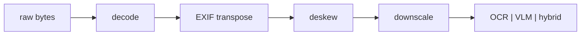

# Lecture 4: OCR vs VLM vs Hybrid, and Born-Digital vs Scanned Routing

> Before you spend a single token turning a document into structured data, you have two routing decisions to make, and getting them wrong costs you money, latency, and accuracy simultaneously. First: does this file already contain machine-readable text, or is it just pixels? Second: if it's pixels, do I reach for dedicated OCR, a vision-language model, or both stacked together? Most engineers skip straight to "throw it at GPT-4o," pay 100× more than they needed to, and get hallucinated totals for their trouble. After this lecture you can look at any document — a clean PDF invoice, a faded thermal receipt, a rotated phone photo, a multi-column form — and pick the extraction substrate on purpose, justify it on five axes (cost, latency, geometry accuracy, hallucination risk, layout understanding), and build a router that reads free text for free instead of paying to OCR it.

**Prerequisites:** VLM architecture & image-token cost (this week's earlier lectures), structured output with Pydantic + instructor (Phase 2) · **Reading time:** ~26 min · **Part of:** Phase 12 Week 1

---

## The core idea (plain language)

"Extract the data from this document" is not one problem. It is a routing problem with two forks, and each fork has a right answer that depends on the *document*, not on which API you happen to like.

**Fork 1 — Is there already text in this file?** A PDF exported from Word, a webpage saved to PDF, an e-invoice generated by an ERP system — these are **born-digital**. They carry an embedded **text layer**: the actual Unicode characters, with their positions, sitting inside the file. You can pull that text out with a library call in milliseconds, for free, with essentially zero errors. No model. No API. No GPU. If you send that same file to an OCR engine or a VLM, you are paying to *re-derive from pixels* text that was handed to you in the file. That's the single most common waste in document pipelines.

A **scanned** document — a photo, a fax, a page run through a flatbed scanner, a screenshot — has no text layer. It is an image of text. Now, and only now, do you need something that can read pixels.

**Fork 2 — If it's pixels, what reads them?** Three substrates, with genuinely different strengths:

- **Dedicated OCR** (PaddleOCR, Tesseract, AWS Textract, Google Document AI): purpose-built engines that find text in an image and return each piece of text **with real bounding-box coordinates and a per-token confidence score**. Cheap, fast, scales to millions of pages. Gives you geometry a VLM literally cannot. But it hands you a bag of words and boxes — it does not know that "Total Due" and "$47.32" belong together, and it struggles to emit a clean business object.
- **Pure VLM** (Gemini, GPT-4o, Claude, Qwen2.5-VL): reads the image *and understands it*, and can emit structured JSON directly. Handles messy, rotated, low-contrast, context-heavy documents that break OCR. But it costs more per page, is slower, and will **hallucinate** plausible-looking values it never actually saw.
- **Hybrid** (OCR → then feed the OCR text dump *plus* the image to the VLM): the VLM gets **grounded text** (so it invents less) and the **pixels** (so it understands layout and context). Best quality on hard documents, at the cost of running two systems.

The whole lecture is: how to detect Fork 1 automatically, and how to choose on Fork 2 per document type.

---

## How it actually works (mechanism, from first principles)

### Fork 1: detecting born-digital vs scanned

A PDF is a container. Its content stream can hold **text-drawing operators** (`Tj`, `TJ` — "draw this string of glyphs at this position with this font") and/or **image XObjects** (embedded raster images). Born-digital PDFs are built from text operators. Scanned PDFs are usually a single full-page image XObject per page — the "text" you see is just colored pixels.

The detection is almost embarrassingly simple: try to extract text, and see if you get any.

```python
import fitz  # PyMuPDF

def is_born_digital(page, min_chars=20) -> bool:
    text = page.get_text("text")
    return len(text.strip()) >= min_chars
```

`page.get_text("text")` walks the text operators and returns the Unicode string. If a page is a pure scan, this returns `""` (or a handful of junk chars). If it's born-digital, you get the real text — near-perfect, because you're reading the characters the author *typed*, not guessing them from pixels.

Two edge cases that bite in production:

1. **Hybrid PDFs / OCR'd scans.** Some scanned PDFs have had an *invisible* OCR text layer added (e.g. by Adobe or a scanner's software) so they're searchable. `get_text` returns that layer — which is only as good as whoever OCR'd it. Treat a suspiciously low character count, or text that's all one font at position (0,0), with skepticism.
2. **Mixed documents.** A 40-page contract can be 38 born-digital pages plus 2 scanned signature pages. Detect **per page**, not per document. Route each page independently.

A robust heuristic combines character count with an image-coverage check:

```python
def classify_page(page):
    chars = len(page.get_text("text").strip())
    # ratio of page area covered by raster images
    img_area = sum(page.get_image_bbox(img).get_area()
                   for img in page.get_images(full=True)) or 0
    page_area = page.rect.get_area()
    img_cov = img_area / page_area if page_area else 0
    if chars >= 20 and img_cov < 0.6:
        return "born_digital"      # read for free
    return "scanned"               # needs OCR/VLM
```

Why this matters is pure arithmetic. Suppose you process 100,000 pages/month and 70% are born-digital. Reading those 70,000 with PyMuPDF costs ~$0 and ~2ms/page. Sending them to a VLM at, say, ~$0.001–0.01/page (varies wildly by model and resolution) would cost **hundreds to thousands of dollars a month** to reproduce text you already had. Detecting Fork 1 first is the highest-leverage line of code in the whole pipeline.

### Fork 2, substrate A: how dedicated OCR works

An OCR engine runs a pipeline: **detect** where text is (a text-detection model draws boxes around lines/words), then **recognize** what each box says (a recognition model reads the cropped pixels into characters). PaddleOCR's PP-OCR is exactly this two-stage design (DBNet-style detector + CRNN/SVTR recognizer); Tesseract is an older LSTM-based line recognizer; Textract and Document AI are hosted versions with extra layout/table/form models on top.

The output is the key. You get, per detected unit:

```
("TOTAL",      bbox=[412, 980, 470, 1002], conf=0.994)
("$47.32",     bbox=[560, 980, 640, 1002], conf=0.981)
("Thank you",  bbox=[120, 1040, 300, 1060], conf=0.887)
```

**Real coordinates. Real per-token confidence.** This is geometry a VLM cannot reliably produce (VLMs "eyeball" boxes and drift by tens of pixels). If you need to *highlight the exact pixels* of the total for a human reviewer, or crop a signature, or align text back to the scan, OCR is the only substrate that gives you trustworthy coordinates at scale.

The weakness is equally structural: OCR returns *reading soup*. It does not know that the number to the right of "Total Due" is the total, that this table has three columns, or that "Net 30" is a payment term. Reconstructing a business object from boxes-and-strings requires either brittle rules (sort boxes top-to-bottom, group by y-coordinate, regex the amounts) or a downstream model. That downstream model is often... a VLM. Which is why hybrid exists.

### Fork 2, substrate B: how a pure VLM reads

A VLM encodes the image into token blocks (see this week's VLM-architecture lecture) and attends over them jointly with your text prompt. Ask it for a Pydantic schema via instructor and it emits structured JSON directly — merchant, date, line items, total — *understanding* the layout as it reads. It handles rotation, low contrast, handwriting, foreign scripts, and "the total is in the box in the bottom-right that says GRAND TOTAL" far better than OCR-plus-rules.

The two structural costs:

- **Tokens.** An image is tokens, and a big image is a lot of tokens (a full-res phone photo can be thousands). More cost, more latency than OCR. Downscaling helps enormously (next section).
- **Hallucination.** This is the one that quietly wrecks correctness. When a VLM can't cleanly read a smudged total, it does not return "unreadable" — it returns a **plausible number**, formatted correctly, at high confidence. It fills gaps with priors. On a faded receipt it may emit a `$` total that is arithmetically consistent with the line items *because it computed it*, not because it read it. There is no coordinate to check against, because the VLM's boxes drift.

### Fork 2, substrate C: why hybrid is the best of both

Hybrid gives the VLM two grounded inputs instead of one:

```
messages = [
  {"role":"user","content":[
    {"type":"text","text":
        "Here is OCR-extracted text with confidences and coordinates:\n"
        + ocr_dump +
        "\nUsing BOTH this OCR text and the image, extract the schema. "
        "Prefer the OCR text for exact numbers and spellings; use the image "
        "for layout and to resolve ambiguity. Do NOT invent values not present "
        "in the OCR text or clearly visible in the image."},
    {"type":"image_url","image_url":{"url":img_data_url,"detail":"low"}},
  ]}
]
```

Now the VLM is *transcribing and organizing* rather than *reading and guessing*. The exact digits of the total come from OCR (which read real pixels and gave a confidence); the VLM's job is the semantic assembly it's good at — "this string is the merchant, these rows are line items." Hallucination drops sharply because the model has grounded text to anchor to, and you can even cross-check: if the VLM emits a total that doesn't appear anywhere in the OCR dump, that's a red flag your validator can catch.

The cost: you run OCR *and* a VLM call, so you pay both latencies. Worth it on hard, high-stakes documents; overkill on a clean digital invoice you shouldn't be imaging at all.

### The five axes, side by side

Everything above collapses into one table. Read it as *relative* ranking, not absolute benchmarks (the numbers shift every quarter and with every model/provider):

| Axis | Dedicated OCR | Pure VLM | Hybrid (OCR→VLM) |
|---|---|---|---|
| **Cost/page** | Lowest (fractions of a cent) | Highest (low cents, more at full res) | Highest (you pay both) |
| **Latency** | Fast (100–500ms hosted) | Medium (0.5–3s) | Slowest (both stacked, 2–4s) |
| **Geometry accuracy** | Best — real, measured coordinates + per-token confidence | Poor — boxes drift 10–20%, "eyeballed" | Best — coordinates come from the OCR layer |
| **Hallucination risk** | None (returns garbage/low-conf, never invents) | Highest (confident, plausible fabrications) | Low — grounded text anchors the VLM, cross-checkable |
| **Layout understanding** | Weak — reading soup, no semantics | Strong — assembles the business object | Strongest — semantics from VLM, digits from OCR |
| **Structured JSON out** | Needs brittle rules or a downstream model | Native | Native |

The reason there's no single winner is that no single substrate is best on all five axes at once — OCR owns cost/latency/geometry, the VLM owns layout, and only hybrid buys low hallucination *with* real coordinates, at the price of doing both. That trade is the entire routing decision.

### Preprocessing: the front of *every* pixel path

Before any OCR or VLM call on an image, three cheap steps pay for themselves:

1. **EXIF auto-rotation.** Phone cameras store the image upright *plus an EXIF orientation flag* rather than physically rotating pixels. Naively decoded, the image is sideways — and models read sideways text badly. Fix it once:
   ```python
   from PIL import Image, ImageOps
   img = ImageOps.exif_transpose(Image.open(path))  # applies the flag, strips it
   ```
2. **Deskew.** Scans and photos come in at a slight angle. OCR detectors tolerate a few degrees; beyond ~5° accuracy falls off. Estimate the dominant text-line angle (Hough transform / projection profile, or `deskew`/OpenCV) and rotate to level. Straight lines → cleaner boxes → higher recognition confidence.
3. **Downscale.** A 12MP photo of a receipt is mostly wasted pixels. Downscaling the long edge to ~1600px (OCR) or ~1024–1600px (VLM) keeps text legible while slashing token count and upload time. Only escalate resolution if a specific field comes back unreadable.



---

## Worked example

You run an AP (accounts-payable) inbox: 10,000 documents/month arrive as email attachments. Let's route them and do the arithmetic.

**Composition (typical):** 6,000 born-digital PDF invoices (ERP exports, e-invoices), 2,500 scanned PDF invoices (supplier faxed/scanned), 1,500 phone photos of receipts (expense reports).

**Step 1 — Fork 1 on all 10,000.** Run `classify_page`. The 6,000 born-digital ones extract via PyMuPDF: ~2ms each, $0, near-perfect text. **60% of volume never touches a model.** The other 4,000 are pixels.

**Step 2 — Fork 2 on the 4,000.**
- The 2,500 scanned invoices are structured, mostly clean, high-volume. **Dedicated OCR + light layout rules** (Textract's forms/tables, or PaddleOCR + grouping) is the cheap default. Where the layout is irregular, escalate to hybrid.
- The 1,500 phone receipts are the messy tail: rotated, faded thermal print, curled paper, foreign currencies. **Pure VLM or hybrid.** Faded thermal → hybrid (OCR grounds the digits the VLM would otherwise guess); a clean well-lit photo → pure VLM is fine and simpler.

**Step 3 — cost sketch (illustrative, not a benchmark).** Say a VLM call on a downscaled receipt runs ~$0.003 and OCR runs ~$0.0006/page.

| Route | Volume | Approx unit cost | Monthly |
|---|---|---|---|
| Born-digital (PyMuPDF) | 6,000 | ~$0 | ~$0 |
| OCR (scanned invoices) | 2,500 | ~$0.0006 | ~$1.50 |
| Hybrid (faded/hard) | 1,000 | ~$0.0036 | ~$3.60 |
| Pure VLM (clean photos) | 500 | ~$0.003 | ~$1.50 |
| **Total** | 10,000 | | **~$6.60** |

The naive "send everything to a VLM at full resolution" alternative: 10,000 × (full-res is often 5–10× the downscaled token cost, so ~$0.02) ≈ **~$200/month**, plus far slower, plus you're paying a hallucination-prone model to read 6,000 documents whose text was free and perfect. Same accuracy target, ~30× the bill. That gap *is* the lecture.

**Step 4 — a concrete hallucination catch.** On one faded thermal receipt, pure VLM returns `total: "52.40"` at confidence 0.91. The hybrid path's OCR dump contains `48.40` (conf 0.97) near the "TOTAL" box and never contains `52.40`. Your validator flags: *VLM total not present in OCR text* **and** `sum(line_items)=48.40 ≠ 52.40`. Routed to human review. The pure-VLM path would have silently written a wrong number into your ERP.

---

## How it shows up in production

**The born-digital skip is the biggest cost lever you have, and it's free.** Teams that don't detect Fork 1 pay 10–100× to re-read text they already had, and *also* inject OCR/VLM errors into text that was perfect. One `page.get_text()` call, gated on a character-count check, routinely cuts a document pipeline's model spend by half or more. Do this before you optimize anything else.

**OCR confidence is real signal; VLM confidence is not.** OCR's per-token confidence comes from the recognizer's actual softmax over character classes — a low value genuinely means "these pixels were ambiguous." A VLM's self-reported `confidence: 0.92` is a number it *generated*, uncalibrated, often high precisely when it's hallucinating. Route on OCR confidence with some trust; treat VLM confidence as a weak prior and validate it against your golden set (Week 3) before wiring it to a threshold.

**Hallucination is invisible without a check.** The failure mode isn't a crash or an error field — it's a correctly-formatted, confidently-returned wrong value. Your defense is deterministic: arithmetic validation (line items sum to subtotal; subtotal + tax = total), cross-checking VLM outputs against the OCR dump (does the number even appear?), and format/range checks (a date in the future, a negative quantity). "LLM proposes, code disposes."

**Latency stacks in hybrid.** OCR (100–500ms hosted, or seconds for a cold local PaddleOCR) *plus* a VLM call (0.5–3s) means hybrid can be 2–4s/doc. Fine for async batch AP processing; painful for an interactive "snap a photo, see the fields" UX. Know your latency budget before you pick hybrid.

**"Just use the newest VLM" ages badly and scales worse.** VLMs improve every quarter, and it's tempting to route everything through one. But at volume the economics of OCR-for-geometry + selective VLM don't change: coordinates, per-token confidence, and per-page cost still favor dedicated OCR for the bulk, with the VLM reserved for the hard tail. Build the router, not the monolith.

**Tables and forms are their own sub-problem.** Multi-column forms and page-spanning tables defeat naive OCR reading-order (it reads across columns and scrambles rows). This is where Textract's/Document AI's table+form models, or **Docling's** layout-aware parsing, or a hybrid VLM pass with an explicit "preserve table structure" instruction, earn their keep. Don't expect raw Tesseract to reconstruct a two-column benefits form.

---

## Common misconceptions & failure modes

- **"OCR and VLM are competitors; pick one."** They're complementary substrates. The expert answer is almost always "born-digital extraction for the majority, OCR for geometry and bulk, VLM/hybrid for the hard tail" — a router, not a religion.
- **"A PDF is a PDF."** A born-digital PDF and a scanned PDF are completely different problems that happen to share a file extension. Always detect first, per page.
- **"The searchable scan has good text."** A scanned PDF with an added OCR layer returns text from `get_text()` — but that text is only as good as whoever OCR'd it, and can be silently wrong. A perfect character count isn't proof of a born-digital origin.
- **"VLM bounding boxes are accurate enough to crop."** They drift by tens of pixels and aren't reliable for pixel-precise cropping or downstream alignment. Use them to *highlight a region* for a human; use OCR when you need real coordinates.
- **"Higher resolution = better extraction."** Past legibility, extra pixels buy nothing but tokens, cost, and latency. Downscale first; escalate only the specific field that came back unreadable.
- **"The VLM said confidence 0.95, so it's right."** Self-reported confidence is uncalibrated and often highest during confident hallucination. Validate against arithmetic, against the OCR dump, and against a golden set.
- **"Forgot EXIF rotation, but it mostly works."** Sideways text tanks both OCR and VLM accuracy silently — you just get worse numbers, no error. `exif_transpose` is one line; always run it.
- **"Hybrid is always best, so always use it."** Hybrid on a clean born-digital invoice is three wasted steps (you shouldn't even be imaging it). Match the substrate to the document.

---

## Rules of thumb / cheat sheet

- **Detect born-digital FIRST, per page.** `page.get_text("text")` non-empty (≥~20 chars) and low image coverage ⇒ read it free with PyMuPDF, zero model calls.
- **Preprocess every pixel path:** `ImageOps.exif_transpose` → deskew → downscale long edge (~1600px OCR, ~1024–1600px VLM). Escalate resolution only for an unreadable field.
- **Need real coordinates / per-token confidence / millions of pages cheaply?** → **Dedicated OCR** (PaddleOCR, Tesseract; Textract/Document AI for hosted + tables/forms).
- **Messy / rotated / low-quality / context-heavy, and you want structured JSON out?** → **VLM** (accept higher cost + hallucination risk).
- **Hard document where a wrong number is expensive?** → **Hybrid**: OCR grounds the digits, image grounds the layout, validator cross-checks. Best accuracy, highest latency.
- **Per document type (defaults):** clean digital invoice → born-digital extract (no OCR/VLM at all); faded thermal receipt → hybrid; foreign-currency phone photo → VLM or hybrid; multi-column form / spanning table → layout-aware OCR (Textract/Document AI/Docling) or hybrid with "preserve structure."
- **Trust OCR confidence more than VLM confidence.** Always add deterministic checks (arithmetic, range, "does the value appear in the OCR text?").
- **Cost intuition (approximate):** born-digital ≈ free; OCR ≈ fractions of a cent; VLM ≈ low cents (and multiples of that at full resolution). Skipping born-digital and downscaling are the two biggest free wins.

---

## Connect to the lab

This lecture is the decision framework behind **Week 1's `docextract` lab** — specifically `detect.py` (born-digital-vs-scanned + EXIF/deskew/downscale), `ocr.py` (PaddleOCR wrapper returning text+coords+conf), and `extract_hybrid.py` (OCR dump + image → VLM). Build the Fork 1 detector before the VLM path, prove it on one born-digital PDF and one scanned/photo in your tests, and on your 5 hardest samples write the one-paragraph pure-VLM-vs-hybrid hallucination comparison the Definition of Done asks for. It also feeds Self-check Q2 and Q4 ("when OCR vs VLM vs hybrid" and "how do you decide born-digital vs scanned, and why does it matter for cost").

---

## Going deeper (optional)

- **PaddleOCR** GitHub README (`github.com/PaddlePaddle/PaddleOCR`) — the canonical open OCR toolkit; read the detection+recognition pipeline overview and the structured/layout (PP-Structure) docs. Search: *"PaddleOCR PP-OCR PP-Structure README"*.
- **Docling** GitHub README (`github.com/docling-project/docling`) — layout-aware document parsing (PDF→structured, tables, reading order); excellent for the born-digital + table-structure problem. Search: *"Docling document conversion GitHub"*.
- **PyMuPDF (fitz)** docs (`pymupdf.readthedocs.io`) — the `page.get_text()` variants (`"text"`, `"dict"`, `"words"`, `"blocks"`) and per-page image inspection; the authoritative source for Fork 1 detection.
- **AWS Textract** and **Google Document AI** docs (`docs.aws.amazon.com/textract`, `cloud.google.com/document-ai`) — hosted OCR with forms/tables/query features; read their table and form extraction sections.
- **Tesseract** docs (`tesseract-ocr.github.io`) — the classic open OCR engine; useful for understanding page-segmentation modes and where it falls short vs modern detectors.
- **Pillow `ImageOps`** docs (`pillow.readthedocs.io`) — `exif_transpose` and downscaling; the front of every pixel path.
- For the VLM half (image→tokens, tiling, cost), see this week's earlier lectures; for calibrating confidence thresholds on a golden set, **Week 3's eval-harness lecture**.

---

## Check yourself

1. You receive a 30-page PDF. Pages 1–28 extract clean text with `page.get_text()`; pages 29–30 return empty strings but have a large image XObject. How do you route this document, and why per-page rather than per-document?
2. On which of the five axes (cost, latency, geometry accuracy, hallucination risk, layout understanding) does dedicated OCR beat a pure VLM, and on which does the VLM win?
3. A faded thermal receipt's total is smudged. Explain precisely how a pure VLM fails here, and how the hybrid path reduces that failure.
4. Your teammate proposes sending all 100k monthly documents (70% born-digital) to a VLM "for consistency." Estimate the waste and name the two things it injects into the born-digital documents.
5. Why do you trust OCR's confidence score more than a VLM's self-reported confidence, and what do you add regardless of which you use?
6. A phone photo of an invoice comes out with text running sideways and OCR confidence is low across the board. Name the one-line fix and the two other preprocessing steps that belong before any pixel path.

### Answer key

1. Route **per page**: extract pages 1–28 for free via PyMuPDF (born-digital text layer), and send pages 29–30 (empty text + large image coverage) to the OCR/VLM path. Per-page because a single document can mix origins — signature/scan pages appended to a digital contract are common — and classifying the whole document by its first page would either waste money OCR-ing the digital pages or silently drop the scanned ones.
2. **OCR wins** on cost (fractions of a cent, scales to millions), latency (fast, no large token blocks), and **geometry accuracy** (real bounding boxes + per-token confidence the VLM can't reliably produce). **VLM wins** on **layout understanding** (it assembles a business object, understands "the total is bottom-right") and reads messy/rotated/context-heavy images. On **hallucination risk** the VLM is *worse* (it invents plausible values); OCR just returns low confidence or garbage rather than a confident fabrication.
3. The VLM can't cleanly read the smudged digits, but instead of returning "unreadable" it emits a **plausible, well-formatted number at high confidence** — often one it computed from the line items rather than read. There's no reliable coordinate to check it against. Hybrid runs OCR first: the actual pixels of the total are read into text with a real confidence, the VLM is told to prefer OCR text for exact numbers, and a validator can flag any VLM total that doesn't appear in the OCR dump or fails the arithmetic check.
4. Reading the 70k born-digital docs with PyMuPDF is ~free and near-perfect; sending them to a VLM (say ~$0.003–0.02 each depending on resolution) is on the order of **hundreds to a couple thousand dollars/month** to reproduce text you already had — plus far higher latency. Into those perfect documents it injects (a) OCR/vision transcription errors and (b) hallucination risk, degrading text that was error-free. Detect born-digital first.
5. OCR confidence comes from the recognizer's actual probability over character classes, so a low value genuinely means ambiguous pixels — it's calibrated signal. A VLM's `confidence` is a number it *generated*, uncalibrated, and often highest exactly when it's confidently hallucinating. Regardless of substrate, add deterministic checks: arithmetic validation, format/range checks, and cross-checking values against the OCR text.
6. One-line fix: `ImageOps.exif_transpose(img)` — the phone stored the image upright plus an orientation flag; applying it un-rotates the pixels so text isn't sideways. The other two preprocessing steps: **deskew** (correct the slight rotation angle so text lines are level) and **downscale** the long edge (cut tokens/cost/latency while keeping text legible), escalating resolution only for a field that comes back unreadable.
