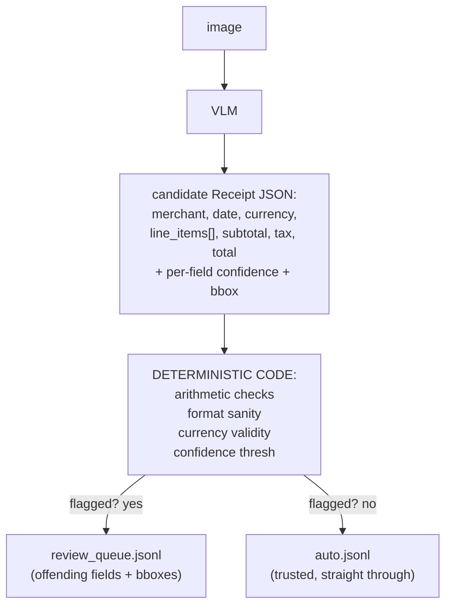

# Lecture 5: LLM Proposes, Code Disposes — Deterministic Validation and Human-Review Routing

> A vision model will read a receipt, emit clean JSON, tell you it's 0.98 confident, and be wrong about the total — with no error, no exception, no red flag. It fabricated a number that *looks* right, and it did so with the same serene confidence it uses when it's correct. This lecture is about the engineering discipline that makes such a model shippable anyway: you never trust the model's word, you gate every output through deterministic code that re-checks the arithmetic the model claims to have done, and you route anything that fails — or that the model is unsure about — to a human. After this lecture you will be able to build a validator layer that catches confident fabrications with plain arithmetic, design a routing gate that splits documents into an auto-approve stream and a review queue, explain why self-reported confidence is a weak signal that must be *calibrated against a gold set*, state the one metric that actually tells you whether your auto-approve bucket is safe, and hand a human reviewer a document with the offending fields already highlighted on the image.

**Prerequisites:** Lectures 1–4 (VLM architecture, schema-validated extraction with Pydantic + instructor, bounding boxes + confidence, OCR/hybrid), Phase 2 structured output, Phase 7 eval mindset · **Reading time:** ~26 min · **Part of:** Multimodal & Specialized Modalities, Week 1

---

## The core idea (plain language)

Since Phase 1 the entire course has repeated one refrain: **treat model output as untrusted input.** You validated LLM text against a Pydantic schema. You grounded RAG answers with citations and checked them. You wrote evals because vibes lie. This lecture is that exact discipline applied to pixels — and it needs to be *stronger* here, because a VLM fails in a uniquely dangerous way.

A text LLM that hallucinates usually produces something you can catch: a made-up API, a citation that doesn't resolve, prose that reads oddly. A VLM extracting a receipt hallucinates a **plausible number in the right field**. The schema is satisfied — `total` is a valid float. The value is confidently reported. Nothing downstream can tell that `total: 47.30` should have been `42.10`. It slides straight into your ERP and someone's expense report is wrong by five dollars, silently, forever.

So the mental model is a two-stage pipeline:

> **The LLM proposes. Code disposes.** The model's job is to *read and structure* — to turn pixels into a candidate `Receipt`. The code's job is to *decide whether to believe it* — to re-derive the invariants the document must obey and refuse anything that violates them. The model is a fast, fallible transcriptionist; the validator is the accountant who checks the sums.

Two kinds of check do the disposing:

1. **Domain validators** — deterministic, code-enforced invariants the document *must* satisfy regardless of what the model said. Line items sum to subtotal. Subtotal plus tax equals total. Dates are real dates. Currency codes exist. These catch fabrications the model is confident about, because arithmetic doesn't care about confidence.
2. **Confidence routing** — a gate that flags a field if either its self-reported confidence is below a threshold *or* a validator failed, then routes the whole document: clean docs to `auto.jsonl`, anything flagged to `review_queue.jsonl` where a human sees the highlighted regions.

The rest of this lecture builds both stages, then explains why the confidence half is the weaker half and how you calibrate it so the routing actually means something.

---

## How it actually works (mechanism, from first principles)

### The failure we are defending against

A VLM is a next-token predictor conditioned on image tokens (Lecture 1). When it emits `total: 42.10`, it is not computing a sum — it is predicting the most likely token sequence given the pixels it saw. If the total on the receipt is smudged, or the encoder downscaled it below legibility, the model doesn't return "I couldn't read it." It returns its best *guess*, formatted identically to a confident read. There is no signal in the JSON that distinguishes a clean read from a fabrication.

This is the whole reason validators exist. You have information the model didn't use: **the document is internally redundant.** A receipt states its line items *and* its subtotal *and* its tax *and* its total — four numbers connected by arithmetic the merchant already computed. If the model transcribed all four correctly, the arithmetic closes. If it fabricated one, the arithmetic almost certainly breaks. You're not re-reading the image; you're checking that the model's own outputs are mutually consistent.



### Validator 1 — the arithmetic checks (the workhorse)

Three invariants cover most receipts and invoices:

1. **Line items sum to subtotal:** `Σ line_item.amount ≈ subtotal`
2. **Subtotal plus tax equals total:** `subtotal + tax ≈ total`
3. **Each line item's math closes:** `qty × unit_price ≈ amount`

The word doing all the work is **≈**. You cannot use `==` on money that came from a language model and passed through floating point. Consider check 2 done naively:

```python
if subtotal + tax == total:   # WRONG — will false-positive constantly
    ok()
```

`19.99 + 1.60` in IEEE-754 double precision is not exactly `21.59` — it's `21.589999999999996`. An exact-equality check flags a *correct* document. Worse, real receipts round. A merchant computes 8.25% tax on $19.99 as $1.649175, prints **$1.65**, and prints a total of **$21.64**. Your reconstructed `19.99 + 1.65 = 21.64` closes, but if you recompute tax yourself as `19.99 * 0.0825 = 1.649` and compare to the printed 1.65, you'll flag a document that is perfectly correct. **The receipt is the source of truth for what was charged, not your recomputation.** Check the numbers *as printed* against each other, with tolerance.

So every arithmetic check needs a tolerance, and the tolerance has two parts — an absolute floor and a relative component:

```python
def close(a: float, b: float, abs_tol=0.02, rel_tol=0.01) -> bool:
    return abs(a - b) <= max(abs_tol, rel_tol * abs(b))
```

- **`abs_tol` (2 cents)** absorbs per-item rounding on small totals. Three line items each rounded to the nearest cent can drift the sum by ~1.5 cents from the printed subtotal; 2 cents covers it without waving through real errors.
- **`rel_tol` (1%)** scales the tolerance for large invoices. On a \$4,000 invoice, a 2-cent absolute tolerance is absurdly tight — accumulated rounding across 40 line items can legitimately exceed it. 1% of \$4,000 is \$40, which is the right order of magnitude for "rounding drift" vs "the model dropped a digit."

Pick the tolerance from the *domain*, not from a hunch. Retail receipts: `abs_tol=0.02`. Multi-hundred-line B2B invoices: lean on `rel_tol`. Log every near-miss (within 2× tolerance) so you can tune the numbers against reality later.

Here's a compact validator returning structured failures rather than a bare bool — because the routing stage needs to know *which* fields to highlight:

```python
def validate_receipt(r: Receipt) -> list[str]:
    fails = []
    li_sum = sum(f(i.amount) for i in r.line_items)
    if not close(li_sum, f(r.subtotal), abs_tol=0.02, rel_tol=0.01):
        fails += ["subtotal"] + [f"line_items[{k}].amount"
                                 for k in range(len(r.line_items))]
    if not close(f(r.subtotal) + f(r.tax), f(r.total), abs_tol=0.02):
        fails += ["subtotal", "tax", "total"]
    for k, i in enumerate(r.line_items):
        if not close(f(i.qty) * f(i.unit_price), f(i.amount), abs_tol=0.02):
            fails += [f"line_items[{k}].amount"]
    return sorted(set(fails))     # de-duplicated list of offending field paths
```

(`f()` is a helper that parses the model's string field to a float and treats unparseable as NaN — which fails every `close()` check, correctly flagging garbage.)

### Validator 2 — format and domain sanity

Arithmetic catches wrong *numbers*. These catch wrong *shapes* and impossible *values*:

- **Date sanity.** Parse the extracted date with a strict parser. Reject dates in the future (a receipt dated 2027 on a 2026 document is an OCR misread of the year), dates before some floor (2015), and unparseable strings. Watch the **DD/MM vs MM/DD** trap: `03/04/2026` is ambiguous, and a model will silently pick one. If your documents are single-locale, pin the expected order and flag anything that only parses in the other order (e.g. `13/04` can only be DD/MM). If mixed-locale, you *cannot* disambiguate `03/04` from the string alone — flag it low-confidence and let a human decide.
- **Currency-code validity.** If you extract an ISO-4217 code, check it against the real set (there are ~180; `USD`, `EUR`, `BGN` are in, `US$` and `EURO` are not). A model will happily emit `"US$"` or `"Dollar"`. Normalize symbols (`$ → USD` *only* if you know the locale — `$` is also CAD, AUD, MXN) or flag.
- **Numeric plausibility.** Negative totals on a sales receipt (unless it's a refund doc type), a tax *rate* implied by `tax/subtotal` outside a sane band (say 0–30%), a `qty` of 10,000 on a coffee-shop line — all cheap, catch gross misreads.

These are five-line checks with enormous leverage: they cost microseconds and catch the misreads arithmetic can't (a correctly-summing document with a nonsense date).

### The routing gate — confidence OR validator failure

Now combine. For each document, a field is **flagged** if *either* condition holds:

```
flagged(field)  ⟺  confidence(field) < THRESHOLD   OR   field ∈ validator_failures
```

```python
FLAG_THRESHOLD = 0.75

def route(r: Receipt, image_id: str, sink_auto, sink_review):
    val_fails = set(validate_receipt(r))
    low_conf  = {name for name, fv in iter_fields(r) if fv.confidence < FLAG_THRESHOLD}
    offending = sorted(val_fails | low_conf)          # union — OR, not AND

    if offending:
        sink_review.write(json.dumps({
            "id": image_id,
            "offending_fields": offending,
            "reasons": {"validator": sorted(val_fails), "low_conf": sorted(low_conf)},
            "bboxes": {name: bbox_of(r, name) for name in offending},
            "record": r.model_dump(),
        }) + "\n")
    else:
        sink_auto.write(json.dumps({"id": image_id, "record": r.model_dump()}) + "\n")
```

Note it's a document-level decision: **one flagged field routes the whole document to review.** You don't auto-approve 5 of 6 fields and review 1 — the human needs the whole document in context, and a fabricated total often means the model was struggling with the whole image. Note also the union (`OR`): a field the model was confident about but that *fails arithmetic* still gets flagged. That's the point — confidence is not a veto over the hard check.

---

## Worked example — one clean doc, one fabricated total

Two receipts through the pipeline. Tolerance: `abs_tol=0.02`, `rel_tol=0.01`, `FLAG_THRESHOLD=0.75`.

**Receipt A (clean).** Model returns:

```
line_items: [ {desc:"Latte",     qty:1, unit_price:4.50, amount:4.50, conf:0.97},
              {desc:"Croissant",  qty:2, unit_price:3.25, amount:6.50, conf:0.95} ]
subtotal: 11.00 (conf 0.96)   tax: 0.91 (conf 0.93)   total: 11.91 (conf 0.98)
date: 2026-06-14 (conf 0.94)  currency: USD (conf 0.99)
```

Validators:
- Σ amounts `= 4.50 + 6.50 = 11.00`; subtotal `11.00`. `|11.00 − 11.00| = 0 ≤ 0.02` ✓
- `subtotal + tax = 11.00 + 0.91 = 11.91`; total `11.91`. `|11.91 − 11.91| = 0 ≤ 0.02` ✓
- Line 1: `1 × 4.50 = 4.50` ✓. Line 2: `2 × 3.25 = 6.50` ✓
- Date parses, not future, sane. Currency `USD` valid.

All confidences ≥ 0.75. `offending = ∅` → **`auto.jsonl`**. Trusted, no human touches it.

**Receipt B (fabricated total).** Same items, but the total on the paper is faded and the model guessed:

```
subtotal: 11.00 (conf 0.96)   tax: 0.91 (conf 0.93)   total: 12.10 (conf 0.88)
```

Validators:
- Σ amounts `= 11.00`; subtotal `11.00` ✓
- `subtotal + tax = 11.91`; total `12.10`. `|11.91 − 12.10| = 0.19 > 0.02` ✗ → flags `subtotal, tax, total`
- Line math ✓. Date/currency ✓.

Here is the lesson: the model's confidence on `total` was **0.88 — well above the 0.75 threshold.** Confidence routing alone would have *auto-approved this fabrication.* The arithmetic check is what caught it. `offending = {subtotal, tax, total}` → **`review_queue.jsonl`**, carrying those three field names and their bboxes so the reviewer sees the highlighted total region on the image and fixes `12.10 → 11.91` in seconds.

This is the entire argument for combining the two mechanisms in one example: self-reported confidence missed it; deterministic arithmetic caught it.

---

## Why self-reported confidence is not enough (and how to fix it)

A VLM's `confidence: 0.88` is **not a probability that the field is correct.** It's another token the model generated, conditioned to *look* like a confidence because you asked for one. Three things are wrong with trusting it raw:

1. **It's uncalibrated.** "0.9" does not mean "correct 90% of the time." Models are typically *overconfident* — a bucket of fields the model rated 0.9 might be correct only 80% of the time, or 95%. You do not know the mapping until you measure it.
2. **It doesn't know what it can't see.** If the encoder downscaled the total into mush (Lecture 1), the model fabricates *and* reports high confidence, because from the token distribution's view the guess was unremarkable. Confidence can't flag information that was destroyed before the LLM's first layer.
3. **It's correlated with the wrong things.** Models are often more confident on clean, common layouts and less confident on unusual ones — which is not the same as being more *correct*.

So confidence is a **weak, cheap prior** — useful as one input to routing, useless as the sole gate. The hard validators are the strong signal. And to use confidence at all, you must **calibrate the threshold against a gold set** (this is the Phase 7 discipline, Week 3). The procedure:

1. Hand-label 25–40 receipts with true field values (your gold set).
2. Run extraction. For each field you now have `(confidence, correct?)`.
3. Sort by confidence; sweep the threshold; at each candidate threshold compute what happens to the auto-approved bucket.

The metric you actually optimize is **precision of the auto-approved bucket**: of all fields (or documents) that sailed through to `auto.jsonl`, what fraction were actually correct?

```
precision_auto = (correct fields in auto bucket) / (all fields in auto bucket)
```

This is the number that matters because it *is* your error rate in production for everything no human ever looked at. If `precision_auto = 0.995`, then 1 in 200 auto-approved fields is wrong and nobody will catch it — decide if the business can live with that. Raising the threshold (or tightening validators) pushes more docs to review: **precision of auto goes up, but review volume (cost) goes up too.** That's the fundamental trade:

```
   THRESHOLD ↑  →  fewer docs auto-approved
                →  precision_auto ↑   (safer)
                →  review queue ↑     (more human cost)

   THRESHOLD ↓  →  more docs auto-approved
                →  precision_auto ↓   (riskier)
                →  review queue ↓     (cheaper)
```

You pick the threshold that hits your **target precision_auto** (e.g. "99.5% of auto-approved documents must be fully correct") at the *lowest* review volume. That is the calibration deliverable in Week 3's Definition of Done: *"you can state the precision of the auto-approved bucket."* Recall on the review queue matters too (you don't want bad docs escaping to auto), but the headline number is precision of what you *didn't* review — because that's the population running unsupervised.

---

## The review-UI contract

Routing to a queue is worthless if the human can't act fast. The queue entry is a **contract** between your pipeline and the review tool, and it must carry three things:

1. **`offending_fields`** — the list of field paths that failed, so the UI knows what to draw attention to and the reviewer isn't hunting.
2. **`bboxes`** — normalized `(x, y, w, h)` per offending field, so the UI can highlight the exact region on the image. These come from the VLM (Lecture 1) — approximate, which is *fine*: they only need to be close enough to draw a human's eye to the right part of the receipt.
3. **`reasons`** — did this fail arithmetic, or low confidence, or both? A reviewer treats "the total doesn't sum" differently from "the model wasn't sure it read the date."

Rendering the highlight is a few lines of Pillow — denormalize the bbox against the actual image size and draw a rectangle:

```python
from PIL import Image, ImageDraw

def highlight(image_path, bboxes: dict, out_path):
    im = Image.open(image_path).convert("RGB")
    W, H = im.size
    d = ImageDraw.Draw(im)
    for name, b in bboxes.items():
        x0, y0 = b["x"] * W, b["y"] * H          # bbox is normalized 0–1
        x1, y1 = (b["x"] + b["w"]) * W, (b["y"] + b["h"]) * H
        d.rectangle([x0, y0, x1, y1], outline="red", width=4)
        d.text((x0, max(0, y0 - 16)), name, fill="red")
    im.save(out_path)
```

In Streamlit you'd wrap this in a page: show the highlighted image on the left, an editable form of the offending fields (pre-filled with the model's guess) on the right, and an approve button that writes the corrected record back to `auto.jsonl`. The reviewer's whole job becomes *glance at the red box, fix the one number, click* — seconds per document instead of re-keying the entire receipt. That speed is what makes the human-in-the-loop economical: you're not paying humans to process every document, only to adjudicate the small flagged fraction.

---

## How it shows up in production

- **Silent wrong-number bugs are the expensive ones.** A crash you find in five minutes. A `total` that's off by a dollar in 0.5% of receipts you find in a quarterly audit, after it's polluted thousands of records. The validator layer is cheap insurance against the failure mode that has no stack trace.
- **Validators are near-free; the model call is the cost.** Arithmetic and format checks run in microseconds on data you already have in memory. There is no latency or dollar argument against adding them — the only cost is the code. Skipping them is never a performance decision, only a discipline failure.
- **The review queue is a budget line.** Every doc you route to review costs human minutes. A poorly-tuned threshold (0.9 "to be safe") can push 40% of traffic to review and blow up your ops cost while barely improving precision_auto. Calibrate; don't guess. The queue depth is a metric to alarm on.
- **Tolerance false-positives erode trust fast.** If your validator flags correct documents (because you used `==`, or recomputed tax instead of checking printed values), reviewers learn the flags are noise and start rubber-stamping — which defeats the entire system. A validator that cries wolf is worse than no validator. Getting tolerance right is not a nicety; it's what keeps the humans engaged.
- **Confidence drift across model versions.** When you swap `gemini-2.0-flash` for the next version, its confidence distribution shifts and your calibrated 0.75 threshold is suddenly wrong. Re-calibrate on the gold set every model change. The arithmetic validators, by contrast, are model-agnostic and don't drift — another reason they're the backbone.
- **Tax edge cases are a whole genre of false-positive.** Tax-inclusive pricing (EU VAT shown inside line prices), mixed tax rates on one receipt (food 0%, alcohol 20%), tips added after the printed total, multi-currency — each breaks a naive `subtotal + tax == total`. Know your document population before you set invariants, and make the checks *skippable per doc-type* rather than firing wrong on a category you didn't anticipate.

---

## Common misconceptions & failure modes

- **"The schema validated, so the data is good."** Schema validation proves *shape* (`total` is a float), never *correctness* (`total` is the right float). A fabricated total is perfectly schema-valid. Shape and truth are different layers.
- **"High confidence means it's right."** Uncalibrated and often overconfident. The 0.88-confidence fabricated total in the worked example is the whole warning. Confidence is a weak prior, not a guarantee.
- **"Use `==` for the arithmetic."** Guarantees false-positives from floating point and legitimate merchant rounding. Always tolerance-based with an absolute floor and a relative component.
- **"Recompute the tax myself and compare."** The receipt is the source of truth for what was charged. Recomputing tax from a rate you assume will flag correct documents whose printed tax was rounded differently than you expect. Check printed numbers against each other.
- **"Flag the field, auto-approve the rest of the doc."** One bad field usually signals the model struggled with the image; and a reviewer needs whole-document context. Route the whole document.
- **"Confidence AND validator (both must fail to flag)."** No — it's OR. A confident fabrication passes the confidence test but fails arithmetic; requiring both would let it through. Union the two flag sets.
- **"Set the threshold high to be safe."** Higher precision_auto, yes — but review volume (cost) can explode for marginal safety gain. The right threshold is the *lowest* one that still hits your precision_auto target, found by calibration, not fear.
- **"VLM bboxes are too imprecise to be useful."** For a *highlight* they're plenty — the human's eye does the fine localization. You'd only need pixel-precise boxes for auto-cropping, which you're not doing here.

---

## Rules of thumb / cheat sheet

- **Mantra:** *LLM proposes, code disposes.* The model reads; deterministic code decides whether to believe it.
- **Never `==` on money.** `close(a, b, abs_tol=0.02, rel_tol=0.01)` — absolute floor + relative component. Tune `abs_tol` for small receipts, `rel_tol` for big invoices.
- **Check printed numbers against each other,** not against your own recomputation of tax/rates. The receipt is the source of truth.
- **Flag rule is OR:** `confidence < threshold` **OR** `validator failed`. Union the sets. One flagged field → whole document to review.
- **Three arithmetic invariants:** Σ line amounts ≈ subtotal; subtotal + tax ≈ total; qty × unit_price ≈ amount.
- **Cheap sanity checks pay off:** date parses + not future + not ancient; currency in ISO-4217; no absurd qty/negative total.
- **Confidence is a weak prior,** not a probability. Calibrate the threshold on a gold set every time you change models. Start ~0.75, then let the data set it.
- **The metric that matters:** *precision of the auto-approved bucket.* Set a target (e.g. 99.5%), pick the lowest threshold that hits it.
- **Review queue entry carries:** `offending_fields`, `bboxes`, `reasons`. Highlight the region; pre-fill the fix; one click.
- **A validator that false-positives is worse than none** — it trains reviewers to rubber-stamp. Guard tolerance carefully; log near-misses.

---

## Connect to the lab

This lecture is the "why" behind step 6 of the Week 1 `docextract` lab (`route.py`) and the corresponding Definition of Done ("the arithmetic validator flags a corrupted-total document into `review_queue.jsonl`"). Build `close()` first and unit-test it on the floating-point and merchant-rounding cases *before* wiring the validators, so you don't ship a false-positive machine. The calibration half — "state the precision of the auto-approved bucket" — is Week 3, Part 3, once you have a gold set; the threshold you hardcode as 0.75 now becomes a *measured* number then.

---

## Going deeper (optional)

- **Pydantic docs — validators** (root: `docs.pydantic.dev`): field/model validators are where you can push some of these invariants into the schema itself. Search: `pydantic model_validator`.
- **`instructor` docs** (root: `python.useinstructor.com`): `max_retries` + validation-error feedback lets the model *self-correct* against a failing validator before you even route — a middle layer between "propose" and "dispose." Search: `instructor retrying validation`.
- **Python `math.isclose`** (root: `docs.python.org`) — the stdlib tolerance function; read *why* it takes both `rel_tol` and `abs_tol` and why `abs_tol` defaults to 0 (so it fails near zero). Search: `python math.isclose rel_tol abs_tol`.
- **ISO 4217** currency codes — the authoritative list to validate against. Search: `ISO 4217 currency code list`.
- **Pillow ImageDraw docs** (root: `pillow.readthedocs.io`) and **Streamlit docs** (root: `docs.streamlit.io`) for the review UI. Search: `streamlit image annotation`, `pillow ImageDraw rectangle`.
- **Calibration intuition:** search `model calibration reliability diagram` and `expected calibration error` — you don't need the math, but the reliability-diagram picture is the mental model for "0.9 confidence ≠ 90% correct."
- **Concept, named:** "human-in-the-loop" and "confidence-based routing / triage" are the industry terms — search either alongside `document extraction` for production write-ups.

---

## Check yourself

1. A receipt's schema validation passes and every field reports confidence ≥ 0.9, but the `total` is wrong. Which mechanism catches it, which one misses it, and why does that prove you need both?
2. Why is `subtotal + tax == total` (exact equality) guaranteed to produce false-positives, and what two-component tolerance fixes it?
3. Your teammate proposes recomputing tax as `subtotal * rate` and flagging any receipt where that doesn't match the printed tax. Why will this flag correct documents, and what should you compare instead?
4. Define "precision of the auto-approved bucket." Why is it the metric you actually care about, and what happens to it (and to cost) as you raise the confidence threshold?
5. The flag rule is `confidence < 0.75 OR validator_failed`. Why OR and not AND? Give the concrete failure that AND would let through.
6. What three pieces of information must a review-queue entry carry so a human can adjudicate a flagged document in seconds, and why are approximate VLM bounding boxes good enough for it?

### Answer key

1. The **arithmetic validator** catches it (`subtotal + tax` won't equal the fabricated `total`); **confidence routing misses it** because confidence is ≥ 0.9, above any sane threshold. This is the proof you need both: confidence is a weak, uncalibrated prior that says nothing about a confident fabrication, while the hard check re-derives an invariant the document must obey regardless of what the model claimed.
2. IEEE-754 doubles can't represent most decimals exactly (`19.99 + 1.60 = 21.589999…`), and real merchants round line items and tax, so exact equality flags correct documents. Fix: `close(a, b)` with an **absolute floor** (`abs_tol`, ~2 cents, for small-total rounding) and a **relative component** (`rel_tol`, ~1%, so large invoices get proportionally more slack).
3. Merchants round the *printed* tax (e.g. 8.25% of \$19.99 = \$1.649175 printed as \$1.65), so your recomputed `1.649` won't match the printed `1.65` and you'll flag a correct receipt. The receipt is the source of truth for what was charged — compare the *printed* numbers against each other (`printed_subtotal + printed_tax ≈ printed_total`), not against a rate you assume.
4. It's the fraction of fields/documents that reached `auto.jsonl` (no human review) that were actually correct. It matters because it *is* your unsupervised error rate — everything nobody looks at. Raising the threshold sends more docs to review, so **precision_auto goes up (safer) but review volume/cost goes up too**; you want the lowest threshold that still hits your precision_auto target.
5. OR, because the two mechanisms catch *different* failures and you want to flag on *either*. AND would require both to fail — so a **confident fabrication** (high confidence, fails arithmetic) would pass the confidence half and be auto-approved despite failing the hard check. That's exactly the dangerous case (the 0.88-confidence wrong total).
6. `offending_fields` (what failed, so the UI directs attention), `bboxes` (normalized regions to highlight on the image), and `reasons` (arithmetic vs low-confidence, which the reviewer treats differently). Approximate boxes are fine because they only need to draw the human's eye to the right region — the reviewer's own vision does the fine localization; pixel precision is only needed for auto-cropping, which this isn't.
