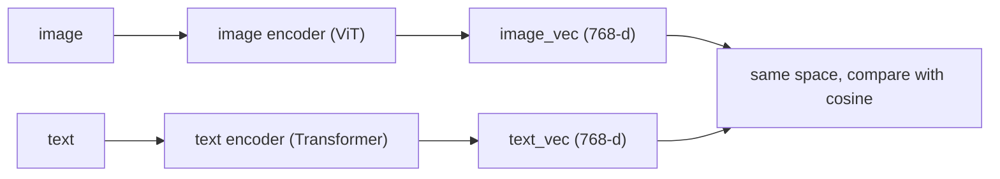

# Lecture 6: Multimodal Embeddings — CLIP/SigLIP and the Shared Image-Text Space

> In Phase 3 you learned to turn a sentence into a vector so you could search text by meaning instead of keywords. This lecture does the same trick across a modality boundary: it puts *images and text into the same vector space*, so that the vector for a photo of a cat and the vector for the words "a cat" land close together — and you can search a million images with a typed sentence, no captions required. That single idea powers text→image search, image→image dedup, zero-shot classification, and the vision front-end of nearly every VLM you used last week. But it comes with a hard ceiling: one image collapses to *one* global vector, which is brilliant for "find the photo of a cat" and nearly useless for "which slide mentions Q3 churn." After this lecture you will be able to explain contrastive training at an engineering level, use `encode_image`/`encode_text` correctly (including the normalization step everyone forgets), stand up a naive image-search index over a corpus, choose between CLIP and SigLIP for a job, and articulate *precisely* the pooling limitation that makes the next lecture (ColPali, late interaction) necessary.

**Prerequisites:** text embeddings + cosine similarity + ANN indexes (Phase 3 RAG), what a token/embedding is (Phase 1), Week 1 Lecture on VLM architecture (the ViT patch encoder — CLIP/SigLIP *is* that encoder's ancestor) · **Reading time:** ~26 min · **Part of:** Multimodal & Specialized Modalities, Week 2

---

## The core idea (plain language)

You already trust this sentence: *"two pieces of text that mean similar things get vectors that point in similar directions, so `cosine(a, b)` measures semantic similarity."* That is the whole basis of Phase 3 RAG.

A **multimodal embedding model** — CLIP, SigLIP, and their descendants — extends that guarantee across modalities. It gives you **two encoders that share one output space**:

- `encode_image(pixels) -> vector` (e.g. 512 or 768 floats)
- `encode_text(string)  -> vector` (same dimensionality, *same space*)

The promise is that these two functions are **aligned**: the image vector for a golden retriever photo and the text vector for `"a photo of a dog"` point in nearly the same direction, so their cosine similarity is high. A photo of a fire truck and `"a photo of a dog"` point in different directions, so their cosine is low.

Once that holds, a pile of tricks fall out for free — you didn't train any of them, they're just consequences of the shared space:

- **Text→image search.** Embed your whole image corpus once. At query time, embed the *text* query and find the nearest image vectors. You just built image search with no captions, no tags, no OCR.
- **Image→image search.** Embed a query image, find nearest image vectors. Near-duplicate detection, "more like this," visual dedup.
- **Zero-shot classification.** Embed the labels as text (`"a photo of a cat"`, `"a photo of a dog"`), embed the image, pick the label with the highest cosine. No training, no fine-tuning.

And here is the ceiling, stated up front because the rest of the phase is built around escaping it:

> **One image becomes one vector.** The entire picture — every region, every word on every slide, every cell of every table — is *pooled* into a single point in space. That point captures the gist ("this is a bar chart about revenue") and throws away the fine detail ("the Q3 bar is labeled 4.2% churn"). Global-vector search is a gist-matcher, not a detail-matcher.

Keep that sentence in your head. Everything good and everything frustrating about CLIP/SigLIP comes from it.

---

## How it actually works (mechanism, from first principles)

### Two towers, one space

CLIP ("Contrastive Language-Image Pre-training") is literally two neural networks bolted to a shared objective:



The image encoder is the *same kind of ViT patch encoder* you met in Week 1 — it slices the image into patches, runs attention, and pools the result down to a single vector. The text encoder is a standard Transformer that pools its tokens down to a single vector. Both project into an output space of the same dimensionality. Nothing forces those two spaces to align at initialization; alignment is entirely *learned* by the training objective.

### Contrastive training: pull matches together, push mismatches apart

Here is the mechanism, with the math kept to what you need to debug it.

Training data is a giant pile of **(image, caption) pairs** scraped from the web — hundreds of millions to billions of them. Alt-text, surrounding HTML, filenames. Noisy, but plentiful.

Take a **batch** of N pairs, say N = 32,768 (batch size matters enormously — hold that thought). Encode all 32,768 images and all 32,768 captions. Now compute the **N×N similarity matrix**: every image's cosine similarity against every caption.

```
              caption_0  caption_1  caption_2  ...  caption_N-1
   image_0  [   0.81   ,   0.12   ,   0.05  , ... ,    0.09    ]
   image_1  [   0.07   ,   0.79   ,   0.11  , ... ,    0.03    ]
   image_2  [   0.10   ,   0.08   ,   0.88  , ... ,    0.14    ]
     ...
```

The **diagonal** entries are the *true* pairs — image_i with its own caption_i. Everything off-diagonal is a mismatch: image_i paired with some *other* image's caption, which is almost certainly wrong (image_0's caption is not a good description of image_1).

The training objective, in one sentence: **make the diagonal big and everything off-diagonal small.** Pull each image toward its own caption; push it away from all the other captions in the batch. That's the "contrast." The other N−1 captions in the batch act as **negatives** — free, plentiful, and the reason big batches matter: a batch of 32k gives each image 32,767 negatives to be pushed away from, per step.

**CLIP's specific loss (softmax / InfoNCE).** For each image row, CLIP applies a softmax across the whole row and maximizes the probability mass on the diagonal cell. Softmax is *competitive*: it normalizes across the entire row, so raising the diagonal necessarily lowers the others. This is why CLIP is sensitive to batch size — the softmax denominator *is* the batch, and a bigger denominator means harder, more informative negatives. It also means the loss computation needs every pair's score visible at once, which gets expensive to shard across many GPUs.

**SigLIP's loss (sigmoid).** SigLIP ("Sigmoid Loss for Language-Image Pre-training," Google) changes one thing with big consequences: instead of a softmax across the row, it treats **each cell independently** as a binary classification — "is this pair a match: yes/no?" — with a sigmoid. Match cells (the diagonal) should score toward 1; mismatch cells (everything else) toward 0. No row-wise normalization, no competition across the batch.

Why engineers care about that difference:

- **Scaling / sharding.** Softmax needs the full row assembled to compute its denominator, which forces expensive all-gather communication across GPUs at large batch sizes. Sigmoid is per-cell and *separable*, so it shards cleanly — you can compute your local chunk of the matrix without seeing everyone else's. SigLIP trains efficiently at large batch and tends to give **stronger encoders at the same compute**, which is exactly why the 2025 crop of VLMs (and Week 1's "SigLIP-So400m vision tower") lean on SigLIP encoders.
- **Serving.** The *output* is the same shape either way — a normalized vector you compare with cosine. So swapping a CLIP model for a SigLIP model in an inference pipeline is a model-card swap, not a re-architecture. The loss difference is a *training-time* story; at serve time you get two encoders and a cosine, full stop.

> Debug-level takeaway: the loss function is a training detail you rarely touch, but it explains *why* the good open models are SigLIP-flavored and why "just use a bigger batch" is folklore that's true for CLIP-family training.

### The temperature knob (why raw cosines look weirdly clustered)

One more training detail that surfaces in production. Before the softmax/sigmoid, scores are divided by a learned **temperature** τ (equivalently multiplied by a learned scale, often ~100). This sharpens the distribution during training. The side effect you *see*: raw image-text cosine similarities are often squished into a narrow band — you might find that "perfect match" scores ~0.30 and "totally unrelated" scores ~0.10, not the clean 0.9-vs-0.1 you'd expect from text-only embedding models.

**This bites you the first time.** Do not hard-code an absolute cosine threshold like "> 0.8 means relevant" the way you might with a text embedder. CLIP/SigLIP similarities are only meaningful *relative to each other* (ranking) or *relative to a calibrated threshold you measured on your own data*. More on this in failure modes.

### Normalization: the one line everyone forgets

To make cosine similarity a plain dot product (fast, and what every ANN index expects), you **L2-normalize** every vector to unit length before storing or comparing:

```python
import numpy as np

def l2_normalize(v):
    return v / np.linalg.norm(v, axis=-1, keepdims=True)
```

After normalization, `cosine(a, b) == dot(a, b)`, values live in [−1, 1], and your vector DB's "inner product" and "cosine" metrics become identical. Skip this step and your cosines are silently wrong, your ANN recall craters, and you'll waste an afternoon. Most libraries have a `normalize=True` flag on the encode call — use it, or do it yourself, but *never* store raw vectors.

---

## Worked example

Let's build the smallest useful thing: a zero-shot classifier and a search index, with numbers.

### Zero-shot classification by cosine

Say we have one image and three candidate labels. We embed and normalize everything (dimensions truncated for readability):

```
image_vec        = [ 0.10,  0.30, -0.20, ... ]   (unit length)

text "a cat"     = [ 0.09,  0.28, -0.19, ... ]
text "a dog"     = [ 0.05,  0.10,  0.02, ... ]
text "a truck"   = [-0.20,  0.01,  0.40, ... ]
```

Compute cosine (= dot product, since all are unit length):

```
cosine(image, "a cat")   = 0.31   ← highest
cosine(image, "a dog")   = 0.18
cosine(image, "a truck") = 0.04
```

Prediction: **cat**. Notice the winning score is 0.31, not 0.95 — that's the temperature squish from earlier. What matters is that 0.31 is clearly the *largest*, not that it's near 1.0. A classic trick that measurably helps: use a **prompt template** — embed `"a photo of a cat"` instead of bare `"cat"` — because the training captions looked like sentences, so sentence-shaped queries land in a better-populated region of the space. This is called *prompt ensembling* when you average several templates, and it can move zero-shot accuracy by a few points.

### A naive image search index, end to end

The recipe is exactly the Phase 3 RAG shape, with the image encoder swapped in for the text encoder on the *indexing* side.

**Step 1 — embed the corpus once (offline).**

```python
import open_clip, torch, numpy as np

model, _, preprocess = open_clip.create_model_and_transforms(
    "ViT-B-32", pretrained="laion2b_s34b_b79k"
)
tokenizer = open_clip.get_tokenizer("ViT-B-32")
model.eval()

@torch.no_grad()
def embed_images(pil_images):
    batch = torch.stack([preprocess(im) for im in pil_images])
    feats = model.encode_image(batch)
    feats = feats / feats.norm(dim=-1, keepdim=True)   # L2 normalize!
    return feats.cpu().numpy()

# corpus_vecs: (num_images, 512) float32, all unit length
corpus_vecs = embed_images(load_all_images())
```

**Step 2 — put the vectors in an ANN index.** For 10k images a brute-force dot product is fine (a 10,000×512 matrix-vector product is microseconds). Past ~100k, reach for FAISS / hnswlib / a vector DB (pgvector, Qdrant, LanceDB). Since vectors are unit length, choose the **inner-product** metric.

```python
import faiss
index = faiss.IndexFlatIP(512)     # inner product == cosine for unit vectors
index.add(corpus_vecs)
```

**Step 3 — query with text (online).**

```python
@torch.no_grad()
def embed_text(strings):
    toks = tokenizer(strings)
    feats = model.encode_text(toks)
    feats = feats / feats.norm(dim=-1, keepdim=True)   # same normalization
    return feats.cpu().numpy()

q = embed_text(["a red bicycle leaning on a brick wall"])
scores, ids = index.search(q, k=5)     # top-5 nearest image vectors
```

`ids` are your five best-matching images. **You never captioned anything.** The text query reached directly into image space because the two encoders share it. That's the payoff of contrastive training in five lines.

**Cost sketch (order-of-magnitude, approximate).** Embedding is a single forward pass per item: on a modern GPU you'll do thousands of images/sec; on CPU, tens to low hundreds/sec with a ViT-B. A 512-float vector in float32 is 2 KB, so **1M images ≈ 2 GB** of vectors — fits in RAM, so brute force or flat HNSW is entirely reasonable at that scale. Query latency is dominated by the *text* forward pass (a few ms) plus the ANN lookup (sub-ms to low-ms). Compare this to running a VLM caption on every image — orders of magnitude more expensive — which is the crux of the next section.

---

## How it shows up in production

**1. This is the cheap-but-lossy retrieval baseline — pattern (a).** Last week's theory named three multimodal-RAG shapes. The one you can build *today* with what's above is a variant of **pattern (a): caption-then-text-embed**, and its even-cheaper cousin, **direct multimodal-embed (pattern b)**. Both give you *one vector per image* and a plain ANN index. They're fast, dirt cheap to serve, and they work great when the query is about the *gist* of the image. You will A/B this baseline against ColPali (pattern c) in the lab — and the whole point of measuring it is to *feel* where the global vector runs out of road.

**2. The pooling limitation, made concrete.** Ask your CLIP index "which slide mentions Q3 churn." The slide you want is a dense grid of text and a table. CLIP pooled that entire slide into one vector that mostly encodes "corporate slide with a chart and text" — the *string* "Q3 churn" contributed a tiny fraction of a single averaged point and is effectively invisible to a text query looking for those exact words. You'll get back slides that *look* like the right kind of slide, ranked by visual gist, not the one with the actual number. This is not a bug you can prompt around; it's the arithmetic of pooling. It is the entire motivation for late-interaction retrieval (ColPali), where a page keeps *many* vectors (one per patch) so the "Q3 churn" region can match on its own.

**3. Don't hard-code cosine thresholds.** Because of temperature squish (and because different CLIP/SigLIP checkpoints have different score distributions), an absolute cutoff you tuned on one model breaks on the next. Calibrate on a small labeled set: sweep the threshold, look at precision/recall on *your* data, and store the threshold *with the model version*. Better yet, prefer top-k ranking over thresholding wherever the product allows it.

**4. Preprocessing must match training, exactly.** Each checkpoint has a specific input resolution, resize/crop policy, and normalization mean/std baked in. Use the `preprocess` transform that ships *with the model* (as above). Feed a 224-trained model 336px images, or use ImageNet stats when the model wants its own, and quality degrades quietly — no crash, just worse recall. Same discipline as tokenizer-must-match-model in text.

**5. Model-swap is a config change, not a rewrite — but re-embed everything.** Switching ViT-B-32 → a SigLIP checkpoint changes vector dimensionality and the space itself. **Vectors from two different models are not comparable.** Any model change means re-embedding the entire corpus and rebuilding the index. Budget for that: it's a batch job, not a hot-path change, and it's why teams pin the embedding model version in config and treat an upgrade as a migration.

**6. Domain gap is real.** CLIP/SigLIP were trained on web images + alt-text. They're excellent on natural photos and surprisingly decent on memes and product shots. They are *mediocre* on out-of-distribution domains — medical scans, satellite imagery, dense document pages, CAD drawings — because those barely appear in web captions. If your corpus is one of those, expect to fine-tune or reach for a domain-specific/late-interaction model rather than assuming stock CLIP recall.

---

## Common misconceptions & failure modes

- **"Cosine 0.3 means it's a bad match."** No. For CLIP/SigLIP, 0.3 can be an excellent match. Absolute values are compressed by temperature; judge by *ranking* and *your calibrated threshold*, never by intuition carried over from text embedders.
- **"I can compare a CLIP vector to a SigLIP vector / to an OpenAI text-embedding vector."** Never. Different model = different space = meaningless comparison. Everything in one index must come from one model version.
- **"It reads text in the image."** It does not OCR. CLIP has weak, coarse awareness that "there is text here" and can catch a very short prominent word sometimes, but it cannot reliably retrieve on the *content* of text in an image. This is the exact failure that sinks "which slide mentions Q3 churn."
- **"Bigger vectors are always better."** Dimensionality is fixed by the checkpoint (512, 768, 1024...). You don't get to dial it up. Bigger backbones can help recall but cost more per embed and more storage; measure on your data.
- **"Forgot to normalize."** The silent killer. If your ANN recall is mysteriously bad or your cosines exceed 1.0, you skipped L2 normalization somewhere (often on only one side — text but not image).
- **"CLIP counts / understands spatial relations."** It's weak at counting and at "the cat is *left of* the dog." Global pooling discards precise layout. Same family of blind spots you saw in VLM grounding last week — same root cause.
- **"Zero-shot labels work bare."** `"cat"` underperforms `"a photo of a cat"`. Match the caption *style* the model trained on; ensemble a few templates for a free accuracy bump.

---

## Rules of thumb / cheat sheet

- **Default open model:** OpenCLIP `ViT-B-32` or `ViT-L-14` (LAION-2B pretrained) for general work; a **SigLIP** checkpoint (e.g. SigLIP-So400m) when you want stronger recall at similar size and easy scaling. Both via Hugging Face / `open_clip`.
- **Always L2-normalize** both image and text vectors before storing or comparing. Use the index's **inner-product** metric on unit vectors.
- **Always use the model's shipped `preprocess`** transform. Never hand-roll resize/normalize.
- **Prompt template** text queries: `"a photo of a {label}"`; ensemble 3–7 templates for zero-shot classification.
- **Index sizing (approx):** 512-d float32 ≈ 2 KB/vector → 1M images ≈ 2 GB. Brute force ≤ ~100k; FAISS/hnswlib/pgvector beyond.
- **Rank, don't threshold** — and if you must threshold, calibrate on your data and pin it to the model version.
- **Re-embed the whole corpus** on any model change. Vectors across models are incomparable.
- **Reach for CLIP/SigLIP when** the query is about the *gist* of a natural image (find-the-cat, dedup, "more like this," zero-shot tags).
- **Do NOT reach for it when** you need to match on *fine detail inside* the image — small text, table cells, a specific region. That's ColPali/late-interaction territory (next lecture).

---

## Connect to the lab

This lecture is the "pattern (a)/(b)" baseline you'll deliberately out-grow in **Week 2, Build A ("Chat with your slide decks")**. Before you wire up ColPali/ColQwen via Byaldi, it's worth spending 30 minutes building the naive CLIP index above over your slide-deck page images and querying it with the same 10 visual questions from your Definition of Done. You will *watch* it return plausible-looking-but-wrong slides on the detail questions ("what's the churn number?") — and that felt experience is exactly what makes the late-interaction win in the ColPali build click. Keep the CLIP baseline around: it's the A in your required A/B against the OCR→text RAG baseline, and it makes your cost/quality tradeoff writeup honest.

---

## Going deeper (optional)

Real, named resources (search rather than trusting me for exact URLs):

- **OpenCLIP** — the canonical open reproduction, model zoo, and API you'll actually use. Search: `OpenCLIP GitHub mlfoundations`. Its README lists checkpoints and their pretraining datasets.
- **CLIP** (Radford et al., 2021), *"Learning Transferable Visual Models From Natural Language Supervision."* Read for the contrastive-batch intuition and the zero-shot results. Search: `CLIP paper OpenAI`.
- **SigLIP** (Zhai et al., 2023), *"Sigmoid Loss for Language Image Pre-training."* Read the intro + the sigmoid-vs-softmax argument; skip the proofs. Search: `SigLIP paper sigmoid loss`. Model cards: search `SigLIP Hugging Face` and `google/siglip-so400m`.
- **Hugging Face `sentence-transformers` / `transformers` CLIP docs** for the highest-level `encode` API if you don't want `open_clip` directly. Root docs domain you can trust: `huggingface.co/docs`.
- **FAISS** — the standard for ANN once brute force stops scaling. Search: `FAISS GitHub facebookresearch`; wiki has index-choice guidance.
- Bridge to next lecture: **ColBERT / late interaction** (Khattab & Zaharia) for the MaxSim multi-vector idea, and **ColPali** (search `ColPali paper vidore`) for the document-page application. This lecture is the "why one vector isn't enough" that those answer.

---

## Check yourself

1. In one sentence each, explain what contrastive training pulls together and pushes apart, and why the *batch size* matters for CLIP specifically.
2. You build a CLIP image index and query with text, but recall is terrible and some cosine scores are above 1.0. What's the most likely single bug?
3. Why is `"which slide mentions Q3 churn"` a bad fit for a single-vector CLIP index, stated in terms of pooling? What class of retrieval fixes it?
4. Your teammate wants to reject any match with `cosine < 0.8`, reasoning "that worked for our text embedder." Why is that wrong for CLIP/SigLIP, and what do you do instead?
5. At a high level, what does SigLIP change versus CLIP, and why does that make it scale and serve well?
6. You upgrade from `ViT-B-32` to a SigLIP checkpoint in config. What must you also do before the index returns correct results, and why?

### Answer key

1. Contrastive training **pulls a matching image–caption pair together** (high cosine) and **pushes every mismatched image–caption pair in the batch apart** (low cosine). Batch size matters for CLIP because its softmax loss normalizes across the whole row, so the other N−1 items in the batch *are* the negatives and the softmax denominator — a bigger batch gives more, harder negatives per step and a better signal.

2. You **forgot to L2-normalize** the vectors (likely on one side). Cosine only equals the dot product for unit-length vectors; unnormalized vectors give scores outside [−1, 1] and wreck ANN recall. Normalize both image and text vectors before storing/comparing, and use the inner-product metric.

3. CLIP pools the *entire* slide into **one global vector** that encodes its overall gist ("a corporate chart-and-text slide"); the specific string "Q3 churn" is a vanishing fraction of that average and is effectively invisible to a text query. **Late-interaction / multi-vector retrieval (ColPali/ColBERT-style)** fixes it by keeping many vectors per page so the region containing the number can match on its own.

4. CLIP/SigLIP scores are **compressed by the learned temperature**, so a genuine match may score ~0.3, not ~0.9; an absolute 0.8 cutoff would reject almost everything. Also, thresholds don't transfer across model checkpoints. Instead **rank and take top-k**, or calibrate a threshold on your own labeled data and pin it to the model version.

5. SigLIP replaces CLIP's **row-wise softmax** with a **per-cell sigmoid** (each pair judged independently as match/no-match). Because there's no cross-batch normalization, the loss is **separable and shards cleanly across GPUs** without expensive all-gather, so it trains efficiently at large batch and yields stronger encoders at the same compute. At serve time the output is identical in shape (a normalized vector + cosine), so it's a drop-in.

6. You must **re-embed the entire corpus with the new model and rebuild the index.** Vectors from two different models live in different spaces (and often different dimensionalities) and are not comparable, so mixing old and new vectors produces meaningless similarities.
