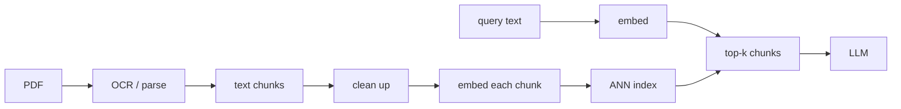
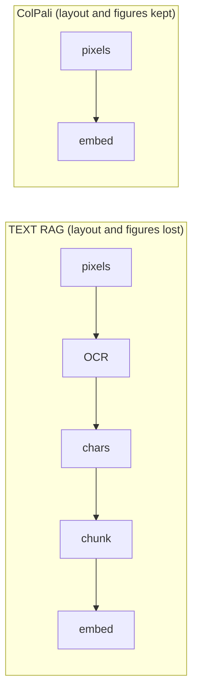

# Lecture 7: ColPali & Late Interaction — OCR-Free Page-Image Retrieval

> Last lecture ended on a wall: one image collapses to one global vector, so CLIP/SigLIP is a gist-matcher that finds "the slide with a bar chart" but fumbles "the slide where the Q3 bar is labeled 4.2% churn." This lecture is how you knock that wall down. ColPali (and its stronger sibling ColQwen2) keep *many* vectors per page — one per image patch, ColBERT-style — and score a query against them with **MaxSim late interaction** instead of a single dot product. The payoff is the headline technique of the week: you take a rendered PDF page, embed the *pixels*, and query it directly — no OCR, no layout parser, no chunker, no text-cleaning pipeline. Text, tables, figures, and layout all get captured because you never threw the picture away. After this lecture you will be able to explain the multi-vector representation and MaxSim scoring from first principles, stand up a working page-image retriever with Byaldi in about ten lines, reason about the storage and GPU costs that come with it, and state — precisely, not by vibes — when you'd still reach for boring text RAG instead.

**Prerequisites:** Lecture 6 (CLIP/SigLIP, the shared space, and the single-global-vector ceiling), Lecture 1 (the ViT patch encoder inside a VLM), Phase 3–4 RAG (embeddings, ANN indexes, top-k, cosine), and the fact that a PDF page can be rendered to pixels · **Reading time:** ~28 min · **Part of:** Multimodal & Specialized Modalities, Week 2

---

## The core idea (plain language)

Here is the pipeline you'd build for "chat with my PDFs" *before* you knew about ColPali:



Every arrow is a place things break. OCR mangles a rotated table. The parser flattens a two-column slide into word salad. The chunker splits a figure caption away from its figure. And a bar chart with no text layer at all? It contributes *nothing* — the information is in the pixels, and you threw the pixels away at step one.

ColPali deletes almost that entire top row. The idea, in one sentence:

> **Treat each page as an image, run it through a vision-language model to get one embedding per image patch, and keep all of them.** At query time, embed the query into a handful of token vectors too, and score a page by asking, for each query token, "how well does my single best-matching patch on this page cover you?" — then sum those best matches.

That's it. No OCR, no parsing, no chunking. You render the page to pixels (roughly 150 DPI is the community default), embed the pixels, and search. Because you kept a vector *per patch*, the representation still "knows" that there's a small region in the lower-right that says `4.2% churn` — that detail didn't get pooled away into a single gist vector the way it did with CLIP.

Two words carry all the weight and are worth pinning down now:

- **Multi-vector.** A page is not one 768-float vector. It's a *bag* of ~1,000 vectors (one per patch), each maybe 128-dimensional. Your "index" stores all of them.
- **Late interaction.** The query and the document don't get compared as two single points ("early" fusion into one score). Instead you compute *many* pairwise similarities and combine them *late*, with a MaxSim reduction. The name comes from ColBERT, the text-retrieval model this borrows from.

The whole lecture is unpacking those two words and their price tag.

---

## How it actually works (mechanism, from first principles)

### Step 1 — a page becomes a grid of patch vectors

You already met the ViT patch encoder in Lecture 1. A vision transformer chops an image into a grid of fixed-size patches (say 14×14 or 16×16 pixels each), turns each patch into an embedding, and runs attention so each patch "sees" the others. A VLM's vision tower does exactly this before handing tokens to the language model.

ColPali's trick is to *tap that stream*. Instead of pooling all the patch tokens into one vector (what CLIP does) or feeding them to an LLM (what a normal VLM does), it runs each patch token through a small linear projection down to a compact dimension — 128 in ColPali/ColQwen2 — and **keeps every one**.

So for a single page you get a matrix:

```
page P  →  [ p_1, p_2, p_3, ..., p_1030 ]     each p_i ∈ R^128
```

The count depends on resolution and the backbone. As a working number: **ColPali-style models emit on the order of 1,000 patch vectors per page** (the original ColPali used a fixed grid landing around 1,030 tokens; ColQwen2 uses dynamic resolution so the count varies with page size). Treat "~1,000 vectors × 128 dims per page" as your back-of-envelope figure and verify against your own model card — the exact numbers move between releases.

Crucially, each `p_i` is *spatially local*. `p_400` corresponds to a specific chunk of the page. The vector for the patch sitting on top of the text "4.2% churn" encodes *that content*, not the page's overall vibe. That locality is the entire reason detail survives.

### Step 2 — the query becomes a few token vectors

The query — plain text like `which slide mentions Q3 churn` — goes through the *same model's* text path. ColPali/ColQwen2 are built on a VLM (PaliGemma for ColPali, Qwen2-VL for ColQwen2), so they can embed text into the *same 128-d space* as the image patches. You get one vector per query token:

```
query Q →  [ q_1, q_2, ..., q_12 ]           each q_j ∈ R^128
```

A dozen-ish token vectors for a short query. These live in the same space as the patch vectors, so cosine/dot-product between a `q_j` and a `p_i` is meaningful — exactly the cross-modal alignment you learned in Lecture 6, just kept per-token instead of pooled.

### Step 3 — MaxSim late interaction: the scoring rule

Now the heart of it. How similar is query `Q` to page `P`? Not one dot product. Instead:

> **For each query token, find its single best-matching patch on the page (the max similarity). Then sum those maxima across all query tokens.**

In pseudo-math (dots are cosine or dot-product between unit vectors):

```
score(Q, P) = Σ_j   max_i   sim(q_j, p_i)
              └─┬─┘  └──┬──┘
          sum over    for query token j, the best
          query       patch on the whole page
          tokens
```

Read it as: *"Every word in my query, does the page have at least one spot that matches it well? Add up how well each word is covered."* A page scores high only if it has a good patch for `Q3` **and** a good patch for `churn` — not one patch that's a mediocre match for the blurred-together whole query.

Why `max` and not `sum` or `mean` over patches? Because a query token should be satisfied by **one** relevant region. "churn" is answered by the one patch sitting on the word "churn"; the other 999 patches (whitespace, the logo, the footer) are irrelevant and you don't want them diluting the signal. Max = "is it here *anywhere*?" Mean would drown the hit in a sea of blank patches.

### A worked numeric MaxSim

Toy example: query has 3 tokens, page has 4 patches. Similarity matrix (query rows × patch columns):

```
              patch_1  patch_2  patch_3  patch_4      row max
   "Q3"      [  0.11 ,   0.83 ,   0.09 ,   0.14  ]  →  0.83
   "churn"   [  0.07 ,   0.12 ,   0.79 ,   0.05  ]  →  0.79
   "rate"    [  0.22 ,   0.18 ,   0.31 ,   0.66  ]  →  0.66
                                                       ────
                                        score = 0.83 + 0.79 + 0.66 = 2.28
```

`"Q3"` found its home in patch_2, `"churn"` in patch_3, `"rate"` in patch_4. Three different regions, each token satisfied by its own best patch, summed to 2.28. Now score a distractor page whose best-matching patches for the same three tokens are 0.30, 0.21, 0.28 → score 0.79. The churn slide wins by a mile, and it won *because it had a specific patch for each specific query word* — a discrimination a single pooled vector literally cannot express.

Contrast with a single-vector (Lecture 6) score for the same pair: one cosine between one query vector and one page vector — a single number that has already blended "Q3", "churn", and "rate" into an average direction and blended the whole page into an average direction. Two averages, one dot product. That's why CLIP finds "a slide about revenue" but can't reliably pick "the slide that mentions Q3 churn": the discriminating detail was averaged out before scoring ever happened.

### Why this reads directly off the pixels — no OCR

Notice what never appeared in any of the above: a text string extracted from the page. The patch on top of "4.2% churn" produces a vector because the *model was trained so that image patches of text align with the text tokens that describe them*. Rendered text, table gridlines, axis labels, a legend, the spatial fact that a number sits inside a specific cell — all of it is just pixels going through the vision tower, and all of it can produce patch vectors a query token can hit. OCR was a lossy intermediate step that converted pixels→characters→embeddings and dropped layout on the floor. ColPali goes pixels→embeddings and keeps everything the encoder can see.



---

## Worked example

Let's index a 40-slide board deck and answer one question end to end, tracking the numbers.

**Indexing.** Render 40 pages at 150 DPI → 40 PNGs. Push each through ColQwen2. Say each page yields ~1,030 patch vectors × 128 dims.

- Vectors stored: `40 × 1,030 = 41,200` vectors.
- Raw storage at float16 (2 bytes): `41,200 × 128 × 2 ≈ 10.5 MB` for 40 pages. Roughly **260 KB per page** of multi-vector index (before any quantization).
- Compare a single-vector index: `40 × 1 × 768 × 2 ≈ 61 KB` for the whole deck. So multi-vector is **~170× larger** here. Hold that ratio; it's the central cost of the method.

On an A10/T4-class GPU this indexes in well under a minute. On a laptop CPU it works but crawls — which is why the lab tells you to index on Colab/Modal or keep the deck small.

**Query:** `what was Q3 net revenue retention`.

1. Tokenize → ~7 query token vectors in the 128-d space.
2. For each of the 40 pages, compute the `7 × 1,030` similarity matrix, take the row-maxes, sum → one score per page. That's `40 × 7 × 1,030 ≈ 288,000` dot products of 128-d vectors. Trivial on a GPU, still milliseconds on CPU for a deck this size.
3. Sort the 40 scores, take top-k = 3. Say pages 12, 27, 13 come back with scores 2.9, 2.4, 2.3.
4. Hand **the three page images** (not text!) plus the question to a VLM (reuse your Week 1 `litellm` client): *"Answer using these slides and cite the page number for each claim."*
5. VLM reads the pixels of slide 12, finds the NRR figure, answers: `"Q3 net revenue retention was 118% (slide 12)."` You return that plus the three thumbnails and the page-number citation.

No OCR ran. No chunker ran. The retriever found the right slide by pixel-level detail, and the VLM did the reading at answer time on just three pages. That "retrieve tightly, then let a VLM read the pixels" shape is Lecture 8's whole topic; here the point is that ColPali is what makes step 3 land on the *right* page.

### The Byaldi API you'll actually type

[Byaldi](https://github.com/AnswerDotAI/byaldi) is a thin wrapper (from Answer.AI) that hides the multi-vector index behind a RAGatouille-style API. The entire retriever:

```python
from pdf2image import convert_from_path
from byaldi import RAGMultiModalModel

# 1. render pages to images (poppler backend; ~150 DPI is the sweet spot)
convert_from_path("decks/board_q3.pdf", dpi=150,
                  output_folder="pages/", fmt="png", paths_only=True)

# 2. load a late-interaction model and index a folder of PDFs/images
model = RAGMultiModalModel.from_pretrained("vidore/colqwen2-v1.0")
model.index(
    input_path="decks/",              # folder of PDFs or page images
    index_name="decks",
    store_collection_with_index=True, # keep base64 page images IN the index
    overwrite=True,
)

# 3. search — returns page image + score + page number, ranked
results = model.search("what was Q3 net revenue retention", k=3)
for r in results:
    print(r.score, r.doc_id, r.page_num)   # r.base64 is the page image
```

Three things worth calling out because they bite people:

- `from_pretrained("vidore/colqwen2-v1.0")` pulls a ColQwen2 checkpoint from the ViDoRe org on Hugging Face. `vidore/colpali` (PaliGemma-based) also works; ColQwen2 generally scores higher on the ViDoRe benchmark and handles dynamic resolution better, so it's the sane 2025–2026 default. (Some ColQwen2 weights need a specific `transformers` version — read the model card's compatibility note before you fight a load error.)
- `store_collection_with_index=True` stashes the actual page images (base64) *inside* the index, so `search()` can hand you back the pixels to feed a VLM without you re-rendering. Convenient, but it inflates the index on disk — turn it off and keep your own `page_num → file` map if storage matters.
- `dpi=150` in `convert_from_path` is the community sweet spot: high enough that small slide text survives into patches, low enough that you're not wasting patches on noise. Below ~100 DPI fine print vanishes; much above 150 mostly buys you a bigger, slower index for little retrieval gain.

`convert_from_path` comes from `pdf2image`, which shells out to **poppler** — that's the one native dependency people forget (`brew install poppler` / `apt install poppler-utils`; on Windows, install poppler and put its `bin/` on PATH).

---

## How it shows up in production

**Storage is the tax you pay, up front and forever.** That ~170× blow-up from the worked example is not a rounding error. A 10,000-page corpus that would be a ~15 MB single-vector index becomes multiple gigabytes of multi-vector index. This is *the* deciding factor at scale. Mitigations exist and you'll want them past a few thousand pages: **binary/int8 quantization** of the 128-d vectors (the community routinely quantizes MaxSim vectors to int8 or even 1-bit with modest recall loss), and purpose-built multi-vector indexes — **PLAID** (from the ColBERT line), or engines that now speak MaxSim natively like **Vespa**, **Qdrant** (multi-vector support), and **Weaviate**. Byaldi's default in-memory index is perfect for a lab deck and *will not* hold a 100k-page corpus in RAM. Know that boundary before you promise a demo scales.

**Indexing wants a GPU; querying doesn't (much).** Encoding a page through a VLM vision tower is a real forward pass — batch it on a GPU or your indexing throughput is measured in pages-per-minute on CPU, not pages-per-second. Query-side, the query encode is one tiny forward pass and the MaxSim is cheap linear algebra, so *retrieval* latency is fine even on CPU for modest corpora. Practical consequence: index offline/batch on a rented GPU (Colab, Modal, a spot A10), persist the index, and serve queries from cheap hardware. Don't architect a system that re-indexes on the request path.

**Latency at answer time is dominated by the VLM, not the retriever.** MaxSim over a few thousand pages is milliseconds. The expensive part is step 4 — feeding retrieved *page images* to a VLM, where each page is a fat pile of image tokens (Lecture 2's tiling math). This is why the lab hammers **top-3, not top-20**: every extra retrieved page is another few hundred-to-thousand image tokens on the generation call. Retrieve tight.

**Recall quality is genuinely strong on visually-rich docs.** The ColPali paper's whole point is that on the **ViDoRe** benchmark (visual document retrieval — slides, figures, tables, scanned reports), late-interaction page-image retrieval beats strong OCR→text RAG pipelines, and with far less engineering. Treat "often beats OCR RAG on figure-heavy/slide/scanned docs" as the well-supported claim; treat any *specific* margin as something you measure on *your* corpus with recall@k, not a number to quote from memory.

**Debugging is different — and nicer.** When text RAG misses, you dig through OCR output and chunk boundaries to find where the pipeline mangled things. With ColPali there's no OCR output to inspect; instead you can *visualize the MaxSim heatmap* — overlay, per query token, which patch fired hottest, right on the page image. That's a genuinely good debugging surface: you literally see the model point at the region it matched. When retrieval is wrong you can often see *why* (it locked onto a logo, a header, a similar-looking chart).

**Multilingual and no-text-layer wins come for free.** Scanned 1990s reports, screenshots, handwritten-ish forms, non-Latin scripts where your OCR is weak — anything where "there is no clean text to extract" is exactly where OCR RAG falls apart and ColPali shrugs, because it never needed the text layer.

---

## Common misconceptions & failure modes

- **"ColPali does OCR internally / gives me the text."** No. It produces *vectors*, never characters. You get retrieval, not a transcript. If a downstream step needs the actual text ("copy the invoice number into a field"), you still run OCR or a VLM read on the retrieved page — ColPali just found the right page for you.

- **"It's just CLIP with more steps."** The difference is architectural, not cosmetic. CLIP pools to *one* vector and scores with *one* dot product (early fusion). ColPali keeps *~1,000* vectors and scores with MaxSim (late interaction). That's the exact difference between a gist-matcher and a detail-matcher, and it's why single-vector search loses on "which slide mentions X."

- **"Multi-vector storage is a minor detail."** It's the headline cost and it's why this isn't the universal default. ~170× the vectors of single-vector search. If you skip quantization and a real multi-vector index, you'll hit a RAM wall faster than you expect.

- **"More retrieved pages = better answers."** The opposite past ~3. Extra pages mostly add image tokens (cost + latency) and dilute the VLM's attention with irrelevant slides. Late interaction is precise enough that top-3 is usually plenty; if it isn't, your DPI or model choice is the problem, not k.

- **DPI set too low.** Render at 72 DPI to save space and the 8-pt footnote never becomes a legible patch — you can't retrieve on text the encoder couldn't resolve. 150 DPI is the default for a reason.

- **Forgetting poppler.** `pdf2image` fails cryptically without the poppler binary on PATH. It's the #1 "why won't this run" for this lab.

- **Assuming exact keyword/BM25 behavior.** ColPali matches *semantically and visually*, not by literal substring. If your users need "find the doc containing the exact string `INV-2024-8842`," a lexical index (BM25) still wins — MaxSim is not a substring search. Consider hybrid.

- **Version-mismatch load errors.** ColQwen2 checkpoints can be picky about `transformers`/`colpali-engine` versions. A confusing load traceback is almost always this — check the model card's stated versions first.

---

## Rules of thumb / cheat sheet

- **Reach for ColPali when:** slide decks, scanned reports, figure/table/chart-heavy PDFs, screenshots, multilingual or no-text-layer docs, or any corpus where your OCR pipeline is fragile. If the answer lives in the *layout or the picture*, this is your tool.
- **Stick with text RAG when:** the corpus is huge (multi-vector storage becomes prohibitive), the docs are essentially pure clean text (Markdown, code, articles — no layout to preserve), you need exact keyword/BM25 matching, or you have no GPU for indexing and no budget to rent one.
- **Default model:** `vidore/colqwen2-v1.0` (stronger than `vidore/colpali` on ViDoRe; dynamic resolution). Check the card's `transformers` version pin.
- **Render at ~150 DPI.** Lower loses fine text; higher just bloats the index.
- **Retrieve top-3.** Each extra page is image tokens on the VLM call.
- **Storage budget:** ballpark **~1,000 vectors × 128-d per page**; ~170× a single-vector index. Past a few thousand pages, quantize (int8/binary) and use a MaxSim-native store (Vespa/Qdrant/Weaviate) or PLAID — not Byaldi's in-memory default.
- **Index on a GPU, offline. Query on CPU, online.** Never re-index on the request path.
- **`store_collection_with_index=True`** for convenience in the lab (gives you page images back from `search`); turn it off and keep your own page map when disk matters.
- **Need exact strings or a giant corpus? Go hybrid:** BM25/text RAG for lexical + huge scale, ColPali for the visual/layout questions. Route by query type.

---

## Connect to the lab

This lecture is the retrieval engine behind **Week 2, Build A — "Chat with your slide decks."** In the lab you'll `convert_from_path(..., dpi=150)` your real decks to page images, `RAGMultiModalModel.from_pretrained("vidore/colqwen2-v1.0").index(...)` them, and `model.search(query, k=3)` to pull the right pages — exactly the API in this lecture. Lecture 8 then covers what you *do* with those retrieved pages (feed the images to a VLM, cite page numbers + bboxes). If your laptop has no GPU, do the `index()` step in a free Colab/Modal notebook, download the persisted index, and query locally — indexing is the only GPU-hungry part.

---

## Going deeper (optional)

- **ColPali: Efficient Document Retrieval with Vision Language Models** — the source paper (Faysse et al., 2024). Read it for the MaxSim intuition and the ViDoRe benchmark design. Search: `ColPali Efficient Document Retrieval Vision Language Models arXiv`.
- **`vidore/colpali` and `vidore/colqwen2-v1.0` model cards** on Hugging Face (`huggingface.co` — the ViDoRe org). Canonical for weights, resolution/token counts, and the `transformers`/`colpali-engine` version pins. Search: `vidore colqwen2 huggingface`.
- **Byaldi README** — the wrapper you use in the lab (Answer.AI). Root: `github.com/AnswerDotAI/byaldi`. Read the `index`/`search`/`store_collection_with_index` docs and the poppler note.
- **ColBERT & PLAID** — the text-retrieval ancestors of late interaction and its efficient index. Search: `ColBERT late interaction Stanford`, `PLAID ColBERT index`.
- **ViDoRe benchmark & leaderboard** — how visual document retrieval is measured. Search: `ViDoRe benchmark visual document retrieval leaderboard`.
- **Multi-vector serving in practice** — search: `Vespa ColPali`, `Qdrant multivector MaxSim`, `Weaviate late interaction` for how to hold a real multi-vector index at scale, and `ColPali binary quantization` for shrinking it.

---

## Check yourself

1. In one sentence each, define **multi-vector representation** and **late interaction**, and say which part of MaxSim (the `max` or the `sum`) makes an irrelevant blank patch harmless.
2. A page yields ~1,000 patch vectors at 128-d (float16) and your single-vector baseline is one 768-d vector. Roughly how many times larger is the ColPali index per page, and why is that the method's central production cost?
3. Walk through why ColPali can answer "which slide mentions Q3 churn" when a CLIP single-vector index reliably can't — point to the exact step where CLIP loses the information.
4. Name three document/corpus situations where you'd deliberately choose **text RAG over ColPali**, and give the reason for each.
5. Why does indexing want a GPU but querying doesn't, and what architectural rule follows from that asymmetry?
6. A stakeholder needs "find the contract containing the exact string `INV-2024-8842`." Is ColPali the right tool? What would you do instead or in addition?

### Answer key

1. **Multi-vector:** a page (or query) is represented as a *bag* of many vectors (one per image patch / per token), not a single pooled vector. **Late interaction:** query and document are compared as many pairwise token-patch similarities combined *late* (via MaxSim), rather than fused early into one score. The **`max`** is what makes blank patches harmless — each query token takes only its single best-matching patch, so the ~999 irrelevant patches never enter the score (a `mean` would dilute the hit).

2. Per page: multi-vector ≈ `1,000 × 128 × 2 ≈ 256 KB`; single-vector ≈ `1 × 768 × 2 ≈ 1.5 KB`. That's roughly **~170×** larger. It's the central cost because storage/RAM is what stops multi-vector search from scaling to huge corpora — driving the need for quantization and MaxSim-native indexes.

3. CLIP encodes the whole page into **one** pooled vector and the whole query into one vector, then scores with a single dot product — the phrase "Q3 churn" and the entire page's content are each *averaged into one direction* at the pooling step, so the specific detail is gone before scoring. ColPali keeps a **per-patch** vector, so the patch sitting on the text "4.2% churn" retains that local content, and MaxSim lets the query token "churn" find that exact patch. CLIP loses the information **at the pooling step** (many patch tokens → one vector); ColPali never pools.

4. (a) **Huge corpora** — multi-vector storage becomes prohibitive (the ~170× tax); text RAG's compact index scales better. (b) **Pure clean-text docs** (Markdown, articles, code) — there's no layout/figure information to preserve, so the extra cost buys nothing. (c) **Exact keyword / BM25 needs** — MaxSim matches semantically/visually, not by literal substring, so lexical search wins for exact-string lookup. (Also acceptable: **no GPU / no budget** for indexing.)

5. Indexing runs every page through a VLM vision tower — a real forward pass per page — which is GPU-bound; querying is one tiny query-encode plus cheap MaxSim linear algebra. The rule: **index offline/batch on a GPU and persist the index; serve queries from cheap CPU hardware — never re-index on the request path.**

6. Not by itself — ColPali matches semantically/visually and won't reliably do exact-substring lookup. Use a **lexical index (BM25) or a plain text search** for the exact string, and optionally run **hybrid**: BM25 for exact-string/keyword queries, ColPali for the visual/layout questions, routing by query type.
