# Lecture 8: Multimodal RAG — Three Patterns, Tight Retrieval, and Grounded VLM Answers

> You already know how to build RAG: chunk, embed, retrieve, rerank, stuff into a prompt, generate with citations. That whole discipline still holds here — but the moment the corpus is slide decks, scanned reports, and figure-heavy PDFs, a single decision quietly dominates your bill and your latency: *how many pages you retrieve*. In text RAG a stray top-20 costs fractions of a cent. In multimodal RAG every retrieved page is a fat block of image tokens fed to a VLM, so top-k is a direct dollar-and-seconds lever, not a tuning afterthought. After this lecture you can pick between the three multimodal-RAG architectures on purpose, wire ColPali page-image retrieval into a grounded, cited VLM answer, retrieve *tightly* on purpose, measure recall@k against a labeled gold set while logging per-query image-token cost, and run a defensible A/B against an OCR→text RAG baseline to decide which one actually wins on *your* visual questions.

**Prerequisites:** Phase 4 RAG (chunking, retrieval, reranking, citations, grounding), multimodal embeddings & ColPali intuition (this week's earlier lectures), VLM image-token cost & the bbox pattern (Week 1) · **Reading time:** ~28 min · **Part of:** Phase 12 Week 2

---

## The core idea (plain language)

Retrieval-augmented generation has always been two halves bolted together: a **retrieval substrate** that finds the relevant material, and a **generation layer** that reads that material and writes a grounded, cited answer. Phase 4 drilled the generation half into you — answer only from retrieved context, cite the source per claim, refuse when the context doesn't support the question. That half does not change here. Read that sentence again, because it is the load-bearing idea of the whole lecture: **only the retrieval substrate changed. The discipline is identical.**

What changed is that your documents are *visual*. A slide with a bar chart, a scanned financial table, a diagram with callout labels — the meaning lives in the pixels and the layout, not just in words you can extract. So the question becomes: how do you turn a visual corpus into something retrievable, and what do you hand the generator?

There are exactly three architectural patterns, and they differ in *what you embed* and *what the generator reads*:

- **(a) Caption → text-embed → text RAG.** Run every image through a VLM once to produce a text description, embed that caption, and now you have a plain text-RAG corpus. Cheap, reuses your entire existing text stack, but **you retrieve over a lossy proxy** — whatever the captioner missed, paraphrased, or hallucinated is permanently baked into your index.
- **(b) Multimodal single-vector embedding (CLIP/SigLIP).** Embed the raw image into a shared image-text vector space and retrieve by cosine similarity to the query text. No captioning step, no lossy text layer. But one global vector per image is a blunt instrument — great for "find the photo of a cat," weak for "which slide mentions Q3 churn," because fine-grained text and layout get averaged away.
- **(c) ColPali page-image retrieval → VLM answer.** Treat each document *page* as an image, embed it with a late-interaction multi-vector model (ColPali/ColQwen), retrieve the top pages, and **feed the actual retrieved page images to a VLM** to answer. No OCR pipeline, no captioning, layout preserved end to end. This is the strongest pattern for visually rich documents — and the most expensive per query, which is exactly why retrieval discipline matters.

The unifying tension: patterns (a) and (b) collapse rich visual content into cheap text-shaped vectors and pay for it in lost fidelity; pattern (c) preserves everything but makes each retrieved unit an expensive VLM input. The engineering job is choosing the right pattern and then, for (c) especially, retrieving *tightly*.

---

## How it actually works (mechanism, from first principles)

### The three patterns, side by side

```mermaid
flowchart TD
    subgraph A["(a) Caption to text RAG"]
        a1[image] -->|VLM caption| a2["Bar chart: revenue by quarter, Q3 highest at $4.2M"]
        a2 -->|text-embed| a3["text vector"] --> a4["standard text RAG index"]
        a5["query: Q3 revenue?"] --> a6["retrieve caption"] --> a7["LLM reads CAPTION TEXT, never sees pixels"] --> a8[answer]
    end
    subgraph B["(b) Multimodal single-vector CLIP/SigLIP"]
        b1[image] -->|image encoder| b2["one 768-d vector"] --> b3[vector index]
        b4[query] -->|text encoder| b5["one 768-d vector"] --> b6["cosine top-k"]
        b6 --> b7["feed retrieved images to a VLM to answer"]
    end
    subgraph C["(c) ColPali page-image retrieval"]
        c1[page-image] -->|ColPali| c2["~1030 patch vectors"] --> c3[multi-vector index]
        c4[query] -->|ColPali text| c5["~15 token vectors"]
        c5 --> c6["score = MaxSim query tokens vs page patches, late interaction"]
        c6 --> c7["retrieve top-3 PAGE IMAGES"] --> c8["VLM reads the actual pages"] --> c9["cited answer"]
    end
```



The critical structural difference in (c): a page is not one vector, it's ~1000 patch vectors, and scoring is **MaxSim late interaction** — for each query token, take its single best-matching page patch, then sum those maxima. That lets a query token like "churn" light up the exact region of the page where "churn" appears, text *and* surrounding layout, without any OCR. That's why ColPali beats a single CLIP vector on document search: it retains per-region detail instead of averaging the whole page into one blurry vector.

### Why top-k is a dollar lever here, and not in text RAG

This is the number that should reshape your instincts. Recall from Week 1: a VLM doesn't "see" an image, it consumes it as a block of tokens. A single rendered document page at typical resolution is roughly **1,000–2,000 image tokens** depending on the provider's tiling scheme (treat this as an approximate planning figure — measure your own). Now compare:

| | text RAG chunk | multimodal RAG page |
|---|---|---|
| tokens per retrieved unit | ~200–500 text tokens | ~1,000–2,000 image tokens |
| cost of top-20 vs top-3 | pennies either way | 17 extra fat image blocks per query |

Worked arithmetic. Say a page is ~1,300 image tokens and your VLM input costs ~$0.30 per million tokens (a mid-tier vision model; use your own rate).

- **top-3:** 3 × 1,300 = 3,900 image tokens ≈ **$0.0012/query** on retrieved context.
- **top-20:** 20 × 1,300 = 26,000 image tokens ≈ **$0.0078/query** — 6.7× more, on retrieved context alone.

At 100k queries/month that's the difference between ~$120 and ~$780 *just for the retrieved pages*, before you count the prompt, the output, or the latency of a VLM chewing through 26k tokens of images. And here's the kicker: those extra 17 pages are almost always **noise** that pushes the true answer page deeper into a long context, where VLMs are worse at attending to it. In multimodal RAG, retrieving more usually makes the answer both *more expensive and worse*. Tight retrieval (top-3) is not a cost hack you bolt on later; it's the default posture.

### The generation, citation, and grounding layer (unchanged discipline)

Once ColPali hands you the top-3 page images, the generation layer is pure Phase 4, re-pointed at pixels:

1. **Answer only from retrieved pages.** Same instruction you always give: ground every claim in the provided context, refuse or say "not found in the decks" when it isn't there. The context is now three page images instead of three text chunks.
2. **Cite the source page per claim.** In text RAG you cited chunk IDs; here you cite **page numbers**. Pass each retrieved page's source (doc + page number) alongside its image, and instruct the VLM: "For every claim, cite the page number it came from, in `[deck.pdf p.7]` form." A claim without a citable page is a hallucination flag.
3. **Return the top-3 page thumbnails.** The user's trust comes from *seeing* the source. Ship the three retrieved page images (downscaled thumbnails) with the answer so a human can verify at a glance.
4. **Emit an approximate bbox on the cited page.** Reuse the **Week 1 bbox pattern**: ask the VLM to return a normalized `[x, y, w, h]` box on the cited page marking *where* the answer lives, so your UI can draw a highlight rectangle on the thumbnail. Same caveat as Week 1, doubly so here: **VLM bounding boxes drift.** They're good enough to point a human's eye at the right third of a slide, never precise enough to auto-crop. Treat the highlight as "look roughly here," not "this is the exact cell."

Everything about *how you prompt for grounding, how you handle "not found," how you structure the cited output* is the Phase 4 muscle you already have. The only new thing is that the substrate is page images and the citation unit is a page number.

---

## Worked example

A user asks the SlideChat app: **"What was our Q3 churn rate?"** across a 3-deck corpus (~90 pages indexed).

**Retrieve (ColPali, top-3).** ColPali embeds the query into ~6 token vectors, scores every page's ~1,030 patch vectors via MaxSim, and returns:

| rank | page | MaxSim score |
|---|---|---|
| 1 | `q3-review.pdf` p.12 | 18.4 |
| 2 | `q3-review.pdf` p.11 | 15.9 |
| 3 | `annual.pdf` p.34 | 14.2 |

The top page is the churn KPI slide; the score gap (18.4 vs 15.9) is a healthy signal the retriever is confident.

**Cost check.** Three pages × ~1,300 image tokens ≈ 3,900 image tokens of context. Plus a ~250-token system/grounding prompt and ~150 tokens of output. Log this per query: `image_tokens=3900, prompt_tokens=250, output_tokens=150`. At ~$0.30/M input that's ~$0.0013 retrieved-context cost for this query. Had you retrieved top-10, you'd log ~13,000 image tokens and ~$0.0043 — for an answer that lives entirely on page 12.

**Generate (VLM reads the 3 page images).** Prompt shape:

```
System: Answer ONLY from the provided slide pages. Cite the page for every
claim as [file p.N]. If the pages don't contain the answer, say so. Also
return a normalized bbox [x,y,w,h] on the cited page marking the answer.

User: [image: q3-review.pdf p.12] [image: q3-review.pdf p.11]
      [image: annual.pdf p.34]
      Question: What was our Q3 churn rate?
```

VLM output:

```json
{
  "answer": "Q3 churn rate was 4.7% [q3-review.pdf p.12].",
  "citations": [{"file": "q3-review.pdf", "page": 12,
                 "bbox": [0.62, 0.28, 0.20, 0.09]}],
  "thumbnails": ["q3-review.pdf#12", "q3-review.pdf#11", "annual.pdf#34"]
}
```

Your UI renders "4.7%", a `[p.12]` chip, three thumbnails, and a highlight rectangle roughly over the churn number on the p.12 thumbnail. The bbox is a few percent off the actual text — fine, it points the eye. If the VLM had instead written "4.7%" with *no* citable page, you'd surface it as unverified rather than trust it.

**Measuring recall@k.** You built a small gold set of `query → correct_page` labels (say 30 visual questions, each hand-labeled with the page that actually contains the answer). Recall@3 = (queries whose gold page appeared in the retrieved top-3) / (total queries). If 27/30 gold pages showed up in top-3, **recall@3 = 0.90**. You also log per-query image-token cost so you can plot the recall-vs-cost curve: maybe recall@1 = 0.73, recall@3 = 0.90, recall@5 = 0.93. That jump from 3→5 buys 3 points of recall at ~67% more image-token cost per query — usually not worth it. The gold set is what turns "top-3 feels right" into "top-3 is the knee of the curve for our data."

---

## How it shows up in production

- **The top-k bill is real and silent.** A team ships with top-10 "to be safe," latency creeps to 6s/query because the VLM reads 13k image tokens, and the monthly vision bill is 3× the estimate. Dropping to top-3 cuts cost and latency *and* often improves answer quality (less distractor context). This is the single highest-leverage knob in the whole app.
- **Latency is dominated by image tokens, not the model's cleverness.** Time-to-first-token on a VLM scales with input tokens. Three pages ≈ tolerable; ten pages ≈ a spinner the user resents. Retrieve tightly for latency as much as for cost.
- **Caption-RAG's lossiness surfaces as confident wrong answers.** If you chose pattern (a) and the captioner described a chart as "revenue trending up" but omitted the actual Q3 number, the retriever can't find what isn't in the caption, and the generator answers from a proxy that never had the fact. The failure is invisible until a user asks the precise question. This is why (a) is a reasonable *cheap starting point* but a liability for precise numeric/visual questions.
- **Grounding discipline is the same code you already wrote.** Teams that treated Phase 4 grounding as reusable — the "answer only from context, cite per claim, refuse otherwise" prompt scaffold — port it in an afternoon. Teams that hand-rolled it per project rebuild it and reintroduce hallucinations.
- **Bbox drift generates support tickets if you oversell it.** If your UI draws a tight rectangle and implies pixel precision, users notice when it's off and file bugs. Frame it as a soft highlight ("we found this around here") and it's a trust feature instead.
- **ColPali indexing wants a GPU; querying is cheap.** Indexing 90 pages produces ~90k patch vectors and is GPU-friendly work; do it offline/batch (a free Colab/Modal run is fine for a demo corpus). Query-time MaxSim over that index is cheap and CPU-tolerable. Don't conflate the two costs. Multi-vector indexes are also *fat on disk* — ~1,000 vectors × 128 dims per page is roughly 100–250 KB/page depending on quantization, so a 10k-page corpus is a real storage line item, not a rounding error.

---

## Common misconceptions & failure modes

- **"Multimodal RAG is a new discipline."** No. It's Phase 4 RAG with a different retrieval substrate. If you find yourself reinventing citation and grounding logic, stop — port it.
- **"More retrieved context = better answers."** True-ish for cheap text chunks, false for fat image pages. Extra pages add cost, latency, and distractor noise that *degrades* VLM answers. Tight beats wide here.
- **"CLIP single-vector search is good enough for documents."** It's good for whole-image semantic match (photos, thumbnails), weak for fine-grained document questions where one global vector averages away the specific number/label you need. That's exactly the gap ColPali's late interaction fills.
- **"Captioning is lossless if the caption is detailed."** No caption captures a dense table or a multi-series chart faithfully, and any captioner error is permanent in your index. Caption-RAG trades fidelity for cheapness — know which you're buying.
- **"VLM bounding boxes are precise coordinates."** They drift by a few percent, sometimes more on dense pages. Highlight, never auto-crop. (Same lesson as Week 1, and it does not improve just because the page came from a retriever.)
- **"ColPali always beats OCR→text RAG."** Not always — that's *why you A/B*. For text-dense, layout-simple documents (contracts, plain reports), OCR→text RAG can match or beat ColPali at a fraction of the query cost. ColPali's edge is charts/tables/figures/layout. Decide with data, not allegiance.
- **"Recall@k without a gold set."** Eyeballing "seems to find the right page" is not a metric. Without a labeled query→page set you can't tell whether top-3 is enough or whether your A/B winner actually won.

---

## The A/B: ColPali page-image RAG vs OCR→text RAG on visual questions

The honest way to choose pattern (c) over a cheaper baseline is to run both on the questions that matter and let the numbers decide.

**Setup.** Build a gold set of **visual** questions — ones whose answers live in charts, tables, and figures ("what's the tallest bar," "what's the value in the Q3/EMEA cell," "what does the arrow point to"), because that's where the two approaches diverge. Label each with the correct source page. Two systems:

- **Baseline:** OCR every page (PaddleOCR/Textract) → chunk → text-embed → text RAG → LLM answers from retrieved text.
- **Candidate:** ColPali page-image retrieval → VLM answers from retrieved page images.

**Metrics to record per system:**

- **Recall@3** against the query→page gold set (did retrieval surface the right page?).
- **Answer accuracy** on the gold answers (exact/normalized match, or an LLM judge from Phase 7).
- **Per-query cost** — for ColPali, the image-token cost you're already logging; for the OCR baseline, indexing OCR cost (amortized) + cheap text-token query cost.
- **p50/p95 latency.**

**Deciding the winner.** The OCR baseline will usually be *cheaper per query*. So the question is: **does ColPali buy enough accuracy on visual questions to justify the higher per-query image-token cost?** Read the table like this:

- If ColPali's answer accuracy on chart/table/figure questions is meaningfully higher (the common result on visually rich decks) and the cost delta is acceptable for your volume → ship ColPali.
- If OCR→text RAG matches ColPali's accuracy (common for text-dense, simple-layout docs) → ship the baseline; it's cheaper and simpler.
- Watch the split: many products end up **routing** — cheap OCR RAG for text-heavy queries, ColPali for the visual ones — precisely because the A/B shows each wins on a different question class.

The point of the A/B isn't to crown a universal winner; it's to know *for your corpus and your question mix* whether the image-token premium pays for itself.

---

## Rules of thumb / cheat sheet

- **Default pattern for slide decks / scanned reports / figure-heavy PDFs:** ColPali page-image RAG (c).
- **Default pattern when you already have a great text stack and questions are mostly textual:** OCR→text RAG or caption-RAG (a) — cheaper, simpler; A/B before committing to (c).
- **Default top-k: 3.** Every page is ~1,000–2,000 image tokens (measure yours). Only raise k if recall@3 on your gold set is provably too low, and re-check cost.
- **Grounding prompt = Phase 4, verbatim.** Answer only from retrieved pages, cite the page per claim, refuse when absent.
- **Always return: answer + per-claim page citation + top-3 thumbnails + approximate bbox highlight.** Frame the bbox as a soft highlight.
- **Log per query: `image_tokens`, top-k, retrieval scores, latency.** You can't optimize cost you don't measure.
- **Build a query→page gold set (20–40 items) before tuning anything.** Report recall@k; find the knee of the recall-vs-cost curve.
- **Index on GPU offline; query cheaply.** Don't let indexing cost scare you off ColPali — it's a batch job. Budget disk for the multi-vector index.
- (All dollar/token figures above are approximate planning numbers — measure your provider's actual tiling and rates.)

---

## Connect to the lab

This lecture is the theory behind **Week 2, Build A ("Chat with your slide decks")**. In the lab you index 2–3 real PDF decks with Byaldi/ColQwen, retrieve **top-3** page images, and answer with your Week 1 `litellm` VLM client — instructing it to cite page numbers and emit a bbox for the highlight. The Definition of Done items you're now equipped to hit: *retrieve top-3 (not more) and record per-query image-token cost*, *return correct page-number citations plus top-3 thumbnails*, and the milestone's *A/B against an OCR→text RAG baseline on visual questions with recall@3 measured against a labeled query→page gold set*.

---

## Going deeper (optional)

- **ColPali: Efficient Document Retrieval with Vision Language Models** — the paper introducing page-image late-interaction retrieval. Search: `ColPali paper arXiv`. Read for the MaxSim-over-page-patches intuition, not the training details.
- **`vidore/colpali` and `vidore/colqwen2` model cards** on Hugging Face — the production models you'll actually load. Search: `vidore colqwen2 Hugging Face`.
- **Byaldi** (the friendly ColPali wrapper you use in the lab) — GitHub README. Search: `Byaldi GitHub`.
- **ColBERT** — the original late-interaction retrieval work that ColPali adapts to images; worth skimming for where MaxSim comes from. Search: `ColBERT late interaction`.
- **ViDoRe (Visual Document Retrieval) benchmark** — the eval suite ColPali reports against; useful for how visual-document retrieval is measured. Search: `ViDoRe benchmark`.
- **Phase 4 RAG lectures (this study plan)** — re-read the citation/grounding/refusal sections; you are reusing them wholesale.
- **CLIP / SigLIP / OpenCLIP model cards** — for pattern (b) intuition and its single-vector limits. Search: `SigLIP Hugging Face`, `OpenCLIP GitHub`.
- **Provider vision/image-token docs** (root domains you can trust): `docs.anthropic.com`, `platform.openai.com/docs`, and Gemini's docs — for the exact tiling and token-counting scheme so your cost logging is accurate rather than estimated.

---

## Check yourself

1. Why is top-k a direct cost-and-latency lever in ColPali multimodal RAG, when it's nearly free to raise in text RAG? Put rough numbers on the difference.
2. Name the three multimodal-RAG patterns and, in one phrase each, the fidelity-vs-cost trade they make.
3. A colleague says "multimodal RAG needs a whole new generation and citation layer." Correct them precisely — what carries over from Phase 4 and what actually changed?
4. Why does a single CLIP/SigLIP vector lose to ColPali on "which slide mentions Q3 churn," and what mechanism gives ColPali the edge?
5. You want to justify shipping ColPali over an OCR→text RAG baseline. What do you measure, on what data, and what result would make you ship the *baseline* instead?
6. You get a VLM answer with a bbox highlight that's a few percent off the actual number. Is that a bug? How should the UI present it?

### Answer key

1. Each retrieved unit in multimodal RAG is a full page image ≈ 1,000–2,000 image tokens fed to a VLM, versus ~200–500 text tokens for a text chunk. Top-3 vs top-20 is ~3,900 vs ~26,000 image tokens per query — roughly 6–7× the retrieved-context cost, plus proportional latency, plus distractor noise that degrades the answer. In text RAG the same jump costs fractions of a cent, so top-k is a tuning detail there and a primary cost driver here.
2. **(a) Caption → text RAG:** cheapest, reuses the text stack, but retrieves over a lossy text proxy (captioner errors baked in). **(b) CLIP/SigLIP single-vector:** no captioning, but one global vector per image loses fine-grained detail. **(c) ColPali page-image → VLM:** highest fidelity (layout/text/figures preserved, no OCR), highest per-query cost.
3. Only the *retrieval substrate* changed (from text chunks to page images, citing page numbers instead of chunk IDs). The generation, citation, grounding, and refusal discipline is identical to Phase 4 — answer only from retrieved context, cite per claim, refuse when the context doesn't support the question. You port that scaffold, you don't rewrite it.
4. A single vector averages the entire page into one point, so a specific token/region ("churn") gets washed out by everything else on the slide. ColPali keeps ~1,000 per-patch vectors and scores with MaxSim late interaction — the query token "churn" matches its single best page patch, letting a specific region light up without OCR. That per-region retention is the edge on fine-grained document questions.
5. Build a gold set of *visual* questions (charts/tables/figures) each labeled with the correct page. Run both systems; measure recall@3, answer accuracy (exact/normalized or an LLM judge), per-query cost, and p50/p95 latency. If OCR→text RAG matches ColPali's accuracy on those questions (common for text-dense, simple-layout docs) at lower cost, ship the baseline — the image-token premium isn't buying anything.
6. Not a bug — VLM bounding boxes are inherently approximate and drift a few percent (the Week 1 caveat, unchanged). Present it as a soft highlight ("we found this around here") pointing the user's eye at the right region, never as a pixel-precise crop. Overselling precision generates support tickets; framing it as a soft highlight makes it a trust feature.
