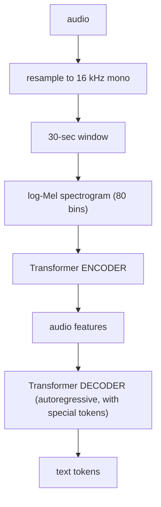
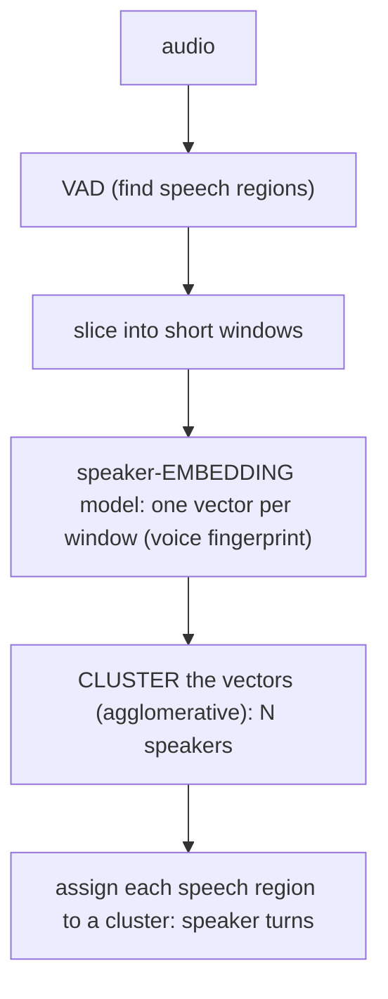

# Lecture 9: Speech-to-Text — Whisper, faster-whisper, VAD Gating, Timestamps, and Diarization

> Speech is the input half of every voice product, and it is where most voice agents quietly die — not because transcription is inaccurate, but because the model *invents words that were never spoken*. Whisper is a phenomenal transcriber that was trained to always produce a transcript, which means point it at silence, breathing, or background music and it will confidently hand you "Thank you for watching!" or the same phrase repeated forty times. After this lecture you can stand up a production STT pipeline that transcribes fast and cheap on CPU, gate out non-speech so hallucinations never reach your LLM, pull per-word start/end timestamps for subtitles and barge-in, and label *who spoke when* on a multi-speaker recording — and reason about the cost, latency, and accuracy of every knob you turn.

**Prerequisites:** basic audio concepts (sample rate, mono/stereo, PCM), Python, comfort with model quantization at the "int8 is smaller and faster, slightly less accurate" level · **Reading time:** ~30 min · **Part of:** Phase 12 Week 2

---

## The core idea (plain language)

Automatic speech recognition (ASR / STT) turns an audio waveform into text. In 2022 OpenAI released **Whisper**, an encoder-decoder Transformer trained on 680,000 hours of multilingual audio scraped from the web, and it changed the game: robust to accents, noise, and domain shift, multilingual, and free to run locally. It is still the accuracy workhorse in 2025-2026, and almost everything below is Whisper wearing a different hat.

But "trained on the whole web" hides a trap. Whisper is a **sequence-to-sequence model that always decodes a transcript**. It was trained on 30-second chunks that (mostly) contained speech, so it has never really learned "this chunk contains nothing to transcribe." Feed it 5 seconds of silence and it does not return an empty string — it decodes the most probable text given its training distribution, which is often a YouTube outro ("Thank you for watching", "Please subscribe"), a caption artifact, or a phrase looped until the chunk is full. This is **hallucination**, and it is the single most important reliability fact in this lecture. The fix is a separate, cheap model called a **Voice Activity Detector (VAD)** that decides "is there speech here at all?" and only lets speech reach Whisper. VAD is not optional. It is mandatory.

Around the core model sit three tools you will actually reach for:

- **Whisper (OpenAI)** — the reference implementation and the accuracy ceiling. Also available as a hosted API. Slower locally; the thing everyone else re-implements.
- **faster-whisper** — a reimplementation on **CTranslate2** (a fast inference engine) that runs the *same Whisper weights* 4× faster and with far less memory, with **int8** quantization that makes even `large-v3` usable on a CPU. This is your default local engine.
- **WhisperX** — a pipeline built on faster-whisper that adds **forced alignment** (accurate per-word timestamps via a separate phoneme model) and **diarization** (who spoke when, via pyannote). Reach for it when you need word-level timing or speaker labels.

The rest of the lecture is how these mechanisms work, how they bite in production, and the knobs (`compute_type`, `beam_size`, `vad_filter`, `word_timestamps`, `language`, chunking) that decide your cost/latency/accuracy.

---

## How it actually works (mechanism, from first principles)

### Whisper: log-Mel in, tokens out

Whisper does not see a waveform directly. The pipeline is:



Two facts drive everything downstream:

1. **Everything is chopped into 30-second windows.** Whisper's encoder has a fixed input length of 30 seconds of audio (a 3000-frame log-Mel). Audio shorter than 30s is padded with silence; audio longer is processed in successive windows. That fixed window is why **long-audio chunking** is a real concern (below) and why **padding silence can itself trigger hallucination** at the tail of a clip.

2. **The decoder is prompted with special tokens** — a task token (`<|transcribe|>` vs `<|translate|>`), a language token (`<|en|>`), and timestamp tokens. Crucially the decoder was trained to *always* emit text tokens; there is no strong "emit nothing" behavior. Given ambiguous or empty audio it falls back to high-probability text from training — hence hallucination.

The decoder is autoregressive: it predicts one token, feeds it back, predicts the next. That means **decoding cost scales with output length**, and greedy vs beam search (below) is a real speed/quality lever.

### faster-whisper: same weights, different engine

faster-whisper runs the identical Whisper weights through **CTranslate2**, an inference engine that fuses operations, uses better memory layout, and supports **quantization**. Quantization stores weights in fewer bits:

- `float16` — 16-bit floats. Default on GPU. ~2× smaller than float32, negligible accuracy loss.
- `int8` — 8-bit integers. ~4× smaller than float32. Runs well on **CPU**. Small accuracy cost (usually a fraction of a WER point on clean audio), large speed and memory win.
- `int8_float16` — int8 weights with float16 compute on GPU: the memory of int8 with the numerical stability of float16. A common GPU default.

Rule-of-thumb model sizes and rough footprints (approximate — verify on your hardware):

| Model | Params | ~int8 RAM | Relative accuracy | Relative speed |
|---|---|---|---|---|
| `tiny` / `tiny.en` | 39M | ~150 MB | lowest | fastest |
| `base` / `base.en` | 74M | ~250 MB | low | very fast |
| `small` / `small.en` | 244M | ~800 MB | good | fast |
| `medium` / `medium.en` | 769M | ~2 GB | high | moderate |
| `large-v3` | 1550M | ~3 GB | highest | slowest |

The `.en` variants are English-only and beat the multilingual model of the same size **on English**. If your product is English-only, `base.en` or `small.en` is a strictly better default than `base`/`small`.

### VAD: the mandatory gate

A **Voice Activity Detector** is a tiny, fast classifier that scans the audio and outputs speech/no-speech segments with timestamps. **Silero VAD** is the standard: a ~1-2 MB model that runs in real time on a CPU thread, far cheaper than Whisper. faster-whisper bundles it — you turn it on with one flag:

```python
from faster_whisper import WhisperModel

model = WhisperModel("base.en", device="cpu", compute_type="int8")

segments, info = model.transcribe(
    "meeting.wav",
    vad_filter=True,                 # <-- gate out non-speech BEFORE decoding
    vad_parameters=dict(min_silence_duration_ms=500),
    beam_size=5,
    language="en",
    word_timestamps=True,
)
for s in segments:
    print(f"[{s.start:6.2f} → {s.end:6.2f}] {s.text}")
```

Mechanically, `vad_filter=True` runs Silero first, keeps only the speech regions, stitches them together, and feeds *only those* to Whisper. The silent gaps never reach the decoder, so they can't be hallucinated into "Thank you for watching." The `min_silence_duration_ms` parameter controls how much silence must accumulate before VAD closes a segment — too short and it fragments a natural pause mid-sentence; ~500ms is a sane default.

**The before/after on a silent clip** is the demo that makes this concrete. Take a 10-second WAV that is pure room tone (no speech):

```
# vad_filter=False
[  0.00 →  9.98]  Thank you for watching!
[  9.98 →  9.98]  Thank you.

# vad_filter=True
(no segments — empty transcript)
```

Same audio, same model. Without the gate, Whisper fabricates an outro; with it, you correctly get nothing. In a voice agent, that fabricated line would flow straight into your LLM as if the user had said it — the agent responds to words no human spoke. This is why VAD is mandatory, not a tuning nicety.

### Word timestamps and forced alignment

By default Whisper emits **segment-level** timestamps (a phrase spanning ~2-10 seconds). Its timestamp tokens are learned jointly with text and are approximate — good to maybe ±0.2-0.5s, and they drift. That is fine for a rough transcript, useless for karaoke-style word highlighting or precise barge-in.

`word_timestamps=True` in faster-whisper estimates per-word timing from the decoder's **cross-attention** weights (which audio frames the decoder "looked at" when producing each word). Better than nothing, still approximate.

**WhisperX** does it properly with **forced alignment**: after Whisper produces the text, a separate **phoneme recognition model** (a wav2vec2-style CTC model) is run over the audio, and dynamic-programming alignment snaps each transcribed word to the exact audio frames where its phonemes occur. This gives tight per-word `start`/`end` (often ±50ms):

```
word          start    end
"the"          1.02    1.14
"quarterly"    1.14    1.71
"revenue"      1.71    2.20
"was"          2.20    2.34
```

What per-word timing buys you in production:

- **Subtitles/captions** that highlight the current word (SRT/VTT with word timing).
- **Barge-in**: knowing exactly when the user's speech started lets you cut TTS at the right instant (Lecture on realtime voice).
- **UI highlighting**: click a word, jump to that audio position.
- **Redaction/editing**: mute or bleep an exact word span.

### Diarization: who spoke when

**Diarization** answers a different question from transcription. Transcription is *what was said*; diarization is *who said it* — partitioning the audio timeline into speaker-labeled regions (`SPEAKER_00`, `SPEAKER_01`, …) **without knowing the speakers in advance**. It does *not* identify people by name (that's speaker *recognition*); it only clusters "same voice vs different voice."

The mechanism (pyannote's pipeline, which WhisperX wraps):



An **embedding** here is a fixed-length vector that captures voice characteristics (pitch, timbre) independent of the words. Two windows from the same person land close together in vector space; two different people land far apart. Clustering groups the vectors; each cluster is a speaker. WhisperX then **assigns each transcribed word to whichever speaker turn overlaps it in time** — which is exactly why accurate word timestamps matter for good diarization output.

You can hint the count (`min_speakers`, `max_speakers`) if you know it (a phone call is 2). Getting the count right is the hard part — cluster too aggressively and two people merge into one; too loosely and one person splits across turns.

---

## Worked example

You have a **10-minute two-person customer support call**, 16 kHz mono WAV, and you want a speaker-labeled transcript with word timing. Let's walk the numbers on a modern laptop CPU (no GPU).

**Step 1 — VAD gates the dead air.** Support calls have hold music, silence, and cross-talk. Silero VAD scans the 600 seconds and finds, say, 430 seconds of actual speech across ~180 segments. **28% of the audio is non-speech** — every second of which, un-gated, is a hallucination opportunity. Silero runs in ~2-3 seconds. Whisper now only has to decode 430s instead of 600s: a ~28% compute saving *and* the correctness win.

**Step 2 — Transcribe with faster-whisper.** `small.en`, `compute_type="int8"`, `beam_size=5`, `vad_filter=True`, `word_timestamps=True`. On CPU, `small.en` int8 runs at roughly **3-6× real time** for the *speech* portion (approximate — depends heavily on cores). So ~430s of speech ≈ **70-140 seconds** of wall clock. `base.en` would be ~2× faster with a small accuracy cost; `medium.en` ~2-3× slower for a bit more accuracy.

**Step 3 — Diarization (WhisperX + pyannote).** Embedding + clustering over 430s of speech, `min_speakers=2, max_speakers=2`. On CPU this is the **expensive** stage — often comparable to or longer than transcription itself, easily **1-3+ minutes**, and it wants a Hugging Face token to download the pyannote model (gated). On GPU it's seconds. Output: two clusters labeled `SPEAKER_00` (agent) and `SPEAKER_01` (customer), each word assigned to a speaker.

**Result:**

```
[00:02.1 SPEAKER_00] thanks for calling support, how can I help
[00:05.4 SPEAKER_01] hi yeah my order hasn't shipped and it's been a week
[00:09.8 SPEAKER_00] sorry about that, can I get your order number
...
```

**Cost/latency ledger for this one 10-min call on CPU (approximate):**

| Stage | Wall clock | Notes |
|---|---|---|
| VAD (Silero) | ~2-3s | cheap; also cuts 28% of decode work |
| Transcribe (small.en int8, beam 5) | ~70-140s | scales with *speech* seconds, not total |
| Word alignment (WhisperX) | ~10-30s | phoneme model over speech |
| Diarization (pyannote) | ~60-200s | the pole in the tent on CPU |

Notice the shape: **transcription is cheap-ish; diarization is what blows up latency and complexity.** If you only need "what was said," skip diarization entirely and you're 2-4× faster. Add it only when "who spoke" is a real requirement.

---

## How it shows up in production

**Hallucination is silent and correctness-destroying.** It is not a crash. You get a well-formed, confident sentence that no one said, and if VAD isn't gating, it flows downstream as truth. In batch transcription it pollutes your dataset; in a voice agent it makes the bot respond to phantom input. The tells: phrases from Whisper's training tail ("Thank you for watching", "Subscribe", "Amara.org" subtitle credits), a single phrase **repeated** many times (a decoding loop), or plausible text over a known-silent region. **Defense: `vad_filter=True` always**, plus `no_speech_threshold`/`log_prob_threshold` (faster-whisper will drop segments whose no-speech probability is high) and dropping segments with anomalous timestamps.

**`.en` models are a free win for English.** If you never transcribe another language, using the multilingual model is leaving accuracy on the table. Pick `base.en`/`small.en`.

**Always set `language=` if you know it.** Left unset, Whisper runs **language detection** on the first 30s, which (a) costs a little time and (b) can *misdetect* — a heavily accented English opener or an early foreign name can flip the whole file into the wrong language, and the entire transcript comes out translated or garbled. If you know it's English, say so. Language detection is for genuinely unknown input only.

**`beam_size` trades speed for a little accuracy.** `beam_size=1` is greedy decoding — fastest, and for realtime/streaming often the right call. `beam_size=5` (the default) explores more hypotheses for a small WER improvement at a real latency cost. On an interactive voice turn where every 100ms hurts, drop to greedy; on offline batch where accuracy matters, keep the beam.

**`compute_type` is your CPU-viability knob.** `int8` is what makes `large-v3` run at all on a CPU and makes `small`/`medium` comfortable. On GPU use `float16` (or `int8_float16` to save VRAM). Going int8 typically costs a small fraction of a WER point — measure it on *your* audio before assuming it's free or catastrophic.

**Chunking long audio has a seam problem.** Whisper's 30s window means long files are processed in chunks, and a word split across a chunk boundary can be dropped or duplicated. faster-whisper/WhisperX handle chunking for you (VAD-based segmentation tends to cut on silence, which avoids splitting words). If you roll your own chunking, use **overlapping** windows and dedupe the overlap — never hard-cut a fixed 30s grid through the middle of speech.

**Diarization is the cost and ops burden, not transcription.** Beyond latency: pyannote models are **gated on Hugging Face** (you must accept terms and supply a token), diarization accuracy craters on **overlapping speech** (two people talking at once — very common on real calls), and getting the speaker *count* right is fiddly. Constrain with `min_speakers`/`max_speakers` whenever you know the count. If you only need "how many distinct speakers and roughly when," you don't need a GPU; if you need it fast and at scale, you do.

**Streaming vs batch are different problems.** Everything above is batch (you have the whole clip). Realtime voice agents need **streaming**: run VAD continuously on the mic, endpoint on trailing silence (~500-700ms), and transcribe the just-finished utterance with a small model + greedy decoding to hit a sub-second budget. Whisper is not natively streaming (30s windows); the standard trick is VAD-based utterance segmentation feeding short Whisper calls — which is exactly the cascade you build in the lab.

---

## Common misconceptions & failure modes

- **"Whisper returns empty text on silence."** No. It returns *hallucinated* text on silence, confidently. This is the #1 thing engineers get wrong. VAD is the fix, and it's mandatory.
- **"faster-whisper is a different (worse) model."** It runs the **same OpenAI Whisper weights** through a faster engine (CTranslate2). Same accuracy target, 4×-ish the speed, less memory. There's no accuracy sacrifice from faster-whisper itself — only optionally from the quantization you choose.
- **"int8 will wreck my accuracy."** Usually it costs a small fraction of a WER point on clean audio while cutting memory ~4× and speeding up CPU inference. Measure it; don't fear it. It's what makes CPU deployment realistic.
- **"Word timestamps from `word_timestamps=True` are exact."** They're attention-derived estimates — decent, not tight. For ±50ms accuracy (subtitles, editing) use **WhisperX forced alignment**, which runs a real phoneme aligner.
- **"Diarization identifies who's speaking."** It clusters *distinct voices* and labels them `SPEAKER_00/01`. It does **not** know names. Mapping clusters to real identities is a separate step (speaker recognition / enrollment).
- **"More beams / bigger model always wins."** Bigger model + beam 5 costs latency and compute. On realtime voice, `base.en` greedy often beats `large-v3` beam-5 *for the product* because it fits the budget. Match model+decoding to the latency you can afford.
- **"Skip VAD if the audio is 'clean.'"** Even clean recordings have leading/trailing silence and pauses that Whisper's 30s padding can hallucinate over. Gate anyway; it's nearly free.
- **"Language auto-detect is fine, leave it on."** It can misfire on the first 30s and mistranscribe or mistranslate the whole file. Pin `language=` whenever you know it.

---

## Rules of thumb / cheat sheet

- **Default local engine:** `faster-whisper`, not vanilla Whisper. Same weights, ~4× faster, int8 for CPU.
- **`vad_filter=True` ALWAYS.** Non-negotiable. It kills hallucinations *and* saves decode time on non-speech.
- **English-only product → use `.en` models** (`base.en`/`small.en`). Strictly better than multilingual on English.
- **Pin `language="en"`** (or whatever you know) — don't pay for or risk auto-detect.
- **`compute_type`:** CPU → `int8`; GPU → `float16` (or `int8_float16` to save VRAM).
- **`beam_size`:** realtime/streaming → `1` (greedy, fastest); offline/accuracy → `5`.
- **Model size defaults:** realtime voice → `base.en`/`small.en`; offline accuracy → `medium.en`/`large-v3`; ultra-cheap/edge → `tiny.en`.
- **Need tight per-word timing?** → **WhisperX** forced alignment, not raw `word_timestamps`.
- **Need "who spoke when"?** → **WhisperX/pyannote** diarization; set `min_speakers`/`max_speakers` if known; expect the biggest latency + a HF token + GPU-wants. Skip it entirely if you don't need speaker labels.
- **Long audio:** let VAD segment on silence; if hand-chunking, overlap windows and dedupe — never hard-cut 30s through a word.
- **Debugging a bad transcript:** check for repeated phrases (decoding loop), training-tail phrases (hallucination → is VAD on?), wrong language (→ pin `language`), and overlapping speech (diarization limit).

---

## Connect to the lab

This lecture is the STT engine behind **Week 2 Build B (the cascaded voice agent)** — specifically `capture_vad.py` (Silero VAD segmentation + endpointing) and `stt.py` (`faster-whisper` with `compute_type="int8"`, `vad_filter=True`, `word_timestamps=True`). The Definition of Done asks you to **demonstrate a Whisper hallucination on a silent clip and show VAD suppressing it** (the before/after in this lecture) and to **label ≥2 speakers on a 2-speaker clip** with WhisperX/pyannote — build both against a real recording of yourself, and log where the latency goes so you can see diarization dominate. It also directly feeds Self-check Q3 ("why does Whisper hallucinate, and how does VAD prevent it").

---

## Going deeper (optional)

- **faster-whisper** GitHub README (`github.com/SYSTRAN/faster-whisper`) — the canonical source for `WhisperModel`, `transcribe()` params, `vad_filter`, `compute_type`, and benchmarks. Read it end to end; it's short and practical. Search: *"faster-whisper README compute_type vad_filter"*.
- **WhisperX** GitHub README (`github.com/m-bain/whisperX`) — forced alignment + diarization pipeline, the HF-token setup for pyannote, and `min_speakers`/`max_speakers`. Search: *"WhisperX word timestamps diarization README"*.
- **OpenAI Whisper** GitHub + paper (`github.com/openai/whisper`) — the reference implementation and the "Robust Speech Recognition via Large-Scale Weak Supervision" paper for the architecture and training-data story that explains the hallucination behavior. Search: *"Whisper paper weak supervision"*.
- **Silero VAD** GitHub (`github.com/snakers4/silero-vad`) — the VAD model, its thresholds, and streaming usage. Search: *"Silero VAD README"*.
- **pyannote.audio** docs (`github.com/pyannote/pyannote-audio`) — speaker diarization internals (embeddings, clustering), model gating, and the pretrained pipelines. Search: *"pyannote speaker diarization pipeline"*.
- **CTranslate2** docs (`opennmt.net/CTranslate2`) — the inference engine under faster-whisper; read the quantization section to understand int8 vs float16 tradeoffs. Search: *"CTranslate2 quantization int8"*.
- For the realtime/streaming and barge-in side (endpointing, TTS, WebRTC), see this week's realtime-voice-agent lecture and the Pipecat / LiveKit Agents READMEs.

---

## Check yourself

1. You transcribe a podcast intro that has 8 seconds of music before anyone talks, and the transcript starts with "Thank you for watching, don't forget to subscribe." What happened, why, and what's the one-flag fix?
2. Your teammate says "let's swap Whisper for faster-whisper to get better accuracy." What's wrong with that framing, and what does faster-whisper actually change?
3. You need karaoke-style word highlighting where each word lights up within ~50ms of being spoken. Why is `word_timestamps=True` on faster-whisper not enough, and what do you use instead — and how does it work?
4. A real 2-speaker phone call is being diarized and the output keeps merging both people into one speaker during moments they talk over each other. Name the failure and one constraint you'd set to help the *count*.
5. You're building a realtime voice agent with a sub-800ms turn budget on a CPU. Pick a model, `compute_type`, and `beam_size`, and justify each against the budget.
6. Your transcript of an English call with a French customer name in the first sentence comes out entirely in French. What almost certainly happened, and what's the fix?

### Answer key

1. **Whisper hallucinated over the non-speech music.** Whisper is trained to always decode a transcript and has weak "emit nothing" behavior, so on the 8s of music it fell back to a high-probability training-tail phrase (YouTube outro). The fix: **`vad_filter=True`** (Silero VAD gates the music out so it never reaches the decoder). The music segment produces no transcript.
2. faster-whisper runs the **exact same Whisper weights** through the CTranslate2 engine — it does **not** change the model or improve accuracy. What it changes is **speed (~4×) and memory**, plus it enables **quantization** (`int8` for CPU). If anything, choosing `int8` costs a *tiny* bit of accuracy; you don't gain accuracy by switching engines. The right framing: "faster-whisper for speed/memory and CPU viability, same accuracy."
3. `word_timestamps=True` derives timing from the decoder's **cross-attention** — an approximation that drifts, not tight enough for ±50ms. Use **WhisperX forced alignment**: after Whisper produces text, a separate **phoneme (wav2vec2 CTC) model** runs over the audio and dynamic-programming alignment snaps each word's phonemes to the exact audio frames, yielding tight per-word start/end.
4. **Overlapping speech** — diarization (embedding + clustering) degrades badly when two voices are mixed in the same window, so it can't cleanly separate them. To help the count, set **`min_speakers=2, max_speakers=2`** since you know a phone call has two parties, constraining the clustering.
5. Roughly: model **`base.en`** (small and fast, English-only bonus), **`compute_type="int8"`** (CPU-viable, ~4× memory cut, minimal WER hit), **`beam_size=1`** (greedy — no beam-search latency). Justification: the 800ms budget is dominated by wanting the STT step in well under a few hundred ms; a small model + int8 + greedy minimizes decode time, and `.en` recovers some of the accuracy lost to the small model. Also `vad_filter=True` for endpointing and hallucination safety.
6. Whisper's **language auto-detection misfired** — run on the first 30s, the early French name (or accent) flipped it to French, and the whole file was decoded/translated as French. Fix: **pin `language="en"`** so no detection runs. Auto-detect is only for genuinely unknown-language input.
