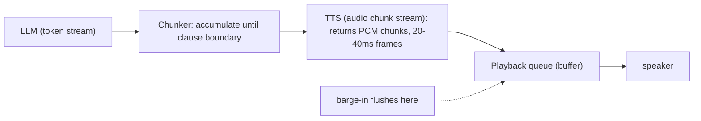

# Lecture 10: Text-to-Speech — Streaming Synthesis and Time-to-First-Byte

> A voice agent lives or dies on one number: how long after the user stops talking before they hear the first syllable of the reply. Everything upstream — VAD, STT, the LLM — feeds a budget, and TTS is the last stage that spends it. The naive way to do TTS is to hand the model a finished sentence, wait for a WAV file, then play it. That's how you build an agent that feels like a 1990s IVR: dead air, then a burst of speech. The expert way is to treat text and audio as *streams* that flow through each other, so audio starts leaving the speakers ~200ms after the LLM emits its first clause — while the LLM is still writing the rest of the sentence. After this lecture you can pick a TTS engine on purpose (Piper vs ElevenLabs vs Cartesia vs OpenAI), wire an LLM token stream into a TTS chunk stream into a playback buffer, chunk on clause boundaries so synthesis starts on the first phrase, reason about where your latency budget goes, and build the flushable playback queue that barge-in will later reach in and kill.

**Prerequisites:** STT & Whisper, VAD/endpointing (this week's earlier lectures), LLM token streaming (Phases 1 & 6) · **Reading time:** ~28 min · **Part of:** Phase 12 Week 2

---

## The core idea (plain language)

Speech synthesis takes text and produces a waveform — a stream of audio samples (say 22,050 or 24,000 numbers per second) that a sound card turns into pressure waves. The engineering question is not "can the model make good audio" — every option in 2025-2026 makes *good enough* audio. The question is **when does the first sample come out**, and **can you stop it instantly**.

There are two ways to run TTS, and the difference is the whole lecture:

- **Batch (one-shot) synthesis.** You send the full text, the engine synthesizes the entire utterance, and you get back a complete audio blob. You play it. Simple, and *fatal* for conversation: if the reply is 4 seconds of audio, you often wait most of a second (or more) staring at silence before anything plays, because the engine wanted the whole sentence before it started — and even a fast engine has to generate all 4 seconds of samples before handing them over.
- **Streaming synthesis.** You feed text *incrementally* (clause by clause, as the LLM produces it), and the engine returns audio *incrementally* (chunk by chunk, as it generates it). You push those chunks into a playback buffer that starts playing the moment the first chunk lands. The user hears the beginning of the reply while the middle is still being synthesized and the end hasn't even been written by the LLM yet.

**Time-to-first-byte (TTFB)** is the metric: milliseconds from "I asked the engine to speak" to "the first audio byte is available to play." Everything about production voice TTS is a fight to shrink TTFB and to keep the pipeline *flushable* so that when the user interrupts (barge-in), you can drop everything queued and go silent in well under 200ms.

The mental model: **do not wait for a finished thing. Pipe a stream into a stream into a buffer.** LLM tokens → TTS audio chunks → playback queue. Each stage starts working on partial input from the stage before it.

---

## How it actually works (mechanism, from first principles)

### The latency budget, stage by stage

A cascaded voice turn (this week's architecture) is a pipeline. The clock starts when the user *stops speaking* and ends when they *hear the first audio*. Here's an approximate budget for a snappy local-ish setup (numbers are rules of thumb, not benchmarks):

```
end of user speech
  │
  ├─ endpoint detection (VAD trailing silence) ..... ~300–500 ms  (you chose this)
  ├─ STT finalize (faster-whisper on the segment) .. ~150–400 ms
  ├─ LLM time-to-first-token .......................  ~200–600 ms
  ├─ text chunking to first clause .................    ~0–50 ms
  ├─ TTS time-to-first-byte ........................  ~80–400 ms
  └─ audio buffer → speaker latency ................   ~20–80 ms
  ▼
user hears first syllable      TARGET total: < 800 ms
```

Two things jump out. First, the budget is *tight* — 800ms is spent before you've made any mistakes. Second, **the last two rows are the only ones this lecture controls**, and if you do TTS wrong they balloon. If you wait for the *full* LLM response before starting TTS, you add the LLM's *entire* generation time (a 40-word answer at ~40 tokens/sec is ~1.5s) to the front of TTS, and then TTS's own batch latency on top. That's how a well-under-800ms pipeline becomes a 3-second one.

### Why batch synthesis kills you: the two waits stack

Batch TTS makes you pay two serial waits:

1. **The LLM finishes.** You can't send text you don't have. If you wait for the complete answer, TTFB inherits the LLM's full generation latency.
2. **The engine finishes.** Even with the full text in hand, a one-shot engine generates the whole waveform before returning. Synthesizing 4 seconds of speech takes real compute time.

Streaming attacks *both*. You send the first clause the instant the LLM has emitted one (kills wait #1 — you start on ~5 words, not 40). And a streaming engine returns audio for that clause while still working (kills wait #2 — you get the first ~300ms of audio, not all 4 seconds).

### The three streams and how they connect



- **Stage 1 — LLM token stream.** Your LLM call is already streaming (Phase 1): you get tokens one at a time via a generator. You do *not* accumulate the whole message. You feed tokens into the chunker.
- **Stage 2 — the chunker (sentence/clause segmentation).** TTS engines want at least a *phrase* to synthesize naturally — feeding one word at a time produces robotic prosody and wastes per-request overhead. So you buffer incoming tokens until you hit a **clause or sentence boundary** (`.`, `?`, `!`, `,`, `;`, `:`, or a length cap), then emit that chunk to TTS and keep buffering the rest. This is the single most important trick: it lets synthesis *start on the first clause* instead of the whole answer.
- **Stage 3 — TTS audio chunk stream.** You send the clause to the engine; it streams back raw audio frames (PCM samples, or an encoded format you decode). You push each frame into the playback buffer as it arrives.
- **Stage 4 — the playback buffer/queue.** A background audio callback (via `sounddevice`) pulls frames off the queue at exactly the sample rate and writes them to the sound card. The queue *decouples* production (network/synthesis, bursty) from consumption (the speaker, which needs a steady 24,000 samples/sec). This buffer is the thing barge-in flushes.

### The chunker in detail (with a worked boundary)

Say the LLM streams: `Sure` `,` ` I` ` can` ` book` ` that` ` for` ` you` `.` ` What` ` time` `?`

The chunker accumulates until a boundary token:

- After `,` → emit `"Sure,"` to TTS immediately. Synthesis of ~1 word starts *now*, maybe 300ms into the LLM's response.
- Continue accumulating `I can book that for you`; after `.` → emit `"I can book that for you."`.
- Accumulate `What time`; after `?` → emit `"What time?"`.

By the time the LLM writes `?`, the audio for `"Sure,"` is already playing. The pipeline is *pipelined* — stages overlap in time instead of running end to end.

A subtlety: commas give you the fastest TTFB but the choppiest prosody (the engine can't see the rest of the sentence, so intonation may be flat or fall wrongly). A common compromise is **first-chunk-short, then sentence-sized**: emit the very first chunk at the first comma *or* after ~3-8 words (whatever comes first) to minimize TTFB, then switch to full-sentence chunks for the rest so the bulk of the reply sounds natural. You're trading a slightly less natural first phrase for a much better perceived latency — usually the right trade.

```python
# Sketch: token stream -> clause chunks
import re
BOUNDARY = re.compile(r'[.!?;:,]')

def clause_chunks(token_iter, first_chunk_min_words=3):
    buf, emitted_first = "", False
    for tok in token_iter:
        buf += tok
        # first chunk: emit early to minimize TTFB
        if not emitted_first and (BOUNDARY.search(buf) or len(buf.split()) >= first_chunk_min_words):
            yield buf.strip(); buf, emitted_first = "", True
        # subsequent chunks: emit on sentence-ish boundaries
        elif emitted_first and re.search(r'[.!?]\s', buf):
            yield buf.strip(); buf = ""
    if buf.strip():
        yield buf.strip()
```

### The playback buffer: why a queue, and why it must flush

Audio hardware is unforgiving. The sound card asks for the *next* block of samples on a fixed schedule (e.g. every ~10ms it wants 240 samples at 24kHz). If you don't have them ready, you get an **underrun** — an audible click or gap. So you never write to the device directly from your network code; you write to a **thread-safe queue**, and a separate audio callback drains it at exactly the right rate.

```python
import sounddevice as sd, queue, numpy as np

audio_q = queue.Queue()          # holds float32 PCM chunks
def callback(outdata, frames, time_info, status):
    try:
        chunk = audio_q.get_nowait()
        outdata[:len(chunk)] = chunk.reshape(-1, 1)
        if len(chunk) < frames:            # pad tail with silence
            outdata[len(chunk):] = 0
    except queue.Empty:
        outdata[:] = 0                     # underrun -> play silence, no crash

stream = sd.OutputStream(samplerate=24000, channels=1, callback=callback, blocksize=480)
stream.start()
# producer side: as TTS frames arrive -> audio_q.put(frame)

def flush():                               # <-- barge-in calls this
    with audio_q.mutex:
        audio_q.queue.clear()              # drop everything not yet played
```

The `flush()` call is the entire point of using a queue you control instead of handing a blob to `sd.play()`. When barge-in fires (the VAD detects the user talking over the agent), you `flush()` the queue and the agent goes silent within one audio block (~10ms) plus whatever's already in the OS buffer (tens of ms). If instead you'd called a blocking `play(whole_wav)`, you'd have *no handle* to stop it. **Streaming isn't just a latency win — it's what makes interruption physically possible.**

---

## Worked example

Let's put numbers on it. The agent's reply is: *"Sure, I can book that for you. What time works best?"* — about 12 words, which is ~4 seconds of spoken audio at a normal ~180 words/min.

**Batch pipeline (the wrong way):**

- LLM generates 12 words at ~40 tok/sec ≈ ~16 tokens ≈ **~400ms** to finish the full text.
- Send full text to a one-shot TTS engine; it synthesizes 4s of audio in, say, **~350ms** and returns the blob.
- Start playback: **~30ms** to first sample.
- **TTFB ≈ 400 + 350 + 30 = ~780ms** of dead air before *any* sound.

**Streaming pipeline (the right way):**

- LLM time-to-first-*token* ≈ **~250ms**; a few more tokens to reach the first comma (`"Sure,"`) ≈ **+80ms** → first clause ready at ~330ms.
- Send `"Sure,"` to a streaming engine; its TTFB ≈ **~150ms** → first audio frame at ~480ms.
- Playback buffer → speaker ≈ **~30ms**.
- **TTFB ≈ ~510ms** — and the user hears *"Sure,"* while the LLM is still writing *"...What time works best?"* and the engine is still synthesizing it.

Streaming cut perceived latency from ~780ms to ~510ms *and* — because the rest synthesizes concurrently with playback of the front — the audio plays gaplessly through the whole 4 seconds. The batch version's 780ms was *pure silence*; the streaming version's 510ms is the only silence, and everything after overlaps.

**Now the long-response trap.** Suppose your prompt lets the LLM ramble and it produces a 60-word paragraph. In the *streaming* pipeline, TTFB is *still* ~510ms — you started on the first clause regardless of total length. Good. But the *turn* is now ~20 seconds of talking, and every one of those seconds is a second the user can't get a word in without barge-in, and a second of LLM+TTS cost. This is why the rule "keep LLM outputs short" is a *latency and UX* rule, not just a cost one: short replies don't lower TTFB (chunking already handles that), but they keep the *turn* short so the conversation stays a conversation. Cap the LLM (e.g. "answer in 1-2 sentences") in the system prompt.

---

## How it shows up in production

- **The "detail: full sentence" flat-prosody bug.** You chunk on commas for low TTFB and every clause comes out with the same falling intonation, so the agent sounds like it's reading a list. Fix: short first chunk, sentence chunks after; or use an engine with a "flush/continuation" API (Cartesia, ElevenLabs streaming) that maintains prosodic context across chunks so it *knows* the sentence continues.
- **Underruns / crackling under load.** Your TTS chunks arrive bursty over the network, the queue empties, and the callback plays silence → clicks. Fix: a small **jitter buffer** — hold ~50-100ms of audio before starting playback so brief network stalls don't drain the queue. This trades a few ms of TTFB for gapless audio; usually worth it.
- **Format mismatch tax.** The engine streams MP3/Opus but your sound card wants raw PCM at a specific rate. Decoding adds latency and CPU. Prefer engines/endpoints that stream **raw PCM at your device's sample rate** (most streaming TTS APIs offer `pcm_24000` or similar) so there's no decode step in the hot path.
- **Sample-rate mismatch → chipmunk or slow-mo.** Piper outputs 22,050 Hz; you opened the device at 24,000. Everything plays ~9% too fast and slightly high-pitched. Always match `samplerate` to the engine's actual output, or resample explicitly.
- **Cost and engineering-burden tradeoffs (the real decision):**
  - **Piper** — free, fully local, runs on CPU, low TTFB because there's no network round-trip. Quality is *good, not great* (clearly synthetic on close listening). Zero per-request cost, zero API key, no rate limits, full privacy. **The right default for cost-free lab work and for offline/edge deployments.** You own the audio pipeline end to end.
  - **ElevenLabs** — top-tier naturalness and expressive voices, mature streaming API with input-streaming (WebSocket) support. Higher cost per character; you're paying for quality and for *not* having to run a model. Latency is network-bound but their flash/turbo models target low TTFB.
  - **Cartesia (Sonic)** — explicitly engineered for *low-latency streaming* voice agents; strong TTFB and a continuation/flush model designed for the token-stream → audio-stream pattern. A common 2025 choice when latency is the priority and you want managed quality.
  - **OpenAI TTS** — solid quality, simple API, streaming supported; convenient if you're already in the OpenAI stack. Fewer voice-cloning/expressive knobs than ElevenLabs.
  - The axis is **quality + low engineering burden (pay, managed, network latency)** vs **free + local + private + lowest network latency but you run it and quality is merely decent (Piper)**. For a portfolio voice agent that must be cost-free: Piper. For a product where the voice *is* the product: a streaming API, usually Cartesia or ElevenLabs.
- **Rate limits and per-character billing bite at scale.** Streaming APIs bill per character synthesized; a chatty agent multiplied by many users is a real line item, and you can hit concurrency caps. Piper has neither problem but needs CPU/RAM per concurrent stream.

---

## Common misconceptions & failure modes

- **"I'll just synthesize the whole reply then play it — it's simpler."** It's simpler and it's the IVR-dead-air experience. You pay the LLM's full generation time *plus* the engine's full synthesis time as pure silence, and you have no way to interrupt. Stream.
- **"TTFB is about the TTS engine being fast."** Partly. But the biggest TTFB win is *architectural*: starting synthesis on the first clause instead of the whole answer. A mediocre engine used with clause chunking beats a fast engine used in batch mode.
- **"Feed the TTS one word at a time for the lowest latency."** Words are too small — prosody collapses and per-request overhead dominates. Clause/phrase is the sweet spot; first chunk short, then sentence-sized.
- **"Keeping LLM outputs short lowers TTFB."** No — clause chunking already makes TTFB independent of total length. Short outputs keep the *turn* short (better UX, lower cost, faster barge-in recovery). Both matter; don't conflate them.
- **"`sd.play(wav)` is fine."** It's a blocking, unflushable one-shot. You cannot barge-in through it. Use an `OutputStream` + a queue you can `clear()`.
- **"Streaming means I don't need a buffer."** You need the buffer *more* — network jitter will underrun you without a small jitter buffer to absorb stalls.
- **"Piper is too low-quality to use."** For most task-oriented agents (booking, support, IoT control) Piper is perfectly intelligible and its local, free, low-latency profile is exactly right. Reach for a paid API when the voice's *warmth/expressiveness* is a product feature.
- **"The engine's sample rate doesn't matter, sounddevice figures it out."** It doesn't resample for you. Mismatched rates = pitch/speed distortion. Match or resample explicitly.

---

## Rules of thumb / cheat sheet

- **Never wait for the full utterance.** Pipe LLM tokens → clause chunker → streaming TTS → flushable playback queue. TTFB target for the TTS stage alone: **~150-400ms** (approximate).
- **Chunk on clause boundaries.** First chunk short (first comma *or* ~3-8 words) for low TTFB; subsequent chunks sentence-sized for natural prosody.
- **Keep LLM replies to 1-2 sentences.** Cap it in the system prompt. Short turns = conversational feel, cheaper synthesis, faster barge-in recovery.
- **Use `sounddevice.OutputStream` + a `queue.Queue`,** never blocking `sd.play`. Expose a `flush()` that clears the queue — that's the barge-in kill switch.
- **Add a small jitter buffer (~50-100ms)** before playback to absorb network stalls and prevent underrun clicks.
- **Stream raw PCM at your device's sample rate** if the engine offers it — skip the decode step in the hot path.
- **Match the sample rate exactly** (Piper 22,050 Hz; many APIs 24,000 Hz). Mismatch = chipmunk/slow-mo.
- **Engine defaults:** cost-free/local/private → **Piper**. Latency-first managed → **Cartesia**. Max quality/expressive → **ElevenLabs**. Already-OpenAI stack → **OpenAI TTS**.
- **Measure TTFB per turn** (log timestamp at "sent first clause" and "first audio frame queued") and report p50/p95, same as the STT/LLM stages.

---

## Connect to the lab

This is the **TTS + streaming + barge-in half of Week 2's Build B** (`voice_agent/src/tts.py` and `bargein.py`). Start non-streaming to get it working, then convert to the token-stream → clause-chunk → playback-queue pipeline in this lecture. The `flush()` on your playback queue is exactly what the barge-in step (VAD fires while TTS plays → stop within ~200ms) reaches into. Log end-of-speech → first-audio-out and report p50/p95 against the **<800ms** budget — the TTS stage is the last contributor, and getting it streaming is usually what pulls the total under budget. Pick Piper for the cost-free build; optionally swap in a streaming API and compare TTFB.

---

## Going deeper (optional)

- **Piper** GitHub (`github.com/rhasspy/piper`) — the local neural TTS engine; read the streaming/stdin usage and voice model list. Search: *"Piper TTS rhasspy streaming"*.
- **Cartesia** docs (root: `docs.cartesia.ai`) — Sonic streaming TTS with continuation/flush designed for voice agents; read their WebSocket streaming and latency sections. Search: *"Cartesia Sonic streaming TTS websocket"*.
- **ElevenLabs** docs (root: `elevenlabs.io/docs`) — input-streaming WebSocket API and latency-optimized models; read "streaming" and "websockets". Search: *"ElevenLabs streaming websocket latency"*.
- **OpenAI audio/speech** docs (root: `platform.openai.com/docs`) — the text-to-speech endpoint and streaming. Search: *"OpenAI text to speech streaming"*.
- **python-sounddevice** docs (`python-sounddevice.readthedocs.io`) — `OutputStream`, callbacks, blocksize, and the queue pattern for gapless playback; the authoritative source for the playback half.
- **Pipecat** GitHub (`github.com/pipecat-ai/pipecat`) and **LiveKit Agents** (`github.com/livekit/agents`) — production voice frameworks that implement this token→TTS→playback→barge-in pipeline (and WebRTC transport) so you can see the pattern at scale. Search: *"Pipecat TTS service streaming"*, *"LiveKit agents TTS"*.
- For the STT/VAD/endpointing stages that feed this one, and the barge-in/turn-budget integration, see this week's earlier speech lectures and the realtime voice-agent lecture that follows.

---

## Check yourself

1. Your voice agent has a great, fast TTS engine but still feels laggy — there's a full second of silence after you stop talking before it replies. You're sending the *entire* LLM answer to TTS at once. Explain, in terms of the two stacked waits, where that second goes and how streaming removes most of it.
2. Why is a `queue.Queue` drained by a `sounddevice` callback the right structure for playback, and why is `sd.play(full_wav)` incompatible with barge-in?
3. You chunk the LLM stream on every comma to minimize TTFB, and testers say the agent sounds "robotic / list-like." What's the mechanism, and what chunking strategy fixes it without hurting TTFB much?
4. A colleague says "we should cap the LLM to one sentence to lower our TTFB." Correct or refine this claim — does short output lower TTFB, and if not, what does it actually buy you?
5. Your streaming audio has intermittent clicks/gaps under real network conditions but is perfect on localhost. Name the failure and the fix, and state the tradeoff the fix costs you.
6. You must ship a fully cost-free, offline-capable voice agent for a support kiosk. Which TTS engine do you pick and why, and what's the one quality caveat you accept?

### Answer key

1. The two serial waits are (a) waiting for the **LLM to finish** generating the whole answer, and (b) waiting for the **TTS engine to finish** synthesizing the whole waveform — both happen as pure silence before any playback. Even a fast engine can't return audio until it's done, and you can't send text you haven't generated. Streaming removes most of both: clause chunking lets you send the first ~5 words the instant the LLM emits them (so you inherit only the LLM's time-to-first-*token*, not full generation), and a streaming engine returns the first audio frames while still synthesizing the rest (so you inherit only its TTFB, not full synthesis). The silence shrinks from "LLM full + TTS full" to "LLM first-token + TTS first-byte."
2. The sound card demands the next block of samples on a fixed schedule; a thread-safe queue drained by the audio callback **decouples** bursty network/synthesis production from the steady, real-time consumption the hardware needs, and on empty the callback plays silence instead of crashing. Critically, you hold a handle to that queue, so barge-in can `clear()` it and go silent within ~one audio block. `sd.play(full_wav)` is a blocking, unflushable one-shot with no handle to interrupt — once it starts, you can't stop it mid-utterance, so the agent talks over the interrupting user.
3. Chunking on every comma means the engine synthesizes each short clause **without seeing the rest of the sentence**, so it can't shape intonation across the whole phrase — each clause gets the same neutral/falling contour, sounding like a read list. Fix: make only the **first** chunk short (first comma or ~3-8 words) for low TTFB, then switch to **sentence-sized** chunks so the bulk of the reply has natural prosody; or use an engine with a continuation/flush API that carries prosodic context across streamed chunks. TTFB stays low because only the first small chunk gates it.
4. Refine it. Clause chunking already makes TTFB **independent of total answer length** — you start on the first clause either way — so capping the LLM does **not** lower TTFB. What short output actually buys: a shorter *turn* (less total talking time), which means better conversational feel, lower per-character synthesis cost, and faster recovery after a barge-in. Both goals matter, but they're different levers.
5. **Buffer underrun**: network jitter delays TTS chunks, the playback queue empties, and the callback plays silence → audible clicks/gaps. Localhost has no jitter so the queue never drains. Fix: add a small **jitter buffer** — accumulate ~50-100ms of audio before starting playback so brief stalls are absorbed. The tradeoff: those ~50-100ms are added to your TTFB (you start playing slightly later), which is almost always worth it for gapless audio.
6. **Piper.** It's free (no per-character billing, no key), runs fully **local on CPU** so it works offline in a kiosk with no network dependency, and has **low TTFB** because there's no network round-trip. The caveat you accept: quality is *decent but clearly synthetic* — fine for intelligible task-oriented support prompts, but it lacks the warmth/expressiveness of a paid API like ElevenLabs. For a kiosk where the content matters more than vocal charisma, that's the right trade.
