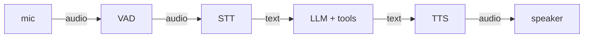
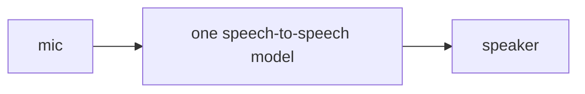
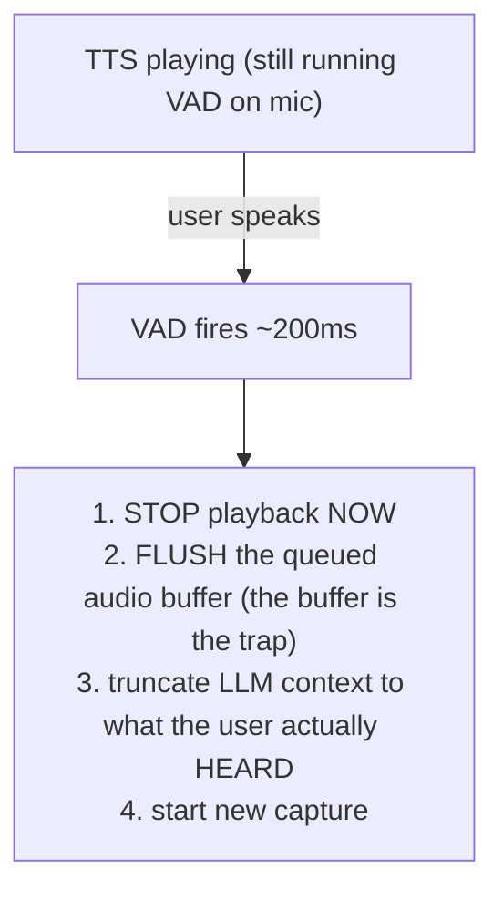

# Lecture 11: Realtime Voice Agents — Cascaded vs Speech-to-Speech, Endpointing, Barge-In, Latency Budget

> You already built an agent in Phase 6: a bounded loop that takes text in, calls tools, and produces text out. A voice agent is that same loop with an ear and a mouth bolted onto it — and the ear and mouth are where all the hard engineering lives. Text agents get to be slow and turn-based; nobody notices a 3-second pause while reading. A voice agent that pauses 3 seconds feels *broken*, and one that talks over you feels *dead*. This lecture is about the three real-time problems that separate a demo from a product — deciding when the user stopped talking (endpointing), stopping instantly when they interrupt (barge-in), and holding a sub-800ms budget from end-of-speech to first sound — plus the one architectural fork (cascade vs speech-to-speech) that shapes all three. After this you can assemble STT+LLM+TTS into a conversational agent, instrument its latency at every stage boundary, implement barge-in and tunable endpointing, and say exactly when to reach for OpenAI Realtime instead of your own cascade.

**Prerequisites:** Phase 6 (tool-calling agent loop, bounded loops, latency budgets), this week's STT/TTS lectures (faster-whisper, VAD, streaming synthesis) · **Reading time:** ~26 min · **Part of:** Multimodal & Specialized Modalities, Week 2

---

## The core idea (plain language)

A voice agent is a **turn-taking machine**. Human conversation runs on a protocol we learned as toddlers: one person talks, signals they're done (falling pitch, a pause, "…right?"), the other starts. The gap between turns in natural speech is astonishingly short — around 200ms, often less, sometimes *negative* (we start before the other person finishes). Your agent approximates that protocol in silicon, and every millisecond of slop shows up as awkwardness the user feels before they can name it.

Strip away the ML and a voice agent is three loops running concurrently around your Phase 6 agent:

1. **Listen** — capture microphone audio; figure out when a turn *starts* and *ends*.
2. **Think** — transcribe, run the agent loop (same tool calls, same bounded loop, same budgets), decide what to say.
3. **Speak** — synthesize audio and play it *while still listening*, so the user can cut you off.

The brain in the middle is exactly what you already built. The novelty is entirely in the I/O layer: **when does a turn end (endpointing), how do you abort your own speech mid-word (barge-in), and how do you keep the round-trip under ~800ms (latency budget)?** Get those three right and a mediocre LLM feels like a great assistant. Get them wrong and GPT-class intelligence feels like a broken phone tree.

Before any of that, one fork determines how much you even control: **cascaded** vs **speech-to-speech**.

---

## How it actually works (mechanism, from first principles)

### The two architectures

**Cascaded** wires three separate models in series:



Each box is a component you choose, swap, log, and unit-test independently. Whisper for STT, your Phase 6 agent for the brain, Piper/ElevenLabs/Cartesia for TTS. This is the modular, debuggable, boring-in-a-good-way architecture. You can print the transcript. You can print the LLM's tool calls. You can A/B two TTS vendors by changing one line. **The cost is that latency stacks** — every stage adds its own delay and they sum end to end.

**Speech-to-speech** (OpenAI Realtime, Gemini Live) is a single multimodal model that takes audio in and emits audio out, with no text bottleneck:



Because there's no STT→text→TTS round-trip, latency is lower and, crucially, **prosody survives**: the model hears that you sounded frustrated or excited and responds in kind — laughs, whispers, matches your energy. A cascade flattens all of that into plain text: "I GUESS that's FINE" and "i guess that's fine" become the identical string, and everything tone carried is gone. The price: **it's a black box.** No canonical intermediate transcript to read, no way to swap the voice engine for a cheaper one, no way to inspect why it decided to do X. You buy lower latency and richer affect by giving up the debugger.

The honest framing: **cascade is the default you build first** because you can see inside it. Speech-to-speech is what you reach for when latency or emotional nuance *is* the product (a companion app, a natural phone agent) and you accept losing introspection.

### Problem 1 — Endpointing (deciding the user finished)

The machine hears a stream of audio and must decide, in real time, "the user stopped; it's my turn." Two ways to get it wrong:

- **Endpoint too early** → you cut the user off mid-thought. They pause to breathe or think ("I want to book a flight to… uh… Denver") and you barge in on your own user.
- **Endpoint too late** → dead air. The user finished and the agent just sits there. Feels laggy, feels broken.

The workhorse mechanism is **trailing-silence detection via VAD** (voice activity detection — the Silero-style model from the STT lecture). The VAD emits a speech/no-speech decision on short frames (typically 10–30ms). The rule:

> Track how long it's been continuously *not* speech. When that trailing silence exceeds a threshold (**~500–700ms default**), declare the turn over.

Worked numerically: VAD runs on 20ms frames; a 600ms threshold = 30 consecutive non-speech frames. The user says "book a flight" then goes quiet. Frame 1 of silence… frame 30 (600ms elapsed) → endpoint fires → freeze the captured segment → hand it to STT.

The threshold is a **direct latency-vs-interruption dial**, baked into every single turn:

| Threshold | Feel | Failure |
|-----------|------|---------|
| 200ms | Snappy | Cuts off anyone who pauses to think |
| 500–700ms | Natural (default) | Occasionally waits on a slow talker |
| 1200ms | Never interrupts | Dead-air lag on every turn |

Two things the numbers hide. First, **that trailing-silence time is pure latency added to every turn** — it's inside your 800ms budget, spent *before the LLM has even seen a word*. A 600ms endpoint means LLM+TTS have only ~200ms left. Second, **tune on real speech, not on yourself reading a script.** Reading aloud has smooth, gap-free prosody; real users pause, say "um," trail off, restart. A threshold tuned on your clean read will chop up real users mercilessly. (Advanced systems layer a small *semantic endpointing* model that also asks "does this sound like a finished thought?" — but trailing-silence VAD is the foundation and what you'll build.)

### Problem 2 — Barge-in (the user interrupts you)

This is **the single most important UX feature of a voice agent**, and the one most demos skip. The agent is talking. The user cuts in — "no wait, not Denver, *Boston*." A human stops mid-syllable and listens. Your agent must do the same, or the whole thing feels dead and rude, plowing through a scripted answer while the user tries to correct it.

The naive-but-wrong instinct is to stop listening while you talk (otherwise you'll hear yourself). Wrong. The mechanism is the opposite:

> **Keep the VAD running during TTS playback.** The instant it detects user speech (~200ms of voiced audio), *immediately* stop playback and flush the audio output buffer, then start a fresh capture for the new turn.



The subtle trap is step 2. Streaming TTS means you've likely already generated and *buffered* several seconds of audio ahead of what's currently playing. Calling "stop" on the current chunk isn't enough — if five more chunks are queued, the agent keeps talking for two more seconds after the interruption. You must **flush the entire output buffer**, not just halt the current chunk.

Step 3 is the one people forget and then can't debug: the LLM *thinks* it said its whole answer, but the user only heard the first sentence before cutting in. If you don't truncate the conversation context to reflect what was actually *played*, the agent's memory and the user's reality diverge, and follow-ups get weird ("as I mentioned, the flight is $340" — no you didn't, I cut you off). Barge-in isn't just "stop the audio"; it's "stop the audio *and* fix the record."

### Problem 3 — The latency budget

The target: **<800ms from end-of-user-speech to first-audio-out.** Below ~800ms the exchange feels conversational; above it, users start "double-talking" (repeating themselves, assuming you didn't hear) and the illusion breaks. This is a *first-audio* budget — time to the first sound, not the full spoken response — which is why streaming TTS matters so much.

You hit a budget by measuring it, and you measure by **logging a timestamp at every stage boundary** and reporting **p50 and p95** across many turns (never a single number — the tail is where users churn). A representative cascade breakdown (illustrative approximate numbers; measure your own):

```
 end-of-speech (endpoint fires)                t=0ms
   ├─ [ endpointing silence already spent: 600ms, before t=0 ]
   ├─ STT transcription (streaming, base.en)    +150ms  →  150
   ├─ LLM time-to-first-token                    +300ms  →  450
   ├─ enough tokens to start TTS (first clause)  +100ms  →  550
   ├─ TTS time-to-first-audio-byte               +180ms  →  730
   └─ audio playout / network                     +40ms  →  770ms  ✅ under 800
```

Three levers fall straight out of that ledger:

1. **Stream everything, overlap stages.** Don't wait for the full transcript to start the LLM, or the full response to start TTS. Begin synthesizing as soon as you have the first *clause*. Overlapping stages is what turns a 1500ms serial pipeline into a 770ms pipelined one.
2. **Keep responses short.** TTS time is roughly proportional to words spoken; a 3-sentence answer blows first-audio budget far less than an essay, and there's less to throw away on barge-in. Instruct the LLM to be terse — a prompt/budget decision, same as Phase 6.
3. **Time-to-first-token dominates the brain's contribution.** A smaller/faster model or a provider with low TTFT can matter more than raw quality here.

Because latency *stacks* in a cascade, the arithmetic is unforgiving: STT + LLM + TTS + endpointing must jointly fit. Speech-to-speech collapses the middle three into one model call, which is precisely why it wins on latency.

### The transport reality: WebSocket vs WebRTC

Everything above assumes audio bytes arrive on time. Over a raw **WebSocket** they often don't. WebSocket is TCP: reliable, ordered, and therefore *head-of-line blocked* — a single lost packet stalls everything behind it while it retransmits, and it has **no jitter buffer, no packet-loss concealment, no adaptive bitrate.** On your laptop over wifi to localhost this is invisible, and WebSocket is a fine prototype transport. On a mobile network — where packets drop, arrive out of order, and jitter wildly — WebSocket audio degrades into stutters, gaps, and multi-second stalls.

Real deployments use **WebRTC**, built for exactly this: UDP-based, with a jitter buffer that smooths arrival timing, packet-loss concealment that masks dropped audio, and echo cancellation (essential — without it your barge-in VAD triggers on the agent's *own* voice leaking from speaker into mic). You don't hand-roll WebRTC; you use a framework: **LiveKit Agents** or **Pipecat** give you the WebRTC transport, VAD, and pipeline plumbing so you write agent logic, not the media stack.

> Rule: **WebSocket for the local prototype, WebRTC (via LiveKit or Pipecat) the moment real users on real networks are involved.**

---

## Worked example

Trace one turn through a cascaded agent with a 600ms endpoint threshold, streaming everywhere.

User says: *"What's the weather in Boston tomorrow?"* then stops.

1. **t = -600 → 0ms:** VAD sees silence accumulate. At 600ms of trailing silence, endpoint fires. This 600ms is spent *before the budget clock starts*.
2. **t = 0 → 140ms:** faster-whisper (streaming, `base.en`, int8) finalizes "what's the weather in boston tomorrow."
3. **t = 140 → 440ms:** the Phase 6 agent loop runs. LLM decides it needs a tool, calls `get_weather(city="Boston", day="tomorrow")`. Tool returns in 90ms. LLM resumes; time-to-first-token at t=440ms: *"Tomorrow in Boston…"*
4. **t = 440 → 540ms:** first full clause buffered; TTS kicks off.
5. **t = 540 → 730ms:** TTS emits its first audio chunk; playback begins. **First audio out at 730ms — under budget.** ✅

Now barge-in. Mid-sentence — the agent is saying "…expect rain in the afternoon, high of…" — the user cuts in: *"just tell me if I need an umbrella."*

- VAD (still running during playback) detects voiced audio ~180ms into the interruption.
- Playback stops; the ~1.5s of already-synthesized audio still queued is **flushed**.
- Context is truncated: the agent's stored turn becomes only what was played — "Tomorrow in Boston expect rain in the afternoon, high of" — not the full sentence it planned.
- New capture starts. Endpointing runs again on the umbrella question.

Now measure across 30 such turns and you get a distribution, e.g. p50 = 710ms, p95 = 950ms. That p95 is the honest number: 1 in 20 turns is over budget, probably the ones where the tool call was slow or the LLM ran long. That's where optimization effort goes — not the median that already looks fine.

---

## How it shows up in production

- **Endpointing is your most-complained-about knob.** Tickets say "it interrupts me" (threshold too low) or "there's a huge pause" (too high). Same dial, and you can't satisfy both without semantic endpointing. Tune on recordings of *actual users*, segmented by use case — someone reciting a 16-digit card number needs a longer threshold than someone answering yes/no.
- **Broken barge-in reads as "the bot is stupid."** Users don't file "barge-in latency" tickets; they say "it doesn't listen" and hang up. The buffer-flush bug (agent keeps talking for 2s after you interrupt because queued chunks kept playing) is the single most common voice-agent defect. Test it explicitly and mercilessly.
- **The p95 churns users, not the p50.** A p50 of 600ms with a p95 of 2500ms feels *worse* than a steady 800ms, because unpredictable lag is more jarring than consistent lag. Always report both. The tail is usually a slow tool call or LLM tail latency — cap tool timeouts and consider a faster model on the conversational path.
- **Echo cancellation is not optional.** Without it (a WebRTC feature free from LiveKit/Pipecat, hand-built over raw WebSocket), the agent's own voice leaking into the mic triggers false barge-in — the agent interrupts itself constantly. Teams burn days debugging "phantom barge-in" that is just missing echo cancellation.
- **Speech-to-speech's black-box nature bites at eval time.** With a cascade you log the transcript and build the Phase 7 eval harness on it. With OpenAI Realtime there's no canonical transcript to grade, so you often run a *shadow* STT purely for logging/eval — reintroducing part of the cascade you were avoiding.
- **The cost model differs sharply.** A cascade bills three ways (STT per minute, LLM per token, TTS per character). Speech-to-speech bills audio tokens in and out, which for chatty sessions can be dramatically more expensive per minute — price it before you commit.

---

## Common misconceptions & failure modes

- **"Speech-to-speech is just strictly better because it's lower latency."** No — you trade away introspection, component swapping, and cheap per-component eval. For most business agents (tool-calling, audit logs, a specific cheap TTS voice), the cascade's debuggability wins. Reach for speech-to-speech when affect/latency *is* the product.
- **"Stop listening while the agent talks so it doesn't hear itself."** This kills barge-in. Keep the VAD running the whole time; solve self-hearing with echo cancellation, not by going deaf.
- **"Barge-in means calling `stop()` on the audio player."** Only if you also flush the buffered/queued audio and truncate the LLM context to what was actually heard. Skip those and the agent talks over the user and then misremembers the conversation.
- **"800ms is the response time."** It's the *first-audio* time. It only works because you stream TTS from the first clause. Non-streaming TTS that waits for the full response blows it every time.
- **"WebSocket is fine, my demo works great."** Your demo runs on localhost. WebSocket has no jitter buffer or loss concealment; the first mobile user on a train exposes this instantly. Prototype on WebSocket, ship on WebRTC.
- **"Endpointing tuned on my own voice generalizes."** Your clean scripted read has no thinking-pauses. Real users pause, restart, and say "um." Tune on real speech or you'll chop them off.
- **"Whisper in a live loop just works."** Whisper hallucinates text on silence. In a real-time loop you must VAD-gate what you feed it, or it'll transcribe "thank you for watching" into dead air.

---

## Rules of thumb / cheat sheet

*(All numbers approximate defaults — measure on your own traffic.)*

- **Endpointing trailing silence:** start at **600ms**. Lower toward 400ms for snappy yes/no flows; raise toward 800–1000ms for number/address dictation.
- **Barge-in reaction:** target **~200ms** from user-speech-onset to playback stopped. Always flush the queued buffer *and* truncate LLM context.
- **Latency budget:** **<800ms** end-of-speech → first-audio-out. Report **p50 and p95**, not a single mean.
- **Stream every stage** and overlap them; start TTS on the first clause, not the full response.
- **Keep LLM answers short** — cheaper on TTS latency, less to discard on barge-in.
- **Default architecture: cascade.** Switch to speech-to-speech only when latency or emotional prosody is the actual product.
- **Transport: WebSocket to prototype, WebRTC (LiveKit Agents / Pipecat) to ship.** Never skip echo cancellation.
- **Always VAD-gate audio before STT** to suppress silence hallucinations.
- **Instrument first, optimize the p95.** Log timestamps at every boundary from day one.

---

## Connect to the lab

This is Week 2's **Build B**: a cascaded realtime voice agent (`voice_agent/`) wiring Silero VAD + faster-whisper + your Phase 6 agent + streaming TTS. Implement 600ms endpointing, barge-in that stops within ~200ms and flushes the buffer, and timestamp logging at every stage boundary — then report p50/p95 against the 800ms budget across ≥10 turns. The optional level-up is re-implementing on **Pipecat** or the **OpenAI Realtime API** and comparing latency and code complexity against your hand-rolled cascade — that comparison is where these tradeoffs become muscle memory.

---

## Going deeper (optional)

- **Pipecat** — the open-source real-time voice/multimodal agent framework; docs at the `pipecat.ai` docs site and the `pipecat-ai/pipecat` GitHub repo. Best mental model for the pipelined, streaming architecture.
- **LiveKit Agents** — WebRTC-native agent framework; docs at `docs.livekit.io` (Agents section) and the `livekit/agents` GitHub repo. Read this for the transport/echo-cancellation/scaling story.
- **OpenAI Realtime API** — the reference speech-to-speech system; the Realtime docs under `platform.openai.com/docs`. Note the audio-token pricing and the lack of a canonical transcript.
- **Gemini Live API** — Google's speech-to-speech; docs under `ai.google.dev`. Compare its endpointing/interruption model to OpenAI's.
- **Silero VAD** — the `snakers4/silero-vad` GitHub repo; the canonical lightweight VAD for endpointing and barge-in.
- Search queries: `"turn detection" voice agent semantic endpointing`, `Pipecat barge-in interruption handling`, `LiveKit agents latency benchmark`, `WebRTC vs WebSocket voice AI jitter buffer`, `voice agent latency budget p95 time to first audio`.

---

## Check yourself

1. Why does latency *stack* in a cascaded agent but not in speech-to-speech, and what do you give up to get the lower latency?
2. You set the endpointing threshold to 300ms and users complain the agent "interrupts them." What's happening, what's the fix, and what does the fix cost?
3. Barge-in "works" — you call `stop()` on the player — but testers say the agent keeps talking for ~2 seconds after they interrupt. What did you forget?
4. Your p50 latency is a healthy 650ms but p95 is 2400ms. Why is that potentially worse than a steady 850ms, and where would you look first?
5. Your voice demo is flawless on your laptop but stutters and stalls for a beta user on their phone. Name the likely cause and the fix.
6. In a cascade, why must you VAD-gate the audio *before* it reaches Whisper, and what happens if you don't?

### Answer key

1. In a cascade the STT, LLM, and TTS stages each add their own delay and those delays sum (STT→LLM→TTS in series), so end-to-end time is the sum of the parts plus the endpointing silence. Speech-to-speech collapses STT+LLM+TTS into one model call, removing two inter-stage handoffs and the text bottleneck. The trade: you lose the ability to inspect the intermediate transcript, swap individual components, and cheaply eval each stage — it's a black box.

2. 300ms of trailing silence is shorter than a normal thinking pause or breath, so the VAD declares the turn over while the user is mid-thought and the agent barges in on its own user. The fix is to raise the threshold toward 500–700ms. The cost: that added silence is pure latency spent on *every* turn before the LLM even sees a word, eating directly into your 800ms budget.

3. You stopped the *currently playing* chunk but didn't flush the buffered/queued audio that streaming TTS had already generated ahead of playback — those queued chunks keep playing. You must flush the entire output buffer, and also truncate the LLM's stored context to only what was actually played, so the agent's memory matches what the user heard.

4. Unpredictable latency is more jarring than consistent latency — a steady 850ms lets users settle into a rhythm, while a distribution that's usually 650ms but occasionally 2400ms makes 1 in 20 turns feel broken and triggers double-talking. The p95 is what churns users. Look first at slow tool calls (cap timeouts) and LLM tail latency (consider a faster model on the conversational path).

5. Raw WebSocket transport — TCP with no jitter buffer, no packet-loss concealment, and head-of-line blocking, so on a lossy/jittery mobile network audio stutters and stalls. Localhost hides all of this. The fix is WebRTC (via LiveKit Agents or Pipecat), which provides jitter buffering, loss concealment, and echo cancellation.

6. Whisper hallucinates plausible text on silence or non-speech audio (e.g. "thank you for watching"). If you feed it un-gated audio in a live loop, it transcribes phantom text into pauses and dead air, corrupting the agent's input. VAD-gating ensures only real speech segments reach the STT model.
