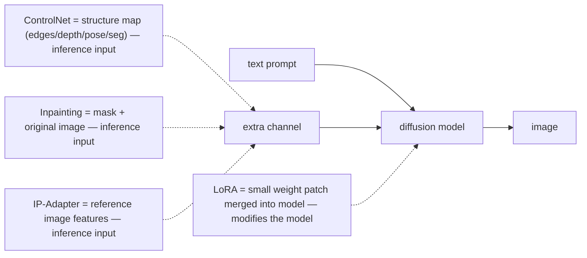
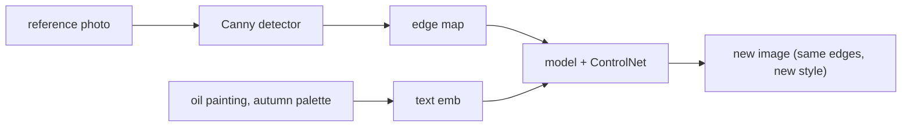
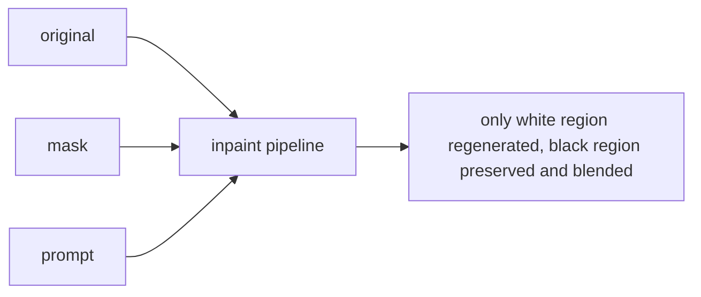
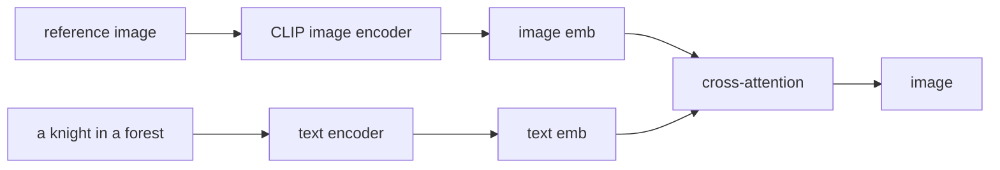

# Lecture 13: Controlled Generation & Editing — ControlNet, Inpainting, IP-Adapter, LoRA

> The last lecture taught you to drive a diffusion model with intent — steps, CFG, seed, negative prompt. But intent expressed as *words* has a ceiling. "A knight in the same pose as this reference," "change only the sky, leave everything else pixel-identical," "make it look like *this* photo's style," "render in our brand's specific illustration style" — none of these survive being flattened into a text prompt. This lecture is the jump from *generate from a prompt* to *edit and control precisely*. It surveys the four control mechanisms every practical image pipeline reaches for — **ControlNet** (condition on structure), **inpainting/outpainting** (edit a masked region), **IP-Adapter** (condition on a reference image), and **LoRA** (inject a style or subject) — and, more importantly, teaches you *which one to reach for* when a plain prompt fails. After this you will be able to name the problem each solves, sketch its data flow, write the `diffusers` entry point, and stop trying to prompt-engineer your way out of problems that need a control mechanism instead.

**Prerequisites:** Lecture 12 (diffusion loop, CFG, steps, seed, latent space), what a text/image embedding is (Phase 1), comfort reading a Python pipeline call · **Reading time:** ~30 min · **Part of:** Multimodal & Specialized Modalities, Week 3

---

## The core idea (plain language)

A raw text-to-image model gives you exactly one lever: the prompt. That lever is *coarse*. It can ask for "a cat on a windowsill" but it cannot say "a cat in **this** posture," "keep **this** background untouched," "in **this** art style," or "a picture of **my** specific product." The prompt describes a *category*; it cannot pin a *particular*.

The four mechanisms in this lecture each add a second, orthogonal input channel alongside the prompt, and each pins a different kind of particular:

- **ControlNet** adds a **structure channel**. You extract a skeleton of a reference image — its edges, its depth, a stick-figure of the human pose, a segmentation map — and force the generation to obey that geometry while the prompt controls everything else (style, color, content). *"Keep this layout, change the look."*
- **Inpainting** adds a **mask channel**. You paint a region and say "regenerate only here; everything outside the mask stays byte-identical." Outpainting is the same trick with the mask extending past the original frame. *"Edit this spot, leave the rest."*
- **IP-Adapter** adds an **image-prompt channel**. Instead of describing a style or subject in words, you hand the model a reference *image* and it conditions on that image's visual features. *"Make it look like this."*
- **LoRA** is different in kind: it's a small **patch to the model's weights** that teaches it a specific style or subject you couldn't describe in a prompt at all. *"Generate in a look/subject the base model has never seen."*

The mental model to carry: the first three are **extra inputs at inference time** — you load them, pass an extra argument, done. LoRA is a **modification of the model** — a tiny file you merge in that changes what the model *knows*. That distinction drives everything about when and how you use each.



---

## How it actually works (mechanism, from first principles)

### ControlNet — conditioning on structure

Recall from Lecture 12 that generation is a denoising loop, and at each step a neural network (the UNet, for SDXL-family models) predicts the noise to subtract, conditioned on your text embedding. ControlNet inserts a **second conditioning signal** into that same prediction.

The flow has three stages, and you must respect the order:

**1. Preprocess** — turn your reference image into a *control map*. This is a cheap, deterministic computer-vision step, not a diffusion step:
   - **Canny** — run a Canny edge detector; you get a black image with white outlines.
   - **Depth** — run a depth estimator (MiDaS/DPT); you get a grayscale map, near = bright, far = dark.
   - **OpenPose** — run a pose estimator; you get a stick-figure skeleton of the human(s).
   - **Segmentation** — run a segmenter; you get flat colored regions per object class.

**2. Condition** — feed that control map into a ControlNet, which is a **trainable copy of the model's encoder** wired into the frozen base model. It nudges every denoising step toward respecting the map's geometry.

**3. Generate** — run the normal denoising loop. The prompt still controls style and content; the control map holds the composition fixed.



The key intuition: **the control map is a soft cage.** The generation happens inside it. A Canny map of a person standing with arms crossed will produce a *different* person, *different* clothes, *different* style — but standing with arms crossed, because the edges pin that. Pick your preprocessor by *what you need to preserve*: Canny for precise outlines (logos, architecture), depth for 3D layout and spatial relationships, OpenPose for human posture only (ignores clothing/background), segmentation for object placement.

One knob to know: **`controlnet_conditioning_scale`** (0–1+). At 1.0 the model obeys the map tightly; lower it (0.5–0.7) to loosen the cage when the structure is fighting the prompt.

### Inpainting — editing only a masked region

Inpainting solves a problem regular generation structurally *cannot*: "change this one thing, keep the other 90% exactly as-is." A regular text-to-image run regenerates the entire canvas from noise — there is no way to say "but keep the left half."

The mechanism is a masked denoising loop. You provide three things: the **original image**, a **binary mask** (white = regenerate, black = keep), and a **prompt** for the masked region. At each denoising step, the pipeline:
- denoises the *whole* latent as usual, guided by the prompt,
- but then **overwrites the un-masked (black) region** with the correctly-noised version of the *original* image at that noise level.

So the masked region evolves freely toward the prompt, while the rest is continuously "pinned" back to the original. By the last step, outside the mask you get (near-)pixel-identical original, inside the mask you get new generated content that blends at the seam.



**Outpainting** is the same mechanism with a twist: you paste the original onto a *larger* canvas, mask the new empty border, and inpaint it — the model extends the scene beyond the original frame. Typical uses: **remove an object** (mask it, prompt the background), **replace a region** (mask a shirt, prompt "red leather jacket"), **extend background** (outpaint a portrait into a wider landscape).

Two production gotchas baked into the mechanism: **mask feathering** (a hard mask edge produces a visible seam; blur the mask a few pixels so the blend is gradual) and **context** — some pipelines only feed the model a crop around the mask, so a huge image with a tiny mask can lose global coherence unless you crop-and-stitch deliberately.

### IP-Adapter — conditioning on a reference image

Sometimes the thing you want is a *look* or a *subject* you cannot put into words. "Make it feel like this Wes-Anderson-y pastel symmetric frame" is a paragraph of hedging; handing the model the actual frame is one image. IP-Adapter ("Image Prompt Adapter") lets the reference *image itself* act as (part of) the prompt.

Mechanically: the reference image goes through an image encoder (a CLIP-style vision encoder), producing image embeddings. A small trained adapter projects those into the same space the model's cross-attention already uses for text — so the model attends to the *image* the way it attends to *words*. The critical property: **no retraining.** You load an IP-Adapter weight file onto an existing base model and pass a reference image at inference. It composes with the text prompt (you set a weight to balance "how much this image" vs "how much these words").



Use it for **style transfer** ("this painting's style, my subject") and **subject/face consistency** ("this person/product across many scenes"; there are face-specialized IP-Adapter variants). It's the fastest path to "look like this" because there's zero training loop — just a file and an argument.

### LoRA — a lightweight fine-tuned adapter

The other three are inference-time inputs. LoRA (Low-Rank Adaptation) is the odd one out: it's an actual **fine-tune of the model**, just an extremely cheap one. When prompt words and reference images both fail — because the concept simply isn't *in* the base model (your company's exact illustration style, a specific character, a particular product from 30 angles) — you teach it.

The "low-rank" trick is why LoRAs are tiny. Fully fine-tuning SDXL means updating billions of weights (gigabytes). Instead, for each big weight matrix, LoRA freezes the original and learns a small pair of low-rank matrices whose product is added on top. That product approximates the needed change with a **tiny fraction** of the parameters — a typical SDXL LoRA is on the order of **~10–200 MB**, versus a multi-GB full model. Practical consequences you must know:

- **Small and shareable** — a style LoRA is a single small file (Civitai/HF are full of them).
- **Composable** — you can load *multiple* LoRAs and weight each (`set_adapters(["style","subject"], [0.8, 0.6])`), stacking a style onto a subject.
- **Swappable** — load/unload at runtime without touching the base model in VRAM.

**When a LoRA beats prompt engineering:** when the concept is *not describable* or *not present*. If ten prompt iterations still can't get your brand's exact flat-illustration look, or a specific person's face, that's the signal — stop prompting, train (or download) a LoRA. Rule of thumb: prompts and IP-Adapter for things the model *can already almost do*; LoRA for things it *can't do at all*.

---

## Worked example

You have a product-photography problem. Marketing shot a hero image of a sneaker on a plain studio background, standing at a specific three-quarter angle. They want (a) the *same sneaker in the same pose* re-lit as a dramatic sunset scene, and (b) the plain background swapped for a beach — but the sneaker itself untouched. Watch how each tool maps to a sub-problem.

**Sub-problem A: keep the pose/geometry, change the whole scene → ControlNet (Canny or depth).**

```python
import torch
from diffusers import StableDiffusionXLControlNetPipeline, ControlNetModel
from controlnet_aux import CannyDetector   # a preprocessor
from PIL import Image

ref = Image.open("sneaker_studio.png")
canny = CannyDetector()(ref)               # 1. PREPROCESS -> edge map

controlnet = ControlNetModel.from_pretrained(
    "diffusers/controlnet-canny-sdxl-1.0", torch_dtype=torch.float16)
pipe = StableDiffusionXLControlNetPipeline.from_pretrained(
    "stabilityai/stable-diffusion-xl-base-1.0",
    controlnet=controlnet, torch_dtype=torch.float16).to("cuda")

image = pipe(
    prompt="a sneaker on a beach at golden-hour sunset, dramatic warm light",
    image=canny,                           # 2. CONDITION on structure
    controlnet_conditioning_scale=0.8,     # loosen the cage a little
    num_inference_steps=30, guidance_scale=7.0,
    generator=torch.Generator("cuda").manual_seed(42),
).images[0]                                # 3. GENERATE
```

The edge map holds the sneaker's silhouette and lacing geometry; the prompt supplies the beach and lighting. At `conditioning_scale=1.0` the shape locks hard; at `0.8` it can bend slightly to fit the new lighting. This is *keep layout, change style* in one call.

**Sub-problem B: swap only the background, sneaker byte-identical → inpainting.**

```python
from diffusers import StableDiffusionXLInpaintPipeline
pipe = StableDiffusionXLInpaintPipeline.from_pretrained(
    "diffusers/stable-diffusion-xl-1.0-inpainting-0.1", torch_dtype=torch.float16).to("cuda")

# mask: WHITE over the background, BLACK over the sneaker (feathered a few px)
image = pipe(
    prompt="sandy beach with soft waves, golden-hour light",
    image=ref, mask_image=background_mask,
    num_inference_steps=30, guidance_scale=7.0,
    generator=torch.Generator("cuda").manual_seed(42),
).images[0]
```

Here the sneaker (black in the mask) is pinned to the original every step, so it survives untouched; only the white background region is regenerated. Note the *same mechanism could remove a scuff* — mask the scuff, prompt "clean white sneaker fabric."

**Sub-problem C: "match the vibe of last season's campaign photo" → IP-Adapter.** Load an IP-Adapter, pass last season's hero shot as `ip_adapter_image`, and its color grade / composition sensibility conditions the new render without you writing a word about it.

**Sub-problem D: "always in our house 2D-illustration brand style" → LoRA.** No prompt reliably reproduces your exact brand illustration look, so you train a small style LoRA once on ~20–50 brand images, then `pipe.load_lora_weights("brand_style.safetensors")` and every generation inherits the style — and you can stack it with a subject LoRA at weights `[0.9, 0.7]`.

The lesson of the worked example is the *decomposition*: a real editing task is rarely one tool. You route each requirement — geometry, locality, reference-look, unlearnable-concept — to the mechanism built for it.

---

## How it shows up in production

**Each control channel is extra latency and extra failure surface.** ControlNet adds a preprocessing pass (edge/depth/pose detection — usually cheap, tens of ms) *and* increases per-step cost because the ControlNet branch runs alongside the base UNet. Budget roughly a **20–50% latency bump** over plain generation (approximate — measure on your hardware). Multi-ControlNet (stacking depth + pose) stacks that cost.

**Inpainting is the highest-ROI editing primitive in most products.** "Remove this object," "replace this region," "extend this image" are concrete user features that map 1:1 to one inpaint call. It's also where **mask quality dominates output quality** — most "the edit looks bad" tickets are a hard/misaligned mask, not the model. Invest in good masking (SAM/Segment-Anything to auto-generate masks, then feather).

**LoRA is an ops story, not just a model story.** Because LoRAs are small and swappable, a mature image product keeps a *library* of them (per-brand, per-style, per-customer) and hot-loads the right ones per request. That's a real advantage over full fine-tunes: you serve one base model in VRAM and swap ~50 MB adapters instead of loading a fresh multi-GB model per style. But **LoRA + base-model version coupling bites** — an SDXL LoRA won't load on FLUX or SD 1.5; when you upgrade the base model, your whole LoRA library may need retraining.

**IP-Adapter is the "no training budget, need it today" lever.** When a client wants style/subject transfer this week, IP-Adapter ships without a training pipeline. The tradeoff: it's less precise and less reliable than a purpose-trained LoRA. The typical maturity path is *IP-Adapter to prototype, LoRA when it becomes core*.

**These mechanisms compose — and composition is where quality and cost explode.** A production "generate my character in a new scene, this style, keeping this pose" pipeline can be *LoRA (character) + LoRA (style) + ControlNet (pose) + IP-Adapter (color reference)* in a single call. It works, but every added channel is more VRAM, more latency, and more knobs to tune. Add them one at a time and measure between additions, or you won't know which channel broke the output.

---

## Common misconceptions & failure modes

- **"ControlNet copies the reference image."** No — it copies its *structure* (edges/depth/pose), not its pixels or style. If you wanted the *look* copied, that's IP-Adapter, not ControlNet.
- **"I'll just prompt harder instead of using a control tool."** Prompts can't pin geometry, locality, or a specific unlearnable subject. Ten prompt iterations that keep failing is the signal to switch channels — that's the entire *when-to-reach-for-each* skill.
- **"Inpainting keeps everything else identical, so the mask doesn't matter."** The mask is *the whole game*. A hard edge leaves a visible seam; a mask that overlaps the subject regenerates part of it. Feather the mask, and align it precisely.
- **"A LoRA is a whole model."** It's a tiny weight *patch* (~10–200 MB) that only works merged onto the *specific base model* it was trained for. Wrong base version = it won't load or produces garbage.
- **"IP-Adapter and LoRA do the same thing."** IP-Adapter conditions on a reference *at inference* with no training; LoRA *modifies the model weights* via training. Use IP-Adapter for "look like this image now," LoRA for "learn this concept permanently."
- **"More ControlNet is always better."** `conditioning_scale=1.0` can over-constrain and fight the prompt, producing stiff or artifact-laden results. Loosen to 0.5–0.8 when structure and prompt conflict.
- **"Outpainting is a different model."** It's inpainting on an enlarged canvas with the new border masked. Same pipeline, bigger frame.

---

## Rules of thumb / cheat sheet

```
WHEN TO REACH FOR EACH
  Keep the LAYOUT/POSE, change the look ........... ControlNet
     precise outlines (logos, buildings) ......... Canny
     3D spatial layout / depth relationships ..... Depth (MiDaS/DPT)
     human posture only .......................... OpenPose
     object placement by class ................... Segmentation
  Edit ONE region, keep the rest identical ........ Inpainting
  Extend beyond the frame ......................... Outpainting (inpaint on bigger canvas)
  "Make it look like THIS image" (no training) .... IP-Adapter
  Concept the model can't do at all / your brand .. LoRA (train or download)

KNOBS
  controlnet_conditioning_scale  1.0 = obey map tightly; 0.5-0.8 = loosen when fighting prompt
  inpaint mask                   WHITE = regenerate, BLACK = keep; FEATHER the edge
  ip_adapter scale               balance reference-image vs text prompt
  LoRA weight                    set_adapters([...],[w1,w2]) to stack/balance multiple LoRAs

MENTAL MODEL
  ControlNet / Inpaint / IP-Adapter = extra INPUT at inference (load + pass an argument)
  LoRA = small WEIGHT PATCH merged into the model (modifies what it knows)

GOTCHAS
  LoRA/IP-Adapter/ControlNet are tied to the BASE MODEL version (SDXL != FLUX != SD1.5)
  Every added channel = more VRAM + latency; add one at a time and measure
  Bad inpaint output is usually a bad MASK, not the model
```
*(Ranges are practitioner rules of thumb, not measured benchmarks — verify on your model/hardware.)*

`diffusers` entry points you'll actually touch:

```python
# ControlNet
from diffusers import StableDiffusionXLControlNetPipeline, ControlNetModel
# Inpainting
from diffusers import StableDiffusionXLInpaintPipeline
# IP-Adapter (loaded onto a normal pipeline)
pipe.load_ip_adapter("h94/IP-Adapter", subfolder="sdxl_models", weight_name="ip-adapter_sdxl.bin")
pipe(prompt=..., ip_adapter_image=ref).images[0]
# LoRA
pipe.load_lora_weights("path/or/hf-id", adapter_name="brand_style")
pipe.set_adapters(["brand_style"], adapter_weights=[0.9])
```

---

## Connect to the lab

This lecture is the theory behind **Week 3, Lab Part 1 (image gen + control)** — specifically the two control deliverables that follow your contact sheet: **one inpainting edit** (mask a region, change it, verify the rest is untouched) and **one ControlNet run** (Canny edge → new style, keeping structure). Reuse the exact `diffusers` pipeline object from Lecture 12; you're adding a control channel, not starting over. Do it on Colab/Modal or a fal/Replicate endpoint since SDXL/ControlNet need a GPU. IP-Adapter and LoRA are "know they exist and where the entry point is" for the lab — try one `load_ip_adapter` or `load_lora_weights` call if you have GPU time to spare.

---

## Going deeper (optional)

- **Hugging Face `diffusers` documentation** — root: `huggingface.co/docs/diffusers`. Read the **ControlNet** guide, the **Inpainting** guide, the **IP-Adapter** guide, and the **LoRA / "Load adapters"** page — these are the canonical, current entry points this lecture points at.
- **ControlNet paper (intuition):** *"Adding Conditional Control to Text-to-Image Diffusion Models"* (Zhang et al., 2023) — the trainable-encoder-copy idea. Search the title.
- **IP-Adapter paper:** *"IP-Adapter: Text Compatible Image Prompt Adapter for Text-to-Image Diffusion Models"* (Ye et al., 2023). Search the title.
- **LoRA paper:** *"LoRA: Low-Rank Adaptation of Large Language Models"* (Hu et al., 2021) — originally for LLMs, the same low-rank idea powers image LoRAs. Search the title.
- **Preprocessors:** the **`controlnet_aux`** library (Canny/OpenPose/depth detectors) and **Segment Anything (SAM)** for auto-masking inpaint regions — search `controlnet_aux GitHub` and `Segment Anything Meta`.
- **Community model hubs:** **Civitai** and Hugging Face for downloadable LoRAs/ControlNets, and **ComfyUI** docs for how these compose in a node graph — search `ComfyUI ControlNet` and `Civitai LoRA`.
- **Search queries worth running:** `diffusers controlnet_conditioning_scale`, `diffusers inpaint mask feathering`, `IP-Adapter vs LoRA when to use`, `SDXL LoRA training kohya`.

---

## Check yourself

1. A user wants to keep the exact composition of a reference photo but render it as a watercolor. Which mechanism, which preprocessor, and why not just prompt "watercolor, same composition"?
2. Explain, in terms of the masked denoising loop, *why* inpainting can leave the un-masked region pixel-identical while regenerating the mask.
3. You need "style transfer from this one reference image" shipped by Friday with no training pipeline. Which tool, and what's the tradeoff versus the more precise alternative?
4. A teammate downloads a great-looking LoRA but it errors or produces garbage on your FLUX pipeline. What's the most likely cause?
5. Give the one-line "when to reach for each" for ControlNet vs inpainting vs IP-Adapter vs LoRA.
6. Your ControlNet output is stiff and won't follow the prompt's lighting change. Which knob do you turn and in which direction?

### Answer key

1. **ControlNet** with the **Canny** (or depth) preprocessor: extract the reference's edges/structure, then generate with the prompt "watercolor…" so the map holds the composition while the prompt changes the medium. Prompting "same composition" fails because a text prompt describes a category, not a specific geometry — the model has no way to reproduce *that exact* layout from words. ControlNet adds the missing structure channel.

2. At every denoising step the pipeline denoises the whole latent toward the prompt, but then **overwrites the black (keep) region with the correctly-noised version of the original image** at that step's noise level. So the un-masked region is continuously pinned back to the original and ends (near-)identical, while the white region is free to evolve toward the prompt and blends at the (feathered) seam.

3. **IP-Adapter** — load the adapter file onto your existing base model and pass the reference as `ip_adapter_image`; zero training. The tradeoff: it's less precise and less reliable than a **LoRA** trained specifically on that style, which would be the choice if the style becomes core and you have training budget/time. Typical path: IP-Adapter to prototype, LoRA when it matters.

4. **Base-model version mismatch.** LoRAs are small weight patches tied to the specific base architecture they were trained on. An SDXL (or SD 1.5) LoRA will not load correctly on FLUX — different architecture, incompatible weights. You need a LoRA trained for that exact base.

5. ControlNet = keep the **layout/pose**, change the look (structure channel). Inpainting = edit **one masked region**, keep the rest identical (mask channel). IP-Adapter = "make it look like **this image**" with no training (image-prompt channel). LoRA = teach the model a **concept it can't do at all** / your brand style (weight patch, requires training).

6. Lower **`controlnet_conditioning_scale`** (e.g. from 1.0 toward 0.5–0.8). At 1.0 the structure map over-constrains the generation and fights the prompt; loosening the cage lets the model bend geometry enough to satisfy the new lighting while still respecting the overall layout.
