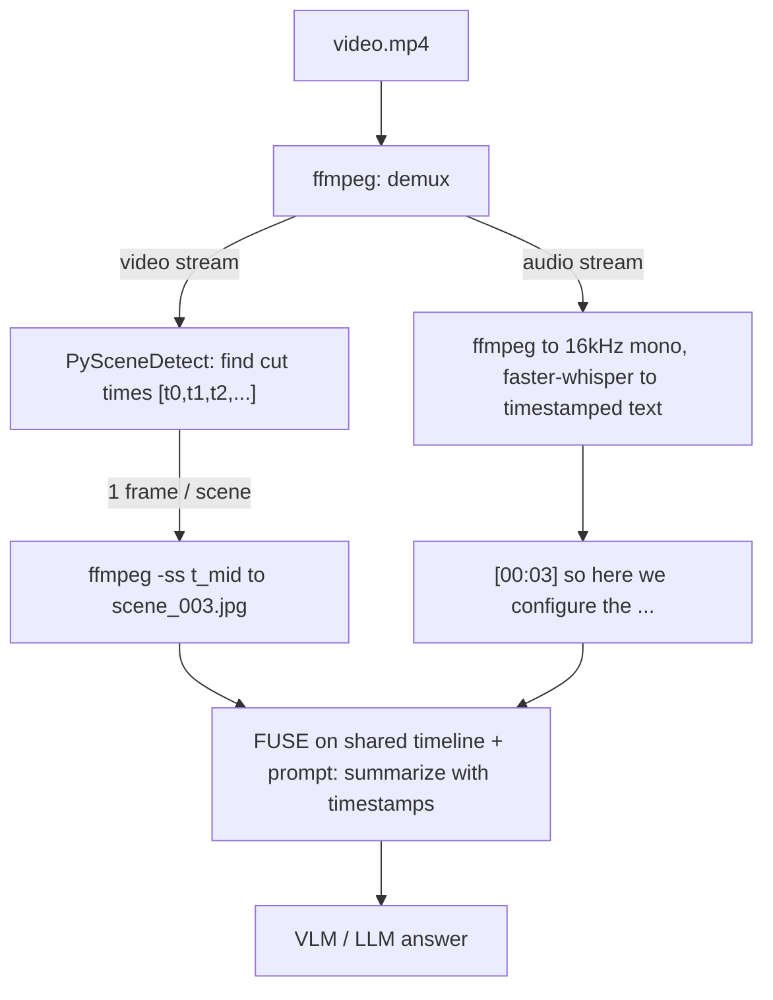

# Lecture 14: Video Understanding Without a Token Bomb — Frame Sampling, Scene Detection, ASR Fusion

> A video is the single easiest way to detonate your token budget. It *looks* like "just another modality," so the naive instinct is to loop over frames and send them all to a VLM — and then a 60-second clip quietly bills you like a 200-page document and takes half a minute to answer one question. The professional move is the opposite of thorough: you throw almost every frame away on purpose. After this lecture you can build a video-understanding pipeline that samples one representative frame per *shot* (not per frame), rips the audio and transcribes it with the same faster-whisper you already know, fuses the two into a compact timestamped summary a VLM can actually afford to read — and defend the arithmetic that says why this is 100–1000× cheaper than the obvious approach.

**Prerequisites:** Lecture 2 (image tokens & tiling — how one image becomes token blocks), Lecture 9 (faster-whisper / VAD), comfort shelling out to `ffmpeg`, basic Python · **Reading time:** ~30 min · **Part of:** Phase 12 Week 3

---

## The core idea (plain language)

A video is three things bolted together: a **stream of images** (frames), an **audio track**, and **time**. VLMs don't understand "video" — they understand images and text. So "video understanding" is not a special model capability; it is a **preprocessing discipline** that turns a video into a small set of images plus some text, cheap enough to fit in a context window.

The naive approach — decode every frame, send every frame — is a catastrophe for one reason you already learned in Lecture 2: **an image is just more tokens.** A single frame at modest resolution is on the order of hundreds to ~1000+ image tokens depending on the provider's tiling. Now multiply by frame rate times duration. A one-minute clip at 30 frames per second is **1,800 frames**. Even at a conservative ~500 tokens per frame that is **900,000 image tokens** for sixty seconds of footage — more than most models' entire context window, and if it fit, it would cost multiple dollars and tens of seconds *per query*. That is the token bomb.

The sane default has three moves:

1. **Sample frames — don't send them all.** Either at a **fixed interval** (one frame every N seconds) or, much better, on **scene changes** detected by PySceneDetect, so you keep exactly one representative frame per visually distinct shot. A 3-minute product demo might have 12 real "scenes"; you send 12 images, not 5,400.
2. **Extract and transcribe the audio.** Rip the audio track with `ffmpeg`, run faster-whisper (Lecture 9) to get a **timestamped transcript**. Speech carries most of the *semantic* content in talking-head, tutorial, meeting, and interview video — and text is 1–2 orders of magnitude cheaper than images per unit of information.
3. **Fuse and summarize.** Interleave the sampled-frame descriptions and the transcript on a shared timeline and hand that compact multimodal package to a VLM/LLM: "summarize this video with timestamps." The model reasons over a few images and some text instead of a firehose of pixels.

Do this and you've also built **Video RAG**: index those per-scene frames and transcript chunks, and retrieval-then-answer works exactly like the document RAG from Phase 4 — the substrate is just video segments now.

---

## How it actually works (mechanism, from first principles)

### The pipeline



### Why every frame is redundant

Video is compressible precisely because consecutive frames are nearly identical. At 30fps, frame *n* and frame *n+1* differ by about 33 milliseconds of motion — a few pixels. This is why codecs like H.264 store one full **keyframe (I-frame)** and then only *deltas* (P/B-frames) until the next scene. Your VLM does not benefit from 30 near-duplicate images of the same static talking head; it sees the same information 30 times and pays 30 times. **The signal lives at the boundaries** — the moments the picture *changes*.

### Fixed-interval sampling (the crude baseline)

The simplest sampler: grab one frame every N seconds. `ffmpeg` does this with a frame-rate filter:

```bash
# one frame every 2 seconds (fps = 0.5), scaled down to 768px long edge
ffmpeg -i video.mp4 -vf "fps=1/2,scale='min(768,iw)':-2" -q:v 3 frames/f_%04d.jpg
```

For a 180-second video that's 90 frames — already 20× better than every-frame, but *dumb*: it oversamples static stretches (a 40-second unchanging slide → 20 identical frames) and can *miss* a fast cut that happens between samples. Use it only when you have no better option or the content is genuinely uniform.

### Content-aware scene detection (the right default)

**PySceneDetect's `ContentDetector`** does what fixed-interval can't: it samples *where the content actually changes*. Mechanism, from first principles:

1. Convert each frame to the **HSV** color space (hue/saturation/value separates color from brightness better than raw RGB for this).
2. Compute a **frame-to-frame difference score** — roughly the average per-pixel change across H, S, and V between consecutive frames.
3. When that score **exceeds a threshold** (default `27.0`), declare a **cut** at that timecode.

Low threshold → sensitive → more, shorter scenes (catches subtle changes, risks splitting on lighting flicker). High threshold → only hard cuts. `27` is a sane starting point for edited footage; raise toward 30–40 for noisy/handheld video that flickers, lower toward ~20 if you're missing soft transitions.

```python
from scenedetect import detect, ContentDetector

# returns a list of (start, end) FrameTimecode pairs, one per scene
scenes = detect("video.mp4", ContentDetector(threshold=27.0))
for i, (start, end) in enumerate(scenes):
    print(i, start.get_timecode(), "->", end.get_timecode(),
          start.get_seconds(), end.get_seconds())
```

The output is your **cut list**: `[(0.0, 4.2), (4.2, 11.8), (11.8, 12.9), ...]`. There is no ML model download here — `ContentDetector` is a fast pixel-statistics pass over decoded frames, so it runs on CPU in roughly real-time-ish (faster for low-res, slower for 4K; downscale first if you only need boundaries).

### Grabbing one representative frame per scene

You want the frame that best *represents* the shot. The midpoint of the scene is a robust default (avoids transition blur at cut boundaries). Seek to it with `ffmpeg`:

```python
import subprocess, os

def grab_frame(video, t_seconds, out_path, long_edge=768):
    # -ss BEFORE -i = fast input seek; -frames:v 1 = one frame; scale down
    subprocess.run([
        "ffmpeg", "-y", "-ss", f"{t_seconds:.3f}", "-i", video,
        "-frames:v", "1",
        "-vf", f"scale='min({long_edge},iw)':-2",
        "-q:v", "3", out_path
    ], check=True, stdout=subprocess.DEVNULL, stderr=subprocess.DEVNULL)

for i, (start, end) in enumerate(scenes):
    mid = (start.get_seconds() + end.get_seconds()) / 2
    grab_frame("video.mp4", mid, f"frames/scene_{i:03d}.jpg")
```

Two `ffmpeg` details that bite people: put `-ss` **before** `-i` for a fast keyframe-accurate-enough seek (putting it after `-i` decodes from the start — accurate but slow on long files); and **downscale on extraction** (`scale=...`) so you never even create the giant frame you'd have to shrink later.

### Extracting and transcribing the audio

Demux the audio to 16 kHz mono WAV — exactly what Whisper wants (Lecture 9):

```bash
ffmpeg -i video.mp4 -vn -ac 1 -ar 16000 audio.wav
#           -vn = drop video   -ac 1 = mono   -ar 16000 = 16kHz
```

Then transcribe with **word/segment timestamps** and VAD gating (silence in video → Whisper hallucinations, same trap as Lecture 9):

```python
from faster_whisper import WhisperModel

model = WhisperModel("base.en", compute_type="int8")   # CPU-friendly
segments, info = model.transcribe("audio.wav", vad_filter=True)
transcript = [(s.start, s.end, s.text.strip()) for s in segments]
# -> [(0.0, 3.4, "so here we configure the pipeline"), (3.4, 6.1, "...")]
```

### Fusing on a shared timeline

The fusion step is just formatting: interleave frame captions and transcript segments by timestamp so the VLM sees *what was on screen* and *what was said* together.

```
[00:00–00:04] SCENE 1 image: title slide "Q3 Onboarding Pipeline"
[00:00–00:03] speech: "so here we configure the pipeline"
[00:04–00:12] SCENE 2 image: terminal running an install command
[00:03–00:06] speech: "first install the dependencies with uv"
...
```

You can caption each frame with a cheap VLM call first, *or* — cheaper and often better — send the handful of frames as actual images alongside the transcript text in one multimodal request, and let the answering VLM look at them directly. Either way the prompt is: *"Here are key frames and the transcript of a video. Summarize it with timestamps; cite the timecode for each point."*

---

## Worked example

A **3-minute (180s) tutorial screencast, 30fps, 1080p.** Talking head + slides + occasional terminal.

**Naive every-frame:**
- Frames = 180 × 30 = **5,400 frames.**
- At ~1000 image tokens/frame (1080p tiled at high detail), that's **5,400,000 image tokens.**
- This exceeds every mainstream context window (Gemini's ~1–2M is the largest, and you'd blow past it). If it *did* fit at, say, an approximate $2–5 per million input tokens, you'd pay **~$10–27 per single query** and wait tens of seconds. Untenable.

**Scene-sampled + ASR fusion:**
- PySceneDetect finds, say, **14 scenes.** One frame each, downscaled to 768px ≈ ~300 tokens/frame → 14 × 300 = **~4,200 image tokens.**
- Transcript: ~180s of speech ≈ ~400 spoken words ≈ **~550 text tokens.**
- Fusion prompt + instructions ≈ ~300 tokens.
- **Total ≈ ~5,050 tokens.**

**The ratio:** 5,050 vs 5,400,000 ≈ a **~1,000× reduction** in tokens for this clip. Even against a *reasonable* fixed-interval baseline (1 frame/sec = 180 frames ≈ 54,000 image tokens), scene sampling is still ~10× cheaper *and* higher quality because it never sends 20 copies of the same slide. Cost drops from "unpayable" to **a fraction of a cent**, latency from tens of seconds to ~1–2s, and — this is the part people miss — **answer quality often goes up**, because the model isn't drowning in redundant frames and can actually attend to the 14 that matter. (All token/price figures here are order-of-magnitude estimates to reason with, not quoted benchmarks; measure your own provider.)

---

## How it shows up in production

- **The bill and the context-window error arrive together.** Your first every-frame attempt won't even run — the API rejects it for exceeding the context window, or your Gemini bill for a batch of videos is 100× the estimate. Both are the same root cause. Sampling is not an optimization you add later; it's the thing that makes video work *at all*.
- **Audio is where the meaning is — for the right genres.** For lectures, meetings, interviews, tutorials, and product demos, the transcript alone answers most questions and the frames are supporting evidence. For silent/ambient video (surveillance, sports highlights, b-roll, cooking with no narration) it flips: frames carry the signal and the transcript is empty or useless. Know which regime you're in before you tune anything.
- **Scene threshold is a per-corpus knob.** Screen recordings with hard slide transitions detect cleanly at `27`. Handheld phone video with autofocus hunting and lighting flicker will over-segment — you'll get 200 "scenes" of the same wobbling shot. Raise the threshold, or add a `min_scene_len` so no scene is shorter than, say, 15 frames. Watch out for **long static shots**: a 90-second unmoving lecture slide is *one* scene, so you send *one* frame — usually correct, but if the presenter writes on it progressively you'll miss the later state. Combine scene detection with a max-interval fallback (force a frame at least every N seconds within a long scene) when that matters.
- **Fades and cross-dissolves fool content detection.** A slow dissolve changes the frame gradually, so no single frame-to-frame diff crosses the threshold — the cut is missed or placed late. PySceneDetect ships a separate `ThresholdDetector` (for fades to/from black) and `AdaptiveDetector` (rolling average, better for gradual changes and fast camera motion). Reach for `AdaptiveDetector` on cinematic footage.
- **Timestamp drift breaks citations.** If your frame timecodes and Whisper's segment timecodes come from slightly different clocks (e.g. you trimmed the video for frames but not for audio), your fused timeline lies and the "summary with timestamps" points to the wrong moment. Extract both from the *same* source file and keep everything in seconds from t=0.
- **`ffmpeg` seek accuracy vs speed is a real tradeoff.** Fast seek (`-ss` before `-i`) lands on the nearest keyframe, which can be off by up to a GOP length (often ~0.5–2s). For representative-frame grabbing that's fine. If you need frame-exact extraction, seek after `-i` and eat the decode cost, or extract all frames of just that scene's range.
- **Video RAG is this pipeline, persisted.** For a searchable video library you run the pipeline once at ingest: store each scene's frame + its transcript window + timecode as a retrievable chunk (text-embed the transcript, optionally ColPali-embed the frame — Lecture 7). At query time you retrieve the top-k relevant *segments* and answer with just those frames+text. Same retrieve-then-generate discipline as Phase 4; the chunk is now a `(timecode, frame, transcript)` triple.

---

## Common misconceptions & failure modes

- **"The VLM understands video natively, so I just upload the file."** Some APIs (Gemini) *accept* a video file and sample it for you server-side — convenient, but you've handed away the cost/quality knobs and you still pay for the sampled frames. Understand the pipeline even when a provider hides it, so you can predict the bill and override the sampling density.
- **"More frames = better answers."** Past the point of one-frame-per-distinct-shot, extra frames add tokens and *noise*, not information, and can degrade the answer by diluting attention. Sample tighter, not looser.
- **"I'll caption frames and drop the audio to save tokens."** For talking-head content you just deleted 80% of the meaning. Frames tell you *what it looked like*; the transcript tells you *what happened*. Fuse both.
- **Skipping VAD on the audio.** Video has long silent stretches (title cards, pauses). Whisper hallucinates "Thank you for watching" on them (Lecture 9). `vad_filter=True` is as mandatory here as in the voice lab.
- **Trusting the default threshold on every corpus.** `27` is a starting point, not a law. Always eyeball the scene count: 3-minute video → 200 scenes means over-segmentation; → 2 scenes on a fast-cut trailer means under-segmentation. Tune per corpus.
- **Full-resolution frames.** A 4K frame tiled at high detail is thousands of tokens *each* — the Lecture 2 blowup, now multiplied by scene count. Downscale the long edge to ~768–1024px on extraction; receipts and slides stay readable and tokens plummet.

---

## Rules of thumb / cheat sheet

- **Never send every frame.** Sample. This is the whole lecture in three words.
- **Default sampler: PySceneDetect `ContentDetector(threshold=27.0)`, one frame at each scene's midpoint.** Fall back to fixed-interval only for genuinely uniform content or when you can't decode for detection.
- **Downscale frames to ~768px long edge on extraction** (`-vf scale='min(768,iw)':-2`). Never send 4K frames to a VLM.
- **Always extract + transcribe the audio** (`ffmpeg -vn -ac 1 -ar 16000`), with faster-whisper + `vad_filter=True`. Text is ~100–1000× cheaper per unit meaning than frames.
- **Fuse on one timeline; ask for timestamped output.** The transcript gives you the timecodes for free.
- **Sanity-check the scene count** against video length before you trust the sampling. ~1 scene per 3–15s of edited video is normal.
- **Tune the threshold per corpus:** raise it for noisy/handheld (fewer false cuts); use `AdaptiveDetector` for dissolves and heavy motion; add `min_scene_len` to stop micro-scenes.
- **Add a max-interval fallback** inside very long scenes (force a frame every ~20–30s) so progressively-changing static shots aren't under-sampled.
- **Order-of-magnitude budget:** frames × ~300–1000 tokens + transcript words × ~1.3 tokens. Estimate *before* you send.
- **Video RAG = this pipeline run at ingest,** storing `(timecode, frame, transcript)` chunks for retrieval.

---

## Connect to the lab

This is **Week 3, Lab Part 2 (video understanding, ~1.5 hrs)**. You will `ffmpeg`-extract the audio from a short clip and transcribe it with the faster-whisper setup from your Week 2 voice build, run PySceneDetect to get scene boundaries and grab one frame per scene, then send the sampled frames + transcript to a VLM with "summarize this video with timestamps." The deliverable that matters: **record the token count of your sampled approach vs the naive every-frame estimate** — that number, on your own clip, is the point of the exercise.

---

## Going deeper (optional)

- **PySceneDetect documentation** — `scenedetect.com` (official docs; the "Detectors" and "Python API" pages cover `ContentDetector`, `AdaptiveDetector`, `ThresholdDetector`, `min_scene_len`, and the `detect()`/`split_video_ffmpeg()` helpers). Repo: search `PySceneDetect GitHub`.
- **ffmpeg documentation** — `ffmpeg.org/documentation.html`, plus the community **FFmpeg Wiki** (search `ffmpeg wiki seeking` and `ffmpeg wiki create thumbnails`) for the canonical `-ss` seek-accuracy and frame-extraction recipes.
- **faster-whisper** — search `faster-whisper GitHub` for the `WhisperModel` API, `vad_filter`, and `word_timestamps` (also covered in Lecture 9).
- **Provider video guides** — search `Gemini API video understanding` and `OpenAI vision guide` for how each provider samples/tiles video and images server-side, and their token accounting.
- **Video RAG / long-video understanding** — search `video RAG frame sampling`, `Video-LLaVA`, and `LLaVA-NeXT-Video` for how research systems trade frame count against context length; treat the numbers as research-setting, not your production bill.
- **Search queries when you get stuck:** `PySceneDetect ContentDetector threshold tuning`, `ffmpeg extract one frame at timestamp fast seek`, `ffmpeg scene change detection select filter` (ffmpeg has a built-in `select='gt(scene,0.4)'` filter as a lighter-weight alternative to PySceneDetect for quick jobs).

---

## Check yourself

1. A colleague sends a 2-minute, 24fps clip straight to a VLM frame-by-frame and it fails. Estimate the frame count and roughly the image-token count, and name the single root cause of the failure.
2. Why does content-aware scene detection beat fixed-interval sampling on *both* cost and quality for edited video? Give a concrete case where fixed-interval is actively wrong.
3. You run `ContentDetector(threshold=27.0)` on handheld phone footage and get 180 "scenes" for a 90-second clip. What happened, and name two fixes.
4. For a recorded lecture, which modality carries most of the answerable content, and what would you lose by dropping the other? Now answer the same for a silent security-camera clip.
5. Explain, in one sentence each, why you put `-ss` before `-i` when grabbing a representative frame, and why you pass `vad_filter=True` to faster-whisper on a video's audio.
6. What exactly makes "Video RAG" different from the video-summarization pipeline in this lecture, and which steps are shared?

### Answer key

1. Frames ≈ 120s × 24 = **2,880 frames**; at ~500–1000 tokens each that's **~1.4M–2.9M image tokens** — it exceeds the model's context window (and would cost dollars per query if it fit). Root cause: **an image is just more tokens**, and every-frame multiplies that by frame-rate × duration. The fix is to sample.
2. Scene detection sends **one frame per distinct shot**, so it never oversamples static stretches (cost win) *and* never sends near-duplicate frames that dilute the model's attention (quality win); it also samples exactly at the moments the picture changes, which is where the information is. Fixed-interval is actively wrong when a cut happens *between* samples (missed shot) or when a 40s static slide gets sampled 20 times (20 identical, wasted frames).
3. The threshold is too **sensitive** for shaky/flickering footage — autofocus hunting and lighting changes cross the frame-diff threshold and register as false cuts (over-segmentation). Fixes: **raise the threshold** (toward 35–40), set a **`min_scene_len`** so micro-scenes can't form, and/or switch to **`AdaptiveDetector`** which uses a rolling average that's robust to motion.
4. Lecture: the **audio/transcript** carries most answerable content; dropping frames loses only the visual aids (slides, diagrams) — often acceptable, sometimes not. Security camera: **frames** carry everything; the transcript is empty/useless, so dropping audio costs nothing and dropping frames destroys the pipeline. Know the regime before tuning.
5. `-ss` before `-i` does a **fast input seek** to (near) the target timecode instead of decoding the whole file from the start — plenty accurate for a representative frame and far faster on long videos. `vad_filter=True` gates out the **silent stretches** in the audio so Whisper doesn't **hallucinate** phantom text ("Thank you for watching") on them.
6. Video RAG runs this same pipeline **once at ingest** and **persists** each `(timecode, frame, transcript-window)` as a retrievable, indexed chunk, so at query time you **retrieve the top-k relevant segments** and answer with only those — instead of summarizing one whole video on the fly. Shared steps: scene detection, frame sampling, audio extraction + transcription, and the fuse-then-VLM answer. The added steps are chunking, embedding/indexing, and retrieval.
