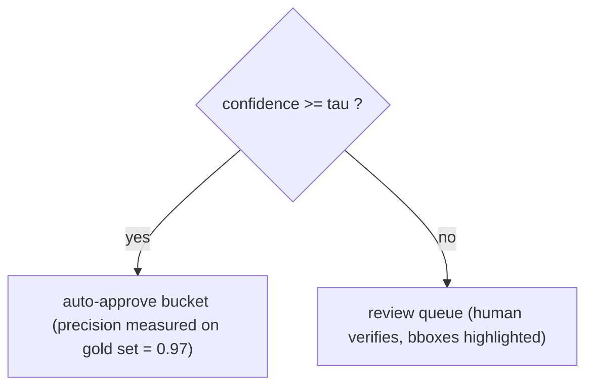

# Lecture 15: Evaluating Multimodal Systems on YOUR Task — CER/WER, Field-F1, Recall@k, Latency, Cost

> A vendor benchmark says a model reads documents at "98.7% accuracy." You wire it into your receipt pipeline and half your foreign-currency totals come out wrong. The benchmark wasn't lying about *its* data — it was lying about *yours*. This lecture is the antidote: the Phase 7 eval discipline dragged out of text and into pixels and audio. After it you will be able to hand-build a stratified gold set of your own documents, pick the *one* metric that matches each task (CER/WER for transcription, field-F1 for extraction, recall@k for retrieval, p50/p95 latency for voice), normalize both sides so error rates don't lie, run a fair bake-off across three VLMs, and pick a default model on **cost-per-correct-answer** instead of vibes — then reuse that same gold set to set the Week 1 confidence-routing threshold with a number you can defend.

**Prerequisites:** Phase 7 (golden sets, LLM-as-judge, the eval mindset), Lecture 3 (structured extraction), Lecture 5 (confidence routing + calibration), Lecture 9 (Whisper/ASR), Lecture 7 (ColPali retrieval) · **Reading time:** ~28 min · **Part of:** Multimodal & Specialized Modalities, Week 3

---

## The core idea (plain language)

Everything you've built in this phase produces output that *looks* right. A VLM emits clean JSON. Whisper emits fluent text. ColPali returns confident page ranks. None of that tells you whether the pipeline is good enough to ship. The only thing that does is a number computed on documents *you* labeled, with a metric that matches the *job* those documents do.

There are two claims in this lecture, and everything else is machinery to serve them.

**Claim 1: leaderboards lie about your data.** Not because they're dishonest — because they're measured on a different distribution. DocVQA, OCRBench, and vendor "accuracy" pages are computed on clean scans, curated crops, English text, standard layouts. Your data is phone photos at 15° skew, faded thermal receipts, and euro amounts written `1.234,56`. A model that tops OCRBench can still fumble your worst stratum. The benchmark's number is real; it's just answering a question you didn't ask.

**Claim 2: the metric must match the task.** "Accuracy" is not one thing. Reading a receipt's raw text is a *transcription* problem — you care about character-level closeness. Pulling out the `total` field is an *extraction* problem — you care about whether the field is exactly right, per field. Finding the right slide is a *retrieval* problem — you care whether the right page is in the top-k. Answering by voice is an *interaction* problem — you care about latency and whether the user's goal was met. Use the wrong metric and you'll optimize the wrong thing: a system with great CER can have terrible field-F1 if it reads every character but puts the tax amount in the total field.

So the job is: build a small, honest, *stratified* gold set once; wire up four metrics; run every candidate model through the identical harness; and read off the answer.

---

## How it actually works (mechanism, from first principles)

### The gold set is the whole game

A gold set is a list of inputs paired with the *true* answer, hand-verified by you. For the receipt pipeline it's JSONL, one row per document:

```json
{"id": "r014", "image": "samples/r014.jpg", "stratum": "phone_photo",
 "gold_fields": {"merchant": "Trader Joe's", "date": "2025-03-11",
                 "currency": "USD", "subtotal": "42.10", "tax": "3.47",
                 "total": "45.57"}}
```

Three design decisions decide whether this gold set is worth anything.

**Size: 25–40 documents is the sweet spot for a solo build.** Not 5 (a single mislabel swings the score 20 points), not 500 (you'll never hand-label it and you'll stop). At ~30 docs, one wrong doc moves aggregate F1 by ~3 points — coarse but honest, and enough to separate a 0.72 model from a 0.91 model. It is *not* enough to trust a 0.90 vs 0.91 difference; know the resolution of your own ruler.

**Stratify, or the aggregate hides a corpse.** Split your docs into buckets that mirror the real failure axes:

| Stratum | Count | Why it's a distinct failure mode |
|---|---|---|
| clean digital | 8 | born-digital PDFs; near-perfect, sets the ceiling |
| phone photo | 12 | skew, glare, shadow — the common case |
| faded / thermal | 6 | low contrast; where OCR and VLMs both crack |
| foreign-currency | 6 | `1.234,56` vs `1,234.56`, non-USD symbols |

If you only report one aggregate number, a model that scores 0.95 on clean digital and 0.55 on faded receipts shows up as ~0.82 — and 0.82 *sounds* shippable. The stratified table screams that a quarter of your real inbound is a coin flip. Always report per-stratum *and* aggregate.

**Label the true values, and label them normalized-ready.** Store `"45.57"`, not `"$45.57"` or `"USD 45.57"`. You'll normalize both sides at compare time (below), but a clean gold value saves you fighting your own labels.

### Metric 1 — CER/WER for transcription (via jiwer)

When the task is "read the text," you measure how far the prediction is from truth using **edit distance**. WER (Word Error Rate) and CER (Character Error Rate) are the same formula at different granularity:

```
        S + D + I
Rate =  ─────────      S=substitutions, D=deletions, I=insertions
           N            N = number of words (WER) or chars (CER) in the reference
```

It's the minimum number of edits to turn the prediction into the reference, divided by the reference length. Worked example — reference `"total 45.57 usd"`, prediction `"total 4557 dollars"`:

- Align word-by-word: `total`✓, `45.57`→`4557` (1 substitution), `usd`→`dollars` (1 substitution). N=3 words.
- WER = (2 + 0 + 0) / 3 = **0.667**. Brutal — because at word granularity `45.57` vs `4557` is a total miss.
- CER on the same strings: reference 15 chars, edits = delete `.` + substitute `usd`→`dollars`... roughly 6 edits / 15 = **0.40**. Gentler, because it gives partial credit for shared characters.

Engineering read: **WER punishes any word-level difference; CER rewards partial character overlap.** For OCR of receipts where you care about digits, CER is usually the right transcription metric because a single misread digit shouldn't nuke the whole line. For ASR of speech, WER is the convention because words are the unit of meaning. Note both can exceed 1.0 (a prediction longer than the reference racks up insertions) — a rate of 1.4 isn't a bug.

Use `jiwer`. Do not hand-roll edit distance:

```python
import jiwer
transform = jiwer.Compose([
    jiwer.ToLowerCase(),
    jiwer.RemovePunctuation(),
    jiwer.RemoveMultipleSpaces(),
    jiwer.Strip(),
])
cer = jiwer.cer(reference, hypothesis,
                truth_transform=transform, hypothesis_transform=transform)
wer = jiwer.wer(reference, hypothesis,
                truth_transform=transform, hypothesis_transform=transform)
```

### Normalization is a first-class concern (the silent inflator)

Here is the mistake that quietly ruins half of all homegrown eval harnesses: comparing raw strings. The model returns `"Trader Joe's"`, your gold says `"trader joes"`, and a naive `==` scores it wrong — even though every human agrees it's correct. Do that across 30 docs and you'll report an F1 of 0.6 for a model that's actually at 0.9, then "fix" the wrong thing.

The rule: **apply the identical normalization to both the prediction and the gold, before you compare anything** — for WER/CER *and* for field matching. A reasonable default normalizer:

```
lowercase → strip leading/trailing whitespace → collapse internal
whitespace → strip punctuation → (for money) strip currency symbols,
canonicalize decimal separator
```

The `jiwer.Compose` above is exactly this for text metrics; `jiwer` calls them *transforms* and applies them symmetrically via `truth_transform` / `hypothesis_transform`. For field matching you write the same normalizer once and run *both* sides through it. Two traps to normalize deliberately, not accidentally:

- **Numbers.** `"45.57"`, `"45.5700"`, and `"$45.57"` are the same value. Compare money as parsed `Decimal`, not string — but foreign formats (`1.234,56`) need locale-aware parsing first. This is *why* the foreign-currency stratum exists.
- **Dates.** `"2025-03-11"` vs `"11/03/2025"` vs `"March 11, 2025"` — parse to a canonical ISO date, then compare.

Over-normalization is a real risk too: if you strip so aggressively that `"1000"` and `"100.0"` collapse, you'll score fabrications as correct and your eval becomes a liar in the opposite direction. Normalize enough to erase *formatting*, never enough to erase *meaning*.

### Metric 2 — field-level precision/recall/F1 for extraction

Extraction isn't transcription. You don't care about edit distance on the whole doc; you care, per field, "did we get `total` exactly right?" So you score **exact match per field, after normalization**, then roll up.

Per document, per field, classify the outcome:

- **True Positive (TP):** gold has a value, prediction matches it (normalized).
- **False Positive (FP):** prediction has a value that's wrong, *or* prediction fills a field gold says is absent (a hallucinated field).
- **False Negative (FN):** gold has a value, prediction is missing or wrong.

Then:

```
Precision = TP / (TP + FP)     "when the model fills a field, how often is it right?"
Recall    = TP / (TP + FN)     "of the fields that should be filled, how many did we get?"
F1        = 2·P·R / (P + R)    harmonic mean — punishes lopsided models
```

Report this **per field** and **aggregate**, because the failure structure is per-field. A model might be 0.99 on `merchant` and 0.70 on `tax` — and if your downstream ERP cares about `tax`, the aggregate F1 is the wrong number to optimize.

Why P and R separately, not just accuracy? Because the two failure modes have different costs. A model that leaves fields blank rather than guess has *high precision, low recall* — safe but lazy, good if a human fills gaps. A model that always guesses has *high recall, low precision* — dangerous, because it fabricates confidently (exactly the Lecture 5 failure). F1 balances them, but you want to *see* the split to know which way your model leans.

Worked micro-example, one document, 6 fields. Gold fills all 6. Prediction: 4 correct, 1 wrong value, 1 blank.
- TP=4, FP=1 (the wrong value), FN=2 (the wrong value counts as a miss *and* the blank).
- Precision = 4/5 = 0.80, Recall = 4/6 = 0.67, F1 = 2(0.80)(0.67)/(0.80+0.67) = **0.73**.

(Note the wrong value hits both FP and FN — it's a fill that's wrong *and* a required field missed. That double-count is intentional: a wrong value is worse than a blank.)

### Metric 3 — recall@k for retrieval

For "chat with your slide decks," the retrieval question is binary and simple: **for a query, is the correct page in the top-k results?** You need a labeled query→page gold set:

```json
{"query": "what was Q3 net revenue retention?", "gold_page": 14}
{"query": "who is on the leadership team?", "gold_page": 3}
```

Recall@k = (number of queries whose gold page appears in the top-k) / (total queries). With 20 labeled queries and k=3, if 17 have their gold page in the top-3, recall@3 = **0.85**. Sweep k: recall@1, @3, @5. The gap between recall@1 and recall@3 tells you how much the VLM answer step depends on getting *lucky* with the top hit versus having the right page *somewhere* in the retrieved set. Since each retrieved page is expensive image tokens for the VLM (Lecture 8), you want the smallest k that gets recall high enough — recall@3 ≈ 0.9 usually beats paying for k=10.

### Metric 4 — latency (p50/p95) + task-success for voice

For the voice agent, quality is *felt*, not just correct. Two numbers:

- **Latency, reported as percentiles, never as a mean.** Log end-of-speech → first-audio-out for every turn. Sort them. p50 (median) is the typical experience; **p95** is the experience that makes users think it's broken. A mean of 700ms hides a p95 of 2.1s. With 20 logged turns, p50 is the 10th value, p95 is the 19th. Report both against the <800ms budget from Lecture 11.
- **Task-success.** Did the turn accomplish the user's goal? This is a human (or LLM-judge) yes/no per turn. A fast agent that mishears is worse than a slow one that's right — you need both axes.

---

## Worked example — the model bake-off

You have a 30-doc stratified gold set and `eval.py` computing field-F1 + CER. Now run the *identical harness* across three candidate VLMs and let the numbers pick.

```
Model               Field-F1   CER    p50 lat   p95 lat   $/1000 docs
------------------  --------   ----   -------   -------   -----------
gemini-2.0-flash      0.91     0.04    1.2s      2.4s        $1.30
gpt-4o-mini           0.88     0.05    1.8s      3.9s        $2.50
qwen2.5vl (local)     0.83     0.07    4.5s      9.0s        $0.00*
```
*\*local = $0 marginal, but you own the GPU/latency. Numbers here are illustrative — measure your own.*

The naive read is "Gemini wins, highest F1." The *right* read is **cost-per-correct-answer**, which folds accuracy and price into one number:

```
cost-per-correct = ($/1000 docs) / (1000 × F1)   ≈ cost per doc / F1
```

- Gemini: $0.00130 / 0.91 = **$0.00143 per correct answer**
- GPT-4o-mini: $0.00250 / 0.88 = **$0.00284** (≈2× Gemini)
- Qwen local: $0 marginal, but you pay in p95 latency and ops burden

Gemini wins on cost-per-correct *and* accuracy — an easy call here. The method matters more than this particular result: when the top model is 2 points more accurate but 3× the price, cost-per-correct tells you whether those 2 points are worth it *for your volume*. At 10k docs/day the cheaper-but-slightly-worse model plus a review queue for its extra errors often beats the premium model outright.

### Using the gold set to calibrate the confidence-routing threshold

Recall from Lecture 5: you route low-confidence fields to human review, auto-approving the rest. But what threshold? Self-reported confidence is *not* a calibrated probability — you must anchor it to the gold set.

Take the winning model's runs. For each field, you have (self-reported confidence, actually-correct?). Sort by confidence, sweep a threshold τ, and for each τ compute the **precision of the auto-approved bucket** = (correct fields with conf ≥ τ) / (all fields with conf ≥ τ):

```
τ = 0.60  →  auto-approve 95% of fields, bucket precision 0.90   (10% of approved are wrong — too risky)
τ = 0.75  →  auto-approve 82% of fields, bucket precision 0.97
τ = 0.90  →  auto-approve 61% of fields, bucket precision 0.995  (very safe, but a big review pile)
```

Now the threshold is a *business decision with a number attached*: "at τ=0.75 we auto-approve 82% of fields and 97% of those are correct; the other 18% go to a human." You can state the precision of the auto-approved bucket — which is exactly what the Definition of Done asks for. Pick τ from the error cost: expense receipts that flow to accounting might demand 0.99 bucket precision; a rough analytics feed tolerates 0.95.



---

## How it shows up in production

- **The leaderboard-to-reality gap is a launch-day surprise.** Teams pick a model off a benchmark, ship, and discover the faded-thermal stratum is 55% accurate. The gold set turns that surprise into a pre-launch table entry.
- **Un-normalized eval sends you optimizing the wrong thing.** Your F1 reads 0.6, you spend a week on prompt engineering, and the real problem was `"Trader Joe's"` != `"trader joes"`. Every hour after that was wasted. Normalize *first*, then trust the number.
- **Aggregate-only reporting ships a broken stratum.** The 0.82 aggregate looked fine; the 0.55 foreign-currency slice was invisible until a European customer complained. Per-stratum tables are cheap insurance.
- **Picking on F1 alone blows the budget.** The 2-points-better model at 3× cost looked "best" until the monthly bill arrived. Cost-per-correct-answer is the number your finance team actually cares about.
- **Latency means hide the pain.** "Average 700ms" ships; then p95 is 2.4s and users abandon mid-conversation. Percentiles or it didn't happen.
- **The harness is the regression net for the cost cut.** When you downscale and switch to `detail: low` (the Week 3 cost-cut lab), re-running the same eval is the only thing that proves you cut cost *without* dropping F1. No harness, no honest cost cut.

---

## Common misconceptions & failure modes

- **"CER and field-F1 measure the same thing."** No. A model can transcribe every character (low CER) yet assign values to the wrong fields (low F1). Transcription ≠ extraction. Pick per task.
- **"WER/CER can't exceed 100%."** They can — insertions have no upper bound. A hallucinating model on a short reference can score WER 1.5.
- **"Bigger gold set is always better."** Past ~40 hand-labeled docs your marginal insight per doc craters and you stop maintaining it. A living 30-doc set beats a dead 300-doc one.
- **"Self-reported confidence is a probability."** It's a weak, uncalibrated signal until you anchor it to gold-set correctness. Never set a routing threshold from raw model confidence.
- **"One aggregate number is enough."** The aggregate is a weighted average that hides your weakest stratum — precisely the one that generates support tickets.
- **"I'll normalize the prediction to match gold."** Normalize *both* sides identically. One-sided normalization reintroduces the exact skew you were trying to remove.
- **"Recall@k needs relevance scores."** No — for a query→page gold set it's a plain yes/no membership test on the top-k. Keep it simple.

---

## Rules of thumb / cheat sheet

- **Metric → task:** transcription (OCR/ASR) → CER/WER (`jiwer`); structured extraction → field-level P/R/F1, per-field + aggregate; retrieval → recall@k against a query→page gold set; voice → p50/p95 latency + task-success.
- **CER vs WER:** CER for digit-heavy OCR (partial credit); WER for speech (word is the unit).
- **Gold set:** 25–40 docs, JSONL `{id, image, stratum, gold_fields}`, stratified across clean/photo/faded/foreign. Label normalized-ready.
- **Normalize both sides** (lowercase, strip punctuation, collapse whitespace; parse money/dates to canonical form) *before* any comparison. Use `jiwer` transforms symmetrically.
- **Report per-stratum AND aggregate.** Never aggregate-only.
- **Bake-off:** same harness, ≥3 models, table of F1 / p50 / p95 / $per1000. Pick on **cost-per-correct = ($/doc) / F1**, not raw F1.
- **Latency:** always percentiles (p50/p95), never mean.
- **Calibrate routing:** sweep τ, report auto-approved bucket precision; pick τ from error cost (0.97+ for money-touching fields).
- **After any cost optimization, re-run the identical eval** — the guard is "F1 within ~2 points of baseline."

---

## Connect to the lab

This lecture is the theory behind **Week 3, Lab Part 3** — the eval harness and 60% cost cut. Build `eval.py` to compute per-field F1 and CER (`jiwer`) over your 25–40 doc stratified gold JSONL, run the 3-model bake-off table (F1 / p50 / p95 / $per1000), and use the same runs to calibrate the Lecture 5 confidence threshold. The recall@k half plugs into the SlideChat milestone (query→page gold set). This harness is the regression net for every cost optimization in the Week 3 cost-cut lab (Lab Part 3 step 4).

## Going deeper (optional)

- **jiwer** — the WER/CER library. Read its README for the `Compose`/transform API (search `jiwer GitHub`). Official docs live under the `jitsi/jiwer` repo.
- **Phase 7 material in this course** — the golden-set and LLM-as-judge discipline this lecture specializes; re-read it for the general shape.
- **"Evaluating Large Language Models" / eval methodology talks** — search `LLM eval harness best practices 2025` and Anthropic/OpenAI cookbook eval sections (roots: `docs.anthropic.com`, `platform.openai.com/docs`).
- **DocVQA / OCRBench** — the leaderboards this lecture warns you about; skim them to understand *why* their distribution isn't yours (search `OCRBench` and `DocVQA`).
- **scikit-learn precision/recall/F1 docs** (root: `scikit-learn.org`) — the canonical definitions if you want the reference implementations behind the field-F1 arithmetic.
- **ColPali / ViDoRe benchmark** for retrieval recall methodology (search `ViDoRe benchmark ColPali`).

## Check yourself

1. Your OCR eval reports CER 0.03 but field-F1 0.71. How is that possible, and which number do you act on?
2. You compare predictions to gold with `==` and get F1 0.58. A colleague says the model is "actually fine." What's the most likely bug and how do you confirm it in five minutes?
3. Model A: F1 0.90, $2.00/1000 docs. Model B: F1 0.86, $0.80/1000 docs. Which do you ship, and what single number decides it?
4. Your voice agent reports "mean latency 680ms, under budget." Why might users still be complaining, and what should you report instead?
5. You want to auto-approve 80% of extracted fields. How do you use the gold set to set the confidence threshold, and what number do you report to justify it?
6. Why does reporting only an aggregate F1 of 0.82 across four strata potentially hide a production incident waiting to happen?

### Answer key

1. **Transcription accuracy and extraction accuracy are different tasks.** The model reads characters almost perfectly (CER 0.03) but assigns them to the wrong *fields* — e.g., puts the subtotal in the `total` slot. Act on field-F1, because your ERP consumes fields, not raw text. CER 0.03 just tells you the OCR layer is fine; the structuring layer is where the 0.71 lives.
2. **You're comparing un-normalized strings.** `"Trader Joe's"` vs `"trader joes"`, `"$45.57"` vs `"45.57"` — all scored wrong by `==`. Confirm fast: dump 10 mismatches side by side and eyeball whether they're *formatting* differences or *value* differences. If they're formatting, add symmetric normalization (lowercase, strip punctuation/symbols, parse money) to both sides and re-run.
3. **Ship on cost-per-correct-answer = ($/doc) / F1.** A: 0.00200/0.90 = $0.00222. B: 0.00080/0.86 = $0.00093. B is ~2.4× cheaper per *correct* answer; unless those 4 F1 points sit on a field with high error cost, ship B (optionally with a review queue for its extra misses).
4. **A mean hides the tail.** p95 could be 2.4s even with a 680ms mean, and the p95 turns are the ones that feel broken and drive abandonment. Report **p50 and p95** (and task-success), not the mean.
5. **Sweep the threshold τ against gold-set correctness.** For each τ, compute what fraction of fields you auto-approve and the **precision of that auto-approved bucket** (correct / approved). Find the τ where auto-approve ≈ 80%, then report that bucket's precision (e.g., "τ=0.75 → 82% auto-approved at 0.97 precision"). That precision number is your justification.
6. **The 0.82 aggregate is a weighted average that can mask a 0.55 stratum** (e.g., faded/foreign) under strong clean-digital performance. If that weak stratum is a real slice of inbound traffic, you'll ship it at coin-flip accuracy and only find out via customer complaints. Per-stratum reporting surfaces it before launch.
