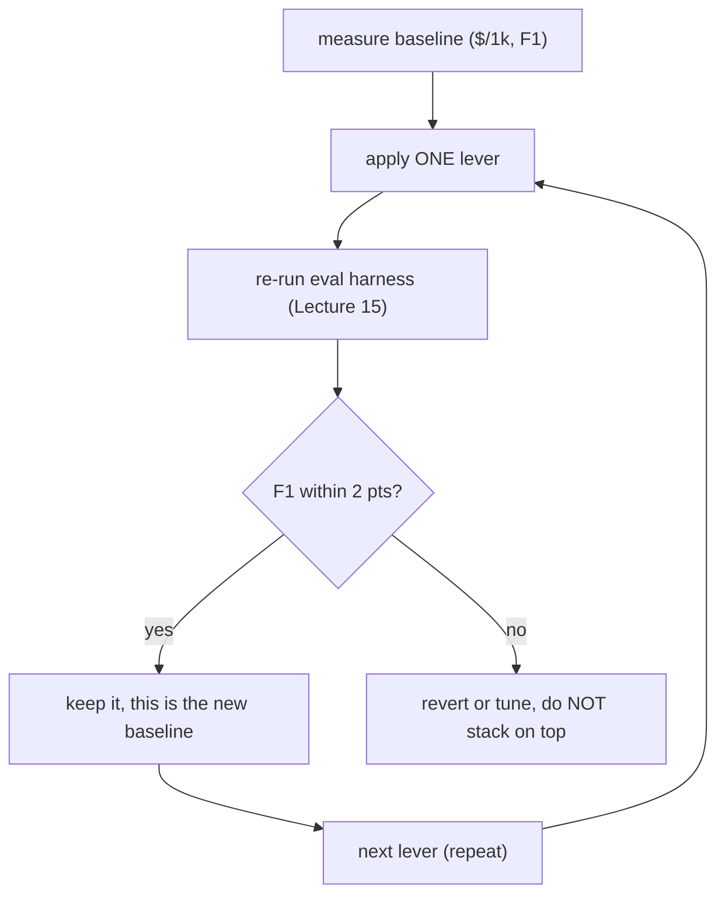

# Lecture 16: Cutting Cost 60% Without Regressing Accuracy — The Lever Stack and the Honesty Guardrail

> Your receipt pipeline works. It also costs $9 per thousand documents, and at a million docs a month that is a $9,000 line item your CFO can see. The instinct is to "make it cheaper," turn every knob at once, ship it, and move on. That instinct is how teams quietly ship an 8-point accuracy regression that nobody notices until a customer complains three weeks later. This lecture is the capstone engineering skill of the whole phase: cut a multimodal pipeline's cost by 60% or more while *proving* accuracy held. You will learn the six cost levers in bang-for-buck order — what each one actually does to the tokens, how much it saves, and where it bites — and the single non-negotiable methodology (baseline, one lever, re-run the eval) that separates an honest cut from a silent regression. After this you can look at any VLM pipeline, name its baseline cost per thousand docs, and stack levers to a defensible number with an F1 delta you can put in a PR description.

**Prerequisites:** Lecture 2 (image tokens & tiling math), Lecture 3 (structured extraction), Lecture 5 (confidence routing), Lecture 15 (the eval harness — this lecture is useless without it), Phase 10 (serving economics, for the self-hosting lever) · **Reading time:** ~30 min · **Part of:** Multimodal & Specialized Modalities, Week 3

---

## The core idea (plain language)

There are two ideas in this lecture and everything else is machinery.

**Idea 1: cost is a stack of independent multipliers, and you attack them biggest-first.** Every dollar you spend on a VLM call is roughly `tokens_sent × price_per_token × number_of_calls`. Each lever attacks one factor. Downscaling and cropping shrink `tokens_sent`. A cheap pre-filter shrinks `number_of_calls` to the expensive model. Prompt caching discounts the *repeated* part of `tokens_sent`. The batch API discounts `price_per_token`. Self-hosting rewrites `price_per_token` entirely. Because they multiply, stacking a 5× token reduction with a 2× batch discount is a 10× cut — but only if each lever is real, which brings us to idea 2.

**Idea 2: a cost cut is a *hypothesis*, and the eval harness is the experiment.** "Downscaling to 1024px won't hurt receipt extraction" is a claim about your data. It is usually true and occasionally, catastrophically, false (a faded thermal receipt whose 6-point tax line becomes unreadable at 1024px). The only way to know is to run the eval from Lecture 15 before and after the change. The discipline is boring and non-negotiable: **establish a baseline, change ONE lever, re-run the eval, keep it only if F1 held.** Skip the re-run and you are not engineering — you are gambling with your accuracy and hiding the dice.

The target for this phase's milestone is concrete: **≥60% cost reduction with F1 within 2 points of baseline.** That "within 2 points" clause is the entire point. Without it, the naive path cuts cost 60% *and* drops F1 by 8 points, and the dashboard only shows the cost line going down. Everyone celebrates. The accuracy regression surfaces as a support ticket.

---

## How it actually works (mechanism, from first principles)

### Establish the baseline first — you cannot improve what you did not measure

Before touching a single lever, run the current pipeline through the eval harness and record two numbers: **aggregate field-F1** and **$/1000 docs**. The dollar figure is arithmetic you already know from Lecture 2:

```
$/1000 docs = 1000 × (image_tokens + prompt_tokens) × input_price
                   + 1000 × output_tokens × output_price
```

Say the naive pipeline sends full-resolution phone photos at `detail:high` to a mid-tier VLM. A `3000×2000` photo at high detail is ~8 tiles ≈ 1,445 image tokens (Lecture 2 math), the instruction+schema prefix is ~700 tokens, output JSON ~300 tokens. At an illustrative $0.15/1M input and $0.60/1M output:

```
input  = (1445 + 700) × $0.15/1M = $0.000322 per doc
output = 300 × $0.60/1M           = $0.000180 per doc
per doc ≈ $0.000502  →  $0.50 / 1000 docs
```

That is your baseline: **$0.50/1000 docs, F1 = 0.91** (say). Every lever below is measured as a delta against *this row*. Write it down. Commit it.

### The lever stack, biggest-first

Here is the whole stack on one diagram, ordered by bang-for-buck for a document-extraction workload:

```
 lever                     attacks            typical saving   risk to F1
 ─────────────────────────────────────────────────────────────────────────
 1. downscale + crop       tokens_sent        3–10×            low (measure it)
 2. detail:low             tokens_sent        ~9× on OpenAI    low
 3. cheap pre-filter       num_expensive_calls 20–40% of docs   low (tune recall)
 4. prompt caching         repeated prefix    ~90% off prefix  none (identical bytes)
 5. batch / async API      price_per_token    ~50%             none (if not latency-bound)
 6. self-host quantized    price_per_token    order of mag     medium (ops burden)
```

**Lever 1 — Downscale + crop to the region of interest (the biggest lever).** This ties directly back to Lecture 2's tiling math. Tokens track *pixel dimensions*, not file size, and providers tile large images. A `3000×2000` photo is ~8 tiles; downscale the long edge to 1024px and you are at `1024×683` → 2 tiles ≈ 516 tokens on OpenAI high detail. That alone is ~2.8× fewer image tokens for text that is still perfectly legible, because on a receipt *the text you need is large relative to the frame*. Then **crop**: a phone photo of a receipt on a table is 60% table, shadow, and thumb. If you first detect the receipt's bounding box (a cheap classical CV pass — contour detection — or the pre-filter model's box output) and crop to it, you throw away the dead pixels *before* tiling. Crop + downscale together routinely take a document from 8 tiles to 1–2. This is the lever that does the heavy lifting; it is also the one most likely to hurt F1 on your worst stratum, so it is the one you must eval hardest.

**Lever 2 — `detail:low` / low-resolution mode.** On OpenAI, `detail:low` is a *flat 85 tokens* regardless of input size (Lecture 2) — no tiling, no arithmetic. That is ~9× cheaper than a typical high-detail call. Gemini and Claude have no literal `detail` flag but you get the same effect by sending a smaller image (Gemini bills per 768px tile; get both sides under its floor and you pay the minimum). The caveat: `detail:low` squashes the image to ~512×512, so a dense multi-column invoice or a long receipt with 30 line items *will* lose small text. The rule is: default to low, and let the eval tell you which strata need to escalate to high. Levers 1 and 2 are partially redundant — if you crop and downscale aggressively you may not need high detail anyway — so treat them as one experiment with two settings and pick the cheapest setting that holds F1.

**Lever 3 — Cheap-model pre-filter.** In a real inbound stream, a meaningful fraction of "receipts" are junk: blurry blanks, a photo of a keyboard, a screenshot of an email, a duplicate. Running your expensive extraction VLM on junk is pure waste. Put a *cheap* classifier in front — a tiny VLM, a `detail:low` yes/no call to a cheap model, or even a lightweight local image classifier — that answers one question: "is this a receipt worth extracting?" Reject the junk before the expensive model ever runs. If 25% of inbound is junk, you just cut 25% of your expensive calls for the price of a near-free classification. The knob that matters is **recall on the positive class**: you would rather let a few junk docs through (they fail arithmetic validation downstream anyway, Lecture 5) than reject a real receipt. Tune the threshold to reject only high-confidence junk.

**Lever 4 — Prompt caching on the stable instruction prefix.** Look at your extraction call: the schema, the field descriptions, the "emit calibrated confidence, do not invent totals" instructions are *byte-for-byte identical on every single call*. Only the image and the output change. Prompt caching lets the provider store the tokenized, pre-computed prefix and charge you a steep discount (commonly ~90% off) for reusing it, plus it shaves latency because the model skips re-processing those tokens. The mechanics: you mark the stable prefix as cacheable, the provider hashes it, and subsequent calls within the cache TTL (minutes) that share the exact prefix hit the cache. **The engineering discipline is prefix stability** — put everything static (instructions, schema, few-shot examples) *first*, and everything dynamic (the image, per-doc hints) *last*. One stray timestamp or a reordered field in the prefix busts the cache and you silently pay full price. This lever is free money: identical output, no accuracy risk, you are just not paying to re-read your own instructions a million times.

> On Anthropic's API specifically, caching is opt-in via a `cache_control` marker on the content block, with a small write premium on the first call and a large read discount after. Since this pipeline may target Claude, check the current pricing and TTL in the claude-api reference rather than assuming — the ratios move.

**Lever 5 — Batch / async APIs.** Most providers offer a batch endpoint at roughly **50% off** the synchronous price in exchange for asynchronous, best-effort completion (minutes to hours, with a stated SLA like 24h). For document extraction, most of your traffic is *not* interactive — a nightly ingest of yesterday's receipts does not care whether it finishes in 200ms or 2 hours. Route that through batch and halve its price. The design move is **confidence-split routing**, which composes beautifully with the pre-filter: the clean, high-confidence ~80% of documents go through the cheap batch lane; only the low-confidence minority that a human is waiting on go through the realtime endpoint. More on how to pick that split below.

**Lever 6 — Self-host a quantized VLM with vLLM.** At high, steady volume the per-token API price stops being the cheapest option. A quantized open VLM (Qwen2.5-VL, etc.) served on your own GPU with vLLM — which gives you continuous batching and PagedAttention for high throughput — can push the marginal cost per document toward the electricity-and-amortized-GPU floor, often an order of magnitude below API pricing *at volume*. The catch is that you now own the ops: GPU provisioning, autoscaling, model updates, evals against your gold set (quantization can shave a point or two of accuracy — measure it). This only pays off past a volume threshold where the fixed cost of a running GPU is cheaper than the variable API bill. This is Phase 10's serving economics; cross-reference it for the throughput-vs-latency and quantization tradeoffs. For most teams below ~hundreds of thousands of docs/month, the API with levers 1–5 wins on total cost of ownership.

### The honesty guardrail — one lever at a time, re-run the eval

This is the methodology that makes the whole thing engineering instead of guessing:



Why one at a time? Because if you apply crop+downscale+low-detail+pre-filter all at once and F1 drops 5 points, you have no idea *which* lever did it. You will spend a day bisecting. Change one thing, eval, record the row, move on. Your eval output becomes a ledger:

| step | change | $/1000 | Δcost | F1 | ΔF1 |
|---|---|---|---|---|---|
| 0 | baseline (high detail, full res) | $0.50 | — | 0.91 | — |
| 1 | downscale 1024 + crop | $0.22 | −56% | 0.90 | −0.01 |
| 2 | detail:low on clean strata | $0.16 | −68% | 0.90 | −0.01 |
| 3 | cheap pre-filter (22% junk) | $0.13 | −74% | 0.90 | 0.00 |
| 4 | prompt cache prefix | $0.11 | −78% | 0.90 | 0.00 |
| 5 | 80% batch / 20% realtime | $0.07 | −86% | 0.90 | 0.00 |

That table *is* the deliverable. It is a defensible, auditable claim that you cut cost 86% and F1 moved one point. (These numbers are illustrative — yours will differ, and that is exactly why you must run it on your own gold set.)

---

## Worked example — deciding the realtime/batch confidence split

Levers 3 and 5 both hinge on a routing decision, so let's make it concrete. You have a stream of receipts. Each extraction produces a per-doc confidence (from Lecture 5 — calibrated against the gold set, *not* raw model self-report). You want to send high-confidence docs to the cheap batch lane and low-confidence docs to realtime, because low-confidence docs are the ones a human reviewer is actively waiting on.

Suppose your calibration (Lecture 15) showed that at confidence ≥ 0.85, the auto-approve bucket has 98% field precision, and 80% of your docs clear that bar. Then:

```
realtime lane: 20% of docs × $0.11/1k  (full price, fast)
batch lane:    80% of docs × $0.055/1k (half price, async)

blended = 0.20 × $0.11 + 0.80 × $0.055 = $0.022 + $0.044 = $0.066 /1000
```

versus all-realtime at $0.11 — a 40% cut *from the routing lever alone*, on top of everything upstream. The knob is the confidence threshold. Push it up (0.90) and fewer docs qualify as "confident" — the realtime lane grows, cost rises, but you catch more borderline docs quickly. Push it down (0.75) and more docs go to cheap batch, but you risk making a reviewer wait hours for a doc that was actually borderline. **Decide the split by asking: who is waiting?** If a doc is part of a nightly bulk ingest, batch it regardless of confidence. If a doc came from a user who just snapped a photo and is staring at a spinner, that is realtime, full stop — *never* route interactive, latency-sensitive traffic to batch, because "your receipt will be ready in 2 hours" is a broken product.

---

## How it shows up in production

- **The silent 8-point regression.** A teammate "optimizes" by downscaling to 512px and switching to a cheaper model *in the same PR*. Cost drops 60%, everyone's happy, no eval was run. Two weeks later, finance reports foreign-currency totals are wrong 12% of the time. The faded-receipt and `1.234,56`-format strata cracked at 512px and nobody looked. The fix was the guard you skipped: re-run the eval, per stratum, after each change.
- **Cache misses you're paying for.** You enabled prompt caching but your prefix includes `"Today is {date}"` or you A/B two prompt versions that alternate — the hash changes every call and you get a 0% cache hit rate while believing you're saving 90%. Always log the cache-hit ratio from the `usage` field; a healthy stable-prefix pipeline should be near 100% after warmup.
- **Batch latency in an interactive path.** Someone routes the user-facing "scan this receipt now" flow through batch to save money. The p95 goes from 2 seconds to 40 minutes. Batch is for traffic where no human is blocked.
- **Self-hosting that costs more.** A team stands up a GPU to "save money" at 10k docs/month. The GPU idles 95% of the time; the amortized cost per doc is 5× the API. Self-hosting is a *high-volume* lever — below the crossover point it loses.
- **Crop that eats the total.** Aggressive cropping to a detected bbox clips the bottom line of long receipts, dropping the `total`. The bbox detector was trained on short receipts. Eval on your *longest* documents specifically.

---

## Common misconceptions & failure modes

- **"Cheaper model = cheaper pipeline."** Not necessarily. On OpenAI, GPT-4o-**mini** uses a huge per-tile token multiplier (Lecture 2) — the same image costs comparable *dollars* to 4o despite a "mini" label. Compare on $/1000 docs from the eval, not on the model's per-token sticker price.
- **"Prompt caching is automatic."** On some providers it is opt-in and requires an explicit marker plus a stable prefix; on others there's a minimum token count before a prefix is cacheable. Read the current docs — assumptions here cost you money.
- **"Downscaling always preserves quality."** True for large text (receipts, forms), false for dense small text (tables with 8-point font, multi-column invoices, handwriting). The claim is data-dependent; the eval is how you find out.
- **"60% is the goal, stop there."** 60% is the *floor* for the milestone. If the levers stack to 85% with F1 intact, take it. The 2-point F1 guard is the real constraint, not the cost number.
- **"Batch is just slow realtime."** Batch endpoints can also have different rate limits, payload formats, and failure modes (a whole batch job can partially fail). Handle partial results and retries; don't assume it's the sync API with a delay.
- **Optimizing before measuring accuracy at all.** If you never built the Lecture 15 harness, you cannot honestly claim any of this. The harness is the prerequisite, not a nice-to-have.

---

## Rules of thumb / cheat sheet

- **Always baseline first:** record $/1000 docs and F1 before touching anything. Commit it.
- **Lever order:** crop+downscale → detail:low → pre-filter junk → prompt-cache the prefix → batch the non-urgent 80% → self-host only at high volume.
- **One lever, one eval, one ledger row.** Never stack blind.
- **Downscale default:** 1024–1600px long edge for receipts; measure before going lower.
- **`detail:low` is a flat 85 tokens on OpenAI** — default to it, escalate only where the eval demands.
- **Prompt caching = free money** when the prefix is byte-stable and static-first. Log cache-hit ratio.
- **Batch ≈ 50% off** but async (minutes–hours). Never for latency-sensitive/interactive traffic.
- **Confidence split:** route by "is a human waiting?" first, confidence second. Interactive → realtime always.
- **Self-host** only past the volume where a busy GPU beats the API bill; re-eval after quantization.
- **The guardrail:** ≥60% cost cut *and* F1 within 2 points, proven by committed before/after eval runs. Both numbers or it didn't happen.

---

## Connect to the lab

This is Part 3 of the Week 3 lab — the milestone glue. You'll take the `docextract` pipeline from Week 1, establish a baseline $/1000 docs and F1 on your 25–40 doc gold set (Lecture 15's harness), then stack the levers one at a time, re-running `eval.py` after each and committing the before/after runs. The acceptance bar is exactly this lecture's guardrail: **≥60% cost reduction with F1 within 2 points of baseline**, plus a confidence-routing threshold now calibrated against the gold set so you can state the precision of the auto-approved bucket.

---

## Going deeper (optional)

- **OpenAI vision & pricing docs** (root: `platform.openai.com/docs`) — image token counting, `detail` modes, the Batch API guide. Search: `OpenAI Batch API guide`, `OpenAI prompt caching`.
- **Anthropic docs** (root: `docs.anthropic.com`) — prompt caching with `cache_control`, Message Batches API, vision token counting. Use the **claude-api** skill for current model ids, caching TTL, and batch pricing rather than memory.
- **Google Gemini API docs** (root: `ai.google.dev/gemini-api/docs`) — token counting for images, batch mode, context caching.
- **vLLM** (root: `docs.vllm.ai`, repo `vllm-project/vllm`) — continuous batching and PagedAttention for self-hosted serving throughput; cross-ref Phase 10.
- **Qwen2.5-VL model card** on Hugging Face — a strong open VLM to self-host; check quantized (AWQ/GPTQ) variants. Search: `Qwen2.5-VL vLLM serving`.
- Search queries: `LLM prompt caching stable prefix best practices`, `VLM cost optimization batch API`, `quantized VLM accuracy tradeoff`.

---

## Check yourself

1. Why must you establish a baseline ($/1000 docs and F1) *before* applying any lever, and why record both numbers rather than just cost?
2. The lever stack is ordered by bang-for-buck. Why is "downscale + crop" first, and how does it tie back to the tiling math from Lecture 2?
3. Prompt caching is described as "free money" with "no accuracy risk." What one engineering discipline must you follow for it to work, and what silently breaks it?
4. You have a stream mixing a user-facing "scan now" flow and a nightly bulk ingest. How do you route each between realtime and batch, and why is confidence *not* the first thing you check?
5. A teammate's PR cuts cost 60% and the F1 on the aggregate gold set is unchanged. What is still missing before you approve it, given Lecture 15's stratification lesson?
6. When does self-hosting a quantized VLM actually beat the API, and what new risk does it introduce that the API lever doesn't?

### Answer key

1. You cannot claim an improvement against an unmeasured starting point, and a cost cut is meaningless — even harmful — if it dropped accuracy. Recording both numbers turns each lever into a controlled experiment with a cost delta *and* an F1 delta; cost alone hides the regression that the whole methodology exists to catch.
2. It attacks `tokens_sent`, the largest and most direct factor, and image tokens track pixel dimensions via tiling (Lecture 2). A full-res photo is ~8 tiles; cropping away dead pixels and downscaling the long edge to ~1024px takes it to 1–2 tiles — a 3–10× token reduction on text that's still legible because receipt text is large relative to the frame.
3. The prefix (instructions + schema + examples) must be **byte-for-byte stable and placed first**, with all dynamic content last. It breaks silently if anything variable leaks into the prefix (a timestamp, a reordered field, an alternating prompt version) — the provider's hash changes, you get cache misses, and you pay full price while believing you're saving 90%. Log the cache-hit ratio to catch it.
4. The nightly bulk ingest goes to batch (half price, nobody's waiting); the user-facing "scan now" flow goes to realtime regardless of confidence, because a user is staring at a spinner and "ready in 2 hours" is a broken product. You check "is a human waiting?" *before* confidence, because latency-sensitivity overrides the cost optimization — you only apply the confidence split *within* the non-interactive traffic.
5. The per-stratum F1. An unchanged *aggregate* can hide a collapse on the faded/thermal or foreign-currency stratum that the clean-digital majority masks. You need the stratified table showing F1 held on every bucket, especially the worst one, before the "within 2 points" guarantee is real.
6. It beats the API only past a volume threshold where a continuously-busy GPU's amortized cost undercuts the variable per-token bill; below that the GPU idles and costs more per doc. The new risk is ops burden — provisioning, autoscaling, updates — plus quantization can shave 1–2 F1 points, so you must re-run the eval on your gold set after quantizing rather than assuming parity with the API model.
