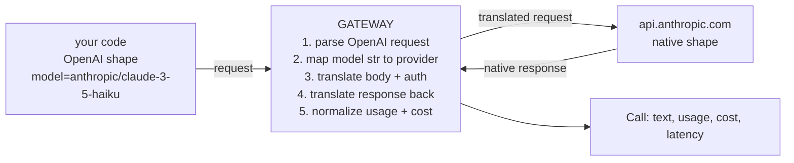

# Lecture 3: Gateways: One Interface, and What Leaks Through It

> You have built prompts, extractors, RAG pipelines, and agents against one provider at a time. Then a new model drops on a Tuesday, a customer demands you run on their Bedrock account, and your finance team asks why last month's OpenAI bill was $4,000 with no per-team breakdown. A **gateway** is the thin layer that answers all three problems at once: one OpenAI-shaped interface across every provider, automatic fallback and retries, and unified cost/usage accounting. This lecture explains the pattern from first principles, goes deep on LiteLLM (the tool the Week 1 lab is built on), and then — critically — enumerates exactly where the abstraction *leaks* and shows you the escape-hatch pattern that keeps you from being trapped by it. After this you will be able to route any request through a gateway, read its cost/usage numbers, point it at a local Ollama server, and know precisely which native features force you to bypass it.

**Prerequisites:** You can call at least one provider SDK directly (Phase 1–12), read a JSON response, and reason about tokens and cost. · **Reading time:** ~24 min · **Part of:** Frameworks, Ecosystem, Team Practice & Career — Week 1

## The core idea (plain language)

Every LLM provider speaks a slightly different dialect. OpenAI wants `messages` with `tool_calls` and a `role:"tool"` turn whose arguments are a JSON *string*. Anthropic wants content blocks with `tool_use`/`tool_result` and *parsed* argument objects, plus `cache_control` breakpoints. Gemini wants `functionDeclarations` and `contents`. Bedrock wants the Converse shape *and* SigV4/IAM auth instead of a bearer key. Write to one directly and you are married to it: every model swap is a code change, every new provider is a new SDK to learn, and every retry/fallback/cost-tracking concern is reimplemented per integration.

A **gateway** collapses all of that behind a single interface — almost always the OpenAI Chat Completions shape, because it became the lingua franca. You call one function with a `model` string and a `messages` list; the gateway translates to the target provider's native wire format, sends it, translates the response *back* to the OpenAI shape, and normalizes the usage/cost numbers so `prompt_tokens` and `completion_tokens` mean the same thing regardless of who answered.

That translation layer buys you six concrete things:

1. **One interface** across all providers — swap `openai/gpt-4o-mini` for `anthropic/claude-3-5-haiku-latest` with a one-line change.
2. **Fallback / routing** — if the primary is rate-limited or down, retry on a secondary automatically.
3. **Retries** — transient 429/5xx handled with backoff, once, centrally.
4. **Cost tracking** — a dollar figure per call, computed from token counts and a price table.
5. **Key / budget management** — centralized credentials, per-team spend caps (in proxy mode).
6. **Unified usage accounting** — normalized `usage` objects you can log and sum.

The whole value proposition is *thinness*. A gateway is a translation shim, not a framework. It does not own your control flow, invent its own abstractions for chains or agents, or hide the prompt you actually sent. That thinness is exactly why the roadmap's default posture endorses "raw SDK + thin gateway" — more on that at the end.

## How it actually works (mechanism, from first principles)

At the wire level, a chat request is an HTTP POST with a JSON body and an auth header. The dialects differ in three axes a gateway must reconcile:



**Axis 1 — message shape.** The gateway rewrites your `messages` into the provider's structure. For a plain text turn this is trivial. For tool calls it is not: OpenAI emits `tool_calls[].function.arguments` as a JSON *string* you must `json.loads()`; Anthropic emits a `tool_use` block with `input` already a parsed dict. The gateway hides this by always presenting you the OpenAI shape — which means when you switch providers your tool-handling code doesn't change, but also that you never see the native block structure.

**Axis 2 — auth.** OpenAI, Anthropic, and Gemini take a bearer/`x-api-key` header. Bedrock does not — it needs AWS SigV4 request signing derived from IAM credentials. A gateway detects the provider from the model string and picks the auth mechanism. This is why "just point it at Bedrock" quietly works: the gateway is doing SigV4 for you.

**Axis 3 — usage & cost.** Providers report token usage in the same *spirit* but different field names and, crucially, different *tokenizers* — the same prompt is a different token count on GPT-4o vs Claude vs Gemini. The gateway maps each provider's usage fields into a canonical `{prompt_tokens, completion_tokens, total_tokens}`, then computes cost by looking the model up in a price table.

**Worked numeric example — cost from usage.** Suppose you call `openai/gpt-4o-mini` on a request that reports `prompt_tokens=1,200` and `completion_tokens=350`. GPT-4o-mini is priced (approximately, as of 2025 — always confirm against the live pricing page) at **$0.15 per 1M input tokens** and **$0.60 per 1M output tokens**. The gateway computes:

```
input  cost = 1,200 / 1_000_000 × $0.15 = $0.000180
output cost =   350 / 1_000_000 × $0.60 = $0.000210
total       = $0.000390   (≈ 0.039 cents)
```

Run the identical prompt through `anthropic/claude-3-5-haiku-latest` and two things change: the *token counts* differ (different tokenizer — maybe 1,240 input tokens for the same text) and the *prices* differ (Haiku is roughly $0.80/$4.00 per 1M, approximate). The gateway does the same arithmetic against Haiku's row. This is why you can never compare providers on tokens alone — only on dollars, and ultimately on **dollars per correct answer** (the metric the lab's report column enforces).

**Fallback, mechanically.** Fallback is a `try/except` loop over an ordered model list. Pseudocode of what a gateway does internally:

```
for model in [primary, *fallbacks]:
    try:
        r = call(model, messages)
        if r.ok: return r
    except (RateLimitError, ServiceUnavailable, Timeout):
        continue          # try next model
raise AllProvidersFailed
```

The subtlety: fallback is only safe for *transient, provider-side* failures (429, 5xx, timeout). A 400 (your request is malformed) should **not** fall back — it will fail identically on every provider and just waste latency. Good gateways distinguish these; a hand-rolled loop often doesn't.

**Retries vs fallback** are different levers. Retry = same model, wait-and-try-again with exponential backoff (for a blip). Fallback = different model (for a sustained outage or hard rate-limit). A production setup uses both: retry the primary 2× with backoff, then fall back.

## Worked example — the lab's thin client, end to end

The Week 1 lab wraps `litellm.completion()` in a ~15-line `complete()` function. Here is the mechanism it exercises:

```python
import time, litellm
from dataclasses import dataclass

@dataclass
class Call:
    text: str
    prompt_tokens: int
    completion_tokens: int
    cost_usd: float
    latency_s: float

def complete(model: str, messages: list[dict], **kw) -> Call:
    t0 = time.perf_counter()
    r = litellm.completion(model=model, messages=messages, **kw)
    dt = time.perf_counter() - t0
    u = r.usage
    return Call(
        text=r.choices[0].message.content or "",
        prompt_tokens=u.prompt_tokens,
        completion_tokens=u.completion_tokens,
        cost_usd=litellm.completion_cost(completion_response=r) or 0.0,
        latency_s=dt,
    )
```

Walk the `litellm.completion()` signature, because it is the whole abstraction:

- **`model`** is a string that *encodes the provider as a prefix*: `openai/gpt-4o-mini`, `anthropic/claude-3-5-haiku-latest`, `gemini/gemini-2.0-flash`, `ollama/llama3.1`. The prefix before the first `/` selects the provider adapter and therefore the base URL, auth mechanism, and translation rules. No prefix defaults to OpenAI. This one string is the swap point — change it and nothing else moves.
- **`messages`** is the OpenAI `[{"role": ..., "content": ...}]` list, identical across providers.
- **`**kw`** passes through provider-agnostic params (`temperature`, `max_tokens`, `tools`, `response_format`, `stream`). This is also where leakage begins (next section).
- The response `r` is always the OpenAI `ChatCompletion` shape: `r.choices[0].message.content`, `r.usage.prompt_tokens`, etc. — even when Anthropic answered in content blocks.

Two helper functions do the accounting the lab depends on:

- **`litellm.completion_cost(completion_response=r)`** reads the model + usage off the response and returns a float dollar cost by looking up LiteLLM's built-in price map. For a local `ollama/llama3.1` call it returns `0.0` — correct, because no money changed hands (but a reminder that "free" ignores your own hardware/electricity/latency cost).
- **`litellm.get_model_info(model)`** returns metadata *without making a call*: `max_input_tokens`, `max_output_tokens`, `input_cost_per_token`, `output_cost_per_token`, modality flags. Week 2's model-card generator uses this to print a one-line spec per model. Note the units — `input_cost_per_token` is per *single* token, so multiply by `1e6` to get the familiar "$/M" figure.

**Pointing at a local Ollama server.** This is the proof that "any OpenAI-compatible endpoint" is real, not marketing. Ollama exposes an OpenAI-compatible API on `http://localhost:11434`. Two ways to reach it:

```python
# Native LiteLLM ollama provider:
complete("ollama/llama3.1", messages)

# Or any OpenAI-compatible server via base_url override:
complete("openai/llama3.1", messages,
         api_base="http://localhost:11434/v1", api_key="ollama")
```

The second form is the general lever: `api_base` (plus a throwaway `api_key`) points the OpenAI adapter at *any* server that speaks the OpenAI shape — a local vLLM, a self-hosted endpoint, a corporate proxy. That is the entire trick behind provider-agnosticism: most inference servers now emulate OpenAI's HTTP contract, so the gateway barely has to translate at all for them.

## Choosing a gateway: LiteLLM vs OpenRouter vs Portkey

These three occupy different points on a "do I run it?" axis.

- **LiteLLM** — an open-source **Python library** *and* a **proxy server**. In *library mode* (what the lab uses) it's `import litellm` — the translation happens in-process, your keys are your env vars, zero infrastructure. In *proxy mode* you run `litellm --config config.yaml` as a standalone OpenAI-compatible HTTP server ("LiteLLM Proxy" / "LLM Gateway"); every app points its OpenAI client at the proxy URL, and the proxy centralizes keys, per-team **virtual keys**, budgets, and a spend dashboard. **Fits when:** you want code-level control and no vendor in the request path (library), or you're a team that needs centralized key/budget governance you host yourself (proxy). This is the roadmap's default because it's thin, self-hostable, and ejectable.

- **OpenRouter** — a **hosted routing marketplace**. You get one API key and one base URL; OpenRouter fronts hundreds of models across providers, handles fallback/routing across its own pool, and bills you centrally (with a margin). No infrastructure, instant access to models you don't have accounts for. **Fits when:** you want to try many models fast, don't want N provider accounts, and accept a third party in your request path and a markup. Trade-off: you're trusting a hosted intermediary with your traffic and data.

- **Portkey** — a **gateway plus observability platform** (open-source gateway core, hosted control plane). Beyond routing/fallback it emphasizes tracing, analytics, guardrails, caching, and prompt management — an ops layer on top of the gateway. **Fits when:** you need production observability (per-request traces, dashboards, alerting) and are willing to adopt a platform for it.

Rule of thumb: **LiteLLM library** for the smoke-test harness and most app code; **LiteLLM proxy** when a team needs shared keys/budgets on your own infra; **OpenRouter** for breadth-of-model experimentation without account sprawl; **Portkey** when observability is the primary need. All four share the same escape-hatch caveat below.

## The critical caveat: abstractions leak

A gateway can only expose the *intersection* of what providers do the same way, plus whatever the maintainers hand-wrote pass-throughs for. Anything provider-specific either isn't exposed, is exposed inconsistently, or silently no-ops. The ones that bite in production:

- **Anthropic `cache_control` breakpoints.** Prompt caching (up to ~90% cost reduction on a repeated prefix) requires placing `cache_control: {"type": "ephemeral"}` on specific content blocks. That is an Anthropic content-block concept with no OpenAI equivalent, so a gateway's OpenAI-shaped `messages` has nowhere natural to put it. LiteLLM has added pass-through support, but placement is finicky and version-dependent — and if it silently drops, your cache hit rate is zero and you pay full price with no error. **Verify** via `usage.cache_read_input_tokens`; if it's stuck at 0 across identical-prefix requests, the breakpoint isn't landing.
- **OpenAI `reasoning_effort` / reasoning tokens.** Reasoning models take a `reasoning_effort` knob and bill separately for hidden reasoning tokens. Whether a gateway forwards the param *and* surfaces the reasoning-token usage back varies. If reasoning tokens aren't in the normalized `usage`, your cost figure undercounts — sometimes badly, since reasoning tokens can dominate.
- **Provider-specific safety / stop params.** Gemini's `safetySettings`, Anthropic's `stop_sequences` nuances, provider-specific `top_k`, logit bias, structured-output modes — coverage is uneven. A param the gateway doesn't recognize may be dropped silently rather than rejected.
- **Bedrock IAM auth.** The gateway handles SigV4, but IAM adds failure modes a bearer-key mental model doesn't cover: assumed-role expiry, region mismatch, per-model access grants. When it fails it fails with an AWS error the gateway surfaces raw — you need to know it's an *auth/permissions* problem, not a gateway bug.

The pattern that keeps you safe: **the gateway is the default path; keep a direct-SDK escape hatch for the one call that needs a native feature.** Route 95% of calls through `complete()`; for the single request that must use Anthropic caching or OpenAI reasoning natively, call the provider SDK directly and isolate it behind your own function so the rest of the codebase doesn't know:

```python
def complete_with_cache(system_prompt, user_msg):
    """Escape hatch: native Anthropic prompt caching. NOT via the gateway."""
    import anthropic
    client = anthropic.Anthropic()
    resp = client.messages.create(
        model="claude-3-5-haiku-latest", max_tokens=1024,
        system=[{"type": "text", "text": system_prompt,
                 "cache_control": {"type": "ephemeral"}}],   # gateway can't reliably carry this
        messages=[{"role": "user", "content": user_msg}],
    )
    # verify the cache actually engaged
    assert resp.usage.cache_read_input_tokens is not None
    return resp
```

The discipline: one function, one native call, clearly labeled as the exception. Everything else stays on the thin path. When you eventually change the caching strategy you touch one file — and you never lost the ability to use the native feature just because you adopted a gateway.

## How it shows up in production

- **Cost surprises from silent no-ops.** You "enabled caching" through the gateway, the param dropped, and you paid full price for a month before anyone checked `cache_read_input_tokens`. The fix is a monitored assertion, not trust.
- **Undercounted reasoning cost.** Your dashboard says $500; the real bill is $900 because reasoning tokens weren't in the normalized usage. Reconcile the gateway's cost number against the provider's actual invoice monthly.
- **Fallback masking real errors.** A misconfigured request 400s, the gateway falls back through five models (each 400ing), and latency balloons while the root cause is hidden. Configure fallback for *transient* errors only.
- **Tokenizer confusion in comparisons.** Two models look equally cheap "per token" but one uses 30% more tokens for the same text. Always compare on dollars — and on the lab's `$/correct`.
- **Team governance.** In proxy mode, per-team virtual keys and budgets turn "one shared OpenAI key nobody can attribute" into a spend dashboard with caps that actually stop a runaway loop at 2am. That operational value — centralized keys, per-team budgets, unified accounting — is often the reason a team adopts a gateway at all, independent of the multi-provider story.

## Common misconceptions & failure modes

- **"A gateway is a framework."** No — it's a translation shim. It has no opinion on your control flow, chains, or agents. That's the point.
- **"If it went through the gateway, the native feature worked."** Unproven params can silently drop. Verify with the provider's own usage fields.
- **"Cost per token is the comparison metric."** It's cost per *correct answer*. A cheaper-per-token model that's wrong twice as often is more expensive per useful result.
- **"Local models are free."** `completion_cost` returns $0, correctly — but your GPU, power, and higher latency are real costs the number omits.
- **"Fallback always helps."** Falling back on a 400 just multiplies latency across providers that will all reject the same bad request.
- **"The gateway locks me in too."** Only if you let it. The escape hatch keeps native features one function away.

## Rules of thumb / cheat sheet

- **Default posture:** raw provider SDK + a thin gateway. Reach for the gateway for multi-provider, fallback, and cost tracking; keep a direct-SDK escape hatch for native features.
- **Model string encodes the provider:** `openai/`, `anthropic/`, `gemini/`, `ollama/`. Swapping models = one-line edit.
- **Any OpenAI-compatible endpoint:** set `api_base` (+ dummy `api_key`) to point at Ollama/vLLM/local servers.
- **Cost:** `litellm.completion_cost(completion_response=r)`. **Metadata (no call):** `litellm.get_model_info(model)` → multiply per-token costs by `1e6` for $/M.
- **Compare on `$/correct`, never `$/token`.**
- **Fallback only on transient errors** (429/5xx/timeout), never on 400.
- **Retry ≠ fallback:** retry = same model + backoff; fallback = next model.
- **Verify leaky features natively:** caching → `cache_read_input_tokens`; reasoning → reasoning-token usage. If the number's wrong, the param dropped.
- **Library mode** for app code / harness; **proxy mode** for team keys + budgets + dashboards.
- **Gateway choice:** LiteLLM (self-hosted, thin, ejectable) · OpenRouter (hosted breadth, markup) · Portkey (gateway + observability platform).

## Connect to the lab

The Week 1 lab's `src/client.py` is exactly the thin `complete()` wrapper above, and `models.yaml` is the one-line-swap list (`openai/…`, `anthropic/…`, `gemini/…`, `ollama/llama3.1`). You'll prove the "any OpenAI-compatible endpoint" claim by running the whole suite against a local Ollama model that costs $0, and you'll surface the leak directly: the lab explicitly warns that LiteLLM won't cleanly expose Anthropic `cache_control` or OpenAI `reasoning_effort`, so keep a direct-SDK escape hatch and test those natively when they matter. The `$/correct` report column is the "compare on dollars, not tokens" rule made concrete.

## Going deeper (optional)

- **LiteLLM docs** — `docs.litellm.ai` (completion API, provider list, proxy server, cost tracking). Canonical repo: `github.com/BerriAI/litellm`.
- **OpenRouter** — `openrouter.ai` (docs and model list). **Portkey** — `portkey.ai` and repo `github.com/Portkey-AI/gateway`.
- **Anthropic prompt caching & `cache_control`** — `docs.anthropic.com` (Messages API → prompt caching). If you're on Claude, the `claude-api` skill carries current model IDs, pricing, and caching mechanics.
- **OpenAI reasoning / `reasoning_effort`** — `platform.openai.com/docs` (reasoning models).
- **AWS Bedrock Converse + IAM** — `docs.aws.amazon.com/bedrock`.
- **Ollama OpenAI-compatible API** — `ollama.com` docs (OpenAI compatibility).
- **Framework-vs-raw-code judgment** — Hamel Husain's writing at `hamel.dev`; Anthropic's "Building Effective Agents" (search: `Anthropic building effective agents`).
- Search queries when a doc moves: `litellm completion_cost get_model_info`, `litellm proxy virtual keys budgets`, `litellm ollama api_base`.

## Check yourself

1. Name the three wire-level axes a gateway must reconcile across providers, and give the concrete OpenAI-vs-Anthropic difference on the message-shape axis.
2. Why can't you compare two models on price-per-token alone, even if both report a `usage` object? What must you compare on instead?
3. You "enabled" Anthropic prompt caching through LiteLLM but the bill didn't drop. What single field tells you whether the `cache_control` breakpoint actually landed, and what does it mean if that field is stuck at 0?
4. A request starts returning HTTP 400. Should your fallback chain kick in? Why or why not — and what failure mode does the wrong answer cause?
5. Give the exact LiteLLM mechanism for routing a call to a local Ollama server through the OpenAI adapter (not the native `ollama/` prefix).
6. When would you choose LiteLLM proxy over OpenRouter, and what do you give up by choosing OpenRouter?

### Answer key

1. **Message shape, auth, and usage/cost.** On message shape: OpenAI represents tool calls as `tool_calls` with `function.arguments` as a JSON *string* (you must parse it) and a `role:"tool"` result turn; Anthropic uses `tool_use`/`tool_result` *content blocks* with `input` already a parsed object. The gateway always hands you the OpenAI shape regardless of who answered.
2. Because each provider uses a **different tokenizer**, the same text is a different token count per model, and prices differ too — so "cents per token" isn't comparable across providers. Compare on **dollars per correct answer** (`total_cost / n_correct`), which folds in both price and quality.
3. **`usage.cache_read_input_tokens`.** If it's 0 across repeated identical-prefix requests, the breakpoint isn't landing (the gateway dropped or misplaced `cache_control`) and you're paying full input price with no error — a silent no-op, the classic leak.
4. **No.** A 400 means your request is malformed; it will fail identically on every provider, so falling back just multiplies latency and hides the real (client-side) error while producing no successful call. Fallback is for transient provider-side failures (429/5xx/timeout) only.
5. Call with the OpenAI adapter and override the base URL: `litellm.completion(model="openai/llama3.1", messages=..., api_base="http://localhost:11434/v1", api_key="ollama")`. `api_base` points the OpenAI-compatible adapter at any server speaking the OpenAI HTTP contract.
6. Choose **LiteLLM proxy** when you need to self-host, keep your traffic/data on your own infra, and give a team centralized keys, per-team virtual keys, budgets, and a spend dashboard without a third party in the request path. Choosing **OpenRouter** gives you instant multi-model breadth with no infrastructure and one key — but you give up self-hosting, put a hosted intermediary in your request path (data-handling trust), and pay a markup.
