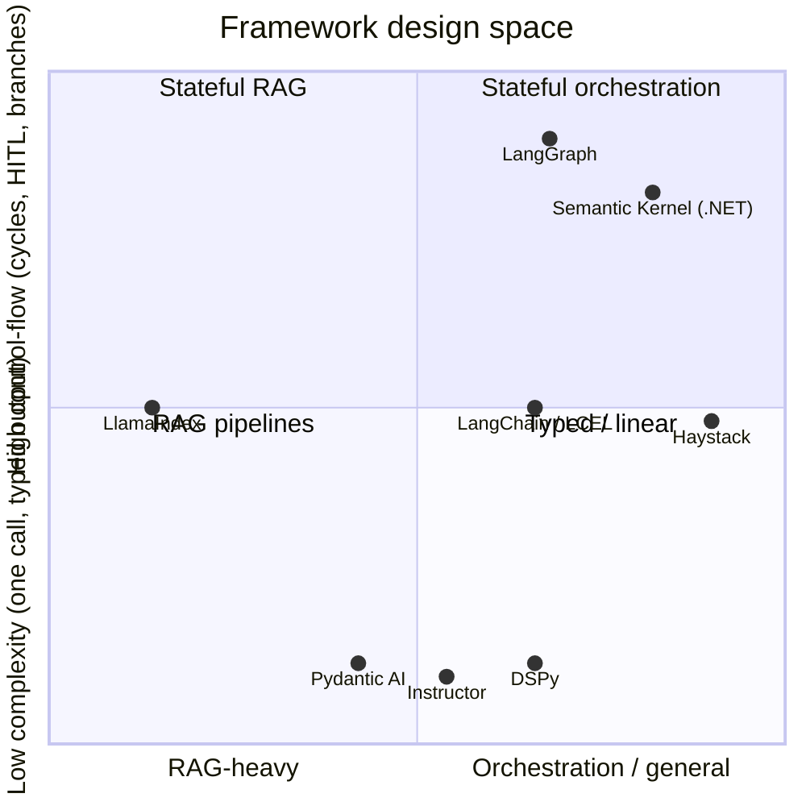

# Lecture 4: The Framework Landscape — Survey to Choose, Not to Adopt

> There are a dozen serious LLM frameworks, each with a tutorial that makes it look like the answer to everything, and you do not have time to learn them all — nor should you. The trap is treating "which framework?" as a technology-selection problem you solve once by crowning a winner. It isn't. It's a per-task routing problem you solve in seconds, every time, by knowing what each tool is *for*, where it clears its own overhead, and where it silently taxes you. This lecture builds that mental index. After it you can hear a task described in standup — "typed extraction from PDFs," "a human-approval step mid-agent-loop," "we're sick of hand-tuning this prompt" — and instantly name the one or two candidates worth a spike, the tax each carries, and the profile where you skip all of them for raw SDK + gateway. You will *not* be able to build in all of these. That's fine. The skill is the map, not the territory.

**Prerequisites:** the raw-SDK-vs-framework rubric (this week), the universal tool-calling loop (Phase 2), structured output with Pydantic/Instructor (Phase 2), RAG basics (Phases 3–7), gateways/LiteLLM (Phase 0) · **Reading time:** ~22 min · **Part of:** Frameworks, Ecosystem, Team Practice & Career — Week 1

---

## The core idea (plain language)

Every LLM framework exists to remove *repeated* work. That is its whole value proposition and the only lens that matters. A framework earns its place when it deletes code you'd otherwise write again across many features — a tool-calling loop, a retry-on-invalid-JSON, a retriever-plus-reranker pipeline. It does *not* earn its place by saving you thirty lines once, because in exchange for those thirty lines it charges a **framework tax** with three line items:

1. **Indirection** — you can no longer see the exact prompt and messages sent over the wire. The framework assembles them, and when quality drops you're debugging someone else's string concatenation.
2. **Churn** — these libraries move fast. Breaking changes land on their schedule, not yours; a `pip install` six months later may not run your code.
3. **Dependency & opacity weight** — a big transitive dependency tree, slower cold starts, a fatter supply-chain surface, and a black box between your inputs and the model.

So the question is never "is LangChain good?" It's "does *this task* repeat enough work that the tax is worth paying, and can I eject if it isn't?" The answer changes task to task. A typed-extraction endpoint and a cyclic human-in-the-loop agent are different tasks with different winners, and a mature codebase often runs two or three frameworks for two or three jobs while calling the raw SDK for everything else.

This lecture is a survey, not a tutorial. For each framework you get three things and only three: **what it is FOR** (the job it removes), **its sweet spot** (the profile where the tax is worth it), and **its failure modes / tax** (how it bites). Memorize those, not the APIs. The APIs will change; the *shape* of what each tool is for is stable.

---

## How it actually works (mechanism, from first principles)

Picture the LLM-app design space as two axes. The horizontal axis is **control-flow complexity**: from a single call, to a linear chain, to a cyclic graph with branches, loops, and pauses for human approval. The vertical axis is **where the value lives**: pure retrieval vs orchestration vs just getting typed data back. Every framework stakes out a region.

`(*)` DSPy sits off to the side — it's not an orchestrator at all; it's a *compiler* for prompts. More below.

Now walk the map, tool by tool.

### LangChain / LCEL — composable chains and a pipe DSL

**For:** gluing steps together — prompt → model → output-parser → next step — with a huge catalog of pre-built integrations (loaders, vector stores, tools) so you don't write each connector. LCEL (LangChain Expression Language) is the pipe DSL: `prompt | model | parser`, where each `|` composes `Runnable` objects sharing one streaming/batching/async interface.

**Sweet spot:** rapid prototyping of a *linear* pipeline where you lean on the integration catalog instead of writing adapters. "Wire five known components in a straight line, quickly."

**Failure modes / tax:** the canonical complaints, all real in 2025–2026. (1) **Opaque prompts** — the actual string sent to the model is buried under templates and defaults; debugging a regression means spelunking to find what was really sent. (2) **Heavy transitive dependencies** — installing it pulls a large tree; cold starts and image sizes bloat. (3) **Abstraction churn** — the library has re-architected repeatedly (`langchain` → `langchain-core` / partner packages, retired patterns), so tutorials rot and upgrades break. Mental note: LangChain is *fine* for a linear prototype where the catalog saves real time, but for complex control flow the same team now points you at LangGraph, and for a stable production straight-line you'll often eject to raw calls.

### LangGraph — stateful graphs with explicit nodes/edges/state

**For:** control flow that is *not* a straight line. You define a graph: **nodes** (functions/LLM calls), **edges** (including conditional edges that branch on state), and an explicit **shared state** object that flows through and is updated at each node. It supports **cycles** (loop until a condition), **checkpointing/persistence** (pause and resume), and **human-in-the-loop** (interrupt, wait for a human decision, resume). Contrast a linear chain: a chain goes A→B→C once; a graph can go A→B→(back to A)→C→(pause for approval)→D.

**Sweet spot — burn this in:** LangGraph is the **production default for complex, cyclic, human-in-the-loop agent control flow.** When your task has loops (retry/refine until valid), branches (route by classification), durable state (resume after a crash or a human), or an approval gate mid-run — that's exactly what LangGraph removes, and hand-rolling it correctly (with persistence and resumption) is genuinely a lot of repeated work.

**Failure modes / tax:** it's a real graph runtime with a learning curve; you must think in state machines, which is overkill for a single call or a linear chain (use nothing, or LCEL, there). It shares LangChain's dependency lineage. The persistence/checkpointer story adds infrastructure (a backing store) you now own. The rule: **linear → don't reach for LangGraph; cyclic/HITL/durable → LangGraph is the default candidate.**

### LlamaIndex — RAG-first: ingestion → indices → retrievers → query engines

**For:** retrieval-augmented generation as a first-class pipeline. Its whole vocabulary is RAG: **ingestion** (load + chunk documents), **indices** (vector, keyword, tree, knowledge-graph structures over your data), **retrievers** (pull relevant chunks), and **query engines** (retrieve + synthesize an answer). It removes the plumbing of "documents in → grounded answer out."

**Sweet spot:** you're building a RAG system and want batteries-included ingestion/indexing/retrieval with many connectors, rather than assembling chunker + embedder + vector store + reranker + synthesizer by hand. Especially strong early in a RAG project.

**Failure modes / tax:** the abstractions can hide retrieval decisions you need to *own* for quality — chunk size, which retriever, reranking, how context is stuffed into the synthesis prompt. When recall is bad, you must see and tune those knobs; if the framework obscures them you're worse off than a transparent hand-built pipeline. Same indirection/churn family as the rest.

### Haystack — production pipeline framework (component graph)

**For:** building search/RAG/LLM applications as an explicit **pipeline of components** wired into a graph, with a design bias toward production concerns (typed component connections, serialization, deployment). "Haystack is to production NLP/RAG pipelines what a DAG framework is to data jobs."

**Sweet spot:** a team that wants a stable, explicitly-wired, production-oriented pipeline — a component graph with clear inputs/outputs — rather than the more magic-y chain style. Popular where a robust RAG/search *service* is the deliverable.

**Failure modes / tax:** it's a framework, so the standard tax applies (indirection into component internals, a dependency footprint, version migrations — Haystack itself went through a major 1.x→2.x redesign). If your pipeline is trivial, the ceremony of defining components and connections isn't worth it.

### DSPy — compile/optimize prompts instead of hand-tuning them

**For:** treating prompting as a *program you optimize* rather than strings you hand-tune. You declare **signatures** (typed input→output specs, e.g. `question -> answer`), compose **modules** (like `ChainOfThought`), then run an **optimizer** (historically called a *teleprompter*) that automatically searches for good instructions and few-shot exemplars against a metric on a training set. Instead of tweaking wording by intuition, DSPy *compiles* the prompt: it picks demonstrations and phrasings that measurably raise your score.

**Sweet spot — when auto-optimization beats manual prompt engineering:** you have (a) a task with a **checkable metric** (exact match, F1, a judge score), (b) a **labeled/dev set** of at least dozens of examples, and (c) a pipeline where the exemplars and instructions genuinely move quality. Then DSPy's optimizer can outperform hand-tuning and — crucially — **re-optimize automatically when you swap the model**, which is exactly when hand-tuned prompts silently rot. Hand-tuning wins when you lack a metric or a dataset, or the task is a one-off.

**Failure modes / tax:** a different mental model (you stop writing prompts, you write programs + metrics), the optimization runs cost tokens and time, and the compiled artifacts can be opaque (you get a good prompt but not always an obvious "why"). No metric + no data = DSPy has nothing to optimize against; don't use it there.

### Pydantic AI and Instructor — typed structured output via Pydantic + validation/retry

**For:** getting **validated, typed data** out of an LLM. You define a Pydantic model (your schema), the library steers the model to produce it (function-calling / JSON mode / structured outputs under the hood), **validates** against the schema, and on failure **feeds the validation error back and retries**. Instructor is the minimal "patch your client, pass `response_model=YourModel`" library; Pydantic AI is a fuller agent framework from the Pydantic team built on the same typed philosophy.

**Sweet spot — note this loudly:** **the lowest-tax, highest-value adoption for most teams.** Nearly every real LLM feature eventually needs typed output your code can trust, the validation+retry loop is annoying-but-repeated work these libraries delete cleanly, and the abstraction is *thin* — you can still see your schema and usually the prompt. If you adopt exactly one framework this year, this category is the safest bet.

**Failure modes / tax:** very low, which is the point. The retry loop can burn extra tokens on hard cases; over-nested or overly strict schemas can *lower* success rates (an LLM-friendliness problem, see Phase 2); and Pydantic AI, being a broader framework, carries more surface than bare Instructor. Still the smallest tax on the board.

### Semantic Kernel — .NET / enterprise-first orchestration

**For:** LLM orchestration inside the Microsoft/enterprise stack. It's an SDK (strong **C#/.NET** story, also Python/Java) for composing "plugins" (functions/skills), planners, and memory into agent-like apps, with first-class Azure integration.

**Sweet spot:** you're a .NET/enterprise shop already on Azure and want orchestration that fits your language, tooling, and compliance story. There it clears its tax easily because it's *native* to your environment.

**Failure modes / tax:** outside the .NET/enterprise context it's rarely the natural pick over the Python ecosystem; and like the others it has evolved its abstractions over time. Choose it for *environment fit*, not because it does something the Python tools can't.

---

## Worked example

Route five real tasks through the map. The point is to show the decision taking *seconds*, not a research project.

**Task A — "Extract `{vendor, invoice_date, total}` from 5,000 PDF invoices, typed, into our DB."**
Profile: single-shot, no cycles, the entire value is *typed, validated output*. Tax to beat: near zero.
→ **Instructor / Pydantic AI.** Define the model, get validation+retry for free. No orchestration graph, no RAG engine. The "lowest-tax, highest-value" case. Raw SDK also works, but you'd re-implement the retry-on-invalid-JSON loop — the library deletes exactly that repeated work.

**Task B — "A support agent that looks up the order, drafts a refund, pauses for a human to approve before issuing it; if the human rejects, it revises and re-asks."**
Profile: **cycle** (revise→re-ask), **branch** (approve vs reject), **human-in-the-loop pause/resume**, durable state. The textbook case.
→ **LangGraph.** Nodes for lookup/draft/issue, a conditional edge on the human decision, an interrupt for approval, checkpointing so it survives the wait. Hand-rolling correct pause/resume-with-persistence is precisely the repeated work worth the tax. A linear chain (LCEL) can't express the loop cleanly.

**Task C — "Answer questions over 10,000 internal docs with citations."**
Profile: RAG-heavy — ingestion, indexing, retrieval, synthesis.
→ **LlamaIndex** (or **Haystack** if the deliverable is a hardened production search *service* with explicitly-wired components). Either removes real plumbing. But keep the retrieval knobs visible — if recall is poor you must tune chunking/retriever/reranker yourself.

**Task D — "This classification prompt sits at 82% after a week of hand-tuning. We have 300 labeled examples."**
Profile: checkable metric + a dataset + few-shot-sensitive task.
→ **DSPy.** Let the optimizer search exemplars/instructions against the 82%→? metric; it can beat another week of manual tweaking and will re-optimize when you change models.

**Task E — the skip-all-of-them case: "One prompt, one call, JSON out, behind our existing LiteLLM gateway."**
Profile: no repeated orchestration, no retrieval, minimal typing.
→ **Raw provider SDK + gateway.** A framework here saves ~30 lines and charges indirection + a dependency tree + churn. Not worth it. Add Instructor *only when* the typed-retry loop starts repeating across features.

The through-line: you named a candidate for each in one sentence, from the profile alone. That's the index this lecture is building.

---

## How it shows up in production

**The tax is a real line in your incident and upgrade budget.** Indirection shows up at 2am when quality drops and you can't see the prompt actually sent — teams end up monkey-patching or logging raw HTTP to recover visibility the framework took away. Churn shows up as a dependency upgrade that breaks call sites six months later; pin versions and read changelogs. Dependency weight shows up as a fatter container, slower cold starts (matters for serverless), and a bigger supply-chain surface to audit.

**"Framework to avoid 30 lines" is the most common expensive mistake.** The thirty lines you'd write are transparent, yours to debug, and never break on someone else's release schedule. Adopt only when the work *repeats across many features*. Corollary: the highest-ROI adoption for most teams is the *smallest* one — typed structured output (Instructor / Pydantic AI) — because it deletes a genuinely repeated loop with almost no indirection.

**Keep the escape hatch (ejectability).** The same rubric from earlier this week applies: prefer frameworks you can leave. LangGraph and the typed-output libraries let you drop to raw model calls inside a node; that matters when you hit the one thing the abstraction won't express (a provider-specific param, `cache_control`, reasoning-effort). A framework you can't eject from is a liability priced in future migrations.

**Frameworks leak provider features — same as gateways.** Bleeding-edge capabilities (prompt-caching breakpoints, reasoning-effort knobs, new content-block types) lag in framework wrappers. When a feature is load-bearing for cost or latency, test it against the raw SDK; don't assume the framework exposes it.

**Mixing is normal and healthy.** A mature system commonly runs Instructor for typed extraction endpoints, LangGraph for the one genuinely stateful agent, LlamaIndex/Haystack for the RAG service, and raw SDK behind LiteLLM for everything simple. "One framework to rule them all" is not a real production pattern; a *mental index that routes each task* is.

---

## Common misconceptions & failure modes

- **"Pick the best framework and standardize on it."** Wrong frame. There's no single best; there's a best-per-task-profile. Standardizing forces the wrong tool onto tasks it taxes.
- **"LangChain is deprecated / dead."** No — but for *complex control flow* the ecosystem itself now points to LangGraph. LangChain/LCEL remains reasonable for linear prototypes leaning on the integration catalog. Know which job you have.
- **"LangGraph is just LangChain v2."** No. LCEL composes a linear pipeline of Runnables; LangGraph is a stateful graph runtime with cycles, branches, persistence, and human-in-the-loop. Different job (linear vs cyclic).
- **"DSPy is a prompt library."** It's a prompt *compiler/optimizer*. Without a metric and a dataset it has nothing to optimize — then hand-prompting or a typed-output library is the right tool.
- **"Instructor/Pydantic AI is heavyweight."** It's the *lightest*-tax adoption on the board and usually the highest value. Reaching for it early is rarely the mistake; reaching for a big orchestrator early usually is.
- **"A framework will fix my RAG quality."** LlamaIndex/Haystack remove plumbing, not the need to own chunking/retrieval/reranking. If they hide those knobs and recall is bad, you're worse off than a transparent pipeline.
- **"I should learn all of them to be safe."** The opposite. Learning all of them is the failure mode. Build the index (for → sweet spot → tax), spike the one candidate a task points to, and move on.
- **"Semantic Kernel is a niche/weaker option."** In a .NET/Azure enterprise it's the natural, tax-clearing choice. Judge it on environment fit, not against Python tools in a vacuum.

---

## Rules of thumb / cheat sheet

- **Route by task profile, not by brand.** One-line map:
  - Typed output, single call → **Instructor / Pydantic AI** (lowest tax, adopt first).
  - Cyclic / branching / human-in-the-loop / durable agent → **LangGraph** (production default for complex control flow).
  - RAG pipeline (ingest→index→retrieve→synthesize) → **LlamaIndex** (or **Haystack** for a hardened production component-graph service).
  - Linear prototype leaning on many integrations → **LangChain / LCEL** (watch opacity + churn).
  - Metric + dataset + prompt-sensitive task → **DSPy** (auto-optimize; re-optimizes on model swap).
  - .NET / Azure enterprise → **Semantic Kernel**.
  - One prompt, no repeated orchestration → **raw SDK + gateway** (skip frameworks).
- **The tax is three costs:** indirection (can't see the prompt), churn (breaking changes), dependency/opacity weight. Adopt only when a framework removes *repeated* work across features, and only if you can **eject**.
- **Smallest useful adoption first.** Typed structured output beats a big orchestrator for most teams' real needs.
- **Linear ≠ cyclic.** LCEL/chains for straight lines; LangGraph the moment you need a loop, a branch, or a pause.
- **DSPy needs a metric and data;** without them, hand-prompt or use typed output.
- **Don't learn all of them.** Memorize *for → sweet spot → tax*; spike the one candidate the profile names.
- (All specifics current to 2025–2026; libraries move fast — re-check before you pin.)

---

## Connect to the lab

This survey is the "framework landscape" half of Week 1's theory and feeds the **README rubric writeup** in the smoke-test repo. When the Definition of Done asks for a paragraph stating, for one real task, whether you'd use a raw SDK or a framework and why — this is where the *which framework* answer comes from. Route your chosen task through the map (profile → candidate → tax), and note in the same breath which provider feature the framework might hide (the LiteLLM escape-hatch lesson). The smoke-test harness itself is deliberately raw SDK + gateway — a live example of the "one call, no repeated orchestration → skip the framework" verdict.

---

## Going deeper (optional)

- **LangChain / LangGraph docs** (`python.langchain.com`, `langchain-ai.github.io/langgraph`) — read LangGraph's *state / nodes / edges*, *conditional edges*, *persistence/checkpointing*, and *human-in-the-loop* pages; that's the production-agent story. Repo: `langchain-ai/langgraph`.
- **LlamaIndex docs** (`docs.llamaindex.ai`) — the *ingestion → indices → retrievers → query engines* concept pages. Repo: `run-llama/llama_index`.
- **Haystack docs** (`docs.haystack.deepset.ai`) — the *pipelines & components* concept pages (Haystack 2.x). Repo: `deepset-ai/haystack`.
- **DSPy docs** (`dspy.ai`) — the intro plus *signatures*, *modules*, and *optimizers/teleprompters*. Repo: `stanfordnlp/dspy`. Search: *"DSPy optimizer few-shot bootstrap"*.
- **Instructor** (`python.useinstructor.com`) and **Pydantic AI** (`ai.pydantic.dev`) — the fastest way to internalize the typed-output + validation-retry pattern. Repos: `567-labs/instructor`, `pydantic/pydantic-ai`.
- **Semantic Kernel** (`learn.microsoft.com/semantic-kernel`) — plugins/planners/memory in the .NET/Azure context. Repo: `microsoft/semantic-kernel`.
- **Anthropic, "Building Effective Agents"** (search that title on `anthropic.com`) and **Hamel Husain** (`hamel.dev`) — the "prefer simple, transparent building blocks; adopt a framework only when it removes repeated work" philosophy underpinning this lecture.

---

## Check yourself

1. State the three components of the "framework tax" and give one concrete production symptom of each.
2. A task needs an agent that loops until a validation passes and pauses mid-run for a human to approve a payout. Which framework, and what specifically makes a linear chain (LCEL) the wrong fit?
3. A teammate wants to adopt LangChain to save ~30 lines on a single-call JSON extraction endpoint. What's the better call, and under what condition would adopting a (different) framework here become justified?
4. When does DSPy's automatic prompt optimization beat a human hand-tuning the prompt — and when does it have nothing to offer?
5. Why is typed structured output (Instructor / Pydantic AI) described as the "lowest-tax, highest-value" adoption for most teams?
6. You're a .NET shop on Azure. Does that change the framework calculus, and how should you reason about it?

### Answer key

1. **Indirection** (can't see the exact prompt sent → a 2am quality regression you can't trace without logging raw HTTP); **churn** (breaking changes on the library's schedule → a `pip install` months later won't run, upgrades break call sites); **dependency/opacity weight** (heavy transitive tree → fatter containers, slower serverless cold starts, larger supply-chain audit surface).
2. **LangGraph.** It's built for cyclic, human-in-the-loop control flow with explicit state, conditional edges, checkpointing, and interrupt/resume. LCEL composes a *linear* pipeline of Runnables — it can't cleanly express the loop-until-valid cycle or the durable pause-for-approval-then-resume, and hand-rolling correct persisted pause/resume is exactly the repeated work worth the tax.
3. Better call: **raw SDK + gateway**, or at most **Instructor** if the typed-retry loop is needed. LangChain here charges indirection + deps + churn to save ~30 transparent lines — not worth it. Adopting a framework becomes justified only when that work **repeats across many features**, at which point the smallest-tax option (Instructor/Pydantic AI for typed output) is the right adoption, not a big orchestrator.
4. DSPy wins when you have a **checkable metric** *and* a **labeled dataset** *and* a task where few-shot exemplars/instructions move quality — it searches for good demonstrations/phrasings automatically and re-optimizes when you swap models (when hand-tuned prompts silently rot). It has **nothing to offer** when there's no metric or no data (nothing to optimize against) or for a one-off — then hand-prompt or use a typed-output library.
5. Nearly every real LLM feature eventually needs **typed, validated output your code can trust**; the validate-and-retry-on-error loop is genuinely *repeated* work these libraries delete; and the abstraction is **thin** (you still see your schema and usually the prompt), so the indirection/churn tax is minimal. High value + low tax = safest single adoption.
6. **Yes — environment fit is a first-class axis.** In a .NET/Azure enterprise, **Semantic Kernel** clears its tax because it's native to your language, tooling, and compliance/Azure story. Judge it on that fit, not on whether it does something the Python tools can't — the natural-environment framework often beats a "better" foreign-ecosystem one on total cost.
