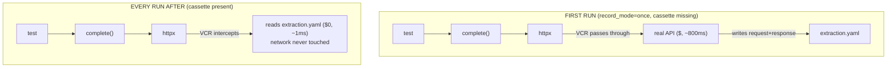

# Lecture 5: Notebook-to-Production Discipline — Typed Modules and Recorded LLM Calls

> A notebook is where you *discover* that an LLM prompt works. It is a terrible place to *keep* code that works. Cells hide global state, secrets get pasted next to logic, and every test run fires a real, slow, non-deterministic, billable API call. This lecture teaches the engineering discipline that turns a working notebook into code you can test in CI for free: extract logic into a typed module, push config and secrets to the edges, isolate the LLM call behind a seam, and *record* that call so it replays offline and deterministically forever. After this you'll be able to take any prototype and ship a `pytest` suite that runs green on a fresh CI runner with **no API key present**.

**Prerequisites:** Python 3.11+, `pytest` basics, comfort with Pydantic, you've called an LLM SDK at least once · **Reading time:** ~24 min · **Part of:** Frameworks, Ecosystem, Team Practice & Career — Week 1

---

## The core idea (plain language)

There is one boundary in an LLM application that behaves unlike any other line of code you write: the network call to the model. It is **slow** (hundreds of milliseconds to tens of seconds), **non-deterministic** (same input, different output — even at `temperature=0`, providers don't guarantee bit-identical results), and **costs money every single time**. Everything else in your system — parsing, validation, scoring, prompt assembly, business logic — is ordinary deterministic code that a computer runs the same way every time for free.

The entire discipline of this lecture is a single move applied twice:

1. **Separate the non-deterministic, expensive boundary from the deterministic, free logic.** Push the LLM call into one thin, replaceable function. Everything around it becomes plain testable code.
2. **Make that boundary recordable.** Run the real call *once*, capture the exact HTTP request and response to a file, and replay from the file on every future run. Now even the boundary is deterministic and free in tests.

A notebook violates this at every turn: logic, config, secrets, and the LLM call are tangled into cells that share hidden mutable state and re-run in whatever order you happened to click. The refactor is not cosmetic. It is what makes the difference between "I have a demo that works on my machine" and "I have a system a team can run in CI, refactor safely, and trust."

## How it actually works (mechanism, from first principles)

### Why notebooks resist testing

A Jupyter notebook is a REPL with a saved scrollback. Its execution model is the problem:

- **Hidden global state.** Cell 3 defines `df`; cell 9 mutates it; cell 5 reads it. The "state" of your program is the *history of which cells you ran in which order* — not something a test can reconstruct.
- **Config baked into cells.** `client = OpenAI(api_key="sk-proj-abc123...")` sitting in cell 2 means your secret is now in the `.ipynb` JSON, which you will eventually commit.
- **Every run hits the network.** There's no seam between "assemble the prompt" and "call the model," so you cannot exercise the logic without paying for and waiting on a real call.

Testability requires the opposite: explicit inputs, explicit outputs, no hidden state, and a way to run logic without I/O.

### Why "just set temperature=0" doesn't save you

Engineers new to this reach for `temperature=0` and assume the call is now deterministic, so why record anything? It isn't, for three stacked reasons. (1) **Floating-point non-associativity under batching.** Providers run your request on shared GPUs where the batch composition varies run to run; summing the same logits in a different order yields tiny differences that can flip the top token at a tie. (2) **Silent model updates.** A `-latest` alias, or even a pinned id, can be re-pointed or re-quantized by the provider without your code changing. (3) **Sampling floors.** Some stacks clamp temperature to a small non-zero value internally. The practical upshot: at `temperature=0` you get *mostly* stable output, but "mostly" is exactly the failure profile that produces a test that's green 49 times and red the 50th — the worst kind, because it erodes trust in the whole suite. Recording removes the variance entirely: the test asserts against a *frozen* response, so a red is always a real code change, never dice.

### Step 1 — Extract logic into a typed module (pure functions + a response model)

Move the code out of cells into a `.py` module and split it into two kinds of functions:

- **Pure functions**: input → output, no network, no clock, no randomness, no file writes. These are trivially testable.
- **I/O functions**: the one that actually calls the LLM.

Give the LLM's *structured output* a name with Pydantic. This turns "a dict I hope has the right keys" into a validated type:

```python
# smoke/tasks/extraction.py
from pydantic import BaseModel, field_validator

class Invoice(BaseModel):
    name: str
    date: str            # ISO 8601
    amount: float

    @field_validator("amount")
    @classmethod
    def non_negative(cls, v: float) -> float:
        if v < 0:
            raise ValueError("amount must be >= 0")
        return v

def build_messages(raw: str) -> list[dict]:
    """PURE: no I/O. Assembles the prompt. Test me without a network."""
    return [
        {"role": "system", "content": "Extract invoice fields as JSON."},
        {"role": "user", "content": raw},
    ]

def parse_response(text: str) -> Invoice:
    """PURE: validates + coerces. Test me with a string literal."""
    return Invoice.model_validate_json(text)
```

`build_messages` and `parse_response` are now unit-testable with zero network calls. You can assert that a malformed amount raises, that a missing field is caught, that the prompt contains the right instruction — all offline, in microseconds.

### Step 2 — Push config and secrets to the edges

Secrets and configuration belong in the environment, not in code. Use a `.env` file (git-ignored) plus a settings object that reads from the environment once, at the edge:

```python
# src/settings.py
from pydantic_settings import BaseSettings

class Settings(BaseSettings):
    openai_api_key: str = ""
    default_model: str = "openai/gpt-4o-mini"
    class Config:
        env_file = ".env"

settings = Settings()
```

```gitignore
# .gitignore
.env
```

The rule: **secrets never appear in source, notebooks, or logs.** In CI they arrive as repository secrets injected as env vars — and, as you'll see, for *recorded* tests they don't need to be present at all.

### Step 3 — Isolate the I/O behind a seam

Keep exactly one function that touches the network:

```python
# src/client.py
import litellm

def complete(model: str, messages: list[dict], **kw) -> str:
    r = litellm.completion(model=model, messages=messages, **kw)
    return r.choices[0].message.content or ""
```

Now the flow is `build_messages` (pure) → `complete` (I/O) → `parse_response` (pure). The only thing standing between you and free deterministic tests is that one `complete` call. Two techniques neutralize it.

### Step 4 — Record the boundary with VCR.py cassettes

VCR.py patches Python's HTTP stack (`urllib3`/`requests`/`httpx`). The first time a test runs, VCR lets the real request through and writes the **request and response** — method, URL, headers, request body, status, response body — to a YAML file called a *cassette*. On every subsequent run, VCR intercepts the outgoing request, finds the matching entry in the cassette, and returns the recorded response **without touching the network**.



```python
# tests/test_extraction.py
import vcr
my_vcr = vcr.VCR(
    cassette_library_dir="smoke/fixtures",
    record_mode="once",
    match_on=["method", "uri", "body"],
    filter_headers=["authorization", "x-api-key"],
)

@my_vcr.use_cassette("extraction.yaml")
def test_extraction_parses():
    from smoke.tasks.extraction import build_messages, parse_response
    from src.client import complete
    text = complete("openai/gpt-4o-mini", build_messages("ACME Inc, 2026-01-05, $42.00"))
    inv = parse_response(text)
    assert inv.name == "ACME Inc" and inv.amount == 42.00
```

**`record_mode` semantics** — the four you must know:

| Mode | Cassette missing | Cassette present, request matches | Request NOT in cassette |
|------|------------------|-----------------------------------|-------------------------|
| `once` (default) | record real call | replay | **error** (no new recording) |
| `none` | **error** | replay | **error** |
| `new_episodes` | record | replay | record the new one, append |
| `all` | record | **re-record** (ignore existing) | record |

- **`once`** is your day-to-day default: record the first time, replay forever, and *fail loudly* if the test tries a request you never recorded (a signal the contract changed).
- **`none`** is the strict CI/production mode: never allowed to hit the network. Use it in CI to *prove* no real calls sneak in.
- **`new_episodes`** appends newly-seen requests while keeping old ones — handy while iterating on a test that grows more calls.
- **`all`** discards and re-records everything — the deliberate "the API contract changed, refresh the truth" button.

**Matching.** VCR must decide which recorded interaction answers a given request. By default it matches on `method` + `uri`. For LLM calls, add **`body`** to `match_on`, because the URL (`POST /v1/chat/completions`) is identical for every prompt — only the request body differs. Matching on body means "cassette entry for *this exact prompt*," which is what you want: change the prompt, and VCR correctly reports no match rather than replaying a stale answer for a different input.

**Secret scrubbing.** The real request carries `Authorization: Bearer sk-...` or `x-api-key: ...`. `filter_headers=["authorization", "x-api-key"]` replaces those values before the cassette is written, so the committed YAML contains no secret. VCR also supports `filter_query_parameters` and `before_record_request/response` hooks for scrubbing secrets that live in bodies or query strings. **Always scrub before the first commit** — once a secret lands in git history, rotating the key is the only real fix.

### The alternative: saved-response fixtures

The simpler cousin is to save one model response as a JSON fixture and inject it via a mock:

```python
def test_parse_with_fixture(monkeypatch):
    saved = open("smoke/fixtures/invoice.json").read()
    monkeypatch.setattr("src.client.complete", lambda *a, **k: saved)
    ...
```

This is lighter-weight and fully transparent — you can read the fixture at a glance. Its weakness: it mocks *your* function, so it never exercises the real request serialization, headers, or HTTP-level behavior, and it drifts silently from what the API actually returns. VCR records the *whole HTTP round-trip*, so it catches "we changed the request shape and the API 400s now." Rule of thumb: **fixtures for pure-parsing unit tests, cassettes for integration tests that must resemble the real wire.**

## Worked example

Take the extraction task with 15 invoice strings. Compare the two regimes with concrete numbers (rates are approximate, for arithmetic only):

**Live-call test suite**
- 15 calls × ~800 ms = **12 s** per run.
- Cost per call ≈ 700 input + 40 output tokens. At an illustrative $0.15/$0.60 per 1M in/out: `(700 × 0.15 + 40 × 0.60)/1e6 ≈ $0.000129` per call → ~**$0.0019 per suite run**.
- Run it in CI on every push, 40 pushes/day across a team: ~$0.08/day. Small — but it's *flaky* (network, rate limits, non-determinism) and *requires a live key in CI*.

**Recorded (cassette) test suite**
- First run: 12 s, $0.0019, writes `extraction.yaml`.
- Every run after: replay from disk ≈ **10–50 ms total**, **$0.00**, **no key needed**.
- CI cost: $0. Flakiness from the network: eliminated. The 240× wall-clock speedup (12 s → ~50 ms) is what makes the test worth running on every save.

The cassette is a ~30 KB YAML file with 15 recorded interactions, each an entry pairing the request body (the prompt) with the response body (the JSON the model returned), and no `authorization` header. You commit it. A teammate on a fresh laptop with **no API key** clones, runs `pytest`, and it's green in 50 ms.

## How it shows up in production

- **CI without a key.** The payoff is a GitHub Actions workflow that runs your whole LLM test suite on every push with no `OPENAI_API_KEY` secret configured — because the cassettes carry the answers:

  ```yaml
  # .github/workflows/ci.yml
  name: ci
  on: [push, pull_request]
  jobs:
    test:
      runs-on: ubuntu-latest
      steps:
        - uses: actions/checkout@v4
        - uses: astral-sh/setup-uv@v5
        - run: uv sync --dev
        - run: uv run pytest    # replays cassettes; no API key present
  ```

  Set `record_mode="none"` in CI so a missing-cassette or contract-change failure is *loud*, not a silent live call. If a test ever tries an unrecorded request, CI fails with "cassette has no matching interaction" — exactly the alarm you want.

- **Refactoring safety.** Because logic is separated from I/O and pinned by recorded outputs, you can restructure prompt assembly, swap parsers, or upgrade libraries and know within seconds whether behavior changed — without spending a cent or waiting on the network.

- **Debugging non-determinism.** When production returns a weird result, you save that exact interaction as a cassette and get a *deterministic reproduction* of a non-deterministic bug. This is often the only way to debug "it fails 1 in 50 times."

- **Re-recording on contract change.** When you intentionally change the prompt, upgrade the model, or the provider changes its response schema, you re-record: delete the cassette (or run with `record_mode="all"`), run once against the live API with a key, inspect the diff in the YAML, and commit. The git diff of a cassette is a *reviewable record of how the model's output changed* — a genuinely useful artifact in code review.

- **The general principle beyond LLMs.** Nothing here is LLM-specific. The move — *isolate the slow, non-deterministic, costly boundary behind one seam, then record it* — is the same discipline that makes any external dependency testable: a payment gateway, a flaky third-party REST API, a clock, a random-number source. LLMs just make the case unusually stark because the boundary is *all three* problems at once (slow, non-deterministic, billable). Once you internalize "the LLM is just another I/O boundary," the rest of your system stops being special and becomes ordinary code you test like any other — which is the entire point. The seam is also where every other cross-cutting concern lives: retries, timeouts, circuit breakers, provider fallback, cost accounting, and request logging all hang off that one function.

## Common misconceptions & failure modes

- **"Recorded tests prove the model is correct."** No. They prove your *code* behaves consistently against a *fixed* model response. Model quality is what your eval suite (golden sets, scorers) measures — a separate, live-or-batched activity. Don't conflate contract tests with quality evals.
- **Cassettes rot silently.** A cassette recorded a year ago may not reflect today's API. If you never re-record, your tests pass against a fossil. Schedule periodic re-recording, and treat a real-API smoke run (nightly or on-demand) as the freshness check.
- **Leaking secrets into the cassette.** Forgetting `filter_headers` writes your bearer token into a committed YAML. Always scrub, and diff the first cassette before committing. Assume anything in git history is compromised.
- **Matching too loosely or too tightly.** Match only on `method`+`uri` and every prompt replays the same recorded answer (wrong). Match on the full body including a random `request_id` or timestamp and *nothing* ever matches on replay (brittle). Match on the semantically meaningful part — usually method, uri, and the message body — and scrub volatile fields.
- **Committing the `.env`.** The `.env` is for local dev only and must be git-ignored. CI secrets live in the platform's secret store; recorded CI needs none at all.
- **Treating the notebook as the source of truth.** Once extracted, the module is canonical. Keep the notebook as a scratchpad/README, not as the deployable artifact.
- **Non-deterministic assertions.** Even with a replayed response, asserting `text == "exact string"` can be too rigid if you later re-record. Prefer asserting on the *parsed, validated* fields (`inv.amount == 42.0`) than on raw model prose.

## Rules of thumb / cheat sheet

- **One seam.** Exactly one function touches the network. Everything else is pure.
- **Type the output.** A Pydantic model for structured responses turns "hope" into validation.
- **Config to the edge.** `.env` (git-ignored) + a settings object; secrets never in code or cells.
- **`record_mode="once"` locally**, **`record_mode="none"` in CI.** Record first run, replay forever, fail loud on new requests.
- **`match_on=["method","uri","body"]`** for LLM calls — the URL is constant, the prompt isn't.
- **`filter_headers=["authorization","x-api-key"]`** — scrub before the first commit, always.
- **Commit cassettes.** They *are* the CI fixtures; a keyless runner needs them.
- **Re-record intentionally** (`all` or delete-and-rerun) when the prompt/model/contract changes; review the YAML diff.
- **Cassettes ≠ evals.** Contract stability is not model quality. Keep both.
- **Fixtures for parsing, cassettes for the wire.** Use the lightest tool that catches the failure you care about.

## Connect to the lab

This is Deliverable 5 of the Week-1 smoke-test repo: take the extraction task you'd normally prototype in a notebook, extract it into `smoke/tasks/extraction.py` with a Pydantic response model, record its LLM responses into `smoke/fixtures/extraction.yaml` with VCR.py, and wire `.github/workflows/ci.yml` to run `pytest` on push with **no API key**. Your Definition of Done — "`pytest` runs green offline using committed cassettes; a GitHub Actions run is green on a push" — is exactly the mechanism this lecture builds.

## Going deeper (optional)

- **VCR.py official docs** — `vcrpy.readthedocs.io` — canonical reference for `record_mode`, `match_on`, and request/response filtering.
- **pytest-recording** — the pytest plugin wrapping VCR.py with `@pytest.mark.vcr`; search: `pytest-recording github`.
- **pytest docs on `monkeypatch` and fixtures** — `docs.pytest.org` — for the saved-response-fixture alternative.
- **Pydantic v2 docs** and **pydantic-settings** — `docs.pydantic.dev` — response models and environment-driven settings.
- **The Twelve-Factor App**, factor III (Config) — `12factor.net` — the canonical argument for config-in-environment.
- Hamel Husain's writing on evals and LLM engineering discipline — `hamel.dev` — for how recorded tests sit alongside real evals.
- Search queries: `VCR.py filter_headers api key`, `pytest LLM test deterministic cassette`, `record and replay http tests python`.

## Check yourself

1. Why does a live-API test both cost money *and* prove less about model quality than you might think?
2. You add `match_on=["method","uri"]` but not `"body"`. A test with a new prompt passes and returns the old answer. Why, and what's the fix?
3. What is the difference in behavior between `record_mode="once"` and `record_mode="none"` when a test issues a request that is *not* in the cassette?
4. Give two concrete reasons to commit the cassette YAML into the repo, and one thing you must do to the cassette before committing.
5. Your prompt template changes. Walk through the exact steps to update the recorded tests, and say what you'd inspect before committing.
6. Why keep exactly one function that touches the network, rather than calling the SDK wherever convenient?

### Answer key

1. It costs money because each run bills real tokens and adds network latency and flakiness. It proves little about *quality* because a single passing test only shows your code handled *one* response consistently — model correctness is measured by an eval suite over many cases with scorers, not by a contract test pinned to one recorded answer.
2. Every LLM request hits the same URL (`POST /v1/chat/completions`), so matching only on method+uri makes *any* request match the *first* recorded interaction — VCR replays the stale answer for a different prompt. Fix: add `"body"` to `match_on` so the prompt is part of the match key; the new prompt then correctly finds no match (and, under `once`/`none`, fails loudly, or under `new_episodes`, records a new entry).
3. With `once`, an unrecorded request raises a "no matching interaction" error (it will *not* silently record a new call once the cassette exists). With `none`, it also errors and additionally refuses to ever record — `none` is the strict no-network mode for CI. Both fail rather than hit the network; `none` is the stronger guarantee.
4. (a) The cassette *is* the CI fixture — a keyless runner replays from it, so tests run with no API key. (b) It makes tests deterministic and fast (milliseconds, $0) and gives reviewers a diffable record of model output. Before committing you must scrub secrets — at minimum `filter_headers=["authorization","x-api-key"]` — and diff the file to confirm no token or PII leaked.
5. Re-record intentionally: delete `extraction.yaml` (or run with `record_mode="all"`), run the test once locally *with* an API key so it hits the live API and rewrites the cassette, then inspect the git diff of the YAML to see how request/response changed and confirm the parsed assertions still hold and no secret was recorded. Commit the refreshed cassette. Restore `record_mode="none"`/`"once"` for normal runs.
6. A single network seam is the one place you patch, record, mock, add retries/timeouts, or swap providers. Scattering SDK calls means many places to intercept, no clean boundary for VCR to record, duplicated error handling, and logic entangled with I/O — which is exactly what makes notebook code untestable.
