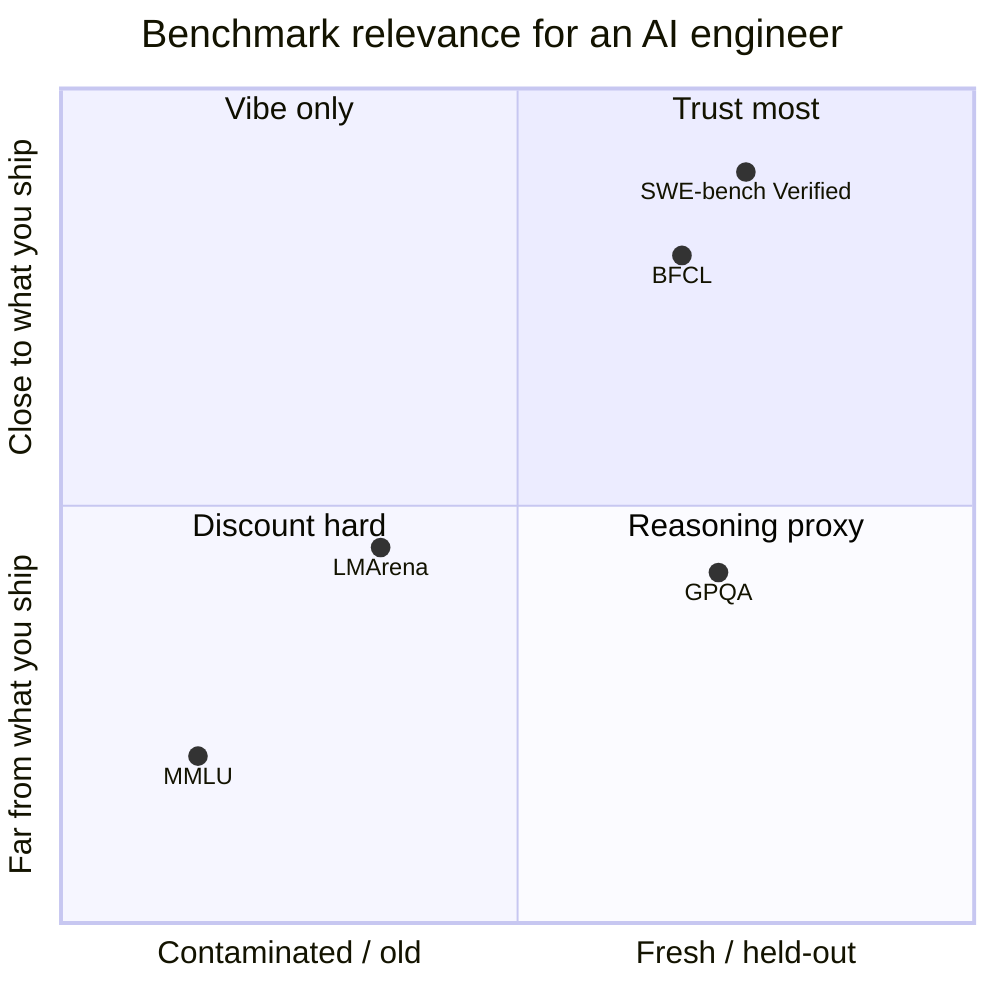

# Lecture 6: Benchmark Literacy and Its Limits

> Every model launch arrives wrapped in a bar chart, and every bar chart is an argument someone spent millions to win. "92% on MMLU." "New SWE-bench state-of-the-art." "#1 on the Arena." These numbers move procurement budgets, headlines, and — most dangerously — your own gut feeling about which model to reach for on Monday. Almost none of them predict how a model behaves on *your* task. This lecture makes you a critical reader of benchmarks. After it you will know exactly what each major benchmark measures and how relevant it is to you, the three mechanisms that make a score overstate real quality, how to read a cross-model dashboard like Artificial Analysis without being fooled, and — the drum the whole roadmap keeps beating — why a 25-case private domain eval beats any leaderboard for choosing a model to ship.

**Prerequisites:** You can build and score a simple eval (Phase 7), you understand tokens and context windows (Phase 2), and you've shipped at least one LLM feature. · **Reading time:** ~30 min · **Part of:** Frameworks, Ecosystem, Team Practice & Career — Week 2

---

## The core idea (plain language)

A benchmark is a **fixed set of questions plus a scoring rule**. When a lab reports "78% on GPQA," it means: on this frozen question set, using this exact prompt and this answer-parser, the model got 78% of items scored correct. That's the whole claim. The number is real, but it answers a question you probably didn't ask.

The question you actually have is narrow and concrete: *"On the specific task I'm about to ship — extract fields from these invoices, resolve tickets in this repo, answer questions over this document set — which model wins, and at what cost per useful answer?"* A benchmark answers a broader question: *"Across this large, public, static distribution of problems, how does the model rank?"* The gap between those two questions is where careers full of bad model choices are made.

Three forces widen that gap into a chasm:

1. **Contamination** — the test questions (or close paraphrases) leaked into the model's training data, so a high score partly measures *memorization*, not capability.
2. **Format sensitivity** — the same model on the same questions can swing several points purely from how you phrase the prompt and parse the answer. That's the *harness*, not the model.
3. **Usable context ≠ advertised context** — a "1M-token window" model can still lose facts buried in the middle of a long input, so the headline number oversells the capability you'll actually depend on.

The payoff of this lecture is a reflex. When you see a benchmark number, you should immediately ask three things: *What does this measure? How fresh is it? Does its distribution look anything like my task?* And when the honest answer is "not much like my task," you trust the small eval you built last week over the leaderboard, every single time.

---

## How it actually works (mechanism, from first principles)

### The benchmark zoo — what each one actually measures

Sort benchmarks along two axes an engineer cares about: **how close the task is to what you ship** (broad-knowledge MCQ → agentic coding), and **how contamination-resistant it is** (old and public → fresh and held-out). Here's the map:



If mermaid doesn't render for you, the same map in ASCII:

```
 close to        SWE-bench Verified ┐
 what you           BFCL (tools)    ├── care most
 ship               GPQA (held-out) ┘
    ▲
    │            LMArena (preference, gameable)
    │
 far from        MMLU (saturated, contaminated)
 what you ship   ─────────────────────────────────►
                 contaminated / old   fresh / held-out
```

**MMLU** (Massive Multitask Language Understanding) — ~16k multiple-choice questions across 57 subjects: history, law, medicine, elementary and college math. It defined "broad knowledge" for a generation of models. Two problems make it nearly useless for model *selection* in 2025–2026. It's **saturated** — frontier models cluster in the high 80s to low 90s, so the spread between them is within measurement noise. And it's **contamination-suspect** — it has been public and scraped for years, so top scores partly reflect memorization. A high MMLU today tells you a model is "not obviously broken on general knowledge" — a floor, not a discriminator. When a launch leads with MMLU, read it as marketing filler. (Successors like MMLU-Pro and MMLU-Redux exist precisely because the original saturated.) **Relevance to you: near zero for selection; a sanity floor at best.**

**GPQA** (Graduate-Level Google-Proof Q&A) — a few hundred hard multiple-choice questions in biology, chemistry, and physics, written by domain PhDs and filtered so that skilled non-experts *with unrestricted web access* still fail them. "Google-proof" is the design goal: surface retrieval doesn't crack these, so the benchmark probes genuine reasoning over specialist knowledge. Its **held-out difficulty** — especially the curated "Diamond" subset — makes it more contamination-resistant and a far better discriminator among frontier models than MMLU. **Relevance to you: a decent proxy for hard reasoning horsepower. But the items are graduate science MCQs — unless you ship science QA, treat a strong GPQA as evidence of raw reasoning, not fitness for your task.**

**SWE-bench / SWE-bench Verified** — the closest thing on this list to *your* reality. Each task is a **real GitHub issue from a real Python repository**. The model must produce a code patch; scoring then runs the repo's actual test suite — the patch either makes the failing tests pass without breaking others, or it doesn't. This is agentic coding measured end-to-end: read a codebase, localize the defect, edit possibly several files, don't regress anything. The problem with the *original* SWE-bench is that some issues were underspecified, had broken or unbuildable environments, or had tests that couldn't pass regardless of the patch — so scores were noisy and *understated* capability. **SWE-bench Verified** is a ~500-task subset that professional engineers manually filtered to remove those broken and ambiguous cases. That's why "Verified" matters: it's the version where a percentage means "solved a genuinely solvable, well-specified real issue," so it's the number to quote and compare. **Relevance to you: for anyone building coding agents this is the single most task-relevant public benchmark — but note it's Python-heavy and issue-shaped, so it still isn't your codebase.**

**BFCL** (Berkeley Function-Calling Leaderboard) — measures **tool-calling accuracy**. Given a set of function/tool definitions and a user request, does the model pick the right function, fill the arguments with correctly-typed values, handle multiple and parallel calls, and — the part people forget — correctly decide *not* to call anything when no tool applies (the relevance / abstention cases)? This is directly relevant if you build agents, because tool-calling failures — wrong tool, malformed JSON args, hallucinated parameters, calling a tool it shouldn't — are exactly the bugs that break agent loops in production. A model can be a brilliant prose writer and a terrible tool-caller. **Relevance to you: high if you build agents; BFCL is where you catch a bad tool-caller before it eats a sprint.**

**LMArena** (formerly Chatbot Arena / LMSYS) — **human pairwise preference**. Two anonymous models answer the same user prompt; a human picks the better response; an Elo-style rating aggregates millions of these votes into a leaderboard. Its strength is real: it measures something fixed-answer benchmarks can't — human judgment of helpfulness, tone, and "did this actually answer me," the *vibe*. Its weaknesses matter just as much. It's **style-biased** (longer, more formatted, more confident answers win votes even when no more correct), it's **gameable** (labs tune to arena preferences, and there's ongoing debate about test-time variants and vote manipulation), and its prompt distribution is generic chat, not your workload. **Relevance to you: good signal for "is this a pleasant general assistant," weak signal for "will this extract my invoice fields correctly."**

### Failure mechanism 1 — contamination

A benchmark is a fixed body of text. Model training data is a giant scrape of the public internet. If the benchmark is old and popular, its questions **and their answers** are almost certainly somewhere in that scrape — in a GitHub repo, a blog post explaining the answers, a HuggingFace mirror. When they are, the model can score high by *recalling* the answer rather than *deriving* it. Recall is exactly the skill you don't need it to have on your novel, private inputs.

Concretely. Imagine a 1,000-question benchmark. Suppose 200 of those questions (or near-duplicate paraphrases) appeared in training. A model that "truly" solves 60% of unseen questions but reliably regurgitates the 200 memorized ones scores:

```
memorized:   200 × 1.00 = 200 correct
genuine:     800 × 0.60 = 480 correct
total:       680 / 1000 = 68%   (looks like a 68% model)
true skill on fresh items:        60%
```

An 8-point inflation, invisible in the headline. In reality the effect can be larger, and it's very hard to measure from outside because labs rarely disclose their exact training corpus. This is why **fresh and held-out benchmarks are more trustworthy**: GPQA's Google-proof held-out design, SWE-bench Verified's real-issue tasks, and — best of all — a private eval you wrote last week that has never touched the public internet. The reflex: *the older and more famous the benchmark, the more you discount a high score.*

### Failure mechanism 2 — format sensitivity

The same model, on the same questions, can produce different scores from trivial-seeming choices: whether options are labeled `A/B/C/D` or `1/2/3/4`, whether you demand "the letter only" or let it reason first, whether the parser does exact-match or fuzzy-match, whether you use the provider's chat template exactly, how many few-shot examples you prepend. None of these are model-capability differences. They're **harness** differences, and they routinely move scores by several points.

Mechanically: the model emits a probability distribution over tokens, from which it samples text. Your parser then has to extract "the answer" from that free text. If the model says *"The answer is C, because…"* and your regex only accepts a bare `C` alone on a line, you just scored a correct answer as wrong.

```
Model output: "Based on the above, I'd go with (C)."
Parser A (regex ^([A-D])$):        no match  → scored WRONG
Parser B (find first (X) token):   C         → scored RIGHT
Same model, same answer, different score.
```

Multiply across a few hundred items and the parser alone produces a multi-point swing before the model's actual knowledge enters the picture. The engineering consequences: (1) two labs reporting different numbers for the *same* model on the *same* benchmark are usually just running different harnesses — don't assume one is lying; (2) when you build your own eval, the prompt template and parser *are part of the measurement*, so freeze them and version them like code; (3) never compare a number you computed against a number someone else computed unless you know both harnesses match.

### Failure mechanism 3 — usable context vs advertised context

A spec sheet says "context window: 1,000,000 tokens." That is the maximum the model will *accept* without erroring. It is **not** a promise that the model uses information anywhere in that window equally well. Recall quality typically degrades with input length, and — famously — models often lose facts placed in the **middle** of a long context while still nailing facts near the beginning and the end (the "lost in the middle" effect).

Two framings you should know by name:

- **Needle-in-a-haystack (NIAH):** bury a single unique fact ("the access code is PLUM-7741") at some depth in a long filler document, then ask for it. Vary the depth (0%, 25%, 50%, …) and the total length and plot recall. A model can be 100% at 8k tokens and drop noticeably at 200k, especially for needles placed ~50% deep.
- **RULER:** a more demanding synthetic benchmark that goes beyond single-needle retrieval to *multi-needle*, aggregation, variable-tracking, and question-answering tasks at varying lengths. Its whole point is to report an **effective context length** — the length beyond which performance falls below a threshold — which is routinely far shorter than the advertised window (models advertising 128k+ frequently show effective lengths a fraction of that).

Why it bites you: you build a RAG system, stuff 400k tokens of retrieved chunks into a "1M" model, and quietly lose answers that depended on a chunk in the middle. No error, no crash — just wrong or "I don't have that information." The fix is not to trust the spec; it's to **run a needle test at YOUR real context length with YOUR kind of content**, because recall depends on content type (dense code vs. flowing prose vs. tables of numbers) and on where the relevant span sits. Advertised context is a ceiling; usable context is what you must measure.

---

## Worked example

You're choosing a model for a support-ticket triage agent. It reads a ticket plus a knowledge-base article and calls one of five tools (`escalate`, `refund`, `send_article`, `close`, `ask_clarifying`). You have a per-request budget and a latency SLA. Here's how benchmark literacy plays out against a naive read.

**Naive read of the launch post:** *"New model X: 91% MMLU, #1 on LMArena, strong GPQA. Best model available — ship it."*

**Literate read:**
- MMLU 91% → saturated and contamination-suspect; tells you nothing discriminating. **Ignore.**
- LMArena #1 → it's a pleasant conversationalist; style-biased, generic-chat distribution. Your task is tool selection, not chat. **Weak signal.**
- GPQA strong → good reasoning horsepower, but graduate science ≠ ticket triage. **Mild positive.**
- The number that would actually matter — **BFCL** (tool-calling) — wasn't in the post. That absence is itself information: labs lead with their best numbers.

So you go pull the BFCL comparison and, more importantly, you build a **domain eval**: 25 real (anonymized) tickets, each labeled with the correct tool and arguments. You run three candidate models through it with your *actual* prompt and tool schemas, scoring exact tool-match and argument correctness, and you record cost and p50 latency per call.

Suppose it comes out like this (illustrative numbers — you generate your own; never quote these as facts):

```
| model      | LMArena rank | domain tool-acc | $/1k calls | p50 lat |
|------------|--------------|-----------------|------------|---------|
| X (hyped)  | #1           | 72%             | $4.10      | 2.1s    |
| Y          | #6           | 89%             | $1.30      | 0.9s    |
| Z (cheap)  | #14          | 81%             | $0.40      | 0.7s    |
```

Now compute the number that actually decides it — cost per *correct* decision, not cost per call:

```
X: $4.10 / (1000 × 0.72) = $0.0057 per correct decision
Y: $1.30 / (1000 × 0.89) = $0.0015 per correct decision
Z: $0.40 / (1000 × 0.81) = $0.0005 per correct decision
```

The leaderboard darling **X** is worst on the only task you ship *and* the most expensive per useful answer — roughly 4× Y and 11× Z. **Y** wins on raw accuracy; **Z** is the cost-per-correct champion and defensible if 81% is good enough behind a human-in-the-loop escalation, and its 0.7s p50 helps your SLA. The leaderboard ranking and your ranking **disagree completely**, and that disagreement is the entire point. Trust the bar chart and you ship the wrong model.

---

## How it shows up in production

- **You picked a model off a leaderboard and quality tanked on real traffic.** The benchmark distribution didn't match your inputs — your users write terse, misspelled, jargon-heavy prompts; the benchmark had clean academic questions. The fix is always a domain eval *before* the rollout, not a post-mortem after the incident.
- **A "1M context" feature silently drops facts.** Answers that depend on the middle of a long stuffed context come back wrong or "I don't have that information." No error, no crash — just quietly degraded recall. You only catch it if you ran a needle test at your real length. This is one of the most expensive-to-debug RAG failures because nothing looks broken.
- **Your eval score doesn't match the vendor's benchmark number and someone panics.** Usually a harness/format difference, not a broken model. Knowing about format sensitivity lets you say "different parser and prompt template — expected" instead of burning a day chasing a phantom regression.
- **Cost blows up because you optimized for the wrong metric.** A model that tops a quality leaderboard but costs 3× per *useful* answer is a bad production choice. The metric that matters is cost-per-correct-answer on your task (the `$/correct` column from your Week-1 smoke test), not a benchmark percentage.
- **A new model drops mid-quarter and everyone wants to switch.** With a domain eval wired into your smoke-test harness, "should we switch?" is a 20-minute question with a table for an answer — not a week of vibes-based Slack debate.

---

## Common misconceptions & failure modes

- **"Model A beats Model B on MMLU, so A is better."** MMLU is saturated; the gap is likely within noise and partly contamination. On your task the ranking can flip entirely.
- **"Higher LMArena Elo means more correct answers."** No — it means more *preferred* answers, and preference skews toward length, formatting, and confidence. Preference and correctness diverge sharply on tasks with verifiable answers.
- **"SWE-bench and SWE-bench Verified are interchangeable."** Verified is the human-filtered subset that removes broken/ambiguous tasks; its scores are cleaner and higher. Always check *which* one a number refers to, and prefer Verified for comparisons.
- **"1M tokens means I can use 1M tokens."** It means the model won't error at 1M. Usable/effective context is typically far shorter; test recall at your real length.
- **"A benchmark number is objective, so two labs' numbers are directly comparable."** Only if the harness — prompt template, answer parser, few-shot setup — matches. Format sensitivity says otherwise.
- **"Contamination is a rare edge case."** For old, popular, public benchmarks it's the *default assumption*, not the exception. Freshness is a feature.
- **"My eval is too small (25 cases) to matter."** A small, *representative*, private eval on your exact task beats a giant public benchmark on a different distribution. For model *selection*, representativeness beats raw size.

---

## Rules of thumb / cheat sheet

*(Approximate, opinionated, current to 2025–2026. Never quote specific benchmark percentages from memory — go read the source.)*

- **What each benchmark buys you:** MMLU → floor check only (saturated). GPQA → hard-reasoning proxy (held-out, decent). SWE-bench **Verified** → agentic-coding reality (closest to real work). BFCL → tool-calling accuracy (care if you build agents). LMArena → general helpfulness/vibe (gameable, style-biased).
- **Discount rule:** the older + more famous the benchmark, the more you discount a high score (contamination).
- **Never compare cross-harness numbers.** Different prompt/parser = different measurement.
- **Advertised context is a ceiling, not a capability.** Always needle-test at your real length with your content type.
- **The absence of a benchmark in a launch post is information** — labs lead with their best numbers.
- **For model selection, the ranking that counts is your domain eval's `$/correct`,** not any leaderboard.
- **Minimum viable domain eval:** 20–30 representative cases, checkable expected outcomes, your real prompt + parser, frozen and version-controlled.
- **Read Artificial Analysis for triangulation, not truth:** use it to shortlist 2–3 candidates on cost/latency/quality, then decide with your own eval.

### Reading Artificial Analysis (the cross-model dashboard)

Artificial Analysis (`artificialanalysis.ai`) aggregates many models onto shared axes: a composite **quality index** (a blend of public benchmarks), **price** (input/output $/M tokens, plus blended-price estimates), **speed** (output tokens/sec), and **latency** (time-to-first-token). It's genuinely useful — as a shortlisting tool, not an oracle. How to read it like a pro:

1. **Use it to shortlist, not to decide.** It's the fastest way to see "who's roughly in this cost/quality neighborhood right now."
2. **Watch the axes and units.** The quality index is a composite of the same public benchmarks with all their limits baked in; a high index inherits every bit of contamination and saturation risk from its ingredients.
3. **Price and speed are the trustworthy parts.** Those are measured, provider-reported operational facts — more directly actionable than the quality composite. Note that its blended price assumes a fixed input:output ratio that may not match yours.
4. **Plot candidates on the cost-vs-quality frontier,** pick the 2–3 sitting on the frontier (nothing dominates them), then run *your* domain eval to break the tie. The dashboard narrows the field from twenty to three; your eval picks the one.

---

## Connect to the lab

This lecture is the "why" behind Week 2's domain-eval lab. You'll add `smoke/tasks/domain.py` to your Week-1 smoke-test repo: 20–30 real cases from a domain you care about, each with a checkable expected outcome, run across the same models with a new `domain` column in the report. The required deliverable is two sentences comparing *your* ranking to a public leaderboard's — and the point is that they'll disagree. That disagreement, plus the `$/correct` column, is exactly the benchmark-literacy reflex this lecture builds, turned into a repeatable tool you run every time a new model ships.

---

## Going deeper (optional)

Real, named resources (search where no stable root URL is given — don't trust invented deep links):

- **SWE-bench** — official project site and paper: `swebench.com`; search `SWE-bench Verified OpenAI announcement` for the human-filtered-subset writeup.
- **GPQA** — search `GPQA a graduate-level google-proof Q&A benchmark paper`.
- **BFCL** — Berkeley Function-Calling Leaderboard; search `Berkeley Function Calling Leaderboard gorilla`.
- **LMArena** — `lmarena.ai`; search `Chatbot Arena LMSYS Elo methodology paper` for how the rating works and its biases.
- **RULER** — search `RULER What's the Real Context Size of Your Long-Context Language Models` (NVIDIA).
- **Lost in the Middle** — search `Lost in the Middle how language models use long contexts Liu et al`.
- **Needle in a Haystack** — search `Greg Kamradt needle in a haystack LLM context test`.
- **Artificial Analysis** — `artificialanalysis.ai` (cross-model cost/latency/quality dashboard).
- **MMLU / MMLU-Pro** — search `Measuring Massive Multitask Language Understanding Hendrycks` and `MMLU-Pro benchmark`.
- **Contamination** — search `data contamination LLM benchmark survey` and Simon Willison's blog (`simonwillison.net`) for practitioner commentary on benchmark trustworthiness.
- **Book** — Chip Huyen, *AI Engineering* (O'Reilly), chapters on evaluation.

---

## Check yourself

1. A launch post leads with "94% on MMLU." How much should that move your model choice, and why?
2. Explain, with a small numeric example, how contamination can inflate a benchmark score above the model's true skill on fresh inputs.
3. Why does SWE-bench *Verified* exist, and why should you prefer it over the original SWE-bench when comparing coding models?
4. Two teams report different scores for the same model on the same benchmark. Give the most likely benign explanation.
5. Your model has a 1M-token advertised context. What must you do before relying on it for a long-context RAG feature, and what specific failure are you guarding against?
6. LMArena and your domain eval rank three models in opposite orders. Which do you trust for shipping, and what does the disagreement tell you?

### Answer key

1. **Barely at all.** MMLU is saturated (frontier models cluster near the top, so gaps are within noise) and contamination-suspect (it's old and public, so high scores partly reflect memorization). It's a floor check — "not broken on general knowledge" — not a selection discriminator. Treat it as marketing filler.

2. If a benchmark has 1,000 items and 200 leaked into training, a model with 60% true skill scores `200×1.0 + 800×0.6 = 680 → 68%` even though it only solves 60% of genuinely unseen items. The 8-point gap is invisible in the headline and can be larger in practice. Hence prefer fresh/held-out benchmarks and private evals.

3. The original SWE-bench contained underspecified issues, broken environments, and tasks whose tests couldn't pass regardless of the patch, making scores noisy and understated. **Verified** is a ~500-task subset that professional engineers filtered to keep only genuinely solvable, well-specified issues, so its percentages are cleaner and more comparable. Always confirm which variant a number refers to.

4. **Different harnesses** — different prompt templates, few-shot setups, or answer parsers (format sensitivity). The same model on the same questions can swing several points from parsing/formatting alone, so cross-harness numbers aren't directly comparable and neither team is necessarily wrong.

5. **Run a needle-in-a-haystack test at your real context length with your real content type** (code vs. prose vs. tables), varying the depth of the buried fact. You're guarding against the "lost in the middle" / degraded-recall failure: the model accepts 1M tokens but silently drops facts placed mid-context, producing wrong or "I don't know" answers with no error. Advertised context is a ceiling; usable/effective context (à la RULER) is typically far shorter.

6. **Trust your domain eval** for the shipping decision, because it uses your exact task, inputs, prompt, and parser, while LMArena measures generic human preference (style-biased, gameable, different distribution). The disagreement tells you the leaderboard's distribution doesn't match your task — which is the norm, and precisely why a small private eval beats a leaderboard score for model selection.
