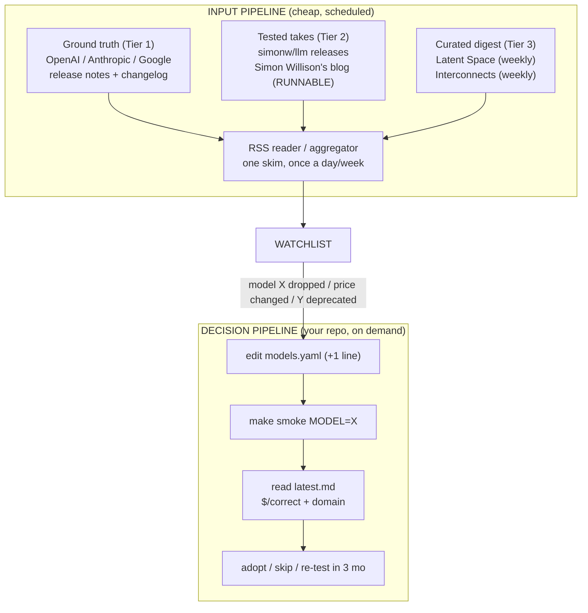

# Lecture 8: Staying Current Without Drowning — A Primary-Source Pipeline

> The AI field ships something "you have to try" roughly every 72 hours, and 95% of it is noise that evaporates by the following week. If you react to all of it you burn your attention and ship nothing; if you ignore all of it you wake up one day two years behind. This lecture teaches the low-noise habit that keeps you current for *years* on a fixed, small time budget: read a short list of **primary changelogs**, keep a tiny watchlist, and — the part everyone gets wrong — let your **own smoke-test table** decide adoption, never a Twitter thread or a launch-day demo. After this you'll have a written runbook that converts "a new model was announced this morning" into a mechanical, data-driven adopt/skip decision in under an hour.

**Prerequisites:** Week 1's `new-model-smoke-test` repo (LiteLLM client, tasks, `$/correct` report), basic RSS/feeds literacy, `make`/`just` basics · **Reading time:** ~26 min · **Part of:** Frameworks, Ecosystem, Team Practice & Career — Week 2

---

## The core idea (plain language)

There are two failure modes for staying current, and almost every engineer lives in one of them.

**Mode 1 — Drowning.** You follow 200 AI accounts. Every launch feels urgent. You spend an hour a day reading threads, watching demos, and feeling perpetually behind. You *consume* constantly but rarely *decide* anything, because the input is optimized for engagement, not for your decisions.

**Mode 2 — Ossifying.** You got burned by the noise, so you tuned it all out. You're still shipping `gpt-4o-mini` in 2026 because switching feels like a research project, and you have no idea whether the model that's half the price and released last month would beat it on *your* task.

The escape from both is a single principle:

> **Consume primary sources on a schedule. Let your own measurement decide adoption.**

Split the problem into two independent pipelines. The **input pipeline** is a low-noise feed of *ground truth* — official changelogs, one or two tested-take blogs, one or two curated newsletters. Its only job is to reliably tell you "a thing happened" (a model dropped, a price changed, an API was deprecated). The **decision pipeline** is your Week 1 smoke-test repo: when the input says a model dropped, you don't form an opinion from the launch post — you add one line to `models.yaml`, run `make smoke MODEL=<id>`, and read the `$/correct` and `domain` columns. The blog told you *what to test*. Your table tells you *what to adopt*.

The magic is that this decouples "keeping up" from "having opinions." You keep up cheaply because primary sources are few and high-signal. You form opinions expensively and rarely, only when your own numbers move — which is the only signal that actually affects what you ship.

## How it actually works (mechanism, from first principles)

### Why "signal over noise" is a real, quantifiable property of a source

Treat every source as having a **signal-to-noise ratio**: of the items it emits per week, how many change a decision you'd actually make? A source that posts 50 items/week where 1 matters has SNR ≈ 2%. A provider changelog that posts 3 items/week where 3 matter has SNR ≈ 100%. Your reading budget is fixed (say 30 min/day). You want to spend it on the highest-SNR sources first.

Here's the arithmetic that should scare you off the firehose. Suppose you have 30 minutes/day for currency.

```
Firehose (Twitter/X feed):
  ~300 items/day scanned, ~30s each to triage    = fills the whole 30 min
  decision-relevant items:      ~2/day
  time per useful item:         ~15 min

Primary-source pipeline (RSS reader, curated):
  ~15 items/day, ~30s each to triage             = ~8 min
  decision-relevant items:      ~3/day
  time per useful item:         ~2.7 min          (5.5x more efficient)
  + you have 22 min left to actually run a smoke test
```

The firehose is not just noisier — it's *slower per useful item* because you pay triage cost on 300 items to find 2. The whole game is cutting the denominator.

### The two-layer architecture



The left half you *read*. The right half you *run*. They meet at the watchlist — a five-line text file, not a feeling.

### Why these specific sources earn their place

Every source in the pipeline must justify its slot. Here's the rubric applied.

**Tier 1 — Official changelogs / release-notes pages (OpenAI, Anthropic, Google).** These are *ground truth*. Model drops, deprecation dates, pricing changes, API-shape changes, and quota changes appear here first and canonically. A launch tweet can spin; a deprecation notice cannot — it has a date and it will break your code on that date whether or not you saw the thread. SNR is near 100% because providers don't post filler on these pages. **This is the only tier you cannot skip** — deprecations here are the ones that page you at 2am.

**Tier 2 — `simonw/llm` project + Simon Willison's blog.** The value here is *tested, runnable takes*. Willison ships a CLI (`llm`) that he uses against every new model the day it lands, and he writes up what actually worked with copy-pasteable commands, not vibes. When he says a model is good at X, there's usually a reproducible example. This is your bridge between "a model exists" (Tier 1) and "here's a concrete thing to try in my smoke test." The `simonw/llm` GitHub releases feed doubles as an early-warning system: plugins for new providers often land there within hours.

**Tier 3 — Curated newsletters (Latent Space, Interconnects).** These are *SNR filters run by humans who read the firehose so you don't have to*. Latent Space (Swyx/Alessio) leans practitioner/industry; Interconnects (Nathan Lambert) leans research/RL/post-training analysis. Weekly cadence is a feature — it forces batching, and a week of hype compresses into a paragraph of "here's what actually mattered." You read these to catch the *category-level* shifts (a new technique, a new class of model) that a changelog won't editorialize about.

Notice what's **not** on the list: your algorithmic timeline, YouTube "SHOCKING new model DESTROYS everything" videos, and Discord servers. They can be fun, but their SNR is too low to earn a slot in a *scheduled* pipeline. If something there is real, it will surface in Tier 2 or Tier 3 within a week — with a test attached.

### Turning changelogs into feeds (the mechanical part)

The pipeline only works if the input comes to you on a schedule instead of you remembering to visit six web pages. The mechanism is boring on purpose:

1. **Prefer native RSS/Atom.** Many changelogs and all GitHub releases expose feeds. GitHub gives you `https://github.com/simonw/llm/releases.atom` for free — any repo's releases are `.../releases.atom`, and tags are `.../tags.atom`.
2. **Manufacture a feed when one doesn't exist.** Provider release-notes pages sometimes lack RSS. Use a page-to-feed watcher (self-hosted **RSS-bridge**, or a hosted change-detector) that polls the URL and emits an item on diff. You now have a feed for a page that never offered one.
3. **Aggregate in one reader.** Any RSS reader (self-hosted **FreshRSS**/**Miniflux**, or hosted Feedly/Inoreader). One inbox, skimmed once a day for Tier 1–2 and once a week for Tier 3.
4. **Keep a watchlist file** in the smoke-test repo itself — `WATCHLIST.md`, five lines: models rumored/announced but not yet smoke-tested. When an item clears the input pipeline, it lands here until you run it through the decision pipeline.

That's the entire input side: feeds → one reader → a five-line file. No app to build, ~20 minutes to set up once.

## Worked example

It's a Tuesday. Over coffee you skim your RSS reader (this is the *entire* daily cost). Three items from the last 24h:

1. **[Tier 3]** A newsletter has a 2,000-word essay titled "Why agents are eating SaaS." Interesting, category-level, *not a decision*. You read the one-paragraph TL;DR, note nothing goes on the watchlist. **Cost: 2 min.**
2. **[Tier 1]** Anthropic release notes: a new model id, `claude-<new>-latest`, with a pricing line. This *is* a decision trigger. Add to `WATCHLIST.md`. **Cost: 30 sec.**
3. **[Tier 2]** Simon Willison posts "First impressions of `claude-<new>`" with three runnable `llm` commands and a note that it's noticeably better at tool-calling. Now you know *which of your smoke tasks to watch* (toolloop). **Cost: 4 min.**

Total input cost so far: **~7 minutes.** You have formed *zero* adoption opinions. Now the decision pipeline runs.

You open the smoke-test repo and add one line:

```yaml
# models.yaml
models:
  - openai/gpt-4o-mini
  - anthropic/claude-3-5-haiku-latest
  - anthropic/claude-<new>       # <-- the only change
```

Then:

```bash
make smoke MODEL=anthropic/claude-<new>
```

Ten minutes later `smoke/reports/latest.md` has a new row. Suppose it reads (illustrative numbers, *not* real benchmarks):

```
| model                        | extract | tools | longctx | reason | domain | $/correct | p50 lat |
|------------------------------|---------|-------|---------|--------|--------|-----------|---------|
| openai/gpt-4o-mini           | 15/15   | 4/5   | 1/1     | 6/8    | 22/30  | $0.0011   | 0.8s    |
| anthropic/claude-3-5-haiku   | 15/15   | 4/5   | 1/1     | 6/8    | 23/30  | $0.0014   | 1.0s    |
| anthropic/claude-<new>       | 15/15   | 5/5   | 1/1     | 7/8    | 27/30  | $0.0019   | 1.3s    |
```

Now you *reason from your own numbers*, and only your own numbers:

- The launch post's headline claim (better tool-calling) **replicated on your suite**: 5/5 vs 4/5. Good — but that's one extra case.
- The number that decides shipping is `$/correct` on **your domain column**: `claude-<new>` gets 27/30 vs 22/30 for the incumbent. Even though it's ~73% more expensive per token, on *your* task it's more correct, and its `$/correct` gap is smaller than the raw price gap.
- Latency went from 0.8s → 1.3s p50. If your product is a batch pipeline, irrelevant. If it's an autocomplete UX, that 500ms might veto the whole thing regardless of quality.

**Decision, made in ~20 minutes total:** adopt for the domain workload where the +5 domain cases are worth the latency; keep `gpt-4o-mini` for the latency-sensitive path. You never read a single hot take about whether the model is "AGI." You read a table you trust because you built the tasks.

Compare the counterfactual: without the pipeline you'd have spent an hour reading threads with contradictory claims, formed a vibe, and either switched on hype (and discovered the latency regression in production) or not switched at all (and left correctness on the table). The pipeline replaced an hour of anxiety with 20 minutes of measurement.

## How it shows up in production

**Deprecations are the currency habit's real ROI.** The flashy part is trying new models. The part that saves your job is catching, on the Tier-1 changelog, that `model-X` retires on a date three months out. Because you saw it early, retiring it is a scheduled `make smoke` on the successor plus a one-line config change — not a 2am incident when the endpoint starts returning 404s. Teams without a changelog habit find out from a spiking error rate.

**Pricing changes silently move your unit economics.** A provider halves cached-input pricing, or introduces a batch discount. If you're only watching demos you'll never see it; on the changelog it's a line item. That line can turn a "too expensive to ship" feature profitable overnight — but only if the input pipeline surfaces it and the decision pipeline re-runs `$/correct`.

**Hype-driven switching causes self-inflicted incidents.** The classic: a model tops a leaderboard, an engineer swaps it in Friday afternoon on the strength of the launch post, and the on-call rotation spends the weekend on a latency regression or a tool-calling format change the demo never showed. The smoke test would have caught both in ten minutes. "Let the table decide" is not pedantry — it's the difference between a config change and an outage.

**The habit compounds; skipping it decays.** Currency is not a one-time state you reach; it's a maintained low rate. 30 min/day of high-SNR input plus an occasional 20-min smoke run keeps you current indefinitely at a fixed cost. Skip it for two quarters and the re-entry cost is a full weekend of "what did I miss," because you've lost the *incremental* thread and have to reconstruct it.

**Attention is the scarce resource, not information.** Information is infinite and free. Your capacity to triage is the bottleneck. Every low-SNR source you add taxes every future skim. The discipline of *removing* sources is as important as adding them — a source that hasn't changed a decision in three months gets cut.

## Common misconceptions & failure modes

- **"More sources = more informed."** Backwards. Each low-SNR source raises your per-skim tax and your anxiety while adding almost no decisions. Fewer, higher-SNR sources make you *more* current because you actually finish the skim and have time left to run a test.
- **Recency bias — treating "newest" as "best for me."** The newest model is optimized to *win launches*, not to win *your task*. Newer ≠ better on your domain eval; that's exactly what the `$/correct` column is for. Plenty of "old" cheap models still win their niche.
- **Believing launch-post benchmarks.** Launch posts **cherry-pick**: they show the benchmarks the model wins, choose favorable baselines, and sometimes compare against competitors' *older* checkpoints. A number in a launch post is a marketing artifact until *you* reproduce it. Treat it as "a hypothesis to test," never "a fact."
- **Style-biased demos.** Viral demos are selected for *shareability* — pretty output, a cherry-picked prompt, one impressive run out of ten. You never see the variance or the failures. Human-preference leaderboards (LMArena-style) have the same bias: they reward confident, well-formatted answers, which correlates weakly with correctness on your task.
- **Confusing "I read about it" with "I evaluated it."** Reading a thread produces a *feeling* of knowledge with none of the decision-relevant data (your cost, your latency, your domain correctness). The pipeline's whole point is to keep those two activities separate so you never mistake one for the other.
- **Letting the input pipeline become the firehose.** Scope creep is the enemy: "I'll just add a few more accounts." Audit quarterly; cut anything whose SNR has dropped.
- **No written runbook, so the decision isn't mechanical.** If "should we adopt X" reopens a debate every time, you don't have a pipeline — you have a recurring meeting. The runbook makes the answer a procedure, not an argument.

## Rules of thumb / cheat sheet

- **Read primary, decide empirical.** Changelogs tell you *what happened*; your smoke table tells you *what to ship*.
- **Three tiers, ~6 sources total.** Tier 1 official changelogs (never skip), Tier 2 one tested-take blog (`simonw/llm` + Willison), Tier 3 one or two curated weeklies (Latent Space, Interconnects). More than ~6 and you're drowning again.
- **Cadence:** Tier 1–2 skim daily (~10 min); Tier 3 batch weekly. Never react intra-day to a single post.
- **A launch benchmark is a hypothesis, not a fact.** It goes on the watchlist, not into production.
- **`$/correct` on your domain column is the only adoption signal.** Not price/token, not leaderboard rank, not vibes.
- **Watch for the boring line items:** deprecation dates and pricing changes save more money/incidents than shiny new models.
- **If a source hasn't changed a decision in 3 months, cut it.** Attention is the budget.
- **Time targets (approximate):** input pipeline ~30 min/day max; announcement → decision in **under 1 hour**; re-test a rejected model in ~3 months (they improve).
- **RSS everything.** GitHub releases are `.../releases.atom` for free; manufacture feeds for pages without them; one reader as the single inbox.

## Connect to the lab

This lecture is the *why* behind Week 2's currency-loop deliverable. In the lab you add a `make smoke MODEL=<id>` target that runs the full suite against one new model and appends to `latest.md`, and you write the 5-line `RUNBOOK.md`: **new model ships → add to `models.yaml` → `make smoke` → read `$/correct` + `domain` columns → decide.** Add the optional GitHub Actions `workflow_dispatch` trigger so you can fire a smoke run from the browser the moment a Tier-1 changelog lands — closing the loop from "announced this morning" to "decided by lunch." The `WATCHLIST.md` file from this lecture lives in the same repo as the bridge between your RSS reader and that runbook.

## Going deeper (optional)

Real, named resources (search rather than trust any memorized URL):

- **Official changelogs (Tier 1):** OpenAI at `platform.openai.com` (search: `OpenAI changelog` / `OpenAI deprecations`); Anthropic at `docs.anthropic.com` (search: `Anthropic release notes` / `Anthropic model deprecations`); Google at `ai.google.dev` (search: `Gemini API release notes`). If you're on Claude, the `claude-api` skill carries current model ids/pricing — prefer it over guessing.
- **Simon Willison (Tier 2):** blog at `simonwillison.net` (search: `Simon Willison LLM blog`); the CLI at `github.com/simonw/llm` — subscribe to its releases Atom feed. His "Things I've learned about LLMs" style writeups are the model of a tested take.
- **Newsletters (Tier 3):** *Latent Space* (Swyx & Alessio — search: `Latent Space newsletter`); *Interconnects* by Nathan Lambert (search: `Interconnects Nathan Lambert`).
- **Cross-model dashboards (adjacent, use skeptically):** Artificial Analysis at `artificialanalysis.ai` for at-a-glance cost/latency/quality — a starting hypothesis, never a replacement for your domain eval.
- **Feed tooling:** search `RSS-bridge`, `FreshRSS`, `Miniflux`, and `<any-repo> releases.atom` for the GitHub feed trick.
- **Framing:** Chip Huyen, *AI Engineering* (O'Reilly) — the evaluation and selection chapters reinforce "trust your own eval." Search: `Chip Huyen AI Engineering`.

## Check yourself

1. The pipeline is split into an "input" side and a "decision" side. What is each side's single job, and what file connects them?
2. Give the concrete reason each tier exists: why keep official changelogs *and* a tested-take blog *and* a curated newsletter instead of just one of them?
3. A launch post claims the new model beats the field on a coding benchmark. What is the correct next action, and what is the *wrong* one?
4. Why is `$/correct` on your domain column the adoption signal, rather than price-per-token or leaderboard rank?
5. Name two things on the Tier-1 changelog that matter more to production stability than the shiny new-model announcements.
6. Walk the exact steps, in order, from "a new model was announced this morning" to "decided," and state the time target.

### Answer key

1. **Input side:** reliably surface *that something happened* (model drop, price change, deprecation) at high SNR, on a schedule. **Decision side:** turn a candidate into an adopt/skip call using your own measured `$/correct` and domain numbers. They meet at **`WATCHLIST.md`** (and `models.yaml`) — the announcement lands on the watchlist; the smoke run empties it into a decision.

2. Different jobs. **Changelogs** = ground truth (canonical, un-spun facts: ids, dates, prices) — but they don't tell you what to *try*. **Tested-take blog** = translates "a model exists" into "here's a runnable thing to check," pointing your smoke test at the right task. **Curated newsletter** = human SNR filter that catches *category-level* shifts a changelog won't editorialize about. One tier alone leaves a gap: facts without guidance, or guidance without ground truth, or trends without either.

3. **Correct:** treat the claim as a hypothesis — add the model to `models.yaml`, run `make smoke`, and check whether the claim replicates on *your* tasks and what it does to `$/correct` and latency. **Wrong:** swap it into production on the strength of the post. Launch benchmarks are cherry-picked (favorable baselines, chosen tasks) and demos are style-biased; unverified, the number is marketing.

4. Price-per-token ignores correctness — a cheaper-per-token model that's wrong more often costs *more* per useful answer. Leaderboard rank measures *general* ability on *someone else's* tasks (and is contamination- and style-biased). `$/correct` on **your** domain column is the only metric that combines cost with correctness *on the task you actually ship*, which is the quantity you care about.

5. **Deprecation dates** (catching a retirement months early turns a 2am 404 incident into a scheduled config change) and **pricing changes** (a new cached/batch discount can flip a feature's unit economics — or a price hike can quietly wreck your margins). Both are boring changelog line items with more production impact than most model launches.

6. (a) See it on a **Tier-1 changelog** (or Tier-2 blog) → add to **`WATCHLIST.md`**. (b) Add **one line** to `models.yaml`. (c) Run **`make smoke MODEL=<id>`**. (d) Read **`$/correct`** and the **`domain`** column in `latest.md`; sanity-check p50 latency against your product's constraint. (e) **Decide** adopt/skip (or defer + re-test in ~3 months). **Target: under one hour** from announcement to decision — with zero hot takes read.
