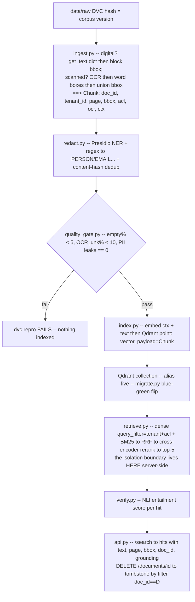

# Lecture: The Capstone Integration Map — Repo Spine & the Three Provable Claims (Week 1)

> This is the week you stop building disconnected labs and commit to one repository that has to hold together for four weeks. The integration matters because every later week (agents, gateway, eval/governance) *bolts onto* what you decide now — the chunk schema, the folder contract, the delete/recall/isolation invariants. Get the spine wrong and Weeks 2-4 spend their budget on retrofits instead of features. After this lecture you can design the `capstone/` monorepo contract, encode three demonstrable claims as executable design contracts, and defend why the Chunk schema and the no-generation boundary are load-bearing decisions, not preferences.

**Prerequisites:** Phase 5 (Data Eng — ingestion, chunking, provenance) · Phase 3/4 (Embeddings + RAG — hybrid, RRF, rerank) · Phase 9 (Architecture — multi-tenancy) · Phase 7 (Eval — golden sets, metrics) · **Reading time:** ~15 min · **Part of:** Capstone Week 1

## The integration problem

You have, by now, built each piece in isolation: an OCR notebook here, a Qdrant filter experiment there, a golden-set eval script somewhere else. The capstone's Week 1 job is to fuse the ingestion + retrieval spine into **one production-grade subsystem an enterprise would trust** — messy scanned PDFs in one end, a multi-tenant, access-controlled, cited, groundedness-verified retrieval API out the other, with the dataset versioned and every index mutation provable.

The trap is treating this as "wire the labs together." The real integration problem is **deciding the contracts that later weeks cannot renegotiate**. Three of them dominate:

1. **The data contract** — what a `Chunk` *is*, physically, on every point in the vector store. If `tenant_id` and `bbox` aren't on it from ingest, no downstream isolation filter or citation UI can invent them.
2. **The pipeline contract** — the DAG (`ingest → redact → quality_gate → index`) that makes any index state reproducible from a commit hash, and that *halts* on bad data rather than shipping it.
3. **The proof contract** — three claims turned from marketing assertions into `pytest` files that go red when the invariant breaks: delete-removes-from-all-answers, recall@5 ≥ target, tenant A never sees B.

Week 1 explicitly draws a boundary: **no answer generation this week — retrieval + verification only.** That is not scope-cutting; it is sequencing. You cannot prove groundedness, deletes, or isolation on top of a generation layer that's still churning. Build the backbone you can't fake later, then let Week 2 (the agent) bolt onto a retrieval surface whose guarantees are already green.

## Architecture & how the pieces connect

The `capstone/` folder *is* the architecture. The layout from the Week 1 plan is the contract — internalize what each boundary buys you:

```
capstone/
  data/raw/            # messy PDFs (some scanned) — DVC-tracked (content-addressed)
  data/golden.jsonl    # (tenant, question, gold_substr, gold_doc_id) — the recall proof's fuel
  dvc.yaml             # ingest -> redact -> quality_gate -> index  (the reproducible DAG)
  src/
    ingest.py          # detect scan -> OCR -> layout -> Chunks w/ page+bbox
    redact.py          # Presidio clean/dedup/PII-redact (BEFORE embedding)
    quality_gate.py    # halts pipeline on bad metrics (last DVC stage)
    index.py           # embed + upsert to Qdrant w/ tenant_id + acl + doc_id
    migrate.py         # blue-green re-embedding + atomic alias flip
    retrieve.py        # hybrid + RRF + rerank + SERVER-SIDE ACL filter
    verify.py          # NLI groundedness gate
    api.py             # FastAPI: /search, DELETE /documents/{id}
  tests/               # EXECUTABLE PROOFS, not smoke tests
    test_delete.py test_recall.py test_tenant_isolation.py
  README.md            # domain choice + quickstart + how to run the proofs
  EVAL.md              # the living scorecard (recall baseline -> target)
  DECISIONS.md         # the CAG-vs-retrieval record + every knob you set
```

Data flow, end to end:



The two hinges that make this a *system* and not a pipeline:

- **The `live` alias.** Queries never name a collection; they hit the `live` alias. That indirection is what makes a blue-green re-embedding migration an atomic flip and a rollback a re-flip (`migrate.py`). Every reader in `retrieve.py` uses `"live"` — no exceptions.
- **`doc_id` as the delete handle.** A document is many chunks/points. The stable `doc_id` stamped at ingest is what lets `delete(filter=doc_id==D)` erase all of them in one server-side op. Point-ids are an implementation detail; `doc_id` is the contract.

### The Chunk schema — decide it now, or suffer later

Establish this on day one, before you write a single chunk to disk:

```python
class Chunk(BaseModel):
    doc_id: str                                   # stable delete/citation handle (NOT the point id)
    tenant_id: str                                # the isolation key — server-side filter field
    text: str
    page: int                                     # citation coordinate
    bbox: tuple[float, float, float, float]       # citation coordinate — "show me WHERE"
    heading: str | None = None
    acl_groups: list[str] = []                    # access control — server-side filter field
    ocr: bool = False                             # provenance: was this OCR'd? (drives quality gate)
    ctx: str | None = None                        # contextual-retrieval prefix, embedded WITH text
```

**Why retrofitting `bbox` later is miserable.** Bounding boxes come *out of the parser* — PyMuPDF's `block["bbox"]`, or the union of Tesseract word boxes on an OCR'd page. Once you've flattened a page to a text string and thrown the layout away, the coordinates are gone. To add boxes later you must re-parse every PDF, re-run OCR on the scanned pages, re-chunk (which changes chunk boundaries → changes embeddings → changes recall), and re-index. That is a full corpus rebuild, and it silently perturbs your recall numbers so you can't tell whether the box work regressed retrieval. Boxes are cheap to keep and expensive to reconstruct — carry them from the first parse.

**Why retrofitting `tenant_id`/`acl_groups` later is worse.** These are the fields your isolation filter reads *server-side*. If a chunk lands in the index without a `tenant_id`, it's an untenanted point that either (a) leaks into every tenant's results or (b) forces you to add fragile post-filter logic in Python — the exact anti-pattern that breaks the isolation proof. There is no safe backfill: you'd have to re-derive which tenant each already-indexed point belonged to. Stamp tenancy and ACL at ingest, or the isolation claim is unprovable.

## Key decisions & tradeoffs

**Three claims → three design contracts.** The north star is that these are *demonstrable*, not asserted. Each becomes a design decision plus its `tests/` proof.

**Claim 1 — Deleting a source doc removes it from all answers.**
- *Design contract:* every point carries a stable `doc_id`; deletion is `qc.delete(filter=doc_id==D)` (a tombstone), never delete-by-point-id, never a full reindex.
- *Proof (`test_delete.py`):* assert a doc is retrievable, call `delete_doc`, assert it's absent from *all* results — with no rebuild.
- *Tradeoff:* tombstone-by-filter is instant and cheap but leaves the vector store's segments fragmented until compaction; that's the right trade versus a full rebuild, which is correct-but-destructive and can't meet a "delete now" SLA. Also keep a tombstone record so a later re-ingest of D starts clean.

**Claim 2 — recall@5 ≥ committed target.**
- *Design contract:* `data/golden.jsonl` has **≥20** `(tenant, question, gold_substr, gold_doc_id)` rows, and you follow **baseline-then-target discipline**: measure recall with dense-only first, record it in `EVAL.md`, *then* commit a target you actually beat with hybrid+rerank. A target you set before measuring is a wish.
- *Proof (`test_recall.py`):* asserts `recall@5 ≥ your_target` over the golden set.
- *Tradeoff:* 20 rows is a floor, not a statistically comfortable number — Week 4 adds confidence intervals. For Week 1 the discipline is *directional* (baseline → committed floor that fails the build if you regress), which is enough to stop silent recall loss from OCR garbage or a bad chunking change.

**Claim 3 — Tenant A can never see tenant B's data.**
- *Design contract:* the tenant filter lives **in the vector-store query** (`query_filter` in `retrieve.py`), enforced server-side — never fetch-top-k-then-filter-in-Python. Isolation is a *security boundary*, tested adversarially.
- *Proof (`test_tenant_isolation.py`):* issue a tenant-A query crafted to surface tenant-B content (even with an `admin` role) and assert zero B docs.
- *Tradeoff:* server-side payload filtering costs a little query planning versus a naive top-k, but post-filtering in Python leaks under top-k starvation (all 50 candidates are B's docs → you return nothing or, worse, one missed code path returns B). The security boundary must sit at the lowest layer, not in application glue.

**DVC pipeline vs. ad-hoc scripts.** Encoding `ingest → redact → quality_gate → index` as `dvc.yaml` stages (each with declared deps/outs) buys reproducibility (`dvc repro` rebuilds only what changed, hash-deterministically) and makes the quality gate a *build failure* rather than a warning someone ignores. The cost is upfront ceremony. It's worth it because "which corpus version produced this answer?" must be answerable by a commit hash — a governance requirement you'll lean on in Week 4's GDPR/audit work.

**Quality gate as the last stage.** Wiring `quality_gate.py` as the terminal DVC stage means bad data (OCR garbage, empty chunks, leaked PII) *halts the pipeline before indexing*. The trade is that a flaky heuristic can block a good build; mitigate by tuning thresholds against a known-good corpus and treating a gate failure as a signal to inspect, not to loosen the threshold.

**Deliverables as living artifacts.** `README.md` (how to run and prove), `EVAL.md` (the scorecard: baseline recall → committed target, updated as you tune), and `DECISIONS.md` (the CAG-vs-retrieval record plus every knob) are not end-of-week paperwork. They're the running memory of *why* the spine is shaped this way — the senior-engineer signal, and the input to Week 4's model card and governance file.

## How it fails in production & how to prevent it

- **Post-filtering tenants in Python.** Fetch-then-filter leaks under top-k starvation and dies on one missed code path. *Prevent:* enforce `tenant_id`/`acl_groups` in the Qdrant `query_filter`; make `test_tenant_isolation.py` adversarial (admin role, B-targeted query), not a happy-path assertion. Verify by *reading* `retrieve.py` — no Python post-filter anywhere.
- **Deleting by point-id instead of `doc_id`.** A doc is many points; delete-by-id orphans the rest and they keep answering. *Prevent:* delete by `filter=doc_id==D`; `test_delete.py` catches the orphans.
- **In-place re-embedding.** Upserting new-model vectors over old ones changes dimensions and returns nonsense mid-migration. *Prevent:* blue-green — build `green` alongside `blue`, validate recall on `green` *before* flipping the `live` alias; rollback is a re-flip.
- **Retrofitting the schema.** Discovering in Week 2 that citations need boxes, or isolation needs `tenant_id`, forces a full corpus rebuild that perturbs recall. *Prevent:* freeze the Chunk schema now; every field earns its place against a downstream week.
- **Trusting OCR silently.** OCR turns tables to mush and digits to letters; garbage propagates permanently into embeddings and looks like a reranker problem. *Prevent:* the quality gate's junk-ratio check on `ocr=True` chunks halts the build before garbage reaches the index.
- **Redacting after indexing.** PII in the payload is PII any tenant can surface via retrieval. *Prevent:* `redact.py` runs *before* `index.py`; keep any reversible mapping in a separate secured store, never in the searchable payload. Remember Presidio NER isn't 100% — back it with regex recognizers for structured PII (SSN, credit card via Luhn, IBAN).
- **A golden set that drifts.** If someone edits `golden.jsonl` questions in place, a recall regression becomes unattributable. *Prevent:* grow the golden set, never mutate it; commit it under DVC so a run records which corpus + golden version it scored.

## Checklist / cheat sheet

- [ ] `capstone/` folder matches the contract; `data/raw/` is DVC-tracked (a `.dvc` hash, not raw bytes in git).
- [ ] `Chunk` schema frozen with `doc_id, tenant_id, page, bbox, acl_groups, ocr, ctx` — decided before first ingest.
- [ ] `dvc.yaml` has four stages `ingest → redact → quality_gate → index`; `dvc repro` is hash-deterministic.
- [ ] Quality gate is the *last* stage; a corrupted input makes `dvc repro` fail.
- [ ] Deletes are tombstone-by-filter on `doc_id`; `test_delete.py` green with no reindex.
- [ ] `golden.jsonl` ≥ 20 rows; baseline recall recorded in `EVAL.md` *before* committing a target; `test_recall.py` green.
- [ ] Tenant/ACL filter is server-side in `retrieve.py`; `test_tenant_isolation.py` is adversarial and green.
- [ ] Queries hit the `live` alias, never a collection name; blue-green flip validated before the flip.
- [ ] Presidio redaction runs before embedding; groundedness (NLI) scores returned with page+bbox citations.
- [ ] **No answer generation** this week — retrieval + verification only.
- [ ] `README.md`, `EVAL.md`, `DECISIONS.md` exist and are updated as living artifacts.

## Connect to the build

This lecture is the design note for Week 1 of `14-capstone.md`. Concretely: build `src/ingest.py` through `src/api.py` to satisfy the Definition of Done, and make the three `tests/` files the gate you never let go red. The Chunk schema you freeze here is consumed unchanged by:

- **Week 2 (agent):** `doc_search` is a typed tool that reuses this tenant-filtered retriever; the served retrieval surface is what the LangGraph supervisor calls. Your isolation boundary becomes the agent's data-access boundary.
- **Week 3 (gateway):** the retrieval API sits behind the LLM gateway; per-tenant isolation here pairs with per-tenant rate/spend limits there.
- **Week 4 (eval/governance):** `golden.jsonl` grows into the versioned golden set with confidence intervals; `doc_id`/`tenant_id` are what GDPR cascade-delete keys on; `DECISIONS.md` feeds the model card and NIST-AI-RMF file.

The no-generation boundary is why Week 2 can *start* from a trustworthy retrieval surface instead of debugging retrieval and generation at once.

## Going deeper (optional)

Real, named resources (search by name):

- **DVC docs** — "Data Pipelines" and "Versioning Data" (the `dvc.yaml` stage model and content-addressed cache).
- **Qdrant docs** — "Filtering" and "Payload" (server-side payload filters = the isolation boundary; delete-by-filter = tombstones); "Multitenancy" for the partitioning patterns.
- **Anthropic — "Introducing Contextual Retrieval"** (the `ctx` prefix and prompt-caching the whole doc while generating per-chunk context).
- **Microsoft Presidio** GitHub `microsoft/presidio` (analyzer NER + regex recognizers, anonymizer).
- **Docling** `docling-project/docling` (layout + table + OCR routing with coordinates — the higher-quality ingest path vs. the PyMuPDF+Tesseract baseline).
- **`BAAI/bge-reranker-v2-m3`** model card and `sentence-transformers` cross-encoder NLI (`cross-encoder/nli-deberta-v3-base`) for rerank and groundedness.
- **Barnett et al., "Seven Failure Points When Engineering a RAG System"** (the failure taxonomy your quality gate and proofs are defending against).

## Check yourself

1. Why is `bbox` a design decision you must make before the first ingest, rather than a feature you can add in Week 2?
2. A teammate proposes deleting a document by removing its point-ids from Qdrant. Why does this fail the delete proof, and what's the correct operation?
3. What does routing all queries through the `live` alias buy you during a re-embedding migration and a rollback?
4. Your recall@5 is 0.82 on the golden set. Why is committing "target ≥ 0.90" at that moment a mistake, and what's the disciplined sequence instead?
5. Where exactly does the tenant boundary live, and construct a query that would leak if you enforced it by post-filtering in Python.
6. Why does Week 1 forbid answer generation, and what does that boundary buy Week 2?

### Answer key

1. Bounding boxes are produced by the PDF parser / OCR pass and are discarded once you flatten a page to text. Adding them later forces a full re-parse + re-OCR + re-chunk + re-index, which changes chunk boundaries and perturbs recall — so you can't tell whether the box work regressed retrieval. They're cheap to carry, expensive to reconstruct. Same logic makes `tenant_id`/`acl_groups` unbackfillable: an untenanted indexed point can't be safely re-attributed to a tenant.
2. A document is many chunks → many points. Deleting specific point-ids orphans the rest, which keep answering, so `test_delete.py` still finds `doc_id==D` after the "delete." The correct operation is a tombstone: `qc.delete(filter=doc_id==D)` server-side, which removes *every* point derived from D in one op, no reindex — plus a tombstone record so a later re-ingest is clean.
3. The alias decouples readers from the physical collection. You build `green` with the new embedding model alongside live `blue`, validate recall on `green` first, then atomically repoint `live` from `blue` to `green` — no half-migrated window where dimensions mismatch and queries return nonsense. Rollback is a re-flip back to `blue`. Readers in `retrieve.py` only ever name `"live"`.
4. Committing a target before you've measured a baseline is a wish, and 0.90 may be unreachable with your corpus/parser — you'd either chase noise or loosen the gate. Disciplined sequence: measure baseline (e.g. dense-only) and record it in `EVAL.md`; improve with hybrid+RRF+rerank; commit a target you actually clear with margin; wire `test_recall.py` to fail the build if you regress below it.
5. The boundary lives in the vector-store query itself — the `query_filter` on `tenant_id` (and `acl_groups`) passed to Qdrant server-side in `retrieve.py`, before candidates ever return to Python. A leaking query under post-filtering: an admin-role tenant-A query whose semantics match many tenant-B docs — the top-50 dense candidates can be *entirely* B's documents (top-k starvation), so a Python post-filter either returns nothing useful or, with one missed code path, returns B. The server-side filter never lets B's points into the candidate set.
6. Generation adds a second moving part (prompting, faithfulness, structured output) whose failures are entangled with retrieval failures. Week 1 must *prove* deletes, recall, and isolation — invariants you can only measure cleanly on a retrieval+verification surface. Freezing generation out means Week 2's agent bolts onto a retrieval API whose guarantees are already green, so you debug agent behavior, not the backbone underneath it.
