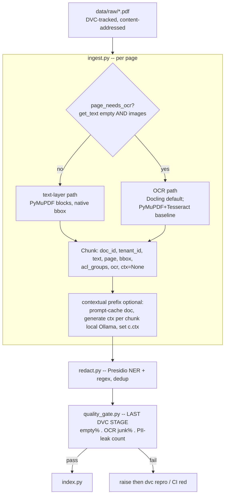

# Lecture: Ingestion Decisions — OCR Routing, bbox Provenance & Contextual Chunking

> The ingest spine is where every downstream number is silently decided. A dropped decimal in an OCR'd table, a chunk with no page coordinate, a contextless "the penalty is 2x" — none of these throw an error, but each one caps your recall, breaks your citations, or leaks PII into an index any tenant can query. This lecture is the decision record for the front half of the Week 1 pipeline: how to route digital-vs-scanned pages, which OCR engine to make the default and which to keep as a transparent baseline, why OCR errors are permanent and must be *measured*, why bbox is non-negotiable on every chunk, when the extra LLM call for a contextual prefix pays for itself, and how the quality gate becomes the last DVC stage that can fail `dvc repro` and CI. After this you can design `ingest.py` → `redact.py` → `quality_gate.py` as one provenance-carrying, gate-enforced stage instead of a pile of scripts.

**Prerequisites:** Phase 5 (Data Engineering — document parsing & provenance L6, OCR confidence routing L7, PII detection/redaction L10, dataset versioning & lineage L12, data-quality contracts L13) · Phase 3/4 (embeddings + RAG chunking) · Phase 1 (prompt caching) · Phase 11 (PII in prompts/traces) · **Reading time:** ~18 min · **Part of:** Capstone Week 1

## The integration problem

You are fusing four things that were taught separately into one stage that runs on `dvc repro`: scan detection + OCR (Phase 5 L6/L7), contextual chunking (Phase 3/4), PII redaction (Phase 5 L10 / Phase 11), and a blocking quality contract (Phase 5 L13). The capstone constraint (`14-capstone.md`, Week 1) is that the *output* of this stage — chunks — must carry `{doc_id, tenant_id, page, bbox, acl_groups, ocr, ctx}` and survive a gate before it ever reaches the embedder. Everything after ingest (hybrid retrieval, rerank, NLI verify, tenant-filtered serving) trusts these chunks completely. So this stage is the last place a defect is cheap to catch.

The failure mode that motivates every decision below: **ingest errors are not recoverable downstream.** A reranker reorders candidates it was given; it cannot resurrect a decimal OCR dropped from a table, and it cannot re-add context to an embedding that was computed from an ambiguous fragment. Garbage that enters the text layer becomes garbage in the vector, permanently, until you reingest. That is why this lecture is about *measuring and gating* the ingest, not trusting it.

## Architecture & how the pieces connect

Two design choices make this a *spine* rather than a script:

- **The Chunk schema is fixed before any engine runs.** `page` + `bbox:[x0,y0,x1,y1]` and the `ocr` boolean are declared in the `Chunk` model (`src/ingest.py`) so both the text-layer path and the OCR path emit the same shape. This is the retrofit-avoidance decision — see the bbox section.
- **The gate is a pipeline stage, not a function you remember to call.** Wiring it as the final `dvc.yaml` stage means "did we ship bad data?" is answered by exit code, not code review.

## Key decisions & tradeoffs

### Decision 1 — Digital-vs-scanned routing: never OCR a clean text layer

The router is two cheap signals combined with AND: `len(page.get_text().strip()) < 20` **and** `bool(page.get_images())`. Empty text plus a present image means the page is a scan wrapped in PDF → route to OCR. A page that already has extractable glyphs is *never* OCR'd — OCR is slower, lossy, and strictly worse than reading the glyphs that are already there. This is the L6/L7 rule, applied as a hard branch.

The subtle trap (from Phase 5 L7): a *partial* text layer — watermark, page numbers, a stray footer — can pass a naive "has text?" check while the real content is an image. The `< 20` character floor is the pragmatic version of L7's char-density check; for the capstone's messy set, keep it and calibrate. Getting the branch wrong in the "OCR a clean page" direction silently degrades pages you already had perfectly; getting it wrong in the "skip OCR on a scan" direction emits empty chunks the gate will catch.

### Decision 2 — Engine selection for THIS build

Three tiers, chosen deliberately:

| Tier | Engine | Role in this build | Why |
|---|---|---|---|
| Default orchestrator | **Docling** (`DocumentConverter().convert(path)`) | Layout + table structure + coordinates + OCR routing, exports Markdown/JSON | One tool gives layout-aware chunks *and* bbox *and* table-to-markdown; it routes OCR itself. Highest quality per unit of glue code. |
| Transparent baseline | **PyMuPDF + Tesseract** (`fitz` + `pytesseract`) | The "know what's underneath" fallback | You can read every line of it; when Docling does something surprising you diff against a path you fully understand. Word-level Tesseract boxes teach you what "bbox" actually is. |
| Spot-check only | **LlamaParse / Azure Document Intelligence** | The ugliest ~5 pages only | Paid clouds. Not a laptop default. Use to *audit* your worst pages, not to process the corpus. |

The reasoning behind keeping the baseline even though Docling is better: Docling is an orchestrator, and orchestrators hide decisions. When a table comes out mangled you need a transparent path — raw PyMuPDF blocks with native `b["bbox"]`, raw Tesseract `image_to_data` with per-word left/top/width/height — to see whether the problem is detection, the image, or the engine (the L7 lesson: preprocessing dominates engine choice). The baseline is your debugger, not your competitor to Docling. And the hosted parsers are reserved for the 5 worst pages precisely because their per-page cost and cloud dependency make them the wrong default — they are an escalation target (L7's confidence-routing pattern), the same way a VLM is.

### Decision 3 — Measure OCR quality; do not trust it

This is the load-bearing "WHY." OCR errors are not random noise you can average out — they are *systematic corruptions that propagate permanently into embeddings*:

- **`rn` → `m`, `l` → `1`, `O` → `0`** — character confusions that turn a searchable token into a different token. The embedding of the corrupted token is not "close-but-noisy"; it points somewhere else. No reranker fixes this because the reranker never sees the right text.
- **Dropped table decimals** — `9.0` OCR'd as `90`, or a decimal point lost entirely. In a compliance/claims/contract corpus this is not cosmetic; it changes the meaning of the retrieved fact.

The consequence is **phantom recall loss**: a golden question whose answer lives on a corrupted page simply never retrieves, and you will blame the reranker or the embedding model when the defect is three stages upstream. Because you cannot fix it downstream, you must *quantify* it at ingest. That is what the OCR junk-ratio in the gate is for — it is a corpus-level health metric (L7's "% needs_review" idea), not a per-page nicety.

### Decision 4 — bbox on every chunk is non-negotiable

Every chunk carries `{page, bbox:[x0,y0,x1,y1]}` so the UI can highlight the exact source region behind a citation. This is a schema decision made *before* chunking, not after, for one blunt engineering reason: **retrofitting coordinates after you have already chunked is miserable.** Once you have concatenated blocks into a chunk and thrown away the source geometry, there is no cheap way to recover which pixels on which page produced a sentence. You would have to reingest.

Mechanically: the text-layer path gets `bbox` free from `b["bbox"]` on each PyMuPDF block; the OCR path builds a **union bbox** over the word boxes it groups into a block (group by top-coordinate bands → one chunk per block with the bounding rectangle of its words). Docling hands you coordinates directly. The capstone DoD makes this explicit: every chunk must have `page` + a *non-degenerate* bbox, and at least one `ocr=True` chunk must exist — so a degenerate `[0,0,0,0]` box is a bug, not an acceptable default.

### Decision 5 — Contextual-chunk prefix: when the extra LLM call is worth it

Anthropic's Contextual Retrieval prepends a 1–2 sentence, LLM-generated blurb situating each chunk in its document before embedding — e.g. *"This chunk is from the Termination section of the 2024 Acme MSA, discussing early-exit penalties."* You then embed `ctx + "\n" + text`. The WHY: short legal/technical chunks are ambiguous out of context ("the penalty is 2x" — of what?), and the prefix disambiguates the *embedding*, not just the display.

The cost is one LLM call per chunk. The decision knobs for whether it's worth it:

- **Worth it when** chunks are short and reference-heavy (contracts, policies, specs where meaning depends on section context), and retrieval-failure rate on your golden set is your bottleneck. This is the capstone's default domain, so it's on.
- **Cache the document, not the chunk.** Prompt-cache the *whole doc* once (Phase 1 prompt caching), then generate the per-chunk context against the cached prefix — that is what makes N calls affordable instead of N full-context calls. Run it on **local Ollama (`llama3.1`)** so it costs $0 and no data leaves the box.
- **Skip it when** chunks are already self-contained (long narrative prose), the corpus is huge and the per-chunk latency/compute doesn't pay back, or you haven't yet measured a retrieval-failure problem it would solve. Don't pay for context you can't show moved recall.

Store the result in `Chunk.ctx` and embed `(c.ctx or "") + "\n" + c.text` — the `or ""` means the prefix is optional per chunk without changing the index code.

### Decision 6 — Redact before embed, with a reversible map in a *separate* store

Presidio (`presidio-analyzer` + `presidio-anonymizer`) redacts PERSON/EMAIL/PHONE/SSN/CREDIT_CARD/IBAN → `<PERSON>` etc. Two non-negotiable design points (Phase 5 L10, Phase 11):

1. **Redact before embedding.** If you embed first, PII lives in your vectors *forever* — and any tenant user can surface it via retrieval. That is a compliance incident, not a bug. Redaction must sit upstream of `index.py`.
2. **NER recall is not 100%, so back it with deterministic regex recognizers.** ML-based NER misses structured PII; deterministic recognizers catch what NER doesn't — credit cards that pass the **Luhn** checksum, **IBAN** check digits, SSN patterns. Belt (NER) plus suspenders (regex). If authorized un-redaction is ever needed, keep the reversible token→value mapping in a **separate secured store**, never in the searchable payload — otherwise you've just moved the PII, not removed it.

### Decision 7 — The quality gate is the last DVC stage

Three thresholds, wired as engineering knobs and enforced as an assertion that halts the pipeline:

- **Empty-chunk %** — fraction of chunks under ~10 chars; `assert empty < 0.05`. Catches a mis-routed scan that produced nothing.
- **OCR junk ratio** — on `ocr=True` chunks, fraction of non-alphanumeric/space characters; flag chunks below ~0.85 "cleanliness" and `assert bad_ocr / n < 0.10`. This is Decision 3 made executable — the corpus-level OCR health metric.
- **PII-leak count** — `assert pii_leaks == 0`. Any structured PII surviving redaction fails the build, full stop.

The integration decision is *where* this runs: as the **final `dvc.yaml` stage**, so a failing gate makes `dvc repro` exit non-zero, which makes CI red. Data quality becomes a build failure, not a dashboard someone ignores (Phase 5 L13's blocking-gate discipline). Calibrate the exact thresholds on your corpus — they are knobs, but they must exist and must block.

## How it fails in production & how to prevent it

- **Trusting OCR silently.** Tables turn to mush, digits to letters, and without the junk-ratio gate you embed it and lose recall you'll misattribute to the reranker. *Prevent:* measure OCR quality and gate on it (Decision 3/7).
- **OCR-ing a clean text layer.** Slower and worse than the glyphs you already had. *Prevent:* the AND-routing rule; never OCR when `get_text()` is non-trivial.
- **Degenerate or missing bbox.** A chunk with `[0,0,0,0]` or no page breaks the UI highlight and the citation contract, and it's expensive to fix post-hoc. *Prevent:* bbox in the schema from the start; DoD requires non-degenerate boxes on every chunk.
- **Redacting after indexing / no reversible map.** PII in vectors forever; or the "reversible" map sitting in the searchable payload. *Prevent:* redact before embed; map in a separate secured store.
- **Regex-free redaction.** Relying on NER alone lets Luhn-valid cards and IBANs through. *Prevent:* deterministic recognizers alongside NER.
- **Context prefix that costs more than it earns.** Turning on contextual chunking for a corpus of self-contained prose burns compute for no recall gain. *Prevent:* prompt-cache the doc, run locally, and only keep it if it moves the golden-set number.
- **Gate as a function, not a stage.** A quality check you call by hand gets skipped. *Prevent:* wire it as the last DVC stage so `dvc repro`/CI enforces it.

## Checklist / cheat sheet

- [ ] Route: OCR iff `get_text().strip()` empty AND page has images; never OCR a clean layer.
- [ ] Default engine = **Docling**; keep **PyMuPDF+Tesseract** as the transparent baseline; reserve **LlamaParse/Azure DI** for the ugliest ~5 pages only.
- [ ] `Chunk` schema carries `{doc_id, tenant_id, text, page, bbox, acl_groups, ocr, ctx}` — declared *before* chunking.
- [ ] Every chunk has a page + **non-degenerate** bbox; OCR path builds a union bbox over grouped word boxes.
- [ ] OCR quality is **measured** (junk ratio), not trusted — remember `rn→m` and dropped decimals are permanent.
- [ ] Contextual prefix: prompt-cache the doc, generate `ctx` per chunk on local Ollama, embed `ctx + "\n" + text` — on for short reference-heavy chunks, off when unmeasured or self-contained.
- [ ] Presidio redaction runs **before** embed; NER + deterministic regex (Luhn/IBAN); reversible map in a separate secured store.
- [ ] Quality gate (empty% < 0.05, OCR junk < 0.10, PII-leak == 0) is the **last DVC stage** and fails `dvc repro`/CI.

## Connect to the build

This lecture is the design behind `src/ingest.py`, `src/redact.py`, and `src/quality_gate.py`, plus the last `dvc.yaml` stage. Concretely, it lets you satisfy these Week 1 DoD items: "at least one scanned page was OCR-routed (`ocr=True` chunks exist) and every chunk carries `page` + non-degenerate `bbox`"; "Presidio redacts PERSON/EMAIL/SSN/CREDIT_CARD and `quality_gate.gate()` raises on a deliberately-corrupted input (prove it by injecting a garbage OCR chunk and watching `dvc repro` fail)". The chunks this stage emits are exactly what Lecture (retrieval) upserts to Qdrant with `tenant_id`/`acl`/`doc_id`, and the `page`+`bbox` you attach here are the citations the `/search` API returns alongside NLI groundedness scores next.

## Going deeper (optional)

- **Docling** — GitHub `docling-project/docling` (layout, table structure, OCR routing, coordinate export).
- **Anthropic "Introducing Contextual Retrieval"** — the blog post with the retrieval-failure-rate results and the prompt-cache pattern.
- **Microsoft Presidio** — `microsoft/presidio` docs (analyzer recognizers, custom regex recognizers, anonymizer operators).
- **PyMuPDF** — `pymupdf.readthedocs.io` (`get_text("dict")` block/line/span structure and `bbox`).
- **Tesseract** — `tesseract-ocr.github.io`, "ImproveQuality" wiki for preprocessing (DPI, deskew, binarize) that feeds `image_to_data`.
- **DVC "Data Pipelines" & "Versioning Data"** — `dvc.org/doc` (stages, deps/outs, `dvc repro`).
- **LlamaParse** (`docs.llamaindex.ai`) and **Azure Document Intelligence** (`learn.microsoft.com`) — for the spot-check tier only.
- Reference back: Phase 5 Lectures 6 (parsing/provenance), 7 (OCR confidence routing), 10 (PII), 12 (versioning/lineage), 13 (quality contracts).

## Check yourself

1. Give the exact two-signal rule for routing a page to OCR, and name the partial-text-layer trap it must survive.
2. Why is Docling your default but PyMuPDF+Tesseract worth keeping — and where do LlamaParse/Azure DI belong in this build?
3. Explain, with a concrete example, why an OCR error cannot be fixed by a downstream reranker — and what you do instead.
4. Why must bbox be in the chunk schema *before* chunking rather than added later?
5. State the three quality-gate thresholds and the one wiring decision that makes them actually block bad data.
6. Presidio's NER misses a valid credit-card number. What second mechanism catches it, and where must redaction sit relative to embedding?

### Answer key

1. Route to OCR iff `page.get_text().strip()` is (near-)empty **AND** the page has images (`page.get_images()`). The trap is a *partial* text layer — a watermark, page numbers, or a footer — that makes a naive "has text?" check skip OCR on a page whose real content is an image; the character floor (and, more robustly, char-density from Phase 5 L7) survives it.

2. Docling is the default because one tool gives layout-aware chunks, coordinates, table-to-markdown, and OCR routing with the least glue, i.e. highest quality per unit of code. PyMuPDF+Tesseract is the transparent "know what's underneath" baseline you diff against when Docling does something surprising — you can read every line and see native block/word boxes. LlamaParse/Azure DI are paid clouds reserved for spot-checking only the ugliest ~5 pages, never the corpus default.

3. Example: a table cell `9.0` OCR'd as `90`, or `rn`→`m` in a searchable term. The corrupted token's embedding points to a *different* location, so the right chunk never enters the reranker's candidate set — the reranker only reorders what retrieval gives it and never sees the correct text. Because the corruption is permanent in the vector, you cannot fix it downstream; instead you *measure* OCR quality at ingest (junk-ratio gate) and reingest/escalate the bad pages.

4. Because chunking concatenates source blocks and discards their geometry; once you've built a chunk from multiple blocks and thrown away the coordinates, there is no cheap way to recover which region of which page produced a sentence — you'd have to reingest. Declaring `page`+`bbox` in the schema up front (union bbox on the OCR path, native `b["bbox"]` on the text path) makes provenance a byproduct instead of a retrofit.

5. Empty-chunk % < ~0.05, OCR junk ratio (bad OCR chunks / total) < ~0.10, and PII-leak count == 0. The wiring decision: run the gate as the **last DVC stage** so a failed assertion makes `dvc repro` exit non-zero and turns CI red — the gate blocks by exit code, not by someone remembering to call it.

6. Deterministic regex/checksum recognizers (Luhn for credit cards, IBAN check digits, SSN patterns) catch structured PII that ML NER misses — belt (NER) plus suspenders (regex). Redaction must sit **before** embedding, so PII never enters the vectors (where any tenant could retrieve it); any reversible token→value map lives in a separate secured store, never in the searchable payload.
