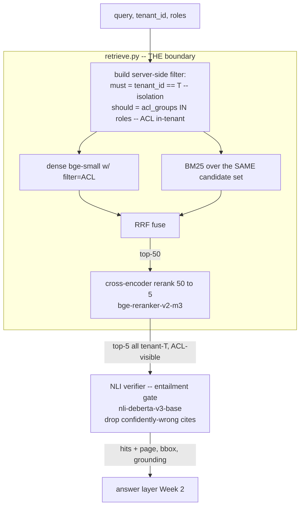

# Governance by Construction: Tenant Isolation & ACLs in the Query (Week 1)

> The difference between a demo and a product you can sell into a regulated enterprise is a single, testable claim: *tenant A can never see tenant B's data* — and it holds even when the attacker is an admin who crafts the query to break it. This lecture is a design/decision note on where that boundary lives. The thesis: isolation is not a feature you add in the answer layer, it is a **property of the retrieval query** — enforced by the vector store, proven by an adversarial test, and structurally impossible to forget. You will be able to choose an isolation topology (Qdrant payload filter vs collection-per-tenant vs pgvector `WHERE`), express ACLs as server-side filters, and wire the hybrid+rerank+verify pipeline so *every* stage operates over the same already-filtered candidate set.

**Prerequisites:** Phase 3 (embeddings & vector DBs — payload/metadata filtering), Phase 4 (RAG — hybrid retrieval, RRF, cross-encoder rerank), Phase 9 (architecture — multi-tenancy topologies, GDPR erasure), Phase 11 (safety — treat retrieved content as untrusted) · **Reading time:** ~20 min · **Part of:** Capstone Week 1

---

## The integration problem

You already know how to build hybrid retrieval (Phase 4) and how to filter a vector store by metadata (Phase 3). The capstone forces a harder question those phases sidestepped: *where does the security boundary physically live, and can you prove it?*

There is exactly one cardinal sin here, and it is seductive because it works in the demo:

```python
# THE CARDINAL SIN — do not ship this
hits = store.search(query_vector, limit=5)                 # fetch top-k globally
hits = [h for h in hits if h.payload["tenant_id"] == tid]  # filter in Python
```

This leaks, and it leaks in three independent ways that no code review catches by reading the happy path:

1. **Top-k starvation.** You asked for 5, filtered to tenant A, and got back 2 — because 3 of the global top-5 belonged to tenant B. You've now silently degraded A's recall *and* proven the store will happily rank B's documents against A's query. Bump `limit` to compensate and you've just made the leak window bigger.
2. **Timing / existence oracle.** Even if you drop B's rows before returning them, latency and result-count deltas reveal that B's documents exist and score highly for a given probe. That is an information leak in a regulated domain regardless of whether the text is returned.
3. **The one missed code path.** There is never one retrieval call. There's `/search`, the agent's `doc_search` tool (Week 2), the eval harness, a debugging endpoint someone added at 2am. Post-filtering means the boundary is re-implemented at every call site, and it only takes *one* that forgets.

The integration decision is therefore not "add a filter." It is: **push isolation down to the lowest layer that executes the query, so there is no code path that can retrieve cross-tenant data in the first place.** The Python layer should be structurally incapable of seeing tenant B's rows, not merely disciplined about discarding them.

The same argument applies one level up to **ACLs** (role/group visibility within a tenant). `allowed_roles` and `acl_groups` are not answer-time concerns — they are filter predicates that ride the *same* server-side query as `tenant_id`.

---

## Architecture & how the pieces connect

The boundary lives in one file — `retrieve.py` — and everything downstream inherits it:



The load-bearing property is drawn as a box, not a step: the ACL filter wraps **every** retrieval primitive inside `retrieve.py`. Dense search passes `query_filter=acl`. BM25 does **not** run over a global lexical index — it runs over the payloads of the *already-tenant-scoped* candidate set (scroll/fetch with the same filter, then score). RRF fuses two lists that are each, individually, guaranteed tenant-clean. The reranker and the NLI verifier are pure functions of that clean set — they cannot reintroduce a foreign document because none was ever in scope.

This is why the boundary is *one* filter object constructed *once* at the top of the function and threaded into each primitive — not a predicate re-typed per call.

```python
def search(query, tenant_id, roles, k=5):
    acl = Filter(
        must=[FieldCondition(key="tenant_id", match=MatchValue(value=tenant_id))],
        should=[FieldCondition(key="acl_groups", match=MatchValue(value=r)) for r in roles],
    )
    dense = qc.search("live", qv, query_filter=acl, limit=50)   # boundary
    cands = qc.scroll("live", scroll_filter=acl, limit=500)     # SAME boundary for BM25 corpus
    fused = rrf(dense, bm25(query, cands))
    return rerank(query, fused)[:k]
```

Note `should` for roles: an OR across the user's roles (a hit is visible if the user holds *any* allowed group), while `tenant_id` stays in `must` (mandatory AND). Getting this quantifier structure right *is* the ACL policy.

---

## Key decisions & tradeoffs

### Decision 1 — isolation topology

Three defensible ways to partition. Choose on blast radius, ops cost, and noisy-neighbor behavior, not on which is easiest to type.

| Topology | How isolation is enforced | Blast radius of a bug | Ops cost | Noisy neighbor |
|---|---|---|---|---|
| **Qdrant payload filter** (`tenant_id == T`) | One shared collection; every query carries the filter | **Highest** — one missing filter exposes all tenants | **Lowest** — one collection, one index to manage | Yes — tenants share HNSW graph, memory, compaction |
| **Collection-per-tenant** | Physical separation; query routes to `coll_<T>` | **Lowest** — wrong tenant = empty/error, not a leak | High — N collections, N migrations, N alias flips | No — isolated resources |
| **pgvector row-level `WHERE tenant_id=`** | SQL predicate, ideally backed by Postgres **RLS** | Medium — RLS makes it enforced-by-role, not by query text | Medium — one DB, familiar ops, RLS policies to maintain | Partial — shared table/index, but mature query planner |

The engineering read:

- **Payload filter** is the capstone default (what Week 1's lab uses) because it's operationally cheap and Qdrant's filtering is index-aware. But its blast radius is the whole point of this lecture: the *only* thing standing between tenant A and tenant B is that the filter is present on every query. That is exactly the property the adversarial test must guard.
- **Collection-per-tenant** inverts the failure mode — the worst bug returns *nothing*, which is a recall incident, not a compliance incident. Buy this when tenants are few, large, and contractually demand physical isolation, and you can pay N× the migration/ops cost. It also localizes noisy-neighbor pain and makes GDPR erasure a `drop collection`.
- **pgvector + RLS** is the strongest *by-construction* story on a single store: Row-Level Security means the isolation predicate is attached to the **database role**, so even a hand-written `SELECT` with no `WHERE` clause returns only the caller's rows. The boundary no longer depends on the query author remembering. If your capstone already runs Postgres (it will, for Week 2's checkpointer and RLS on `claims`), this is a coherent choice. Cost: you're in SQL-land for vector ops and share an index across tenants.

Rule of thumb: **payload filter for many small tenants; collection-per-tenant for few large/regulated tenants; pgvector+RLS when you want the boundary bound to the role, not the query.** Whichever you pick, the test in the last section is identical.

### Decision 2 — ACLs as payload fields, filtered server-side

ACLs (`allowed_roles`, `acl_groups`) are metadata on the point, and they are filtered in the *same* server-side call as tenancy — never post-filtered. The difference from tenancy: tenancy is a hard `must` (a wall), ACLs are typically a `should`/OR over the user's held roles (a policy). Two failure modes to design against:

- **Over-broad admin.** "Admin" must not mean "bypass the tenant filter." Admin widens *in-tenant* visibility (sees all `acl_groups`), it never touches `must[tenant_id]`. The adversarial test below hard-codes this: admin role, still zero B docs.
- **Empty-roles semantics.** Decide explicitly whether "no roles" means "sees public-only" or "sees nothing," and encode it — don't let an empty `should` accidentally match everything.

### Decision 3 — hybrid + rerank + verify as one filtered pipeline

This is an integration decision, not three separate retrieval features:

- **Dense (BAAI/bge-small-en-v1.5)** for semantics + **BM25** for exact codes/IDs, **fused with RRF** — because dense misses literal identifiers and lexical misses paraphrase (Phase 4). The capstone constraint: BM25 must operate on the *tenant-filtered* candidate set, or you've built a lexical side channel that ignores the boundary.
- **Cross-encoder rerank (bge-reranker-v2-m3), top-50 → top-5** — cheap on CPU for small k, and it only ever sees clean candidates.
- **NLI verifier (nli-deberta-v3-base)** as the gate against *confidently-wrong citations*. Retrieval returns topically-similar text; entailment scoring answers "does this snippet actually *support* the claim?" Set a threshold (start ~0.5 entailment prob, tune on your golden set) and drop hits below it. Return **page + bbox with every surviving hit** so the UI can highlight the exact source region — a citation you can't point at on the page is not a citation an auditor accepts.

---

## How it fails in production & how to prevent it

- **Post-filter creep.** Someone "optimizes" by fetching `limit=k` unfiltered and trimming in Python (the cardinal sin). *Prevent:* make `retrieve.py` the only module that touches the store; lint/grep-gate against `.search(` calls that lack a `query_filter`; the adversarial test fails loudly if a leak reappears.
- **The forgotten second call site.** The agent's `doc_search` tool, the eval harness, or a `/debug` route calls the store directly and skips the filter. *Prevent:* one retrieval function, imported everywhere; no raw client handles exported. With pgvector, RLS makes even a forgotten call site safe.
- **BM25 built over a global index.** The lexical path silently ignores the tenant filter and surfaces B's documents by keyword. *Prevent:* build/scope the BM25 corpus from the filtered candidate set per query (or partition the lexical index by tenant too).
- **Admin escalation into cross-tenant.** A role check widens tenancy instead of in-tenant ACLs. *Prevent:* `tenant_id` is structurally in `must` and no code path moves it to `should`; the test uses `admin` and asserts zero B docs.
- **`limit` too small under filtering.** Server-side filtering + a tight `limit` can starve recall (fewer candidates survive the filter than you asked for). *Prevent:* over-fetch the dense stage (limit=50) *before* rerank narrows to 5; measure recall@5 on the golden set as your gate.
- **Payload/index desync during migration.** A blue-green re-embedding (Week 1) that forgets to carry `tenant_id`/`acl_groups` into the green collection's payload ships an index with no boundary. *Prevent:* validate the filter still discriminates on `green` *before* the alias flip.
- **Un-indexed filter field → slow or full-scan.** Filtering on a non-indexed payload key degrades to scanning. *Prevent:* create a payload index on `tenant_id` (and `acl_groups`); confirm it's used.

---

## Checklist / cheat sheet

- [ ] All store access goes through **one** `retrieve.py` function; no raw client exported elsewhere.
- [ ] `tenant_id` is in the query's **`must`** (mandatory AND), constructed once at the top.
- [ ] `acl_groups`/`allowed_roles` filtered **server-side** in the same call (`should`/OR over held roles).
- [ ] **Admin widens in-tenant ACLs only** — it never moves `tenant_id` out of `must`.
- [ ] Dense **and** BM25 read the **same** filtered candidate set; no global lexical index.
- [ ] Over-fetch (limit≈50) before rerank narrows to top-5 → guards against filter starvation.
- [ ] RRF → cross-encoder rerank (bge-reranker-v2-m3) → **NLI entailment gate** (nli-deberta-v3-base, thresholded).
- [ ] Every returned hit carries **`{page, bbox, grounding}`**.
- [ ] Payload index exists on `tenant_id` (and `acl_groups`).
- [ ] Migration (blue→green) carries `tenant_id`/ACL payload; boundary re-validated **before** alias flip.
- [ ] Adversarial test: tenant-A query crafted to surface tenant-B, with `admin` role ⇒ **zero B docs**.

---

## Connect to the build

This lecture is the design behind Week 1's `src/retrieve.py` and `tests/test_tenant_isolation.py`, and the "Multi-tenant retrieval + server-side ACL" theory item (Week 1, §6). The **Definition of Done** says it plainly: *"the ACL filter lives in the Qdrant query, verified by reading `retrieve.py` (no Python post-filter)."* Your proof artifact is the test:

```python
def test_tenant_A_cannot_see_B():
    # crafted to surface B's content, escalated to admin — the hard case
    hits = search("tenant B confidential", "tenantA", ["admin"])
    assert all(h["payload"]["tenant_id"] == "tenantA" for h in hits)  # zero B docs, ever
```

This test only *proves* anything because the boundary is in the query. If it were a Python post-filter, the same test could pass by luck (top-k happened to hold no B docs today) and still leak tomorrow under a different probe. That's why the DoD requires *reading* `retrieve.py`, not just a green assertion — the test guards the property, the code review confirms *where* the property lives. Downstream, Week 2's `doc_search` tool must import this same function (not re-query the store), and Week 4's GDPR erasure deletes by the same `tenant_id`/`doc_id` filters this boundary is built on.

---

## Going deeper (optional)

Real, named resources — search these:

- **Qdrant docs — "Filtering"** and **"Payload"**; **Qdrant "Multitenancy"** guide (`qdrant multitenancy payload`) — the canonical treatment of payload-filter vs collection-per-tenant, including payload indexing for filtered search.
- **PostgreSQL docs — "Row Security Policies" (RLS)** and the **pgvector** README — the by-construction, role-bound isolation story.
- **`BAAI/bge-reranker-v2-m3`** and **`BAAI/bge-small-en-v1.5`** model cards (Hugging Face); **`cross-encoder/nli-deberta-v3-base`** model card + `sentence-transformers` CrossEncoder docs.
- **Reciprocal Rank Fusion** — Cormack, Clarke & Büttcher (2009), "Reciprocal Rank Fusion Outperforms Condorcet and Individual Rank Learning Methods."
- **OWASP Top 10 for LLM Applications 2025** (`genai.owasp.org`) — LLM06 (sensitive information disclosure) and the multi-tenant leakage discussion.

---

## Check yourself

1. You fetch top-5 globally and filter to tenant A in Python; the isolation test happens to pass. Name the three distinct ways this still leaks, and why the passing test is not evidence of safety.
2. A teammate proposes handling "admin" by moving `tenant_id` from the query's `must` to its `should`. What exactly breaks, and what should admin change instead?
3. Your BM25 stage surfaces a tenant-B document by keyword even though dense retrieval is filtered. Where's the bug, and what's the fix that keeps hybrid retrieval intact?
4. Compare blast radius: a single missing filter clause under (a) Qdrant payload filter, (b) collection-per-tenant, (c) pgvector + RLS. Which fails safe, and why?
5. The NLI verifier drops a hit that the reranker ranked #1. Is that a bug? What is the verifier's job that the reranker's score does not do?

### Answer key

1. **(a) Top-k starvation** — if 3 of the global top-5 are tenant B's, A gets only 2 results (degraded recall) *and* B's docs demonstrably outrank A's for that probe. **(b) Timing/count oracle** — even discarding B's rows, latency and result-count deltas reveal B's documents exist and score highly. **(c) The one missed code path** — every call site re-implements the filter; one omission leaks. The test passing means only that *today's* top-k held no B docs for *this* probe — a property of the data distribution, not of the boundary. A different query flips it.
2. Moving `tenant_id` to `should` makes it optional (OR), so a hit that matches an admin `acl_group` but belongs to tenant B now satisfies the filter — that's cross-tenant escalation. Admin must instead widen the **in-tenant ACL** set (see all `acl_groups` within its own tenant); `tenant_id` stays a mandatory `must` for every role including admin.
3. The BM25 corpus is a **global lexical index** that ignores the server-side filter — a side channel around the boundary. Fix: build/scope BM25 over the *same tenant-filtered candidate set* (scroll with the ACL filter, then score) or partition the lexical index by tenant. Hybrid + RRF still works; both input lists are now individually tenant-clean.
4. **(c) pgvector + RLS fails safe** — the isolation predicate is bound to the DB role, so a `SELECT` missing its `WHERE` still returns only the caller's rows. **(b) collection-per-tenant** also fails relatively safe — a routing bug yields the wrong/empty collection (a recall incident), not a silent cross-tenant read. **(a) payload filter fails open** — a missing filter clause exposes every tenant in the shared collection. That's the highest blast radius and exactly what the adversarial test must guard.
5. Not a bug — it's the design. The reranker scores **topical/semantic relevance** ("is this about the query?"). The NLI verifier scores **entailment** ("does this snippet actually *support* the claim?"). A highly relevant snippet can *contradict* or merely *mention* the query; shipping it as a citation is a confidently-wrong answer. The verifier is the gate that turns "looks right" into "is grounded," and it returns page+bbox so the support is inspectable.
