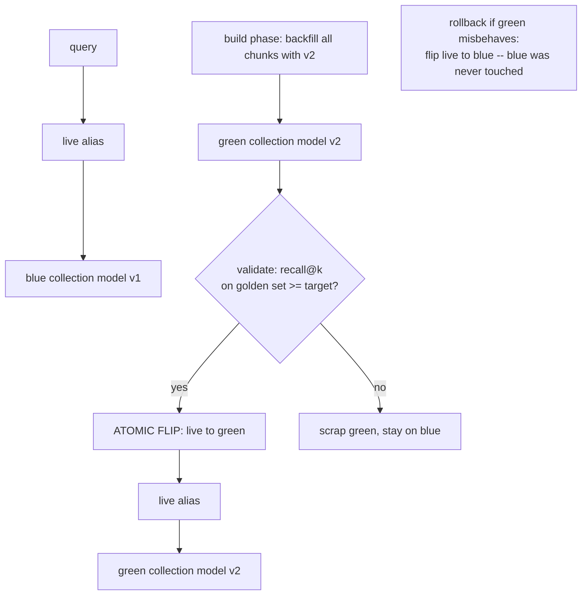

# Lecture: Index Mutation, Versioning & the CAG-vs-Retrieval Decision Record

> Your index is not a static artifact — it is a *mutable, versioned, reproducible* subsystem that a regulator will one day ask you to explain. This lecture is a design note on the three things people get catastrophically wrong at the mutation layer: they conflate **deleting a document** with **re-embedding the corpus**, they can't answer *"which corpus produced this answer?"*, and they reach for cache-augmented generation without noticing it quietly kills their delete and ACL story. After this you will be able to design a delete that is *provable* with no rebuild, a model migration that never returns nonsense mid-flight, a versioning scheme where any index state maps to a commit hash, and a written decision record that says exactly when — and when *not* — to abandon retrieval for long-context.

**Prerequisites:** Phase 03 (embeddings, dimensions, cosine space) · Phase 04 (RAG retrieval, chunking) · Phase 05 (data pipelines, DVC) · Phase 09 (architecture, aliases/indirection) · Phase 11 (governance, ACLs, right-to-erasure) · **Reading time:** ~20 min · **Part of:** Capstone Week 1

---

## The integration problem

Week 1's north star is three *demonstrable* claims, and two of them live entirely at the mutation layer: **deleting a source doc removes it from all answers**, and **any index state is reproducible from a commit hash**. The third — recall on a golden set — is the gate you must clear *before* any mutation goes live.

The trap is that "change the index" is not one operation. It is at least three, with wildly different blast radii, and treating them as interchangeable is how you get silent corruption:

1. **Delete a document** — a scoped, additive-to-metadata change. Should be instant, provable, no rebuild.
2. **Re-embed the whole corpus with a new model** — a total rewrite of the vector space. Incompatible with the old vectors. Must be staged, validated, and flipped atomically.
3. **Reproduce a past index state** — a read against a version, not a mutation at all, but impossible unless you designed for it from day one.

Conflate (1) and (2) — e.g. "I'll just re-upsert the changed docs with the new model" — and you get a half-migrated index with two incompatible vector spaces answering the same query. Skip (3) and you can never answer an auditor's *"show me the corpus as it was when this decision was made."* And hovering over all of it: the tempting shortcut of **CAG (cache-augmented generation)** — stuff the whole corpus in the prompt and skip retrieval entirely — which looks cheaper on a small corpus but structurally *cannot* honor a per-doc delete or a per-user ACL. That last point is a governance decision, not a performance one, and it belongs in a written record.

This lecture integrates the ingestion spine from Phase 05, the vector-store mechanics from Phase 03/04, and the governance posture from Phase 11 into four design decisions you commit to `migrate.py`, `dvc.yaml`, and `DECISIONS.md`.

---

## Architecture & how the pieces connect

### The two mutation patterns, side by side

```
                        TOMBSTONE DELETE                      BLUE-GREEN RE-EMBED
                        (scope: one doc)                      (scope: whole vector space)

trigger        DELETE /documents/{doc_id}          embedding model changes (dims/semantics)
op             delete(filter = doc_id == D)         build a NEW collection, backfill all
rebuild?       NONE                                 FULL re-encode of every chunk
downtime?      none (atomic on the store)           none (query hits an alias throughout)
proof          query for D -> 0 hits                recall@k on golden set >= target on green
rollback       reingest from tombstone record       flip alias back to blue
```

They share nothing except the word "mutation." Keep them in separate functions, separate tests, separate mental models.

### Pattern 1 — Tombstone delete (delete-by-filter, never by point-id)

The load-bearing fact from Phase 04: **a document is many points.** One PDF becomes dozens of chunks; each chunk is one vector "point" in the store with its own auto-assigned point-id. So the identity you must delete on is *not* the point-id — it's the stable `doc_id` you stamped on every chunk's payload at ingest time.

```
doc D7  ──ingest──▶  point#1041 {doc_id:"D7", text:...}
                     point#1042 {doc_id:"D7", text:...}
                     point#1043 {doc_id:"D7", text:...}
                        ...            ...
                     point#1088 {doc_id:"D7", text:...}

DELETE:   qc.delete(coll, filter = doc_id == "D7")   # server-side, all 48 points, one op
```

**Why point-id deletion fails the delete-proof.** If you delete "the doc" by remembering point-ids, you are trusting a mapping you have to keep perfectly in sync across every reingest, every partial update, every crash mid-write. Miss one id — because a later reingest reassigned it, or the mapping table drifted — and that orphaned chunk *keeps answering queries*. Your `test_delete.py` (which asserts *zero* `doc_id == D7` hits after delete) then fails, and worse, in production a "deleted" contract clause is still surfacing in answers. Delete-by-filter on `doc_id` is provable because it targets the *semantic* identity of the document, not an incidental storage id: after the op, no point carries that `doc_id`, full stop.

**The tombstone record.** Deleting the points is necessary but not sufficient for a clean lifecycle. Write a small tombstone record (`{doc_id, deleted_at, reason}`) to a side table. It does two jobs: (a) it's the audit trail — you can *prove* D7 was deleted, when, and why, which is exactly what Phase 11 governance demands; and (b) it makes a later **reingest** of D7 clean — the pipeline checks the tombstone, knows this doc_id had a prior life, and can decide whether to resurrect it or treat it as a genuinely new document rather than silently double-indexing.

### Pattern 2 — Blue-green re-embedding (never upsert in place)

When you change the embedding model — `bge-small` (384-dim) to a 1024-dim model, or the same dims but a retrained checkpoint — **the old and new vectors are incompatible.** Two reasons, either fatal alone: dimensions may differ (a 384-dim query vector can't even be compared against 1024-dim stored vectors — it errors), and even at equal dims the *semantics* of the coordinate space change (the new model puts "penalty" somewhere else entirely). A cosine similarity between a v1 vector and a v2 vector is meaningless noise.

So you **cannot upsert new-model vectors over old ones in the live collection.** Do that and, during the migration window, every query mixes incompatible spaces and returns confident nonsense — the worst kind of failure because nothing errors.

The pattern, straight from Phase 09's indirection principle:



Five invariants:

1. **Green is built *alongside* blue.** Blue keeps serving the whole time. Zero downtime.
2. **Backfill re-encodes every chunk** with the new model into green. This is the expensive part; do it off the hot path.
3. **Validate recall on the golden set against green *before* the flip.** This is the gate. A new model that regresses recall never reaches users. (Reuse Week 1's `test_recall.py` pointed at green.)
4. **The flip is atomic** — you repoint one alias. There is no moment where half the queries hit v1 and half hit v2.
5. **The query never names a collection — it names the `live` alias.** This is the entire trick. Because clients only ever know `live`, the flip and the rollback are both one-line alias operations, and application code never changes.

**Rollback = flip back.** Because blue is untouched, rolling back is repointing `live` to blue. No restore, no rebuild. This is why you don't delete blue the instant you flip; keep it until green has proven itself in production for a while.

### The versioning layer: any index state ↔ a commit hash

Mutations are only trustworthy if you can *reproduce* the state that produced any given answer. Two tools, one decision:

```
                 DVC                                    lakeFS
   model         git-for-data:                          git-like BRANCHES over
                 content-addressed cache,                object storage; atomic
                 dvc.yaml pipeline stages, remote        merges across writers
   best when     single writer / laptop default;         MULTIPLE people mutate a
                 you want `dvc repro` to rebuild only     shared corpus and you need
                 what changed, hash-reproducible          branch-per-edit + atomic merge
   commit unit   a .dvc pointer committed to git          a lakeFS commit on a branch
   the guarantee corpus content hash pins the inputs;     every corpus state is a commit;
                 pipeline stages pin the transform        merges are all-or-nothing
```

Both give you the same north-star property: **any index state maps to a commit hash.** With DVC, `data/raw` is content-addressed and `dvc.yaml` pins the ingest→redact→gate→index transform, so `dvc repro` deterministically rebuilds the index and the git commit *is* the version. With lakeFS you get the same via git-like branches — `lakectl branch create` per corpus edit, merge to `main` atomically — which matters the moment two ingestion workers touch the shared corpus concurrently and you need the merge to be atomic rather than last-writer-wins.

**Decision for the capstone:** DVC is the pragmatic default (single writer, laptop, S3/local remote). Reach for lakeFS only when the capstone grows a multi-writer ingestion story where atomic cross-file merges matter. Either way, the deliverable is the same sentence in your runbook: *"the answer in ticket X was produced by corpus commit `abc123` on model v2 (green), flipped at time T."*

---

## Key decisions & tradeoffs

**Delete on `doc_id`, not point-id — always.** Cost: you must stamp a stable `doc_id` on every chunk at ingest (you already do — it's in the Week 1 `Chunk` schema) and your store must support server-side delete-by-filter (Qdrant does; FAISS does not, which is one reason Week 1 chose Qdrant). Benefit: the delete is provable and survives reingest. There is no real tradeoff here — point-id deletion is simply wrong for the "a doc is many chunks" reality.

**Blue-green over in-place, every time you touch the vector space.** Cost: transient 2x storage (both collections exist during migration) and a full re-encode. Benefit: zero-downtime, validated-before-live, one-line rollback. The 2x storage is cheap insurance against a silently-corrupted index. Never negotiate this one away under deadline pressure.

**Alias indirection is non-negotiable.** If any client code names a collection directly, you've lost atomic flip and trivial rollback. The cost is one layer of naming indirection; the benefit is that migration and rollback become config operations, not code deploys.

**DVC vs lakeFS: writers, not scale.** The deciding variable is *concurrent writers to a shared corpus*, not corpus size. Single writer → DVC. Multi-writer with atomic-merge needs → lakeFS. Don't over-engineer to lakeFS for a solo project.

**CAG vs retrieval: measure, then let governance decide.** This is the `DECISIONS.md` record and deserves its own section.

### The CAG-vs-retrieval decision record

CAG (cache-augmented generation) means: skip retrieval, stuff the *entire* corpus into a long-context window, and reuse its KV-cache across queries. On a small corpus it can beat retrieval on both latency (no retrieval hop) and simplicity (no index to maintain). The capstone requires you to *measure* the break-even rather than hand-wave it. The protocol:

1. **Pick one tenant. Measure total corpus tokens.** If it doesn't fit a long-context window, CAG is off the table — retrieval wins by default and you're done.
2. **If it fits, run 10 golden questions both ways** — retrieval vs whole-corpus-in-prompt.
3. **Record, for each path: answer quality, latency, and $/query.** Whole-corpus-in-prompt pays for the full corpus in tokens on *every* query; retrieval pays for k chunks. That's the cost axis. Latency: retrieval adds a hop but shrinks the prompt; CAG has a fat prompt but (with KV-cache reuse) can amortize it.
4. **Write the break-even corpus size** — the token count above which retrieval's per-query token savings dominate CAG's simplicity.

Then the punchline that overrides the numbers: **CAG breaks per-doc deletes and ACLs.** If the whole corpus is baked into one prompt/KV-cache, you cannot honor "delete doc D7 from all answers" (it's in the context for every query until you rebuild the cache) and you cannot enforce "user U may not see tenant B's docs" (they're all in the same window). Both are hard governance requirements in a regulated domain (Phase 11). So the record's verdict reads: *"Below ~N tokens CAG is cheaper/faster, but governance — per-doc erasure and per-user ACLs — keeps us on retrieval regardless of corpus size."* The measurement is real and worth having; the governance constraint is the actual decision.

---

## How it fails in production & how to prevent it

- **Point-id delete leaves orphaned chunks answering.** A "deleted" doc still surfaces because you deleted a subset of its points. *Prevent:* delete-by-filter on `doc_id`; assert *zero* `doc_id` hits post-delete in `test_delete.py`; write a tombstone for the audit trail.
- **In-place re-embedding returns confident nonsense mid-migration.** Mixed vector spaces produce garbage similarity with no error thrown. *Prevent:* blue-green with a full green build; never upsert new-model vectors into the live collection.
- **Dimension mismatch crashes queries.** New model has different dims; queries against a half-migrated collection error outright. *Prevent:* green is a fresh collection sized to the new dims; blue is never mutated.
- **Flipping before validating recall.** You migrate to a model that regresses retrieval and only find out from user complaints. *Prevent:* recall@k on the golden set against green is a hard gate *before* the alias flip.
- **Clients name a collection, not the alias.** Now the "atomic flip" requires a coordinated redeploy and rollback is a scramble. *Prevent:* every query hits `live`; grep the codebase for hardcoded collection names in query paths.
- **No version pin — "which corpus produced this?" is unanswerable.** *Prevent:* DVC/lakeFS so every index state is a commit hash; log the corpus commit + model version + alias target with every served answer.
- **Reingest double-indexes a previously-deleted doc.** Without a tombstone, a reingest of D7 can create a second lineage. *Prevent:* the tombstone record; the ingest stage checks it.
- **CAG adopted for speed, silently voiding governance.** Someone swaps in whole-corpus-in-prompt because the corpus is small, and per-doc deletes/ACLs quietly stop working. *Prevent:* the `DECISIONS.md` record states explicitly that governance keeps you on retrieval regardless of size.

---

## Checklist / cheat sheet

**Tombstone delete**
- [ ] Every chunk carries a stable `doc_id` in its payload.
- [ ] Delete = `delete(filter = doc_id == D)`, server-side, never by point-id.
- [ ] Write a tombstone record `{doc_id, deleted_at, reason}` for audit + clean reingest.
- [ ] `test_delete.py`: doc retrievable before → *zero* hits after, **no rebuild**.

**Blue-green re-embedding**
- [ ] Never upsert new-model vectors into the live collection.
- [ ] Build green (new model, correct dims) alongside blue; backfill all chunks.
- [ ] Validate recall@k on the golden set against green **before** flipping.
- [ ] Flip the `live` alias atomically; rollback = flip back to blue.
- [ ] Every query targets the `live` alias, never a collection name.
- [ ] Keep blue until green is proven in production.

**Versioning**
- [ ] DVC (single writer) or lakeFS (multi-writer atomic merges) chosen deliberately.
- [ ] Any index state ↔ a commit hash; `dvc repro` deterministic.
- [ ] Served answers log corpus commit + model version + alias target.

**CAG-vs-retrieval record (`DECISIONS.md`)**
- [ ] Measured total tokens for one tenant.
- [ ] Ran 10 golden Qs both ways; recorded quality, latency, $/query.
- [ ] Stated the break-even corpus size.
- [ ] Noted: CAG breaks per-doc deletes + ACLs → governance keeps you on retrieval.

---

## Connect to the build

This lecture is the design behind Week 1 Lab steps **4, 6, and 10** and three Definition-of-Done items:

- `src/migrate.py` implements both `delete_doc` (tombstone) and `blue_green` (alias flip) — the two functions that must never be conflated.
- `dvc.yaml` + git give you the version→hash property; the `ingest → redact → quality_gate → index` stages make `dvc repro` reproducible.
- `DECISIONS.md` is the CAG-vs-retrieval record with your measured break-even and the governance override.
- DoD gates: *"Delete is provable"* (tombstone, no reindex), *"Blue-green"* (validated recall before flip, rollback by re-flip), *"Versioned + reproducible"* (corpus is a committed hash).

When you wire the retrieval API (`retrieve.py`), confirm it queries `live` — that single choice is what makes your migration story real rather than aspirational. In Week 4, the GDPR cascade-delete builds directly on this delete-by-filter primitive: erasing a user means the same `delete(filter=...)` op against the vector index, plus the semantic cache and traces.

---

## Going deeper (optional)

Real, named resources — no invented URLs:

- **Qdrant docs — "Filtering" and "Points"**: delete-by-filter (`delete` with a payload `Filter`) and payload indexing that makes `doc_id` filters fast.
- **Qdrant docs — "Aliases" / `update_collection_aliases`**: the atomic alias-flip primitive behind blue-green.
- **DVC docs — "Data Pipelines" (`dvc.yaml`, stages) and "Versioning Data"**: content-addressed cache, `dvc repro`, remotes.
- **lakeFS docs — "Branching" and "Merges"**: git-like branches over object storage and atomic multi-writer merges.
- **Anthropic — "Prompt caching" docs** and the **CAG (cache-augmented generation)** literature (search: *cache-augmented generation CAG paper*): KV-cache reuse economics that make whole-corpus-in-prompt viable on small corpora.
- **Barnett et al., "Seven Failure Points When Engineering a RAG System"**: failure taxonomy that includes stale/orphaned content — the delete-proof problem.

---

## Check yourself

1. A teammate "deletes" doc D7 by deleting the three point-ids they logged when they first indexed it, but the delete-proof test still finds D7 in results. What went wrong, and what is the correct delete operation?
2. Why can you never upsert new-embedding-model vectors into the live collection? Give both independent reasons.
3. During a blue-green migration, exactly what does the `live` alias buy you at flip time and at rollback time?
4. Your corpus for one tenant is 90k tokens — comfortably inside a long-context window — and CAG measures cheaper and faster on your 10 golden questions. Do you switch off retrieval? Defend the answer.
5. You choose DVC over lakeFS. What single property of your ingestion setup would flip that decision the other way?

### Answer key

1. **Point-id deletion is the bug.** A document is many chunks/points; deleting three logged ids misses the rest (and ids can be reassigned across reingests, so even the logged ones may be stale). The correct op is a **server-side delete-by-filter on the stable `doc_id`** — `delete(filter = doc_id == "D7")` — which removes *every* point carrying that doc_id regardless of point-id, plus writing a tombstone record.
2. **(a) Dimensions:** a new model may output a different vector length, so a new query vector can't even be compared against stored old vectors — it errors. **(b) Semantics:** even at equal dimensions, the new model's coordinate space is different, so cosine similarity between a v1-stored vector and a v2 query vector is meaningless. Either reason alone forbids in-place upsert.
3. **At flip time:** the alias makes the cutover **atomic** — you repoint one name from blue to green, so there is never a window where some queries hit v1 and some hit v2, and no client code changes. **At rollback time:** because blue was never mutated, rolling back is just repointing `live` back to blue — no restore or rebuild.
4. **No — stay on retrieval.** CAG structurally breaks **per-doc deletes** (a deleted doc stays in the baked-in context/KV-cache until you rebuild it) and **per-user/tenant ACLs** (the whole corpus sits in one window, so you can't enforce who sees what). In a regulated, multi-tenant domain those are hard governance requirements, and they override the latency/cost win regardless of corpus size. Record the measured break-even in `DECISIONS.md`, then state the governance override as the verdict.
5. **Multiple concurrent writers to a shared corpus needing atomic merges.** DVC is a single-writer, git-for-data model; the moment two ingestion workers mutate the shared corpus concurrently and you need branch-per-edit with all-or-nothing merges, lakeFS's git-like branching becomes the right tool. (Note: corpus *size* is not the deciding variable — writer concurrency is.)
