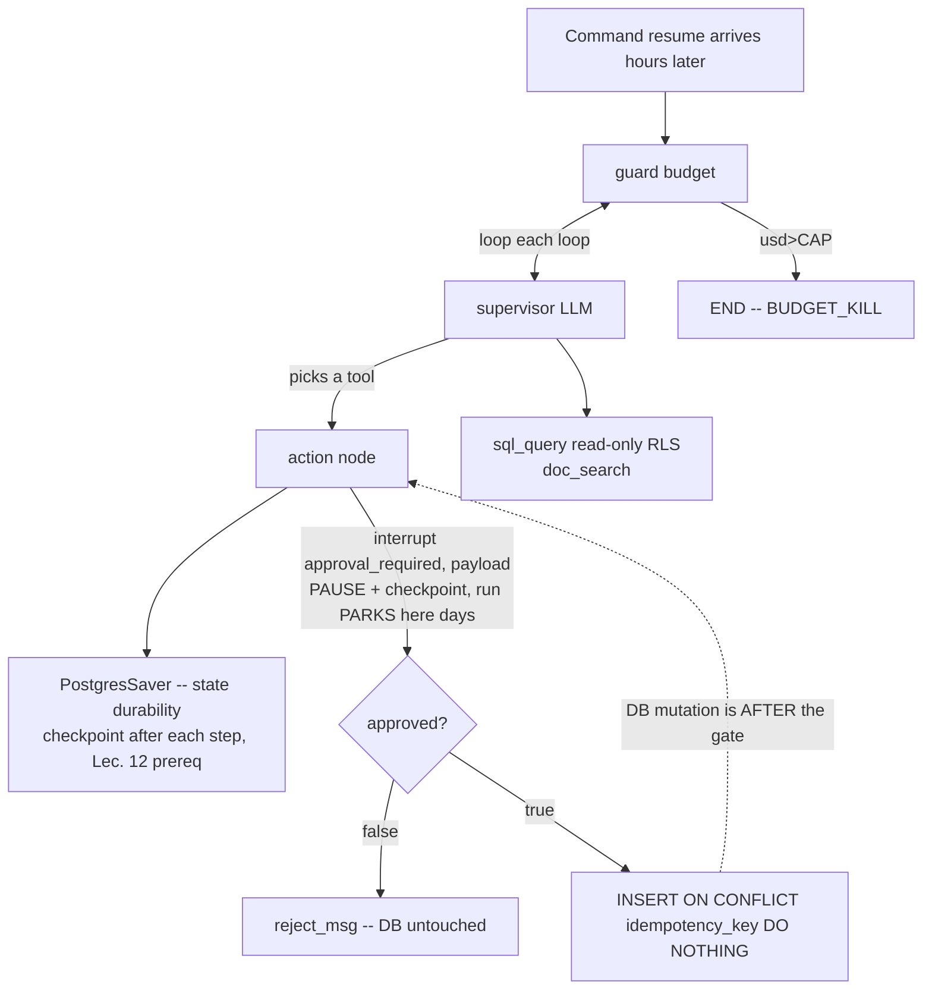

# Lecture: HITL Write Gates & Budget Kill-Switch as Graph Nodes

> Your Week-2 supervisor can already read the warehouse and retrieve docs. This lecture is about the two controls that decide whether it's allowed to *act* and *keep running*: a human approval gate on every destructive write, and a spend cap that stops the graph cleanly between steps. The design thesis is that both belong **inside the graph as nodes backed by the durable checkpointer** — not bolted onto the API as middleware. After this you'll be able to place the `interrupt()` at the one correct point in the write path, resume it without accidentally building an auto-approver, and wire a budget guard that halts with a resumable checkpoint instead of a `SIGKILL` mid-write. The two proofs you're building toward: an unapproved destructive payload leaves the `writes` row-count unchanged, and an over-cap run parks at the guard with a valid checkpoint.

**Prerequisites:** Agents phase Lec. 12 (durable execution & checkpointing), Lec. 14 (HITL interrupts & time-travel), Lec. 4 (budgets & kill switches, the token `Meter`); Capstone Week 2 Steps 3–4 · **Reading time:** ~18 min · **Part of:** Capstone Week 2

## The integration problem

Weeks 0–13 taught these controls in isolation. The agents phase gave you a `while`-loop agent with four budgets and a `KILL` file (Lec. 4), a LangGraph `PostgresSaver` that survives process death (Lec. 12), and an `interrupt()`/`Command(resume=...)` pattern for approvals (Lec. 14). The capstone's job is to fuse them into *one* supervisor that a regulated enterprise would trust to touch a production table. That fusion surfaces two decisions the isolated lessons let you dodge:

1. **Where does the approval gate live, and what does "approved" mean?** A gate that fires *after* the DB mutation is not a gate. A gate that treats a timeout or a null resume as "yes" is an auto-approver wearing a compliance costume.
2. **What stops a runaway loop — the API layer or the graph?** A per-request timeout at the FastAPI boundary can `SIGKILL` a worker mid-`INSERT`, leaving a half-written row and a checkpoint that no longer matches reality. That's the opposite of safe.

Both decisions have the same root cause: **the write and the run-state must move together.** If the pause and the cap don't share the same checkpointed state as the mutation, you get races — a write that fires before approval, or a kill that lands between the checkpoint and the commit. The integration problem is making pause, cap, and mutation atomic *with respect to the checkpoint*, so that whenever the process dies you're left in exactly one of two clean states: "written" or "not written," never "half."

## Architecture & how the pieces connect

The controls are two nodes on the supervisor graph. Everything routes through the checkpointer, so every pause and every kill leaves a durable, resumable record.

**The write path (action node).** Read the ordering carefully, because it is the whole design: `interrupt()` fires *before* the `INSERT`. When the supervisor routes to `action`, the node packages the proposed `{action, payload}` and calls `interrupt(...)`. LangGraph checkpoints the graph state and returns control to the caller with an `__interrupt__` marker. **No DB mutation has happened yet.** The run is now parked — it can sit for days across process restarts and deploys — until someone calls `app.invoke(Command(resume={"approved": ...}), config)` on the same `thread_id`. Only on resume, and only if `approved is True`, does the idempotent `INSERT` run. This is the single most important line in the subsystem: the mutation is downstream of the pause, so an unapproved payload can never reach the table.

**The budget path (guard node).** The guard sits *before* the supervisor on every loop, reading the cumulative `usd` that the LLM callback accumulates into graph state. Reuse the agents-phase `Meter`: it wraps each model call, reads `resp.usage`, multiplies by the per-token price, and writes the running total into state (see Lec. 4 — compute from `resp.usage`, never a client-side token guess). The guard compares against `CAP_USD` and, past the cap, routes to `END` with a `BUDGET_KILL` line. Because the guard runs at a *node boundary* — between super-steps — the checkpoint it leaves behind is complete and resumable. You stopped the graph on its own terms, not by killing a process.

**Why the checkpointer is load-bearing for both.** `interrupt()` that only lives in `MemorySaver` isn't a pause, it's a time bomb (Lec. 14): the moment the process recycles, the parked run and its half-decided write vanish. The DB checkpointer is a *prerequisite*, not an enhancement — it's what lets the approval survive the wait, and what makes "halt at the guard" mean "leave a checkpoint someone can resume" rather than "leak a zombie run." This is exactly why the Week-2 stack mandates `PostgresSaver` and the pitfall list bans `MemorySaver` in durability tests.

## Key decisions & tradeoffs

**Decision 1 — Interrupt goes in the action node, before the mutation.** The alternative — approve after writing, then compensate/rollback on rejection — is the saga pattern, and it's the wrong tool here. Compensation assumes the write is reversible and cheap to undo; a destructive action in a regulated domain (voiding a claim, sending a filing) frequently is neither. Gating *before* the side effect means "no" costs nothing and leaves no trace to unwind. Tradeoff: the run parks, so you accept latency (possibly days) and must design the UI to surface parked approvals. That's a feature — the whole point is that a human is in the loop — but it means your `submit_action` tool cannot be synchronous request/response; it's a two-phase interaction.

**Decision 2 — Resume with an explicit `{"approved": true/false}`; never infer approval.** The temptation is to treat silence as consent: a timeout defaults to approved, a `null` resume means "proceed," an empty payload means "sure." Every one of those builds an **auto-approver** — a gate that opens itself. The rule is inverted defaulting: `if not decision.get("approved"): reject`. Only the literal `approved is True` commits; timeout, null, missing key, malformed payload, `false` — all reject. This is the Week-2 pitfall "approval inferred from missing input" stated as a design law. The cost is that a lost approval message means a rejected action the human must re-issue; that's the correct failure direction in a domain where a wrongful write is a compliance incident and a re-ask is an annoyance.

**Decision 3 — Budget enforcement at the graph level, not the API.** You *could* put a spend cap in FastAPI middleware or a gateway (Week 3 does add per-tenant caps at the LiteLLM gateway — that's a different, complementary scope). But the *per-run* kill must be a graph node, because only the graph knows where the safe stopping points are. An API-layer timeout fires on wall-clock and can land *anywhere* — including between the checkpoint and the `INSERT`, or mid-transaction. That's `SIGKILL` semantics: you don't get to choose a clean boundary, and you may corrupt the write or desync the checkpoint. A guard node, by contrast, only ever halts *between* steps, so it always leaves the invariant intact: written-or-not, never half. Tradeoff: the graph-level guard can't interrupt a single pathological step that's already in flight (a hung tool call) — that's what the wall-clock budget and transport timeouts from Lec. 4 are for. Use both; they catch different failures.

**Decision 4 — Wire `guard → supervisor` each loop, and route `guard → END` on kill.** The guard must run *every* iteration, not once at startup, for the same reason the kill switch is polled every iteration in Lec. 4: cost accrues continuously and you want to stop *before* the next expensive call, not after. Killed means route to `END` and emit a `BUDGET_KILL @ $X.XXXX` line into the message state so the overage is logged and auditable. The checkpoint at `END` is valid and resumable — if a human later raises the cap and resumes, the run continues from where it parked.

**On idempotency (why the write survives resume).** The gate and the cap protect *whether* you write; the idempotency key protects *how many times*. Generate the key **upstream of the interrupt** so it's part of the checkpointed state and stable across resume, then `INSERT ... ON CONFLICT (idempotency_key) DO NOTHING`. If you mint the key *inside* the retried node (e.g. `uuid4()` after the crash point), resume makes a fresh key and you double-write — the exact bug the Week-2 crash-resume proof (`count == 1`, not 2) is designed to catch. The HITL gate and the idempotency key are partners: the gate ensures the write is *authorized*, the key ensures it's *singular*.

## How it fails in production & how to prevent it

- **Auto-approver by silence.** A timeout or `null` resume is coded as "approved." Now the gate opens itself and you've built the thing you were defending against. *Prevention:* invert the default — only `approved is True` commits; everything else, including timeout, rejects. Test it with a `{"approved": false}` resume and a null resume; both must leave `writes` row-count unchanged.

- **Interrupt after the mutation.** The `INSERT` runs, *then* you ask for approval; rejection now requires a compensating delete that may not be possible. *Prevention:* the mutation is the last statement in the node, strictly downstream of `interrupt()`. Verify by reading `action_node` top-to-bottom: no `execute` before the `interrupt`.

- **`MemorySaver` in "durable" tests.** The resume test passes because state never left the process — a fake green. *Prevention:* use `PostgresSaver` and prove durability from a *new process/connection* with the same `thread_id`, not a new graph object in the same interpreter (Week-2 pitfall).

- **API-layer kill mid-write.** A request timeout or `SIGKILL` lands between checkpoint and commit; you get a half-written row or a checkpoint that lies about reality. *Prevention:* enforce the per-run cap in the guard node so halts only happen at step boundaries; leave wall-clock/transport timeouts to catch hung *single* calls, not to bound spend.

- **Meter under-counts, cap never trips.** Estimating tokens client-side (or forgetting the output-price multiplier) makes `usd` too low, so the guard never fires and the run overspends. *Prevention:* accumulate from `resp.usage` in the callback, price input and output separately, and reuse the Lec. 4 `Meter` rather than re-deriving it.

- **God-token bypass.** If `submit_action` runs under a service account with all scopes, the HITL gate is the *only* thing standing between the model and a destructive write — remove the gate by accident and there's no second wall. *Prevention:* the action node also checks the end-user's `action.write` scope *before* the interrupt (Week-2 Step 6), so authorization and approval are independent layers.

## Checklist / cheat sheet

- [ ] `interrupt(payload)` is in the **action node, before** any DB statement.
- [ ] Resume path commits **only** on `decision.get("approved") is True`; timeout/null/missing/`false` all reject.
- [ ] Checkpointer is **`PostgresSaver`**, not `MemorySaver`; durability proven from a new process, same `thread_id`.
- [ ] Idempotency key generated **upstream of the interrupt**, part of checkpointed state; `INSERT ... ON CONFLICT DO NOTHING`.
- [ ] `guard` node runs **before `supervisor` on every loop**; reads cumulative `usd` from state.
- [ ] `usd` accumulated via the LLM **callback (reuse the Lec. 4 `Meter`)**, priced from `resp.usage`, in/out split.
- [ ] Over `CAP_USD` → route to **`END`** with a logged `BUDGET_KILL @ $X` line; checkpoint left **valid & resumable**.
- [ ] Per-run cap lives in the **graph**, not the API; no `SIGKILL` mid-write.
- [ ] Proof 1: unapproved destructive payload → `writes` row-count **unchanged**.
- [ ] Proof 2: over-cap run **halts at guard** with a resumable checkpoint (not a crash).

## Connect to the build

This lecture is the design behind Week-2 Lab Steps 3 (HITL + durable checkpoint) and 4 (budget + kill switch), and the two tests they gate. `test_hitl.py` must show `submit_action` on a destructive payload pausing at `interrupt` (an `__interrupt__` returned, `writes` row-count unchanged); resuming `{"approved": false}` leaves the DB untouched; `{"approved": true}` inserts exactly one row. `test_budget.py` must show that with `CAP_USD` set below one run's cost, the graph halts at `guard`, routes to `END`, logs `BUDGET_KILL` with the overage, and leaves a valid resumable checkpoint. Both tests share a spine with `test_resume.py`'s crash-resume proof (`count(*) == 1`) — the idempotency key from this lecture is what makes that assertion hold. When you write the milestone `docs/tradeoffs.md`, the "HITL vs autonomous" and "sync vs queue" knobs are exactly the tradeoffs in Decisions 1 and 3 above.

## Going deeper (optional)

- **LangGraph "Human-in-the-loop" docs** — the `interrupt`/`Command(resume=...)` contract and the `__interrupt__` marker. Search: `langgraph human in the loop interrupt`.
- **LangGraph "Persistence" docs** — checkpointer semantics, `thread_id`, and at-least-once node execution on resume. Search: `langgraph persistence checkpointer`.
- **`langgraph-checkpoint-postgres`** — the `PostgresSaver` you're required to use. Search: `langgraph checkpoint postgres PostgresSaver`.
- **Agents phase, Lecture 4** (this study plan) — the four budgets, the out-of-band kill switch, and the token `Meter` you reuse for the guard's `usd` accounting.
- **Michael Nygard, *Release It!*** — circuit breakers, bulkheads, and why "stop between operations, not mid-write" is a classic reliability pattern, not an LLM-specific one. Search: `circuit breaker pattern Nygard Release It`.

## Check yourself

1. Your teammate proposes: "If the approval webhook doesn't answer within 5 minutes, resume with `approved=true` so the run doesn't stall." What have they built, and what's the one-line fix?
2. Why must `interrupt()` sit *before* the `INSERT` rather than after, given that you could theoretically delete a wrongly-written row on rejection?
3. A reviewer asks why the budget cap isn't just a request timeout in FastAPI. Give the two-part answer: what the API timeout can corrupt, and what property the graph-level guard preserves.
4. On crash-resume, `test_resume.py` finds **two** rows in `writes`. Name the most likely cause and the fix, in terms of where the idempotency key is generated.
5. Why is `PostgresSaver` (not `MemorySaver`) a *prerequisite* for the HITL gate specifically — what exactly breaks if the run parks in RAM and the process recycles?

### Answer key

1. **An auto-approver** — treating silence/timeout as consent means the gate opens itself, which defeats the entire control. *Fix:* invert the default so only a literal `approved is True` commits; a timeout rejects (and the human re-issues if they actually meant yes). The correct failure direction is "wrongly rejected, re-ask" not "wrongly written, incident."

2. Because gating before the side effect makes "no" **free and traceless** — nothing was written, so nothing must be unwound. Post-write approval is the saga/compensation pattern, which assumes the write is reversible and cheap to undo; destructive actions in a regulated domain (voided claim, submitted filing) often are neither, and a compensating delete can leave audit residue or fail entirely. Pre-mutation gating sidesteps all of it.

3. **(a)** An API request timeout or `SIGKILL` fires on wall-clock and can land *anywhere* — including between the checkpoint and the `INSERT`, or mid-transaction — leaving a half-written row or a checkpoint that no longer matches the DB. **(b)** The graph-level guard only halts at **node boundaries (between super-steps)**, so it always leaves the invariant intact: written-or-not-written, never half, and the checkpoint it leaves is complete and resumable.

4. Most likely the **idempotency key is generated *inside* the retried action node** (e.g. `uuid4()` after the interrupt/crash point), so resume mints a *new* key and the `ON CONFLICT` never matches → a second insert. *Fix:* generate the key **upstream of the interrupt** so it's part of the checkpointed state and stable across resume; then `INSERT ... ON CONFLICT (idempotency_key) DO NOTHING` dedups.

5. `interrupt()` persists the parked run *into the checkpointer*; the run then waits — possibly days — for `Command(resume=...)`. With `MemorySaver`, that parked state lives only in the process; a deploy, OOM, or restart erases the pending approval **and** the half-decided write, so the resume either can't happen or re-runs from an earlier point. `PostgresSaver` makes the pause survive the wait, which is the entire reason it's a prerequisite rather than an enhancement.
