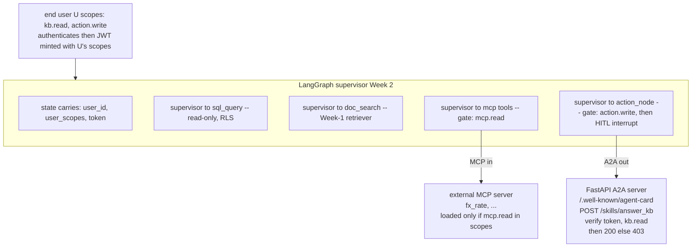

# Lecture: End-User OAuth Scopes Across MCP-in and A2A-out

> Your capstone agent is about to reach the outside world in two directions at once: it *consumes* an external tool over MCP, and it *exposes* one of its own capabilities over A2A. Both crossings carry a token. The single decision that makes this defensible in a regulated domain is whose scopes that token carries — the **end user's**, not a fat service account's. This note is the graded interop-under-identity design: how the two protocols wire into your LangGraph supervisor, where the scope check sits per tool, and what fails when you get it wrong. After it you can design an agent whose every outbound and inbound action answers the auditor's only question — *who, with what authority, at what time.*

**Prerequisites:** Phase 6 Agents — L15/L16 (MCP primitives + security), L17/L18 (A2A Agent Cards + composition), L19 (OAuth 2.1, scoped tokens, on-behalf-of), L14 (HITL interrupts); Capstone Week 1 (tenant isolation) · **Reading time:** ~14 min · **Part of:** Capstone Week 2

## The integration problem

Week 1 gave you a tenant-isolated retrieval spine. Earlier this week you built a LangGraph supervisor with three typed tools, HITL-gated writes, and durable Postgres checkpointing. Now the agent stops being a closed box: it has to talk to systems it does not own.

Two crossings, opposite directions, same identity question:

- **MCP in** — you consume an external tool (an FX-rate lookup, a claims-adjudication service, a contract-clause database). The MCP server exposes tools; `langchain-mcp-adapters` loads them straight into your graph as LangChain tools the supervisor can call.
- **A2A out** — you expose exactly one capability (`answer_kb_question`) as a discoverable skill. Another agent finds your **Agent Card** at `/.well-known/agent-card.json`, reads your endpoint and auth requirements, and calls you.

The trap is to make both crossings work with a *service-account god-token* — one broad credential your agent holds and presents everywhere. It's the fastest path to a green demo and the fastest path to an unshippable product. In healthcare claims, financial compliance, or legal contract ops, **"the agent did it" is not an answer to an auditor.** The answer that survives an audit is "user U, holding scope `action.write`, did it at time T." That sentence is only constructible if the token crossing every boundary carries *U's* scopes, minted for *this* request, and is validated *per tool* before anything happens.

This is the same on-behalf-of principle from Phase 6 L19 (the agent as a *transparent* deputy, not a privileged one), now applied at the integration seams of a real system. Least-privilege and audit trails in a regulated domain live or die here.

## Architecture & how the pieces connect

**The token is the spine.** When user U authenticates, you mint a JWT whose `scope` claim is exactly U's granted scopes — `"kb.read action.write"`, space-delimited per OAuth convention. That token (and the parsed scope set) rides in the graph state alongside `user_id`. Every boundary reads it.

**MCP in — scope gates the *load*, not just the call.** `langchain-mcp-adapters` (`MultiServerMCPClient.get_tools()`) turns MCP tools into graph tools. The check is upstream: if `mcp.read` is not in U's scopes, you never load the tools — raise `PermissionError("403: needs mcp.read")` before the client connects. A supervisor that never receives the tool cannot call it; the least-privilege boundary is that the tool is simply absent from the model's action space for an unscoped user.

**A2A out — scope gates the *skill invocation*.** Your Agent Card advertises, per skill, the auth it requires (`security: [{oauth2: ["kb.read"]}]`). Discovery is public; invocation is not. The `POST /skills/answer_kb_question` handler pulls the bearer token, validates the JWT, and checks `kb.read` is present. Absent or wrong scope → `403` before any graph run.

**The write path — scope gates *before* HITL.** `submit_action` is the destructive tool. The order is deliberate: the `action_node` first checks `action.write` is in the caller's scopes; only then does it reach the `interrupt()` and park for human approval. A caller without `action.write` is rejected *before* a human is ever asked — you don't page an approver for an action the caller was never entitled to request.

**Validation library.** Validate the JWT with **Authlib** (`authlib.jose.jwt`) or `python-jose` — decode, call `.validate()` to enforce `exp`/`nbf`, then split the `scope` claim and membership-test the scope the tool requires. In the lab this is HS256 with a shared `dev-secret`; see failure modes for why that is dev-only.

## Key decisions & tradeoffs

**End-user scopes vs. service-account god-token.** The whole graded point. A god-token is one broad credential the agent holds; it works, and it makes every downstream log say "the agent." End-user scopes flow *U's* authority through the agent to each boundary. The cost is real: you need a token-minting step, scopes must be present in graph state, and each tool re-checks. The payoff is the audit trail is *true* — the downstream system sees U's identity and U's ceiling, so a poisoned tool or a jailbroken prompt is bounded to exactly what U could already do. In a regulated domain this is not optional polish; it is the compliance boundary. (Phase 6 L19: transparent deputy, minimally scoped, short-lived.)

**Check scope per tool, not once at the front door.** A single gate at request entry ("is this a valid token?") authenticates but does not authorize *the specific action*. `kb.read` should let you answer a question and be useless for a write; `action.write` should be required at the write node and nowhere else. Per-tool checks mean the wrong-or-absent scope produces a `403` at the exact tool, and the audit row names the tool and the scope it demanded. The tradeoff is a few lines of check code duplicated across tools — cheap insurance; centralize it in one `verify(token, need)` helper so the logic lives once.

**Gate MCP at load time vs. call time.** Loading gate (chosen here) keeps the unscoped tool out of the model's reach entirely — simpler to reason about, and the model can't hallucinate a call to a tool it was never given. Call-time gating (let the model try, reject on invoke) is more granular if scopes can change mid-run, but it leaks the tool's existence into the prompt and invites retries. For the capstone, load-time gating is the defensible default.

**Discovery is public; invocation is authorized.** The Agent Card at `/.well-known/agent-card.json` is meant to be fetched by strangers — that's discovery. Do not put secrets in it; do declare the auth each skill requires so a caller knows what token to bring. The 403 lives at the skill endpoint, not the card. (Phase 6 L17: the card is a static capability advertisement; the task lifecycle is where authority is enforced.)

**Reuse the tenant boundary, don't replace it.** Scopes are *what the user may do*; the Week-1 tenant filter is *whose data they may see*. Both must hold. `kb.read` lets U call the KB skill; the retriever still applies U's `tenant_id` server-side. A scope check is not a substitute for tenant isolation — a `kb.read` token for tenant A must never surface tenant B's rows.

## How it fails in production & how to prevent it

**God-token creep.** The most common regression: someone wires MCP or A2A with a single admin token "to unblock the demo," and the end-user scopes quietly stop mattering. Symptom: every audit row says "service-account," and you cannot answer *which user* triggered a write. Prevention: mint per-user tokens at authentication, thread `user_scopes` through graph state, and make the per-tool check read from that state — never from a module-level constant. Test it: a request with a token lacking a scope must 403.

**HS256 shared dev-secret shipped to prod.** The lab uses `KEY = b"dev-secret"` with HS256 — a *symmetric* secret, meaning anyone who can verify a token can also mint one. That is fine on a laptop and catastrophic in production: leak the secret (it's in the repo, the image, the env dump) and an attacker forges any user's scopes. Prevention: in production use asymmetric **RS256/ES256** with a private signing key held only by the issuer and a public key (JWKS endpoint) for verifiers, short `exp`, and audience (`aud`) binding so a token minted for service X can't be replayed at service Y. Note the dev-only status explicitly in your DECISIONS/tradeoffs doc so no one mistakes it for the real thing.

**Scope check inferred from prompt or missing input.** If the agent decides "this user is probably allowed" from context, you've built an authorizer out of an LLM — non-deterministic and un-auditable. The check must be a deterministic string-membership test on a validated JWT claim, run in code before the side effect. Likewise, treat absence of a scope as denial, never as a default-allow.

**Approval requested before authority is verified.** If `submit_action` reaches the HITL `interrupt()` and *then* someone notices the caller lacked `action.write`, you've leaked the intent to an approver and burned a human decision on an illegitimate request. Order matters: scope check → reject-or-continue → interrupt → commit. The 403 must fire before the pause.

**Confused-deputy via poisoned MCP tool.** An MCP server you consume is untrusted content (Phase 6 L16, L29 lethal trifecta). If your agent held a god-token, a poisoned tool description could induce a call that wields broad authority. With end-user scopes, the blast radius is exactly what U could already do — the scope *is* the containment. Keep it that way: never elevate the token when calling an external tool.

**Token doesn't propagate to the downstream call.** Validating the token at your A2A endpoint but then calling the MCP server or the DB with a different, broader identity re-introduces the god-token problem one hop deeper. The end-user identity must ride *through* each hop (on-behalf-of / token exchange, Phase 6 L19), not stop at your front door.

## Checklist / cheat sheet

- [ ] JWT minted at auth carries the **end user's** `scope` claim (`"kb.read action.write"`), not a service account's.
- [ ] `user_scopes` (and the token) live in **graph state**, threaded to every boundary.
- [ ] **MCP in:** tools load only if `mcp.read ∈ scopes`; otherwise `PermissionError` *before* connecting.
- [ ] **A2A out:** Agent Card at `/.well-known/agent-card.json` advertises skill + required scope; **invocation** verifies the JWT and checks `kb.read` → `403` if absent.
- [ ] **Write path:** `action_node` checks `action.write` **before** `interrupt()`; wrong/absent scope rejects before HITL.
- [ ] One `verify(token, need)` helper: decode → `.validate()` (exp/nbf) → scope membership. Used by every tool.
- [ ] Scope check is a **deterministic** string test in code, never inferred by the model.
- [ ] Scopes complement, never replace, the Week-1 **tenant filter** (what-you-may-do vs. whose-data).
- [ ] HS256 `dev-secret` flagged **dev-only**; prod uses RS256/ES256 + JWKS + `exp` + `aud`.
- [ ] Downstream hops carry the end-user identity through (on-behalf-of), no re-broadening.

## Connect to the build

This lecture is the interop core of Week 2's Definition of Done: *"the A2A skill returns 200 only with a token carrying `kb.read` (403 otherwise); the MCP tool loads only when the user's scopes include `mcp.read`; the Agent Card is served at `/.well-known/agent-card.json` and lists the one skill + its required scope."* Concretely, the proofs read:

- `test_scopes.py`: `POST /skills/answer_kb_question` with a `kb.read` token → **200**; without it → **403**.
- MCP load path: `load_mcp_tools(scopes)` returns tools when `mcp.read ∈ scopes`, raises `403` otherwise.
- Write path: `submit_action` with a caller lacking `action.write` → the `action_node` rejects **before** the interrupt, and the `writes` table row count is unchanged.

Your files: `agent/auth.py` (mint/verify), `interop/a2a_server.py` (card + scoped skill), `interop/mcp_client.py` (scope-gated load), `agent/graph.py` (`action_node` scope check before `interrupt`). This feeds directly into the milestone acceptance criterion **[Phase 6 — Agents]**: one action via MCP + one A2A hop *under OAuth*, write gated by HITL. It also sets up Week 4's audit-log and red-team work — the audit row you emit here ("user U, scope action.write, at T") is exactly the record the governance week queries, and the end-user-scope containment is what your indirect-injection red-team relies on.

## Going deeper (optional)

Real, named resources — no invented URLs:

- **MCP authorization specification** — `modelcontextprotocol.io` docs, "Authorization" section (Protected Resource Metadata, OAuth 2.1 flow, audience-bound tokens). The canonical statement of how MCP expects scoped, per-user auth.
- **`langchain-mcp-adapters`** GitHub (`langchain-ai/langchain-mcp-adapters`) — `MultiServerMCPClient.get_tools()` to load MCP tools into LangGraph.
- **Official MCP Python SDK** — `modelcontextprotocol/python-sdk` (`mcp[cli]`, `FastMCP`).
- **`a2a-sdk`** and the A2A spec — search "a2a python sdk github", "a2a agent card"; the Agent Card schema and skill `security` field.
- **Authlib** JOSE docs (`docs.authlib.org`) — `authlib.jose.jwt` encode/decode, claim validation; and `python-jose` as the alternative.
- **OAuth 2.1** draft and **RFC 8693 Token Exchange** — the on-behalf-of / delegation mechanism for propagating end-user identity through hops.
- Phase 6 L19 (Agent Identity & Auth) for the full OAuth 2.1 + PKCE + token-exchange treatment this note assumes.

## Check yourself

1. An auditor asks, "Who deleted claim #4471 and were they allowed to?" Your agent used a service-account god-token for the write. Why can't you answer defensibly, and what one design change fixes it?
2. Where exactly does the `mcp.read` check sit — at tool load or at tool call — and what is the security consequence of the choice you made?
3. Trace the rejection path for a caller who presents a valid token with only `kb.read` and asks the agent to run `submit_action`. Name the node, the check, and why it must fire before the HITL interrupt.
4. The Agent Card at `/.well-known/agent-card.json` is publicly fetchable. Why is that not a leak, and where does authorization actually happen?
5. Why is the HS256 `dev-secret` acceptable in the lab but dangerous in production, and what specifically do you change to ship it?
6. A scope check passes but a Week-1 tenant filter is missing on the KB skill. What does the caller see, and why isn't the scope check sufficient on its own?

### Answer key

1. Every downstream log says "service-account," so you can prove *an* action happened but not *whose authority* it carried — "the agent did it" is not an audit answer. Fix: the token the agent presents must carry the **end user's** scopes (`action.write`), minted per request, so the downstream record reads "user U, scope action.write, at T." Least-privilege also bounds the blast radius to what U could already do.
2. At **tool load** (`load_mcp_tools` raises `PermissionError` if `mcp.read` is absent). Consequence: an unscoped user never receives the tool, so the supervisor cannot call — or even hallucinate a call to — a tool that isn't in its action space. Call-time gating would leak the tool's existence and invite retries.
3. In `action_node`: it reads the caller's scopes from graph state and tests `action.write` membership *before* reaching `interrupt()`. Absent → reject immediately (no DB write, `writes` count unchanged). It must fire before HITL so you never page a human approver — or leak the intended action to them — for a request the caller was never entitled to make.
4. Discovery is meant to be public: the card advertises skills, endpoint, and *which* scope each skill needs, so callers know what token to bring. No secret lives in the card. Authorization happens at the **skill invocation** endpoint (`POST /skills/answer_kb_question`), which validates the JWT and checks `kb.read` → 403 if absent.
5. HS256 is symmetric — the verify secret is also the mint secret, so anyone who can validate can forge any user's scopes; on a laptop that's fine, in prod a single leak (repo, image, env dump) lets an attacker mint tokens for any user. Ship: switch to asymmetric **RS256/ES256** (private signing key at the issuer only, public key via JWKS), add short `exp` and audience (`aud`) binding.
6. The caller gets a `200` and a valid-looking answer — but the retriever, lacking the tenant filter, can surface *another tenant's* data, a cross-tenant breach. Scopes govern *what action* U may perform; the tenant filter governs *whose data* U may see. Both are required; a `kb.read` scope never implies cross-tenant read.
