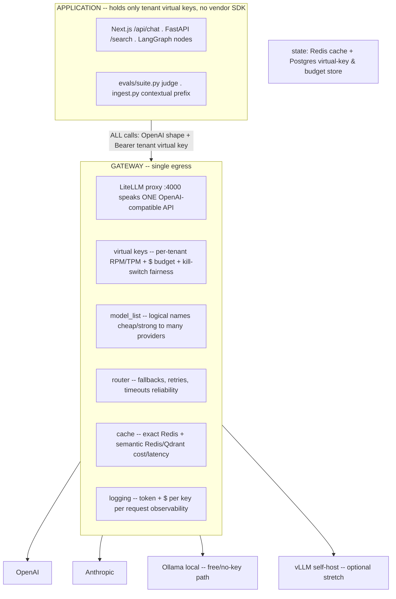

# Lecture: The Gateway as Single Egress — Centralizing Cross-Cutting Concerns

> By Week 3 your capstone has a retrieval spine (Week 1) and an acting agent (Week 2) that both call models — from the FastAPI app, from the LangGraph nodes, from the contextual-chunking step, maybe from an LLM judge. That's already four or five call sites, and each one is a place where a rate limit, a spend cap, a fallback, a cache, and an API key have to be re-implemented and kept in sync. This lecture makes one architectural decision for the whole serving plane: **every model call in the system leaves through a single door.** After it you'll be able to wire a self-hosted LiteLLM proxy as that door, prove the app imports zero vendor SDKs, and explain exactly why streaming must go *through* the gateway and not around it.

**Prerequisites:** Phase 09 (Gateway/router pattern — L6; circuit breakers & fallback — L7; caching layers — L10; rate-limiting & spend governance — L11), Phase 10 (OpenAI-compatible serving — L3; prompts/models as code — L15), Capstone Weeks 1–2 · **Reading time:** ~13 min · **Part of:** Capstone Week 3

---

## The integration problem

You have already met the gateway pattern as a *concept* in Phase 09 Lecture 6. This lecture is where you commit to it as a *system boundary* for the capstone and design around the commitment.

The failure mode you are preventing is **scatter**. Concretely, count the places in your repo today that could call a model:

- `src/ingest.py` — the contextual-chunk prefix (Week 1, one LLM call per chunk).
- `agent/graph.py` — the supervisor node and any tool that reasons.
- `agent/tools.py` — `doc_search` if it does query rewriting.
- `evals/suite.py` — the LLM-judge in your CI eval gate.
- `web/app/api/chat/route.ts` — the user-facing streaming chat.

That is five call sites in three languages. Now overlay the cross-cutting concerns Week 3 demands: **per-tenant RPM/TPM limits**, **daily spend caps with a kill-switch**, **provider fallback**, **exact + semantic caching**, **key rotation**, and **observability** (token/cost per tenant per request). If each concern lives at each call site, you have a 5×6 matrix of things that must be implemented consistently and can never drift. The first time an engineer adds a sixth call site and forgets the tenant budget check, one tenant's runaway loop bills the whole platform. The "one-throat-to-choke" principle says: collapse that matrix to a single row. One egress point owns all six concerns; every call site owns *none* of them.

The decision, stated as a testable invariant:

> **100% of application model calls route through the gateway. The app holds ONLY tenant virtual keys and imports NO vendor SDK. This is provable by grepping the request paths.**

That last clause matters — it's the Week 3 Definition of Done item "grep the app: no direct `openai`/`anthropic` SDK imports in request paths." An architectural principle you can't grep for is a wish; this one you can enforce in CI.

---

## Architecture & how the pieces connect

The gateway sits between your whole system and the outside world of model providers. Everything on the left speaks *one* dialect — the OpenAI Chat Completions shape (Phase 10 L3 established why that's the lingua franca). Everything on the right is the gateway's problem, not yours.



**The three config levers that make this real** (all in `gateway/litellm-config.yaml`):

1. **`model_list` — logical names, many providers each.** You expose two logical names, `cheap` and `strong`. Each maps to *several* concrete deployments. `cheap` might be `gpt-4o-mini` *and* `claude-3-5-haiku` *and* local `ollama/llama3.1`; `strong` might be `claude-3-7-sonnet` *and* `gpt-4o`. The app asks for `"cheap"` and never learns which vendor answered. This is the logical-model indirection from Phase 09 L6 — it's what makes fallback a config line instead of a rewrite.

2. **`general_settings.master_key` + `database_url` — enables virtual keys.** Without a `database_url` LiteLLM runs stateless and *cannot* mint per-tenant keys or track budgets. Setting it (to your Postgres) unlocks `/key/generate`, per-key `rpm_limit`/`tpm_limit`/`max_budget`, and `/key/block` (the kill-switch). The `master_key` is your admin credential for minting those tenant keys — it never leaves your control plane and is never handed to a tenant.

3. **`litellm_settings.cache` + `router_settings.fallbacks` — the reliability/cost layer.** Cache is Redis-backed (exact) or Redis/Qdrant (semantic). Fallbacks are declared ordered lists (`{"cheap": ["strong"]}`) so a provider error becomes a silent retry elsewhere.

**The free / no-key path.** Add Ollama as a deployment of `cheap`:

```yaml
  - model_name: cheap
    litellm_params:
      model: ollama/llama3.1
      api_base: http://host.docker.internal:11434
```

Now the entire Week 3 lab — fairness, fallback, caching, streaming UI — runs with **zero paid API**. This is not a toy escape hatch; it's the same design lesson as Week 1's local embeddings and Week 2's Ollama tool-calling path. The gateway makes "swap to a local model" a one-line config edit precisely *because* nothing downstream imported a vendor SDK.

**Where state lives.** Redis holds the cache (ephemeral, TTL'd). Postgres holds virtual keys and running budget counters (durable — a budget that resets on restart is not a budget). This mirrors the storage-tier reasoning from Phase 09 L3: put the thing that must survive a crash in the durable store.

---

## Key decisions & tradeoffs

**Self-host LiteLLM vs. managed Portkey.** The opinionated default is **self-host LiteLLM proxy** — OSS, one container, config-as-YAML, 100+ providers, budgets/keys/caching/fallbacks built in. You reach for **Portkey** (managed control plane, hosted guardrails marketplace) only when you don't want to run the infra. The concepts map 1:1 — virtual keys, model lists, fallbacks, caches all exist in both. For a capstone that must come up with `docker compose up`, self-hosting keeps the whole system reproducible on a laptop and puts the control plane in your repo where a reviewer can read it. **The one thing you must not do is build your own router.** Fallback chains, retry/backoff, token accounting across provider dialects, and semantic-cache plumbing are solved, subtle, and a tar pit; your capstone's value is the *domain* system on top, not a re-implemented proxy.

**One logical name, many providers vs. explicit provider names.** Routing `cheap` to three vendors buys you fallback and load-spread for free, but it means a given request is *non-deterministic* about which model answers. For the eval gate (Phase 10 L15) that matters: pin the candidate to a single deployment when you're measuring quality, or your CI metric wobbles because Haiku answered some cases and `gpt-4o-mini` others. Design choice: keep a `strong-pinned` logical name for evals, `strong` (multi-provider) for prod traffic.

**The app holds virtual keys, never provider keys.** Provider secrets (`OPENAI_API_KEY`, `ANTHROPIC_API_KEY`) live *only* in the gateway's environment. The app is issued a per-tenant *virtual* key (`sk-...` minted via `/key/generate`) and selects the right one per request from the tenant's session/auth. Tradeoff: one more indirection and a key-management step — but it's the whole point. It means (a) a leaked app key exposes one tenant's budget, not your provider account; (b) rotating a provider key is a gateway-only change, invisible to the app; (c) the audit trail Week 2 built ("user U with scope X did it") extends naturally — each request carries a tenant-scoped key the gateway logs. This is the secrets-boundary discipline from Phase 09 L12 applied to the serving plane.

**Fallback (reliability) is gateway config; cascade (cost) is app logic.** A subtle split worth stating so you don't conflate them (Phase 09 L7 covered the distinction). *Fallback* = same task, provider A failed, try B — declared in `router_settings.fallbacks`, invisible to the app. *Cascade* = try the cheap model first, escalate to strong only on low confidence — this needs a confidence signal the gateway can't know, so it lives in `router/cascade.py` and makes *two* gateway calls (`model="cheap"` then maybe `model="strong"`). Both still go through the single egress; the cascade just decides *which logical name* to ask for.

---

## How it fails in production & how to prevent it

**1. Streaming bypasses the gateway — the headline failure.** This is the one to internalize. The tempting shortcut in `web/app/api/chat/route.ts` is to point the Vercel AI SDK at a provider directly:

```ts
// WRONG — imports a vendor path, streams straight from OpenAI
import { openai } from "@ai-sdk/openai";           // talks to api.openai.com
const result = streamText({ model: openai("gpt-4o-mini"), messages });
```

It works in the demo and it is a hole straight through your entire serving plane. A stream that goes provider-direct is **not counted against the tenant's budget, not rate-limited, not cached, not logged, and uses a provider key the browser-adjacent route now needs.** Every control you built in this lecture is silently bypassed for your highest-volume, most user-facing path. The fix is to point the SDK's `baseURL` at the gateway and authenticate with the tenant virtual key:

```ts
// RIGHT — streams THROUGH the gateway; caching/limits/budgets all apply
import { createOpenAI } from "@ai-sdk/openai";
const gw = createOpenAI({ baseURL: "http://localhost:4000/v1", apiKey: process.env.TENANT_KEY! });
const result = streamText({ model: gw("cheap"), messages });   // SSE relayed by LiteLLM
```

LiteLLM relays SSE token-by-token, so TTFT (Phase 09 L8) is essentially unchanged — the gateway forwards the first chunk as it arrives. You lose nothing perceptible and keep every control. **Guard it in CI**: grep the app for `@ai-sdk/openai` / `@ai-sdk/anthropic` / `from openai import` / `import anthropic` in request paths and fail the build if any appears outside the gateway config. That grep *is* the DoD proof that 100% of calls route through the egress.

**2. Semantic-cache false hits and cross-tenant leaks.** Caching is a cross-cutting concern the gateway now owns, which means its failure modes are now *your* failure modes. A too-low semantic threshold serves tenant A's cached answer to tenant B, or answers a subtly different question with a stale hit. Prevention (from Phase 09 L10): threshold ≥ 0.9, **scope the cache per tenant** (the virtual key is the scope), TTL everything, and **never** semantic-cache tool/action calls — only idempotent Q&A. When unsure, exact-cache only.

**3. Fallback that hides a dead primary.** If `cheap → strong` fires on every timeout, a broken primary provider looks healthy while your budget quietly bleeds into the expensive model. Fallbacks must be *observable*: log which deployment served each request (the tier), and alert when the fallback rate spikes. An invisible fallback is an incident you'll discover on the invoice.

**4. Rate limit without spend cap, or vice versa.** RPM alone doesn't stop one tenant burning the budget with huge-context requests; a spend cap alone lets a tight loop exhaust provider concurrency before the daily cap trips. You need **both** rpm/tpm **and** a USD `max_budget` per virtual key, **plus** the kill-switch (`/key/block`) for the "it's happening right now" case. This is the fairness DoD: abusive tenant `acme` hits *its own* ceiling and gets `429`/degraded while `globex` stays green.

**5. Budget state that doesn't survive restart.** If you forget `database_url`, LiteLLM can't persist virtual keys or budget counters — a proxy restart resets every tenant's spend to zero and drops their keys. Wire the Postgres `database_url` from the start; treat the budget store as durable state, not cache.

---

## Checklist / cheat sheet

- [ ] `general_settings.master_key` set (admin only, never given to tenants) and `database_url` points to durable Postgres → virtual keys + budgets enabled.
- [ ] `model_list` exposes logical names (`cheap`, `strong`), each mapped to **multiple** providers; add `ollama/llama3.1` so the lab runs key-free.
- [ ] One virtual key per tenant, minted via `/key/generate` with `rpm_limit` + `tpm_limit` + `max_budget` + `budget_duration`.
- [ ] Kill-switch verified: `/key/block` disables a tenant instantly; `/key/unblock` restores; other tenants unaffected.
- [ ] `router_settings.fallbacks` declared; every response logs the tier/deployment that served it.
- [ ] Cache on: exact always; semantic only with threshold ≥ 0.9, per-tenant scope, TTL, **no** tool/action caching.
- [ ] App holds **only** tenant virtual keys. Provider keys live **only** in the gateway env.
- [ ] Streaming path (`route.ts`) points `baseURL` at the gateway — never a provider SDK directly.
- [ ] CI greps request paths for vendor SDK imports and **fails** if any exist outside gateway config.

---

## Connect to the build

This lecture wires **Step 0** and **Step 1** of the Week 3 lab and underwrites two Definition-of-Done items:

- *"100% of model calls go through the gateway — grep the app: no direct SDK imports; app holds only tenant virtual keys."* The grep-guard and the virtual-key-per-tenant setup here are exactly that proof.
- *"Fairness proof (`test_fairness.py`)"* rests on the per-key rpm/budget/kill-switch you configure here; the fairness *behavior* is the next build step, but it's impossible without this egress being the sole path.

It also feeds forward: the cascade (Step 2) asks the gateway for `cheap` then `strong`; caching (Step 3) is the gateway setting you flip here; the streaming UI (Step 4) must use the `baseURL`-through-gateway pattern above; and the CI eval gate (Step 5) runs its golden set *through* the gateway so the thing you measure is the thing you ship. Every subsequent Week 3 piece assumes this single door already exists.

---

## Going deeper (optional)

Real, named resources — search these, don't trust invented URLs:

- **LiteLLM proxy docs** — `docs.litellm.ai` → "Proxy Server", "Virtual Keys", "Budgets & Rate Limits", "Caching", "Fallbacks & Reliability". Repo: `BerriAI/litellm`.
- **Portkey docs** — `portkey.ai/docs` for the managed-control-plane mapping (Configs, Virtual Keys, Guardrails). Confirm the 1:1 concept map yourself.
- **Vercel AI SDK** — `sdk.vercel.ai` → "Providers" (custom `baseURL`) and "Streaming". Repo: `vercel/ai`.
- **RouteLLM** (`lm-sys/RouteLLM`) and search **"FrugalGPT LLM cascade"** — the canonical cost-cascade idea behind Step 2.
- **Ollama** — `ollama.com` for the free/local model path.
- Re-read **Phase 09 L6 (gateway/router)**, **L7 (fallback)**, **L10 (caching)**, **L11 (rate-limiting & spend)** — this capstone lecture is their integration, not a re-teach.

---

## Check yourself

1. A new teammate adds a feature that calls `claude-3-7-sonnet` via `import anthropic` directly in a FastAPI handler. Name three controls this silently bypasses and the single CI check that would have caught it.
2. Why does setting `database_url` change what the gateway can enforce? What specifically stops working if you omit it and restart the proxy?
3. Your Next.js chat streams tokens perfectly in the demo but the tenant's spend cap never trips no matter how much they chat. What is almost certainly wrong, and what's the one-line fix?
4. Distinguish *fallback* from *cascade*: which lives in gateway config, which lives in app code, and how many gateway calls does each make for one user request?
5. You want the whole lab to run with zero paid API keys. What do you add to `model_list`, and why does that change require no edits anywhere in the app?

### Answer key

1. It bypasses (a) the tenant's RPM/TPM + spend cap (the call isn't attributed to a virtual key), (b) exact/semantic caching, and (c) centralized token/cost logging — plus it now needs a provider key in the app. The CI grep for vendor SDK imports (`import anthropic`, `from openai import`, `@ai-sdk/...`) in request paths would have failed the build.
2. `database_url` gives LiteLLM a durable store for virtual keys and running budget counters. Without it the proxy is stateless: you can't mint per-tenant keys, per-key budgets/limits, or the kill-switch — and any in-memory budget state resets to zero on restart, so caps are meaningless.
3. The route is streaming provider-direct (SDK pointed at the provider, not the gateway), so the stream never passes through the egress that enforces budgets, limits, and caching. Fix: set the SDK's `baseURL` to `http://localhost:4000/v1` and authenticate with the tenant virtual key.
4. *Fallback* = reliability, same task retried on another provider when one fails; it's declared in `router_settings.fallbacks` (gateway config) and is invisible to the app — one gateway call from the app's view. *Cascade* = cost, try `cheap` first and escalate to `strong` only on low confidence; it's app logic in `router/cascade.py` and makes up to two gateway calls per user request. Both still exit through the single gateway.
5. Add a deployment of the `cheap` logical name pointing at `ollama/llama3.1` with `api_base: http://host.docker.internal:11434`. No app edit is needed because the app only ever asks for the logical name `"cheap"` — it never named a provider, so swapping which provider backs `cheap` is a gateway-config-only change. That's the whole payoff of the single-egress + logical-name indirection.
