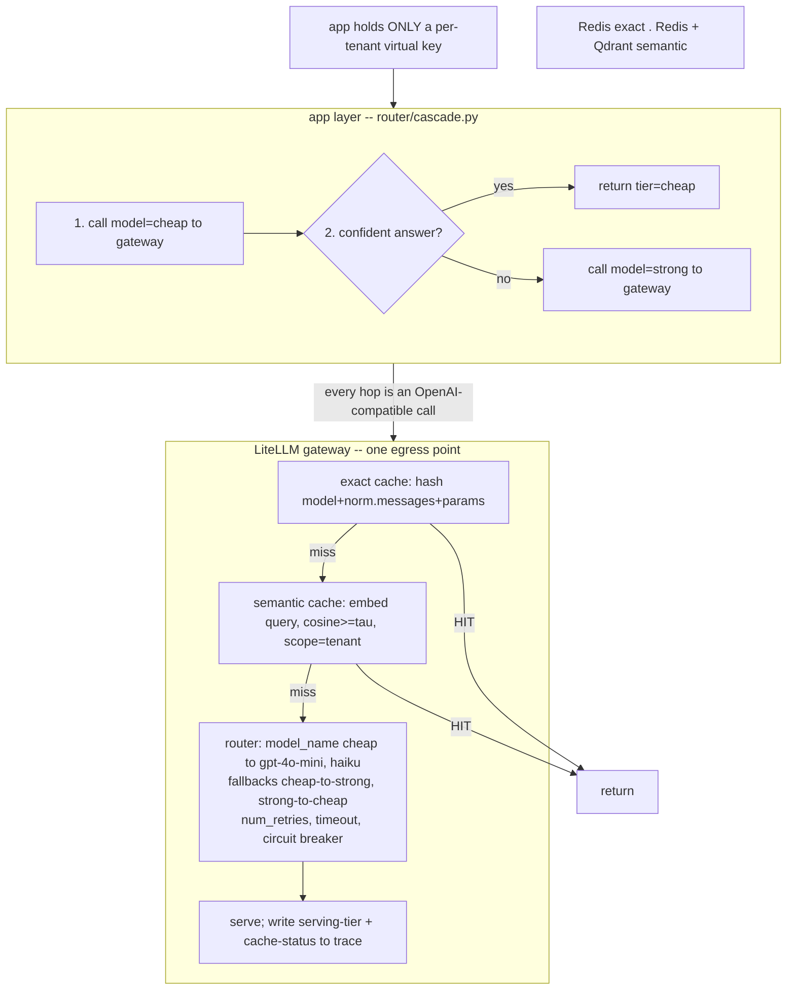

# Lecture: Reliability & Cost — Fallback vs Cascade, Exact vs Semantic Cache

> Your capstone gateway (Week 3) is one egress point for every model call. That single choke point is where two orthogonal problems get solved: *staying up* when a provider dies, and *not overpaying* when a frontier model answers a question a cheap one could. This lecture is the design note for wiring both — plus a caching layer — without letting them mask each other's failures. After it you can lay out a gateway config that turns a provider outage into a shrug, an app-layer cascade that cuts 50-80% of spend, and a two-tier cache that saves money without leaking one tenant's answer to another.

**Prerequisites:** Phase 09 L6-L7 (gateway/router, fallback + circuit breakers), Phase 09 L10 (caching layers), Phase 10 L9 (deploy break-even), Phase 01 L12 (prompt caching), Capstone Week 1 (tenant isolation) · **Reading time:** ~18 min · **Part of:** Capstone Week 3

---

## The integration problem

By Week 3 you have a retrieval core (Week 1) and an acting agent (Week 2) that *work*. Now they have to work **under load, under outages, and under a CFO's spend review** — and all model traffic funnels through the single LiteLLM gateway you stood up in Step 0. That gateway is the natural home for four cross-cutting behaviors that are trivial to bolt on badly and expensive to get right:

1. **Fallback** — provider A errors/times-out/rate-limits, so the *same request* retries on provider B (or a second key).
2. **Cascade** — a cheap model answers first; you escalate to an expensive one only when the cheap answer is not good enough.
3. **Exact cache** — an identical request returns a stored answer instantly, for free.
4. **Semantic cache** — a *paraphrased* request returns a stored answer, for free — with a false-hit risk you have to actively contain.

The trap is treating these as one "make it cheaper and more reliable" knob. They are two axes with different owners, different failure modes, and different places in the stack:

- **Reliability axis (fallback + caching-as-degradation):** *gateway config.* Declarative, provider-agnostic, no app code changes.
- **Cost axis (cascade):** *application logic.* Needs a confidence signal you compute, so it lives in `router/cascade.py`, not in YAML.

Keep them distinct. Conflating "retry on another provider" with "escalate to a stronger model" is the single most common design error here, and it produces a system that silently burns budget while masking a broken primary.

---

## Architecture & how the pieces connect



Two things this diagram makes concrete:

- **Cascade lives *above* the gateway.** `cascade.py` decides *which logical model name* to send (`cheap` then maybe `strong`). It cannot live in gateway config because the escalation decision depends on inspecting the cheap answer — a `confident()` check the gateway has no notion of.
- **Fallback lives *inside* the gateway.** For a given logical model name (`cheap` = `[gpt-4o-mini, claude-3-5-haiku]`), the router transparently retries the *same request* on the next deployment when one errors. The app never knows a fallback happened — which is exactly why observability (below) is non-negotiable.

The caches sit in front of the router, checked in order (exact → semantic → live call). This mirrors Phase 09 L10's layered-cache model: cheapest/safest check first.

---

## Key decisions & tradeoffs

### 1. Fallback: ordered lists, declared once

Fallback is a reliability control, and its whole value is that it is *boring*. You declare ordered lists per logical model in `router_settings.fallbacks` and you're done:

```yaml
router_settings:
  fallbacks: [{"cheap": ["strong"]}, {"strong": ["cheap"]}]
  num_retries: 2
  timeout: 30
```

The design decisions:

- **What counts as a failure?** Timeouts, 5xx, and 429 rate-limits are retriable on another provider. A 400 (bad request) or a content-policy refusal is *not* — retrying the same malformed request on provider B just wastes a second call. LiteLLM distinguishes these; make sure your config only falls back on the retriable classes.
- **Second key vs second provider.** A same-provider second key survives a per-key rate-limit but *not* a provider-wide outage. A different provider survives both but introduces answer-shape drift (different models, different formatting). List a second key first, then a different provider — cheapest escape first.
- **Pair with a circuit breaker (Phase 09 L7).** A fallback chain with no breaker eats a full timeout on the dead primary *for every request* before falling back. The breaker makes the fallback fast by marking a persistently-failing provider ineligible. Fallback = per-request rerouting; breaker = cross-request eligibility. You need both.

Fallback turns a provider outage from a 2am incident into a line in a dashboard — *if* you can see it happened.

### 2. Cascade: cheap-first, escalate on a signal

Most enterprise traffic — FAQ, classification, short RAG answers, routing — is *over-served* by a frontier model. FrugalGPT (the canonical framing; search "FrugalGPT LLM cascade") showed that a tuned cascade of increasingly-capable models matches frontier quality at a fraction of the cost, because most queries never need the top tier. The RouteLLM project (`lm-sys/RouteLLM`) takes the next step: a *learned* router that predicts, per query, whether the cheap model will suffice — skipping the escalation round-trip entirely.

Your capstone version is the simple, honest one: run cheap, check confidence, escalate only if needed.

```python
def answer(messages, force_strong=False):
    if not force_strong:
        r = gw.chat.completions.create(model="cheap", messages=messages)
        text = r.choices[0].message.content
        if confident(text, messages):
            return text, "cheap"          # ← log this tier
    r = gw.chat.completions.create(model="strong", messages=messages)
    return r.choices[0].message.content, "strong"
```

The whole design rests on **what `confident()` is**, in ascending order of effort:

| Signal | How | Good for |
|---|---|---|
| Schema validation | Does the cheap output parse against the expected JSON/Pydantic schema? | Structured extraction, classification |
| Refusal/hedge regex | Does it contain "I'm not sure", "cannot determine", empty answer? | Q&A, RAG |
| Tiny LLM-judge | One cheap call: "is this answer complete and grounded? yes/no" | Open-ended answers |
| Logprobs | Low token-level confidence / high entropy on the answer span | When the provider exposes logprobs |
| Explicit tier | Caller passes `force_strong=True` for known-hard tasks | Compliance-critical paths |

**The trade you are accepting:** escalation adds latency (a second sequential call on the hard queries) and requires a confidence signal that is itself imperfect — a bad `confident()` either escalates everything (no savings) or escalates nothing (quality drops silently). Tune the signal against your Week 4 eval set and *report the cheap-vs-strong split %* so you can see it drift.

**Why cascade is app logic, not gateway config:** the gateway's fallback moves a request to another provider *on failure*. Cascade moves a request to a stronger model *on low confidence of a successful response*. The gateway can't compute "low confidence" — that's your validator inspecting content. Different trigger, different layer. Do not try to express a cascade as a fallback list; you'll get an escalate-on-error behavior that is neither.

### 3. Exact cache: always on, zero-risk

Key = hash of `(model, normalized messages, params)`. Normalization matters — strip trailing whitespace, canonicalize JSON key order — or trivially-different-but-semantically-identical requests miss. An exact hit is instant and free, and it *cannot* return a wrong answer because the inputs are byte-identical. Turn it on for everything (`cache: true` on Redis). It's the highest-leverage, lowest-risk win in the whole plane — huge for retries, system-prompt-heavy calls, and repeated dashboard queries.

### 4. Semantic cache: big savings, contained risk

Embed the incoming query; if cosine similarity to a prior cached query ≥ threshold, return that cached answer. This catches paraphrases ("what's the deductible?" vs "how much is my deductible?") that exact caching misses — real savings on FAQ traffic. But it can return the *wrong* answer for two similar-*looking* queries with different correct answers (false hit). Treat these four rules as **hard design constraints**, not tuning suggestions:

- **High threshold (0.90-0.95).** Lower thresholds trade correctness for hit-rate. When unsure, exact-cache only.
- **Scope PER TENANT.** The cache key namespace must include `tenant_id`. Tenant A's cached answer must *never* be a candidate for tenant B's query — that's a cross-tenant data leak, the cardinal sin from Week 1, reintroduced through the cache. Scope it or don't ship it.
- **NEVER cache tool/action calls.** Only cache *idempotent Q&A*. A cached `submit_action` or a cached tool call means the second caller gets a stale result — or worse, an action that should have re-executed silently doesn't. Cache reads, never writes.
- **TTL everything.** Underlying documents change; a cached answer goes stale. Set a TTL matched to how fast the corpus churns.

Backing store: **Redis** for exact, **Redis + Qdrant** for semantic (Qdrant holds the query embeddings for the cosine search). This reuses the Qdrant you already run for retrieval.

---

## How it fails in production & how to prevent it

- **Silent primary outage (the classic).** Fallback works so smoothly that you run for weeks on the expensive backup provider, paying double, and never notice. **Prevention:** alert on *breaker-open / fallback-fired*, not on total failure. Log the serving deployment on every request. A fallback you can't see is an outage you're paying for.
- **Cascade that silently degrades quality.** A too-loose `confident()` returns cheap answers that are subtly wrong; no error fires, evals aren't watching, quality erodes. **Prevention:** log the serving tier per request, track the cheap/strong split as a metric, and gate `confident()`'s threshold on your Week 4 eval CI so a regression fails the build.
- **Semantic-cache false hit / cross-tenant leak.** Threshold too low, or cache not tenant-scoped → wrong answer, or tenant A's answer served to tenant B. **Prevention:** threshold ≥ 0.90, tenant in the key, TTL, and a test that fires tenant B's paraphrase and asserts it never returns tenant A's cached content.
- **Cached action call.** A `submit_action` result gets cached and replayed. **Prevention:** exclude non-idempotent call types from *both* caches at config level; assert it in a test.
- **Streaming bypasses the plane.** Streaming a provider SDK directly from the Next.js route skips gateway caching/limits/fallback. **Prevention:** always stream *through* the gateway's OpenAI-compatible endpoint (Week 3 Step 4 already routes the Vercel AI SDK at the gateway).
- **Fallback masks a broken primary that's returning garbage, not errors.** A provider that returns 200 with degraded output won't trip an error-based fallback. **Prevention:** this is what your eval gate and quality signals are for — reliability controls catch *errors*, not *quality*; keep the two monitored separately.

---

## Checklist / cheat sheet

**Fallback (gateway config):**
- [ ] Ordered `fallbacks` list per logical model; second key before second provider.
- [ ] Fall back only on retriable classes (timeout/5xx/429), never on 400/policy-refusal.
- [ ] Circuit breaker in front so a dead provider is skipped, not timed-out (Phase 09 L7).
- [ ] Serving deployment logged on every request; alert on fallback-fired / breaker-open.

**Cascade (app logic):**
- [ ] `cheap` first, escalate to `strong` only on low `confident()`, validator fail, or explicit tier.
- [ ] `confident()` chosen from: schema validation → refusal regex → tiny judge → logprobs.
- [ ] Serving tier logged; cheap/strong split % reported and watched for drift.
- [ ] Escalation-latency budget acceptable for the hard-query fraction.

**Exact cache:** always on · normalize inputs before hashing · Redis · zero-risk.

**Semantic cache:** threshold 0.90-0.95 · **key includes tenant_id** · idempotent Q&A only, **never** tool/action calls · TTL · Redis + Qdrant.

**One-line mental model:** *Fallback keeps you up (config). Cascade keeps you cheap (code). Exact cache is free money. Semantic cache is free money with a leash.*

---

## Connect to the build

This lecture backs three of Week 3's Definition-of-Done bullets directly:

- **Degradation proof** (`test_degradation.py`): force the primary provider to fail; requests still succeed via fallback provider or cache, and a repeat query is served from cache at ~0 cost/latency. The trace shows the fallback and the cache hit — because you logged the serving tier.
- **Cascade works:** a trace shows an easy query served by `cheap` and a hard one escalating to `strong`; you report the split over the eval set.
- **Caching measured:** a repeat query is an exact-cache hit; a paraphrase hits semantic cache only above threshold and *never crosses tenants*.

It also feeds the final milestone's `docs/cost-latency.md` (cache-hit savings, cost per resolved query) and `docs/tradeoffs.md` (why this threshold, why this confidence signal, what escalation latency cost you).

---

## Going deeper (optional)

- **FrugalGPT** — Chen, Zaharia, Zou, 2023. Search "FrugalGPT LLM cascade paper" — the canonical cost-cascade result and the LLM-cascade framing.
- **RouteLLM** — `lm-sys/RouteLLM` on GitHub — learned routers that predict cheap-vs-strong per query, skipping the escalation round-trip.
- **LiteLLM docs** — "litellm docs proxy" — reliability (fallbacks/retries/timeouts), caching (Redis exact + Redis/Qdrant semantic), and virtual keys.
- **Phase 09 L7** (fallback chains + circuit breakers) and **Phase 09 L10** (caching layers) in this study plan — the first-principles mechanics this lecture assumes.
- **Phase 01 L12** (prompt caching) — provider-side KV-cache reuse, a *different* cache from the gateway response caches here; know both exist.

---

## Check yourself

1. A request times out on OpenAI and succeeds on Anthropic; a second request gets a weak, hedging answer from the cheap model and is re-run on the strong model. Which of these is fallback and which is cascade, and in which layer of your stack does each decision get made?
2. Your semantic cache has a 0.85 threshold and its key is `hash(query_embedding)`. Name the two independent things wrong with this and the failure each one causes.
3. Your primary provider has been down for three hours, fallback has carried every request to the pricey backup, and no alert fired. What did you fail to instrument, and what specifically should the alert trigger on?
4. Give three concrete `confident()` implementations in ascending order of cost, and state the one thing a bad `confident()` does to your spend or your quality.
5. Which call types must you exclude from both caches, and why is caching one of them a correctness bug rather than just a stale-data annoyance?

### Answer key

1. **Fallback** = the OpenAI→Anthropic reroute of the *same request on error*; it happens **inside the gateway** (router config). **Cascade** = the cheap→strong re-run *on a low-confidence answer*; it happens in **app logic** (`router/cascade.py`), because only the app can inspect the answer and compute confidence. Different trigger (error vs low confidence), different layer.
2. (a) **Threshold too low (0.85):** two similar-looking queries with different correct answers collide → false hit, wrong answer served. Raise to 0.90-0.95. (b) **Key omits tenant_id:** tenant A's cached answer becomes a candidate for tenant B's query → cross-tenant leak, a security-boundary violation. Scope the key per tenant.
3. You failed to **log the serving deployment/tier on each request** and to **alert on fallback-fired / circuit-breaker-open**. The alert must trigger on the *breaker opening or fallback firing* — not on total failure, because the system is succeeding (expensively) the whole time. A fallback you can't see is an outage you're paying for.
4. In ascending cost: **schema validation** of the cheap output → **refusal/hedge regex** → **tiny LLM-judge call**. A bad `confident()` either escalates almost everything (you lose the cost savings) or escalates almost nothing (quality silently degrades because wrong cheap answers pass the check).
5. **Tool/action calls (non-idempotent writes)** — e.g. `submit_action`. Caching a read just risks staleness; caching an *action* means the operation that should have executed a second time silently doesn't (or a stale result is replayed as if fresh), which is a correctness/side-effect bug, not just stale data. Cache idempotent Q&A only.
