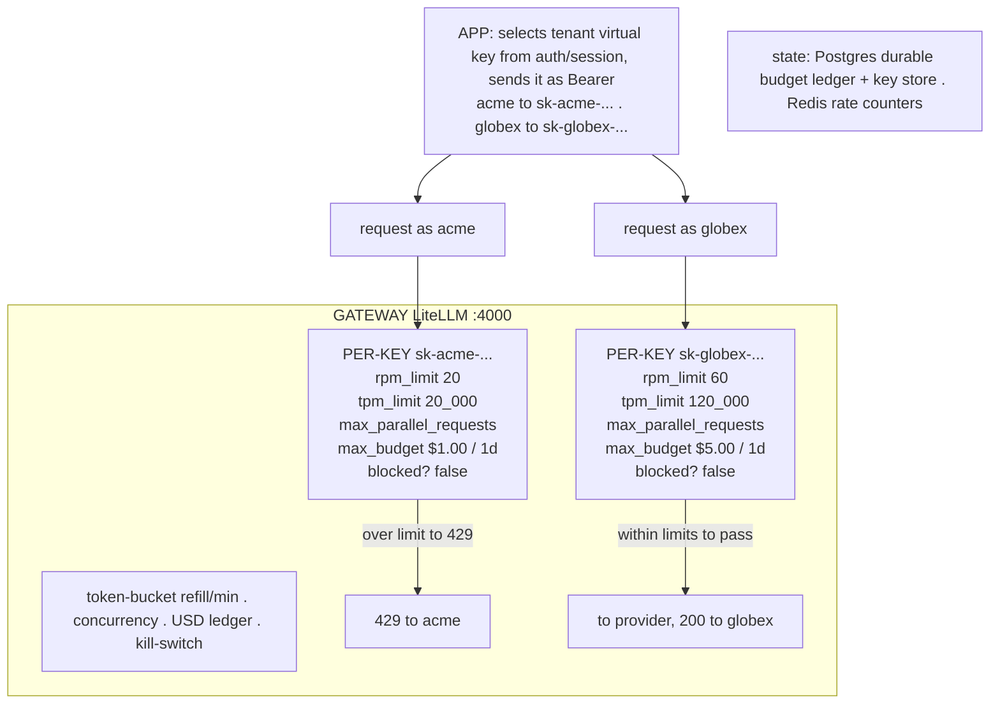

# Lecture: Multi-Tenant Fairness — Per-Tenant Quotas, Spend Caps & Kill-Switch

> Your capstone now serves two-plus tenants through one gateway (L9) with fallback and caching wired (L10). But a shared egress point is also a shared *blast radius*: one tenant looping a bad script, or one tenant getting DDoS'd, can drain the provider quota and the monthly budget that every other tenant depends on. This lecture is the design note for the week's core Definition of Done — making one tenant's abuse hit *its own* ceiling, not the shared one. After it you can key three independent defenses (RPM/TPM limits, USD spend caps, an instant kill-switch) to a per-tenant virtual key, explain precisely why you need all three and not a subset, and design a *measured* fairness proof rather than an eyeballed one.

**Prerequisites:** Phase 09 (rate-limiting & spend governance — L11; gateway/router — L6; bulkhead/isolation — L9), Phase 10 (multi-tenancy & noisy-neighbor — L12), Capstone Week 1 (tenant isolation as a security boundary), Capstone Week 3 L9 (the gateway as single egress), L10 (fallback/cascade/cache) · **Reading time:** ~15 min · **Part of:** Capstone Week 3

---

## The integration problem

Tenant isolation showed up first in Week 1 as a *security* boundary: tenant A must never *read* tenant B's data, enforced in the vector-store query itself. This lecture is the same word — isolation — pointed at a different resource. Here the shared resource being contended for isn't *data*, it's **capacity and money**: your provider RPM/TPM quota, your provider concurrency, and your monthly USD budget. Tenant A must never *starve* tenant B of those.

This is the **noisy-neighbor problem**, and it is not hypothetical. Concrete ways one tenant wrecks the shared plane:

- A tenant's integration ships a bug that retries a failed call in a tight `while` loop — hundreds of requests per second against your gateway.
- A tenant's public-facing chat endpoint gets scraped or DDoS'd; the traffic lands on your gateway as that tenant's legitimate-looking calls.
- A tenant discovers they can paste a 180k-token document into every request; each call is cheap in *count* but enormous in *tokens* and *dollars*.

In a naive shared system all three drain the same finite pools. Your provider account has a global RPM/TPM ceiling; hit it and *every* tenant starts getting `429`s from the provider. Your monthly budget is one number; burn it on tenant A and tenant B's calls fail when the account is suspended. The single-egress design from L9 is what *makes this fixable* — because all traffic funnels through one door, that door is the one place you can meter and cap per tenant. But the gateway doesn't give you fairness for free; you have to configure it.

The mental model to carry through the rest of this lecture:

> **Isolation by default, fairness by quota.** Every tenant is walled off from every other by a virtual key, and each key carries its own budget of capacity and money. One tenant exhausting *its* allocation is a non-event for the others.

The DoD stated as a testable invariant:

> **Hammer tenant `acme` past its RPM or budget → `acme` gets `429`/degraded, while tenant `globex`, issued in parallel, keeps returning `200`. Flip the kill-switch on `acme` → instant block, `globex` unaffected. Both are measured, not asserted by eye.**

---

## Architecture & how the pieces connect

The fairness controls all hang off the **per-tenant virtual key** — the same key the app already selects per request (L9). One key per tenant is the pivot: it's simultaneously the identity, the rate-limit bucket, the budget ledger, and the kill-switch target.



**Three defenses, one key, each keyed independently:**

1. **RPM/TPM token-bucket limits (`rpm_limit`, `tpm_limit`).** A [token bucket](https://en.wikipedia.org/wiki/Token_bucket) per key refills at the configured rate per minute; a request that would exceed the bucket is rejected with `429` *before* it reaches a provider. RPM caps request *count*; TPM caps token *throughput*. These bound the rate at which a tenant can consume capacity.

2. **`max_parallel_requests` — concurrency cap.** Distinct from RPM: this bounds how many of a tenant's requests can be *in flight simultaneously*, protecting your provider *concurrency* pool (the bulkhead pattern from Phase 09 L9). A tenant firing 50 slow, long-context calls at once can exhaust provider concurrency without ever tripping a per-minute count; the parallelism cap is the wall for that.

3. **Daily/monthly USD spend caps (`max_budget` + `budget_duration`).** A running cost ledger per key. Once cumulative spend in the window exceeds `max_budget`, the gateway returns a hard `429` until the window rolls over. This is the *money* boundary, orthogonal to the *rate* boundary.

4. **The kill-switch (`/key/block`).** An out-of-band, instant disable of a virtual key. Not a limit that trips on a threshold — a manual switch for the "it's happening right now" case. `/key/unblock` restores.

**Minting the keys (Step 1 of the lab).** The app never holds provider keys; it holds one virtual key per tenant, minted via the admin API against the `master_key`:

```bash
# acme: tight budget + limits — this IS the fairness control, not a suggestion
curl http://localhost:4000/key/generate -H "Authorization: Bearer sk-master-CHANGeME" \
  -H "Content-Type: application/json" -d '{
    "key_alias":"acme",
    "rpm_limit":20, "tpm_limit":20000, "max_parallel_requests":5,
    "max_budget":1.00, "budget_duration":"1d",
    "metadata":{"tenant":"acme"}}'
# repeat for globex with its own, larger allocation → tenants isolated by key
```

**The app's job at request time** is small and it is the linchpin: read the authenticated tenant from the session/auth context, look up *that tenant's* virtual key, and send it as the `Authorization: Bearer` on the gateway call. The tenant identity → key mapping must come from trusted auth, never from a client-supplied field — otherwise tenant A claims to be globex and spends globex's budget. This is the same "identity rides the call" discipline as the OAuth scopes in Week 2.

**Where state lives.** Budget ledgers are *durable* — Postgres (the `database_url` you wired in L9). A budget that resets to zero on a proxy restart is not a budget; a tenant could bankrupt you by triggering restarts. Rate-limit counters live in Redis (short-lived, per-window). This is the storage-tier split from L9 applied to fairness state.

---

## Key decisions & tradeoffs

**The load-bearing decision: you need BOTH rate limits AND a USD budget — a subset is a hole.** This is the pitfall the DoD is built around, so internalize *why* each alone fails:

- **RPM/TPM alone doesn't stop budget burn.** A tenant well under 20 RPM can still bankrupt you by sending 20 requests a minute each stuffed with a 180k-token context against a frontier model. Twenty requests is trivially within the rate limit; the *dollars* are enormous. Rate limits bound frequency, not cost. Without a spend cap, a slow trickle of huge-context calls drains the budget while every rate counter reads green.
- **A spend cap alone lets a tight loop exhaust concurrency.** Suppose only `max_budget` is set. A tenant's runaway retry loop fires thousands of tiny requests per second. Each is nearly free, so the *daily budget* takes a long time to trip — but in the meantime that flood saturates your provider's concurrency and RPM quota, and *every other tenant* gets provider-side `429`s. The budget cap is a rear-guard that fires too late to protect capacity.
- **Neither limit handles "it's happening live."** Both RPM and budget are *thresholds* — they trip when a boundary is crossed, and they reset (RPM per minute, budget per day). If a tenant is actively causing an incident right now and you need them *gone this second* regardless of where their counters sit, you need a switch, not a threshold. That's the kill-switch.

So the three defenses are not redundant — they cover three orthogonal axes: **frequency/throughput** (RPM/TPM + concurrency), **money** (budget), and **manual immediate stop** (kill-switch). Ship all three.

**`429` (hard reject) vs. degrade-to-cheaper.** When a tenant crosses a limit you have two responses. The default and simplest is a hard `429` — honest, cheap, and it makes the fairness proof unambiguous. An alternative is to *degrade*: route the over-limit tenant to the cheap/local model (Ollama) or serve from cache only, so they get *something* instead of an error. Degradation is nicer UX but muddier to prove and reason about; a degraded tenant is still consuming *some* capacity. Decision for the capstone: **hard `429` on budget exhaustion** (the money boundary is absolute), and either `429` or a documented degrade path on rate limits. The DoD phrase "`429`/degraded" allows either for rate; keep budget hard.

**Per-key limits (LiteLLM-native) vs. rolling your own limiter.** LiteLLM implements token-bucket RPM/TPM, `max_parallel_requests`, budgets, and block/unblock natively against the virtual-key store. Do not build your own — distributed rate limiting with a shared Redis counter, budget accounting across provider price tables, and window resets are subtle and solved (the same "don't rebuild the router" logic from L9). Your capstone's value is the *domain* system; the limiter is plumbing.

**Kill-switch as operations control, not code.** The kill-switch is deliberately *out-of-band*: `POST /key/block` from an operator's terminal or an admin UI, not a code path that trips automatically. This matters because the "it's happening now" scenario is exactly when you don't want to wait for a deploy or a threshold. Pair it with an alert (fallback-rate or budget-rate spike from L10's observability) so a human knows to reach for it. Tradeoff: a manual switch depends on a human noticing — so it complements, never replaces, the automatic limits.

**Budget granularity: per-tenant vs. per-tenant-per-model.** The simplest design is one budget per tenant. If different tenants pay for different tiers, you can mint keys with different `max_budget`/`rpm_limit` values (as in the diagram: acme gets $1/day, globex gets $5/day) — the virtual key *is* the plan. Finer-grained per-model budgets exist but add ledger complexity; start with one budget per tenant and split only if a real billing requirement demands it.

---

## How it fails in production & how to prevent it

**1. Only one control configured (the headline failure).** The most common mistake is setting RPM limits, feeling protected, and shipping without a spend cap — or vice versa. Re-read the tradeoffs above: each alone leaves a specific hole (huge-context budget burn; or tight-loop concurrency exhaustion). Prevention: treat "RPM + TPM + max_parallel + max_budget + kill-switch, all per key" as one atomic checklist item, and write the fairness test to attack *both* the rate axis (flood of small requests) and the budget axis (few huge-context requests).

**2. The fairness proof is eyeballed, not measured.** "I hammered acme and globex seemed fine" is not a proof — it's a vibe. The DoD demands `test_fairness.py` **green**: fire a burst at acme *and* a parallel stream at globex from the same test, and assert on the actual status-code distribution — acme returns `429`/degraded, globex stays `200`. Measure it:

```python
# tests/test_fairness.py (sketch)
import concurrent.futures as cf, httpx

def hit(key, n=100):
    codes = []
    with httpx.Client(base_url="http://localhost:4000/v1") as c:
        for _ in range(n):
            r = c.post("/chat/completions",
                       headers={"Authorization": f"Bearer {key}"},
                       json={"model":"cheap","messages":[{"role":"user","content":"hi"}]})
            codes.append(r.status_code)
    return codes

def test_noisy_neighbor_isolated():
    with cf.ThreadPoolExecutor() as ex:
        acme_f   = ex.submit(hit, ACME_KEY,   200)   # abuser: well past rpm
        globex_f = ex.submit(hit, GLOBEX_KEY,  10)   # victim: normal traffic
    acme, globex = acme_f.result(), globex_f.result()
    assert 429 in acme, "acme should hit its own ceiling"
    assert all(c == 200 for c in globex), "globex must be unaffected"  # the fairness claim
```

The second assertion is the whole point: globex's success rate is *independent* of acme's abuse. That independence is what per-key isolation buys.

**3. Budget state resets on restart.** If `database_url` isn't wired (L9), LiteLLM can't persist the budget ledger — a proxy restart zeroes every tenant's spend. A tenant (or a flapping container) that triggers restarts effectively gets an unlimited budget. Prevention: durable Postgres budget store, verified by restarting the proxy mid-window and confirming the counter survives.

**4. Kill-switch that isn't instant or isn't scoped.** Two sub-failures. If blocking a key requires a config edit + redeploy, it's not a kill-switch — the incident runs for minutes while you ship. Use the live `/key/block` API. And if you accidentally block at too coarse a level (the master key, or a shared key), you take down *every* tenant — the opposite of fairness. Prevention: one key per tenant (never a shared key), and test that `/key/block` on acme leaves globex returning `200` in the same breath as it `403`/blocks acme.

**5. Identity spoofing — the app trusts a client-supplied tenant.** If the app picks the virtual key from a request header or body field the client controls, tenant A sends `X-Tenant: globex` and spends globex's budget (and pollutes globex's rate counters, potentially starving the *victim*). The tenant→key mapping must derive from *authenticated* session/auth context only. This is the fairness-plane echo of Week 1's isolation rule and Week 2's "user's scopes ride the call."

**6. Retries amplifying the flood.** If your app (or the gateway's own `num_retries` from L10) retries on `429`, an abusive tenant's rejected requests get *re-sent*, multiplying load and defeating the limit. Prevention: do **not** retry on `429`/rate-limit rejections (only on 5xx/timeout, which is fallback's job); a `429` means "you're over your quota," and the correct client behavior is to back off, not hammer harder.

---

## Checklist / cheat sheet

- [ ] One **virtual key per tenant**, minted via `/key/generate`; app holds only these, never provider keys.
- [ ] Each key sets **all** of: `rpm_limit`, `tpm_limit`, `max_parallel_requests`, `max_budget` + `budget_duration`.
- [ ] Budget response on exhaustion is a **hard `429`**; rate-limit response is `429` or a documented degrade path.
- [ ] Budget ledger is **durable** (Postgres `database_url`); survives a proxy restart — verified.
- [ ] Rate counters in **Redis**; per-key, per-window.
- [ ] App selects the tenant key from **authenticated** session/auth — never a client-supplied field.
- [ ] **Kill-switch** verified: `/key/block <acme>` blocks acme *instantly*; globex still `200`; `/key/unblock` restores.
- [ ] **Do not retry on `429`** in app or gateway — retries amplify abuse. Retry only on 5xx/timeout (fallback).
- [ ] `test_fairness.py` **measures** the status-code split: acme `429`/degraded, globex `200`, run in parallel.
- [ ] Alert on budget-rate / fallback-rate spikes so a human knows to reach for the kill-switch.

---

## Connect to the build

This lecture is the design behind **Step 1** of the Week 3 lab (mint per-tenant virtual keys with budgets + limits + kill-switch) and the core Definition-of-Done item:

- *"Fairness proof (`test_fairness.py` green): tenant `acme` hammered past its rpm/budget receives `429`/degraded responses, while tenant `globex` issued in parallel keeps returning `200` — measured, not asserted by eye. Flipping the kill-switch on `acme` blocks it instantly; `globex` unaffected."*

It builds directly on **L9** (the single egress is what makes per-tenant metering possible at all; the virtual key and `database_url` were set up there) and sits beside **L10** — note the deliberate contrast: L10's *fallback* retries on provider *failure* (5xx/timeout), while this lecture's limits reject on tenant *abuse* (`429`), and the two must not be confused (don't retry a `429`). It also closes the loop with Week 1's isolation: same principle — isolation by default — applied to capacity and money instead of data. Downstream, the per-tenant cost numbers this produces feed the Week 4 observability dashboard ($/request per tenant) and the milestone project's unit-economics writeup (cost per tenant per month).

---

## Going deeper (optional)

Real, named resources — search these, don't trust invented URLs:

- **LiteLLM proxy docs** — `docs.litellm.ai` → "Virtual Keys", "Budgets", "Rate Limits" (`rpm_limit`/`tpm_limit`/`max_parallel_requests`), "Key Management" (`/key/generate`, `/key/block`, `/key/unblock`). Repo: `BerriAI/litellm`.
- **Token bucket algorithm** — search "token bucket rate limiting"; the refill-per-window mental model behind RPM/TPM.
- **Bulkhead & rate-limiting patterns** — search "bulkhead pattern microservices", "Stripe rate limiting blog" for the concurrency-isolation and per-key-limit reasoning at scale.
- **Portkey** — `portkey.ai/docs` → budgets & rate limits, for the managed-control-plane 1:1 mapping if you went that route in L9.
- Re-read **Phase 09 L11 (rate-limiting & spend governance)**, **L9 (bulkhead/isolation)**, and **Phase 10 L12 (multi-tenancy & noisy-neighbor)** — this capstone lecture is their integration into the serving plane, not a re-teach.

---

## Check yourself

1. A teammate argues "we set a 20 RPM limit per tenant, so we're protected from runaway spend — the budget cap is redundant." Give the concrete request pattern that stays under 20 RPM yet bankrupts the account, and the request pattern that a budget-only setup fails to stop in time.
2. Your `test_fairness.py` fires 200 requests as acme and 10 as globex in parallel and asserts `429 in acme_codes`. Why is that assertion *insufficient* on its own to prove fairness, and what's the second assertion that actually proves the noisy-neighbor claim?
3. It's happening live: a tenant's script is flooding the gateway right now and their budget won't trip for another hour. Which control do you reach for, why not the automatic limits, and what's the exact operation — and what must be true about your key setup for it not to take down other tenants?
4. Why must the budget ledger live in Postgres and not in the gateway's memory? Describe the exploit if it's in-memory.
5. An app developer adds `retry_on=[429, 500, 503]` to the gateway client "for robustness." Explain what this does to an abusive tenant's flood and which status codes are actually safe to retry.

### Answer key

1. **Under-20-RPM bankruptcy:** 20 requests/minute each carrying a ~180k-token context against a frontier `strong` model — trivially within the rate limit, but the token volume × price drains the daily budget fast. Rate limits bound frequency, not cost. **Budget-only failure:** a tight retry loop firing thousands of tiny (near-free) requests per second — each costs almost nothing so the daily budget trips slowly, but the flood saturates provider concurrency/RPM and gives *every other tenant* provider-side `429`s long before acme's own budget cap fires. Hence you need both axes.
2. `429 in acme` only proves acme *hit its own* ceiling — it says nothing about the *victim*. The whole fairness claim is *independence*: `assert all(c == 200 for c in globex_codes)` — globex's success rate is unaffected by acme's abuse. Without the globex assertion you haven't shown isolation, only that a limit exists.
3. Reach for the **kill-switch**: `POST /key/block {"key":"<acme-key>"}`. Not the automatic limits because RPM resets each minute and the budget won't trip for an hour — both are *thresholds* that leave the incident running; the kill-switch is an *immediate manual stop*. For it not to collateral-damage others, each tenant must have its **own** virtual key (never a shared key, never the master key) so blocking acme's key leaves globex's key untouched. `/key/unblock` restores acme once the abuse is resolved.
4. The budget ledger is durable state — cumulative spend in the window. If it lives in memory, a proxy restart zeroes every tenant's counter, so an attacker (or a flapping/OOM-killed container) that triggers restarts resets the budget repeatedly and effectively spends without limit. Postgres (`database_url`) persists the ledger across restarts, making the cap meaningful; Redis holds only the short-lived rate counters.
5. Retrying on `429` re-sends requests the gateway just rejected for being over-quota — it *amplifies* the abusive tenant's flood and defeats the rate limit (they hammer harder on every rejection). `429` means "back off," so the client must **not** retry it. Only transient server-side failures — `500`/`502`/`503`/timeouts — are safe to retry, and that retrying is *fallback's* job (L10), aimed at provider outages, not tenant abuse.
