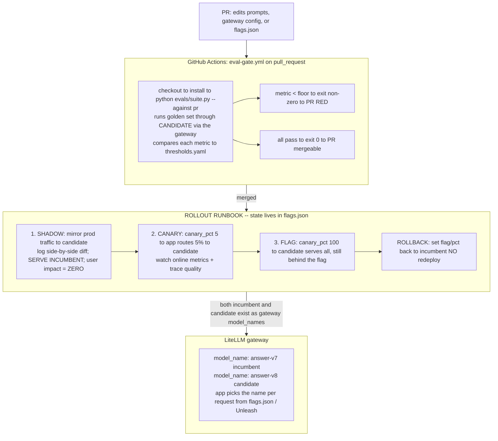

# Lecture: Safe Release — Eval-Gated CI/CD, Shadow → Canary → Flag & Rollback

> A prompt edit is a code change with no compiler and no type checker — it can regress silently and ship green. This lecture is the design note for the release plane that catches it: an eval gate that turns a bad prompt into a red PR, and a staged rollout (shadow → canary → feature-flag) where the candidate lives as *another gateway model_name* so rollback is a flag flip, not a redeploy. After it you can design a CI job that blocks a regression before merge, a runbook that promotes a change through three de-risking stages, and a rollback path that fires in seconds because it changes config, not code.

**Prerequisites:** Capstone L9 (gateway as single egress), L10 (fallback/cascade/cache), Phase 07 (offline eval, golden sets, LLM-judge calibration), Phase 10 (LLMOps, shadow/canary deploys), Capstone Week 1 (versioned golden set) · **Reading time:** ~19 min · **Part of:** Capstone Week 3

---

## The integration problem

By Week 3 your capstone has a gateway (L9) that every model call flows through, a cascade and cache (L10), and — from Phase 07 and Week 1 — a versioned golden set and a calibrated judge. Each piece works in isolation. The integration question this lecture answers is: **how does a change to a prompt or a model version reach users without a human eyeballing a demo and hoping?**

The core reframing that makes the whole plane fall into place:

> **Prompts and model versions are code that silently regresses.**

A code change that breaks a function fails a unit test and goes red. A prompt change that drops faithfulness from 0.92 to 0.78 does not throw. It compiles, it runs, it returns fluent, confident, *wrong* answers — and it looks fine in the one example the author happened to try. Provider-side model bumps are worse: `claude-3-5-sonnet` → a newer snapshot can shift behavior under you with no diff in your repo at all. If the only gate is human review of a diff, regressions ship by default.

So the deliverable is two coupled machines:

1. **A gate** — CI runs the eval suite against the *candidate* (the PR's prompt/model/config) and fails the PR if any gating metric drops below its threshold. A bad prompt cannot merge.
2. **A rollout** — a merged change is de-risked in stages (shadow → canary → flag) before it touches 100% of traffic, and can be reverted instantly.

The design constraint that makes rollback fast is architectural, and it is the thing to get right: **the candidate model/prompt must live as another gateway `model_name`**, selectable by config or flag. If switching versions requires editing app code and redeploying, your "rollback" is a build-and-deploy cycle measured in minutes-to-hours during an active incident. If it's a flag flip, it's seconds.

---

## Architecture & how the pieces connect



Two structural facts this diagram encodes:

- **The gate reuses the same eval harness as offline eval and CI in Week 4.** `evals/suite.py` is not a new thing — it is your Phase 07 / Week 4 golden-set scorer pointed at the *candidate* config. One harness, three callers: local dev, the PR gate, and the nightly scorecard. Do not fork a separate "quick CI eval" — a gate that scores something different from what you trust offline is a gate you don't trust.
- **The rollout has no code branch on version.** The app reads `flags.json` (or queries Unleash) for the active `model_name` and the `canary_pct`, then calls the gateway with that name. Promoting or rolling back is *data*, not a deploy. The two model names coexist behind the gateway (L9's single-egress principle is what makes this clean — the app never imports a vendor SDK, so a version is just a string).

---

## Key decisions & tradeoffs

### 1. The gate: what to run, where, and what fails the build

The gate is a CI job triggered on PRs that touch the release surface — prompts, router logic, `flags.json`, and the gateway config:

```yaml
on:
  pull_request:
    paths: ["prompts/**", "router/**", "flags.json", "gateway/litellm-config.yaml"]
```

It runs the golden set through the candidate and exits non-zero if any gating metric is below its floor. That non-zero exit is the whole point: it makes the check **required** in branch protection, so **a bad prompt physically cannot merge**.

Design decisions inside the gate:

- **Gate on a *set* of metrics, split by concern** (Phase 07): retrieval recall@k, faithfulness/groundedness, answer correctness, trajectory. A single blended score hides *which* capability broke. A prompt edit that improves correctness while tanking faithfulness must go red on faithfulness.
- **Gate on the CI lower bound, not the mean** (Week 4). With 50-300 cases your metric is a sample estimate. Assert that the *95% bootstrap CI lower bound* clears the floor, and for candidate-vs-baseline use a *paired* bootstrap and ship only if the gain CI's lower bound > 0. A 0.81 → 0.84 bump on 80 cases is noise; do not let it turn a gate green.
- **Also gate safety metrics** — a red-team exfil-blocked assertion belongs in the same build (Week 4). A quality improvement that regresses injection defense is not shippable.
- **Cost of the gate:** every PR now runs N golden cases through real (or local) models — seconds-to-minutes and possibly cents. That is the price of not shipping regressions; keep the gating set tight enough to stay fast and use a local/Ollama judge to keep it free where κ allows.

### 2. The rollout: three stages, each removing a different risk

Each stage exists to catch a class of failure the previous one can't:

| Stage | Traffic to candidate | User impact | What it de-risks |
|---|---|---|---|
| **Shadow** | 100% *mirrored* (candidate runs, incumbent is served) | **Zero** | Does the candidate crash / error / return malformed output on *real* traffic distributions the golden set didn't cover? |
| **Canary** | Small % *real* (5% served) | Small blast radius | Does online quality/latency/cost hold on live users? Catches what offline eval and shadow diffing miss. |
| **Flag** | 100% real, behind a flag | Full | Full cutover — but instantly reversible because the flag still exists. |

- **Shadow** mirrors production requests to the candidate, logs a side-by-side diff of candidate-vs-incumbent output, and **serves the incumbent**. The user sees the old, trusted answer; you get a free comparison on the real traffic distribution — the long tail your golden set never enumerated. Zero user impact is the defining property: shadow is where a candidate that throws on a weird real input reveals itself *before* anyone is served by it.
- **Canary** flips `canary_pct: 5`. Now 5% of *real* users get the candidate. This is the first stage with user impact, so the blast radius is deliberately tiny and you watch online signals (trace quality, faithfulness-by-release, p95 latency, $/request) before widening. Bump 5 → 25 → 100 as confidence grows.
- **Flag at 100%** is the full cutover — kept behind the flag so the rollback path stays live. Do not delete the flag the moment you hit 100%; leave it until the change has soaked.

### 3. Rollback: flip the flag, never redeploy

This is the decision that pays for the whole architecture. Because both versions exist as gateway `model_names` and the active one is chosen from `flags.json`/Unleash:

```json
{ "prompt_version": "v8", "canary_pct": 100 }   →   { "prompt_version": "v7", "canary_pct": 0 }
```

**Rollback = set the flag back to the incumbent.** No build, no image push, no redeploy, no cold start. In an incident that speed is the difference between a blip and an outage. Contrast with the anti-pattern where the prompt is hard-coded and rolling back means reverting a commit, waiting for CI, and redeploying — minutes you don't have while users get bad answers.

The **tooling decision** for the flag store:

- **`flags.json`** committed to the repo (or a config row): dead simple, versioned, reviewable, zero infra. Right for the capstone. The tradeoff is that changing it is still a commit/deploy of *config* unless you read it from a mounted volume or a config service at runtime.
- **Unleash** (OSS) or LaunchDarkly: a real flag service with runtime toggles, gradual rollout %, and targeting rules — flip from a UI with no deploy at all. Reach for this when "no redeploy" must be literally true and non-engineers need to pull the switch.

For the gate itself, the tooling decision is **GitHub Actions + promptfoo (`promptfoo/promptfoo`) or your Week-eval harness**. promptfoo gives you declarative test cases, assertions, and provider config out of the box; your own harness gives you the exact metrics and CIs you already compute. Prefer reusing your harness if it already produces the scorecard your offline eval trusts — one source of truth beats two.

---

## How it fails in production & how to prevent it

- **The flaky, non-deterministic gate (the one that kills the whole discipline).** An LLM-judge run at high temperature on a tiny golden set produces a metric that swings run-to-run. The same PR goes red, then green on re-run. Teams learn the gate is a coin flip and start clicking "re-run until green" — at which point the gate is theater. **Prevention:** pin the judge at **temperature 0**, size the golden set large enough that the CI is tight (50-300 cases, not 8), and set thresholds with a **margin** below your observed stable score so normal jitter never crosses the line. A trustworthy green is worth more than a strict one.
- **Gate scores something different from what you trust offline.** A separate "fast CI eval" drifts from the real harness; a green gate stops meaning "won't regress." **Prevention:** one harness, one golden version (pinned by hash, Week 1), invoked by both CI and offline runs.
- **Rollback requires a redeploy.** The version is hard-coded, so "instant rollback" is a build cycle. **Prevention:** candidate and incumbent both live as gateway `model_names`; the active one is a flag value, never code.
- **Shadow that has user impact.** Someone wires shadow to *serve* the candidate "just for a few requests." That is a canary, not a shadow, and it defeats the zero-impact guarantee. **Prevention:** shadow *mirrors and logs*; it never serves. Keep the serve path pinned to the incumbent in code review.
- **Skipping shadow because "the eval passed."** Offline eval covers the golden distribution; production has a long tail (odd encodings, huge contexts, adversarial inputs) the golden set never had. **Prevention:** shadow is where the tail shows up with zero risk — don't skip it to save a day.
- **Provider model bump with no diff.** `-latest` tags mean a provider can change the model under you with no PR to gate. **Prevention:** pin explicit model snapshots in the gateway config, and treat a snapshot bump as a change that goes through the gate and rollout like any other.
- **Flag deleted at 100%.** Once fully rolled out, someone removes the flag as cleanup — and the next incident has no fast rollback. **Prevention:** leave the flag until the change has soaked for a defined window; only then collapse it.

---

## Checklist / cheat sheet

**Eval gate (CI):**
- [ ] Triggers on PRs touching `prompts/**`, `router/**`, `flags.json`, gateway config.
- [ ] Runs the *same* harness as offline eval, against the *candidate*, on a hash-pinned golden version.
- [ ] Gates a *set* of metrics (retrieval, faithfulness, correctness, trajectory) + safety (red-team).
- [ ] Asserts on the **CI lower bound**, not the mean; paired bootstrap for candidate-vs-baseline.
- [ ] Judge pinned at **temperature 0**, golden set sized for a tight CI, thresholds with margin.
- [ ] Non-zero exit blocks merge (required check in branch protection).

**Rollout runbook:**
- [ ] **Shadow** — mirror traffic to candidate, log side-by-side diff, **serve incumbent**, zero user impact.
- [ ] **Canary** — `canary_pct: 5`, watch online quality/latency/cost, widen gradually.
- [ ] **Flag** — `canary_pct: 100`, kept behind the flag.
- [ ] **Rollback** — flip the flag / revert gateway config, **no redeploy**.

**Architecture invariant:** candidate + incumbent both exist as gateway `model_names`; active version is a flag value, never hard-coded.

**One-line mental model:** *The gate keeps regressions out of main (CI). The rollout keeps risk off users (shadow → canary → flag). Rollback is a flag flip because a version is just a config string.*

---

## Connect to the build

This lecture backs Week 3's CI/CD Definition-of-Done bullet directly:

- **CI eval gate blocks a bad prompt:** open a PR that intentionally degrades a prompt → CI goes **red** and merge is blocked; a good change passes and rolls out shadow → canary → flag with a demonstrated one-command rollback.

Concretely you'll wire `cicd/.github/workflows/eval-gate.yml` (runs `evals/suite.py --against pr --thresholds evals/thresholds.yaml`), write `cicd/rollout.md` as the shadow→canary→flag runbook, and drive stages via `cicd/flags.json` (`{"prompt_version":"v7","canary_pct":0}`). It leans on L9's gateway (candidate as another `model_name`) and Week 4's scorecard + CIs (the metrics the gate asserts on). In the final milestone it satisfies the Phase 10 acceptance bullet: a model/prompt change ships through a release path with an eval gate and a documented instant rollback, and it feeds `docs/tradeoffs.md` (why these thresholds, why this rollout depth).

## Going deeper (optional)

- **promptfoo** — `promptfoo/promptfoo` on GitHub, docs at `promptfoo.dev` — declarative eval/assertion config and a CI-friendly runner for prompt/model changes.
- **Unleash** — `Unleash/unleash` on GitHub, docs at `docs.getunleash.io` — OSS feature-flag service with gradual rollout % and runtime toggles.
- **Martin Fowler, "Feature Toggles (aka Feature Flags)"** — `martinfowler.com/articles/feature-toggles.html` — the canonical taxonomy (release/ops/experiment toggles) behind the flag-based rollout here.
- **GitHub Actions docs** — "using branch protection rules" and "required status checks" — how a non-zero eval exit becomes an un-mergeable PR.
- **Capstone L9 / L10** and **Phase 07 (eval, judge calibration) / Phase 10 (LLMOps, canary/shadow)** in this plan — the gateway, harness, and deploy mechanics this lecture composes.

## Check yourself

1. A teammate says "the eval passed in CI, just ship it to 100%." Name the class of failure shadow catches that the CI eval structurally cannot, and why serving zero users during shadow is the point.
2. Your eval gate goes red, then green on a re-run of the *same* PR with no code change. Diagnose the three things most likely wrong and give the one-line fix for each.
3. Someone hard-codes the active prompt version in the app and asks why rollback is "slow." What is the architectural fix, and what does rollback physically change once it's in place?
4. Distinguish shadow, canary, and flag by (a) what fraction of the candidate's traffic is *served* to users and (b) the specific risk each stage removes.
5. Why gate on the bootstrap CI lower bound instead of the mean, and give a concrete metric pair where a mean-based gate would wrongly pass a regressed change.

### Answer key

1. Shadow runs the candidate on the **real production traffic distribution** — the long tail (odd encodings, oversized contexts, adversarial/unusual inputs) that a curated golden set never enumerates — while **serving the incumbent**, so a candidate that crashes or emits malformed output on those inputs is exposed at **zero user impact**. The CI eval only covers the golden cases; it cannot cover inputs no one wrote down. Serving zero users is exactly what makes it safe to find those failures.
2. (a) **Judge temperature > 0** → nondeterministic scoring; fix: pin **temperature 0**. (b) **Golden set too small** → wide CI that straddles the threshold and flips sign run-to-run; fix: grow the set so the CI is tight. (c) **Threshold with no margin**, sitting right at the stable score; fix: set the floor with margin below observed stable performance so normal jitter never crosses it.
3. Fix: make the candidate and incumbent both exist as **gateway `model_names`** and select the active one from a **flag/config** (`flags.json` or Unleash), not code. Then rollback **flips the flag / reverts the gateway config** — it changes a config value, with **no rebuild and no redeploy** — instead of reverting a commit and running a full build-and-deploy cycle.
4. **Shadow:** 0% served (100% mirrored, incumbent served) — removes the risk of crashes/malformed output on real-traffic tails at zero user impact. **Canary:** a small % (e.g. 5%) *served* — removes online quality/latency/cost risk on live users with a tiny blast radius. **Flag at 100%:** all traffic served, behind the flag — full cutover whose remaining "risk removal" is that the flag keeps rollback instant.
5. With 50-300 cases a metric is a sample estimate with real uncertainty, so a mean can move on noise; gating on the **CI lower bound** (and a paired-bootstrap gain CI whose lower bound must exceed 0) means green only when the change is *reliably* above the floor. Concrete case: a candidate shows mean faithfulness 0.84 vs baseline 0.81 on 80 cases but the paired gain CI is (−0.01, +0.11) — a mean-based gate passes it, but the CI straddles 0, so it is within noise and a CI-based gate correctly withholds.
