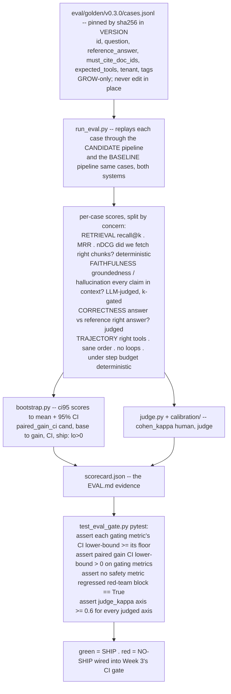

# Lecture: Eval as a Set — Metric Decomposition & the CI-Backed Ship Gate

> Every prior capstone week ended with a green test as its ship signal — recall@5 above a target, a delete proof, a fairness proof. Week 4 makes that discipline the *product's* release gate: whether your candidate build ships is decided by a function, not a meeting. This lecture is the design note for that function. It rests on three moves: eval is a **set of metrics split by concern**, not one score; the golden set is **versioned code+data** so a regression is attributable to the model, not an edited question; and the **confidence interval is the actual gate** — you ship only when the improvement's lower bound clears zero and no safety metric regressed. After it you can lay out `test_eval_gate.py`, decide which metrics gate versus monitor, and defend why a 0.81→0.84 jump on 80 cases is not a win.

**Prerequisites:** Phase 07 (eval metrics, LLM-as-judge, bootstrap basics) · Phase 04 L-retrieval (recall@k, MRR, nDCG) · Capstone Week 1 (golden set + recall gate, DVC versioning) · Capstone Week 3 L(CI eval gate, shadow→canary→flag) · **Reading time:** ~19 min · **Part of:** Capstone Week 4

---

## The integration problem

By Week 4 you have a system that *works on the happy path*: retrieval with citations (Week 1), an acting agent behind HITL (Week 2), a gateway that survives outages (Week 3). The question that decides whether this is a demo or a product is now on the table: **when you change a prompt, swap a model, or retune the reranker, how do you know the new build is actually better — and safe to ship?**

The naive answer is "run the eval, look at the number, ship if it went up." Every part of that sentence is a trap:

- **"The number."** A single accuracy score is a weighted average over capabilities that fail independently. If retrieval got worse but the generator got more fluent at bluffing over thin context, the blended score can *rise* while the product gets more dangerously wrong. One number hides which leg broke.
- **"Went up."** With 50-300 eval cases, your metric is a *sample estimate*. 0.81→0.84 on 80 cases is well inside the noise band of resampling those same 80 cases. You are reading tea leaves.
- **"Ship if."** A judgment call in a review meeting is not reproducible, not attributable, and not enforceable in CI. Next quarter, under deadline pressure, "it looks better" wins.

The integration problem for this lecture: turn "is the new build better and safe?" into a **deterministic, CI-runnable function** whose inputs are versioned artifacts and whose output is a boolean the pipeline trusts. Three subsystems have to click together — a *decomposed metric set* (so you know what broke), a *pinned golden set* (so the delta is attributable), and a *confidence-interval decision rule* (so the delta is real). Miss any one and the gate becomes theater.

---

## Architecture & how the pieces connect

Three things this diagram makes concrete:

- **The RAG triad plus an agent layer.** Retrieval → faithfulness → answer relevance is TruLens's *RAG triad*; the capstone adds a fourth concern because your system *acts*: **trajectory** (right tools, sane order, no loops, under step budget). A pure-RAG eval that omits trajectory would score a looping agent that burned its budget as "fine" because the final text was grounded.
- **Deterministic vs judged metrics take different paths.** Retrieval and trajectory metrics are computed from IDs and tool logs — cheap, exact, no model needed. Faithfulness and correctness require an LLM judge, which means they carry a *credibility tax*: a κ (Cohen's kappa) against human labels, reported next to the metric. The gate refuses to trust a judged axis whose κ < 0.6.
- **The gate reads only `scorecard.json`.** `test_eval_gate.py` never re-runs the pipeline; it asserts against a machine-readable artifact. That separation is what lets the *same* scorecard be your `EVAL.md` evidence, your dashboard input, and your CI verdict — one source of truth.

This slots directly onto Week 3's CI story: the eval gate that blocked a bad prompt PR *is* this function. Week 3 gave you the shadow→canary→flag rollout mechanics; Week 4 gives the gate the statistical spine that makes "green" trustworthy.

---

## Key decisions & tradeoffs

### 1. Split by concern — and decide which metrics *gate* vs *monitor*

Not every metric should block a ship. Draw an explicit line:

| Concern | Metrics | Role | Why |
|---|---|---|---|
| Retrieval | recall@k, MRR, nDCG | **Gate** | If you fetched the wrong chunks, nothing downstream can be right. Cheap and deterministic — no excuse not to gate. |
| Faithfulness / groundedness | claim-support rate | **Gate (safety)** | An ungrounded answer in a regulated domain is the failure mode. Never let this regress. |
| Answer correctness | match-to-reference | **Gate** if κ clears; else **monitor** | Judged, so it only gates on axes where the judge is trustworthy. |
| Trajectory | tool-set match, order, loop-free, step-budget | **Gate** | A right answer via a 12-step loop that called a forbidden tool is not a pass. |
| Latency / cost | p95, $/query | **Monitor** (or a separate SLO gate) | Regressions matter, but don't belong in the *quality* gate; they mislead if blended. |

The design principle: **gate on the small set of metrics whose regression means "broken or unsafe," monitor the rest.** A gate with 15 blocking metrics is a gate nobody can ship past — teams learn to disable it, which is worse than no gate. Faithfulness and any safety metric are non-negotiable gates; the rest earn their place by being both meaningful and stable.

Tooling: **Ragas** and **TruLens** give you RAG-triad metrics off the shelf; **DeepEval** ships G-Eval plus a pytest integration that maps cleanly onto `test_eval_gate.py`; **OpenAI Evals** is the registry-style harness. You do not need all four — pick the one whose pytest ergonomics fit, and compute the deterministic retrieval/trajectory metrics yourself (they're a few lines each).

### 2. Versioned golden set: grow, never mutate

Your eval is only trustworthy if *the questions don't change silently.* Treat `golden/` as code+data:

- **JSONL cases** with a fixed schema: `id`, `question`, `reference_answer`, `must_cite_doc_ids`, `expected_tools`, `tenant`, `tags`. The last three are what make the set gate-able — `must_cite_doc_ids` scores retrieval, `expected_tools` scores trajectory, `tenant` lets you slice per-tenant, `tags` let you slice by capability (`happy-path`, `coverage`, `adversarial`).
- **Pinned by content hash + semver dir.** `v0.3.0/cases.jsonl` plus a `VERSION` file holding `{"version":"v0.3.0","sha256":"..."}`. Every eval run records *which version it scored* into the scorecard. If the hash in the scorecard doesn't match the committed VERSION, the run is invalid.
- **Grow, never mutate.** To fix or change a question, add a new case or bump the version dir — never edit `cases.jsonl` in place. This is the crux: if a regression appears between two runs, it must be attributable to *the model/pipeline*, not to someone quietly rewording a question. Mutation destroys attribution, which is the entire value of the golden set.

Store it with **DVC** (the Week 1 default — content-addressed, `dvc.yaml` stages) or plain **git-LFS** if it stays small. Do *not* bake goldens into random notebooks; a golden set you can't diff is a golden set you can't trust.

**Tradeoff:** grow-only means the set accumulates cruft and can drift toward stale distributions. Mitigate with the Week 4 data flywheel — promote real production failures into new versions — and periodically *deprecate* (never delete) cases with a `tag:"retired"` so old scorecards remain reproducible.

### 3. Confidence intervals are the gate — and the paired bootstrap is what you actually want

With 50-300 cases, a metric mean is a point estimate wrapped in real uncertainty. Two separate questions, two separate tools:

- **"How good is this build, with what uncertainty?"** → **bootstrap** the metric: resample the per-case scores with replacement 10k times, take the 2.5th and 97.5th percentiles of the resampled means. That's your 95% CI.
- **"Is the candidate better than baseline?"** → **paired bootstrap** on the *difference*. Score the *same cases* through both systems, form per-case deltas `d_i = cand_i − base_i`, resample the deltas, and read the CI of the mean delta. Pairing cancels per-case difficulty variance — a hard question is hard for both systems — so the CI on the difference is far tighter than comparing two independent CIs. **Comparing whether two independent CIs overlap is the wrong test** and will make you miss real improvements; always pair.

The **ship rule, as a function:**

> Ship iff **(a)** for every gating metric, the paired-gain CI lower bound > 0 (a real, non-noise improvement or at minimum no regression on held metrics), **AND (b)** no safety metric regressed (faithfulness CI lower bound ≥ its floor; red-team exfil still blocked).

Concretely, `test_eval_gate.py` asserts each metric's CI lower-bound against a committed floor. Green means ship. That's the whole gate — a handful of asserts over `scorecard.json`.

**Tradeoff:** CIs shrink with √n, so a 60-case set gives wide intervals and a conservative gate that occasionally blocks real (but small) wins. That's the *correct* bias for a ship gate — false "no-ship" costs a re-run; false "ship" costs an incident. If you're systematically blocked by width, the fix is *more cases*, not a looser rule.

### 4. Calibrate the judge or its numbers are fiction

Faithfulness and correctness come from an LLM judge, which is biased (position, verbosity, self-preference) and drifts across model versions. The discipline (Phase 07): hand-label a ~50-100 case calibration set, run the judge on the same cases, compute **Cohen's κ**, and *only trust the judge on axes where κ ≥ ~0.6* — reporting κ next to every judge-derived metric in the scorecard. Pin the judge model + prompt version, and prefer **pairwise** (A vs B, position-swapped) over absolute 1-10 scoring, which is far less stable. A faithfulness=0.94 from an uncalibrated judge is worse than no number: it manufactures confidence.

---

## How it fails in production & how to prevent it

- **One blended score hides the broken leg.** Retrieval regresses, fluency rises, aggregate holds — you ship a build that bluffs confidently over worse context. **Prevention:** never gate on a blended score; gate each concern separately, and gate faithfulness *hardest*.
- **Point-estimate victory on noise.** 0.81→0.84 on 80 cases gets celebrated and shipped; it was resampling jitter. **Prevention:** the gate reads CI lower bounds, never means. If the paired-gain CI straddles 0, you did not improve.
- **Golden set edited in place.** Someone "fixes a typo" in a question; the next run's delta is now un-attributable — model change or question change? **Prevention:** hash-pin the set, assert the scorecard's `golden_version`/`sha256` matches the committed VERSION, grow-only, review golden diffs like code.
- **Uncalibrated judge.** faithfulness=0.94 reported with no κ; the judge actually agrees with humans at chance. **Prevention:** κ in the scorecard next to every judged axis; gate refuses axes with κ < 0.6; fall back to human/heuristic there.
- **Independent-CI overlap test instead of paired bootstrap.** You compare two wide, overlapping CIs, conclude "no difference," and discard a real win — or the reverse. **Prevention:** paired bootstrap on the same cases; read the CI of the *difference*.
- **Trajectory ignored.** The agent loops, calls a forbidden tool, blows the step budget — but the final text is grounded, so the RAG-triad-only eval passes it. **Prevention:** trajectory is a gating concern; score tool-set, order, loop-freedom, and step budget from the run trace.
- **Gate too strict → routed around.** Fifteen blocking metrics with tight floors means nothing ever ships and the team disables the gate. **Prevention:** minimal gating set (retrieval, faithfulness, trajectory, safety); everything else monitors.
- **Judge/model self-comparison bias.** The candidate *is* the judge model, so it prefers its own outputs. **Prevention:** pin a fixed judge distinct from the systems under test; position-swap pairwise comparisons.

---

## Checklist / cheat sheet

**Metric set (split by concern):**
- [ ] Retrieval: recall@k, MRR, nDCG — deterministic, **gate**.
- [ ] Faithfulness/groundedness — judged + κ-gated, **safety gate**.
- [ ] Answer correctness — judged, gate only if κ ≥ 0.6, else monitor.
- [ ] Trajectory: tool-set match, order, loop-free, under step budget — **gate**.
- [ ] Latency/cost — **monitor**, kept out of the quality gate.

**Golden set (code+data):**
- [ ] JSONL schema: `id, question, reference_answer, must_cite_doc_ids, expected_tools, tenant, tags`.
- [ ] Pinned by `sha256` in `VERSION`; semver dir (`v0.3.0/`).
- [ ] Scorecard records the version + hash it scored; gate asserts they match.
- [ ] **Grow-only** — new case or version bump to change anything; never edit in place. DVC/git-LFS.

**CI decision rule:**
- [ ] `ci95(scores)` = bootstrap 10k → mean + 95% CI per metric.
- [ ] `paired_gain_ci(cand, base)` = paired bootstrap on **same cases** → CI of the difference.
- [ ] Ship iff every gating metric's CI lower-bound ≥ floor **and** paired-gain lower-bound > 0 **and** no safety metric regressed.
- [ ] Judge κ ≥ 0.6 for every judged axis, reported in the scorecard.

**One-line mental model:** *A score tells you nothing; a set tells you what broke; a paired CI tells you if the fix was real. Green `test_eval_gate.py` is the only ship signal.*

---

## Connect to the build

This lecture is the theory spine under Week 4's Definition-of-Done bullets:

- **Scorecard** (`eval/scorecard.json`) records golden `version` + `sha256`; retrieval (recall@5, nDCG), faithfulness, correctness, trajectory — each with mean + 95% CI; the paired-bootstrap gain vs baseline with a boolean `ship`; and judge κ per judged axis.
- **`uv run pytest eval/ -q` green = ship.** `test_eval_gate.py` asserts each gating metric's CI lower-bound ≥ its floor and that safety held. This is the function, not a meeting.
- It plugs into **Week 3's CI eval gate** (the PR-blocking `eval-gate.yml`) and the **milestone's** `evals/report/` — every headline metric as point estimate + 95% CI with a paired test vs baseline, so you never celebrate a within-noise delta.

The `bootstrap.py` (`ci95`, `paired_gain_ci`) and the golden-set pinning script (`pin.py`) in the Week 4 Lab are the concrete implementations of everything above.

---

## Going deeper (optional)

- **Ragas** — `docs.ragas.io` — RAG-triad metrics (context recall, faithfulness, answer relevancy) with an eval-dataset abstraction.
- **TruLens** — `trulens.org` — the canonical "RAG triad" framing (context relevance → groundedness → answer relevance).
- **DeepEval** — `github.com/confident-ai/deepeval` — G-Eval judge plus a pytest-native gate that mirrors `test_eval_gate.py`.
- **OpenAI Evals** — `github.com/openai/evals` — registry-style eval harness for reproducible suites.
- **MT-Bench / "Judging LLM-as-a-Judge" (Zheng et al., 2023)** — search "MT-Bench LLM as a judge Zheng 2023" — the canonical bias taxonomy (position, verbosity, self-preference) and the case for pairwise comparison.
- **"An Introduction to the Bootstrap" (Efron & Tibshirani)** — the foundational text for the resampling method the ship gate rests on; for the paired case, search "paired bootstrap difference in means".
- **Phase 07** (eval metrics, LLM-as-judge calibration, bootstrap basics) and **Phase 04** (recall@k, MRR, nDCG mechanics) in this study plan — the first-principles material this lecture assumes.

---

## Check yourself

1. Your candidate beats baseline by +0.05 mean faithfulness on 60 cases, but the paired-bootstrap 95% CI on the gain is (−0.01, +0.11). Ship or not, and why?
2. Why is a *paired* bootstrap (same cases, both systems) the right tool for "is the candidate better?", and what specifically goes wrong if you instead check whether the two systems' independent 95% CIs overlap?
3. Someone fixes a typo in a golden question between two eval runs and the aggregate score drops 0.03. What can you now *not* conclude, and which design rule was violated?
4. Give the four concerns your metric set splits into, mark which you'd *gate* on versus *monitor*, and name the one metric that must never regress and why.
5. Your LLM judge shows κ = 0.42 on "answer correctness" but κ = 0.71 on "faithfulness." What do you do with each in the scorecard and the gate?

### Answer key

1. **Do not ship** (on faithfulness grounds). The mean gain is +0.05 but the 95% CI *straddles 0* (lower bound −0.01), so you cannot rule out that the candidate is no better — or slightly worse — on the exact metric that is a safety gate. The ship rule requires the gain CI lower bound > 0 on gating metrics; here it isn't. Either gather more cases to tighten the interval or keep iterating; a +0.05 mean on 60 cases is inside the noise band.
2. Pairing scores the *same cases* through both systems and works on the per-case difference `d_i = cand_i − base_i`, which **cancels per-case difficulty variance** (a hard question is hard for both), giving a much tighter CI on the difference. Checking whether two *independent* CIs overlap ignores that pairing: non-overlapping independent CIs is a stricter-than-necessary condition, so you'll **miss real improvements** (two wide overlapping CIs can still have a clearly-positive paired difference), and it's the statistically wrong comparison for a within-cases change.
3. You can **no longer attribute the 0.03 drop to the model/pipeline** — it could be the model *or* the edited question. Attribution is the entire point of the golden set, and the **grow-only / never-mutate-in-place** rule was violated. The fix: add a new case or bump the version dir instead of editing; the hash-pin (scorecard `sha256` vs committed VERSION) would have flagged the drift.
4. **Retrieval** (recall@k, MRR, nDCG) — gate; **faithfulness/groundedness** — gate; **answer correctness** — gate if judge κ clears, else monitor; **trajectory** (right tools, sane order, no loops, under step budget) — gate. Latency/cost — monitor. The metric that must **never regress is faithfulness/groundedness** (a safety gate): an ungrounded answer in a regulated domain is the core failure mode, so it blocks a ship regardless of how other metrics moved.
5. **Answer correctness (κ = 0.42):** below the ~0.6 trust threshold, so the judge disagrees with humans too often — do **not** gate on it. Report it in the scorecard flagged as untrusted (κ shown), and either fix the judge prompt/model or fall back to human/heuristic scoring on that axis before it can gate. **Faithfulness (κ = 0.71):** clears the threshold — **trust it, gate on it**, and report κ = 0.71 next to the metric so the number's credibility is visible.
