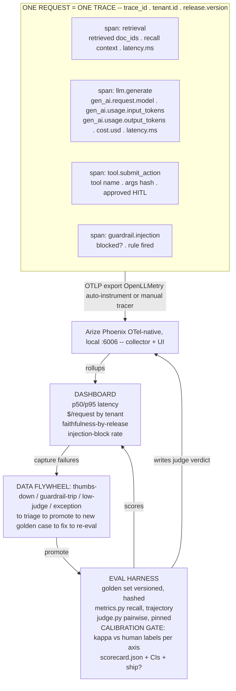

# Lecture: Calibrated Judges & OpenTelemetry Observability Rollup

> Your Week 4 ship/no-ship gate rests on two numbers you did not measure by hand: an LLM judge's quality scores and a dashboard's cost/latency rollups. Both are seductive and both lie by default — a judge is biased and drifts, and a dashboard built from logs instead of traces cannot tell you *why* a request was slow or wrong. This lecture is the credibility design note for making both trustworthy: calibrate the judge against humans and report the agreement next to every metric it produces, and instrument every request as one OpenTelemetry trace so cost, latency, and quality all fall out of the *same* span data. After it you can design an eval harness whose judge-derived numbers you'd defend to an auditor, and an observability plane you can actually debug an agent from.

**Prerequisites:** Phase 07 (eval metrics, LLM-as-judge, tracing basics), Phase 10 L-observability (OTel/spans, cost meter), Capstone Weeks 1-3 (retrieval, agent, gateway — the systems being traced) · **Reading time:** ~20 min · **Part of:** Capstone Week 4

---

## The integration problem

By Week 4 the system *works* end to end: retrieval with citations (Week 1), an acting supervisor under HITL and OAuth (Week 2), a gateway with fallback/cascade/caching (Week 3). The remaining question is the only one a reviewer, a CFO, or a compliance auditor cares about: **is it good, and can you prove it?** That question decomposes into two measurement subsystems that are each quietly untrustworthy:

1. **Quality measurement via an LLM judge.** You cannot hand-score every faithfulness and correctness call, so you delegate scoring to a model. But a judge is *cheap and scalable and biased* — it favors the first option shown (position bias), longer answers (verbosity bias), and outputs from its own family (self-preference) — and it **drifts** when you swap judge models or edit the judge prompt. An uncalibrated judge reporting `faithfulness = 0.94` is not a measurement; it is a number-shaped opinion. Report it as fact and you have manufactured false confidence — worse than no number at all.

2. **Cost/latency/quality measurement via observability.** You cannot debug an agent from logs. A multi-step run (retrieve → generate → tool call → guardrail check) is a *tree* of causally related operations; a flat log stream throws away the causal structure that tells you *which* span blew the p95 latency or burned the tokens. If your dashboard is built by grepping logs, you get counts, not forensics.

The integration insight for the capstone: **these are not two separate builds.** The judge produces per-case quality scores; the trace carries per-request cost and latency tagged by tenant and release. If both write into the *same* observability substrate — the judge's verdict as a span attribute, the trace's numbers rolled up by tenant — then eval, cost control, and incident forensics all read from one instrumentation. One trace answers "why was this slow," "what did this cost," and "was this faithful," at once. The design goal of this lecture is to make both measurement subsystems *earn their credibility* before you wire them into the ship gate.

> Reference, don't re-teach: Phase 07 covered *what* Cohen's kappa and OpenTelemetry spans are, and the RAG-triad metric taxonomy. This note is about the *decisions* — where to place the calibration boundary, which axes to trust, what a span must carry, and how the flywheel keeps the gate alive.

---

## Architecture & how the pieces connect

Three connections this diagram makes concrete:

- **The calibration gate sits *between* the judge and the scorecard.** No judge-derived number reaches `scorecard.json` without a kappa stamped next to it. Axes below threshold are quarantined — reported as "not trusted," or replaced by a human/heuristic score — never laundered into the headline metric.
- **Every measurement rides the same trace.** The judge's verdict is written back as a span attribute (`eval.faithfulness`, `eval.judge_kappa`), so "faithfulness-by-release" on the dashboard is literally a rollup over trace attributes. You do not maintain a second parallel quality database.
- **The flywheel closes the loop back onto the golden set.** Captured production failures (a guardrail trip, a low judge score, a thumbs-down, an exception — all already emitted as span events) become new golden cases. The gate is *living*: it grows harder as the system meets new failure modes.

---

## Key decisions & tradeoffs

### 1. Never trust an uncalibrated judge — the calibration boundary

The core discipline, in five steps:

1. **Hand-label a calibration set of ~50-100 cases** with human ground truth per axis (faithfulness pass/fail, correctness pass/fail). This is the only irreducibly manual step, and it is the point — it is what converts an opinion into a measurement.
2. **Run the judge on the exact same cases.**
3. **Compute agreement** against the human labels: **Cohen's kappa** for categorical (pass/fail) axes; **Spearman** or **Krippendorff's alpha** for scored (ordinal) axes. Kappa, not raw accuracy — because two labelers agreeing 90% of the time when the base rate is 90% "pass" is agreeing *by chance*, and kappa corrects for exactly that.
4. **Trust the judge only where kappa ≥ ~0.6.** That threshold is the conventional "substantial agreement" line. Below it, the judge is guessing relative to your humans on that axis.
5. **Report kappa next to every judge-derived metric** in the scorecard. `faithfulness = 0.91 (κ=0.71)` is a measurement. `faithfulness = 0.91` alone is a liability.

**The per-axis decision — this is the whole discipline in one table:**

| Axis | Kappa | Verdict | What you do |
|---|---|---|---|
| Faithfulness | 0.71 | Substantial agreement | **Trust it.** Report `faithfulness (κ=0.71)`, gate on it. |
| Correctness | 0.42 | Below threshold | **Do NOT report as fact.** Fall back to human/heuristic scoring on this axis, or fix the judge prompt and re-calibrate. Quarantine it out of the ship gate until κ clears 0.6. |

The trap: teams calibrate *one* axis, see κ=0.7, and declare "the judge is calibrated." Calibration is **per axis** — a judge can be excellent at faithfulness (a concrete "is every claim supported?" check) and hopeless at correctness (a fuzzy "is this right?" that needs domain knowledge the judge lacks). You must compute and report kappa for each axis independently.

### 2. Prefer pairwise (position-swapped) over absolute 1-10 scoring

Absolute scoring ("rate this answer 1-10") is notoriously unstable: the same answer scores 6 or 8 depending on the model's mood, the phrasing, and where the anchor examples sit. **Pairwise comparison** ("is A or B better?") is far more stable because it asks the model to do the thing LLMs are actually good at — a relative judgment — instead of calibrating to an invisible absolute scale.

But pairwise has its own bias: **position bias**, the tendency to favor whichever answer is shown first. The fix is mandatory and cheap: **run each comparison twice with positions swapped** (A-then-B and B-then-A). If the verdict flips when you swap, it was position bias, not signal — count it as a tie. Only consistent-across-swap verdicts count as a real preference. This single technique kills the most damaging judge bias for a doubling of judge calls.

The tradeoff: pairwise needs a *baseline* to compare against (you're measuring "candidate vs baseline," not "candidate in absolute"). That is fine for the capstone because the ship gate is already a *paired* comparison — is the candidate release better than the incumbent? Pairwise judging aligns naturally with the paired-bootstrap ship rule.

### 3. Pin the judge model AND the judge prompt version

A judge is a measuring instrument, and you do not silently swap out a caliper mid-experiment. **Pin both:**

- `JUDGE_MODEL = "llama3.1"` (or your chosen model + exact version tag)
- `JUDGE_PROMPT_VERSION = "faithfulness-v2"`

Record both in the scorecard alongside the kappa. **Why:** judges *drift* across model versions — a provider's silent model update, or your own prompt edit, changes the scores while the system under test is unchanged. If you can't attribute a metric move to (system change) vs (judge change), your eval is not a measurement, it is a coin flip. Pinning + versioning makes every score attributable. When you *do* upgrade the judge, you re-run the calibration set and confirm kappa holds — a judge change is a new instrument that must be re-certified.

### 4. Observability = tracing first, dashboards second

You cannot debug an agent from logs. A run is a causal tree; logs are a flat stream. The design decision is to make **tracing the substrate and the dashboard a derived view**, not the other way around.

- **OpenTelemetry** is the vendor-neutral standard; the **GenAI semantic conventions** define the attribute names so your spans are portable and tool-readable: `gen_ai.request.model`, `gen_ai.usage.input_tokens`, `gen_ai.usage.output_tokens`. Use the conventional names — don't invent `my_tokens` — so any OTel-aware tool (and your future self) can read them.
- **Auto-instrument with OpenLLMetry** (`traceloop/openllmetry`) to get spans around LLM/retrieval/tool calls for free, or set spans manually where you need custom attributes.
- **Collector + UI: Arize Phoenix** (`Arize-ai/phoenix`) — OTel-native, OSS, runs locally on `:6006`. It ingests OTLP and gives you the trace view and the rollup panels without standing up Grafana+Tempo+Prometheus (which is the heavier alternative if you want to unify with existing infra metrics).

**The span contract — every request is one trace; every operation is a span carrying the numbers:**

| Span type | Must carry |
|---|---|
| retrieval | retrieved `doc_ids[]`, `latency.ms`, `tenant.id` |
| model call | `gen_ai.request.model`, `gen_ai.usage.input_tokens`, `gen_ai.usage.output_tokens`, `cost.usd`, `latency.ms` |
| tool call | tool name, args hash, HITL-approved flag, `latency.ms` |
| guardrail check | blocked?, which rule fired |

Every span inherits `tenant.id` and `release.version` from the trace. This is what makes the rollups possible without a second data pipeline.

### 5. Roll up into a cost/latency/quality dashboard

Because the span data carries tokens, cost, latency, tenant, release, and (written back) the judge verdict, the dashboard is a set of rollups over one dataset:

- **p50 / p95 latency** — from `latency.ms` across spans (and end-to-end per trace). p95 is where the pain lives; a healthy p50 with an ugly p95 means a tail you'd never see in an average.
- **$/request by tenant** — sum `cost.usd` grouped by `tenant.id`. This is your unit economics, straight out of the traces.
- **faithfulness-by-release** — the judge verdict attribute grouped by `release.version`. This is how a quality regression shows up *before* users complain.
- **injection-block rate** — guardrail-span `blocked?` over total. A drop means a defense silently stopped firing.

The ordering matters: build tracing first (correct spans, right attributes), then the dashboard falls out. A dashboard built before the spans carry the right attributes is a dashboard of guesses.

### 6. The data flywheel — making eval a living gate

A golden set that never grows goes stale: the system learns to pass it, and new failure modes slip through. The flywheel keeps the gate alive:

**capture → triage → promote → fix → re-eval.**

- **Capture** the signals you already emit: a thumbs-down, a guardrail trip, a low judge score, an unhandled exception. These are span events; route them to a `flywheel/failures/` inbox.
- **Triage:** cluster and label — is this a retrieval miss, a generation hallucination, a tool misfire?
- **Promote:** turn a representative failure into a new golden case (bump `v0.3.0` → `v0.3.1`, never edit in place — see decision 7 in Week 4's golden-set discipline).
- **Fix** the underlying issue, then **re-eval** against the enlarged golden set.

Even a manual version (an inbox + a weekly `promote.py` run) counts. The point is that failures become tests, so the gate hardens toward the exact ways your system breaks in production.

---

## How it fails in production & how to prevent it

- **Uncalibrated judge reported as fact.** `faithfulness=0.94` with no κ manufactures false confidence and will survive right up until an auditor asks "measured how?" **Prevention:** the scorecard schema *requires* a κ field per judged axis; `test_eval_gate.py` asserts `judge_kappa[axis] >= 0.6` for every trusted axis, so a missing or low κ fails the build.
- **Calibrating one axis, trusting all.** κ=0.71 on faithfulness does not license reporting correctness. **Prevention:** compute κ per axis; quarantine any axis below 0.6 (fall back to human/heuristic) and label it "not trusted" in the scorecard rather than dropping it silently.
- **Judge drift after a silent model/prompt change.** Scores move while the system is unchanged; you chase a phantom regression. **Prevention:** pin `JUDGE_MODEL` + `JUDGE_PROMPT_VERSION`, record them in the scorecard, and re-run the calibration set on any judge change before trusting it.
- **Position bias masquerading as signal.** A pairwise judge that always prefers the first-shown answer produces a real-looking preference that is pure artifact. **Prevention:** always swap positions and count only consistent verdicts; flips are ties.
- **Dashboard built from logs, not traces.** You get counts but can't answer "which span was slow / expensive / unfaithful." **Prevention:** trace first — one trace per request, spans carrying the GenAI-convention attributes; the dashboard is a rollup, never the source of truth.
- **PII in span attributes.** You redact the prompt but pipe raw retrieved context into `span.set_attribute` — now your Phoenix store is a PII lake, a breach. **Prevention:** redact *before* `set_attribute`, not only before the model (this is the Week 4 security step's second call site — don't skip it in the trace path).
- **Cross-tenant rollup leakage.** A dashboard that aggregates across tenants without scoping can surface one tenant's cost/volume to another's view. **Prevention:** `tenant.id` on every span; scope dashboard queries per tenant, same isolation discipline as Week 1.
- **Stale golden set / dead flywheel.** Failures pile up in the inbox and never become tests; the gate stops catching new breakage. **Prevention:** a scheduled promotion step and a DoD bullet requiring at least one capture→promote→score cycle demonstrated.

---

## Checklist / cheat sheet

**Calibrated judge:**
- [ ] Calibration set of ~50-100 cases, hand-labeled per axis.
- [ ] Cohen's κ (categorical) / Spearman or Krippendorff (scored) computed **per axis**.
- [ ] Trust axis only if **κ ≥ ~0.6**; quarantine + fall back to human/heuristic otherwise.
- [ ] **κ reported next to every judge-derived metric** in the scorecard.
- [ ] Pairwise, **position-swapped** comparison; flips count as ties.
- [ ] `JUDGE_MODEL` + `JUDGE_PROMPT_VERSION` pinned and recorded; re-calibrate on any judge change.

**Observability (trace first):**
- [ ] One trace per request; one span per retrieval / model / tool / guardrail call.
- [ ] GenAI-convention attributes: `gen_ai.request.model`, `gen_ai.usage.input_tokens`, `gen_ai.usage.output_tokens`.
- [ ] Every span carries tokens, `cost.usd`, `latency.ms`, retrieved `doc_ids`, `tenant.id`, `release.version`.
- [ ] OpenLLMetry auto-instrument or manual tracer → OTLP → **Arize Phoenix** (local, OTel-native).
- [ ] **Redact PII before `set_attribute`**, not only before the model.

**Dashboard (rollup, second):**
- [ ] p50 / p95 latency · $/request by tenant · faithfulness-by-release · injection-block rate.
- [ ] Queries scoped per tenant.

**Flywheel:** capture (thumbs-down / guardrail-trip / low-judge / exception) → triage → promote to new golden version → fix → re-eval. Never edit goldens in place.

**One-line mental model:** *A judge is a measuring instrument — calibrate it, stamp its error bar (κ) on every reading, and pin the instrument. Trace the request as a tree so cost, latency, and quality all fall out of one dataset; the dashboard is a view, not the truth.*

---

## Connect to the build

This lecture backs several Week 4 Definition-of-Done bullets directly:

- **Human-calibrated judge:** `eval/calibration/kappa.py` computes κ against `human_labels.jsonl`; the scorecard stores κ per judged axis and `test_eval_gate.py` asserts every trusted axis ≥ 0.6. A κ=0.71 faithfulness axis ships; a κ=0.42 correctness axis is quarantined until fixed.
- **One OTel trace, readable:** open a trace in Phoenix (`:6006`) and confirm per-step `gen_ai.usage.*_tokens`, `cost.usd`, `latency.ms`, retrieved `doc_ids`, and tool calls, all tagged by `tenant.id`.
- **Dashboard rollups:** p95 latency, $/request per tenant, faithfulness-by-release — all rollups over the span data above.
- **Flywheel:** the DoD's "capture → promote → present and scored in the next golden version" loop.

It also feeds the milestone's `docs/cost-latency.md` (p50/p95, cost per resolved query, cost per tenant/month — pulled straight from trace rollups) and the eval report's requirement that every judge metric carry its calibration evidence.

---

## Going deeper (optional)

- **Zheng et al., "Judging LLM-as-a-Judge with MT-Bench and Chatbot Arena" (2023)** — search "MT-Bench LLM-as-a-judge Zheng 2023" — the canonical bias taxonomy (position, verbosity, self-preference) and the pairwise-vs-absolute evidence.
- **OpenTelemetry GenAI semantic conventions** — search "opentelemetry gen_ai semantic conventions" — the authoritative attribute names (`gen_ai.request.model`, `gen_ai.usage.*_tokens`).
- **OpenLLMetry** — `traceloop/openllmetry` on GitHub — OTel auto-instrumentation for LLM/RAG/agent stacks.
- **Arize Phoenix** — `Arize-ai/phoenix` on GitHub — OTel-native local collector + trace UI + eval rollups.
- **Cohen's kappa & Krippendorff's alpha** — search "cohen kappa interpretation Landis Koch" for the substantial-agreement (≥0.6) convention; `scikit-learn` `cohen_kappa_score`.
- **DeepEval G-Eval** — `confident-ai/deepeval` — a reasonable default judge with pytest integration, to pair with your own calibration.
- **Phase 07** (eval metrics + LLM-as-judge + tracing) and **Phase 10** (observability + cost meter) in this study plan — the first-principles mechanics this note assumes.

---

## Check yourself

1. Your judge shows κ=0.71 on faithfulness and κ=0.42 on answer-correctness on the same calibration set. What do you do with each metric in the scorecard, and why is doing the same thing to both wrong?
2. Why is Cohen's kappa the right agreement statistic instead of raw percentage agreement between the judge and your human labels?
3. You switch your judge from `llama3.1` to a newer model and your faithfulness metric jumps from 0.88 to 0.93 with no change to the system under test. What happened, and what should you have done before trusting the new number?
4. A teammate builds the cost/latency dashboard by parsing the application log files. Name two questions the dashboard *cannot* answer that a trace-first design answers trivially, and state the general rule.
5. You redacted PII from every prompt before it hits the model, but a security review still finds SSNs in your observability store. Where did the leak happen and what is the fix?
6. Walk the data flywheel for a single production failure: a user thumbs-downs an answer that a guardrail didn't catch. Trace it from capture to the next eval run.

### Answer key

1. **Faithfulness (κ=0.71 ≥ 0.6): trust it** — report `faithfulness (κ=0.71)` and gate on it. **Correctness (κ=0.42 < 0.6): do not report as fact** — quarantine the axis, fall back to human or heuristic scoring, or fix the judge prompt and re-calibrate; label it "not trusted" in the scorecard. Treating both the same is wrong because calibration is **per axis**: the judge agrees with humans on the concrete faithfulness check but is essentially guessing on the fuzzier correctness judgment, so one number is evidence and the other is noise.
2. Raw percentage agreement is inflated by the **base rate**: if 90% of cases are "pass," a judge that blindly says "pass" agrees 90% of the time while carrying zero information. **Kappa corrects for chance agreement**, so it measures agreement *beyond what you'd get by guessing the base rate* — the only agreement that means the judge is actually tracking the label.
3. The **judge drifted** — a different model is a different measuring instrument, so the metric moved even though the system didn't. You cannot attribute the +0.05 to the system vs the instrument. Before trusting it you should have **re-run the calibration set on the new judge and confirmed κ still clears 0.6** (re-certified the instrument), and re-pinned `JUDGE_MODEL`/`JUDGE_PROMPT_VERSION`. Until then the new number is not comparable to the old one.
4. It cannot answer **"which span/step caused the p95 latency (or the token/cost spike) on this slow request?"** and **"for this specific bad answer, what doc_ids were retrieved and which tool calls fired?"** — because logs are a flat stream that discards the causal tree structure of a multi-step run. General rule: **trace first, dashboard second** — a request is a tree of causally linked spans; the dashboard is a rollup *over* that tree, never a substitute for it.
5. The leak is in the **trace path**: raw retrieved context (or the answer) was written to a span via `set_attribute` without redaction, even though the prompt path was clean. **Redaction has two independent call sites** — before the model *and* before `set_attribute`. Fix: run Presidio (or your redactor) on any value before it becomes a span attribute, not only before it reaches the model.
6. **Capture:** the thumbs-down is emitted as a span event and routed to the `flywheel/failures/` inbox (alongside the trace that shows the retrieved doc_ids and the answer). **Triage:** cluster/label it — e.g. a generation hallucination the guardrail's scope didn't cover. **Promote:** turn it into a new golden case with a reference answer and expected behavior, bumping the golden version `v0.3.0 → v0.3.1` (never edited in place). **Fix:** address the root cause (prompt, retrieval, or guardrail rule). **Re-eval:** the next `run_eval.py` scores the enlarged golden set, so the exact failure is now a permanent regression test — the gate is a living one.
