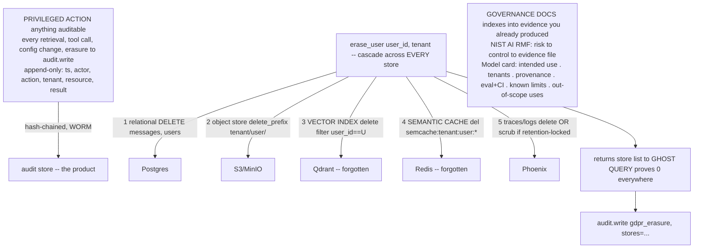

# Lecture: Governance — GDPR Cascade-Delete, Model Card, NIST AI RMF & Audit Log

> Everything before this made the system *work* and *prove* it works. This lecture makes it *defensible* — the closing governance layer that turns a demo into something a regulated enterprise can run. Two engineering artifacts carry the weight: an `erase_user` that treats GDPR erasure as a cascade across **every** store (not just the Postgres row), and an append-only audit log where the trail *is* the product. Around them sit two documents auditors actually ask for — a NIST AI RMF risk table and a model card — each wired to real evidence files you already produced. After this you can design an erasure that a ghost query proves complete, an audit record that survives a compliance review, and a governance skeleton where every risk maps to a control you actually built.

**Prerequisites:** Capstone Week 1 (tenant isolation, tombstone deletes, versioned corpus) · Capstone Week 2 L8 (end-user OAuth scopes) · Capstone Week 3 (gateway, semantic cache) · Capstone Week 4 (eval with CIs, tracing, red-team) · Phase 11 (safety/governance) · Phase 7 (eval) · **Reading time:** ~19 min · **Part of:** Capstone Week 4

---

## The integration problem

You have spent four weeks building controls: server-side tenant filters, tombstone deletes by `doc_id`, HITL-gated writes, per-tenant OAuth scopes, an eval gate with confidence intervals, a red-team suite in CI. Each was designed and tested in isolation. Governance is the week you have to answer a different kind of question — not "does the retrieval work?" but "**prove to a regulator that a user's data is gone, and show me who did what, when.**"

That reframing exposes a gap. Your delete-a-*document* machinery (Week 1) deletes by `doc_id` from Qdrant. But GDPR Article 17 — the right to erasure — is about a **person**, and a person's data is smeared across every store your architecture spawned over four weeks:

- their rows in Postgres (messages, users, the `writes` action log),
- their uploaded files in object storage,
- their **embeddings** in the vector index,
- their **cached answers** in the semantic cache (Week 3),
- their **traces** in the observability backend (Week 4), which — if you were sloppy — contain raw prompts and retrieved context.

The pitfall everyone hits, and the one the pitfalls section of Week 4 calls out explicitly: **delete the Postgres row and call it done.** The embeddings still sit in Qdrant. The cached answers still sit in Redis. Both are still personal data. Both are still a breach. Erasure is not a `DELETE` statement; it is a **cascade** whose correctness you can only assert if you can *enumerate every store that ever touched user data* — and then prove each one is empty.

The second half of the problem is symmetric. In a regulated domain, "the system answered a claims question" is not enough; you need "user U, with scope `kb.read`, retrieved doc D at time T, and the answer was served from tier `strong`." The **audit log is the product** — it is the artifact the compliance officer, not the end user, buys. It has to record *every* privileged action, be append-only (tamper-evident), and be queryable. If your audit story is "we have logs somewhere," you have no audit story.

The governance *documents* — NIST AI RMF risk table, model card — are the third piece. They are not busywork if you wire them correctly: each is an index from a claimed control to the **evidence file** that proves it. That is the difference between governance theater and governance you can defend.

---

## Architecture & how the pieces connect



Three connections make this an *integration*, not a bolt-on:

- **The audit log is the spine that touches every other subsystem.** It is called from the retrieval path (Week 1), the tool/action node (Week 2), the gateway config-change path (Week 3), and `erase_user` itself. The erasure writes an audit row; the audit row is the one thing you do *not* delete during erasure (more on that tension below).
- **The erasure cascade reuses the exact isolation keys you already built.** The vector delete is a filter on `user_id` — the same server-side payload filter that enforces tenant isolation in Week 1. The semantic-cache key is `semcache:{tenant}:{user_id}:*` — the same per-tenant scoping from Week 3's caching lecture. Erasure is cheap *because* your isolation was designed correctly; if `user_id` were not on every point and every cache key, erasure would be impossible.
- **The governance docs point at files, not prose.** The NIST table's "evidence" column links to `test_tenant_isolation.py`, `scorecard.json`, `test_red_team.py`, the audit query output. The model card's eval section is the CI-bounded numbers from Week 4, not hand-typed figures.

---

## Key decisions & tradeoffs

### 1. Erasure is a cascade — enumerate the stores or you cannot be complete

The single design decision that matters: **`erase_user` returns the list of stores it purged**, and that list is checked against a canonical inventory of every store that holds user data. You cannot prove completeness against a store you forgot exists. So the design starts with an inventory, maintained as code:

| Store | What it holds | Purge operation | The trap |
|---|---|---|---|
| Postgres | messages, users, action `writes` | `DELETE ... WHERE user_id` | none — this is the one everyone does |
| Object store | uploaded docs | `delete_prefix(tenant/user/)` | orphaned objects if keys aren't prefixed by user |
| Vector index | embeddings | `delete(filter user_id==U)` | **the forgotten one** — embeddings *are* personal data |
| Semantic cache | cached answers | `del semcache:tenant:user:*` | **the forgotten one** — cached PII/answers persist |
| Traces/logs | prompts, context, IDs | delete OR scrub | may be retention-locked; can't always hard-delete |

The vector index and semantic cache are the two the Week 4 pitfalls single out. An embedding is a lossy but real projection of the source text — courts and regulators treat it as personal data. A cached answer can contain the person's own PII verbatim. Deleting the Postgres row while these persist is textbook non-compliance.

**Tradeoff — hard-delete vs scrub for retention-locked stores.** Traces and audit logs often live under a *conflicting* legal obligation: some regulations require you to *retain* an audit trail for years, even as GDPR requires you to erase the person. You cannot satisfy both with a hard delete. The resolution is **scrub, not delete**: replace PII fields with tombstones (`<ERASED>`) while preserving the structural record (an action happened, at time T, by an actor-hash). Design each store's purge as either delete (default) or scrub (retention-locked), and record which in the returned store list.

### 2. Prove it with a ghost query — 0 rows, 0 points, 0 keys, everywhere

Returning a store list is a *claim*. The proof is a **ghost query**: after `erase_user`, query every store for the user and assert nothing comes back.

```python
def test_gdpr_ghost():
    erase_user("u_42", "acme")
    assert pg.count("users", "id=%s", ("u_42",)) == 0
    assert pg.count("messages", "user_id=%s", ("u_42",)) == 0
    assert qdrant.count("acme", filter_user="u_42") == 0        # the point people miss
    assert redis.keys("semcache:acme:u_42:*") == []             # and this one
    assert object_store.list(prefix="acme/u_42/") == []
    # traces: either 0, or every remaining span's PII fields == "<ERASED>"
```

The ghost query is the erasure analog of Week 1's delete-proof test. It must hit *every* store in the inventory, not the convenient ones. A ghost query that checks only Postgres is the automated version of the exact pitfall it is meant to catch.

**Ordering matters under partial failure.** If `erase_user` deletes Postgres first and crashes before Qdrant, you have orphaned embeddings with no owning row — undetectable later because the join key is gone. Design the cascade to be **re-runnable and idempotent**: delete-by-filter is naturally idempotent (deleting nothing twice is fine), so a failed erasure can simply be retried whole. Log each store as it completes so a crash is diagnosable, and only write the final `gdpr_erasure` audit row after all stores report clean.

### 3. The audit log: append-only, every privileged action, the trail is the product

The record shape is fixed and minimal: **`(ts, actor, action, tenant, resource, result)`**. `actor` is the *end user* (from the OAuth `sub` claim of Week 2 L8), never "the agent" — "the agent did it" is not an answer a regulator accepts. `resource` is what was touched (doc ID, tool name, config key, erased user). `result` is success/denied/error.

What counts as a privileged action — log *all* of these:

- every **retrieval** (which tenant queried, which doc IDs returned),
- every **tool call** and every **action** (especially HITL-approved writes — log the approver too),
- every **erasure**,
- every **config change** (gateway model swap, flag flip, threshold edit),
- every **authorization decision**, including the denials (a 403 is audit-relevant).

**Append-only is a design constraint, not a wish.** "Append-only" in application code that issues `UPDATE`/`DELETE` is a lie. Enforce it below the app:

- **Hash-chain** each record (`hash_n = H(record_n || hash_{n-1})`) so any post-hoc edit or deletion breaks the chain and is detectable — the same tamper-evidence idea as a blockchain, without the blockchain.
- Back it with a store that supports **WORM / immutability** (S3 Object Lock, an append-only table with `REVOKE UPDATE, DELETE`, or a managed audit service).
- The role writing audit rows has **INSERT only** — mirror the read-only-role discipline from Week 2's DB-scope design, inverted.

**The tension with erasure.** GDPR says erase the person; audit integrity says never mutate the log. The audit log is exactly the retention-locked store from decision #1: you **scrub the PII fields inside audit records** (replace the actor's identifying data with a stable pseudonymous hash, blank the resource payload) while leaving the hash-chained structural record intact. The record "an erasure happened for user-hash X at T" *is itself* required evidence of GDPR compliance — deleting it would destroy the proof that you complied.

### 4. Governance docs as an evidence index, not prose

**NIST AI RMF** (functions Govern / Map / Measure / Manage) is a skeleton, not a checklist to recite. The one high-value move: make it a table with a column that points at a real file.

| Function | Risk | Your control | Evidence file |
|---|---|---|---|
| Map | Cross-tenant data leak | Server-side payload filter on `tenant_id` | `tests/test_tenant_isolation.py` (green) |
| Manage | Indirect prompt injection / exfiltration | Untrusted-content spotlighting + egress allowlist | `security/red_team/test_red_team.py` (0 exfil) |
| Measure | Silent quality regression | Eval gate with bootstrap CIs, ship rule | `eval/scorecard.json`, CI run link |
| Manage | Unerasable personal data | `erase_user` cascade + ghost query | `security/gdpr_delete.py`, `test_gdpr_ghost` |
| Govern | Untraceable privileged actions | Append-only hash-chained audit log | `security/audit_log.py`, sample query |

A risk with no control column is a gap you must close before shipping. A control with no evidence file is a claim you cannot defend. This table *is* the ship/no-ship governance gate.

**The model card** (Mitchell et al.) documents, honestly: intended use; the tenants/domains it serves; data provenance (which corpus version — the DVC hash from Week 1); **eval scores *with* their confidence intervals** (copied from `scorecard.json`, CIs included — a bare mean is the exact anti-pattern Week 4 warns against); known limits; and **out-of-scope uses** (the card's most-skipped, most-important section — "not for clinical diagnosis," "not validated below corpus size N"). The out-of-scope list is your liability shield: it is where you state, in writing, what the system was never built to do.

---

## How it fails in production & how to prevent it

- **Erasure forgets a store.** The vector index and semantic cache are the usual victims; embeddings and cached answers persist as personal data. **Prevention:** maintain the store inventory as code, make `erase_user` return the purged list, and run a ghost query across *every* store in the inventory in CI. If a new store is added later, adding it to the inventory forces the ghost query to check it.
- **Ghost query checks only Postgres.** The test passes, the breach persists. **Prevention:** the ghost query must assert 0 in the vector index and 0 keys in the cache explicitly — the two lines everyone omits.
- **Audit log is mutable.** An `UPDATE`/`DELETE` grant on the audit table, or app code that "cleans up" rows, means the trail can be silently altered — worthless to an auditor. **Prevention:** hash-chain records, INSERT-only role, WORM backing store; test that an attempted update breaks the chain.
- **Audit records name "the agent" as actor.** The trail says the system acted but not *who authorized it*. **Prevention:** `actor` = OAuth `sub` of the end user (and the approver for HITL writes); reject audit writes with a null actor.
- **Erasure destroys its own proof.** Someone "completes" erasure by also deleting the audit record of the erasure — now you cannot prove you complied, and you may have violated a separate retention obligation. **Prevention:** scrub PII inside the audit record, never delete the structural row; the `gdpr_erasure` entry is retained evidence.
- **PII leaks into traces, then erasure can't fully scrub it.** If Week 4's redact-before-`set_attribute` step was skipped, traces are a PII lake and erasure has to scrub free-text span attributes it can't reliably parse. **Prevention:** redact at write time (Week 4 Step 6) so traces hold IDs, not raw PII — erasure then only has to delete/scrub by ID.
- **Governance doc claims a control that isn't tested.** The NIST table says "injection defended" but no red-team test backs it. **Prevention:** every control row links to a green test/artifact; a broken link fails the governance review.

---

## Checklist / cheat sheet

**GDPR cascade-delete:**
- [ ] Store inventory maintained as code: relational, object, **vector index**, **semantic cache**, traces/logs.
- [ ] `erase_user` returns the list of purged stores.
- [ ] Vector delete = filter on `user_id`; cache delete = `semcache:{tenant}:{user_id}:*`.
- [ ] Retention-locked stores (traces, audit) **scrub** PII, don't hard-delete.
- [ ] Idempotent / re-runnable cascade; final `gdpr_erasure` audit row only after all stores clean.
- [ ] **Ghost query** asserts 0 rows / 0 points / 0 keys in *every* store, in CI.

**Audit log:**
- [ ] Shape: `ts, actor, action, tenant, resource, result`.
- [ ] `actor` = end-user OAuth `sub` (+ approver for HITL), never "the agent."
- [ ] Logs *every* privileged action: retrieval, tool call, action, erasure, config change, authz denial.
- [ ] Append-only: hash-chained, INSERT-only role, WORM store.
- [ ] Erasure scrubs PII *inside* audit records; never deletes the structural row.

**Governance docs:**
- [ ] NIST AI RMF table: each risk → control → **evidence file** (green test / artifact).
- [ ] Model card: intended use · tenants · provenance (corpus hash) · eval scores **with CIs** · known limits · **out-of-scope uses**.

**One-line mental model:** *Erasure is a cascade you prove with a ghost query; the audit log is append-only and it's the product; governance docs are an index from control to evidence.*

---

## Connect to the build

This lecture backs the Week 4 Definition-of-Done bullets directly:

- **GDPR:** `erase_user` returns a store list covering Postgres, object store, **vector index**, **semantic cache**, and traces; the ghost-query test returns **0 rows/points/keys** everywhere.
- **Governance:** `model_card.md` and `nist_ai_rmf.md` (every mapped risk has a control + evidence link), and an append-only `audit_log` with entries for at least one tool call and one erasure.

And it closes the loop with the **final milestone**:

- The **threat-model diagram** (`docs/diagrams/threat-model.mmd`) maps each threat to a control you *actually built* — the NIST table from this lecture is that mapping in tabular form, and both should agree.
- **CI fails the PR** on a successful injection or an over-refusal spike — the red-team suite (Week 4 Step 7) and the governance evidence links are the same artifacts; a broken control is a red build, not a stale doc.
- The audit log satisfies the milestone acceptance criterion that "every retrieval and tool call writes an audit record," and the erasure cascade satisfies the data-layer isolation and delete-provability criteria carried forward from Week 1.

Governance is the artifact that turns your green tests into a story a hiring manager or an auditor believes is production — because the evidence is one click away from every claim.

---

## Going deeper (optional)

- **NIST AI Risk Management Framework 1.0** — search "NIST AI RMF 1.0 pdf" — the Govern/Map/Measure/Manage functions and the companion Playbook.
- **Model Cards for Model Reporting** — Mitchell et al., 2019 — search "Mitchell model cards for model reporting" — the original schema (intended use, factors, metrics, limits).
- **GDPR Article 17** — the right-to-erasure text itself; and the EDPB guidance on erasure — search "GDPR Article 17 right to erasure EDPB".
- **OWASP Top 10 for LLM Applications 2025** — `genai.owasp.org` — sensitive-information-disclosure and logging risks that motivate PII-scrubbed traces and audit trails.
- **Capstone Week 1** (tombstone delete-by-filter, tenant isolation) and **Week 3 caching lecture** (per-tenant `semcache` keys) in this study plan — the isolation keys that make the erasure cascade cheap.
- **Capstone Week 2 L8** (end-user OAuth scopes) — where the audit `actor` comes from.

---

## Check yourself

1. A user files a GDPR erasure request. Your engineer runs `DELETE FROM users WHERE id=$u` and closes the ticket. Name the two stores most likely still holding that user's personal data, why each still counts as a breach, and the one test that would have caught the miss.
2. Your audit table has an `UPDATE` grant for the app role "so we can fix typos." Why does this destroy the audit log's value, and what two mechanisms make a log genuinely append-only?
3. GDPR says erase the person; a separate regulation says retain the audit trail for 7 years. These conflict for the audit store. Resolve it — what exactly happens to an audit record during erasure, and why must the `gdpr_erasure` record itself survive?
4. Your NIST AI RMF doc lists "cross-tenant leak" with control "server-side tenant filter." A reviewer asks you to prove it. What do you point at, and what would make this row a *gap* instead of a defended control?
5. In an audit record for an HITL-approved write action, what does `actor` contain, and why is "the agent" a non-answer in a regulated domain?

### Answer key

1. The **vector index** (embeddings — a real, court-recognized projection of the source text) and the **semantic cache** (cached answers containing the user's PII verbatim). Both remain queryable personal data after the Postgres row is gone, so both are ongoing breaches. The **ghost query** (`test_gdpr_ghost`) catches it — *if* it asserts 0 points in Qdrant and 0 `semcache:{tenant}:{user}:*` keys, not just 0 Postgres rows.
2. An `UPDATE`/`DELETE` grant means any record can be silently altered after the fact, so the log proves nothing to an auditor — tamper-evidence is the whole point. Make it genuinely append-only with (a) a **hash chain** (`hash_n = H(record_n || hash_{n-1})`) so any edit breaks the chain detectably, and (b) an **INSERT-only role + WORM backing store** (S3 Object Lock or `REVOKE UPDATE, DELETE`).
3. **Scrub, don't delete.** Replace the PII fields inside the audit record with tombstones/pseudonymous hashes while keeping the hash-chained structural row intact. The `gdpr_erasure` record must survive because it is the *evidence that you complied* with the erasure request — deleting it would both destroy that proof and violate the retention obligation.
4. Point at the **green `tests/test_tenant_isolation.py`** (the evidence file in the RMF table's evidence column), which adversarially issues a tenant-A query for tenant-B content and returns zero B docs. It becomes a **gap** if there is no control column entry, or the evidence link points at a test that is skipped/red/nonexistent — a claim with no runnable proof.
5. `actor` contains the **end user's OAuth `sub`** (from Week 2 L8's scoped token) — and for an HITL write, also the **approver's** identity. "The agent did it" is a non-answer because least-privilege and accountability in a regulated domain require attributing every privileged action to a *human* with the scope that authorized it; an auditor needs "user U with `action.write`, approved by A, at T," not "the system."
